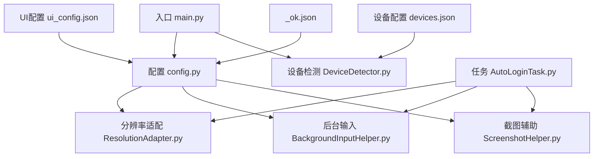
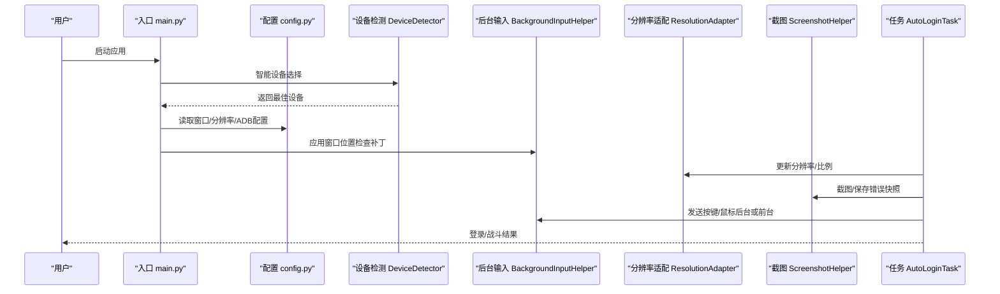
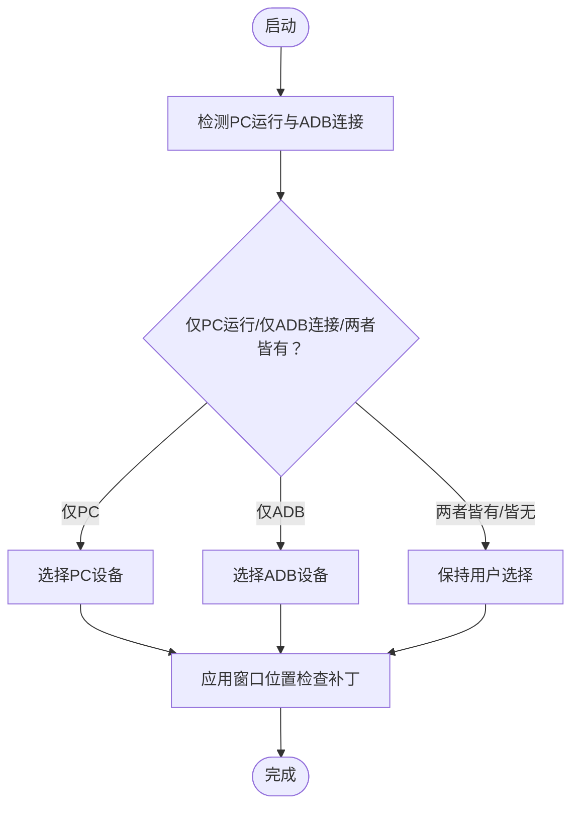
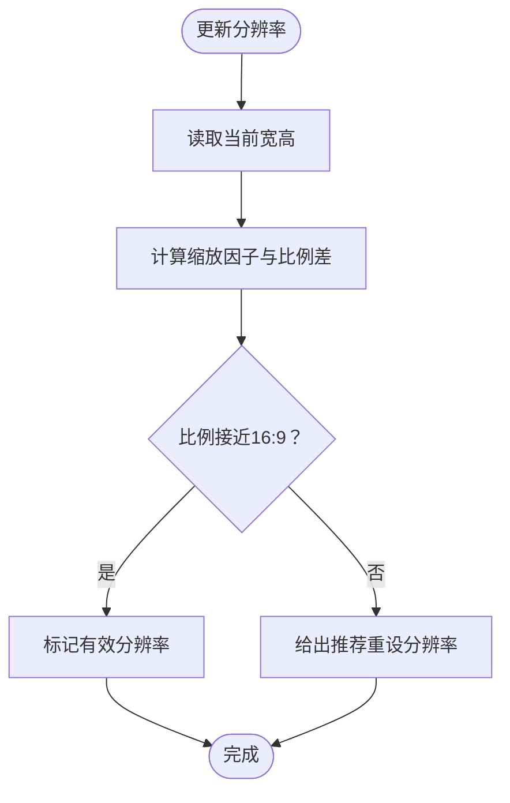
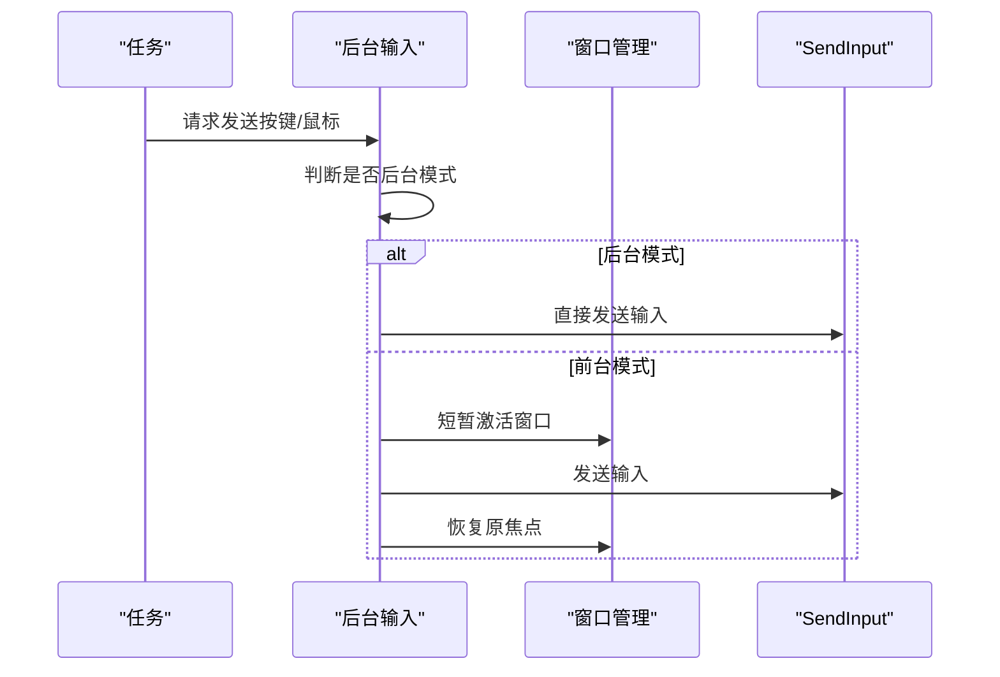
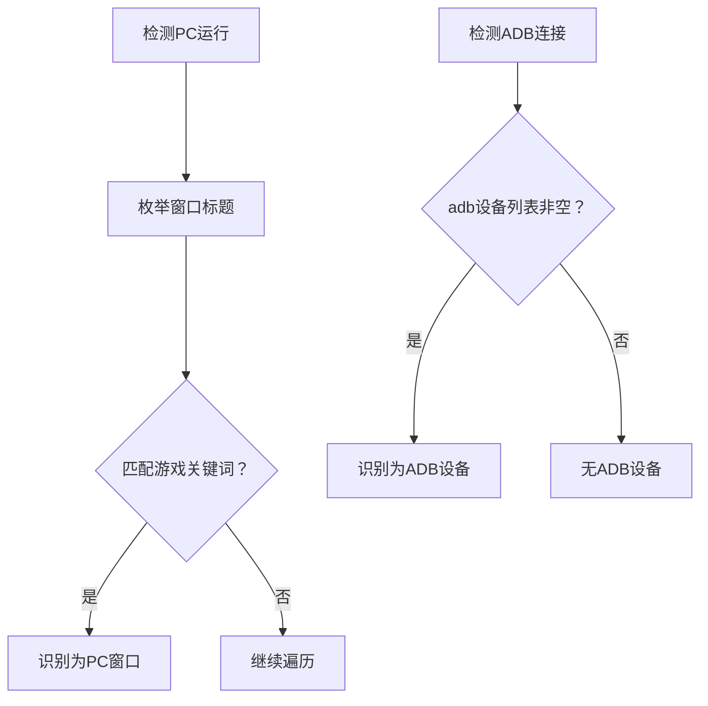
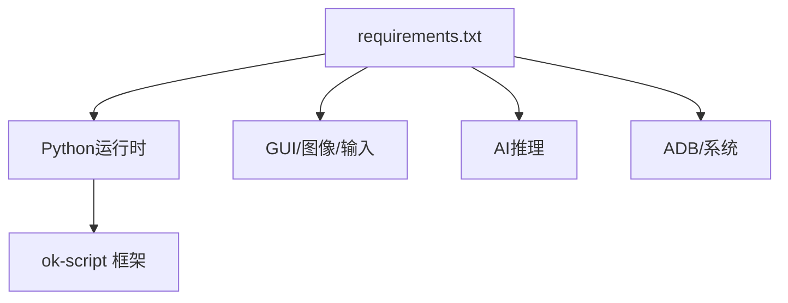

# 兼容性问题

<cite>
**本文引用的文件**
- [main.py](file://main.py)
- [config.py](file://config.py)
- [requirements.txt](file://requirements.txt)
- [src/utils/DeviceDetector.py](file://src/utils/DeviceDetector.py)
- [src/utils/ResolutionAdapter.py](file://src/utils/ResolutionAdapter.py)
- [src/utils/BackgroundInputHelper.py](file://src/utils/BackgroundInputHelper.py)
- [src/utils/ScreenshotHelper.py](file://src/utils/ScreenshotHelper.py)
- [src/task/AutoLoginTask.py](file://src/task/AutoLoginTask.py)
- [configs/devices.json](file://configs/devices.json)
- [configs/_ok.json](file://configs/_ok.json)
- [configs/ui_config.json](file://configs/ui_config.json)
- [tests/test_autologin_task.py](file://tests/test_autologin_task.py)
</cite>

## 目录
1. [简介](#简介)
2. [项目结构](#项目结构)
3. [核心组件](#核心组件)
4. [架构总览](#架构总览)
5. [详细组件分析](#详细组件分析)
6. [依赖分析](#依赖分析)
7. [性能考虑](#性能考虑)
8. [故障排除指南](#故障排除指南)
9. [结论](#结论)
10. [附录](#附录)

## 简介
本指南聚焦于OK-Jump在多操作系统、多游戏版本、多模拟器环境中的兼容性问题与解决方案，覆盖分辨率适配、窗口模式、权限模型、系统API变化、安全策略更新、第三方软件冲突等技术挑战，并提供跨平台部署、版本升级、依赖库兼容性的实操建议。

## 项目结构
OK-Jump采用模块化组织，核心围绕“配置驱动 + 任务编排 + 工具集”的结构展开：
- 入口与启动：main.py负责智能设备选择、窗口位置检查补丁、OK框架初始化
- 配置中心：config.py集中定义窗口交互、ADB、OCR、模板匹配、分辨率、窗口尺寸等
- 工具集：
  - 设备检测：DeviceDetector（基于Win32枚举窗口与ADB设备列表）
  - 分辨率适配：ResolutionAdapter（16:9比例、参考分辨率、缩放与推荐重设）
  - 后台输入：BackgroundInputHelper（SendInput/前台切换双模式）
  - 截图辅助：ScreenshotHelper（截图保存、特征模板导出）
- 任务层：AutoLoginTask等任务基于工具集与配置执行登录/战斗等自动化流程

图表来源
- [main.py:1-107](file://main.py#L1-L107)
- [config.py:68-148](file://config.py#L68-L148)
- [src/utils/DeviceDetector.py:11-149](file://src/utils/DeviceDetector.py#L11-L149)
- [src/utils/ResolutionAdapter.py:4-163](file://src/utils/ResolutionAdapter.py#L4-L163)
- [src/utils/BackgroundInputHelper.py:99-841](file://src/utils/BackgroundInputHelper.py#L99-L841)
- [src/utils/ScreenshotHelper.py:7-68](file://src/utils/ScreenshotHelper.py#L7-L68)
- [src/task/AutoLoginTask.py:21-100](file://src/task/AutoLoginTask.py#L21-L100)
- [configs/devices.json:1-7](file://configs/devices.json#L1-L7)
- [configs/ui_config.json:1-17](file://configs/ui_config.json#L1-L17)
- [configs/_ok.json:1-7](file://configs/_ok.json#L1-L7)

章节来源
- [main.py:1-107](file://main.py#L1-L107)
- [config.py:68-148](file://config.py#L68-L148)

## 核心组件
- 智能设备选择与窗口位置检查补丁：在OK框架初始化前，依据PC窗口与ADB设备状态自动选择最佳设备，并允许最小化/屏幕外窗口以支持后台模式
- 分辨率适配：统一16:9比例、参考分辨率与缩放因子，提供推荐重设分辨率与相对坐标换算
- 后台输入：针对Unity游戏的DirectInput/RAW输入模型，提供伪最小化与前台切换两种输入路径，避免窗口前置
- 设备检测：基于Win32枚举窗口标题与ADB设备列表，区分PC版与模拟器，避免误判
- 截图与OCR：统一截图保存、特征模板导出，以及加载界面百分比检测

章节来源
- [main.py:54-95](file://main.py#L54-L95)
- [main.py:29-52](file://main.py#L29-L52)
- [src/utils/ResolutionAdapter.py:4-163](file://src/utils/ResolutionAdapter.py#L4-L163)
- [src/utils/BackgroundInputHelper.py:99-207](file://src/utils/BackgroundInputHelper.py#L99-L207)
- [src/utils/DeviceDetector.py:11-149](file://src/utils/DeviceDetector.py#L11-L149)
- [src/utils/ScreenshotHelper.py:7-68](file://src/utils/ScreenshotHelper.py#L7-L68)

## 架构总览
OK-Jump通过配置驱动的任务执行链路，结合工具集实现跨平台兼容与稳定性保障。

图表来源
- [main.py:99-107](file://main.py#L99-L107)
- [config.py:94-124](file://config.py#L94-L124)
- [src/utils/DeviceDetector.py:113-134](file://src/utils/DeviceDetector.py#L113-L134)
- [src/utils/BackgroundInputHelper.py:199-207](file://src/utils/BackgroundInputHelper.py#L199-L207)
- [src/utils/ResolutionAdapter.py:34-44](file://src/utils/ResolutionAdapter.py#L34-L44)
- [src/utils/ScreenshotHelper.py:17-30](file://src/utils/ScreenshotHelper.py#L17-L30)
- [src/task/AutoLoginTask.py:205-267](file://src/task/AutoLoginTask.py#L205-L267)

## 详细组件分析

### 组件A：智能设备选择与窗口位置检查补丁
- 功能要点
  - 在OK框架初始化前，检测PC版游戏窗口与ADB设备连接状态，自动选择最佳设备
  - 对StartController进行补丁，允许最小化/屏幕外窗口，配合后台模式
- 兼容性影响
  - Windows桌面环境：通过Win32枚举窗口识别游戏进程；ADB设备列表识别模拟器
  - 后台模式：允许窗口最小化或被遮挡，避免Unity游戏因焦点丢失导致输入失效
- 故障排查
  - 若设备选择异常，检查设备配置文件与窗口标题关键词
  - 若后台模式无效，确认补丁是否正确应用与配置项skip_pos_check

图表来源
- [main.py:54-95](file://main.py#L54-L95)
- [src/utils/DeviceDetector.py:113-134](file://src/utils/DeviceDetector.py#L113-L134)

章节来源
- [main.py:54-95](file://main.py#L54-L95)
- [src/utils/DeviceDetector.py:113-134](file://src/utils/DeviceDetector.py#L113-L134)

### 组件B：分辨率适配与窗口尺寸
- 功能要点
  - 统一16:9比例与参考分辨率（1920x1080），计算缩放因子
  - 提供推荐重设分辨率列表，支持自动检测当前比例并给出建议
  - 提供相对/绝对坐标换算，保证不同分辨率下的点击/识别一致性
- 兼容性影响
  - 多显示器/高DPI：通过缩放因子与相对坐标避免误判
  - 非标准分辨率：提供推荐重设，减少识别与点击偏差
- 故障排查
  - 比例不符：查看日志中的比例检查与建议分辨率
  - 点击偏移：确认分辨率更新与缩放因子是否正确

图表来源
- [src/utils/ResolutionAdapter.py:34-44](file://src/utils/ResolutionAdapter.py#L34-L44)
- [src/utils/ResolutionAdapter.py:121-143](file://src/utils/ResolutionAdapter.py#L121-L143)

章节来源
- [src/utils/ResolutionAdapter.py:4-163](file://src/utils/ResolutionAdapter.py#L4-L163)
- [config.py:108-124](file://config.py#L108-L124)

### 组件C：后台输入与窗口交互
- 功能要点
  - 针对Unity游戏的DirectInput/RAW输入模型，提供SendInput与前台切换两种路径
  - 支持伪最小化：窗口移至屏幕外仍保持活动状态，避免前置
  - 自动判断后台模式：伪最小化或窗口在后台时使用SendInput
- 兼容性影响
  - Windows系统：依赖Win32API与AttachThreadInput技巧，需管理员权限或特定安全策略
  - 模拟器：ADB输入与本地窗口输入路径不同，需通过设备选择策略规避
- 故障排查
  - 输入无效：检查后台模式状态与伪最小化开关
  - 窗口前置：确认未强制前台切换，或调整输入模式

图表来源
- [src/utils/BackgroundInputHelper.py:199-207](file://src/utils/BackgroundInputHelper.py#L199-L207)
- [src/utils/BackgroundInputHelper.py:310-357](file://src/utils/BackgroundInputHelper.py#L310-L357)
- [src/utils/BackgroundInputHelper.py:642-708](file://src/utils/BackgroundInputHelper.py#L642-L708)

章节来源
- [src/utils/BackgroundInputHelper.py:99-207](file://src/utils/BackgroundInputHelper.py#L99-L207)
- [src/utils/BackgroundInputHelper.py:310-357](file://src/utils/BackgroundInputHelper.py#L310-L357)
- [src/utils/BackgroundInputHelper.py:642-708](file://src/utils/BackgroundInputHelper.py#L642-L708)

### 组件D：设备检测与ADB连接
- 功能要点
  - 枚举窗口标题，过滤模拟器与工具自身窗口，识别PC版游戏窗口
  - 通过adbutils或系统adb命令检测ADB设备连接状态
- 兼容性影响
  - 模拟器品牌差异：通过关键词匹配识别常见模拟器
  - ADB权限：需正确安装驱动与授权，避免检测失败
- 故障排查
  - 无法识别PC窗口：核对窗口标题关键词与排除词
  - ADB不可用：检查adb服务、驱动与授权

图表来源
- [src/utils/DeviceDetector.py:29-68](file://src/utils/DeviceDetector.py#L29-L68)
- [src/utils/DeviceDetector.py:71-111](file://src/utils/DeviceDetector.py#L71-L111)

章节来源
- [src/utils/DeviceDetector.py:11-149](file://src/utils/DeviceDetector.py#L11-L149)

### 组件E：截图与OCR、加载界面检测
- 功能要点
  - 统一截图保存与特征模板导出，便于调试与训练
  - 加载界面百分比检测：优先使用OCR缓存，其次ROI区域OCR
  - 加载停滞检测：若百分比长时间不变则判定超时
- 兼容性影响
  - OCR引擎与模型：依赖ONNX运行时，不同GPU/DML配置可能影响性能
  - 界面渲染差异：不同显卡驱动/缩放可能导致OCR识别不稳定
- 故障排查
  - 截图为空：确认窗口可截图（后台模式下的伪最小化）
  - OCR失败：检查模型路径与阈值，必要时调整ROI区域

章节来源
- [src/utils/ScreenshotHelper.py:17-68](file://src/utils/ScreenshotHelper.py#L17-L68)
- [src/task/AutoLoginTask.py:324-402](file://src/task/AutoLoginTask.py#L324-L402)
- [src/task/AutoLoginTask.py:403-456](file://src/task/AutoLoginTask.py#L403-L456)

## 依赖分析
- Python运行时与GUI：PySide6系列、OpenCV、NumPy
- 输入与ADB：pywin32、psutil、pydirectinput、adbutils
- AI推理：onnxruntime、onnxruntime-directml、opencc
- 日志与打包：ok-script（框架）

图表来源
- [requirements.txt:1-14](file://requirements.txt#L1-L14)

章节来源
- [requirements.txt:1-14](file://requirements.txt#L1-L14)

## 性能考虑
- CPU/GPU占用：通过触发间隔配置与后台模式降低资源消耗
- OCR与推理：合理设置阈值与ROI，避免频繁全屏OCR
- 截图频率：在后台模式下尽量减少不必要的截图与OCR调用
- ADB与窗口枚举：避免高频调用，必要时缓存状态

## 故障排除指南

### 1. 操作系统与窗口模式兼容性
- 症状：窗口最小化或被遮挡后输入失效
  - 解决：启用后台模式与伪最小化，确保窗口可截图
  - 参考：后台输入助手的后台模式判断与伪最小化检测
- 症状：窗口位置检查报错“最小化或超出屏幕”
  - 解决：开启配置项skip_pos_check，允许最小化/屏幕外窗口
  - 参考：StartController补丁逻辑

章节来源
- [src/utils/BackgroundInputHelper.py:177-207](file://src/utils/BackgroundInputHelper.py#L177-L207)
- [main.py:29-52](file://main.py#L29-L52)

### 2. 分辨率与缩放适配
- 症状：点击/识别位置偏移
  - 解决：更新分辨率信息，使用缩放因子与相对坐标换算
  - 参考：分辨率适配器的比例检查与推荐重设
- 症状：比例非16:9导致识别不稳定
  - 解决：按建议重设分辨率，或调整模板匹配阈值

章节来源
- [src/utils/ResolutionAdapter.py:107-143](file://src/utils/ResolutionAdapter.py#L107-L143)
- [config.py:108-124](file://config.py#L108-L124)

### 3. 设备选择与模拟器兼容性
- 症状：PC版与模拟器同时运行导致设备选择冲突
  - 解决：使用智能设备选择，仅在单一环境运行
  - 参考：设备检测器的窗口标题关键词与ADB设备列表
- 症状：ADB设备未识别
  - 解决：检查adb服务、驱动与授权；回退到系统adb命令检测

章节来源
- [src/utils/DeviceDetector.py:19-26](file://src/utils/DeviceDetector.py#L19-L26)
- [src/utils/DeviceDetector.py:71-111](file://src/utils/DeviceDetector.py#L71-L111)

### 4. 输入模型与权限差异
- 症状：Unity游戏按键无响应
  - 解决：使用SendInput路径，避免PostMessage；确保后台模式启用
  - 参考：后台输入助手的输入模式与SendInput路径
- 症状：管理员权限不足导致窗口激活失败
  - 解决：以管理员身份运行；检查安全策略与UAC设置

章节来源
- [src/utils/BackgroundInputHelper.py:199-207](file://src/utils/BackgroundInputHelper.py#L199-L207)
- [config.py:94-101](file://config.py#L94-L101)

### 5. 系统API变化与安全策略更新
- 症状：新系统版本输入API行为变化
  - 解决：保持SendInput路径；必要时调整输入延迟与坐标归一化
- 症状：安全软件拦截自动化输入
  - 解决：将工具加入白名单；调整安全软件策略

章节来源
- [src/utils/BackgroundInputHelper.py:506-510](file://src/utils/BackgroundInputHelper.py#L506-L510)

### 6. 第三方软件冲突
- 症状：杀毒/安全软件阻止输入或截图
  - 解决：添加工具到信任列表；关闭冲突功能或更换软件
- 症状：其他自动化工具抢占输入焦点
  - 解决：避免同时运行多个自动化工具；使用独立会话

章节来源
- [src/utils/BackgroundInputHelper.py:235-238](file://src/utils/BackgroundInputHelper.py#L235-L238)

### 7. 跨平台部署与版本升级
- 部署建议
  - Windows：确保adb驱动与模拟器授权；安装DirectML运行时以提升推理性能
  - 依赖隔离：使用虚拟环境安装requirements.txt
- 升级策略
  - 逐步升级：先升级框架与依赖，再验证登录/战斗流程
  - 回滚机制：保留旧版本配置与模型，快速回退
- 依赖库兼容性
  - ONNXRuntime/DirectML：确保版本匹配；必要时切换CPU推理
  - OpenCV/Numpy：注意版本兼容性，避免二进制不匹配

章节来源
- [requirements.txt:1-14](file://requirements.txt#L1-L14)
- [config.py:81-87](file://config.py#L81-L87)

### 8. 实际应用场景
- 自动登录流程中的加载界面检测与停滞处理
  - 症状：加载界面卡住
  - 解决：启用加载检测与停滞超时，保存错误截图并重试
- 账号输入与OCR校验
  - 症状：输入后校验失败
  - 解决：多次重试、OCR校验、保存错误截图定位问题

章节来源
- [src/task/AutoLoginTask.py:324-402](file://src/task/AutoLoginTask.py#L324-L402)
- [src/task/AutoLoginTask.py:403-456](file://src/task/AutoLoginTask.py#L403-L456)
- [tests/test_autologin_task.py:302-349](file://tests/test_autologin_task.py#L302-L349)

## 结论
OK-Jump通过配置驱动与工具集实现了对多操作系统、多游戏版本、多模拟器环境的兼容性保障。核心在于：智能设备选择、分辨率适配、后台输入路径、设备检测与加载界面检测。遵循本文的故障排除策略与部署建议，可在复杂环境中稳定运行并快速定位问题。

## 附录
- 配置文件参考
  - 设备配置：devices.json
  - UI配置：ui_config.json
  - OK框架窗口布局：_ok.json
- 测试用例参考
  - 登录流程与账号输入的单元测试，覆盖多种边界场景

章节来源
- [configs/devices.json:1-7](file://configs/devices.json#L1-L7)
- [configs/ui_config.json:1-17](file://configs/ui_config.json#L1-L17)
- [configs/_ok.json:1-7](file://configs/_ok.json#L1-L7)
- [tests/test_autologin_task.py:1-407](file://tests/test_autologin_task.py#L1-L407)