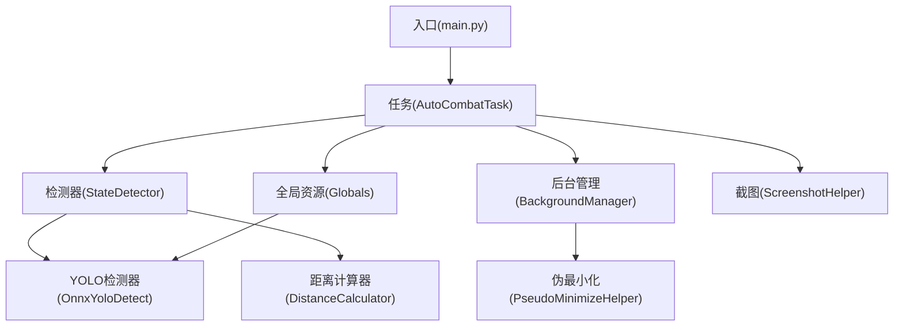
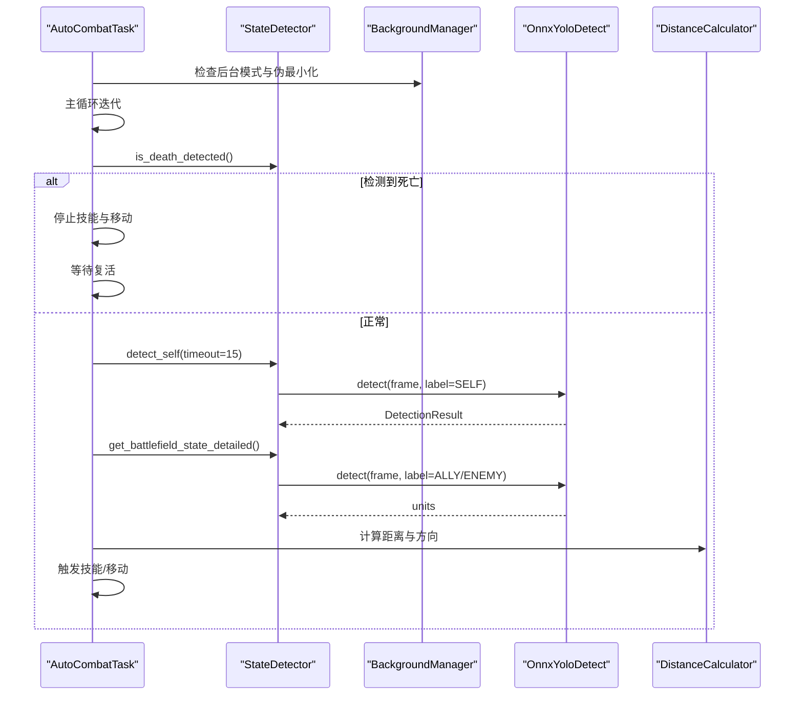
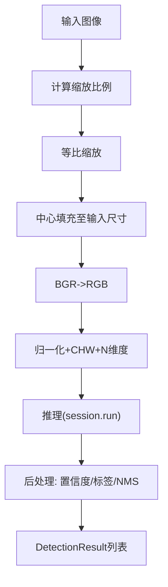
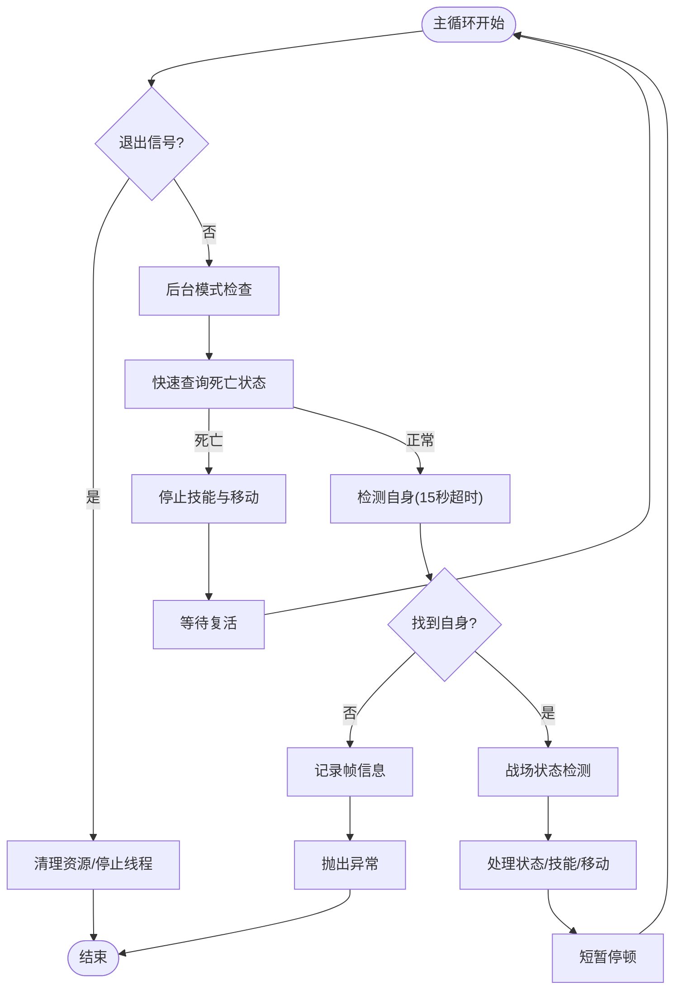
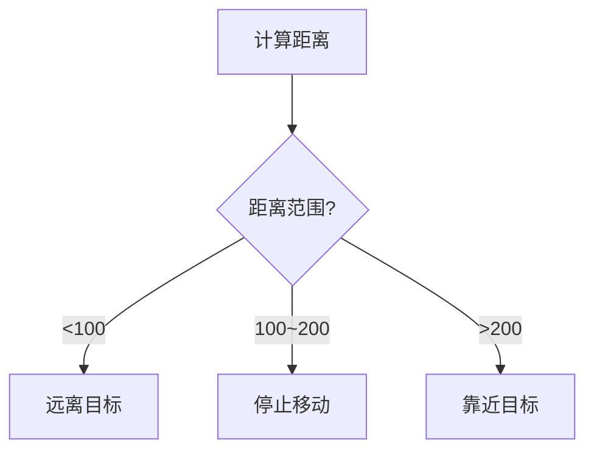
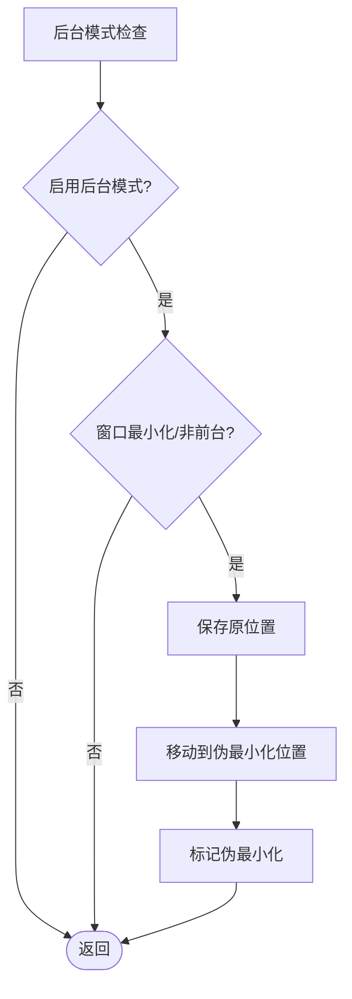
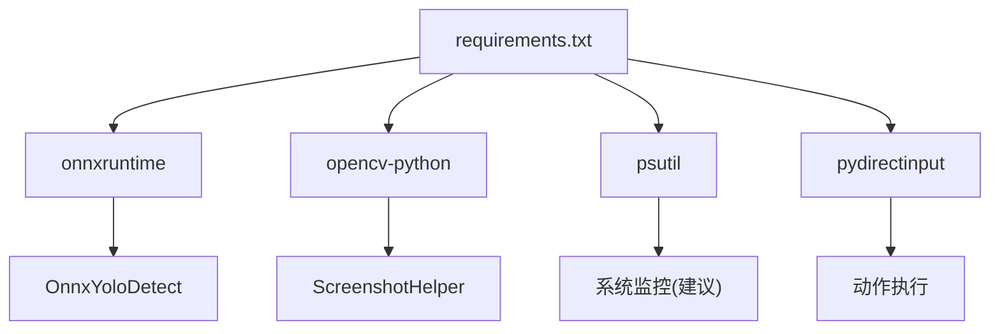

# 性能问题

<cite>
**本文引用的文件**
- [main.py](file://main.py)
- [OnnxYoloDetect.py](file://src/OnnxYoloDetect.py)
- [ScreenshotHelper.py](file://src/utils/ScreenshotHelper.py)
- [AutoCombatTask.py](file://src/task/AutoCombatTask.py)
- [state_detector.py](file://src/combat/state_detector.py)
- [BackgroundManager.py](file://src/utils/BackgroundManager.py)
- [PseudoMinimizeHelper.py](file://src/utils/PseudoMinimizeHelper.py)
- [distance_calculator.py](file://src/combat/distance_calculator.py)
- [globals.py](file://src/globals.py)
- [requirements.txt](file://requirements.txt)
- [Basic Options.json](file://configs/Basic Options.json)
- [自动战斗系统流程图.md](file://docs/自动战斗系统流程图.md)
</cite>

## 目录
1. [简介](#简介)
2. [项目结构](#项目结构)
3. [核心组件](#核心组件)
4. [架构总览](#架构总览)
5. [详细组件分析](#详细组件分析)
6. [依赖分析](#依赖分析)
7. [性能考量](#性能考量)
8. [故障排除指南](#故障排除指南)
9. [结论](#结论)
10. [附录](#附录)

## 简介
本指南聚焦于OK-Jump在自动战斗场景中的性能问题，围绕CPU占用过高、内存泄漏、帧率下降等常见问题，结合项目现有实现，给出系统化的诊断与优化策略。内容涵盖YOLO模型推理优化、截图频率调整、并行处理优化、后台运行性能、多线程同步与资源清理等主题，并提供可视化流程图帮助定位瓶颈。

## 项目结构
OK-Jump采用模块化组织，核心路径如下：
- 入口与框架集成：main.py
- 检测与推理：src/OnnxYoloDetect.py、src/globals.py
- 任务与战斗逻辑：src/task/AutoCombatTask.py、src/combat/state_detector.py、src/combat/distance_calculator.py
- 截图与资源：src/utils/ScreenshotHelper.py、src/utils/BackgroundManager.py、src/utils/PseudoMinimizeHelper.py
- 配置：configs/Basic Options.json
- 文档：docs/自动战斗系统流程图.md
- 依赖：requirements.txt

图表来源
- [main.py:1-107](file://main.py#L1-L107)
- [AutoCombatTask.py:1-693](file://src/task/AutoCombatTask.py#L1-L693)
- [state_detector.py:1-446](file://src/combat/state_detector.py#L1-L446)
- [OnnxYoloDetect.py:1-315](file://src/OnnxYoloDetect.py#L1-L315)
- [distance_calculator.py:1-197](file://src/combat/distance_calculator.py#L1-L197)
- [BackgroundManager.py:1-155](file://src/utils/BackgroundManager.py#L1-L155)
- [PseudoMinimizeHelper.py:1-238](file://src/utils/PseudoMinimizeHelper.py#L1-L238)
- [ScreenshotHelper.py:1-68](file://src/utils/ScreenshotHelper.py#L1-L68)
- [globals.py:1-257](file://src/globals.py#L1-L257)

章节来源
- [main.py:1-107](file://main.py#L1-L107)
- [requirements.txt:1-14](file://requirements.txt#L1-L14)

## 核心组件
- YOLO检测器：封装ONNXRuntime推理，支持CPU/GPU执行提供者，预处理与后处理流水线。
- 全局资源管理器：延迟加载YOLO模型，提供OCR缓存与全局状态，便于跨模块共享。
- 战斗状态检测器：并行死亡检测线程，同步/异步检测自身与敌我单位，状态机驱动主循环。
- 距离计算器：带滞回与缓冲区的距离判断，避免边界抖动，指导移动控制。
- 后台管理与伪最小化：在窗口最小化或非前台时，将窗口移动至屏幕外以维持后台截图能力。
- 截图助手：保存截图与特征模板，支持COCO标注生成辅助。

章节来源
- [OnnxYoloDetect.py:17-315](file://src/OnnxYoloDetect.py#L17-L315)
- [globals.py:16-257](file://src/globals.py#L16-L257)
- [state_detector.py:24-446](file://src/combat/state_detector.py#L24-L446)
- [distance_calculator.py:14-197](file://src/combat/distance_calculator.py#L14-L197)
- [BackgroundManager.py:7-155](file://src/utils/BackgroundManager.py#L7-L155)
- [PseudoMinimizeHelper.py:13-238](file://src/utils/PseudoMinimizeHelper.py#L13-L238)
- [ScreenshotHelper.py:7-68](file://src/utils/ScreenshotHelper.py#L7-L68)

## 架构总览
自动战斗主循环通过并行死亡检测与YOLO检测驱动，结合距离控制与技能调度，形成闭环。后台模式下通过伪最小化维持截图可用性，全局资源管理器统一模型与缓存。

图表来源
- [AutoCombatTask.py:197-271](file://src/task/AutoCombatTask.py#L197-L271)
- [state_detector.py:102-184](file://src/combat/state_detector.py#L102-L184)
- [OnnxYoloDetect.py:234-258](file://src/OnnxYoloDetect.py#L234-L258)
- [distance_calculator.py:52-158](file://src/combat/distance_calculator.py#L52-L158)

## 详细组件分析

### YOLO推理与预处理
- 执行提供者：优先尝试CUDAExecutionProvider，回退CPUExecutionProvider，降低CPU压力。
- 输入尺寸：默认640x640，按宽高比缩放并中心填充，BGR->RGB归一化，NCHW格式。
- 后处理：输出转置、置信度过滤、标签过滤、NMS抑制，返回DetectionResult。
- 全局模型：延迟加载，首次使用时构建推理会话；支持重置以释放内存。

图表来源
- [OnnxYoloDetect.py:68-108](file://src/OnnxYoloDetect.py#L68-L108)
- [OnnxYoloDetect.py:110-186](file://src/OnnxYoloDetect.py#L110-L186)
- [OnnxYoloDetect.py:234-258](file://src/OnnxYoloDetect.py#L234-L258)

章节来源
- [OnnxYoloDetect.py:17-315](file://src/OnnxYoloDetect.py#L17-L315)
- [globals.py:202-257](file://src/globals.py#L202-L257)

### 并行死亡检测与主循环
- 死亡检测线程：每30ms轮询一次，连续两次确认死亡，连续三次确认复活，避免误判。
- 主循环：每50ms左右迭代一次，后台模式下检查并自动伪最小化，快速查询死亡状态，超时15秒内检测自身，异常时记录帧信息并清理资源。

图表来源
- [AutoCombatTask.py:197-271](file://src/task/AutoCombatTask.py#L197-L271)
- [state_detector.py:118-184](file://src/combat/state_detector.py#L118-L184)

章节来源
- [AutoCombatTask.py:84-134](file://src/task/AutoCombatTask.py#L84-L134)
- [state_detector.py:70-184](file://src/combat/state_detector.py#L70-L184)

### 距离控制与移动方向
- 距离范围：100~200像素，带滞回缓冲区，避免边界抖动。
- 方向决策：根据当前状态与距离阈值返回“靠近”、“远离”或“停止”。

图表来源
- [distance_calculator.py:84-158](file://src/combat/distance_calculator.py#L84-L158)

章节来源
- [distance_calculator.py:14-197](file://src/combat/distance_calculator.py#L14-L197)

### 后台运行与伪最小化
- 后台模式：通过配置开关与前台窗口检测，判断是否处于后台。
- 伪最小化：当窗口最小化或非前台时，将窗口移动到(-32000,-32000)以维持后台截图能力，同时保存原位置以便恢复。

图表来源
- [BackgroundManager.py:101-121](file://src/utils/BackgroundManager.py#L101-L121)
- [PseudoMinimizeHelper.py:123-163](file://src/utils/PseudoMinimizeHelper.py#L123-L163)

章节来源
- [BackgroundManager.py:1-155](file://src/utils/BackgroundManager.py#L1-155)
- [PseudoMinimizeHelper.py:1-238](file://src/utils/PseudoMinimizeHelper.py#L1-L238)

## 依赖分析
- ONNXRuntime：提供GPU/CPU执行提供者，直接影响推理性能与CPU占用。
- OpenCV：图像预处理与写入截图，影响I/O与CPU负载。
- psutil：可用于系统资源监控（建议在调试阶段引入）。
- PyDirectInput：按键输入，避免GUI交互带来的额外开销。

图表来源
- [requirements.txt:1-14](file://requirements.txt#L1-L14)
- [OnnxYoloDetect.py:11-14](file://src/OnnxYoloDetect.py#L11-L14)
- [ScreenshotHelper.py:4](file://src/utils/ScreenshotHelper.py#L4)

章节来源
- [requirements.txt:1-14](file://requirements.txt#L1-L14)

## 性能考量
- 推理路径优化
  - 执行提供者：确保CUDAExecutionProvider可用，必要时回退CPUExecutionProvider，避免CPU过载。
  - 输入尺寸：固定640x640，预处理成本稳定；如场景复杂可考虑动态裁剪或降采样。
  - 后处理：NMS与置信度过滤在主循环高频调用，应尽量减少不必要的重复计算。
- 截图与帧率
  - 主循环约50ms一次，死亡检测线程约30ms一次，整体帧率约20Hz，兼顾实时性与负载。
  - 截图频率可通过主循环节流参数调节，避免过度截图导致I/O与CPU压力。
- 并行与同步
  - 死亡检测使用线程+锁，避免主线程阻塞；注意锁粒度与共享变量访问频率。
  - 距离计算与方向决策轻量，但应避免在高频循环中重复计算相同距离。
- 后台运行
  - 伪最小化减少窗口管理开销，但需确保窗口位置恢复，避免影响用户体验。
- 资源管理
  - 全局模型延迟加载，支持重置释放内存；OCR缓存按TTL清理，避免长期驻留。

[本节为通用性能讨论，无需具体文件引用]

## 故障排除指南

### CPU占用过高
- 症状
  - 任务运行时CPU占用飙升，系统卡顿。
- 诊断
  - 检查ONNXRuntime执行提供者是否使用GPU（CUDAExecutionProvider），若不可用则回落CPU。
  - 观察主循环与死亡检测线程的调用频率，确认是否存在不必要的重复检测。
  - 查看是否有大量截图与图像写入操作。
- 优化
  - 提升执行提供者优先级：确保CUDA可用，必要时强制启用DirectML。
  - 降低主循环频率或合并检测步骤，减少重复预处理与推理。
  - 限制截图频率，仅在必要时保存截图。
  - 对YOLO检测结果进行缓存（短期有效），避免重复计算。

章节来源
- [OnnxYoloDetect.py:50-57](file://src/OnnxYoloDetect.py#L50-L57)
- [AutoCombatTask.py:208-271](file://src/task/AutoCombatTask.py#L208-L271)
- [ScreenshotHelper.py:17-30](file://src/utils/ScreenshotHelper.py#L17-L30)

### 内存泄漏
- 症状
  - 长时间运行后内存持续增长，最终导致系统不稳定。
- 诊断
  - 检查全局模型是否在任务结束后重置，避免模型实例长期持有。
  - 确认截图与图像数组在使用后及时释放。
  - 检查线程是否正确停止，避免后台线程持有资源。
- 优化
  - 在任务清理阶段调用全局模型重置，释放推理会话与缓存。
  - 使用上下文管理或显式释放图像数据。
  - 确保死亡检测线程在任务结束时停止并回收。

章节来源
- [globals.py:254-257](file://src/globals.py#L254-L257)
- [AutoCombatTask.py:679-692](file://src/task/AutoCombatTask.py#L679-L692)
- [state_detector.py:93-100](file://src/combat/state_detector.py#L93-L100)

### 帧率下降
- 症状
  - 主循环响应变慢，战斗逻辑延迟明显。
- 诊断
  - 检查主循环中的等待与sleep时间，确认是否因日志输出过多导致阻塞。
  - 观察YOLO检测耗时，确认是否存在异常高置信度或NMS耗时。
  - 检查后台模式下的伪最小化是否频繁触发，影响窗口管理。
- 优化
  - 减少详细日志输出频率，或仅在调试模式下输出。
  - 优化YOLO检测阈值与标签过滤，减少无效检测。
  - 调整后台模式检查间隔，避免过于频繁的窗口状态查询。

章节来源
- [AutoCombatTask.py:220-271](file://src/task/AutoCombatTask.py#L220-L271)
- [state_detector.py:118-184](file://src/combat/state_detector.py#L118-L184)
- [BackgroundManager.py:18-23](file://src/utils/BackgroundManager.py#L18-L23)

### YOLO模型推理速度优化
- 执行提供者
  - 优先使用CUDAExecutionProvider，若失败回退CPUExecutionProvider。
- 输入预处理
  - 固定输入尺寸，减少动态计算；确保预处理与后处理链路一致。
- 后处理
  - 合理设置置信度阈值与NMS阈值，避免过多候选框进入NMS。
- 全局模型复用
  - 使用全局资源管理器延迟加载与重置，避免重复初始化。

章节来源
- [OnnxYoloDetect.py:33-67](file://src/OnnxYoloDetect.py#L33-L67)
- [OnnxYoloDetect.py:110-186](file://src/OnnxYoloDetect.py#L110-L186)
- [globals.py:202-257](file://src/globals.py#L202-L257)

### 截图频率调整
- 建议
  - 仅在检测自身或关键状态变化时截图，避免每帧截图。
  - 使用截图助手保存必要截图，避免频繁写盘。
- 配置
  - 可通过配置项调整触发间隔或条件，减少截图频率。

章节来源
- [ScreenshotHelper.py:17-30](file://src/utils/ScreenshotHelper.py#L17-L30)
- [AutoCombatTask.py:234-248](file://src/task/AutoCombatTask.py#L234-L248)

### 并行处理优化
- 死亡检测线程
  - 使用锁保护共享状态，避免竞态；合理设置检测间隔，平衡响应与负载。
- 主循环与检测解耦
  - 将检测与决策分离，减少主线程阻塞；必要时引入队列缓冲。
- 线程生命周期
  - 确保线程在任务结束时正确停止，避免僵尸线程。

章节来源
- [state_detector.py:70-100](file://src/combat/state_detector.py#L70-L100)
- [AutoCombatTask.py:126-132](file://src/task/AutoCombatTask.py#L126-L132)

### 系统资源监控与瓶颈识别
- 建议
  - 引入psutil监控CPU、内存、磁盘I/O与进程线程数。
  - 在关键路径添加计时器，统计YOLO检测、预处理、后处理耗时。
- 实践
  - 在主循环与死亡检测线程中插入采样点，输出耗时统计。

章节来源
- [requirements.txt:8](file://requirements.txt#L8)
- [AutoCombatTask.py:208-271](file://src/task/AutoCombatTask.py#L208-L271)

### 后台运行性能优化
- 伪最小化
  - 仅在最小化或非前台时启用，避免频繁窗口移动。
  - 保存原位置并在恢复时还原，减少窗口状态切换。
- 静音与窗口焦点
  - 根据配置在后台时静音游戏，减少音频开销。
- 配置项
  - Basic Options.json中的“Windows Capture”与“Use DirectML”影响后台截图与推理性能。

章节来源
- [BackgroundManager.py:18-23](file://src/utils/BackgroundManager.py#L18-L23)
- [BackgroundManager.py:77-80](file://src/utils/BackgroundManager.py#L77-L80)
- [Basic Options.json:1-13](file://configs/Basic Options.json#L1-L13)

### 多线程同步问题
- 锁使用
  - 死亡检测使用锁保护共享变量，避免竞态；确保锁持有时间尽可能短。
- 线程安全
  - 避免在UI线程中执行长时间阻塞操作，必要时使用守护线程。
- 退出机制
  - 通过退出标志与异常传播，确保线程可被及时终止。

章节来源
- [state_detector.py:46-51](file://src/combat/state_detector.py#L46-L51)
- [state_detector.py:129-137](file://src/combat/state_detector.py#L129-L137)

### 资源清理
- 清理清单
  - 停止死亡检测线程，释放线程资源。
  - 停止移动与技能控制，释放输入设备。
  - 重置全局YOLO模型，释放推理会话。
  - 清理OCR缓存与临时截图。
- 触发时机
  - 在异常捕获与任务结束时统一执行清理。

章节来源
- [AutoCombatTask.py:679-692](file://src/task/AutoCombatTask.py#L679-L692)
- [globals.py:254-257](file://src/globals.py#L254-L257)
- [ScreenshotHelper.py:17-30](file://src/utils/ScreenshotHelper.py#L17-L30)

## 结论
OK-Jump在自动战斗场景中通过并行死亡检测、YOLO推理与距离控制实现了稳定的性能表现。针对CPU占用、内存泄漏与帧率下降等问题，建议从执行提供者优化、检测频率控制、后台模式与资源清理等方面入手，结合系统监控与计时统计，持续优化推理与控制链路，确保在不同硬件环境下获得稳定流畅的体验。

[本节为总结性内容，无需具体文件引用]

## 附录
- 相关文档与流程图：docs/自动战斗系统流程图.md
- 配置参考：configs/Basic Options.json
- 依赖参考：requirements.txt

[本节为补充信息，无需具体文件引用]