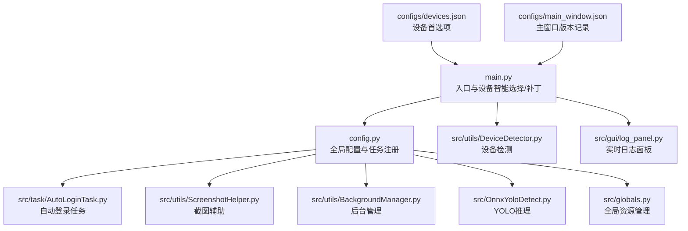
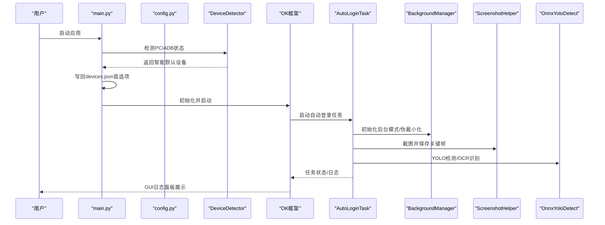
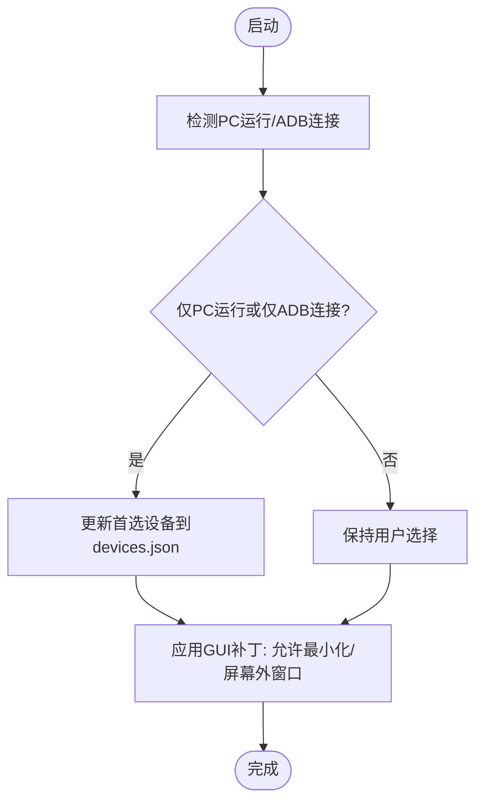
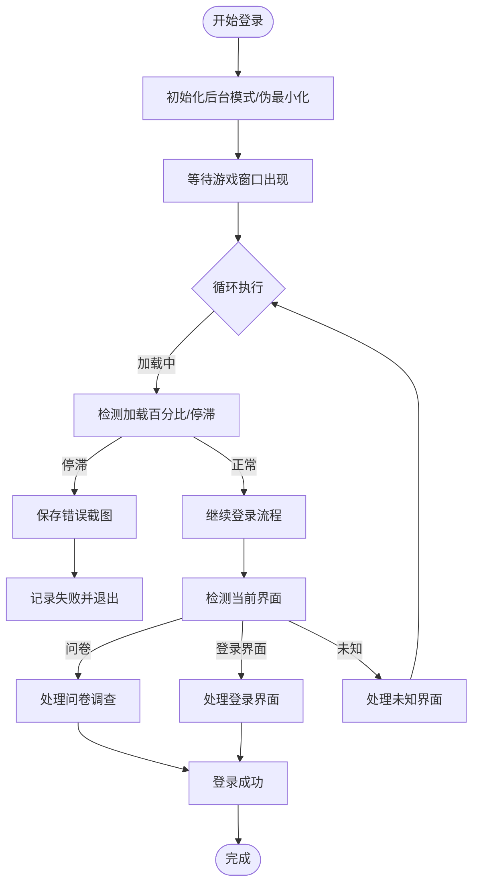
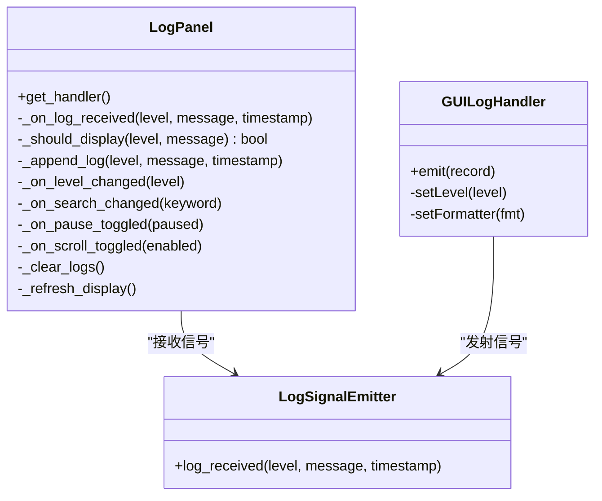
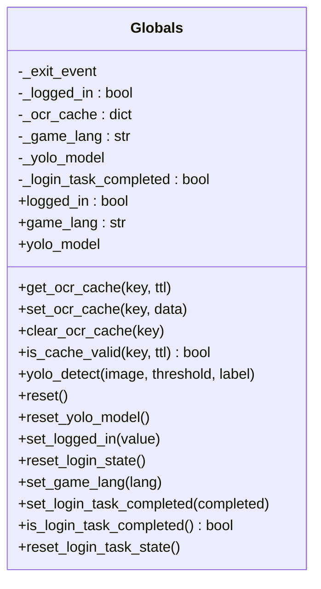
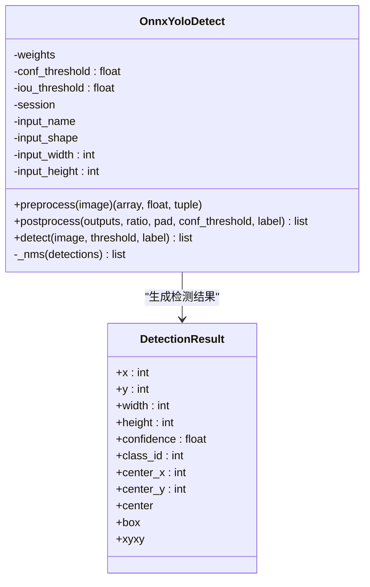
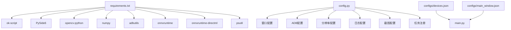

# 故障排除

<cite>
**本文引用的文件**
- [main.py](file://main.py)
- [main_debug.py](file://main_debug.py)
- [config.py](file://config.py)
- [requirements.txt](file://requirements.txt)
- [src/globals.py](file://src/globals.py)
- [src/utils/DeviceDetector.py](file://src/utils/DeviceDetector.py)
- [src/gui/log_panel.py](file://src/gui/log_panel.py)
- [src/task/AutoLoginTask.py](file://src/task/AutoLoginTask.py)
- [src/utils/ScreenshotHelper.py](file://src/utils/ScreenshotHelper.py)
- [src/utils/BackgroundManager.py](file://src/utils/BackgroundManager.py)
- [src/OnnxYoloDetect.py](file://src/OnnxYoloDetect.py)
- [configs/devices.json](file://configs/devices.json)
- [configs/main_window.json](file://configs/main_window.json)
</cite>

## 目录
1. [简介](#简介)
2. [项目结构](#项目结构)
3. [核心组件](#核心组件)
4. [架构总览](#架构总览)
5. [详细组件分析](#详细组件分析)
6. [依赖分析](#依赖分析)
7. [性能考虑](#性能考虑)
8. [故障排除指南](#故障排除指南)
9. [结论](#结论)
10. [附录](#附录)

## 简介
本指南面向OK-Jump使用者与维护者，提供系统化的故障排除方法，覆盖设备连接、权限与配置、日志分析、性能诊断、兼容性问题、资源与内存泄漏、崩溃预防与修复，以及用户反馈与问题跟踪机制。文档基于仓库中的实际代码与配置进行梳理，并给出可操作的定位步骤与优化建议。

## 项目结构
OK-Jump采用模块化组织，核心入口负责设备智能选择、GUI补丁与框架初始化；配置集中于config.py并通过OK框架读取；任务模块负责具体业务流程（如自动登录）；工具模块提供截图、后台管理、设备检测、YOLO推理等能力；GUI模块提供实时日志监控面板；配置文件位于configs目录。

**图表来源**
- [main.py:1-107](file://main.py#L1-L107)
- [config.py:68-148](file://config.py#L68-L148)
- [src/utils/DeviceDetector.py:1-149](file://src/utils/DeviceDetector.py#L1-L149)
- [src/gui/log_panel.py:58-388](file://src/gui/log_panel.py#L58-L388)
- [src/task/AutoLoginTask.py:21-800](file://src/task/AutoLoginTask.py#L21-L800)
- [src/utils/ScreenshotHelper.py:7-68](file://src/utils/ScreenshotHelper.py#L7-L68)
- [src/utils/BackgroundManager.py:7-155](file://src/utils/BackgroundManager.py#L7-L155)
- [src/OnnxYoloDetect.py:17-315](file://src/OnnxYoloDetect.py#L17-L315)
- [src/globals.py:16-257](file://src/globals.py#L16-L257)
- [configs/devices.json:1-7](file://configs/devices.json#L1-L7)
- [configs/main_window.json:1-3](file://configs/main_window.json#L1-L3)

**章节来源**
- [main.py:1-107](file://main.py#L1-L107)
- [config.py:68-148](file://config.py#L68-L148)

## 核心组件
- 入口与设备智能选择：在启动前检测PC与模拟器ADB连接状态，自动切换首选设备并写回配置；同时对GUI控制器进行补丁以支持“最小化/屏幕外窗口”的后台模式。
- 配置系统：集中定义窗口交互、ADB、分辨率、日志、截图、一次性与触发任务等；通过OK框架注册自定义全局对象（如全局资源管理器）。
- 任务系统：以任务类封装业务流程（如自动登录），内置OCR缓存、加载界面检测、状态容错、错误截图等能力。
- 工具集：截图辅助、后台管理、设备检测、YOLO推理、全局资源管理。
- GUI日志：提供实时日志面板，支持级别过滤、关键词搜索、暂停/恢复、自动滚动与清空。

**章节来源**
- [main.py:29-95](file://main.py#L29-L95)
- [config.py:68-148](file://config.py#L68-L148)
- [src/task/AutoLoginTask.py:21-800](file://src/task/AutoLoginTask.py#L21-L800)
- [src/gui/log_panel.py:58-388](file://src/gui/log_panel.py#L58-L388)

## 架构总览
OK-Jump的控制流从入口脚本开始，先做设备智能选择与GUI补丁，再初始化OK框架并启动任务。任务内部通过后台管理器确保窗口在后台可截图，使用截图辅助保存关键帧，结合OCR与YOLO进行界面识别与决策，最后将日志输出到GUI面板与文件。

**图表来源**
- [main.py:99-107](file://main.py#L99-L107)
- [src/utils/DeviceDetector.py:113-134](file://src/utils/DeviceDetector.py#L113-L134)
- [src/task/AutoLoginTask.py:205-267](file://src/task/AutoLoginTask.py#L205-L267)
- [src/utils/BackgroundManager.py:97-128](file://src/utils/BackgroundManager.py#L97-L128)
- [src/utils/ScreenshotHelper.py:17-30](file://src/utils/ScreenshotHelper.py#L17-L30)
- [src/OnnxYoloDetect.py:234-258](file://src/OnnxYoloDetect.py#L234-L258)

## 详细组件分析

### 设备智能选择与GUI补丁
- 设备智能选择：检测PC游戏窗口与ADB设备连接，若仅PC运行或仅ADB连接，则自动更新首选设备；否则保持用户选择。
- GUI补丁：对StartController的设备错误检查进行增强，当配置开启“跳过位置检查”时，允许最小化或屏幕外窗口进入后台模式。
- 配置持久化：更新configs/devices.json中的preferred字段，便于下次启动沿用。

**图表来源**
- [main.py:54-95](file://main.py#L54-L95)
- [src/utils/DeviceDetector.py:113-134](file://src/utils/DeviceDetector.py#L113-L134)
- [configs/devices.json:1-7](file://configs/devices.json#L1-L7)

**章节来源**
- [main.py:54-95](file://main.py#L54-L95)
- [src/utils/DeviceDetector.py:113-134](file://src/utils/DeviceDetector.py#L113-L134)
- [configs/devices.json:1-7](file://configs/devices.json#L1-L7)

### 自动登录任务（AutoLoginTask）
- 背景模式初始化：确保窗口在后台可截图，记录伪最小化与前台状态。
- 加载界面检测：通过OCR右下角百分比区域检测加载进度，支持停滞超时判断与错误截图。
- 状态容错：在判定失败后的一段缓冲期内再次检查成功条件，提升鲁棒性。
- 错误处理：捕获账号输入异常，记录错误并保存截图，支持重试与超时统计。

**图表来源**
- [src/task/AutoLoginTask.py:205-267](file://src/task/AutoLoginTask.py#L205-L267)
- [src/task/AutoLoginTask.py:403-456](file://src/task/AutoLoginTask.py#L403-L456)
- [src/task/AutoLoginTask.py:512-681](file://src/task/AutoLoginTask.py#L512-L681)

**章节来源**
- [src/task/AutoLoginTask.py:205-267](file://src/task/AutoLoginTask.py#L205-L267)
- [src/task/AutoLoginTask.py:403-456](file://src/task/AutoLoginTask.py#L403-L456)
- [src/task/AutoLoginTask.py:512-681](file://src/task/AutoLoginTask.py#L512-L681)

### 实时日志监控面板（LogPanel）
- 提供GUI实时日志查看，支持按级别过滤、关键词搜索、暂停/恢复、自动滚动与清空。
- 使用线程安全信号发射器与日志处理器，将框架日志接入面板显示。
- 面板具备等宽字体与深色主题，便于快速定位错误与警告。

**图表来源**
- [src/gui/log_panel.py:29-388](file://src/gui/log_panel.py#L29-L388)

**章节来源**
- [src/gui/log_panel.py:29-388](file://src/gui/log_panel.py#L29-L388)

### 全局资源管理（Globals）
- 管理登录状态、OCR缓存、游戏语言、YOLO模型等全局资源。
- 支持延迟加载YOLO模型，提供检测与重置能力，便于内存管理与复用。

**图表来源**
- [src/globals.py:16-257](file://src/globals.py#L16-L257)

**章节来源**
- [src/globals.py:16-257](file://src/globals.py#L16-L257)

### YOLO推理（OnnxYoloDetect）
- 支持CPU/GPU执行提供者，预处理与后处理完整，包含NMS非极大值抑制。
- 提供检测结果类，包含边界框、置信度与类别ID等信息。

**图表来源**
- [src/OnnxYoloDetect.py:17-315](file://src/OnnxYoloDetect.py#L17-L315)

**章节来源**
- [src/OnnxYoloDetect.py:17-315](file://src/OnnxYoloDetect.py#L17-L315)

### 截图辅助（ScreenshotHelper）
- 提供截图保存与特征模板保存能力，默认保存至screenshots目录。
- 支持命名规范与PNG格式，便于问题复现与标注。

**章节来源**
- [src/utils/ScreenshotHelper.py:7-68](file://src/utils/ScreenshotHelper.py#L7-L68)

### 后台管理（BackgroundManager）
- 管理后台模式、静音、伪最小化与前台检测，确保后台截图与输入的稳定性。
- 提供窗口可见性保障与状态查询接口。

**章节来源**
- [src/utils/BackgroundManager.py:7-155](file://src/utils/BackgroundManager.py#L7-L155)

## 依赖分析
- 外部依赖集中在requirements.txt，涵盖OK框架、PySide6、OpenCV、NumPy、ADB工具、ONNX Runtime、DirectML、psutil等。
- 配置文件devices.json与main_window.json分别影响设备选择与主窗口版本记录。
- config.py集中定义窗口交互、ADB、分辨率、日志、截图、任务注册与自定义全局对象。

**图表来源**
- [requirements.txt:1-14](file://requirements.txt#L1-L14)
- [config.py:68-148](file://config.py#L68-L148)
- [configs/devices.json:1-7](file://configs/devices.json#L1-L7)
- [configs/main_window.json:1-3](file://configs/main_window.json#L1-L3)

**章节来源**
- [requirements.txt:1-14](file://requirements.txt#L1-L14)
- [config.py:68-148](file://config.py#L68-L148)
- [configs/devices.json:1-7](file://configs/devices.json#L1-L7)
- [configs/main_window.json:1-3](file://configs/main_window.json#L1-L3)

## 性能考虑
- 触发间隔与CPU/GPU占用：配置项“触发间隔”可调节任务轮询频率，适当增大可降低CPU/GPU占用。
- 后台模式与伪最小化：启用后台模式与最小化时伪最小化可在窗口不可见时继续运行，减少前台交互开销。
- YOLO推理：优先使用GPU执行提供者，若失败回退CPU；合理设置置信度与NMS阈值，避免过度检测。
- 截图与缓存：OCR缓存与截图保存应避免频繁I/O，必要时清理缓存与临时文件。
- 资源释放：全局资源管理器提供模型重置接口，长时间运行后可调用以释放内存。

**章节来源**
- [config.py:50-64](file://config.py#L50-L64)
- [src/utils/BackgroundManager.py:18-23](file://src/utils/BackgroundManager.py#L18-L23)
- [src/OnnxYoloDetect.py:50-57](file://src/OnnxYoloDetect.py#L50-L57)
- [src/globals.py:254-257](file://src/globals.py#L254-L257)

## 故障排除指南

### 1. 设备连接与权限问题
- 症状：无法检测到游戏窗口或ADB设备，任务无法启动。
- 排查步骤：
  - 检查PC游戏窗口标题是否被正确识别（排除模拟器与工具自身窗口）。
  - 确认ADB服务是否运行，设备是否连接为“device”状态。
  - 若窗口最小化或移出屏幕，确认已启用“跳过位置检查”或“最小化时伪最小化”。
- 解决方案：
  - 使用智能设备选择自动切换首选设备。
  - 在GUI中启用后台模式与伪最小化，确保窗口可截图。
  - 检查devices.json中的preferred与capture字段是否符合预期。

**章节来源**
- [src/utils/DeviceDetector.py:29-68](file://src/utils/DeviceDetector.py#L29-L68)
- [src/utils/DeviceDetector.py:71-110](file://src/utils/DeviceDetector.py#L71-L110)
- [main.py:42-48](file://main.py#L42-L48)
- [src/utils/BackgroundManager.py:101-128](file://src/utils/BackgroundManager.py#L101-L128)
- [configs/devices.json:1-7](file://configs/devices.json#L1-L7)

### 2. 登录流程异常与加载停滞
- 症状：登录卡在某界面或加载界面长时间无响应。
- 排查步骤：
  - 查看实时日志面板中的加载百分比检测与停滞记录。
  - 检查OCR缓存是否命中，必要时清理缓存后重试。
  - 确认状态容错缓冲期内是否出现“假失败后成功”的情况。
- 解决方案：
  - 调整“加载停滞超时”与“登录等待超时”配置。
  - 增大“点击后等待时间”，确保界面稳定。
  - 对卡住界面保存错误截图以便复现。

**章节来源**
- [src/task/AutoLoginTask.py:403-456](file://src/task/AutoLoginTask.py#L403-L456)
- [src/task/AutoLoginTask.py:512-681](file://src/task/AutoLoginTask.py#L512-L681)
- [src/utils/ScreenshotHelper.py:17-30](file://src/utils/ScreenshotHelper.py#L17-L30)

### 3. 日志分析与定位技巧
- 使用GUI日志面板进行实时监控，按级别与关键词过滤快速定位问题。
- 导出日志压缩包，包含logs目录下的全部日志文件，便于提交问题反馈。
- 结合错误截图与加载百分比日志，复现并验证修复效果。

**章节来源**
- [src/gui/log_panel.py:115-234](file://src/gui/log_panel.py#L115-L234)
- [main.py:11-26](file://main.py#L11-L26)
- [config.py:126-127](file://config.py#L126-L127)

### 4. 性能问题诊断与优化
- 降低触发频率：增大“触发间隔”以减少CPU/GPU占用。
- 启用后台模式：在窗口不可见时仍可运行，减少前台交互成本。
- YOLO优化：确保ONNX Runtime与DirectML正确安装，优先使用GPU执行提供者。
- 资源管理：定期重置YOLO模型与OCR缓存，避免长期运行导致的内存膨胀。

**章节来源**
- [config.py:50-64](file://config.py#L50-L64)
- [src/utils/BackgroundManager.py:18-23](file://src/utils/BackgroundManager.py#L18-L23)
- [src/OnnxYoloDetect.py:50-57](file://src/OnnxYoloDetect.py#L50-L57)
- [src/globals.py:137-192](file://src/globals.py#L137-L192)
- [src/globals.py:254-257](file://src/globals.py#L254-L257)

### 5. 兼容性问题排查
- 症状：不同分辨率或窗口模式导致识别失败。
- 排查步骤：
  - 检查supported_resolution与reference_resolution配置。
  - 确认capture_method与interaction设置是否适合当前游戏。
- 解决方案：
  - 调整窗口大小或启用“自动调整游戏窗口大小”。
  - 更换capture_method或interaction为更稳定的组合。

**章节来源**
- [config.py:108-124](file://config.py#L108-L124)
- [config.py:98-101](file://config.py#L98-L101)

### 6. 系统资源、内存泄漏与崩溃预防
- 预防措施：
  - 定期重置全局资源（如YOLO模型），避免长期持有大对象。
  - 控制日志级别与面板刷新频率，减少UI线程压力。
  - 使用调试模式（main_debug.py）进行无GUI测试，定位后台问题。
- 崩溃处理：
  - 在关键流程中捕获异常并记录堆栈信息。
  - 保存错误截图与日志，便于复现与修复。

**章节来源**
- [src/globals.py:254-257](file://src/globals.py#L254-L257)
- [src/gui/log_panel.py:248-256](file://src/gui/log_panel.py#L248-L256)
- [main_debug.py:6-16](file://main_debug.py#L6-L16)

### 7. 用户反馈与问题跟踪机制
- 日志导出：通过入口函数导出logs目录为压缩包，便于用户提交。
- 配置备份：devices.json与main_window.json记录当前配置状态，便于对比前后差异。
- 实时日志：GUI面板提供实时监控，支持暂停/恢复与清空，便于问题复现。

**章节来源**
- [main.py:11-26](file://main.py#L11-L26)
- [configs/devices.json:1-7](file://configs/devices.json#L1-L7)
- [configs/main_window.json:1-3](file://configs/main_window.json#L1-L3)
- [src/gui/log_panel.py:175-204](file://src/gui/log_panel.py#L175-L204)

## 结论
通过设备智能选择、后台模式、日志监控与资源管理等机制，OK-Jump能够在复杂环境下稳定运行。遇到问题时，建议优先使用GUI日志面板与错误截图定位，结合配置调整与性能优化逐步排查。对于持续性问题，可通过导出日志与配置文件进行问题跟踪与回归验证。

## 附录
- 快速检查清单
  - ADB与游戏窗口状态是否正常
  - devices.json首选项是否符合预期
  - 后台模式与伪最小化是否启用
  - 日志级别与关键词过滤是否有助于定位
  - YOLO模型与ONNX Runtime是否可用
  - 截图保存目录是否存在且可写