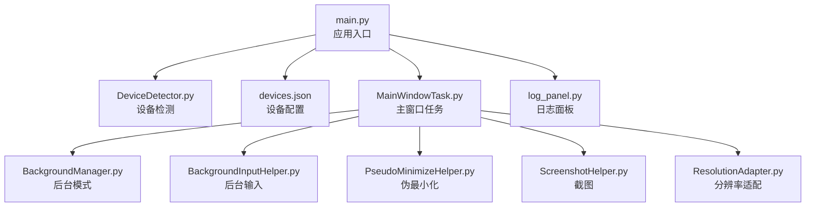
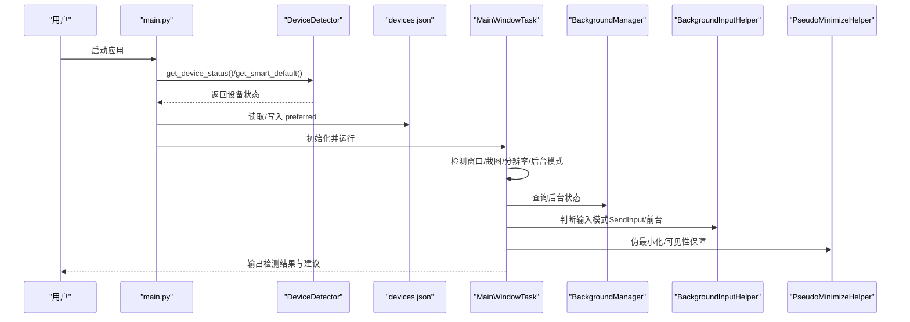
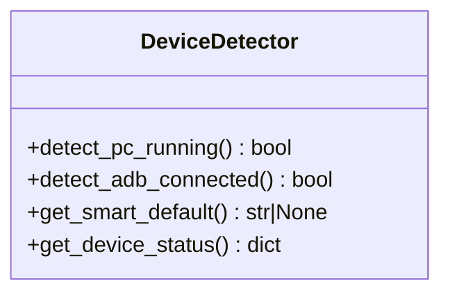
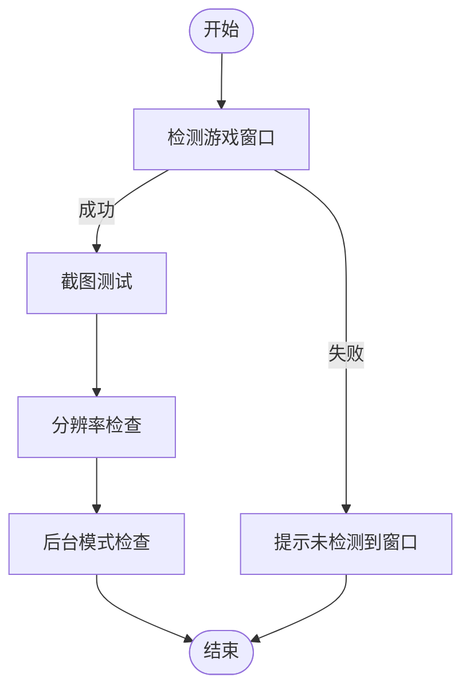
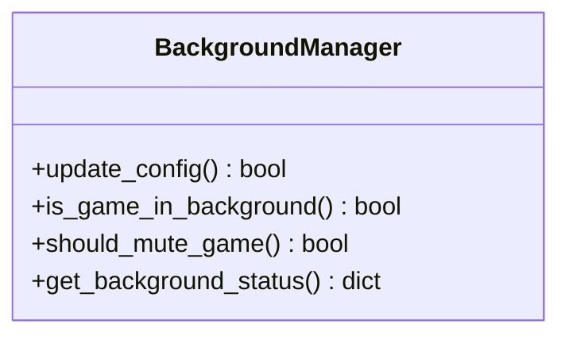
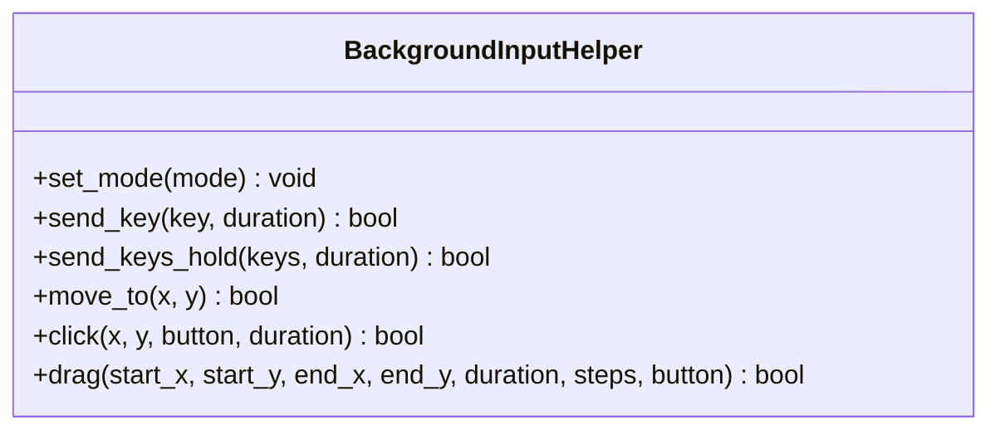
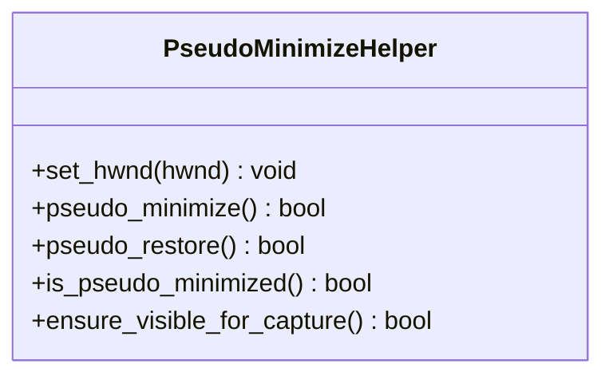
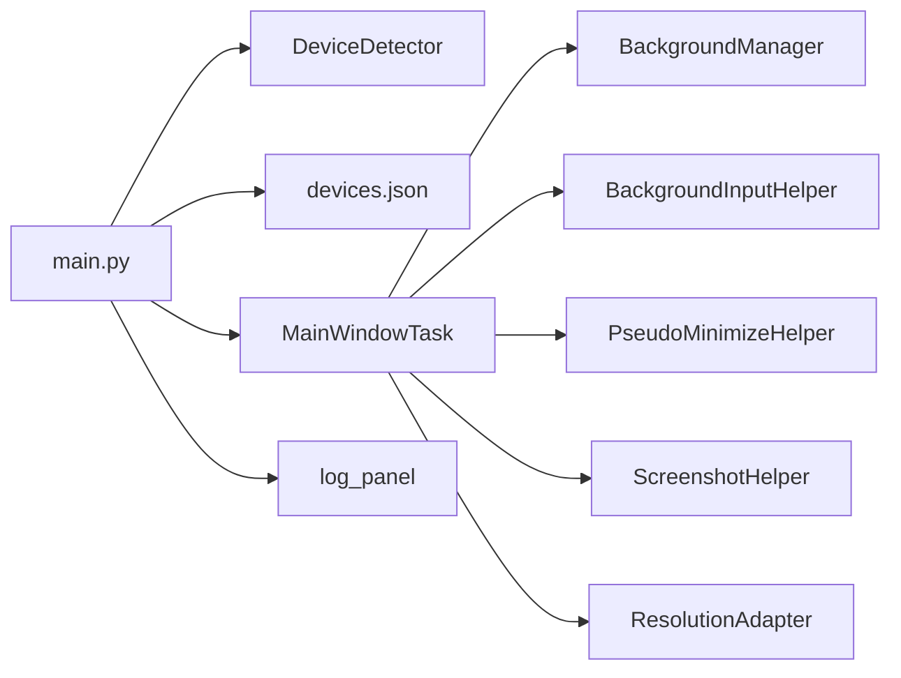
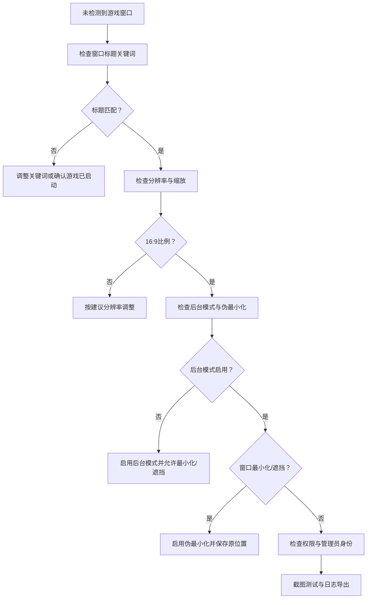
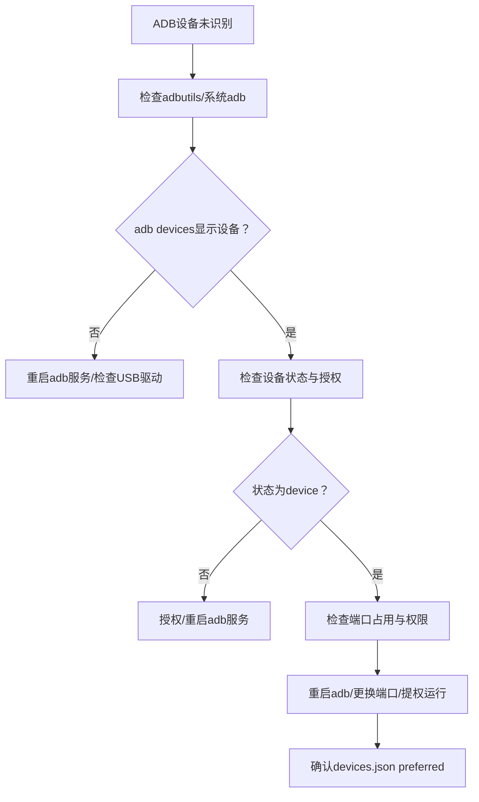

# 设备连接问题

<cite>
**本文引用的文件**
- [main.py](file://main.py)
- [DeviceDetector.py](file://src/utils/DeviceDetector.py)
- [devices.json](file://configs/devices.json)
- [MainWindowTask.py](file://src/task/MainWindowTask.py)
- [BackgroundManager.py](file://src/utils/BackgroundManager.py)
- [BackgroundInputHelper.py](file://src/utils/BackgroundInputHelper.py)
- [PseudoMinimizeHelper.py](file://src/utils/PseudoMinimizeHelper.py)
- [ScreenshotHelper.py](file://src/utils/ScreenshotHelper.py)
- [ResolutionAdapter.py](file://src/utils/ResolutionAdapter.py)
- [log_panel.py](file://src/gui/log_panel.py)
</cite>

## 目录
1. [简介](#简介)
2. [项目结构](#项目结构)
3. [核心组件](#核心组件)
4. [架构总览](#架构总览)
5. [详细组件分析](#详细组件分析)
6. [依赖分析](#依赖分析)
7. [性能考虑](#性能考虑)
8. [故障排除指南](#故障排除指南)
9. [结论](#结论)
10. [附录](#附录)

## 简介
本指南聚焦于OK-Jump在“设备连接”方面的问题排查，覆盖以下场景：
- PC版游戏检测失败：窗口标题识别、分辨率检测、权限与后台模式验证
- Android模拟器连接问题：ADB服务检查、设备识别、端口冲突
- 设备切换失败、连接超时、权限不足
- 设备检测日志分析、网络配置检查、防火墙设置

文档基于仓库中的实际实现，提供可操作的诊断步骤与可视化流程图，帮助快速定位并解决问题。

## 项目结构
围绕设备连接的关键文件与职责如下：
- main.py：应用入口，负责智能设备选择与启动补丁
- src/utils/DeviceDetector.py：PC版窗口与ADB设备检测
- configs/devices.json：设备首选项与捕获方式配置
- src/task/MainWindowTask.py：主窗口任务，执行窗口检测、截图、分辨率与后台模式检查
- src/utils/BackgroundManager.py：后台模式与静音控制
- src/utils/BackgroundInputHelper.py：后台输入（SendInput）与前台输入切换
- src/utils/PseudoMinimizeHelper.py：伪最小化，支持后台截图与输入
- src/utils/ScreenshotHelper.py：截图保存与特征模板导出
- src/utils/ResolutionAdapter.py：分辨率适配与16:9比例校验
- src/gui/log_panel.py：日志面板，便于查看设备检测与后台模式相关日志

**图表来源**
- [main.py:1-107](file://main.py#L1-L107)
- [DeviceDetector.py:1-149](file://src/utils/DeviceDetector.py#L1-L149)
- [devices.json:1-7](file://configs/devices.json#L1-L7)
- [MainWindowTask.py:1-215](file://src/task/MainWindowTask.py#L1-L215)
- [BackgroundManager.py:1-155](file://src/utils/BackgroundManager.py#L1-L155)
- [BackgroundInputHelper.py:1-841](file://src/utils/BackgroundInputHelper.py#L1-L841)
- [PseudoMinimizeHelper.py:1-238](file://src/utils/PseudoMinimizeHelper.py#L1-L238)
- [ScreenshotHelper.py:1-68](file://src/utils/ScreenshotHelper.py#L1-L68)
- [ResolutionAdapter.py:1-163](file://src/utils/ResolutionAdapter.py#L1-L163)
- [log_panel.py:58-104](file://src/gui/log_panel.py#L58-L104)

**章节来源**
- [main.py:1-107](file://main.py#L1-L107)
- [DeviceDetector.py:1-149](file://src/utils/DeviceDetector.py#L1-L149)
- [devices.json:1-7](file://configs/devices.json#L1-L7)
- [MainWindowTask.py:1-215](file://src/task/MainWindowTask.py#L1-L215)
- [BackgroundManager.py:1-155](file://src/utils/BackgroundManager.py#L1-L155)
- [BackgroundInputHelper.py:1-841](file://src/utils/BackgroundInputHelper.py#L1-L841)
- [PseudoMinimizeHelper.py:1-238](file://src/utils/PseudoMinimizeHelper.py#L1-L238)
- [ScreenshotHelper.py:1-68](file://src/utils/ScreenshotHelper.py#L1-L68)
- [ResolutionAdapter.py:1-163](file://src/utils/ResolutionAdapter.py#L1-L163)
- [log_panel.py:58-104](file://src/gui/log_panel.py#L58-L104)

## 核心组件
- 设备检测器：通过窗口标题关键词识别PC版游戏，通过ADB命令检测模拟器设备连接
- 主窗口任务：执行窗口截图、分辨率检查、后台模式状态检查
- 后台管理器：判断是否后台运行、是否需要静音、伪最小化状态
- 后台输入助手：根据是否后台自动选择SendInput或前台输入
- 伪最小化助手：将窗口移至屏幕外仍保持活动状态，支持后台截图与输入
- 截图助手：保存截图与特征模板，便于问题复现与分析
- 分辨率适配器：计算缩放比例与16:9比例校验，提供推荐分辨率

**章节来源**
- [DeviceDetector.py:11-149](file://src/utils/DeviceDetector.py#L11-L149)
- [MainWindowTask.py:55-196](file://src/task/MainWindowTask.py#L55-L196)
- [BackgroundManager.py:7-92](file://src/utils/BackgroundManager.py#L7-L92)
- [BackgroundInputHelper.py:99-207](file://src/utils/BackgroundInputHelper.py#L99-L207)
- [PseudoMinimizeHelper.py:13-101](file://src/utils/PseudoMinimizeHelper.py#L13-L101)
- [ScreenshotHelper.py:7-31](file://src/utils/ScreenshotHelper.py#L7-L31)
- [ResolutionAdapter.py:4-44](file://src/utils/ResolutionAdapter.py#L4-L44)

## 架构总览
设备连接流程从应用启动开始，先进行智能设备选择与启动补丁，再进入主窗口任务的检测链路。

**图表来源**
- [main.py:54-106](file://main.py#L54-L106)
- [DeviceDetector.py:113-148](file://src/utils/DeviceDetector.py#L113-L148)
- [devices.json:1-7](file://configs/devices.json#L1-L7)
- [MainWindowTask.py:55-196](file://src/task/MainWindowTask.py#L55-L196)
- [BackgroundManager.py:82-92](file://src/utils/BackgroundManager.py#L82-L92)
- [BackgroundInputHelper.py:199-207](file://src/utils/BackgroundInputHelper.py#L199-L207)
- [PseudoMinimizeHelper.py:103-101](file://src/utils/PseudoMinimizeHelper.py#L103-L101)

## 详细组件分析

### 设备检测器（DeviceDetector）
- PC版窗口检测：通过枚举窗口标题，匹配关键词并排除模拟器与工具自身窗口
- ADB设备检测：优先使用adbutils包；若不可用则调用系统adb devices命令解析设备列表
- 智能默认设备：仅PC运行返回pc，仅ADB连接返回adb，否则保持用户选择
- 设备状态详情：返回pc_running、adb_connected与smart_default

**图表来源**
- [DeviceDetector.py:11-149](file://src/utils/DeviceDetector.py#L11-L149)

**章节来源**
- [DeviceDetector.py:28-148](file://src/utils/DeviceDetector.py#L28-L148)

### 主窗口任务（MainWindowTask）
- 执行窗口截图与窗口标题输出
- 分辨率检查：输出当前与参考分辨率、缩放比例，并给出16:9比例建议
- 后台模式检查：输出后台模式启用状态、伪最小化状态、当前窗口前后台状态、静音设置

**图表来源**
- [MainWindowTask.py:121-196](file://src/task/MainWindowTask.py#L121-L196)

**章节来源**
- [MainWindowTask.py:55-196](file://src/task/MainWindowTask.py#L55-L196)

### 后台管理器（BackgroundManager）
- 判断是否后台运行、是否需要静音
- 提供后台状态字典：后台模式开关、是否在后台、是否伪最小化、是否静音

**图表来源**
- [BackgroundManager.py:7-92](file://src/utils/BackgroundManager.py#L7-L92)

**章节来源**
- [BackgroundManager.py:18-92](file://src/utils/BackgroundManager.py#L18-L92)

### 后台输入助手（BackgroundInputHelper）
- 自动选择输入模式：后台模式或伪最小化使用SendInput，前台模式使用pydirectinput
- 支持按键、组合键、鼠标移动、点击、拖拽等操作

**图表来源**
- [BackgroundInputHelper.py:99-800](file://src/utils/BackgroundInputHelper.py#L99-L800)

**章节来源**
- [BackgroundInputHelper.py:199-207](file://src/utils/BackgroundInputHelper.py#L199-L207)

### 伪最小化助手（PseudoMinimizeHelper）
- 将窗口移动到(-32000,-32000)保持活动状态，支持恢复原位置
- 提供伪最小化状态查询与可见性保障

**图表来源**
- [PseudoMinimizeHelper.py:13-238](file://src/utils/PseudoMinimizeHelper.py#L13-L238)

**章节来源**
- [PseudoMinimizeHelper.py:103-101](file://src/utils/PseudoMinimizeHelper.py#L103-L101)

### 截图助手（ScreenshotHelper）
- 保存截图与特征模板，便于问题复现与分析

**章节来源**
- [ScreenshotHelper.py:17-44](file://src/utils/ScreenshotHelper.py#L17-L44)

### 分辨率适配器（ResolutionAdapter）
- 计算缩放比例与16:9比例校验，提供推荐分辨率

**章节来源**
- [ResolutionAdapter.py:34-143](file://src/utils/ResolutionAdapter.py#L34-L143)

## 依赖分析
- main.py依赖DeviceDetector进行智能设备选择，并读取/写入devices.json
- MainWindowTask依赖BackgroundManager、BackgroundInputHelper、PseudoMinimizeHelper、ScreenshotHelper、ResolutionAdapter
- DeviceDetector依赖win32gui与adbutils或系统adb命令
- 日志面板用于集中展示设备检测与后台模式相关日志

**图表来源**
- [main.py:54-106](file://main.py#L54-L106)
- [DeviceDetector.py:11-149](file://src/utils/DeviceDetector.py#L11-L149)
- [devices.json:1-7](file://configs/devices.json#L1-L7)
- [MainWindowTask.py:55-196](file://src/task/MainWindowTask.py#L55-L196)
- [BackgroundManager.py:82-92](file://src/utils/BackgroundManager.py#L82-L92)
- [BackgroundInputHelper.py:199-207](file://src/utils/BackgroundInputHelper.py#L199-L207)
- [PseudoMinimizeHelper.py:103-101](file://src/utils/PseudoMinimizeHelper.py#L103-L101)
- [ScreenshotHelper.py:17-44](file://src/utils/ScreenshotHelper.py#L17-L44)
- [ResolutionAdapter.py:34-143](file://src/utils/ResolutionAdapter.py#L34-L143)
- [log_panel.py:58-104](file://src/gui/log_panel.py#L58-L104)

**章节来源**
- [main.py:54-106](file://main.py#L54-L106)
- [DeviceDetector.py:11-149](file://src/utils/DeviceDetector.py#L11-L149)
- [devices.json:1-7](file://configs/devices.json#L1-L7)
- [MainWindowTask.py:55-196](file://src/task/MainWindowTask.py#L55-L196)
- [BackgroundManager.py:82-92](file://src/utils/BackgroundManager.py#L82-L92)
- [BackgroundInputHelper.py:199-207](file://src/utils/BackgroundInputHelper.py#L199-L207)
- [PseudoMinimizeHelper.py:103-101](file://src/utils/PseudoMinimizeHelper.py#L103-L101)
- [ScreenshotHelper.py:17-44](file://src/utils/ScreenshotHelper.py#L17-L44)
- [ResolutionAdapter.py:34-143](file://src/utils/ResolutionAdapter.py#L34-L143)
- [log_panel.py:58-104](file://src/gui/log_panel.py#L58-L104)

## 性能考虑
- 窗口枚举与ADB命令调用均设置了超时，避免长时间阻塞
- 后台输入使用SendInput减少窗口激活开销
- 伪最小化仅在必要时触发，降低系统交互成本

[本节为通用指导，无需具体文件引用]

## 故障排除指南

### 一、PC版游戏检测失败
常见症状：主窗口任务提示未检测到游戏窗口，或分辨率/后台模式检查异常。

排查步骤
1. 确认游戏窗口标题
   - 检查窗口标题是否包含“漫画群星：大集结”，并排除“模拟器”“自动化工具”等关键词
   - 若标题不同，需调整窗口标题关键词匹配逻辑
2. 检查分辨率与缩放
   - 查看分辨率信息与16:9比例校验结果
   - 若非16:9，按建议分辨率调整
3. 检查后台模式与伪最小化
   - 若后台模式启用但窗口被遮挡，启用伪最小化以支持后台截图
   - 若窗口最小化，确保伪最小化已保存原始位置并可恢复
4. 截图与日志
   - 执行截图测试并通过日志面板查看错误信息
   - 导出日志压缩包以便进一步分析

**图表来源**
- [MainWindowTask.py:121-196](file://src/task/MainWindowTask.py#L121-L196)
- [BackgroundManager.py:46-92](file://src/utils/BackgroundManager.py#L46-L92)
- [PseudoMinimizeHelper.py:123-163](file://src/utils/PseudoMinimizeHelper.py#L123-L163)
- [ResolutionAdapter.py:107-143](file://src/utils/ResolutionAdapter.py#L107-L143)
- [log_panel.py:58-104](file://src/gui/log_panel.py#L58-L104)

**章节来源**
- [MainWindowTask.py:121-196](file://src/task/MainWindowTask.py#L121-L196)
- [BackgroundManager.py:46-92](file://src/utils/BackgroundManager.py#L46-L92)
- [PseudoMinimizeHelper.py:123-163](file://src/utils/PseudoMinimizeHelper.py#L123-L163)
- [ResolutionAdapter.py:107-143](file://src/utils/ResolutionAdapter.py#L107-L143)
- [log_panel.py:58-104](file://src/gui/log_panel.py#L58-L104)

### 二、Android模拟器连接问题
常见症状：ADB设备未识别、设备切换失败、连接超时、权限不足。

排查步骤
1. ADB服务检查
   - 确认已安装adbutils包；若不可用，检查系统adb命令路径与版本
   - 使用adb devices命令查看设备列表，确认设备状态为device
2. 设备识别
   - 若存在多设备，确认目标设备序列号与连接状态
   - 如设备显示authorizing或unauthorized，按提示授权或重启adb服务
3. 端口冲突
   - 检查adb端口占用情况，必要时重启adb服务或更换端口
4. 权限与USB调试
   - 确保已开启开发者选项与USB调试
   - 使用高权限账户运行应用，避免权限不足导致无法访问设备
5. 智能设备选择
   - 应用启动时会自动检测PC与ADB状态并更新devices.json中的preferred字段
   - 若自动切换失败，手动检查devices.json并确认preferred值

**图表来源**
- [DeviceDetector.py:71-110](file://src/utils/DeviceDetector.py#L71-L110)
- [main.py:54-95](file://main.py#L54-L95)
- [devices.json:1-7](file://configs/devices.json#L1-L7)

**章节来源**
- [DeviceDetector.py:71-110](file://src/utils/DeviceDetector.py#L71-L110)
- [main.py:54-95](file://main.py#L54-L95)
- [devices.json:1-7](file://configs/devices.json#L1-L7)

### 三、设备切换失败、连接超时、权限不足
- 设备切换失败
  - 检查devices.json的preferred字段是否被正确更新
  - 确认智能设备选择在OK初始化前执行
- 连接超时
  - 减少不必要的窗口枚举与ADB命令调用
  - 适当增加超时阈值或优化设备检测逻辑
- 权限不足
  - 以管理员身份运行应用
  - 检查Windows安全软件与防病毒软件对窗口枚举与输入的拦截

**章节来源**
- [main.py:54-95](file://main.py#L54-L95)
- [DeviceDetector.py:28-110](file://src/utils/DeviceDetector.py#L28-L110)

### 四、设备检测日志分析
- 使用日志面板查看设备检测与后台模式相关日志
- 导出日志压缩包，包含logs目录，便于问题复现与技术支持

**章节来源**
- [log_panel.py:58-104](file://src/gui/log_panel.py#L58-L104)
- [main.py:11-27](file://main.py#L11-L27)

### 五、网络配置与防火墙
- 若使用远程ADB或特定网络环境，检查防火墙对adb端口的放行
- 确保本地回环地址与adb服务通信正常

[本节为通用指导，无需具体文件引用]

## 结论
通过结合设备检测器、主窗口任务与后台管理链路，OK-Jump能够自动识别PC版与模拟器设备并提供相应的检测与修复建议。遇到设备连接问题时，建议按“窗口标题→分辨率→后台模式→ADB设备→权限与网络”的顺序逐项排查，并利用日志面板与截图助手进行问题定位与复现。

[本节为总结性内容，无需具体文件引用]

## 附录
- 关键配置文件
  - devices.json：设备首选项与捕获方式
  - ui_config.json：界面主题与语言设置
  - main_window.json：主窗口版本信息
- 常用命令
  - adb devices：查看ADB设备列表
  - adb kill-server / adb start-server：重启ADB服务

**章节来源**
- [devices.json:1-7](file://configs/devices.json#L1-L7)
- [ui_config.json:1-17](file://configs/ui_config.json#L1-L17)
- [main_window.json:1-3](file://configs/main_window.json#L1-L3)