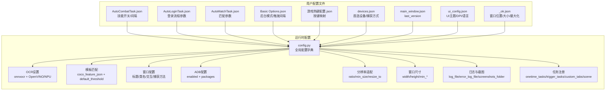
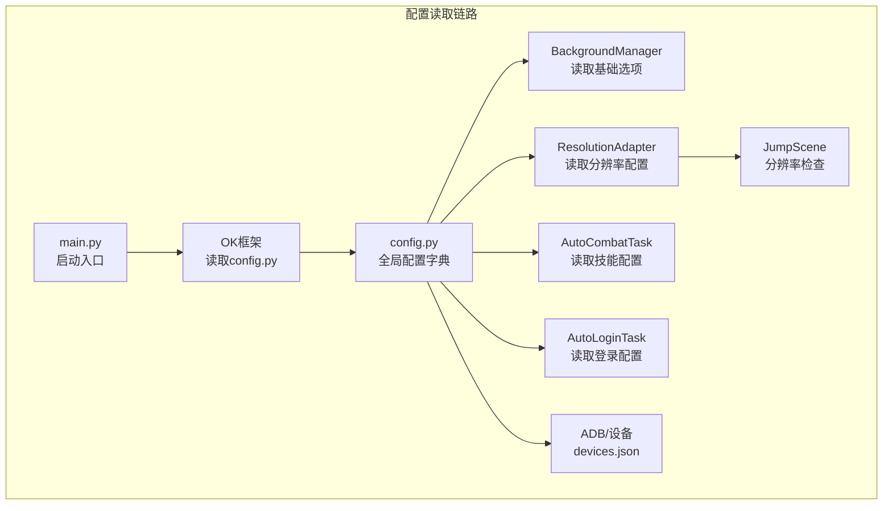
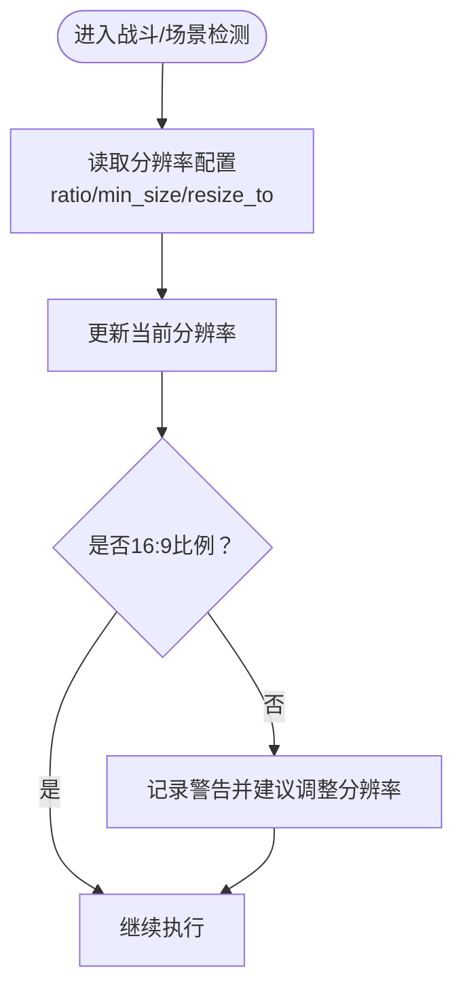
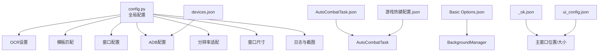

# 配置错误问题

<cite>
**本文引用的文件**
- [config.py](file://config.py)
- [main.py](file://main.py)
- [AutoCombatTask.py](file://src/task/AutoCombatTask.py)
- [BackgroundManager.py](file://src/utils/BackgroundManager.py)
- [ResolutionAdapter.py](file://src/utils/ResolutionAdapter.py)
- [JumpScene.py](file://src/scene/JumpScene.py)
- [AutoLoginTask.py](file://src/task/AutoLoginTask.py)
- [AutoMatchTask.json](file://configs/AutoMatchTask.json)
- [AutoLoginTask.json](file://configs/AutoLoginTask.json)
- [AutoCombatTask.json](file://configs/AutoCombatTask.json)
- [Basic Options.json](file://configs/Basic Options.json)
- [游戏热键配置.json](file://configs/游戏热键配置.json)
- [devices.json](file://configs/devices.json)
- [main_window.json](file://configs/main_window.json)
- [ui_config.json](file://configs/ui_config.json)
- [_ok.json](file://configs/_ok.json)
- [自动战斗系统流程图.md](file://docs/自动战斗系统流程图.md)
</cite>

## 目录
1. [简介](#简介)
2. [项目结构](#项目结构)
3. [核心组件](#核心组件)
4. [架构总览](#架构总览)
5. [详细组件分析](#详细组件分析)
6. [依赖分析](#依赖分析)
7. [性能考虑](#性能考虑)
8. [故障排除指南](#故障排除指南)
9. [结论](#结论)
10. [附录](#附录)

## 简介
本指南聚焦于OK-Jump项目中的“配置错误问题”，围绕配置文件格式错误、参数缺失、数值范围异常、配置加载失败、参数不生效、配置冲突等常见问题，提供系统化的识别与修复方法。文档覆盖游戏窗口配置、OCR设置、模板匹配参数、技能热键配置等关键配置项，并给出配置文件备份恢复、默认配置重置、配置验证等实用工具的使用方法。

## 项目结构
OK-Jump的配置体系由两部分组成：
- 运行时配置：集中于config.py中的全局配置字典，定义OCR、模板匹配、窗口、ADB、分辨率适配、窗口尺寸、日志与截图目录、一次性任务与触发任务、自定义GUI标签页等。
- 用户配置文件：位于configs目录下的JSON文件，如AutoCombatTask.json、AutoLoginTask.json、Basic Options.json、游戏热键配置.json、devices.json、main_window.json、ui_config.json、_ok.json等，用于覆盖或补充运行时配置。

图表来源
- [config.py:68-148](file://config.py#L68-L148)
- [AutoCombatTask.json:1-13](file://configs/AutoCombatTask.json#L1-L13)
- [AutoLoginTask.json:1-15](file://configs/AutoLoginTask.json#L1-L15)
- [AutoMatchTask.json:1-6](file://configs/AutoMatchTask.json#L1-L6)
- [Basic Options.json:1-13](file://configs/Basic Options.json#L1-L13)
- [游戏热键配置.json:1-6](file://configs/游戏热键配置.json#L1-L6)
- [devices.json:1-7](file://configs/devices.json#L1-L7)
- [main_window.json:1-3](file://configs/main_window.json#L1-L3)
- [ui_config.json:1-17](file://configs/ui_config.json#L1-L17)
- [_ok.json:1-7](file://configs/_ok.json#L1-L7)

章节来源
- [config.py:68-148](file://config.py#L68-L148)

## 核心组件
- 运行时配置中心：集中定义OCR库与参数、模板匹配阈值与特征文件、窗口标题/类名/交互方式/捕获方法、ADB包名与启用状态、支持的分辨率比与目标尺寸列表、参考分辨率、窗口默认尺寸、日志与截图路径、一次性任务与触发任务、自定义GUI标签页以及场景类。
- 用户配置文件：按功能拆分，分别控制登录、战斗、匹配、基础选项、热键、设备、主窗口UI与窗口位置等。

章节来源
- [config.py:68-148](file://config.py#L68-L148)
- [AutoCombatTask.json:1-13](file://configs/AutoCombatTask.json#L1-L13)
- [AutoLoginTask.json:1-15](file://configs/AutoLoginTask.json#L1-L15)
- [AutoMatchTask.json:1-6](file://configs/AutoMatchTask.json#L1-L6)
- [Basic Options.json:1-13](file://configs/Basic Options.json#L1-L13)
- [游戏热键配置.json:1-6](file://configs/游戏热键配置.json#L1-L6)
- [devices.json:1-7](file://configs/devices.json#L1-L7)
- [main_window.json:1-3](file://configs/main_window.json#L1-L3)
- [ui_config.json:1-17](file://configs/ui_config.json#L1-L17)
- [_ok.json:1-7](file://configs/_ok.json#L1-L7)

## 架构总览
配置系统采用“运行时配置+用户配置文件”的双层结构。运行时配置提供默认值与能力边界，用户配置文件通过键名映射覆盖默认值；部分配置项在运行时动态读取并注入到具体模块（如后台模式影响后台管理器，分辨率配置影响场景识别与缩放）。

图表来源
- [main.py:99-106](file://main.py#L99-L106)
- [config.py:68-148](file://config.py#L68-L148)
- [BackgroundManager.py:18-41](file://src/utils/BackgroundManager.py#L18-L41)
- [ResolutionAdapter.py:19-42](file://src/utils/ResolutionAdapter.py#L19-L42)
- [JumpScene.py:197-215](file://src/scene/JumpScene.py#L197-L215)
- [AutoCombatTask.py:46-78](file://src/task/AutoCombatTask.py#L46-L78)
- [AutoLoginTask.py:130-134](file://src/task/AutoLoginTask.py#L130-L134)
- [devices.json:1-7](file://configs/devices.json#L1-L7)

## 详细组件分析

### 游戏窗口配置与分辨率适配
- 关键点：窗口标题、窗口类名、交互方式（Unity游戏需DirectInput）、捕获方法优先级、是否允许最小化/屏幕外窗口以支持后台模式；同时支持16:9比例与多目标分辨率，提供推荐尺寸与缩放因子。
- 常见错误与修复：
  - 窗口标题或类名不匹配导致无法定位游戏窗口，应核对config.py中的标题与类名，必要时在运行时确认句柄。
  - 捕获方法无效或性能差，应检查config.py中的捕获方法顺序，确保WGC可用时优先使用。
  - 分辨率非16:9或不在支持列表，将触发警告并影响场景识别，应调整至支持的分辨率或使用自动调整。

图表来源
- [config.py:108-117](file://config.py#L108-L117)
- [ResolutionAdapter.py:19-42](file://src/utils/ResolutionAdapter.py#L19-L42)
- [JumpScene.py:206-215](file://src/scene/JumpScene.py#L206-L215)

章节来源
- [config.py:94-101](file://config.py#L94-L101)
- [config.py:108-117](file://config.py#L108-L117)
- [ResolutionAdapter.py:19-42](file://src/utils/ResolutionAdapter.py#L19-L42)
- [JumpScene.py:197-215](file://src/scene/JumpScene.py#L197-L215)

### OCR设置与模板匹配参数
- 关键点：OCR库为onnxocr，默认启用OpenVINO，可选NPU；模板匹配使用coco_feature_json作为特征文件，default_threshold默认0.8。
- 常见错误与修复：
  - OCR库不可用或OpenVINO/NPU环境未正确安装，导致识别失败，应检查依赖与硬件加速配置。
  - 模板匹配阈值过高或过低导致误检/漏检，应在AutoCombatTask.json中适当调整间隔与阈值策略（注意：模板匹配阈值在运行时配置中定义，战斗任务中可能有额外逻辑）。

章节来源
- [config.py:81-92](file://config.py#L81-L92)
- [AutoCombatTask.json:8-12](file://configs/AutoCombatTask.json#L8-L12)

### 技能热键配置
- 关键点：热键配置文件提供普通攻击、技能1、技能2、大招的按键映射；运行时配置也定义了默认热键集合与描述。
- 常见错误与修复：
  - 热键按键非法或与其他快捷键冲突，应更换为未占用的单字符按键。
  - 热键未生效：确认热键配置文件已保存且路径正确，且运行时配置中热键选项未被覆盖为“无”。

章节来源
- [config.py:23-38](file://config.py#L23-L38)
- [游戏热键配置.json:1-6](file://configs/游戏热键配置.json#L1-L6)

### 基础选项与后台模式
- 关键点：基础选项控制最小化到托盘、后台模式、伪最小化、后台静音、自动调整窗口大小、触发间隔、启动/停止快捷键等；后台管理器会读取这些选项并据此行为。
- 常见错误与修复：
  - 后台模式未生效：确认Basic Options.json中的“后台模式”为true，且在运行时被后台管理器读取。
  - 触发间隔过小导致CPU/GPU占用高：适当增大触发间隔，减少轮询频率。
  - 启动/停止快捷键无效：检查快捷键是否在drop_down选项范围内。

章节来源
- [config.py:40-66](file://config.py#L40-L66)
- [BackgroundManager.py:18-41](file://src/utils/BackgroundManager.py#L18-L41)
- [Basic Options.json:1-13](file://configs/Basic Options.json#L1-L13)

### 设备与ADB配置
- 关键点：devices.json定义首选设备（pc/adb）、PC可执行路径、捕获方式（adb/WGC/BitBlt）、已选exe与窗口句柄；main.py会在启动前进行智能设备选择并写回最佳设备。
- 常见错误与修复：
  - preferred与实际设备状态不一致：运行智能设备选择逻辑，或手动修正preferred字段。
  - ADB未连接或包名不匹配：检查ADB服务与包名配置，确保应用包名与目标一致。
  - 捕获方式无效：根据系统能力调整devices.json中的捕获方式顺序。

章节来源
- [devices.json:1-7](file://configs/devices.json#L1-L7)
- [main.py:63-94](file://main.py#L63-L94)

### 登录任务配置
- 关键点：AutoLoginTask.json控制是否启用自动登录、等待时间、最大尝试次数、账号输入重试、超时参数等；任务内部提供路径解析与配置读取逻辑。
- 常见错误与修复：
  - 登录超时或停滞：适当提高等待与超时参数，启用加载检测与状态容错。
  - 账号输入模板路径不存在：确认模板路径存在或使用绝对路径。

章节来源
- [AutoLoginTask.json:1-15](file://configs/AutoLoginTask.json#L1-L15)
- [AutoLoginTask.py:116-148](file://src/task/AutoLoginTask.py#L116-L148)

### 匹配任务配置
- 关键点：AutoMatchTask.json控制是否启用自动接受匹配、游戏模式与最大等待时间。
- 常见错误与修复：
  - 等待时间过短导致错过匹配：适当增大最大等待时间。
  - 游戏模式不匹配：确认游戏模式字符串与实际一致。

章节来源
- [AutoMatchTask.json:1-6](file://configs/AutoMatchTask.json#L1-L6)

### UI与主窗口配置
- 关键点：ui_config.json控制Material、Update、MainWindow、QFluentWidgets主题与主题色；main_window.json记录last_version；_ok.json记录窗口位置与大小。
- 常见错误与修复：
  - UI主题色或语言异常：检查ui_config.json对应键值。
  - 窗口位置/大小异常：检查_ok.json中的window_x/y/width/height/maximized。

章节来源
- [ui_config.json:1-17](file://configs/ui_config.json#L1-L17)
- [main_window.json:1-3](file://configs/main_window.json#L1-L3)
- [_ok.json:1-7](file://configs/_ok.json#L1-L7)

## 依赖分析
配置项之间的耦合关系如下：

图表来源
- [config.py:68-148](file://config.py#L68-L148)
- [AutoCombatTask.py:46-78](file://src/task/AutoCombatTask.py#L46-L78)
- [BackgroundManager.py:18-41](file://src/utils/BackgroundManager.py#L18-L41)
- [devices.json:1-7](file://configs/devices.json#L1-L7)
- [游戏热键配置.json:1-6](file://configs/游戏热键配置.json#L1-L6)
- [_ok.json:1-7](file://configs/_ok.json#L1-L7)
- [ui_config.json:1-17](file://configs/ui_config.json#L1-L17)

章节来源
- [config.py:68-148](file://config.py#L68-L148)

## 性能考虑
- 触发间隔：增大触发间隔可显著降低CPU/GPU占用，适用于低性能设备或后台模式。
- 捕获方法：优先使用WGC，其次BitBlt_RenderFull，最后BitBlt，以平衡性能与兼容性。
- 分辨率：使用推荐分辨率与16:9比例，避免缩放带来的识别误差与性能损耗。
- OCR加速：启用OpenVINO/NPU可提升OCR性能，但需满足硬件与驱动要求。

## 故障排除指南

### 一、配置文件格式错误
- 症状：程序启动时报JSON解析错误、键名不匹配、类型不正确。
- 识别方法：
  - 检查configs目录下各JSON文件是否为合法JSON（逗号、引号、括号闭合）。
  - 对照config.py中的键名与类型，确认用户配置文件键名一致。
- 修复方法：
  - 使用在线JSON校验工具或IDE语法高亮检查格式。
  - 参考config.py中的默认结构，逐项补齐缺失键。
  - 若不确定键名，参考对应任务或模块的默认配置（如AutoCombatTask.json、AutoLoginTask.json）。

章节来源
- [AutoCombatTask.json:1-13](file://configs/AutoCombatTask.json#L1-L13)
- [AutoLoginTask.json:1-15](file://configs/AutoLoginTask.json#L1-L15)
- [config.py:40-66](file://config.py#L40-L66)

### 二、参数缺失与默认值回退
- 症状：某些功能未生效，日志显示使用默认值。
- 识别方法：
  - 在AutoCombatTask/AutoLoginTask等任务中，若用户配置缺失，将回退到任务内的默认配置。
- 修复方法：
  - 在对应JSON文件中添加缺失键，确保键名与config.py一致。
  - 例如：AutoCombatTask.json中缺少“移动持续时间(秒)”时，将使用任务默认值。

章节来源
- [AutoCombatTask.py:46-78](file://src/task/AutoCombatTask.py#L46-L78)
- [AutoLoginTask.py:130-134](file://src/task/AutoLoginTask.py#L130-L134)

### 三、数值范围异常
- 症状：触发间隔过小导致卡顿，超时参数过小导致频繁失败。
- 识别方法：
  - 检查Basic Options.json中的“触发间隔”与各任务JSON中的超时/间隔字段。
- 修复方法：
  - 将触发间隔调整为合理范围（如1~10之间），登录与匹配任务的超时参数适当放大。

章节来源
- [Basic Options.json:8](file://configs/Basic Options.json#L8)
- [AutoLoginTask.json:4-14](file://configs/AutoLoginTask.json#L4-L14)
- [AutoMatchTask.json:5](file://configs/AutoMatchTask.json#L5)

### 四、配置加载失败
- 症状：更改配置后重启程序仍使用旧值。
- 识别方法：
  - 确认main.py中智能设备选择逻辑在OK(config)初始化前执行，否则修改不会生效。
- 修复方法：
  - 确保在main.py启动流程中先执行智能设备选择，再初始化OK框架。

章节来源
- [main.py:63-106](file://main.py#L63-L106)

### 五、参数不生效
- 症状：后台模式、热键、分辨率调整等未按预期工作。
- 识别方法：
  - 后台模式：确认Basic Options.json与BackgroundManager读取的键名一致。
  - 热键：确认游戏热键配置文件与运行时配置一致。
  - 分辨率：确认config.py中的支持列表与实际分辨率匹配。
- 修复方法：
  - 统一键名与类型，确保用户配置文件与运行时配置一致。
  - 重新保存配置并重启程序。

章节来源
- [BackgroundManager.py:25-41](file://src/utils/BackgroundManager.py#L25-L41)
- [config.py:23-38](file://config.py#L23-L38)
- [config.py:108-117](file://config.py#L108-L117)

### 六、配置冲突
- 症状：不同配置源（运行时配置与用户配置文件）相互覆盖导致行为异常。
- 识别方法：
  - 检查config.py中的全局配置与用户配置文件的键名是否重复或冲突。
- 修复方法：
  - 明确优先级：用户配置文件覆盖运行时配置；若出现冲突，统一键名与语义，避免重复定义。

章节来源
- [config.py:68-148](file://config.py#L68-L148)

### 七、配置备份与恢复
- 备份方法：
  - 将configs目录整体打包为zip，便于快速恢复。
  - 可使用main.py中的导出日志功能，将logs目录打包以便问题排查。
- 恢复方法：
  - 删除或重命名当前configs目录，解压备份的configs。
  - 重启程序后验证各项功能。

章节来源
- [main.py:11-26](file://main.py#L11-L26)

### 八、默认配置重置
- 方法：删除或重命名对应的用户配置文件（如AutoCombatTask.json、AutoLoginTask.json等），程序将回退到任务内的默认配置。
- 注意：重置后请确认运行时配置（如config.py）中的关键参数（如窗口标题、分辨率、ADB包名）仍符合当前环境。

章节来源
- [AutoCombatTask.py:46-78](file://src/task/AutoCombatTask.py#L46-L78)
- [config.py:94-101](file://config.py#L94-L101)

### 九、配置验证
- 建议步骤：
  - 使用最小化配置集（仅保留必要键）进行验证，逐步增加配置项以定位问题。
  - 在AutoCombatTask/AutoLoginTask中打印当前配置，确认键名与值均被正确读取。
  - 检查分辨率与窗口配置是否与实际环境一致。

章节来源
- [AutoCombatTask.py:130-134](file://src/task/AutoCombatTask.py#L130-L134)
- [AutoLoginTask.py:130-134](file://src/task/AutoLoginTask.py#L130-L134)

## 结论
OK-Jump的配置体系通过运行时配置与用户配置文件协同工作，提供了灵活而强大的可定制能力。针对配置错误问题，建议从格式校验、键名一致性、数值合理性、加载时机与优先级等方面入手，结合备份恢复与默认重置策略，快速定位并解决问题。同时，关注分辨率、捕获方法与OCR加速等性能相关配置，有助于获得更稳定高效的运行体验。

## 附录
- 相关流程图：自动战斗系统流程图展示了配置层与控制器层的交互关系，有助于理解配置如何驱动功能模块。

章节来源
- [自动战斗系统流程图.md:1-39](file://docs/自动战斗系统流程图.md#L1-L39)