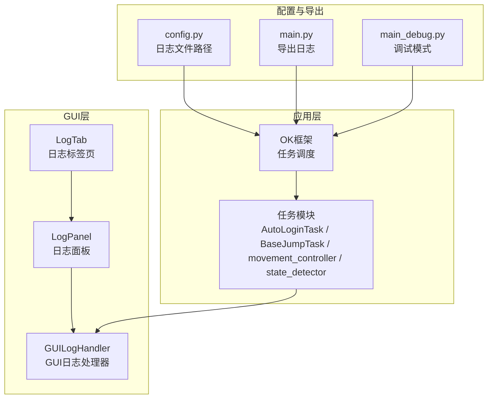
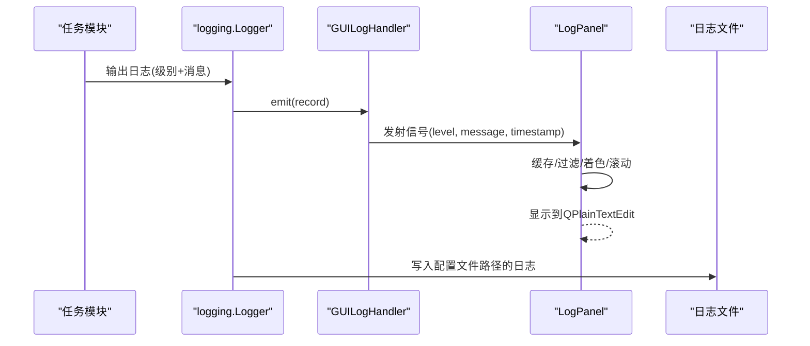
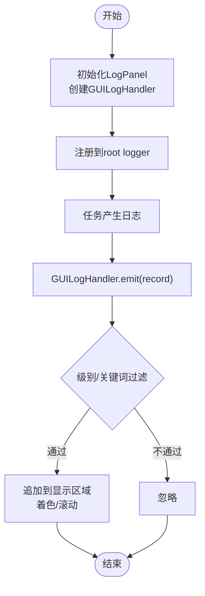
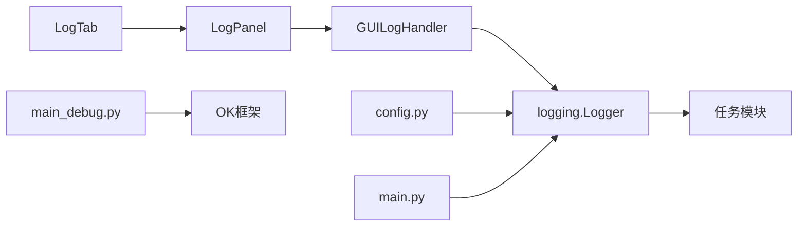

# 错误日志分析

<cite>
**本文引用的文件**
- [src/gui/log_panel.py](file://src/gui/log_panel.py)
- [src/gui/log_tab.py](file://src/gui/log_tab.py)
- [config.py](file://config.py)
- [main.py](file://main.py)
- [main_debug.py](file://main_debug.py)
- [src/task/BaseJumpTask.py](file://src/task/BaseJumpTask.py)
- [src/combat/movement_controller.py](file://src/combat/movement_controller.py)
- [src/combat/state_detector.py](file://src/combat/state_detector.py)
- [src/task/AutoLoginTask.py](file://src/task/AutoLoginTask.py)
</cite>

## 目录
1. [简介](#简介)
2. [项目结构](#项目结构)
3. [核心组件](#核心组件)
4. [架构总览](#架构总览)
5. [详细组件分析](#详细组件分析)
6. [依赖分析](#依赖分析)
7. [性能考虑](#性能考虑)
8. [故障排查指南](#故障排查指南)
9. [结论](#结论)
10. [附录](#附录)

## 简介
本指南面向OK-Jump项目的使用者与维护者，提供一套系统化的“错误日志分析”专业方法。内容涵盖：
- 日志系统架构与日志级别语义
- GUI日志面板的使用与过滤技巧
- 常见错误类型识别与根因追踪
- 日志导出、远程调试与日志聚合建议

通过本指南，您将能够快速定位异常、理解错误上下文，并高效开展问题复现与修复。

## 项目结构
OK-Jump采用基于OK框架的任务驱动架构，日志系统围绕Python标准库logging展开，并通过GUI组件实时展示。关键位置如下：
- 日志UI：src/gui/log_panel.py 提供实时日志面板；src/gui/log_tab.py 将其集成到导航标签页
- 日志配置：config.py 定义日志文件路径（含通用日志与错误日志）
- 导出入口：main.py 提供一键导出日志压缩包的功能
- 任务侧日志：各任务类通过logger输出DEBUG/INFO/WARNING/ERROR/CRITICAL级别日志
- 运行模式：main_debug.py 支持非GUI调试模式

图表来源
- [src/gui/log_tab.py:15-69](file://src/gui/log_tab.py#L15-L69)
- [src/gui/log_panel.py:58-114](file://src/gui/log_panel.py#L58-L114)
- [config.py:126-127](file://config.py#L126-L127)
- [main.py:11-27](file://main.py#L11-L27)
- [main_debug.py:1-16](file://main_debug.py#L1-L16)

章节来源
- [src/gui/log_tab.py:15-69](file://src/gui/log_tab.py#L15-L69)
- [src/gui/log_panel.py:58-114](file://src/gui/log_panel.py#L58-L114)
- [config.py:126-127](file://config.py#L126-L127)
- [main.py:11-27](file://main.py#L11-L27)
- [main_debug.py:1-16](file://main_debug.py#L1-L16)

## 核心组件
- 日志处理器与面板
  - GUILogHandler：将logging记录转发至LogPanel，统一格式化时间戳与消息
  - LogPanel：提供实时显示、级别过滤、关键词过滤、暂停/恢复、自动滚动、清空、颜色高亮等能力
- 日志标签页
  - LogTab：将LogPanel嵌入GUI导航，设置root logger并确保最低级别以捕获所有日志
- 日志配置
  - config.py定义日志文件路径（通用日志与错误日志），便于后续导出与归档
- 导出与调试
  - main.py提供一键导出logs目录为zip并打开下载目录
  - main_debug.py支持禁用GUI、开启调试模式，便于后台运行与问题定位

章节来源
- [src/gui/log_panel.py:34-56](file://src/gui/log_panel.py#L34-L56)
- [src/gui/log_panel.py:58-114](file://src/gui/log_panel.py#L58-L114)
- [src/gui/log_tab.py:47-66](file://src/gui/log_tab.py#L47-L66)
- [config.py:126-127](file://config.py#L126-L127)
- [main.py:11-27](file://main.py#L11-L27)
- [main_debug.py:1-16](file://main_debug.py#L1-L16)

## 架构总览
日志从任务模块产生，经由logging框架流向GUI处理器，再由LogPanel实时呈现。同时，config.py定义的文件路径用于持久化日志，main.py提供导出能力。

图表来源
- [src/gui/log_panel.py:34-56](file://src/gui/log_panel.py#L34-L56)
- [src/gui/log_panel.py:252-271](file://src/gui/log_panel.py#L252-L271)
- [src/gui/log_tab.py:47-66](file://src/gui/log_tab.py#L47-L66)
- [config.py:126-127](file://config.py#L126-L127)

## 详细组件分析

### 日志级别与语义
OK-Jump遵循Python标准日志级别，结合项目实际使用习惯，建议如下解读：
- DEBUG：开发调试细节、内部状态、高频事件（如移动控制的按键按下/释放、帧信息）
- INFO：重要流程节点、状态切换、关键动作确认（如登录成功、窗口状态、后台模式初始化）
- WARNING：潜在风险或异常分支（如无法获取帧、偏移过小跳过移动）
- ERROR：操作失败、异常抛出、关键路径中断（如按键异常、模型初始化失败）
- CRITICAL：系统级严重问题（项目当前未广泛使用）

在GUI中，不同级别对应颜色区分，便于快速识别问题等级。

章节来源
- [src/gui/log_panel.py:71-78](file://src/gui/log_panel.py#L71-L78)
- [src/combat/movement_controller.py:343-345](file://src/combat/movement_controller.py#L343-L345)
- [src/combat/movement_controller.py:381-382](file://src/combat/movement_controller.py#L381-L382)
- [src/task/AutoLoginTask.py:110-114](file://src/task/AutoLoginTask.py#L110-L114)

### GUI日志面板使用与过滤技巧
- 实时显示与自动滚动：默认开启，可在面板顶部工具栏切换
- 暂停/恢复：避免在密集日志时段打断分析
- 级别过滤：仅显示等于或高于当前级别的日志，便于聚焦问题
- 关键词过滤：输入关键词进行二次筛选，适合定位特定模块或事件
- 清空：清理历史缓存，避免干扰
- 颜色高亮：级别颜色与特殊标记颜色帮助快速识别事件类型（如成功/失败/警告/帧信息等）

图表来源
- [src/gui/log_panel.py:272-283](file://src/gui/log_panel.py#L272-L283)
- [src/gui/log_panel.py:285-312](file://src/gui/log_panel.py#L285-L312)
- [src/gui/log_tab.py:47-66](file://src/gui/log_tab.py#L47-L66)

章节来源
- [src/gui/log_panel.py:141-204](file://src/gui/log_panel.py#L141-L204)
- [src/gui/log_panel.py:272-283](file://src/gui/log_panel.py#L272-L283)
- [src/gui/log_panel.py:314-333](file://src/gui/log_panel.py#L314-L333)
- [src/gui/log_tab.py:47-66](file://src/gui/log_tab.py#L47-L66)

### 日志导出与远程调试
- 导出日志
  - 在应用中触发导出逻辑，会将logs目录打包为zip并打开下载目录
  - 适用于远程协助场景，收集完整日志证据
- 远程调试
  - 使用main_debug.py禁用GUI、开启调试模式，便于后台运行与问题复现
  - 结合config.py中的日志文件路径，确保日志落盘

章节来源
- [main.py:11-27](file://main.py#L11-L27)
- [main_debug.py:1-16](file://main_debug.py#L1-L16)
- [config.py:126-127](file://config.py#L126-L127)

### 常见错误类型与识别要点

#### 异常堆栈分析
- 现象特征
  - ERROR级别日志伴随异常信息；部分模块会在错误时输出堆栈详情
- 识别要点
  - 关注“按键异常”“模型初始化失败”等关键字
  - 查看最近的DEBUG/INFO上下文，定位触发条件
- 定位方法
  - 使用GUI关键词过滤“异常/错误”
  - 结合任务名称（如移动控制、登录任务）缩小范围
  - 若涉及外部模型或OCR，优先检查模型文件是否存在与路径解析

章节来源
- [src/combat/movement_controller.py:343-345](file://src/combat/movement_controller.py#L343-L345)
- [src/combat/movement_controller.py:381-382](file://src/combat/movement_controller.py#L381-L382)
- [src/task/AutoLoginTask.py:110-114](file://src/task/AutoLoginTask.py#L110-L114)

#### 错误上下文理解
- 窗口状态与后台模式
  - 后台模式初始化、伪最小化、前台状态等日志有助于判断交互失败原因
- 加载与停滞
  - 登录任务中存在加载界面检测与停滞超时逻辑，相关日志可用于判断卡顿或停滞问题

章节来源
- [src/task/AutoLoginTask.py:172-180](file://src/task/AutoLoginTask.py#L172-L180)
- [src/task/BaseJumpTask.py:155-180](file://src/task/BaseJumpTask.py#L155-L180)

#### 问题根因追踪
- 死亡状态监控
  - 死亡监控线程的启动/停止与状态重置日志，有助于判断战斗相关问题
- 移动控制
  - 按键按下/释放、ADB摇杆、偏移计算等日志，可辅助定位移动异常

章节来源
- [src/combat/state_detector.py:91-100](file://src/combat/state_detector.py#L91-L100)
- [src/combat/state_detector.py:136-137](file://src/combat/state_detector.py#L136-L137)
- [src/combat/state_detector.py:116-116](file://src/combat/state_detector.py#L116-L116)
- [src/combat/movement_controller.py:364-365](file://src/combat/movement_controller.py#L364-L365)
- [src/combat/movement_controller.py:411-412](file://src/combat/movement_controller.py#L411-L412)

## 依赖分析
- LogTab依赖LogPanel，负责UI集成与logger注册
- LogPanel依赖logging框架与Qt组件，实现线程安全的消息传递与渲染
- config.py提供日志文件路径，main.py负责导出
- 任务模块通过logger输出日志，形成从底层到UI的完整链路

图表来源
- [src/gui/log_tab.py:47-66](file://src/gui/log_tab.py#L47-L66)
- [src/gui/log_panel.py:106-110](file://src/gui/log_panel.py#L106-L110)
- [config.py:126-127](file://config.py#L126-L127)
- [main.py:11-27](file://main.py#L11-L27)
- [main_debug.py:1-16](file://main_debug.py#L1-L16)

章节来源
- [src/gui/log_tab.py:47-66](file://src/gui/log_tab.py#L47-L66)
- [src/gui/log_panel.py:106-110](file://src/gui/log_panel.py#L106-L110)
- [config.py:126-127](file://config.py#L126-L127)
- [main.py:11-27](file://main.py#L11-L27)
- [main_debug.py:1-16](file://main_debug.py#L1-L16)

## 性能考虑
- GUI日志面板使用双端队列缓存，限制最大行数，避免内存膨胀
- 自动滚动仅在启用时生效，可手动关闭以减少UI开销
- 关键词过滤与级别过滤在接收端执行，降低不必要的渲染压力
- 建议在稳定运行阶段适当提高过滤级别，仅保留必要日志

章节来源
- [src/gui/log_panel.py:95-103](file://src/gui/log_panel.py#L95-L103)
- [src/gui/log_panel.py:335-337](file://src/gui/log_panel.py#L335-L337)

## 故障排查指南
- 无法看到日志
  - 确认LogTab已添加到GUI导航，且root logger已注册GUILogHandler
  - 检查root logger级别是否低于DEBUG
- 日志过多难以定位
  - 使用级别过滤（提升至WARNING/ERROR）
  - 使用关键词过滤（如“异常”“错误”“模型”）
- 日志未落盘
  - 检查config.py中的日志文件路径配置
  - 确认应用具备写权限
- 需要远程协助
  - 使用导出功能收集完整日志包
- 调试模式
  - 使用main_debug.py禁用GUI，便于后台运行与问题复现

章节来源
- [src/gui/log_tab.py:53-65](file://src/gui/log_tab.py#L53-L65)
- [config.py:126-127](file://config.py#L126-L127)
- [main.py:11-27](file://main.py#L11-L27)
- [main_debug.py:1-16](file://main_debug.py#L1-L16)

## 结论
OK-Jump的日志体系以logging为核心，配合GUI实时面板与导出能力，形成了从底层任务到可视化呈现的完整闭环。通过合理运用级别与关键词过滤、结合任务上下文与异常堆栈，可以高效定位问题并推动修复。建议在日常使用中：
- 默认使用较低级别过滤，聚焦关键信息
- 出现异常时临时降低级别并启用关键词过滤
- 定期导出日志，建立问题归档与回溯机制

## 附录
- 日志级别颜色映射（GUI）
  - DEBUG：灰色
  - INFO：绿色
  - WARNING：橙色
  - ERROR：红色
  - CRITICAL：紫色
- 特殊标记颜色（用于事件类型高亮）
  - 🔍：蓝色（检测开始）
  - ✅：绿色（成功）
  - ❌：红色（失败）
  - 💀：深红（死亡）
  - ⚔️：橙色（战斗）
  - 👤：皇家蓝（自己）
  - 🟢：绿色（友方）
  - 🔴：红色（敌军）
  - 📊：紫色（统计）
  - 📷：青色（帧信息）
  - ⚠️：金色（警告）

章节来源
- [src/gui/log_panel.py:71-93](file://src/gui/log_panel.py#L71-L93)