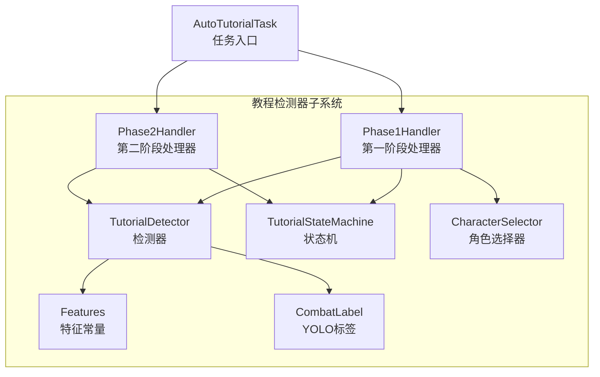
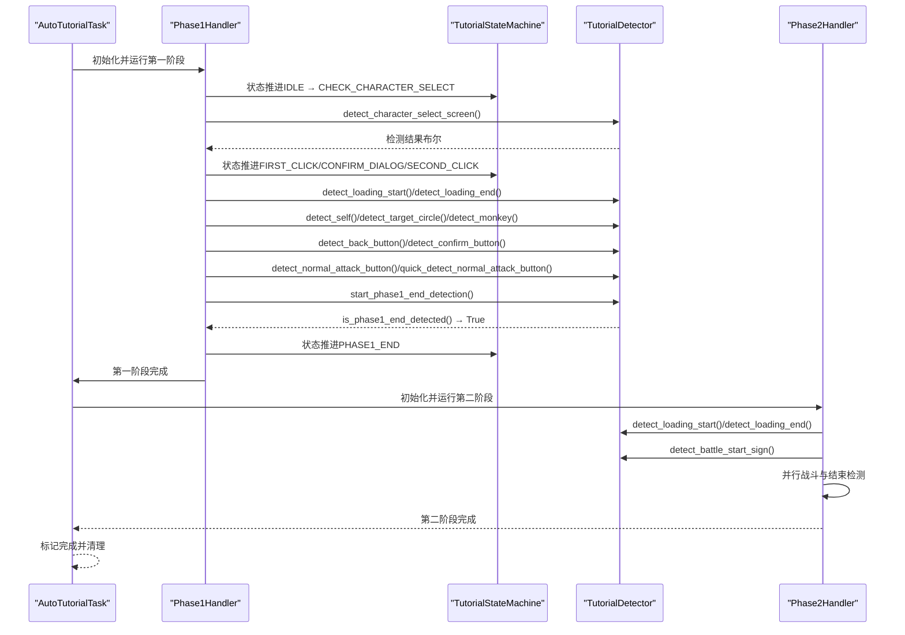
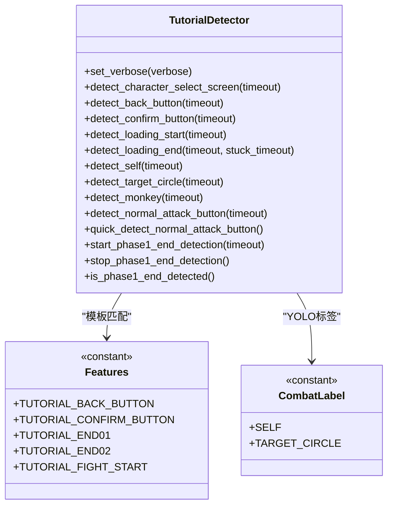
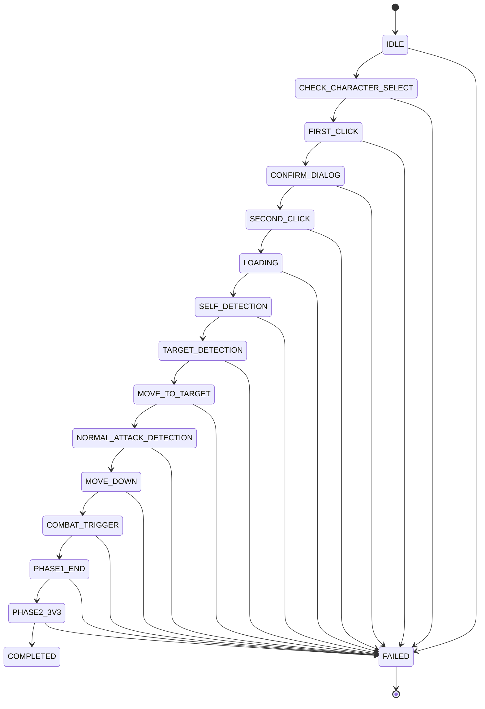
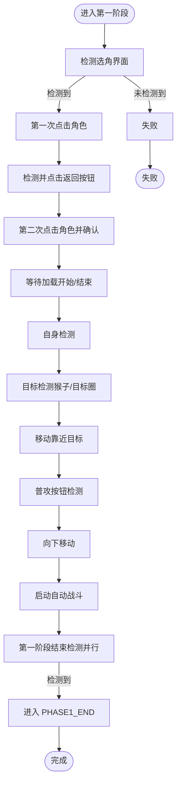
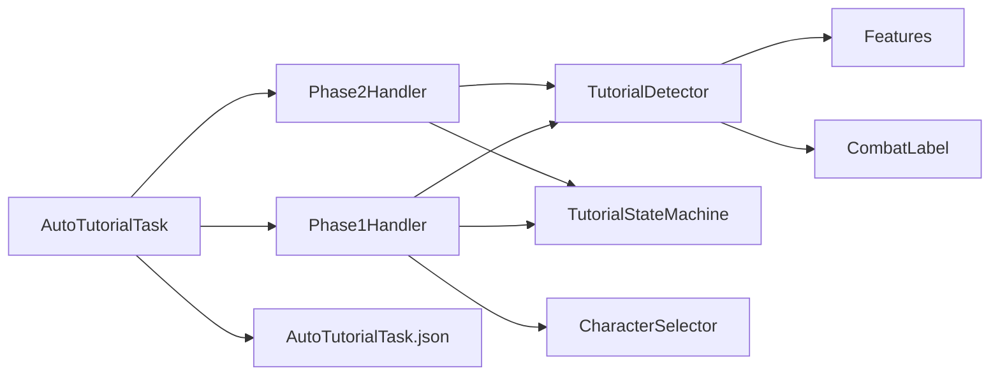

# 教程检测器

<cite>
**本文引用的文件**
- [tutorial_detector.py](file://src/tutorial/tutorial_detector.py)
- [state_machine.py](file://src/tutorial/state_machine.py)
- [phase1_handler.py](file://src/tutorial/phase1_handler.py)
- [phase2_handler.py](file://src/tutorial/phase2_handler.py)
- [character_selector.py](file://src/tutorial/character_selector.py)
- [features.py](file://src/constants/features.py)
- [labels.py](file://src/combat/labels.py)
- [AutoTutorialTask.py](file://src/task/AutoTutorialTask.py)
- [AutoTutorialTask.json](file://configs/AutoTutorialTask.json)
- [coco_detection.json](file://assets/coco_detection.json)
- [test_tutorial.py](file://tests/test_tutorial.py)
</cite>

## 目录
1. [简介](#简介)
2. [项目结构](#项目结构)
3. [核心组件](#核心组件)
4. [架构总览](#架构总览)
5. [详细组件分析](#详细组件分析)
6. [依赖关系分析](#依赖关系分析)
7. [性能考量](#性能考量)
8. [故障排查指南](#故障排查指南)
9. [结论](#结论)
10. [附录](#附录)

## 简介
本文件面向开发者与高级用户，系统性讲解 ok-jump 项目中“教程检测器”的实现原理与工作机制。教程检测器贯穿新手教程的两阶段流程，负责界面元素识别、教程阶段判断与状态转换触发，结合状态机驱动自动化流程。检测器融合多种算法：YOLO 模型检测、OCR 文字识别、模板匹配，并通过配置参数与超时策略保障鲁棒性与可定制性。

## 项目结构
教程检测器位于 src/tutorial 目录，围绕以下模块协同工作：
- tutorial_detector.py：统一的检测接口与算法封装
- state_machine.py：教程状态机定义与状态转换规则
- phase1_handler.py：第一阶段全流程编排与与检测器协作
- phase2_handler.py：第二阶段全流程编排与并行结束检测
- character_selector.py：角色配置与点击区域计算
- features.py：特征名称常量（模板匹配用）
- labels.py：YOLO 模型标签映射
- AutoTutorialTask.py：任务入口，协调两阶段与状态机
- AutoTutorialTask.json：教程检测器相关配置项
- coco_detection.json：模板匹配特征与图片资源清单
- test_tutorial.py：单元测试与集成测试

图表来源
- [tutorial_detector.py:21-823](file://src/tutorial/tutorial_detector.py#L21-L823)
- [state_machine.py:10-209](file://src/tutorial/state_machine.py#L10-L209)
- [phase1_handler.py:21-1354](file://src/tutorial/phase1_handler.py#L21-L1354)
- [phase2_handler.py:19-1522](file://src/tutorial/phase2_handler.py#L19-L1522)
- [character_selector.py:69-232](file://src/tutorial/character_selector.py#L69-L232)
- [features.py:9-100](file://src/constants/features.py#L9-L100)
- [labels.py:8-51](file://src/combat/labels.py#L8-L51)
- [AutoTutorialTask.py:28-349](file://src/task/AutoTutorialTask.py#L28-L349)

章节来源
- [tutorial_detector.py:1-823](file://src/tutorial/tutorial_detector.py#L1-L823)
- [state_machine.py:1-209](file://src/tutorial/state_machine.py#L1-L209)
- [phase1_handler.py:1-1354](file://src/tutorial/phase1_handler.py#L1-L1354)
- [phase2_handler.py:1-1522](file://src/tutorial/phase2_handler.py#L1-L1522)
- [character_selector.py:1-232](file://src/tutorial/character_selector.py#L1-L232)
- [features.py:1-100](file://src/constants/features.py#L1-L100)
- [labels.py:1-51](file://src/combat/labels.py#L1-L51)
- [AutoTutorialTask.py:1-349](file://src/task/AutoTutorialTask.py#L1-L349)

## 核心组件
- 教程检测器（TutorialDetector）：封装模板匹配、OCR、YOLO 等检测能力，提供统一接口；支持独立线程的第一阶段结束检测。
- 状态机（TutorialStateMachine）：定义教程状态与合法转换，记录历史与失败原因，提供终态判定。
- 第一阶段处理器（Phase1Handler）：驱动教程第一阶段，与检测器协作，处理选角、加载、自身检测、目标检测、移动、普攻检测、向下移动、自动战斗触发与第一阶段结束检测。
- 第二阶段处理器（Phase2Handler）：驱动教程第二阶段，处理“开始对战”按钮、双加载等待、战斗开始检测、并行战斗与结束检测、MVP 场景、新英雄场景、最终加载与主界面验证。
- 角色选择器（CharacterSelector）：维护角色配置（点击区域、目标类型、YOLO 模型与标签），支持“全部”模式顺序执行。
- 特征常量（Features）：模板匹配用特征名称，与 coco_detection.json 中的 categories 一一对应。
- YOLO 标签（CombatLabel）：YOLO 模型输出标签映射，用于自身、目标圈、猴子等识别。

章节来源
- [tutorial_detector.py:21-823](file://src/tutorial/tutorial_detector.py#L21-L823)
- [state_machine.py:10-209](file://src/tutorial/state_machine.py#L10-L209)
- [phase1_handler.py:21-1354](file://src/tutorial/phase1_handler.py#L21-L1354)
- [phase2_handler.py:19-1522](file://src/tutorial/phase2_handler.py#L19-L1522)
- [character_selector.py:69-232](file://src/tutorial/character_selector.py#L69-L232)
- [features.py:9-100](file://src/constants/features.py#L9-L100)
- [labels.py:8-51](file://src/combat/labels.py#L8-L51)

## 架构总览
教程检测器与状态机协作的总体流程如下：
- 任务入口（AutoTutorialTask）初始化后台模式、分辨率与配置，选择角色（单个或“全部”）。
- 第一阶段处理器（Phase1Handler）基于状态机推进各阶段，调用检测器执行界面元素识别与阶段判断。
- 检测器内部采用多算法融合：模板匹配（Features）、OCR（文字匹配）、YOLO（自身、目标圈、猴子）。
- 第一阶段结束检测在独立线程中并行运行，一旦检测到 end01/end02 或 OCR 文字，即触发状态转换至 PHASE1_END。
- 第二阶段处理器（Phase2Handler）在战斗开始后并行运行战斗与结束检测，依据战斗结束标志推进后续流程。

图表来源
- [AutoTutorialTask.py:84-193](file://src/task/AutoTutorialTask.py#L84-L193)
- [phase1_handler.py:108-188](file://src/tutorial/phase1_handler.py#L108-L188)
- [state_machine.py:56-181](file://src/tutorial/state_machine.py#L56-L181)
- [tutorial_detector.py:618-783](file://src/tutorial/tutorial_detector.py#L618-L783)
- [phase2_handler.py:78-148](file://src/tutorial/phase2_handler.py#L78-L148)

## 详细组件分析

### 教程检测器（TutorialDetector）
- 功能职责
  - 选角界面检测：模板匹配（Features.XUANREN）+ OCR 文字匹配（简/繁中文）。
  - 按钮检测：返回按钮、确定按钮，优先模板匹配，失败时使用 OCR 文字匹配。
  - 加载界面检测：右下角百分比 OCR 检测，支持加载开始/结束判断与停滞检测。
  - YOLO 检测：自身（SELF）、目标圈（TARGET_CIRCLE）、猴子（fight2.onnx 标签0）。
  - 普攻按钮检测：OCR 文字匹配“普攻按钮”（简/繁）。
  - 第一阶段结束检测：独立线程并行检测 end01/end02 图片与 OCR 文字，检测到后触发状态转换。
- 算法与实现要点
  - 模板匹配：通过 Features 常量与阈值（如 0.5~0.6）进行匹配，优先级高、速度快。
  - OCR：统一使用 task.ocr() 获取文本框集合，find_boxes 进行正则匹配；支持简/繁中文转换。
  - YOLO：使用 og.my_app.yolo_detect/yolo_detect_2，指定标签与阈值（0.5）。
  - 加载百分比：ROI 限定在右下角区域，正则提取“xx%”，结合停滞检测避免误判。
  - 独立线程：第一阶段结束检测在后台线程运行，避免阻塞主流程。
- 关键接口与行为
  - detect_character_select_screen(timeout)
  - detect_back_button(timeout)/detect_confirm_button(timeout)
  - detect_loading_start(timeout)/detect_loading_end(timeout, stuck_timeout)
  - detect_self(timeout)/detect_target_circle(timeout)/detect_monkey(timeout)
  - detect_normal_attack_button(timeout)/quick_detect_normal_attack_button()
  - start_phase1_end_detection(timeout)/stop_phase1_end_detection()/is_phase1_end_detected()

图表来源
- [tutorial_detector.py:21-823](file://src/tutorial/tutorial_detector.py#L21-L823)
- [features.py:85-96](file://src/constants/features.py#L85-L96)
- [labels.py:8-37](file://src/combat/labels.py#L8-L37)

章节来源
- [tutorial_detector.py:21-823](file://src/tutorial/tutorial_detector.py#L21-L823)
- [features.py:85-96](file://src/constants/features.py#L85-L96)
- [labels.py:8-37](file://src/combat/labels.py#L8-L37)

### 状态机（TutorialStateMachine）
- 状态定义与转换
  - 初始：IDLE → CHECK_CHARACTER_SELECT → FIRST_CLICK → CONFIRM_DIALOG → SECOND_CLICK → LOADING → SELF_DETECTION → TARGET_DETECTION → MOVE_TO_TARGET → NORMAL_ATTACK_DETECTION → MOVE_DOWN → COMBAT_TRIGGER → PHASE1_END → PHASE2_3V3 → COMPLETED
  - 失败：任意阶段可转入 FAILED，并记录失败原因。
- 关键方法
  - can_transition_to(next_state)：校验转换合法性
  - transition_to(next_state, reason)：执行状态转换并记录历史
  - fail(reason)：标记失败
  - is_terminal()/is_failed()/is_completed()：终态判定
  - get_state_name()：中文状态名映射

图表来源
- [state_machine.py:10-54](file://src/tutorial/state_machine.py#L10-L54)

章节来源
- [state_machine.py:10-209](file://src/tutorial/state_machine.py#L10-L209)

### 第一阶段处理器（Phase1Handler）
- 职责
  - 驱动教程第一阶段：选角 → 加载 → 自身检测 → 目标检测 → 移动 → 普攻检测 → 向下移动 → 自动战斗触发 → 第一阶段结束检测。
  - 与检测器协作：调用检测器接口，处理按钮点击、加载等待、YOLO 检测与 OCR 检测。
  - 并行结束检测：在自动战斗线程运行的同时，独立线程检测 end01/end02/OCR 文字，检测到后立即切换状态。
- 关键流程
  - 选角界面检测：detect_character_select_screen
  - 返回/确定按钮点击：detect_back_button/detect_confirm_button
  - 加载等待：detect_loading_start/detect_loading_end
  - 自身检测：detect_self
  - 目标检测：detect_target_circle（路飞/小鸣人）或 detect_monkey（悟空）
  - 普攻检测：detect_normal_attack_button/quick_detect_normal_attack_button
  - 向下移动：MOVE_DOWN
  - 自动战斗触发：COMBAT_TRIGGER，复用 AutoCombatTask 的战斗逻辑
  - 第一阶段结束检测：start_phase1_end_detection/stop_phase1_end_detection/is_phase1_end_detected
- 配置与超时
  - 通过配置项读取（如“选角界面检测超时(秒)”、“自身检测超时(秒)”、“普攻检测超时(秒)”、“第一阶段结束检测超时(秒)”等），并在各阶段调用。

图表来源
- [phase1_handler.py:108-188](file://src/tutorial/phase1_handler.py#L108-L188)
- [tutorial_detector.py:618-783](file://src/tutorial/tutorial_detector.py#L618-L783)

章节来源
- [phase1_handler.py:108-783](file://src/tutorial/phase1_handler.py#L108-L783)
- [AutoTutorialTask.json:1-13](file://configs/AutoTutorialTask.json#L1-L13)

### 第二阶段处理器（Phase2Handler）
- 职责
  - 点击“开始对战”按钮（模板匹配 + OCR）
  - 双加载界面等待（含容错：检测“积分争夺”提前结束等待）
  - 战斗开始检测（模板匹配 + OCR）
  - 并行运行自动战斗与结束检测（战斗结束标志）
  - MVP 场景处理（两次点击“退出”）
  - 新英雄场景处理
  - 最终加载界面等待
  - 主界面验证
- 关键接口
  - _click_start_battle/_wait_double_loading/_detect_battle_start/_run_combat_with_end_detection/_handle_mvp_scene/_handle_new_hero_scene/_wait_final_loading/_verify_main_interface
- 并行检测
  - 战斗线程与结束检测线程并行运行，结束检测线程在检测到战斗结束标志后通知主线程。

章节来源
- [phase2_handler.py:78-800](file://src/tutorial/phase2_handler.py#L78-L800)

### 角色选择器（CharacterSelector）
- 角色配置
  - 悟空：左侧区域点击，目标类型 monkey，YOLO fight2.onnx 标签0
  - 路飞/小鸣人：中间/右侧区域点击，目标类型 target_circle，YOLO fight.onnx 标签4
- “全部”模式
  - 顺序执行：悟空 → 小鸣人 → 路飞
- 点击位置计算
  - 根据屏幕宽高与点击区域比例计算中心点坐标

章节来源
- [character_selector.py:69-232](file://src/tutorial/character_selector.py#L69-L232)

### 特征常量与 YOLO 标签
- 特征常量（Features）
  - TUTORIAL_BACK_BUTTON/TUTORIAL_CONFIRM_BUTTON/TUTORIAL_END01/TUTORIAL_END02/TUTORIAL_FIGHT_START 等
  - 与 coco_detection.json 中的 categories 名称一致
- YOLO 标签（CombatLabel）
  - SELF/TARGET_CIRCLE 等标签映射，用于 YOLO 检测

章节来源
- [features.py:85-96](file://src/constants/features.py#L85-L96)
- [labels.py:8-37](file://src/combat/labels.py#L8-L37)
- [coco_detection.json:148-200](file://assets/coco_detection.json#L148-L200)

## 依赖关系分析
- 检测器依赖
  - 模板匹配：依赖 Features 常量与 task.find_one/find_boxes
  - OCR：依赖 task.ocr() 与 find_boxes 正则匹配
  - YOLO：依赖 og.my_app.yolo_detect/yolo_detect_2 与 CombatLabel
- 处理器依赖
  - Phase1Handler/Phase2Handler 依赖 TutorialDetector、TutorialStateMachine、CharacterSelector
  - AutoTutorialTask 依赖两阶段处理器与后台管理
- 配置依赖
  - AutoTutorialTask.json 提供检测器相关超时与行为参数
  - 测试用例 test_tutorial.py 验证状态机、检测器与处理器的行为

图表来源
- [tutorial_detector.py:21-823](file://src/tutorial/tutorial_detector.py#L21-L823)
- [state_machine.py:56-181](file://src/tutorial/state_machine.py#L56-L181)
- [phase1_handler.py:21-1354](file://src/tutorial/phase1_handler.py#L21-L1354)
- [phase2_handler.py:19-1522](file://src/tutorial/phase2_handler.py#L19-L1522)
- [AutoTutorialTask.py:28-349](file://src/task/AutoTutorialTask.py#L28-L349)
- [AutoTutorialTask.json:1-13](file://configs/AutoTutorialTask.json#L1-L13)

章节来源
- [tutorial_detector.py:21-823](file://src/tutorial/tutorial_detector.py#L21-L823)
- [state_machine.py:56-181](file://src/tutorial/state_machine.py#L56-L181)
- [phase1_handler.py:21-1354](file://src/tutorial/phase1_handler.py#L21-L1354)
- [phase2_handler.py:19-1522](file://src/tutorial/phase2_handler.py#L19-L1522)
- [AutoTutorialTask.py:28-349](file://src/task/AutoTutorialTask.py#L28-L349)
- [AutoTutorialTask.json:1-13](file://configs/AutoTutorialTask.json#L1-L13)

## 性能考量
- 检测频率与等待
  - 检测循环中使用短 sleep（如 0.05~0.2 秒）平衡响应速度与 CPU 占用。
  - 加载百分比检测使用 ROI 限制区域，减少 OCR 负担。
- 算法选择
  - 模板匹配优先，阈值适中（0.5~0.6），兼顾准确率与速度。
  - OCR 仅在模板匹配失败时启用，降低误检概率。
  - YOLO 检测阈值固定为 0.5，保证稳定性。
- 并行检测
  - 第一阶段结束检测与自动战斗并行运行，缩短总耗时。
  - 第二阶段战斗与结束检测并行，提升吞吐。
- 缓存与去抖
  - OCR 结果缓存（_get_ocr_texts/_clear_ocr_cache）减少重复调用。
  - 位置历史与抖动检测（位置历史、方向历史、敌人位置平滑）避免误判卡住/抖动。

章节来源
- [tutorial_detector.py:292-414](file://src/tutorial/tutorial_detector.py#L292-L414)
- [phase1_handler.py:393-503](file://src/tutorial/phase1_handler.py#L393-L503)

## 故障排查指南
- 选角界面未检测到
  - 检查 detect_character_select_screen 的超时与阈值设置
  - 确认 Features.XUANREN 对应的图片资源存在
- 返回/确定按钮点击失败
  - 检查 detect_back_button/detect_confirm_button 的阈值与 OCR 文字匹配
  - 确认按钮图片与 OCR 识别结果
- 加载界面卡住
  - 检查 detect_loading_end 的 stuck_timeout 设置
  - 确认右下角百分比 ROI 与正则匹配
- 自身/目标检测超时
  - 调整 detect_self/detect_target_circle/detect_monkey 的超时
  - 检查 YOLO 模型与标签配置
- 第一阶段结束检测未触发
  - 检查 end01/end02 图片与 OCR 文字匹配
  - 确认独立线程已启动且未被提前停止
- 第二阶段战斗结束检测超时
  - 检查战斗结束标志（模板匹配/OCR）与并行结束检测线程
  - 确认战斗超时配置合理

章节来源
- [tutorial_detector.py:618-783](file://src/tutorial/tutorial_detector.py#L618-L783)
- [phase1_handler.py:197-332](file://src/tutorial/phase1_handler.py#L197-L332)
- [phase2_handler.py:467-540](file://src/tutorial/phase2_handler.py#L467-L540)

## 结论
教程检测器通过多算法融合与状态机协作，实现了新手教程全流程的自动化。其设计强调：
- 算法互补：模板匹配快速定位、OCR 文字增强、YOLO 精准识别
- 并行执行：结束检测与自动战斗并行，提升效率
- 配置灵活：大量超时与行为参数可调，适配不同设备与网络环境
- 稳健性：加载停滞检测、位置去抖、容错重试等机制保障鲁棒性

## 附录

### 配置参数与自定义选项
- AutoTutorialTask.json 中的关键参数
  - 角色选择：'悟空'/'路飞'/'小鸣人'/'全部'
  - 选角界面检测超时(秒)：检测选角界面的最长等待时间
  - 自身检测超时(秒)：YOLO检测自身的最长等待时间
  - 目标检测超时(秒)：检测目标圈/猴子的最长等待时间
  - 普攻检测超时(秒)：OCR检测普攻按钮的最长等待时间
  - 第一阶段结束检测超时(秒)：检测第一阶段结束标志的最长等待时间
  - 加载后等待时间(秒)：加载完成后等待游戏稳定的缓冲时间
  - 向下移动时间(秒)：检测到普攻按钮后向下移动的时间
  - 移动持续时间(秒)：每次移动按键的持续时间
  - 点击后等待时间(秒)：点击操作后的等待时间
  - 详细日志：启用后输出详细的调试日志

章节来源
- [AutoTutorialTask.json:1-13](file://configs/AutoTutorialTask.json#L1-L13)

### 使用示例与最佳实践
- 使用示例
  - 在 Phase1Handler 中调用 detect_character_select_screen(timeout) 检测选角界面
  - 在按钮点击阶段调用 detect_back_button(timeout)/detect_confirm_button(timeout)
  - 在加载阶段调用 detect_loading_start(timeout)/detect_loading_end(timeout, stuck_timeout)
  - 在战斗阶段调用 detect_self(timeout)/detect_target_circle(timeout)/detect_monkey(timeout)
  - 在普攻检测阶段调用 detect_normal_attack_button(timeout)/quick_detect_normal_attack_button()
  - 在 COMBAT_TRIGGER 阶段启动 start_phase1_end_detection(timeout)
- 性能优化建议
  - 合理设置超时参数，避免过长等待
  - 使用 ROI 限制 OCR 检测区域，减少误检
  - 适当提高模板匹配阈值，减少误匹配
  - 在移动过程中使用 quick_detect_normal_attack_button() 进行快速检测
  - 启用详细日志仅在调试阶段，避免影响性能

章节来源
- [phase1_handler.py:197-520](file://src/tutorial/phase1_handler.py#L197-L520)
- [tutorial_detector.py:618-783](file://src/tutorial/tutorial_detector.py#L618-L783)