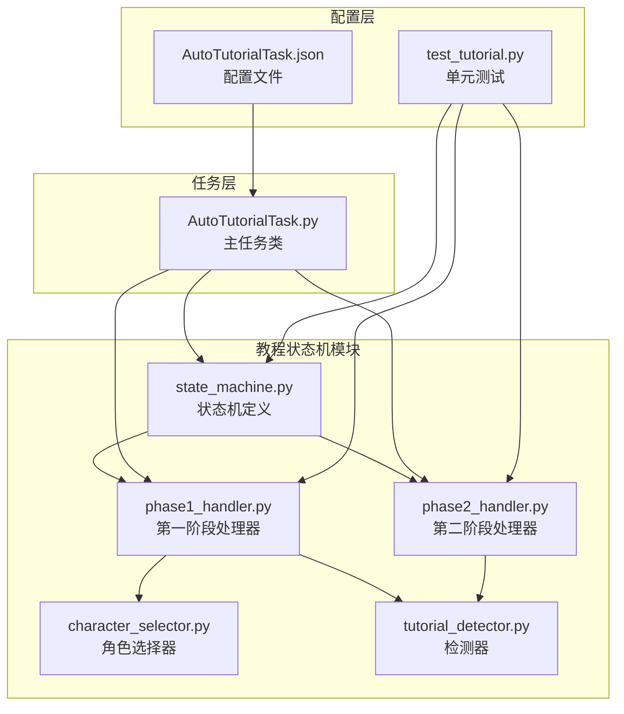
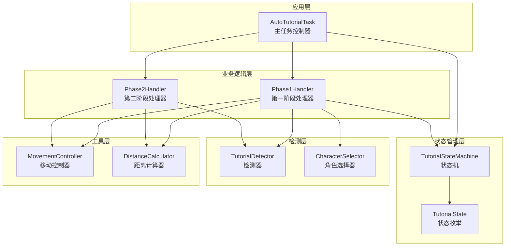
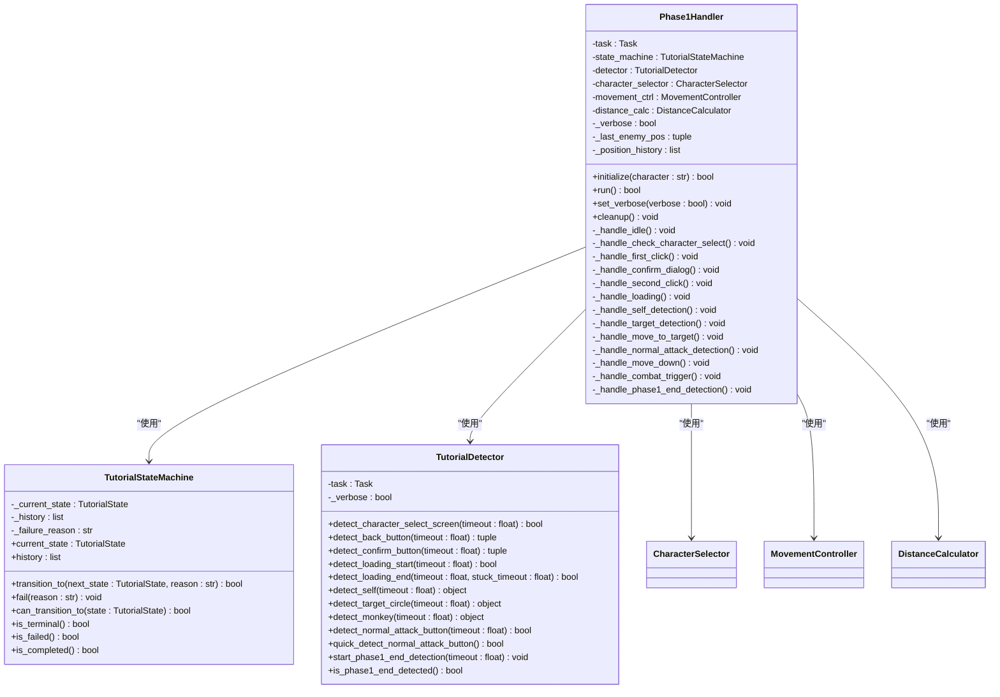
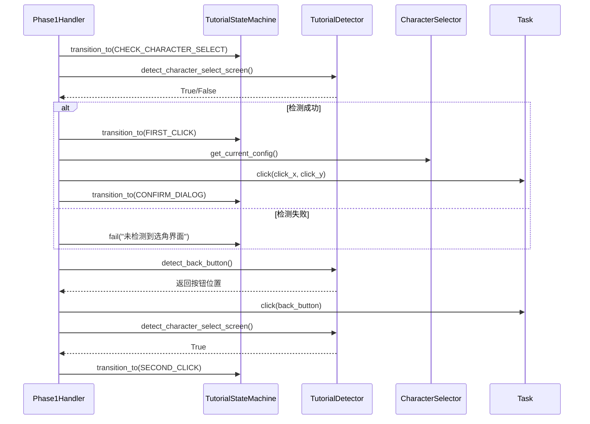
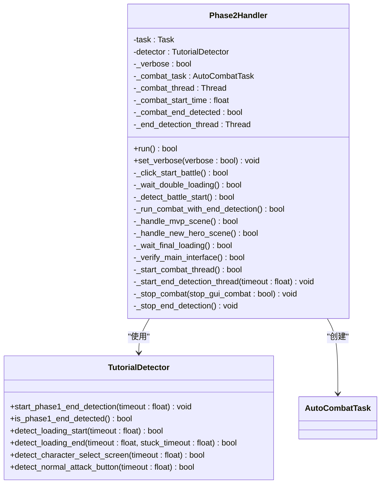
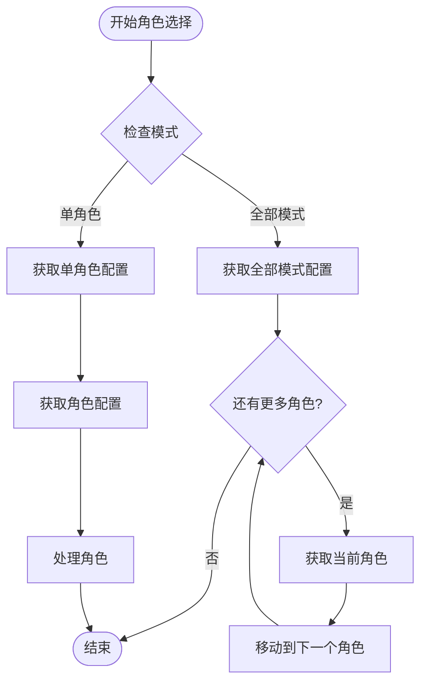
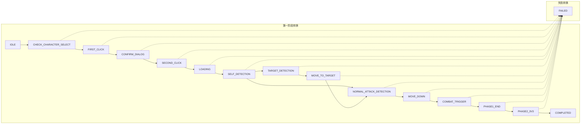
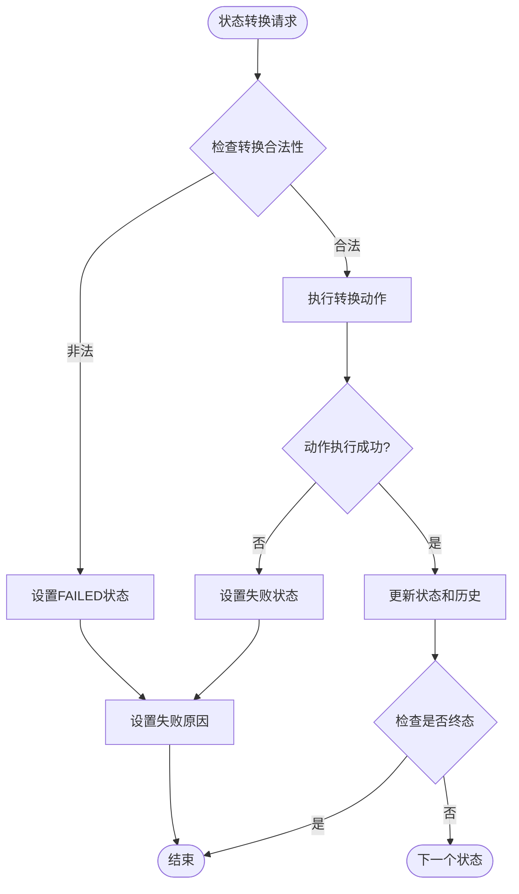
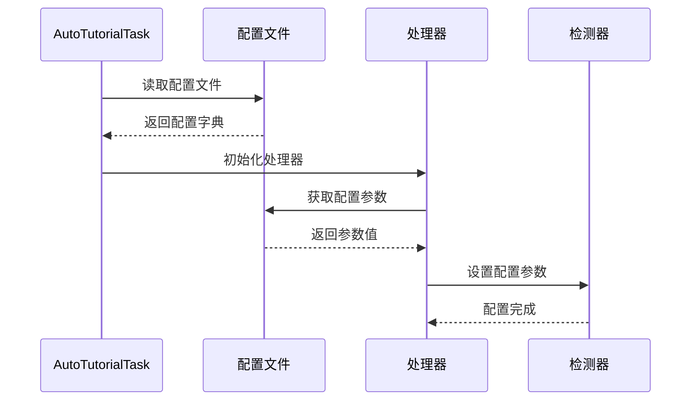

# 教程状态机

<cite>
**本文档引用的文件**
- [state_machine.py](file://src/tutorial/state_machine.py)
- [phase1_handler.py](file://src/tutorial/phase1_handler.py)
- [phase2_handler.py](file://src/tutorial/phase2_handler.py)
- [character_selector.py](file://src/tutorial/character_selector.py)
- [tutorial_detector.py](file://src/tutorial/tutorial_detector.py)
- [AutoTutorialTask.py](file://src/task/AutoTutorialTask.py)
- [AutoTutorialTask.json](file://configs/AutoTutorialTask.json)
- [test_tutorial.py](file://tests/test_tutorial.py)
</cite>

## 目录
1. [简介](#简介)
2. [项目结构](#项目结构)
3. [核心组件](#核心组件)
4. [架构概览](#架构概览)
5. [详细组件分析](#详细组件分析)
6. [状态机设计详解](#状态机设计详解)
7. [状态转换规则](#状态转换规则)
8. [失败处理机制](#失败处理机制)
9. [配置管理](#配置管理)
10. [使用示例](#使用示例)
11. [扩展指导](#扩展指导)
12. [故障排除指南](#故障排除指南)
13. [结论](#结论)

## 简介

ok-jump 项目的教程状态机是一个完整的自动化新手教程系统，负责自动完成游戏的新手引导流程。该系统采用状态机架构，将复杂的教程流程分解为多个清晰的状态阶段，每个阶段都有明确的输入、处理逻辑和输出状态。

系统主要包含两个核心阶段：
- **第一阶段（教程阶段）**：自动完成角色选择、加载、目标检测、移动和战斗触发
- **第二阶段（实战阶段）**：自动完成实战对战、战斗结束检测和后续流程

## 项目结构

教程状态机相关的文件组织结构如下：



**图表来源**
- [state_machine.py:1-209](file://src/tutorial/state_machine.py#L1-L209)
- [phase1_handler.py:1-800](file://src/tutorial/phase1_handler.py#L1-L800)
- [phase2_handler.py:1-800](file://src/tutorial/phase2_handler.py#L1-L800)
- [AutoTutorialTask.py:1-349](file://src/task/AutoTutorialTask.py#L1-L349)

**章节来源**
- [state_machine.py:1-209](file://src/tutorial/state_machine.py#L1-L209)
- [AutoTutorialTask.py:1-349](file://src/task/AutoTutorialTask.py#L1-L349)

## 核心组件

### TutorialState 枚举
TutorialState 定义了教程系统中的所有状态，包括：

- **初始状态**：IDLE（空闲）
- **第一阶段状态**：CHECK_CHARACTER_SELECT、FIRST_CLICK、CONFIRM_DIALOG、SECOND_CLICK
- **第二阶段状态**：LOADING、SELF_DETECTION
- **第三阶段状态**：TARGET_DETECTION、MOVE_TO_TARGET、NORMAL_ATTACK_DETECTION
- **第四阶段状态**：MOVE_DOWN、COMBAT_TRIGGER、PHASE1_END_DETECTION
- **预留状态**：PHASE1_END、PHASE2_3V3
- **终态**：COMPLETED（完成）、FAILED（失败）

### TutorialStateMachine 类
状态机的核心实现，负责：
- 状态转换管理
- 状态历史记录
- 失败处理机制
- 状态查询和验证

**章节来源**
- [state_machine.py:10-54](file://src/tutorial/state_machine.py#L10-L54)
- [state_machine.py:56-209](file://src/tutorial/state_machine.py#L56-L209)

## 架构概览

教程状态机采用分层架构设计，各层职责明确：



**图表来源**
- [AutoTutorialTask.py:28-83](file://src/task/AutoTutorialTask.py#L28-L83)
- [phase1_handler.py:21-61](file://src/tutorial/phase1_handler.py#L21-L61)
- [phase2_handler.py:19-47](file://src/tutorial/phase2_handler.py#L19-L47)

## 详细组件分析

### 第一阶段处理器（Phase1Handler）

第一阶段处理器负责实现完整的教程流程，包括：

#### 核心功能
- **角色选择处理**：自动检测选角界面，执行角色点击和确认
- **加载管理**：等待游戏加载完成并进行缓冲
- **目标检测**：使用YOLO模型检测自身和目标
- **移动控制**：智能移动到目标位置
- **战斗触发**：启动自动战斗系统

#### 处理器架构



**图表来源**
- [phase1_handler.py:21-107](file://src/tutorial/phase1_handler.py#L21-L107)
- [state_machine.py:56-181](file://src/tutorial/state_machine.py#L56-L181)
- [tutorial_detector.py:21-83](file://src/tutorial/tutorial_detector.py#L21-L83)

#### 状态处理流程



**图表来源**
- [phase1_handler.py:192-316](file://src/tutorial/phase1_handler.py#L192-L316)
- [tutorial_detector.py:126-208](file://src/tutorial/tutorial_detector.py#L126-L208)

**章节来源**
- [phase1_handler.py:108-189](file://src/tutorial/phase1_handler.py#L108-L189)
- [phase1_handler.py:192-780](file://src/tutorial/phase1_handler.py#L192-L780)

### 第二阶段处理器（Phase2Handler）

第二阶段处理器专注于实战对战流程：

#### 核心功能
- **开始对战检测**：检测并点击"开始对战"按钮
- **双加载界面处理**：处理游戏的双加载过程
- **战斗开始检测**：确认战斗正式开始
- **并行战斗执行**：同时运行自动战斗和结束检测
- **战斗结束处理**：处理战斗结束后的各种场景

#### 处理器架构



**图表来源**
- [phase2_handler.py:19-149](file://src/tutorial/phase2_handler.py#L19-L149)
- [tutorial_detector.py:618-783](file://src/tutorial/tutorial_detector.py#L618-L783)

**章节来源**
- [phase2_handler.py:78-149](file://src/tutorial/phase2_handler.py#L78-L149)
- [phase2_handler.py:150-800](file://src/tutorial/phase2_handler.py#L150-L800)

### 角色选择器（CharacterSelector）

角色选择器管理不同角色的配置和行为差异：

#### 角色配置

| 角色 | 点击区域 | 目标检测类型 | YOLO模型 | YOLO标签 |
|------|----------|--------------|----------|----------|
| 悟空 | 左侧1/3 | monkey | fight2.onnx | 0 |
| 路飞 | 中间1/3 | target_circle | fight.onnx | 4 |
| 小鸣人 | 右侧1/3 | target_circle | fight.onnx | 4 |

#### 角色处理逻辑



**图表来源**
- [character_selector.py:69-232](file://src/tutorial/character_selector.py#L69-L232)

**章节来源**
- [character_selector.py:69-232](file://src/tutorial/character_selector.py#L69-L232)

## 状态机设计详解

### 状态定义和含义

教程状态机的状态定义体现了游戏新手教程的完整流程：

#### 第一阶段状态详解

| 状态 | 中文名称 | 功能描述 | 超时设置 | 失败条件 |
|------|----------|----------|----------|----------|
| IDLE | 空闲 | 系统初始状态，等待开始 | 无 | 无 |
| CHECK_CHARACTER_SELECT | 检查选角界面 | 检测选角界面是否出现 | 10秒 | 超时未检测到 |
| FIRST_CLICK | 第一次点击角色 | 点击角色区域 | 无 | 点击失败 |
| CONFIRM_DIALOG | 检测并点击返回按钮 | 处理确认对话框 | 5秒×3次重试 | 重试耗尽 |
| SECOND_CLICK | 第二次点击角色并确认 | 点击角色并确认 | 5秒×3次重试 | 重试耗尽 |
| LOADING | 等待加载 | 等待加载界面开始和结束 | 开始: 10秒, 结束: 60秒 | 加载超时 |
| SELF_DETECTION | 自身检测 | YOLO检测自身位置 | 30秒 | 超时未检测到 |
| TARGET_DETECTION | 目标检测 | 检测目标圈或猴子 | 10秒 | 超时未检测到 |
| MOVE_TO_TARGET | 移动靠近目标 | 智能移动到目标位置 | 50秒 | 超时或目标丢失 |
| NORMAL_ATTACK_DETECTION | 普攻按钮检测 | OCR检测普攻按钮 | 10秒/40秒 | 超时未检测到 |
| MOVE_DOWN | 向下移动 | 向下移动1.5秒 | 1秒 | 无 |
| COMBAT_TRIGGER | 启动自动战斗 | 启动自动战斗系统 | 无限制 | 异常 |
| PHASE1_END_DETECTION | 第一阶段结束检测 | 并行检测结束标志 | 120秒 | 超时未检测到 |
| PHASE1_END | 第一阶段结束 | 第一阶段完成 | 无 | 无 |
| PHASE2_3V3 | 第二阶段3V3 | 预留状态 | 无 | 无 |
| COMPLETED | 完成 | 全部完成 | 无 | 无 |
| FAILED | 失败 | 任务失败 | 无 | 任意失败条件 |

### 状态转换映射

状态机的转换规则体现了教程流程的逻辑关系：



**图表来源**
- [state_machine.py:64-79](file://src/tutorial/state_machine.py#L64-L79)

**章节来源**
- [state_machine.py:10-54](file://src/tutorial/state_machine.py#L10-L54)
- [state_machine.py:64-79](file://src/tutorial/state_machine.py#L64-L79)

## 状态转换规则

### 合法转换映射

状态机定义了严格的转换规则，确保流程的正确性：

#### 基本转换规则
- **IDLE** → **CHECK_CHARACTER_SELECT**：系统启动后的唯一合法转换
- **CHECK_CHARACTER_SELECT** → **FIRST_CLICK**：检测到选角界面后的下一步
- **FIRST_CLICK** → **CONFIRM_DIALOG**：第一次点击后的确认处理
- **CONFIRM_DIALOG** → **SECOND_CLICK**：确认对话框处理后的下一步
- **SECOND_CLICK** → **LOADING**：第二次点击后的加载等待
- **LOADING** → **SELF_DETECTION**：加载完成后的自身检测
- **SELF_DETECTION** → **TARGET_DETECTION**：自身检测成功后的目标检测
- **SELF_DETECTION** → **NORMAL_ATTACK_DETECTION**：悟空角色的特殊路径
- **TARGET_DETECTION** → **MOVE_TO_TARGET**：目标检测成功后的移动
- **MOVE_TO_TARGET** → **NORMAL_ATTACK_DETECTION**：移动完成后的普攻检测
- **NORMAL_ATTACK_DETECTION** → **MOVE_DOWN**：普攻按钮检测成功后的移动
- **MOVE_DOWN** → **COMBAT_TRIGGER**：移动完成后的战斗触发
- **COMBAT_TRIGGER** → **PHASE1_END**：战斗触发后的阶段结束
- **PHASE1_END** → **PHASE2_3V3**：第一阶段结束后的准备
- **PHASE2_3V3** → **COMPLETED**：第二阶段完成后的最终完成

#### 失败转换规则
所有状态都可以转换到 **FAILED** 状态，但 **FAILED** 状态只能转换到 **COMPLETED** 状态（作为最终状态）。

### 约束条件

状态转换遵循以下约束条件：

1. **顺序约束**：必须按照教程流程的固定顺序进行转换
2. **前置条件**：目标状态必须满足相应的前置条件
3. **互斥性**：某些状态转换是互斥的（如悟空角色的特殊路径）
4. **超时约束**：每个状态都有相应的超时限制
5. **资源约束**：某些状态转换需要特定的资源（如角色配置、检测器等）

**章节来源**
- [state_machine.py:102-136](file://src/tutorial/state_machine.py#L102-L136)
- [phase1_handler.py:192-780](file://src/tutorial/phase1_handler.py#L192-L780)

## 失败处理机制

### 失败检测和报告

教程状态机实现了完善的失败处理机制：

#### 失败检测策略
- **超时检测**：所有状态转换都有超时限制
- **条件检测**：关键操作的成功与否检测
- **异常捕获**：运行时异常的捕获和处理
- **状态验证**：转换后的状态验证

#### 失败处理流程



**图表来源**
- [state_machine.py:115-145](file://src/tutorial/state_machine.py#L115-L145)

#### 失败原因记录

失败处理机制会记录详细的失败原因，包括：
- **检测失败**：如"未检测到选角界面"
- **操作失败**：如"返回按钮点击失败"
- **超时失败**：如"自身检测超时"
- **异常失败**：如"第一阶段异常"

**章节来源**
- [state_machine.py:137-151](file://src/tutorial/state_machine.py#L137-L151)
- [phase1_handler.py:184-188](file://src/tutorial/phase1_handler.py#L184-L188)

## 配置管理

### 配置结构

教程状态机使用JSON配置文件管理所有可调参数：

#### 默认配置参数

| 参数名称 | 默认值 | 描述 |
|----------|--------|------|
| 角色选择 | "路飞" | 选择要执行的角色 |
| 选角界面检测超时(秒) | 10.0 | 检测选角界面的最长等待时间 |
| 自身检测超时(秒) | 30.0 | YOLO检测自身的最长等待时间 |
| 目标检测超时(秒) | 10.0 | 检测目标圈/猴子的最长等待时间 |
| 普攻检测超时(秒) | 10.0/40.0 | OCR检测普攻按钮的最长等待时间 |
| 第一阶段结束检测超时(秒) | 120.0 | 检测第一阶段结束标志的最长等待时间 |
| 加载后等待时间(秒) | 30.0 | 加载完成后等待游戏稳定的缓冲时间 |
| 向下移动时间(秒) | 1.0 | 检测到普攻按钮后向下移动的时间 |
| 移动持续时间(秒) | 0.5 | 每次移动按键的持续时间 |
| 点击后等待时间(秒) | 1.0 | 点击操作后的等待时间 |
| 详细日志 | true | 启用后输出详细的调试日志 |

#### 配置加载机制

配置文件通过AutoTutorialTask类加载和管理：



**图表来源**
- [AutoTutorialTask.py:41-74](file://src/task/AutoTutorialTask.py#L41-L74)
- [AutoTutorialTask.py:301-349](file://src/task/AutoTutorialTask.py#L301-L349)

**章节来源**
- [AutoTutorialTask.py:41-74](file://src/task/AutoTutorialTask.py#L41-L74)
- [AutoTutorialTask.json:1-13](file://configs/AutoTutorialTask.json#L1-L13)

## 使用示例

### 基本使用方法

#### 单角色教程执行

```python
# 创建教程任务实例
task = AutoTutorialTask(executor, task_context)

# 设置角色配置
task.config['角色选择'] = '路飞'

# 执行教程
success = task.run()

if success:
    print("教程执行成功")
else:
    print(f"教程执行失败: {task._phase1_handler.state_machine.failure_reason}")
```

#### 多角色教程执行

```python
# 执行所有角色的教程
task.config['角色选择'] = '全部'
success = task.run()

if success:
    completed_chars = task.get_completed_characters()
    print(f"完成的角色: {completed_chars}")
```

#### 状态监控

```python
# 监控教程状态
while not task._phase1_handler.state_machine.is_terminal():
    current_state = task.get_current_state()
    print(f"当前状态: {current_state}")
    time.sleep(1)
```

### 高级使用技巧

#### 自定义超时设置

```python
# 为不同角色设置不同的超时参数
if character == '悟空':
    task.config['普攻检测超时(秒)'] = 40.0
    task.config['自身检测超时(秒)'] = 45.0
```

#### 错误处理和重试

```python
def handle_tutorial_error(task, error_reason):
    """处理教程执行错误"""
    # 保存错误截图
    task._save_error_screenshot(f"tutorial_error_{error_reason}")
    
    # 根据错误类型决定是否重试
    if "超时" in error_reason:
        # 超时错误可以重试
        return True
    else:
        # 其他错误直接失败
        return False
```

**章节来源**
- [AutoTutorialTask.py:84-193](file://src/task/AutoTutorialTask.py#L84-L193)
- [phase1_handler.py:108-189](file://src/tutorial/phase1_handler.py#L108-L189)

## 扩展指导

### 添加新状态

要向教程状态机添加新状态，需要进行以下步骤：

#### 1. 扩展状态枚举

在 TutorialState 中添加新状态：

```python
class TutorialState(Enum):
    # ... 现有状态 ...
    
    NEW_STATE = 'new_state'  # 新状态
```

#### 2. 更新转换映射

在 TutorialStateMachine 中添加转换规则：

```python
class TutorialStateMachine:
    TRANSITIONS = {
        # ... 现有转换 ...
        
        TutorialState.EXISTING_STATE: [TutorialState.NEW_STATE, TutorialState.FAILED],
        TutorialState.NEW_STATE: [TutorialState.NEXT_STATE, TutorialState.FAILED],
    }
```

#### 3. 实现状态处理逻辑

在 Phase1Handler 中添加新状态的处理方法：

```python
def _handle_new_state(self):
    """处理新状态的逻辑"""
    # 实现新状态的具体处理逻辑
    if self.new_state_condition_met():
        self.state_machine.transition_to(TutorialState.NEXT_STATE)
    else:
        self.state_machine.fail("新状态处理失败")
```

#### 4. 更新状态名称映射

在 TutorialStateMachine 中添加中文名称映射：

```python
def get_state_name(self) -> str:
    names = {
        # ... 现有映射 ...
        TutorialState.NEW_STATE: '新状态',
    }
    return names.get(self._current_state, self._current_state.value)
```

### 修改现有状态转换

#### 修改转换条件

```python
def _handle_target_detection(self):
    """修改目标检测处理逻辑"""
    # 增加额外的检测条件
    if self.additional_condition():
        # 跳过某些转换
        self.state_machine.transition_to(TutorialState.SPECIAL_STATE)
    else:
        # 使用原有的转换逻辑
        self.state_machine.transition_to(TutorialState.MOVE_TO_TARGET)
```

#### 添加状态转换验证

```python
def can_transition_to(self, next_state: TutorialState) -> bool:
    """增强转换验证逻辑"""
    # 调用父类验证
    if not super().can_transition_to(next_state):
        return False
    
    # 添加自定义验证
    if next_state == TutorialState.SPECIAL_STATE:
        return self.special_condition()
    
    return True
```

### 扩展检测器功能

#### 添加新的检测方法

```python
def detect_custom_element(self, timeout: float) -> bool:
    """检测自定义元素"""
    start_time = time.time()
    
    while time.time() - start_time < timeout:
        self.task.next_frame()
        
        # 实现自定义检测逻辑
        if self.custom_detection_logic():
            return True
        
        time.sleep(0.1)
    
    return False
```

**章节来源**
- [state_machine.py:10-54](file://src/tutorial/state_machine.py#L10-L54)
- [state_machine.py:64-79](file://src/tutorial/state_machine.py#L64-L79)
- [phase1_handler.py:192-780](file://src/tutorial/phase1_handler.py#L192-L780)

## 故障排除指南

### 常见问题和解决方案

#### 1. 选角界面检测失败

**问题症状**：
- 状态停留在 CHECK_CHARACTER_SELECT
- 日志显示"未检测到选角界面"

**可能原因**：
- 游戏界面未正确加载
- OCR检测失败
- 分辨率不匹配

**解决方案**：
```python
# 增加检测重试
detector.detect_character_select_screen(timeout=15.0)

# 检查分辨率
resolution = task.get_resolution_info()
print(f"当前分辨率: {resolution}")

# 验证OCR配置
texts = task.ocr()
print(f"OCR检测到的文本: {texts}")
```

#### 2. 加载界面超时

**问题症状**：
- 状态停留在 LOADING
- 日志显示"加载超时"

**可能原因**：
- 游戏加载缓慢
- 加载百分比检测异常
- 网络连接问题

**解决方案**：
```python
# 增加加载超时时间
task.config['加载后等待时间(秒)'] = 45.0

# 检查加载百分比检测
percentage = detector._detect_loading_percentage()
print(f"加载百分比: {percentage}")

# 监控加载停滞
if detector._loading_stuck_time:
    print(f"加载停滞时间: {time.time() - detector._loading_stuck_time}")
```

#### 3. 目标检测失败

**问题症状**：
- 状态停留在 TARGET_DETECTION
- 日志显示"目标检测超时"

**可能原因**：
- YOLO模型配置错误
- 目标不在检测范围内
- 图像质量差

**解决方案**：
```python
# 检查YOLO模型配置
config = character_selector.get_current_config()
print(f"当前角色: {config.name}")
print(f"YOLO模型: {config.yolo_model}")
print(f"YOLO标签: {config.yolo_label}")

# 增加检测超时
task.config['目标检测超时(秒)'] = 20.0

# 检查图像质量
frame = task.frame
if frame is not None:
    print(f"图像尺寸: {frame.shape}")
```

#### 4. 普攻按钮检测失败

**问题症状**：
- 状态停留在 NORMAL_ATTACK_DETECTION
- 日志显示"普攻按钮检测超时"

**可能原因**：
- OCR检测失败
- 文字识别不准确
- 屏幕缩放问题

**解决方案**：
```python
# 增加检测超时时间
task.config['普攻检测超时(秒)'] = 30.0

# 检查OCR配置
texts = task.ocr()
print(f"OCR检测到的文本: {texts}")

# 验证文字匹配
for text in texts:
    print(f"文本内容: {text.name}")
```

#### 5. 战斗触发失败

**问题症状**：
- 状态停留在 COMBAT_TRIGGER
- 日志显示"战斗触发异常"

**可能原因**：
- AutoCombatTask配置错误
- GUI自动战斗触发器冲突
- 战斗状态检测异常

**解决方案**：
```python
# 检查AutoCombatTask配置
combat_config = task.config.get('AutoCombatTask', {})
print(f"战斗配置: {combat_config}")

# 暂停GUI自动战斗触发器
was_enabled = task._disable_gui_combat_trigger()
print(f"GUI触发器状态: {was_enabled}")

# 检查战斗状态
if hasattr(task._phase1_handler, 'movement_ctrl'):
    print("移动控制器状态正常")
```

### 调试技巧

#### 启用详细日志

```python
# 在配置中启用详细日志
task.config['详细日志'] = True

# 或者在运行时设置
phase1_handler.set_verbose(True)
```

#### 状态监控

```python
def monitor_tutorial_state(task):
    """监控教程状态变化"""
    previous_state = None
    
    while not task._phase1_handler.state_machine.is_terminal():
        current_state = task.get_current_state()
        
        if current_state != previous_state:
            print(f"状态变化: {previous_state} → {current_state}")
            previous_state = current_state
        
        time.sleep(0.5)
```

#### 错误截图保存

```python
def save_tutorial_screenshot(task, error_name):
    """保存教程错误截图"""
    import os
    import cv2
    
    screenshots_dir = "screenshots"
    if not os.path.exists(screenshots_dir):
        os.makedirs(screenshots_dir)
    
    filename = f"{error_name}_{time.strftime('%H-%M-%S')}.png"
    filepath = os.path.join(screenshots_dir, filename)
    
    if task.frame is not None:
        cv2.imwrite(filepath, task.frame)
        print(f"错误截图已保存: {filepath}")
```

**章节来源**
- [phase1_handler.py:184-188](file://src/tutorial/phase1_handler.py#L184-L188)
- [AutoTutorialTask.py:252-279](file://src/task/AutoTutorialTask.py#L252-L279)

## 结论

ok-jump 项目的教程状态机是一个设计精良、功能完整的自动化系统。其核心特点包括：

### 设计优势

1. **清晰的状态分离**：将复杂的教程流程分解为多个明确的状态阶段
2. **严格的转换规则**：确保流程的正确性和一致性
3. **完善的失败处理**：提供详细的错误检测和恢复机制
4. **灵活的配置管理**：支持多种角色和场景的配置需求
5. **强大的扩展能力**：易于添加新状态和修改现有逻辑

### 技术特色

1. **多模态检测**：结合模板匹配、OCR和YOLO模型的综合检测系统
2. **智能移动控制**：基于距离计算的智能移动算法
3. **并行处理**：支持战斗和结束检测的并行运行
4. **状态历史记录**：完整的状态转换历史追踪
5. **详细日志系统**：全面的调试和监控支持

### 应用价值

教程状态机不仅实现了游戏新手教程的完全自动化，还为类似的应用场景提供了可复用的架构模式。其模块化的设计使得开发者可以轻松地扩展和定制功能，满足不同游戏和场景的需求。

通过合理使用本指南提供的扩展指导和故障排除技巧，开发者可以进一步优化和定制教程状态机，实现更加复杂和智能的自动化功能。