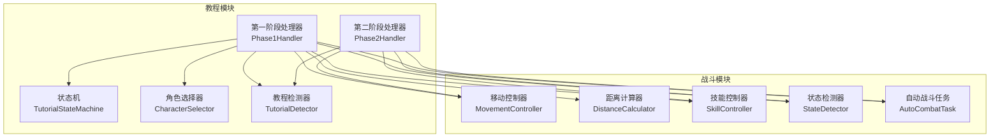
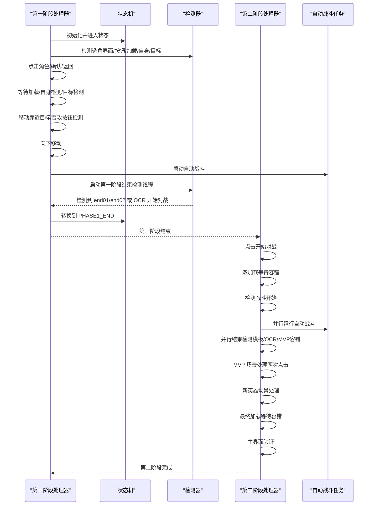
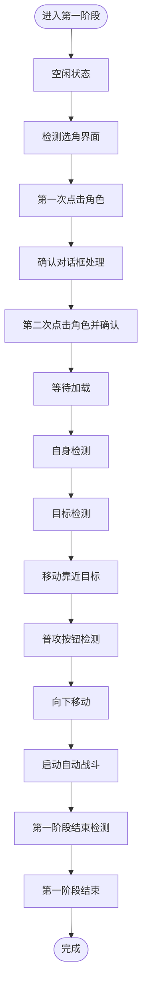
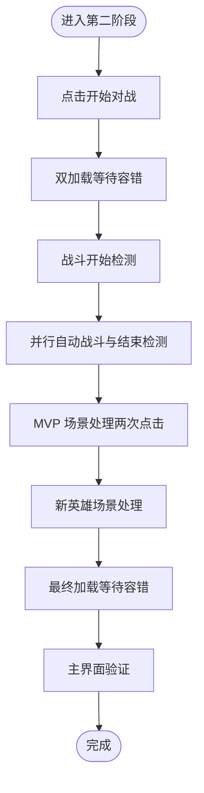
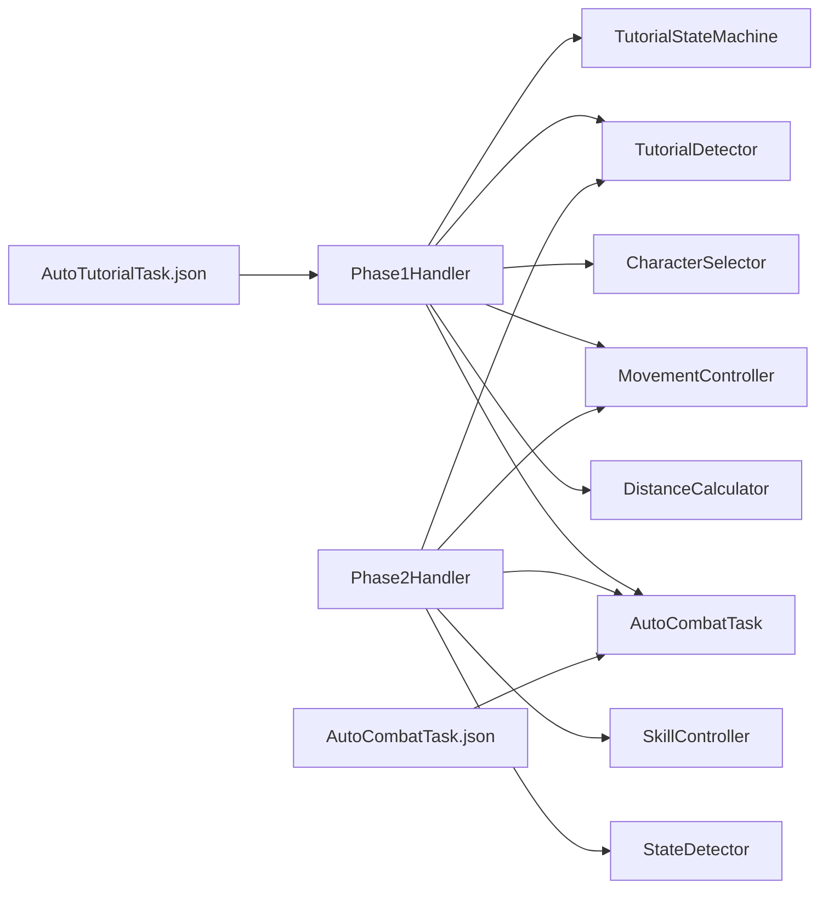

# 教程阶段处理器

<cite>
**本文引用的文件**
- [phase1_handler.py](file://src/tutorial/phase1_handler.py)
- [phase2_handler.py](file://src/tutorial/phase2_handler.py)
- [character_selector.py](file://src/tutorial/character_selector.py)
- [tutorial_detector.py](file://src/tutorial/tutorial_detector.py)
- [state_machine.py](file://src/tutorial/state_machine.py)
- [AutoTutorialTask.json](file://configs/AutoTutorialTask.json)
- [AutoCombatTask.py](file://src/task/AutoCombatTask.py)
- [movement_controller.py](file://src/combat/movement_controller.py)
- [distance_calculator.py](file://src/combat/distance_calculator.py)
- [state_detector.py](file://src/combat/state_detector.py)
- [skill_controller.py](file://src/combat/skill_controller.py)
- [labels.py](file://src/combat/labels.py)
</cite>

## 目录
1. [简介](#简介)
2. [项目结构](#项目结构)
3. [核心组件](#核心组件)
4. [架构总览](#架构总览)
5. [详细组件分析](#详细组件分析)
6. [依赖关系分析](#依赖关系分析)
7. [性能考量](#性能考量)
8. [故障排查指南](#故障排查指南)
9. [结论](#结论)
10. [附录](#附录)

## 简介
本文件面向 ok-jump 项目的“教程阶段处理器”，系统性梳理第一阶段与第二阶段处理器的实现差异、处理逻辑、协作机制与错误恢复策略。重点覆盖：
- 第一阶段处理器：角色选择检测、点击操作、确认对话框处理、加载等待、自身检测、目标检测、移动控制、普攻按钮检测、向下移动、自动战斗触发、第一阶段结束检测。
- 第二阶段处理器：点击开始对战、双加载等待、战斗开始检测、自动战斗并行结束检测、MVP 场景处理、新英雄场景处理、最终加载、主界面验证。
- 两阶段之间的协作：第一阶段结束检测与第二阶段自动战斗并行运行；第一阶段结束后第二阶段接管。
- 超时与错误恢复：各阶段超时策略、重试与容错、异常截图与日志记录。
- 扩展指导：如何新增处理逻辑、修改现有流程。

## 项目结构
教程阶段处理器位于 src/tutorial 目录，围绕状态机驱动的流程控制，结合检测器与战斗控制器完成自动化。

图表来源
- [phase1_handler.py:1-1354](file://src/tutorial/phase1_handler.py#L1-L1354)
- [phase2_handler.py:1-1522](file://src/tutorial/phase2_handler.py#L1-L1522)
- [state_machine.py:1-209](file://src/tutorial/state_machine.py#L1-L209)
- [character_selector.py:1-232](file://src/tutorial/character_selector.py#L1-L232)
- [tutorial_detector.py:1-823](file://src/tutorial/tutorial_detector.py#L1-L823)

章节来源
- [phase1_handler.py:1-1354](file://src/tutorial/phase1_handler.py#L1-L1354)
- [phase2_handler.py:1-1522](file://src/tutorial/phase2_handler.py#L1-L1522)
- [state_machine.py:1-209](file://src/tutorial/state_machine.py#L1-L209)

## 核心组件
- 状态机 TutorialStateMachine：定义教程所有状态与转换规则，驱动第一阶段处理器的状态流转。
- 第一阶段处理器 Phase1Handler：实现第一阶段完整流程，含角色选择、点击、确认、加载、自身检测、目标检测、移动、普攻按钮检测、向下移动、自动战斗触发与第一阶段结束检测。
- 第二阶段处理器 Phase2Handler：实现第二阶段完整流程，含点击开始对战、双加载等待、战斗开始检测、自动战斗并行结束检测、MVP 场景处理、新英雄场景处理、最终加载、主界面验证。
- 角色选择器 CharacterSelector：维护角色配置、点击区域与目标类型，支持“全部”模式顺序执行。
- 教程检测器 TutorialDetector：封装模板匹配、OCR、YOLO 检测，提供统一的检测接口与第一阶段结束检测线程。
- AutoCombatTask：提供自动战斗能力，第一阶段与第二阶段均可复用其战斗逻辑与配置。

章节来源
- [state_machine.py:10-209](file://src/tutorial/state_machine.py#L10-L209)
- [phase1_handler.py:21-189](file://src/tutorial/phase1_handler.py#L21-L189)
- [phase2_handler.py:19-149](file://src/tutorial/phase2_handler.py#L19-L149)
- [character_selector.py:69-232](file://src/tutorial/character_selector.py#L69-L232)
- [tutorial_detector.py:21-823](file://src/tutorial/tutorial_detector.py#L21-L823)

## 架构总览
两阶段处理器通过状态机与检测器协同工作，第一阶段结束检测与第二阶段自动战斗并行运行，确保流程高效推进与容错。

图表来源
- [phase1_handler.py:642-780](file://src/tutorial/phase1_handler.py#L642-L780)
- [phase2_handler.py:469-541](file://src/tutorial/phase2_handler.py#L469-L541)
- [tutorial_detector.py:620-783](file://src/tutorial/tutorial_detector.py#L620-L783)

## 详细组件分析

### 第一阶段处理器（Phase1Handler）
- 功能概览
  - 角色选择检测：模板匹配与 OCR 双通道检测选角界面。
  - 点击操作：根据角色配置计算点击区域，执行第一次与第二次点击。
  - 确认对话框处理：检测返回按钮与确定按钮，带重试与验证。
  - 加载等待：检测加载百分比，支持停滞检测与缓冲等待。
  - 自身检测：YOLO 检测自身位置，悟空角色特殊处理。
  - 目标检测：悟空检测猴子，其他角色检测目标圈。
  - 移动控制：基于距离计算与移动控制器靠近目标，具备卡住/抖动检测与随机移动容错。
  - 普攻按钮检测：OCR 检测“普攻按钮”，不同角色超时不同。
  - 向下移动：固定时长向下移动。
  - 自动战斗触发：并行启动自动战斗与第一阶段结束检测，检测到 end01/end02 或 OCR 开始对战即结束第一阶段。
- 关键特性
  - 详细日志与错误截图：每个关键步骤均记录日志并保存错误截图。
  - 配置驱动：大量超时与行为参数来自配置文件 AutoTutorialTask.json。
  - 线程安全：使用锁保护共享状态，避免竞态。
  - 容错机制：自身检测失败时随机移动尝试恢复；移动过程抖动检测与卡住检测。
- 数据流
  - 状态机驱动：状态切换决定执行分支。
  - 检测器提供视觉信息：按钮、加载、自身、目标、普攻按钮。
  - 控制器执行动作：点击、移动、技能释放。
  - 结束检测线程：并行监控 end01/end02 与 OCR 开始对战。

图表来源
- [state_machine.py:10-54](file://src/tutorial/state_machine.py#L10-L54)
- [phase1_handler.py:108-189](file://src/tutorial/phase1_handler.py#L108-L189)

章节来源
- [phase1_handler.py:83-189](file://src/tutorial/phase1_handler.py#L83-L189)
- [phase1_handler.py:197-520](file://src/tutorial/phase1_handler.py#L197-L520)
- [phase1_handler.py:521-780](file://src/tutorial/phase1_handler.py#L521-L780)
- [phase1_handler.py:781-800](file://src/tutorial/phase1_handler.py#L781-L800)

### 第二阶段处理器（Phase2Handler）
- 功能概览
  - 点击开始对战：模板匹配 end02 与 OCR 双通道检测“开始对战”，点击后验证按钮消失。
  - 双加载等待：第一个加载 → 容错窗口 → 第二个加载，期间并行检测战斗开始标志与 MVP/新英雄场景。
  - 战斗开始检测：模板匹配 fight_start 与 OCR“积分争夺”。
  - 自动战斗并行结束检测：启动战斗线程与结束检测线程，战斗结束或检测到结束标志即停止。
  - MVP 场景处理：第一次与第二次 MVP 点击，中间加载等待，容错检测后续界面。
  - 新英雄场景处理：同时检测新英雄标志与确定按钮。
  - 最终加载等待：容错检测主界面元素，避免长时间等待。
  - 主界面验证：OCR 检测“漫斗赛”与“排位赛”。
- 关键特性
  - 容错机制：加载等待期间并行检测下一界面，避免死等。
  - 并行检测：结束检测线程与战斗线程并行运行，提高效率。
  - 简繁双语支持：OCR 检测支持简体/繁体双语。
  - 线程管理：战斗线程与结束检测线程的启动、停止与资源清理。
- 数据流
  - 检测器负责模板匹配与 OCR。
  - AutoCombatTask 提供战斗执行能力。
  - 状态机驱动流程推进。

图表来源
- [phase2_handler.py:78-149](file://src/tutorial/phase2_handler.py#L78-L149)
- [phase2_handler.py:152-421](file://src/tutorial/phase2_handler.py#L152-L421)
- [phase2_handler.py:469-541](file://src/tutorial/phase2_handler.py#L469-L541)
- [phase2_handler.py:869-1012](file://src/tutorial/phase2_handler.py#L869-L1012)
- [phase2_handler.py:1145-1220](file://src/tutorial/phase2_handler.py#L1145-L1220)
- [phase2_handler.py:1223-1304](file://src/tutorial/phase2_handler.py#L1223-L1304)
- [phase2_handler.py:1340-1409](file://src/tutorial/phase2_handler.py#L1340-L1409)

章节来源
- [phase2_handler.py:78-149](file://src/tutorial/phase2_handler.py#L78-L149)
- [phase2_handler.py:152-421](file://src/tutorial/phase2_handler.py#L152-L421)
- [phase2_handler.py:469-541](file://src/tutorial/phase2_handler.py#L469-L541)
- [phase2_handler.py:869-1012](file://src/tutorial/phase2_handler.py#L869-L1012)
- [phase2_handler.py:1145-1220](file://src/tutorial/phase2_handler.py#L1145-L1220)
- [phase2_handler.py:1223-1304](file://src/tutorial/phase2_handler.py#L1223-L1304)
- [phase2_handler.py:1340-1409](file://src/tutorial/phase2_handler.py#L1340-L1409)

### 角色选择器（CharacterSelector）
- 角色配置：悟空（左侧区域，猴子目标）、路飞（中间区域，目标圈）、小鸣人（右侧区域，目标圈）。
- 点击区域：根据屏幕宽高计算点击中心点。
- “全部”模式：按顺序执行三种角色，支持切换与重置。

章节来源
- [character_selector.py:69-232](file://src/tutorial/character_selector.py#L69-L232)

### 教程检测器（TutorialDetector）
- 选角界面检测：模板匹配与 OCR 双通道。
- 按钮检测：返回按钮、确定按钮，支持 OCR 与模板匹配。
- 加载检测：右下角百分比检测，支持停滞检测。
- YOLO 检测：自身、目标圈、猴子。
- 普攻按钮检测：OCR 检测“普攻按钮”。
- 第一阶段结束检测：独立线程并行检测 end01/end02 与 OCR 开始对战。

章节来源
- [tutorial_detector.py:66-123](file://src/tutorial/tutorial_detector.py#L66-L123)
- [tutorial_detector.py:126-270](file://src/tutorial/tutorial_detector.py#L126-L270)
- [tutorial_detector.py:292-415](file://src/tutorial/tutorial_detector.py#L292-L415)
- [tutorial_detector.py:418-543](file://src/tutorial/tutorial_detector.py#L418-L543)
- [tutorial_detector.py:546-617](file://src/tutorial/tutorial_detector.py#L546-L617)
- [tutorial_detector.py:620-783](file://src/tutorial/tutorial_detector.py#L620-L783)

### 状态机（TutorialStateMachine）
- 状态定义：包含第一阶段到第二阶段的完整状态链。
- 转换规则：严格定义允许的状态转换。
- 终态：COMPLETED 与 FAILED。

章节来源
- [state_machine.py:10-54](file://src/tutorial/state_machine.py#L10-L54)
- [state_machine.py:64-79](file://src/tutorial/state_machine.py#L64-L79)
- [state_machine.py:152-181](file://src/tutorial/state_machine.py#L152-L181)

## 依赖关系分析
- Phase1Handler 依赖
  - TutorialStateMachine：状态流转。
  - TutorialDetector：检测按钮、加载、自身、目标、普攻按钮与第一阶段结束检测。
  - CharacterSelector：角色配置与点击区域。
  - MovementController：移动控制。
  - DistanceCalculator：距离计算。
  - AutoCombatTask：自动战斗执行。
  - StateDetector、SkillController：战斗状态与技能控制。
- Phase2Handler 依赖
  - TutorialDetector：检测按钮、加载、战斗开始、结束标志与主界面元素。
  - AutoCombatTask：自动战斗执行。
  - MovementController、SkillController：战斗控制。
- 配置来源
  - AutoTutorialTask.json：教程阶段配置项。
  - AutoCombatTask.json：战斗阶段配置项（通过适配器读取）。

图表来源
- [phase1_handler.py:28-106](file://src/tutorial/phase1_handler.py#L28-L106)
- [phase2_handler.py:33-42](file://src/tutorial/phase2_handler.py#L33-L42)
- [AutoTutorialTask.json:1-13](file://configs/AutoTutorialTask.json#L1-L13)

章节来源
- [phase1_handler.py:28-106](file://src/tutorial/phase1_handler.py#L28-L106)
- [phase2_handler.py:33-42](file://src/tutorial/phase2_handler.py#L33-L42)
- [AutoTutorialTask.json:1-13](file://configs/AutoTutorialTask.json#L1-L13)

## 性能考量
- 检测频率与等待
  - 第一阶段移动循环采用短等待（约 0.05 秒）以提升响应速度，同时减少日志输出频率降低开销。
  - 第二阶段加载等待采用分段检测与并行结束检测，缩短总等待时间。
- 线程并行
  - 第一阶段结束检测与自动战斗并行运行，避免串行阻塞。
  - 第二阶段结束检测线程与战斗线程并行运行，提高稳定性。
- OCR 与模板匹配
  - 双通道检测（模板+OCR）提升鲁棒性，减少误判。
  - OCR 结果缓存与清理，避免重复计算。
- 卡顿与抖动检测
  - 位置历史与方向历史记录，配合抖动检测与随机移动，提升移动稳定性。
- 资源管理
  - 线程启动/停止与资源清理，防止内存泄漏与线程悬挂。

[本节为通用性能建议，无需特定文件来源]

## 故障排查指南
- 常见问题与定位
  - 选角界面未检测到：检查模板匹配与 OCR 配置，确认语言设置与阈值。
  - 返回/确定按钮点击失败：增加重试次数与验证点击后状态。
  - 加载超时或停滞：检查加载百分比检测与停滞阈值，必要时调整超时。
  - 自身检测失败：启用容错随机移动，检查 YOLO 模型与标签。
  - 目标检测失败：调整 YOLO 阈值与标签，确认角色类型与目标类型匹配。
  - 普攻按钮检测超时：延长超时时间，检查 OCR 语言设置。
  - MVP/新英雄场景检测失败：检查模板与 OCR 文字，必要时增加容错窗口。
  - 主界面验证失败：增加重试次数与等待时间。
- 日志与截图
  - 每个关键步骤均输出日志，异常时保存截图，便于定位问题。
  - 详细日志模式可输出更多诊断信息。
- 超时与重试
  - 各阶段超时参数来自配置文件，可根据实际环境调整。
  - 重试策略在返回/确定按钮与加载等待中体现，增强鲁棒性。

章节来源
- [phase1_handler.py:184-188](file://src/tutorial/phase1_handler.py#L184-L188)
- [phase2_handler.py:143-148](file://src/tutorial/phase2_handler.py#L143-L148)
- [tutorial_detector.py:620-783](file://src/tutorial/tutorial_detector.py#L620-L783)

## 结论
教程阶段处理器通过状态机与检测器的协同，实现了从角色选择到自动战斗的完整自动化流程。第一阶段侧重教学引导与基础战斗准备，第二阶段侧重实战与流程收尾。两阶段之间通过并行结束检测与自动战斗实现无缝衔接，具备完善的超时、重试与容错机制。开发者可基于现有框架扩展新角色、优化检测策略或调整流程细节。

[本节为总结性内容，无需特定文件来源]

## 附录

### 配置项参考（AutoTutorialTask.json）
- 角色选择：默认“小鸣人”，支持“悟空”“路飞”“小鸣人”“全部”。
- 各阶段超时与等待：选角界面检测、自身检测、目标检测、普攻检测、第一阶段结束检测、加载后等待、向下移动时间、移动持续时间、点击后等待、详细日志等。

章节来源
- [AutoTutorialTask.json:1-13](file://configs/AutoTutorialTask.json#L1-L13)

### 第一阶段与第二阶段协作机制
- 并行运行：第一阶段 COMBAT_TRIGGER 阶段同时启动自动战斗与第一阶段结束检测线程。
- 信号传递：检测到 end01/end02 或 OCR 开始对战后，第一阶段结束，第二阶段接管。
- 资源隔离：第二阶段默认不干预 GUI 自动战斗触发器，仅停止自己创建的战斗实例。

章节来源
- [phase1_handler.py:696-714](file://src/tutorial/phase1_handler.py#L696-L714)
- [phase2_handler.py:524-527](file://src/tutorial/phase2_handler.py#L524-L527)

### 扩展指导
- 新增角色
  - 在 CharacterSelector 中添加角色配置与点击区域。
  - 在第一阶段处理器中完善角色特有逻辑（如悟空的猴子检测与移动策略）。
- 修改流程
  - 在 TutorialStateMachine 中定义新状态与转换规则。
  - 在 Phase1Handler/Phase2Handler 中添加对应处理方法与调用逻辑。
- 优化检测
  - 调整检测器阈值与检测策略，提升鲁棒性。
  - 增加 OCR 语言支持与容错匹配。
- 超时与重试
  - 根据设备性能与网络状况调整超时参数。
  - 增加重试次数与验证步骤，减少误判。

章节来源
- [character_selector.py:77-99](file://src/tutorial/character_selector.py#L77-L99)
- [state_machine.py:64-79](file://src/tutorial/state_machine.py#L64-L79)
- [phase1_handler.py:108-189](file://src/tutorial/phase1_handler.py#L108-L189)
- [phase2_handler.py:78-149](file://src/tutorial/phase2_handler.py#L78-L149)