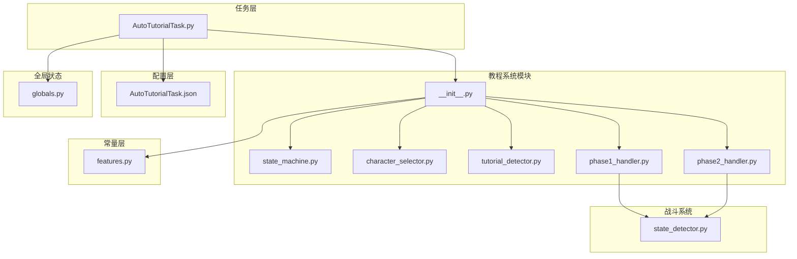
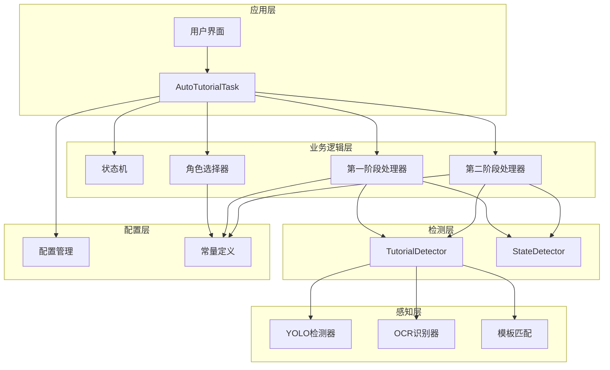
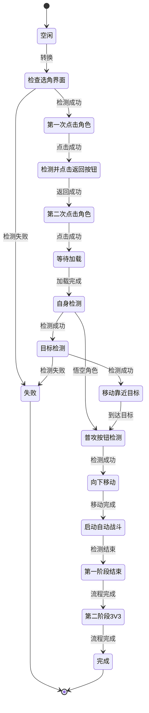
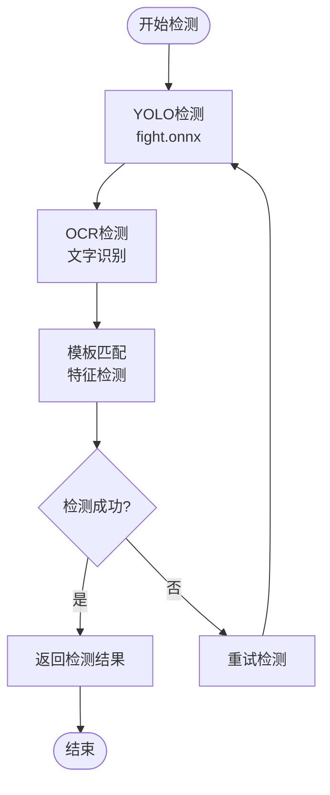
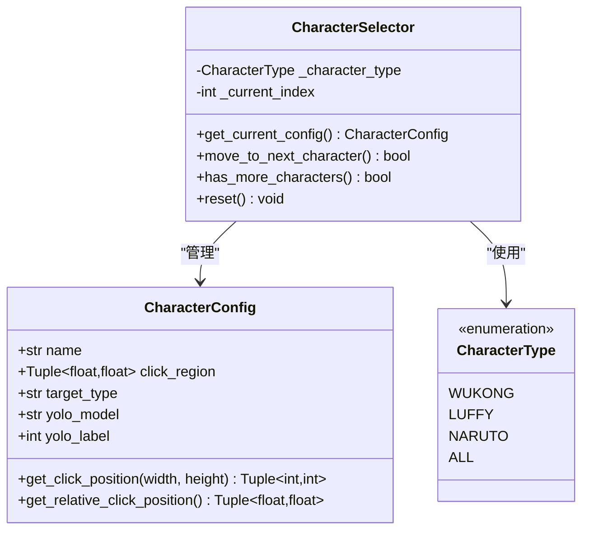
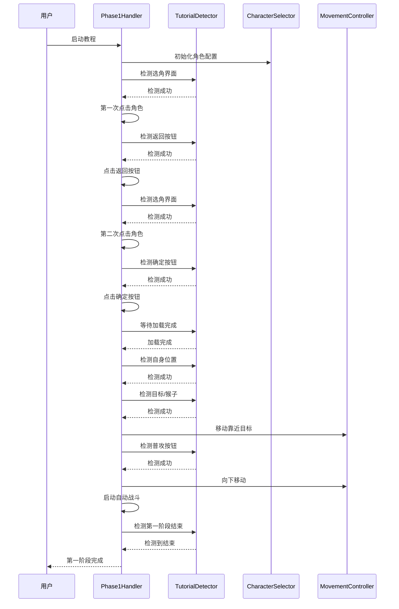
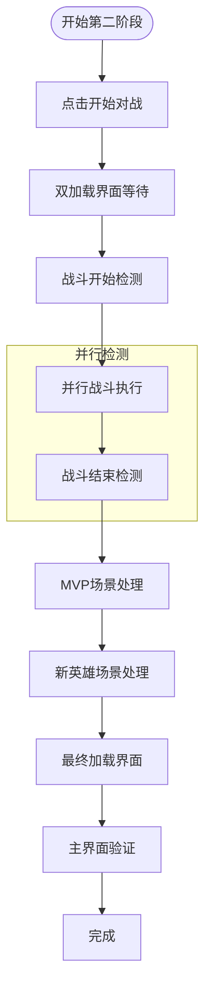
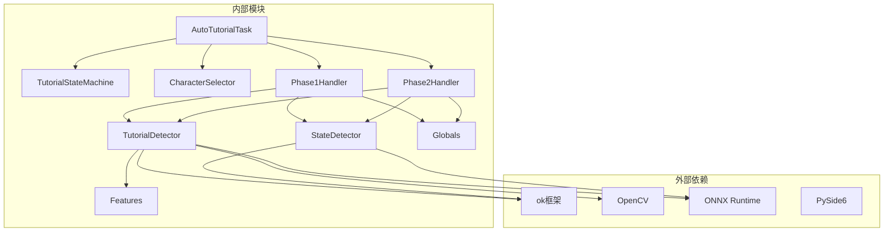

# 新手教程系统

<cite>
**本文档引用的文件**
- [src/tutorial/__init__.py](file://src/tutorial/__init__.py)
- [src/tutorial/state_machine.py](file://src/tutorial/state_machine.py)
- [src/tutorial/phase1_handler.py](file://src/tutorial/phase1_handler.py)
- [src/tutorial/phase2_handler.py](file://src/tutorial/phase2_handler.py)
- [src/tutorial/tutorial_detector.py](file://src/tutorial/tutorial_detector.py)
- [src/tutorial/character_selector.py](file://src/tutorial/character_selector.py)
- [src/task/AutoTutorialTask.py](file://src/task/AutoTutorialTask.py)
- [configs/AutoTutorialTask.json](file://configs/AutoTutorialTask.json)
- [src/constants/features.py](file://src/constants/features.py)
- [src/combat/state_detector.py](file://src/combat/state_detector.py)
- [src/globals.py](file://src/globals.py)
- [tests/test_tutorial.py](file://tests/test_tutorial.py)
</cite>

## 目录
1. [简介](#简介)
2. [项目结构](#项目结构)
3. [核心组件](#核心组件)
4. [架构概览](#架构概览)
5. [详细组件分析](#详细组件分析)
6. [依赖关系分析](#依赖关系分析)
7. [性能考虑](#性能考虑)
8. [故障排除指南](#故障排除指南)
9. [结论](#结论)
10. [附录](#附录)

## 简介

ok-jump 项目的新手教程系统是一个完整的自动化游戏引导解决方案，旨在为新玩家提供无缝的游戏体验。该系统通过智能状态机管理、精确的界面元素识别和灵活的角色选择机制，实现了从角色选择到战斗触发的完整自动化流程。

系统采用模块化设计，包含状态机实现、教程流程控制、界面交互处理等多个核心组件。通过YOLO目标检测、OCR文字识别和模板匹配等多种技术手段，确保在不同游戏版本和分辨率下的稳定识别能力。

## 项目结构

新手教程系统位于 `src/tutorial/` 目录下，采用清晰的模块化组织：

**图表来源**
- [src/tutorial/__init__.py:1-24](file://src/tutorial/__init__.py#L1-L24)
- [src/task/AutoTutorialTask.py:1-349](file://src/task/AutoTutorialTask.py#L1-L349)

**章节来源**
- [src/tutorial/__init__.py:1-24](file://src/tutorial/__init__.py#L1-L24)
- [src/task/AutoTutorialTask.py:1-349](file://src/task/AutoTutorialTask.py#L1-L349)

## 核心组件

新手教程系统由以下核心组件构成：

### 状态机管理器
负责整个教程流程的状态转换和生命周期管理，定义了从空闲到完成的完整状态序列。

### 角色选择器
提供多角色支持，包括悟空、路飞、小鸣人和全部模式，每个角色都有独特的检测策略和配置。

### 教程检测器
封装了多种检测技术，包括YOLO目标检测、OCR文字识别和模板匹配，确保在不同场景下的准确识别。

### 阶段处理器
分为第一阶段和第二阶段处理器，分别处理新手教程的不同流程阶段。

**章节来源**
- [src/tutorial/state_machine.py:10-209](file://src/tutorial/state_machine.py#L10-L209)
- [src/tutorial/character_selector.py:12-232](file://src/tutorial/character_selector.py#L12-L232)
- [src/tutorial/tutorial_detector.py:21-823](file://src/tutorial/tutorial_detector.py#L21-L823)

## 架构概览

系统采用分层架构设计，各层职责清晰分离：

**图表来源**
- [src/task/AutoTutorialTask.py:28-349](file://src/task/AutoTutorialTask.py#L28-L349)
- [src/tutorial/state_machine.py:56-209](file://src/tutorial/state_machine.py#L56-L209)
- [src/tutorial/phase1_handler.py:21-1354](file://src/tutorial/phase1_handler.py#L21-L1354)

系统架构特点：
- **分层设计**：清晰的职责分离，便于维护和扩展
- **模块化**：各组件可独立测试和替换
- **配置驱动**：通过JSON配置文件实现灵活的参数调整
- **容错机制**：多重检测和重试机制确保稳定性

## 详细组件分析

### 状态机实现

状态机是整个教程系统的核心控制逻辑，定义了完整的状态转换流程：

**图表来源**
- [src/tutorial/state_machine.py:10-54](file://src/tutorial/state_machine.py#L10-L54)

状态机的关键特性：
- **状态转换映射**：定义了所有可能的状态转换关系
- **失败处理**：提供统一的失败状态和原因记录
- **历史追踪**：记录完整的状态转换历史
- **终态检测**：支持完成状态和失败状态的检测

**章节来源**
- [src/tutorial/state_machine.py:56-209](file://src/tutorial/state_machine.py#L56-L209)

### 教程检测机制

教程检测器提供了多层次的界面元素识别能力：

#### 多技术融合检测
系统采用三种主要检测技术的组合：

1. **YOLO目标检测**：用于角色、目标和场景元素的精确识别
2. **OCR文字识别**：用于界面文字和按钮的识别
3. **模板匹配**：用于特定图标和按钮的识别

#### 检测流程控制

**图表来源**
- [src/tutorial/tutorial_detector.py:418-542](file://src/tutorial/tutorial_detector.py#L418-L542)

检测器的优化特性：
- **缓存机制**：OCR结果缓存减少重复计算
- **多线程支持**：独立线程进行第一阶段结束检测
- **容错处理**：多种检测方式的冗余保证
- **实时更新**：检测线程独立更新帧数据

**章节来源**
- [src/tutorial/tutorial_detector.py:21-823](file://src/tutorial/tutorial_detector.py#L21-L823)

### 角色选择系统

角色选择系统支持四种不同的角色配置，每种角色都有独特的检测策略：

#### 角色配置映射

**图表来源**
- [src/tutorial/character_selector.py:69-232](file://src/tutorial/character_selector.py#L69-L232)

角色系统的特点：
- **区域化点击**：每个角色在屏幕上的点击区域不同
- **差异化检测**：不同角色使用不同的YOLO模型和检测标签
- **顺序执行**：全部模式按固定顺序执行角色教程
- **配置驱动**：通过配置文件实现灵活的角色选择

**章节来源**
- [src/tutorial/character_selector.py:12-232](file://src/tutorial/character_selector.py#L12-L232)

### 第一阶段处理器

第一阶段处理器负责新手教程的前半部分流程，包括角色选择和基础战斗准备：

#### 处理流程

**图表来源**
- [src/tutorial/phase1_handler.py:108-189](file://src/tutorial/phase1_handler.py#L108-L189)

第一阶段的特殊处理：
- **悟空角色特殊逻辑**：检测到自身后向左上移动3秒
- **猴子检测优化**：悟空专用的猴子检测和跟踪算法
- **移动控制**：集成移动控制器确保后台模式兼容
- **战斗配置继承**：从AutoCombatTask继承战斗配置

**章节来源**
- [src/tutorial/phase1_handler.py:21-1354](file://src/tutorial/phase1_handler.py#L21-L1354)

### 第二阶段处理器

第二阶段处理器处理教程的后半部分，包括战斗开始检测和自动战斗执行：

#### 战斗执行流程

**图表来源**
- [src/tutorial/phase2_handler.py:78-149](file://src/tutorial/phase2_handler.py#L78-L149)

第二阶段的关键特性：
- **并行执行**：自动战斗和结束检测同时进行
- **GUI集成**：与现有GUI自动战斗系统无缝集成
- **容错机制**：双加载界面的容错处理
- **状态同步**：与第一阶段状态机的协调

**章节来源**
- [src/tutorial/phase2_handler.py:19-1522](file://src/tutorial/phase2_handler.py#L19-L1522)

## 依赖关系分析

系统各组件之间的依赖关系如下：

**图表来源**
- [src/task/AutoTutorialTask.py:28-349](file://src/task/AutoTutorialTask.py#L28-L349)
- [src/tutorial/phase1_handler.py:13-18](file://src/tutorial/phase1_handler.py#L13-L18)

依赖关系特点：
- **框架集成**：深度集成ok框架的执行环境
- **视觉识别**：依赖OpenCV和ONNX Runtime进行图像处理
- **GUI支持**：使用PySide6构建用户界面
- **全局状态**：通过全局状态管理器协调各组件

**章节来源**
- [src/task/AutoTutorialTask.py:28-349](file://src/task/AutoTutorialTask.py#L28-L349)
- [src/tutorial/phase1_handler.py:13-18](file://src/tutorial/phase1_handler.py#L13-L18)

## 性能考虑

系统在设计时充分考虑了性能优化：

### 检测性能优化
- **YOLO模型优化**：使用fight.onnx和fight2.onnx模型，针对不同角色优化检测精度
- **OCR缓存机制**：避免重复OCR计算，提高检测效率
- **多线程检测**：独立线程进行第一阶段结束检测，不影响主流程
- **帧更新策略**：智能的帧更新时机，平衡准确性和性能

### 内存管理
- **模型延迟加载**：YOLO模型按需加载，减少内存占用
- **资源清理**：及时清理检测器和处理器资源
- **缓存控制**：合理控制缓存大小和有效期

### 稳定性保障
- **超时机制**：各检测步骤都有合理的超时时间
- **重试策略**：关键步骤具备重试机制
- **容错处理**：多种检测方式的冗余设计

## 故障排除指南

### 常见问题及解决方案

#### 状态机相关问题
- **问题**：状态无法转换
  - **原因**：当前状态不在允许的转换列表中
  - **解决方案**：检查状态转换映射和前置条件

- **问题**：状态机卡死
  - **原因**：检测超时或异常
  - **解决方案**：检查检测器配置和网络连接

#### 检测器相关问题
- **问题**：角色检测失败
  - **原因**：YOLO模型加载失败或分辨率不匹配
  - **解决方案**：检查模型文件完整性，调整分辨率设置

- **问题**：OCR识别错误
  - **原因**：语言设置不正确或图像质量差
  - **解决方案**：调整OCR参数，改善图像质量

#### 处理器相关问题
- **问题**：点击位置不准确
  - **原因**：分辨率变化或屏幕缩放
  - **解决方案**：重新校准点击位置，检查分辨率设置

**章节来源**
- [src/tutorial/state_machine.py:102-181](file://src/tutorial/state_machine.py#L102-L181)
- [src/tutorial/tutorial_detector.py:418-542](file://src/tutorial/tutorial_detector.py#L418-L542)

## 结论

ok-jump的新手教程系统是一个设计精良、功能完整的自动化解决方案。系统通过模块化的架构设计、多技术融合的检测机制和灵活的配置管理，实现了从角色选择到战斗触发的完整自动化流程。

系统的主要优势包括：
- **高可靠性**：多重检测技术和容错机制确保稳定性
- **易扩展性**：模块化设计便于添加新功能和角色
- **用户友好**：简洁的配置界面和详细的日志输出
- **性能优化**：智能的资源管理和检测优化

对于开发者而言，系统提供了清晰的扩展接口和完善的测试覆盖，便于进一步的功能增强和技术改进。

## 附录

### 配置选项说明

系统支持丰富的配置选项，可通过JSON文件进行定制：

| 配置项 | 类型 | 默认值 | 描述 |
|--------|------|--------|------|
| 角色选择 | 字符串 | "路飞" | 选择教程角色 |
| 选角界面检测超时(秒) | 浮点数 | 10.0 | 检测选角界面的超时时间 |
| 自身检测超时(秒) | 浮点数 | 30.0 | YOLO检测自身的超时时间 |
| 目标检测超时(秒) | 浮点数 | 20.0 | 检测目标圈/猴子的超时时间 |
| 普攻检测超时(秒) | 浮点数 | 30.0 | OCR检测普攻按钮的超时时间 |
| 第一阶段结束检测超时(秒) | 浮点数 | 240.0 | 检测第一阶段结束的超时时间 |
| 加载后等待时间(秒) | 浮点数 | 30.0 | 加载完成后等待时间 |
| 向下移动时间(秒) | 浮点数 | 1.5 | 检测到普攻按钮后向下移动时间 |
| 移动持续时间(秒) | 浮点数 | 2.5 | 每次移动按键持续时间 |
| 点击后等待时间(秒) | 浮点数 | 1.0 | 点击操作后的等待时间 |
| 详细日志 | 布尔值 | True | 是否输出详细日志 |

### 开发者扩展指南

#### 添加新角色
1. 在CharacterSelector中添加新的角色配置
2. 在tutorial_detector中添加相应的YOLO模型和标签
3. 在AutoTutorialTask中更新角色选择选项
4. 添加相应的测试用例

#### 修改检测逻辑
1. 在tutorial_detector中修改或添加新的检测方法
2. 更新状态机的转换逻辑
3. 添加相应的错误处理和重试机制
4. 编写单元测试验证修改

#### 扩展教程阶段
1. 在state_machine中定义新的状态
2. 在phase1_handler或phase2_handler中实现处理逻辑
3. 更新教程检测器的检测方法
4. 添加完整的测试覆盖

**章节来源**
- [configs/AutoTutorialTask.json:1-13](file://configs/AutoTutorialTask.json#L1-L13)
- [src/task/AutoTutorialTask.py:41-74](file://src/task/AutoTutorialTask.py#L41-L74)