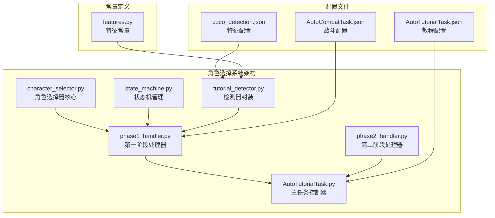
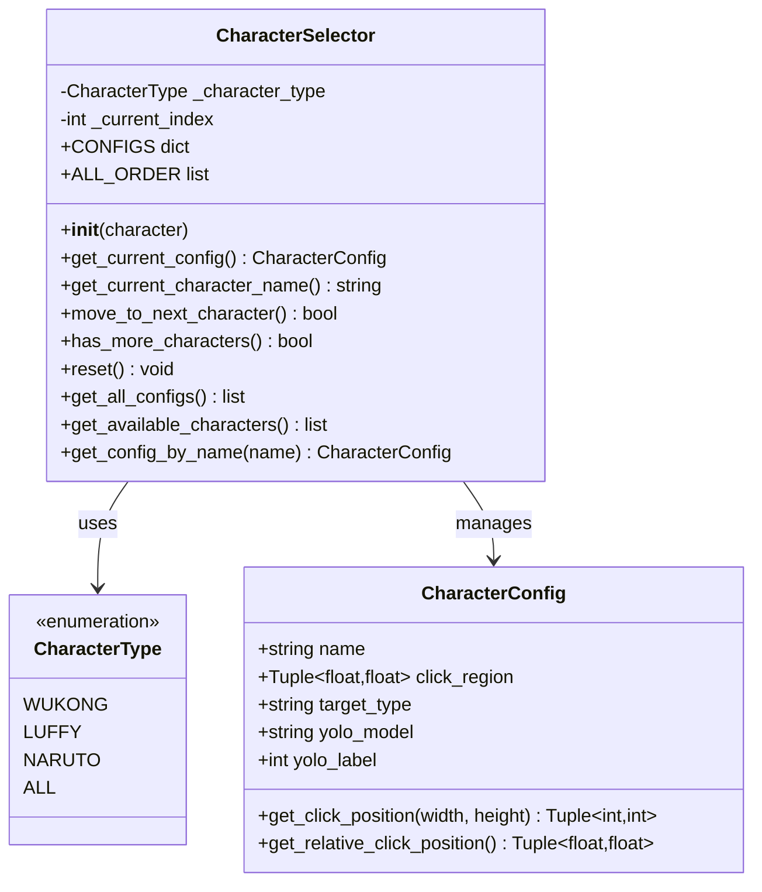
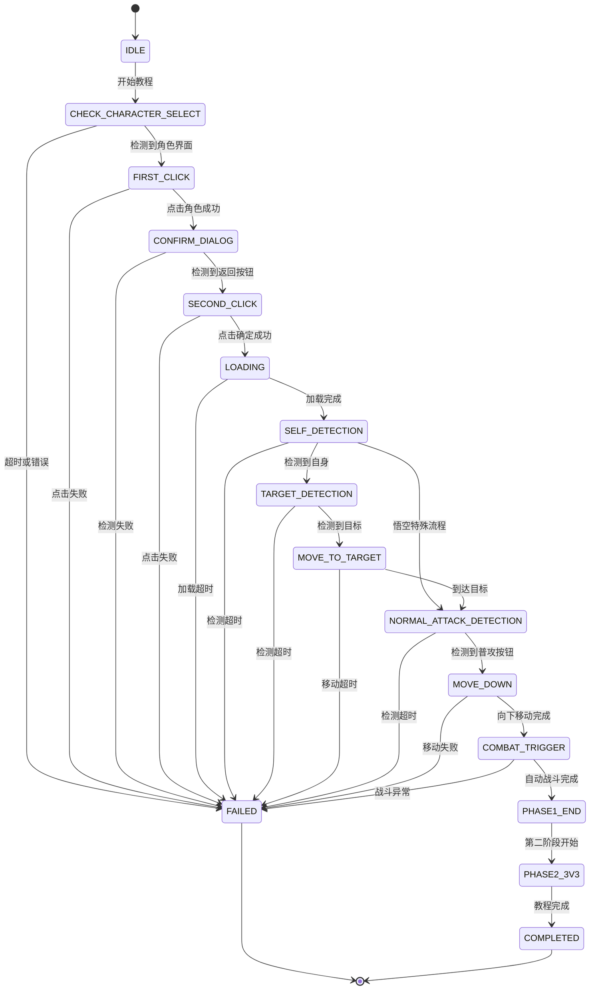
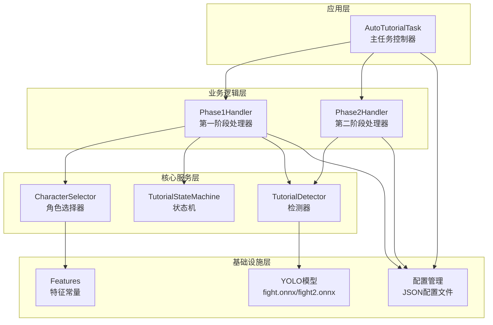
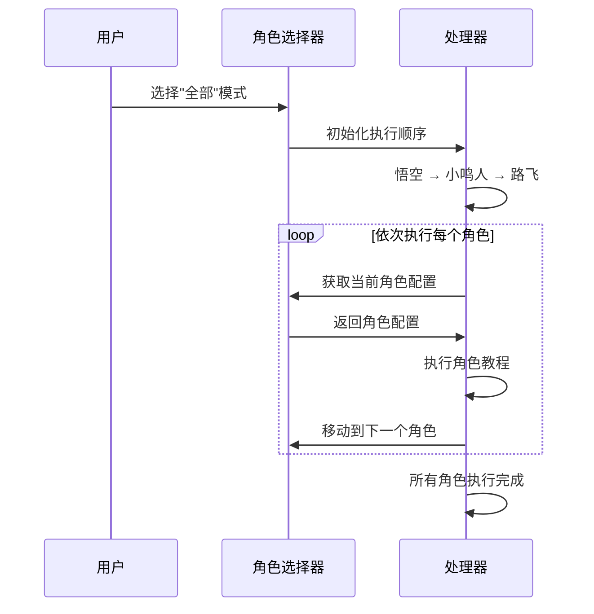
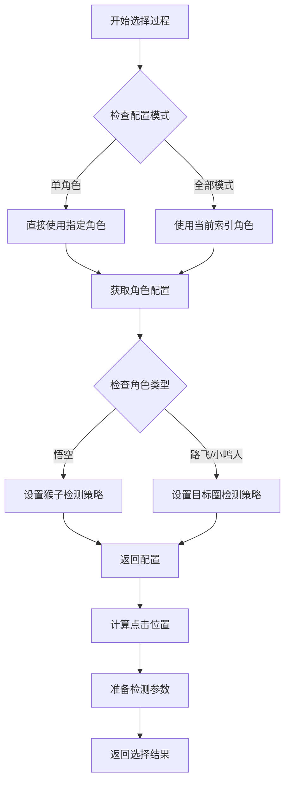
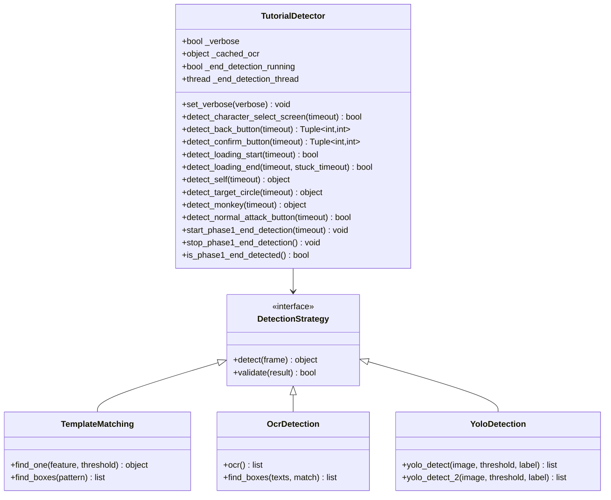
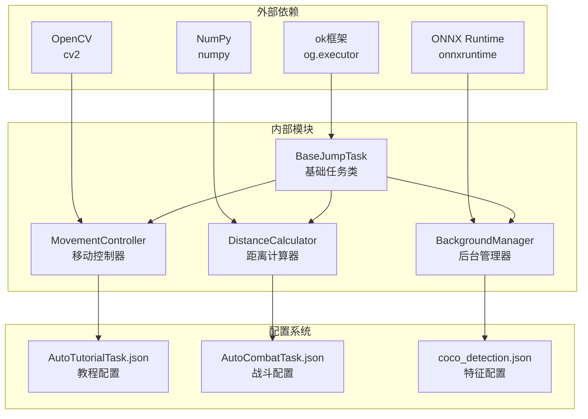

# 角色选择系统

<cite>
**本文档引用的文件**
- [character_selector.py](file://src/tutorial/character_selector.py)
- [state_machine.py](file://src/tutorial/state_machine.py)
- [tutorial_detector.py](file://src/tutorial/tutorial_detector.py)
- [AutoTutorialTask.py](file://src/task/AutoTutorialTask.py)
- [phase1_handler.py](file://src/tutorial/phase1_handler.py)
- [phase2_handler.py](file://src/tutorial/phase2_handler.py)
- [features.py](file://src/constants/features.py)
- [coco_detection.json](file://assets/coco_detection.json)
- [AutoTutorialTask.json](file://configs/AutoTutorialTask.json)
- [AutoCombatTask.json](file://configs/AutoCombatTask.json)
</cite>

## 目录
1. [简介](#简介)
2. [项目结构](#项目结构)
3. [核心组件](#核心组件)
4. [架构概览](#架构概览)
5. [详细组件分析](#详细组件分析)
6. [依赖关系分析](#依赖关系分析)
7. [性能考虑](#性能考虑)
8. [故障排除指南](#故障排除指南)
9. [结论](#结论)

## 简介

角色选择系统是 ok-jump 项目中自动新手教程的重要组成部分，负责在游戏开始时自动选择合适的角色。该系统集成了多种检测技术和智能决策算法，能够自动识别角色界面、计算点击位置、执行角色选择，并与教程状态机无缝集成。

系统支持三种主要角色选择模式：
- **单角色模式**：选择特定角色（悟空、路飞、小鸣人）
- **全部模式**：依次执行所有角色的新手教程
- **智能模式**：根据游戏状态和配置自动选择最优角色

## 项目结构

角色选择系统位于 `src/tutorial/` 目录下，包含以下核心文件：



**图表来源**
- [character_selector.py:1-232](file://src/tutorial/character_selector.py#L1-L232)
- [state_machine.py:1-209](file://src/tutorial/state_machine.py#L1-L209)
- [AutoTutorialTask.py:1-349](file://src/task/AutoTutorialTask.py#L1-L349)

**章节来源**
- [character_selector.py:1-232](file://src/tutorial/character_selector.py#L1-L232)
- [AutoTutorialTask.py:1-349](file://src/task/AutoTutorialTask.py#L1-L349)

## 核心组件

### 角色选择器 (CharacterSelector)

角色选择器是系统的核心组件，负责管理角色配置和选择逻辑：



**图表来源**
- [character_selector.py:12-232](file://src/tutorial/character_selector.py#L12-L232)

### 状态机 (TutorialStateMachine)

状态机定义了完整的教程流程和状态转换规则：



**图表来源**
- [state_machine.py:10-54](file://src/tutorial/state_machine.py#L10-L54)

**章节来源**
- [character_selector.py:69-232](file://src/tutorial/character_selector.py#L69-L232)
- [state_machine.py:56-209](file://src/tutorial/state_machine.py#L56-L209)

## 架构概览

角色选择系统采用分层架构设计，各组件职责清晰分离：



**图表来源**
- [AutoTutorialTask.py:28-83](file://src/task/AutoTutorialTask.py#L28-L83)
- [phase1_handler.py:21-61](file://src/tutorial/phase1_handler.py#L21-L61)

系统的工作流程：

1. **初始化阶段**：主任务控制器加载配置并创建处理器实例
2. **角色选择阶段**：角色选择器根据配置生成点击位置
3. **状态管理阶段**：状态机驱动整个教程流程
4. **检测执行阶段**：检测器执行各种视觉识别任务
5. **动作执行阶段**：系统执行点击、移动等操作

**章节来源**
- [AutoTutorialTask.py:84-193](file://src/task/AutoTutorialTask.py#L84-L193)
- [phase1_handler.py:108-188](file://src/tutorial/phase1_handler.py#L108-L188)

## 详细组件分析

### 角色区域识别算法

角色选择系统采用基于屏幕分辨率的比例定位算法：

#### 点击区域计算

```mermaid
flowchart TD
A[输入屏幕尺寸] --> B[获取角色配置]
B --> C[提取点击区域比例]
C --> D[计算起始X坐标]
D --> E[计算结束X坐标]
E --> F[计算中心X坐标]
F --> G[固定Y坐标为屏幕中心]
G --> H[返回点击坐标]
D --> I[公式: start_x = width * region_start]
E --> J[公式: end_x = width * region_end]
F --> K[公式: center_x = (start_x + end_x) / 2]
G --> L[公式: center_y = height / 2]
```

**图表来源**
- [character_selector.py:40-66](file://src/tutorial/character_selector.py#L40-L66)

#### 角色区域分配策略

| 角色 | 区域范围 | 目标检测类型 | YOLO模型 | YOLO标签 |
|------|----------|--------------|----------|----------|
| 悟空 | 0.0 - 1/3 | monkey | fight2.onnx | 0 |
| 路飞 | 1/3 - 2/3 | target_circle | fight.onnx | 4 |
| 小鸣人 | 2/3 - 1.0 | target_circle | fight.onnx | 4 |

### 角色优先级排序算法

系统支持两种排序策略：

#### 全部模式执行顺序



**图表来源**
- [character_selector.py:101-102](file://src/tutorial/character_selector.py#L101-L102)
- [AutoTutorialTask.py:195-250](file://src/task/AutoTutorialTask.py#L195-L250)

### 自动选择策略

系统提供多种自动选择策略：

#### 智能选择算法



**图表来源**
- [character_selector.py:142-157](file://src/tutorial/character_selector.py#L142-L157)
- [phase1_handler.py:343-358](file://src/tutorial/phase1_handler.py#L343-L358)

**章节来源**
- [character_selector.py:104-197](file://src/tutorial/character_selector.py#L104-L197)
- [phase1_handler.py:342-358](file://src/tutorial/phase1_handler.py#L342-L358)

### 检测器集成机制

检测器系统封装了多种检测技术：

#### 多模态检测策略



**图表来源**
- [tutorial_detector.py:21-83](file://src/tutorial/tutorial_detector.py#L21-L83)

#### 检测优先级策略

系统采用多层检测策略，确保高成功率：

1. **模板匹配**：最高优先级，使用预定义的特征图像
2. **OCR识别**：次优先级，使用文字识别技术
3. **YOLO检测**：最低优先级，使用深度学习模型

**章节来源**
- [tutorial_detector.py:66-122](file://src/tutorial/tutorial_detector.py#L66-L122)
- [tutorial_detector.py:418-457](file://src/tutorial/tutorial_detector.py#L418-L457)

## 依赖关系分析

角色选择系统的主要依赖关系如下：



**图表来源**
- [AutoTutorialTask.py:20-26](file://src/task/AutoTutorialTask.py#L20-L26)
- [phase1_handler.py:13-18](file://src/tutorial/phase1_handler.py#L13-L18)

### 循环依赖防护

系统通过延迟导入避免循环依赖：

```python
# 延迟导入避免循环依赖
from src import jump_globals
from src.task.AutoCombatTask import AutoCombatTask
from src.combat.state_detector import StateDetector
from src.combat.skill_controller import SkillController
```

**章节来源**
- [AutoTutorialTask.py:174-181](file://src/task/AutoTutorialTask.py#L174-L181)
- [phase1_handler.py:657-680](file://src/tutorial/phase1_handler.py#L657-L680)

## 性能考虑

### 检测性能优化

系统采用了多项性能优化策略：

#### 缓存机制

- **OCR结果缓存**：避免重复OCR计算
- **检测状态缓存**：减少重复检测调用
- **模型加载缓存**：避免重复加载ONNX模型

#### 异步处理

- **并行结束检测**：自动战斗与结束检测并行执行
- **后台线程管理**：独立线程处理长时间运行的任务
- **非阻塞I/O**：避免UI冻结

#### 资源管理

- **内存池管理**：复用检测结果对象
- **GPU资源管理**：合理分配ONNX推理资源
- **CPU负载均衡**：避免长时间占用CPU

### 配置优化建议

#### 性能配置参数

| 参数名称 | 默认值 | 优化建议 | 影响范围 |
|----------|--------|----------|----------|
| 选角界面检测超时(秒) | 10.0 | 5.0-15.0 | 角色选择速度 |
| 自身检测超时(秒) | 30.0 | 20.0-40.0 | 自身检测稳定性 |
| 目标检测超时(秒) | 10.0 | 5.0-15.0 | 目标跟踪精度 |
| 普攻检测超时(秒) | 10.0 | 5.0-20.0 | 普攻检测灵敏度 |
| 第一阶段结束检测超时(秒) | 120.0 | 60.0-180.0 | 自动战斗时长 |

**章节来源**
- [AutoTutorialTask.py:41-74](file://src/task/AutoTutorialTask.py#L41-L74)
- [AutoTutorialTask.json:2-12](file://configs/AutoTutorialTask.json#L2-L12)

## 故障排除指南

### 常见问题及解决方案

#### 角色选择失败

**问题症状**：系统无法检测到角色界面或点击失败

**诊断步骤**：
1. 检查分辨率设置是否正确
2. 验证特征图像是否存在于 `assets/coco_detection.json`
3. 确认OCR语言设置是否正确
4. 检查YOLO模型文件是否存在

**解决方案**：
```python
# 增加检测超时时间
detector.detect_character_select_screen(timeout=15.0)

# 启用详细日志
detector.set_verbose(True)
```

#### 检测精度问题

**问题症状**：检测结果不稳定或误检

**优化策略**：
1. 调整模板匹配阈值
2. 优化OCR识别参数
3. 调整YOLO检测置信度
4. 增加检测重试次数

#### 性能问题

**问题症状**：系统响应缓慢或卡顿

**优化方案**：
1. 减少检测频率
2. 降低检测分辨率
3. 关闭详细日志
4. 优化模型推理参数

**章节来源**
- [tutorial_detector.py:49-62](file://src/tutorial/tutorial_detector.py#L49-L62)
- [phase1_handler.py:184-188](file://src/tutorial/phase1_handler.py#L184-L188)

### 调试工具

系统提供了完善的调试功能：

#### 日志系统

```python
# 详细日志级别
detector.set_verbose(True)

# 状态机日志
handler._log("当前状态: {}".format(state_machine.get_state_name()))

# 错误截图保存
handler._save_error_screenshot("error_name")
```

#### 性能监控

- **检测耗时统计**：记录各类检测的执行时间
- **内存使用监控**：跟踪内存分配情况
- **CPU使用率监控**：避免过度占用系统资源

## 结论

角色选择系统是一个高度集成的自动化解决方案，通过以下关键特性实现了稳定可靠的自动角色选择：

### 核心优势

1. **多模态检测**：结合模板匹配、OCR和YOLO技术，确保高成功率
2. **智能决策**：根据角色类型自动选择最优检测策略
3. **状态管理**：完整的状态机确保流程的正确性
4. **性能优化**：多层缓存和异步处理提升系统性能
5. **可扩展性**：模块化设计便于功能扩展和维护

### 技术创新

- **比例定位算法**：基于屏幕分辨率的比例定位，适应不同分辨率设备
- **并行处理架构**：自动战斗与结束检测并行执行，提高效率
- **智能重试机制**：多层重试确保操作的成功率
- **容错设计**：完善的错误处理和恢复机制

### 应用价值

该系统为游戏自动化提供了完整的解决方案，不仅适用于新手教程，还可扩展应用于其他需要自动角色选择的场景。通过持续的优化和改进，系统将继续提升稳定性和性能，为用户提供更好的自动化体验。