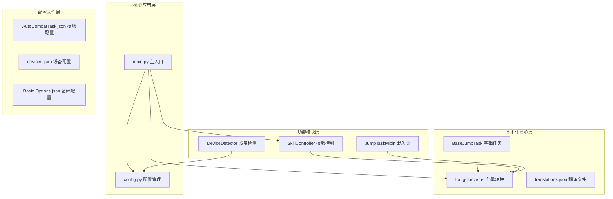
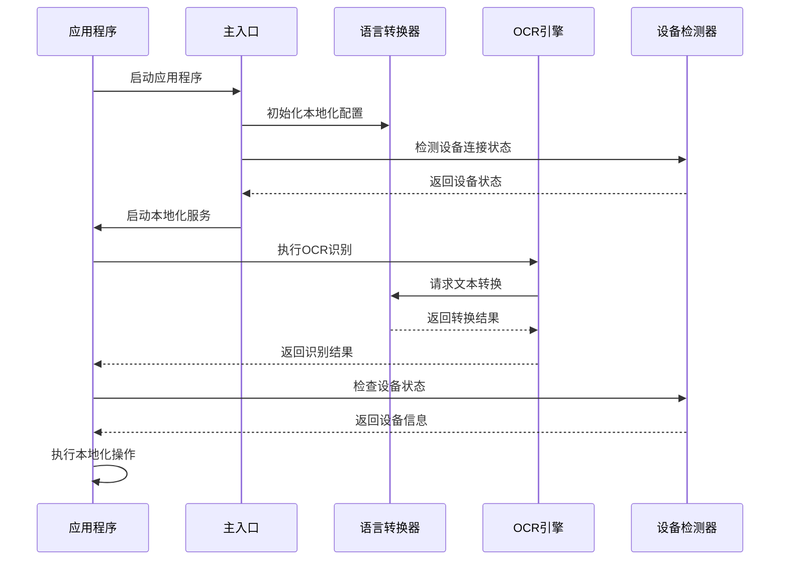
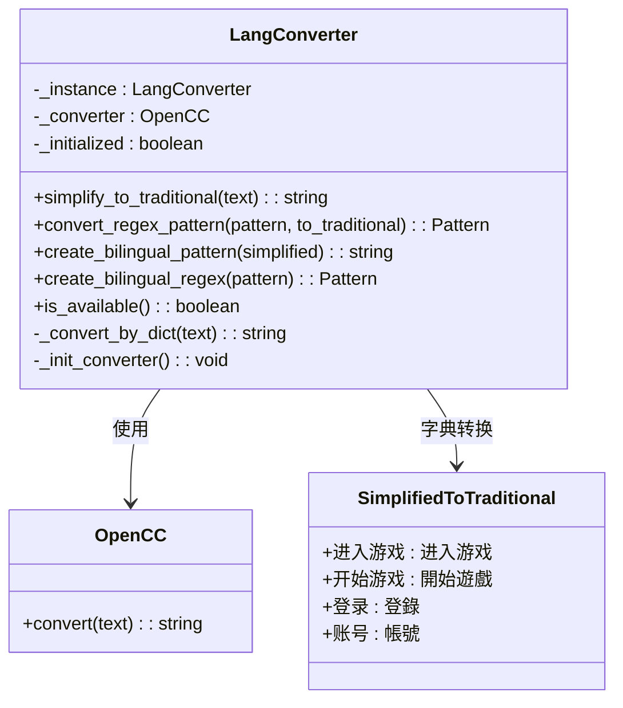
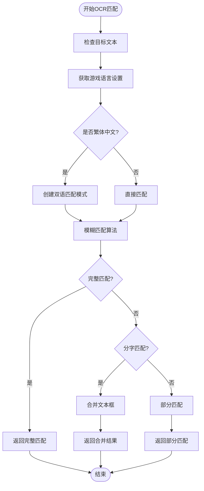
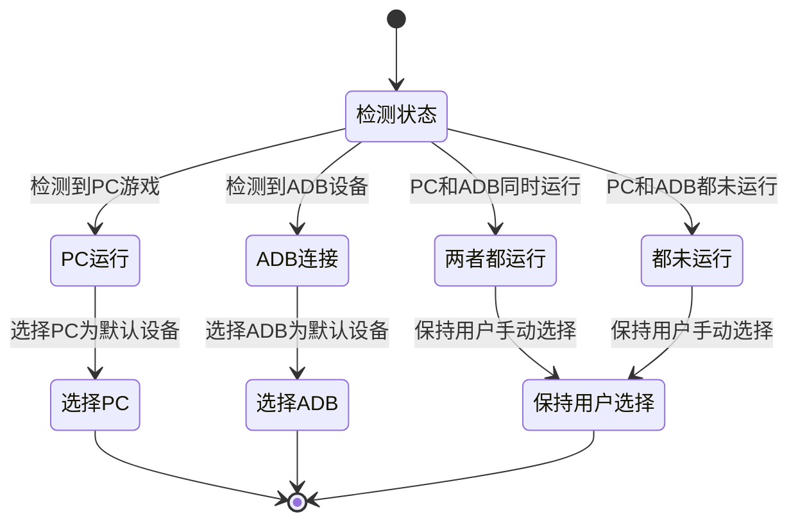
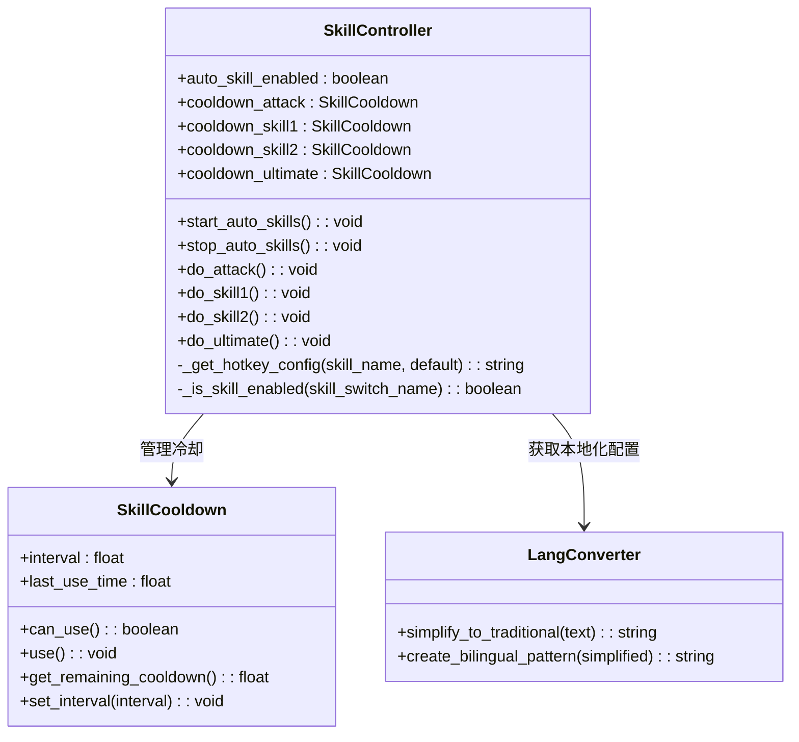
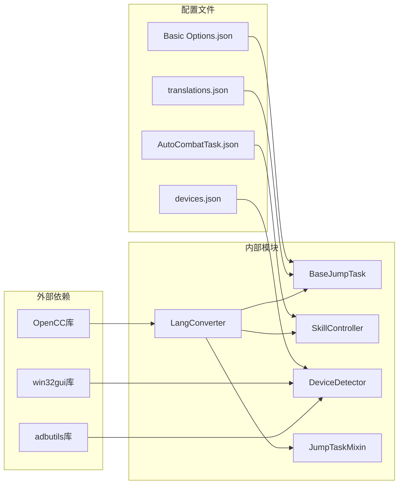

# 本地化技能

<cite>
**本文档引用的文件**
- [main.py](file://main.py)
- [config.py](file://config.py)
- [README.md](file://README.md)
- [i18n/zh_CN/translations.json](file://i18n/zh_CN/translations.json)
- [src/task/BaseJumpTask.py](file://src/task/BaseJumpTask.py)
- [src/utils/LangConverter.py](file://src/utils/LangConverter.py)
- [src/combat/skill_controller.py](file://src/combat/skill_controller.py)
- [src/task/mixins.py](file://src/task/mixins.py)
- [src/utils/DeviceDetector.py](file://src/utils/DeviceDetector.py)
- [configs/AutoCombatTask.json](file://configs/AutoCombatTask.json)
- [configs/devices.json](file://configs/devices.json)
- [configs/Basic Options.json](file://configs/Basic Options.json)
</cite>

## 目录
1. [简介](#简介)
2. [项目结构](#项目结构)
3. [核心组件](#核心组件)
4. [架构概览](#架构概览)
5. [详细组件分析](#详细组件分析)
6. [依赖分析](#依赖分析)
7. [性能考虑](#性能考虑)
8. [故障排除指南](#故障排除指南)
9. [结论](#结论)

## 简介

本地化技能是 ok-jump 项目中的一个关键功能模块，专门负责处理游戏的多语言支持和本地化需求。该项目是一个自动化测试工具，主要针对《漫画群星：大集结》游戏进行自动化操作。

项目的核心目标是提供完整的本地化解决方案，包括：
- 简体中文和繁体中文的智能转换
- OCR 文本匹配的多语言支持
- 游戏界面元素的本地化显示
- 设备连接状态的智能检测和选择

## 项目结构

项目采用模块化的架构设计，主要分为以下几个核心部分：

**图表来源**
- [main.py:659-693](file://main.py#L659-L693)
- [config.py:68-146](file://config.py#L68-L146)

**章节来源**
- [README.md:1-8](file://README.md#L1-L8)
- [main.py:1-693](file://main.py#L1-L693)
- [config.py:1-146](file://config.py#L1-L146)

## 核心组件

### 本地化转换引擎

本地化技能的核心是 LangConverter 类，它提供了简繁中文之间的智能转换功能。该组件支持两种转换方式：

1. **OpenCC 库转换**：使用专业的 OpenCC 库进行高质量的简繁转换
2. **内置字典转换**：提供常用游戏文本的内置转换字典

### OCR 文本匹配系统

BaseJumpTask 类集成了智能的 OCR 文本匹配功能，能够处理游戏中可能出现的文本分割问题：

- 支持完整匹配和分字匹配
- 自动处理简繁中文的双语匹配
- 提供模糊匹配算法，提高识别准确性

### 设备智能选择系统

DeviceDetector 类实现了智能的设备连接状态检测和选择功能：

- 检测 PC 版游戏和模拟器的连接状态
- 根据当前状态智能选择最佳设备
- 支持自动设备切换

**章节来源**
- [src/utils/LangConverter.py:155-338](file://src/utils/LangConverter.py#L155-L338)
- [src/task/BaseJumpTask.py:26-572](file://src/task/BaseJumpTask.py#L26-L572)
- [src/utils/DeviceDetector.py:11-149](file://src/utils/DeviceDetector.py#L11-L149)

## 架构概览

本地化技能在整个系统中的架构位置如下：

**图表来源**
- [main.py:660-693](file://main.py#L660-L693)
- [src/utils/LangConverter.py:182-248](file://src/utils/LangConverter.py#L182-L248)
- [src/utils/DeviceDetector.py:112-134](file://src/utils/DeviceDetector.py#L112-L134)

## 详细组件分析

### 语言转换器 (LangConverter)

LangConverter 是本地化系统的核心组件，提供了完整的简繁中文转换功能：

**图表来源**
- [src/utils/LangConverter.py:155-338](file://src/utils/LangConverter.py#L155-L338)

#### 转换算法特点

1. **优先级转换**：首先检查内置字典中的完整匹配
2. **OpenCC集成**：当 OpenCC 可用时提供高质量转换
3. **降级机制**：OpenCC 不可用时使用内置字典逐字转换
4. **双语模式**：支持创建简繁双语的正则表达式模式

**章节来源**
- [src/utils/LangConverter.py:198-248](file://src/utils/LangConverter.py#L198-L248)
- [src/utils/LangConverter.py:284-337](file://src/utils/LangConverter.py#L284-L337)

### OCR 文本匹配系统

BaseJumpTask 类中的 OCR 文本匹配系统提供了智能的文本识别和匹配功能：

**图表来源**
- [src/task/BaseJumpTask.py:337-450](file://src/task/BaseJumpTask.py#L337-L450)

#### 匹配算法流程

1. **完整匹配阶段**：首先尝试完整文本匹配
2. **分字匹配阶段**：如果完整匹配失败，尝试将文本拆分为单字进行匹配
3. **合并处理**：将多个单字匹配结果合并为一个整体
4. **部分匹配阶段**：最后尝试部分文本匹配

**章节来源**
- [src/task/BaseJumpTask.py:337-424](file://src/task/BaseJumpTask.py#L337-L424)

### 设备智能选择系统

DeviceDetector 类提供了智能的设备连接状态检测和选择功能：

**图表来源**
- [src/utils/DeviceDetector.py:112-134](file://src/utils/DeviceDetector.py#L112-L134)

#### 智能选择逻辑

1. **PC优先原则**：当只有 PC 游戏运行时，自动选择 PC 设备
2. **ADB优先原则**：当只有 ADB 设备连接时，自动选择 ADB 设备
3. **用户优先原则**：当两种情况同时存在或都不存在时，保持用户的手动选择

**章节来源**
- [src/utils/DeviceDetector.py:112-134](file://src/utils/DeviceDetector.py#L112-L134)

### 技能控制本地化

SkillController 类集成了本地化支持，确保技能按键的本地化配置：

**图表来源**
- [src/combat/skill_controller.py:82-589](file://src/combat/skill_controller.py#L82-L589)

#### 本地化配置管理

技能控制系统的本地化配置主要通过以下方式实现：

1. **热键配置**：从全局配置中读取技能按键映射
2. **技能开关**：支持通过配置文件控制技能启用状态
3. **冷却时间**：允许用户自定义技能冷却间隔

**章节来源**
- [src/combat/skill_controller.py:408-450](file://src/combat/skill_controller.py#L408-L450)

## 依赖分析

本地化技能模块之间的依赖关系如下：

**图表来源**
- [src/utils/LangConverter.py:188-196](file://src/utils/LangConverter.py#L188-L196)
- [src/utils/DeviceDetector.py:82-87](file://src/utils/DeviceDetector.py#L82-L87)

### 关键依赖关系

1. **OpenCC 库依赖**：用于高质量的简繁转换
2. **adbutils 库依赖**：用于 ADB 设备连接检测
3. **win32gui 库依赖**：用于 Windows 窗口检测
4. **配置文件依赖**：各种 JSON 配置文件提供运行时配置

**章节来源**
- [src/utils/LangConverter.py:188-196](file://src/utils/LangConverter.py#L188-L196)
- [src/utils/DeviceDetector.py:82-110](file://src/utils/DeviceDetector.py#L82-L110)

## 性能考虑

本地化技能系统在设计时充分考虑了性能优化：

### 缓存机制
- **语言检测缓存**：BaseJumpTask 中实现了 5 秒的语言检测缓存
- **ADB 模式缓存**：JumpTaskMixin 中实现了 10 秒的 ADB 模式检测缓存
- **设备状态缓存**：DeviceDetector 中实现了智能的设备状态缓存

### 内存优化
- **单例模式**：LangConverter 使用单例模式减少内存占用
- **懒加载**：OpenCC 转换器采用懒加载机制
- **条件初始化**：仅在需要时初始化各种组件

### 并发处理
- **独立线程**：技能监控使用独立线程避免阻塞主线程
- **线程安全**：使用锁机制保证并发访问的安全性
- **异步操作**：设备检测和语言转换都是异步执行

## 故障排除指南

### 常见问题及解决方案

#### OpenCC 库缺失
**问题描述**：简繁转换效果不佳或出现异常
**解决方案**：
1. 安装 OpenCC 库：`pip install opencc-python-reimplemented`
2. 检查 OpenCC 版本兼容性
3. 验证转换字典完整性

#### OCR 识别失败
**问题描述**：OCR 文本匹配不准确或完全失败
**解决方案**：
1. 检查游戏语言设置是否正确
2. 调整 OCR 识别阈值
3. 验证图像质量是否足够清晰

#### 设备连接检测异常
**问题描述**：设备状态检测不准确
**解决方案**：
1. 确认 ADB 服务正常运行
2. 检查模拟器连接状态
3. 验证设备权限设置

#### 技能按键不响应
**问题描述**：技能按键无法正常触发
**解决方案**：
1. 检查技能配置文件设置
2. 验证热键映射是否正确
3. 确认游戏窗口处于前台状态

**章节来源**
- [src/utils/LangConverter.py:188-196](file://src/utils/LangConverter.py#L188-L196)
- [src/utils/DeviceDetector.py:82-110](file://src/utils/DeviceDetector.py#L82-L110)

## 结论

本地化技能模块是 ok-jump 项目中的重要组成部分，它通过以下方式实现了完整的本地化解决方案：

1. **智能语言转换**：提供简繁中文之间的高质量转换
2. **多语言 OCR 支持**：解决游戏中文本识别的多语言问题
3. **智能设备选择**：根据当前状态自动选择最佳设备
4. **灵活的配置管理**：支持通过配置文件进行本地化定制

该模块的设计充分考虑了性能、稳定性和易用性，为用户提供了无缝的本地化体验。通过合理的架构设计和优化策略，本地化技能能够在各种环境下稳定运行，满足不同用户的需求。

未来的发展方向包括：
- 扩展更多语言的支持
- 优化 OCR 识别算法
- 增强设备检测的准确性
- 提供更丰富的本地化配置选项