# AI技能系统

<cite>
**本文档引用的文件**
- [main.py](file://main.py)
- [AutoCombatTask.py](file://src/task/AutoCombatTask.py)
- [skill_controller.py](file://src/combat/skill_controller.py)
- [state_detector.py](file://src/combat/state_detector.py)
- [movement_controller.py](file://src/combat/movement_controller.py)
- [tutorial_detector.py](file://src/tutorial/tutorial_detector.py)
- [labels.py](file://src/combat/labels.py)
- [BaseJumpTask.py](file://src/task/BaseJumpTask.py)
- [features.py](file://src/constants/features.py)
- [AutoCombatTask.json](file://configs/AutoCombatTask.json)
- [游戏热键配置.json](file://configs/游戏热键配置.json)
</cite>

## 目录
1. [项目概述](#项目概述)
2. [系统架构](#系统架构)
3. [核心组件分析](#核心组件分析)
4. [技能控制系统](#技能控制系统)
5. [战斗状态检测](#战斗状态检测)
6. [移动控制系统](#移动控制系统)
7. [新手教程集成](#新手教程集成)
8. [配置管理系统](#配置管理系统)
9. [性能优化策略](#性能优化策略)
10. [故障排除指南](#故障排除指南)
11. [总结](#总结)

## 项目概述

AI技能系统是一个基于深度学习和计算机视觉的自动化游戏战斗辅助系统。该系统能够智能识别战场状态、控制角色移动和释放技能，为玩家提供全方位的战斗辅助。

### 主要特性

- **智能战斗识别**：使用YOLO模型检测战场单位和状态
- **多模式支持**：支持PC端键盘控制和移动端ADB控制
- **后台运行**：支持游戏窗口最小化时的后台操作
- **智能技能释放**：基于距离和状态的自动技能释放
- **新手教程集成**：完整的教程引导和检测系统

## 系统架构

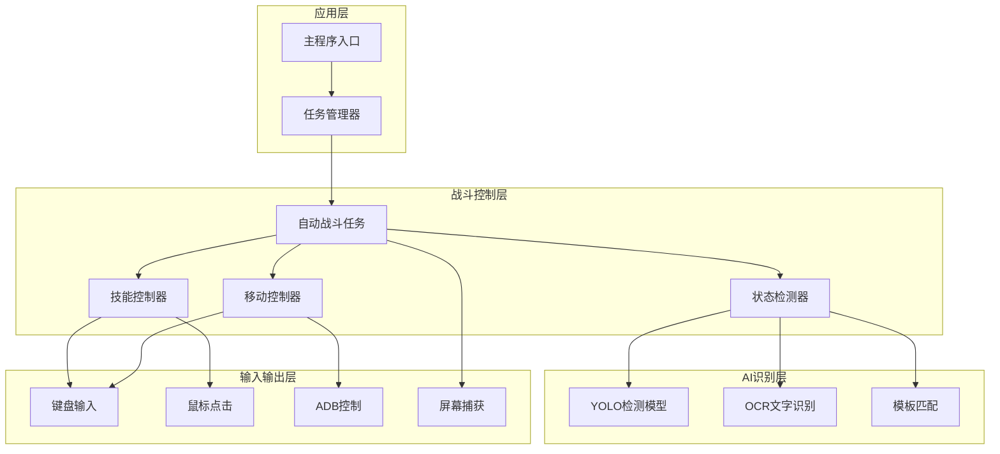

**图表来源**
- [main.py:659-693](file://main.py#L659-L693)
- [AutoCombatTask.py:35-141](file://src/task/AutoCombatTask.py#L35-L141)

## 核心组件分析

### 自动战斗任务

自动战斗任务是整个系统的核心控制器，负责协调各个子系统的协同工作。

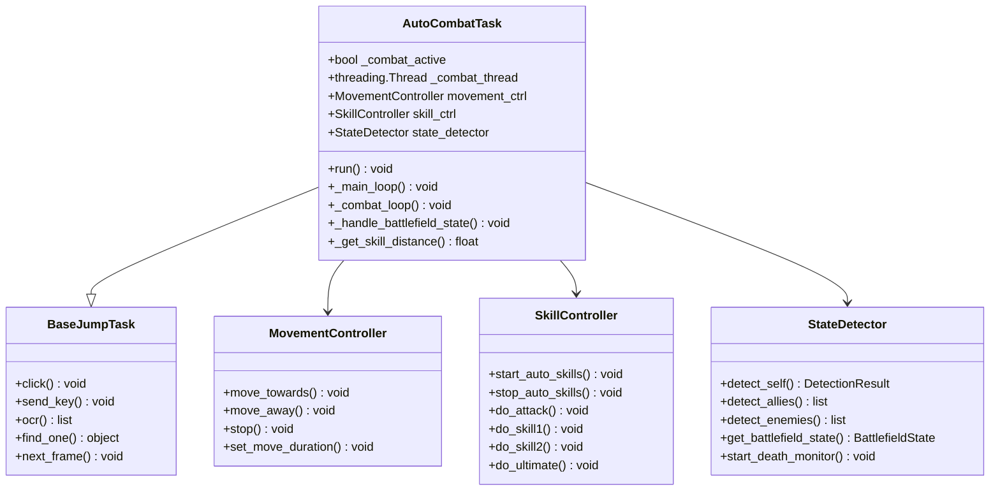

**图表来源**
- [AutoCombatTask.py:35-141](file://src/task/AutoCombatTask.py#L35-L141)
- [BaseJumpTask.py:26-572](file://src/task/BaseJumpTask.py#L26-L572)

**章节来源**
- [AutoCombatTask.py:199-263](file://src/task/AutoCombatTask.py#L199-L263)
- [BaseJumpTask.py:26-100](file://src/task/BaseJumpTask.py#L26-L100)

## 技能控制系统

技能控制系统是AI技能系统的核心执行单元，负责智能控制角色技能释放。

### 技能冷却机制

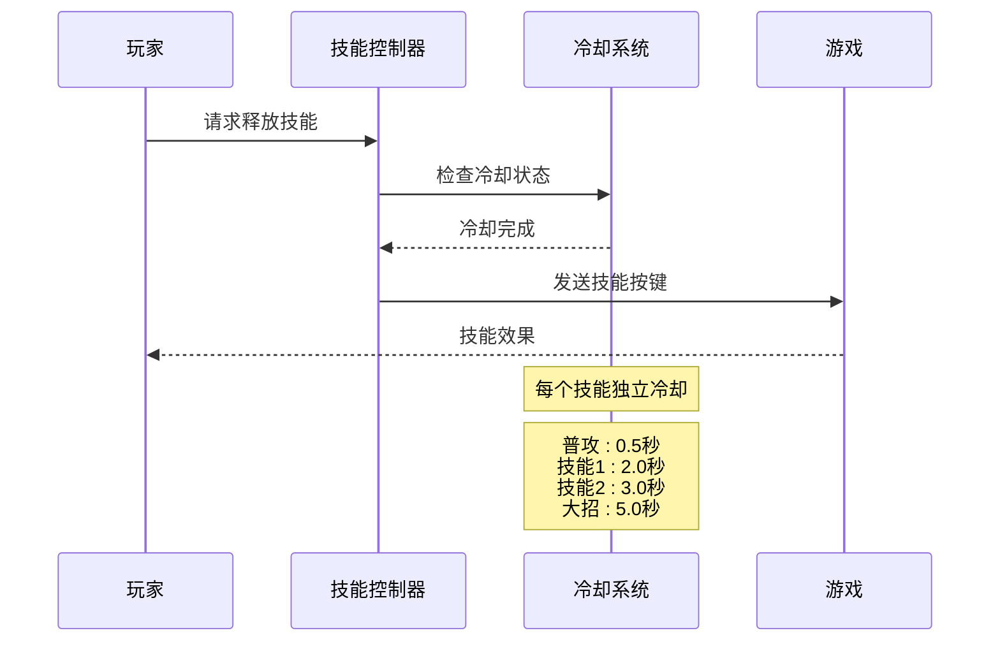

**图表来源**
- [skill_controller.py:29-80](file://src/combat/skill_controller.py#L29-L80)
- [skill_controller.py:356-370](file://src/combat/skill_controller.py#L356-L370)

### 技能释放策略

技能控制系统采用智能策略，根据战场状态和距离动态调整技能释放：

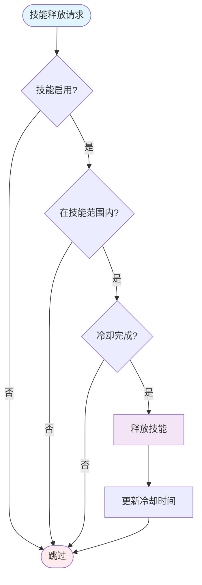

**图表来源**
- [skill_controller.py:323-355](file://src/combat/skill_controller.py#L323-L355)
- [skill_controller.py:279-322](file://src/combat/skill_controller.py#L279-L322)

**章节来源**
- [skill_controller.py:82-589](file://src/combat/skill_controller.py#L82-L589)

## 战斗状态检测

战斗状态检测器使用多种AI技术综合判断战场状态，确保技能释放的准确性。

### 多模态检测系统

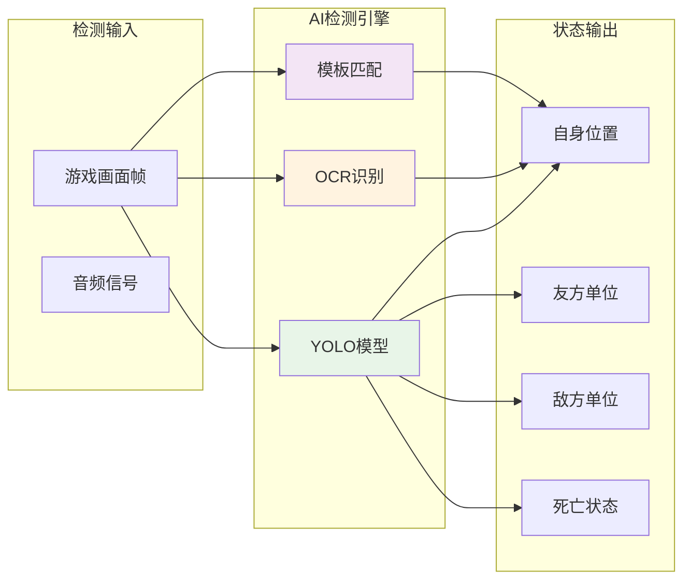

**图表来源**
- [state_detector.py:24-63](file://src/combat/state_detector.py#L24-L63)
- [labels.py:8-51](file://src/combat/labels.py#L8-L51)

### 战场状态分类

系统将战场状态分为四种基本类型：

| 状态类型 | 描述 | 技能策略 |
|---------|------|----------|
| 无单位 | 场上没有任何单位 | 随机移动搜索，持续30秒 |
| 仅友方 | 仅有友方单位，无敌军 | 跟随友方移动，保持0-225px距离 |
| 仅敌方 | 仅有敌方单位，无友方 | 向敌方移动，保持0-225px距离 |
| 混合 | 友方和敌方同时存在 | 优先攻击敌方，保持0-225px距离 |

**章节来源**
- [state_detector.py:16-447](file://src/combat/state_detector.py#L16-L447)
- [AutoCombatTask.py:690-714](file://src/task/AutoCombatTask.py#L690-L714)

## 移动控制系统

移动控制系统负责智能控制角色移动，确保在战斗中保持最佳位置。

### 智能移动算法

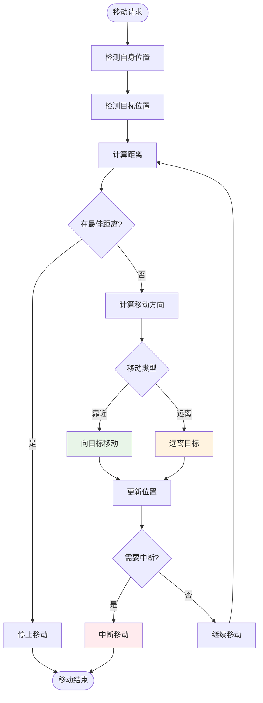

**图表来源**
- [movement_controller.py:106-165](file://src/combat/movement_controller.py#L106-L165)
- [movement_controller.py:357-425](file://src/combat/movement_controller.py#L357-L425)

### 多平台支持

系统支持多种平台和输入方式：

| 平台类型 | 输入方式 | 特殊功能 |
|---------|----------|----------|
| PC端 | 键盘(WASD) | 支持后台模式，SendInput |
| 移动端 | ADB控制 | 虚拟摇杆，手势识别 |
| 混合模式 | 自动适配 | 根据环境选择最优方案 |

**章节来源**
- [movement_controller.py:24-687](file://src/combat/movement_controller.py#L24-L687)

## 新手教程集成

系统集成了完整的AI技能教学和引导功能，帮助新用户快速掌握技能使用。

### 教程检测系统

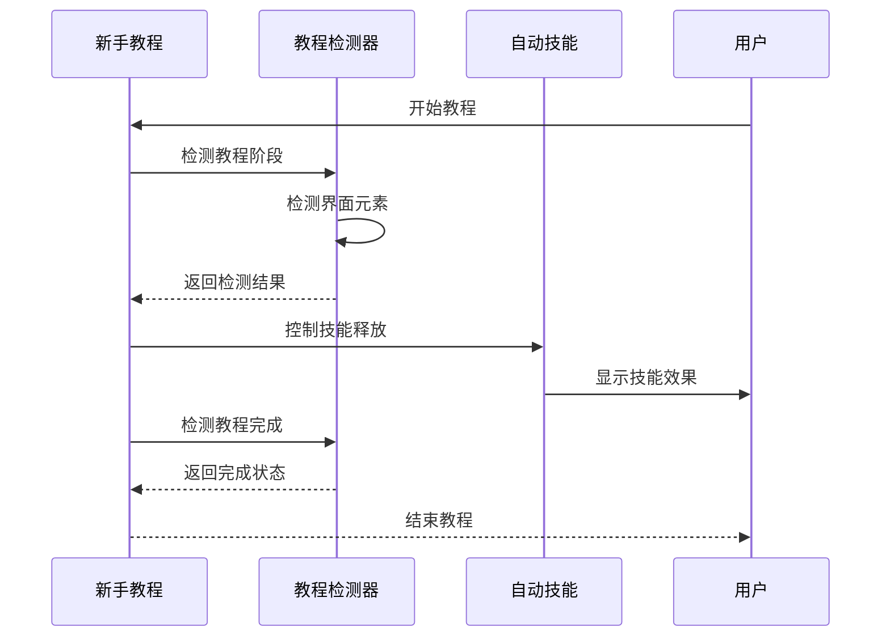

**图表来源**
- [tutorial_detector.py:21-58](file://src/tutorial/tutorial_detector.py#L21-L58)

**章节来源**
- [tutorial_detector.py:21-823](file://src/tutorial/tutorial_detector.py#L21-L823)

## 配置管理系统

系统采用灵活的配置管理机制，支持运行时热更新和多环境配置。

### 配置层次结构

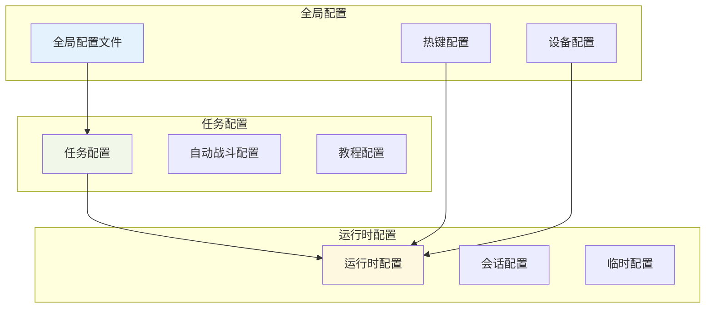

**图表来源**
- [AutoCombatTask.json:1-14](file://configs/AutoCombatTask.json#L1-L14)
- [游戏热键配置.json:1-6](file://configs/游戏热键配置.json#L1-L6)

### 配置更新机制

系统支持配置的热更新，无需重启应用即可生效：

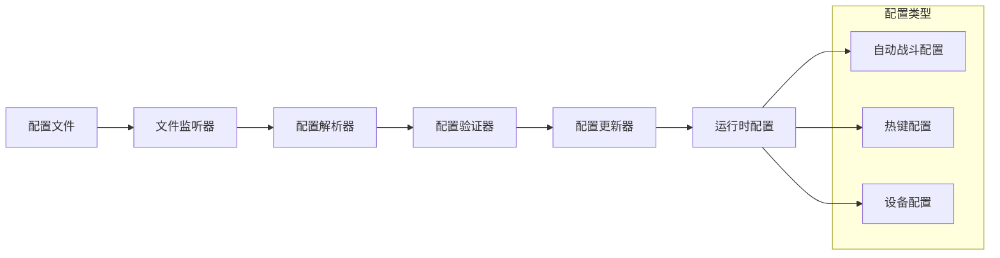

**图表来源**
- [main.py:482-656](file://main.py#L482-L656)

**章节来源**
- [AutoCombatTask.py:143-172](file://src/task/AutoCombatTask.py#L143-L172)
- [main.py:1-693](file://main.py#L1-L693)

## 性能优化策略

系统采用了多项性能优化策略，确保在复杂场景下的稳定运行。

### 多线程架构

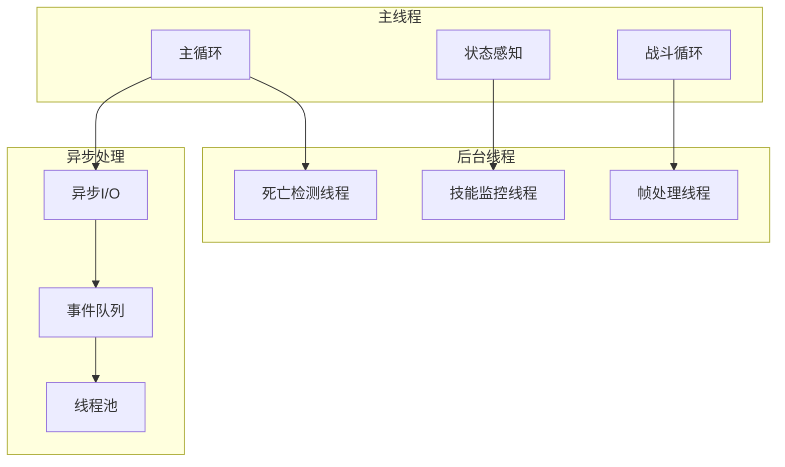

**图表来源**
- [state_detector.py:83-112](file://src/combat/state_detector.py#L83-L112)
- [skill_controller.py:226-252](file://src/combat/skill_controller.py#L226-L252)

### 资源管理优化

系统实现了智能的资源管理策略：

- **内存管理**：使用弱引用和对象池减少内存碎片
- **CPU优化**：动态调整检测频率和算法复杂度
- **GPU加速**：利用CUDA加速YOLO模型推理
- **网络优化**：缓存模型权重和特征数据

## 故障排除指南

### 常见问题及解决方案

| 问题类型 | 症状描述 | 解决方案 |
|---------|----------|----------|
| 技能不释放 | 技能冷却正常但不释放 | 检查技能开关配置和距离检测 |
| 移动异常 | 角色卡住或抖动 | 检查移动控制配置和目标检测 |
| 检测失败 | YOLO模型无法识别单位 | 检查模型文件和阈值设置 |
| 后台模式失效 | 最小化后无法操作 | 检查SendInput权限和窗口状态 |

### 调试模式

系统提供了详细的调试模式，帮助开发者诊断问题：

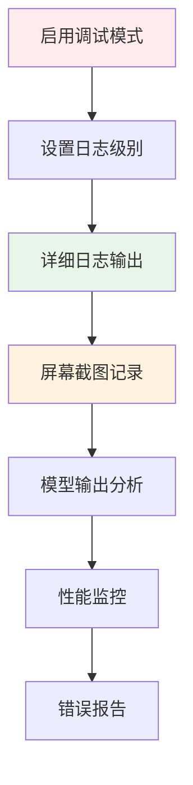

**图表来源**
- [AutoCombatTask.py:280-289](file://src/task/AutoCombatTask.py#L280-L289)

**章节来源**
- [AutoCombatTask.py:319-322](file://src/task/AutoCombatTask.py#L319-L322)
- [state_detector.py:64-72](file://src/combat/state_detector.py#L64-L72)

## 总结

AI技能系统是一个功能完整、架构清晰的自动化战斗辅助系统。通过深度学习技术和智能算法的结合，系统能够在复杂的游戏中提供准确的战斗辅助。

### 系统优势

1. **智能化程度高**：基于AI的多模态检测和决策
2. **适应性强**：支持多种游戏环境和平台
3. **稳定性好**：多线程架构和完善的错误处理
4. **扩展性佳**：模块化设计便于功能扩展

### 技术特色

- **多AI模型融合**：YOLO、OCR、模板匹配的协同工作
- **智能决策算法**：基于状态的动态技能释放策略
- **后台运行支持**：完整的伪后台操作能力
- **实时性能监控**：运行时的性能和状态监控

该系统为游戏自动化领域提供了一个优秀的参考实现，展示了现代AI技术在游戏领域的应用潜力。