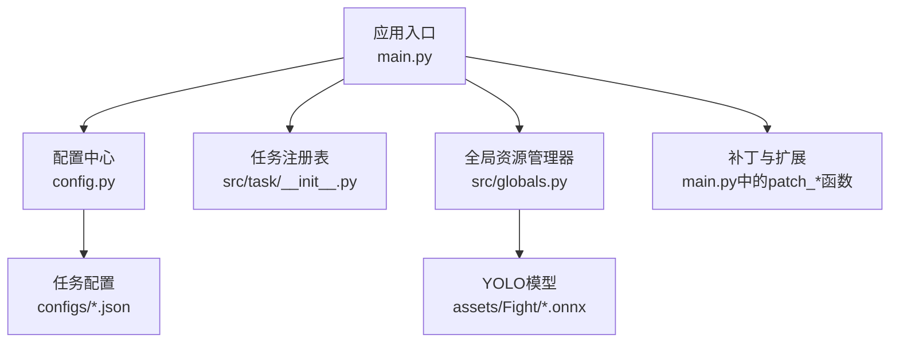
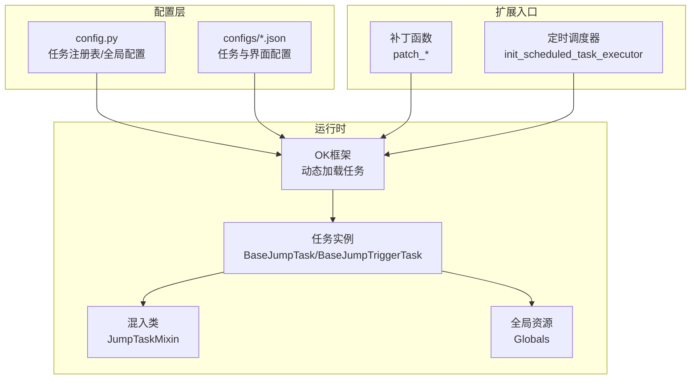
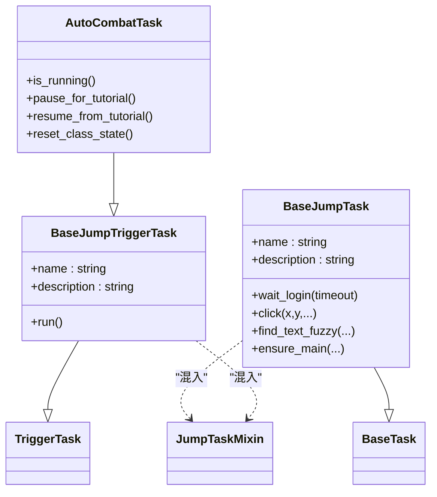
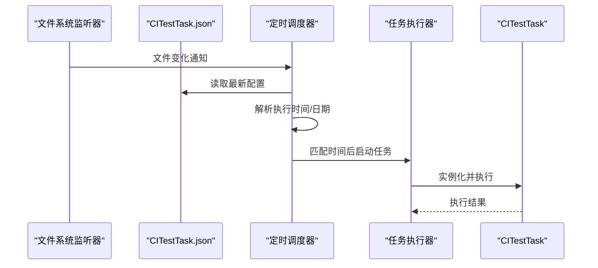
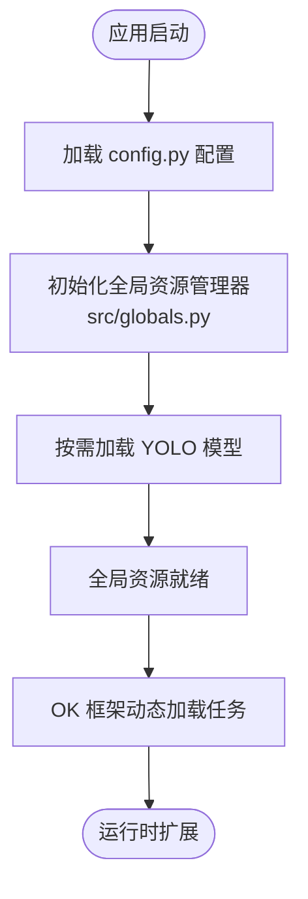
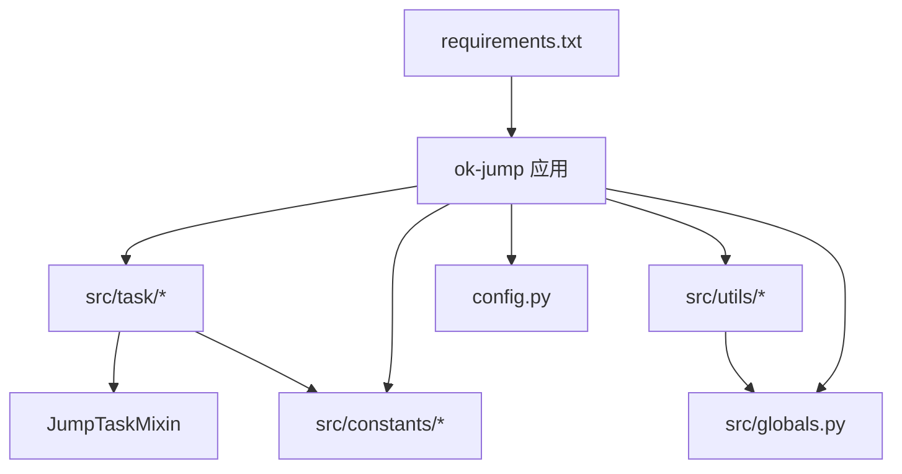

# 扩展点设计

<cite>
**本文档引用的文件**
- [main.py](file://main.py)
- [config.py](file://config.py)
- [src/__init__.py](file://src/__init__.py)
- [src/globals.py](file://src/globals.py)
- [src/task/__init__.py](file://src/task/__init__.py)
- [src/task/BaseJumpTask.py](file://src/task/BaseJumpTask.py)
- [src/task/BaseJumpTriggerTask.py](file://src/task/BaseJumpTriggerTask.py)
- [src/task/mixins.py](file://src/task/mixins.py)
- [src/constants/features.py](file://src/constants/features.py)
- [src/utils/__init__.py](file://src/utils/__init__.py)
- [configs/_ok.json](file://configs/_ok.json)
- [configs/Basic Options.json](file://configs/Basic Options.json)
- [configs/游戏热键配置.json](file://configs/游戏热键配置.json)
- [configs/CITestTask.json](file://configs/CITestTask.json)
- [requirements.txt](file://requirements.txt)
</cite>

## 目录
1. [简介](#简介)
2. [项目结构](#项目结构)
3. [核心组件](#核心组件)
4. [架构总览](#架构总览)
5. [详细组件分析](#详细组件分析)
6. [依赖分析](#依赖分析)
7. [性能考虑](#性能考虑)
8. [故障排查指南](#故障排查指南)
9. [结论](#结论)
10. [附录](#附录)

## 简介
本设计文档面向 ok-jump 项目的扩展点与插件化架构，聚焦以下目标：
- 任务系统的扩展机制：通过配置驱动与任务注册表实现任务的动态加载与替换。
- 配置系统的热更新能力：基于文件系统监听与配置缓存，实现运行时配置变更的即时生效。
- 模块的动态加载：利用 Python 动态导入与全局资源管理器，实现模型与工具模块的按需加载。
- 接口抽象与配置驱动：通过统一的配置项与任务基类，实现功能的灵活扩展与定制。
- 第三方扩展开发规范与集成方式：提供清晰的接口契约与集成步骤。
- 安全性与稳定性保障：通过补丁机制、异常处理与资源隔离，降低扩展风险。

## 项目结构
ok-jump 采用“配置驱动 + 任务基类 + 动态导入”的组织方式，核心目录与职责如下：
- src：核心业务模块，包含任务、战斗控制、工具与全局资源管理。
- configs：配置文件集合，涵盖基本设置、热键、任务配置与窗口布局。
- assets：资源文件，包含模型权重与特征标注。
- i18n：国际化翻译。
- scripts：辅助脚本。
- tests：单元测试与集成测试。

**图表来源**
- [main.py:659-693](file://main.py#L659-L693)
- [config.py:68-146](file://config.py#L68-L146)
- [src/task/__init__.py:1-24](file://src/task/__init__.py#L1-L24)
- [src/globals.py:16-406](file://src/globals.py#L16-L406)

**章节来源**
- [main.py:1-693](file://main.py#L1-L693)
- [config.py:1-146](file://config.py#L1-L146)
- [src/__init__.py:1-32](file://src/__init__.py#L1-L32)

## 核心组件
- 配置系统（config.py）：集中定义全局配置、窗口参数、OCR/模板匹配参数、任务注册表与自定义全局对象。
- 任务系统（src/task/*）：提供一次性任务与触发型任务基类，以及混入类复用通用能力。
- 全局资源管理器（src/globals.py）：统一管理登录状态、OCR缓存、YOLO模型等全局资源，支持延迟加载与重置。
- 扩展入口（main.py）：通过补丁函数对框架行为进行增强，并提供定时任务调度与配置热更新能力。
- 配置驱动（configs/*.json）：提供基本设置、热键、任务配置与窗口布局等可编辑配置。

**章节来源**
- [config.py:68-146](file://config.py#L68-L146)
- [src/task/BaseJumpTask.py:26-572](file://src/task/BaseJumpTask.py#L26-L572)
- [src/task/BaseJumpTriggerTask.py:13-29](file://src/task/BaseJumpTriggerTask.py#L13-L29)
- [src/task/mixins.py:15-784](file://src/task/mixins.py#L15-L784)
- [src/globals.py:16-406](file://src/globals.py#L16-L406)
- [main.py:482-657](file://main.py#L482-L657)

## 架构总览
系统通过“配置驱动 + 动态导入 + 补丁增强”的方式实现扩展：
- 配置驱动：config.py 中的 onetime_tasks/trigger_tasks/custom_tabs/scene 等字段定义任务与界面扩展点。
- 动态导入：OK 框架根据配置中的模块路径与类名动态加载任务与场景。
- 补丁增强：main.py 中的 patch_* 函数对框架行为进行增强，覆盖日志、设备连接、UI 按钮等细节。
- 全局资源：src/globals 提供全局状态与资源的统一入口，支持延迟加载与重置。

**图表来源**
- [config.py:126-145](file://config.py#L126-L145)
- [src/task/__init__.py:12-23](file://src/task/__init__.py#L12-L23)
- [src/task/mixins.py:15-28](file://src/task/mixins.py#L15-L28)
- [src/globals.py:16-42](file://src/globals.py#L16-L42)
- [main.py:482-657](file://main.py#L482-L657)

## 详细组件分析

### 任务系统扩展机制
- 一次性任务与触发型任务：
  - BaseJumpTask：一次性任务基类，提供登录等待、场景检测、OCR/模板匹配、后台点击等能力。
  - BaseJumpTriggerTask：触发型任务基类，用于需要轮询/触发的任务（如 AutoCombatTask）。
  - JumpTaskMixin：混入类，提供分辨率适配、后台模式支持、输入与点击的智能适配等通用能力。
- 任务注册与动态加载：
  - config.py 的 onetime_tasks/trigger_tasks 字段定义任务模块路径与类名，OK 框架据此动态加载。
  - src/task/__init__.py 汇总导出任务类，便于统一管理。
- 任务间协作：
  - BaseJumpTask 提供 get_task_by_class，从执行器中查找已注册任务实例，避免直接实例化带来的初始化问题。

**图表来源**
- [src/task/BaseJumpTask.py:26-572](file://src/task/BaseJumpTask.py#L26-L572)
- [src/task/BaseJumpTriggerTask.py:13-29](file://src/task/BaseJumpTriggerTask.py#L13-L29)
- [src/task/mixins.py:15-784](file://src/task/mixins.py#L15-L784)
- [src/task/AutoCombatTask.py:35-141](file://src/task/AutoCombatTask.py#L35-L141)

**章节来源**
- [src/task/BaseJumpTask.py:26-572](file://src/task/BaseJumpTask.py#L26-L572)
- [src/task/BaseJumpTriggerTask.py:13-29](file://src/task/BaseJumpTriggerTask.py#L13-L29)
- [src/task/mixins.py:15-784](file://src/task/mixins.py#L15-L784)
- [src/task/__init__.py:12-23](file://src/task/__init__.py#L12-L23)
- [config.py:126-139](file://config.py#L126-L139)

### 配置系统的热更新能力
- 定时任务调度器（init_scheduled_task_executor）：
  - 读取 CITestTask.json 的定时配置，支持“每天/工作日/周末/特定星期”执行。
  - 使用 QFileSystemWatcher 监听配置文件变化，实现热更新。
  - 每分钟检查一次，匹配时间与日期后启动 CITestTask。
- 基础配置热更新：
  - Basic Options.json 与 游戏热键配置.json 通过 OK 框架的配置系统实时生效。
- 设备智能选择与 ADB 预连接：
  - main.py 中的 smart_device_selection 与 pre_connect_adb 在 OK 初始化前执行，确保设备选择与 ADB 连接的正确性。

**图表来源**
- [main.py:482-657](file://main.py#L482-L657)
- [configs/CITestTask.json:1-29](file://configs/CITestTask.json#L1-L29)

**章节来源**
- [main.py:482-657](file://main.py#L482-L657)
- [configs/CITestTask.json:1-29](file://configs/CITestTask.json#L1-L29)
- [configs/Basic Options.json:1-13](file://configs/Basic Options.json#L1-L13)
- [configs/游戏热键配置.json:1-6](file://configs/游戏热键配置.json#L1-L6)

### 模块的动态加载
- 全局资源管理器（src/globals.py）：
  - 提供延迟加载的 YOLO 模型（fight.onnx/fight2.onnx），按需创建并缓存实例。
  - 提供 OCR 缓存、登录状态、CI 测试状态等全局状态的统一访问接口。
  - 提供 reset/reset_yolo_model 等重置方法，便于任务间隔离与资源回收。
- 任务基类与混入类：
  - BaseJumpTask/BaseJumpTriggerTask 通过 JumpTaskMixin 复用分辨率适配、后台模式、输入与点击等通用能力。
  - 通过 config.py 的 my_app 配置，OK 框架可动态导入并注入全局资源管理器实例。

**图表来源**
- [config.py:77-78](file://config.py#L77-L78)
- [src/globals.py:238-341](file://src/globals.py#L238-L341)
- [src/globals.py:16-42](file://src/globals.py#L16-L42)

**章节来源**
- [src/globals.py:16-406](file://src/globals.py#L16-L406)
- [config.py:77-78](file://config.py#L77-L78)
- [src/__init__.py:17-31](file://src/__init__.py#L17-L31)

### 扩展点设计原理与实现方式
- 接口抽象：
  - 任务基类与混入类提供统一的接口契约（如 click/smart_click/swipe/send_key 等），屏蔽平台差异。
  - 特征名称通过 Features 常量类统一管理，确保与 coco_detection.json 一致。
- 配置驱动：
  - config.py 的 global_configs/onetime_tasks/trigger_tasks/custom_tabs/scene 等字段定义扩展点。
  - configs/*.json 提供用户可编辑的配置，支持热更新与跨任务共享。
- 动态加载：
  - OK 框架根据模块路径与类名动态导入任务与场景，无需硬编码注册。
- 补丁增强：
  - main.py 中的 patch_* 函数对框架行为进行增强，覆盖日志、设备连接、UI 按钮等细节，提升稳定性与用户体验。

**章节来源**
- [src/constants/features.py:9-100](file://src/constants/features.py#L9-L100)
- [config.py:68-146](file://config.py#L68-L146)
- [main.py:22-46](file://main.py#L22-L46)

### 第三方扩展开发规范与集成方式
- 开发规范：
  - 任务类应继承 BaseJumpTask 或 BaseJumpTriggerTask，并在 default_config 中声明配置项。
  - 使用 JumpTaskMixin 提供的能力（分辨率适配、后台点击、输入适配等）。
  - 通过 Features 常量类引用特征名称，确保与资产文件一致。
- 集成方式：
  - 在 config.py 的 onetime_tasks/trigger_tasks 中添加模块路径与类名。
  - 在 configs 下新增对应任务的配置文件，或复用现有配置结构。
  - 如需全局资源，请在 config.py 的 my_app 中注册全局资源管理器。
- 示例路径：
  - 一次性任务：参考 AutoLoginTask/AutoMatchTask/DailyTask 等。
  - 触发型任务：参考 AutoCombatTask。
  - 全局资源：参考 Globals 的 YOLO 模型加载与缓存策略。

**章节来源**
- [src/task/BaseJumpTask.py:26-572](file://src/task/BaseJumpTask.py#L26-L572)
- [src/task/BaseJumpTriggerTask.py:13-29](file://src/task/BaseJumpTriggerTask.py#L13-L29)
- [src/task/mixins.py:15-784](file://src/task/mixins.py#L15-L784)
- [src/constants/features.py:9-100](file://src/constants/features.py#L9-L100)
- [config.py:126-145](file://config.py#L126-L145)

### 安全性与稳定性保障机制
- 补丁机制：
  - 日志处理补丁：抑制 SafeFileHandler 在退出与轮转时的 I/O 错误。
  - 设备连接补丁：降低 ADB 连接超时与预期错误的日志级别，减少噪音。
  - OCR 与捕获模块日志过滤：抑制“negative box”与“process no longer exists”等无害错误。
  - UI 补丁：修复按钮对齐、停止任务的正确性等。
- 异常处理与资源隔离：
  - 定时任务调度器在配置变化时重置执行键，防止同一时间重复执行。
  - AutoCombatTask 的类变量用于运行状态与暂停标志管理，支持重置与清理。
  - Globals 提供 reset/reset_yolo_model 等方法，便于任务间资源隔离。
- 性能优化：
  - OCR 缓存（1 秒 TTL）、分辨率适配、后台输入优化（SendInput/ADB 适配）等降低 CPU/GPU 使用率。

**章节来源**
- [main.py:22-46](file://main.py#L22-L46)
- [main.py:258-301](file://main.py#L258-L301)
- [main.py:303-366](file://main.py#L303-L366)
- [main.py:368-386](file://main.py#L368-L386)
- [main.py:482-657](file://main.py#L482-L657)
- [src/globals.py:171-227](file://src/globals.py#L171-L227)
- [src/globals.py:337-341](file://src/globals.py#L337-L341)
- [src/task/AutoCombatTask.py:43-141](file://src/task/AutoCombatTask.py#L43-L141)

## 依赖分析
- 外部依赖（requirements.txt）：ok-script、PySide6、OpenCV、ONNXRuntime、adbutils 等，支撑任务执行、图形界面、OCR/视觉与设备交互。
- 内部依赖：
  - main.py 依赖 config.py、src/globals、src/task/*、src/utils/*。
  - config.py 依赖 qfluentwidgets、ok.util.config 与本地路径工具。
  - 任务模块依赖混入类与常量类，实现功能复用与一致性。

**图表来源**
- [requirements.txt:1-17](file://requirements.txt#L1-L17)
- [main.py:17-19](file://main.py#L17-L19)
- [config.py:3-4](file://config.py#L3-L4)

**章节来源**
- [requirements.txt:1-17](file://requirements.txt#L1-L17)
- [main.py:17-19](file://main.py#L17-L19)
- [config.py:3-4](file://config.py#L3-L4)

## 性能考虑
- 后台模式与输入优化：通过 JumpTaskMixin 的后台点击与输入适配，减少前台模式下的性能损耗。
- OCR 缓存：1 秒 TTL 的 OCR 缓存降低重复识别开销。
- 分辨率适配：统一的缩放策略避免重复计算，提高点击与识别精度。
- 定时调度：每分钟检查一次，兼顾及时性与性能。

[本节为通用指导，无需具体文件分析]

## 故障排查指南
- 日志噪音问题：
  - 使用日志过滤补丁抑制“negative box”与“process no longer exists”等无害错误。
- 设备连接不稳定：
  - 使用 ADB 连接补丁降低超时与预期错误的日志级别，便于定位真实问题。
- 任务停止异常：
  - 使用 TaskButtons 停止补丁，确保停止时不恢复执行器运行。
- 定时任务未生效：
  - 检查 CITestTask.json 的启用与时间配置，确认文件监听器已注册。
- 全局资源占用：
  - 使用 Globals.reset/reset_yolo_model 重置资源，避免内存泄漏。

**章节来源**
- [main.py:22-46](file://main.py#L22-L46)
- [main.py:258-301](file://main.py#L258-L301)
- [main.py:303-366](file://main.py#L303-L366)
- [main.py:368-386](file://main.py#L368-L386)
- [main.py:482-657](file://main.py#L482-L657)
- [src/globals.py:230-235](file://src/globals.py#L230-L235)
- [src/globals.py:337-341](file://src/globals.py#L337-L341)

## 结论
ok-jump 通过“配置驱动 + 动态导入 + 补丁增强 + 全局资源管理”的架构，实现了任务系统的高扩展性与配置的热更新能力。任务基类与混入类提供了统一的接口抽象，第三方开发者可按规范快速集成新任务与功能。同时，完善的补丁机制与异常处理保障了系统的稳定性与安全性。建议在扩展新功能时遵循本文档的开发规范与集成步骤，确保兼容性与可维护性。

[本节为总结，无需具体文件分析]

## 附录
- 配置文件清单：
  - 基本设置：configs/Basic Options.json
  - 热键配置：configs/游戏热键配置.json
  - CI 定时任务：configs/CITestTask.json
  - 窗口布局：configs/_ok.json
- 关键常量：
  - 特征名称：src/constants/features.py

**章节来源**
- [configs/Basic Options.json:1-13](file://configs/Basic Options.json#L1-L13)
- [configs/游戏热键配置.json:1-6](file://configs/游戏热键配置.json#L1-L6)
- [configs/CITestTask.json:1-29](file://configs/CITestTask.json#L1-L29)
- [configs/_ok.json:1-7](file://configs/_ok.json#L1-L7)
- [src/constants/features.py:9-100](file://src/constants/features.py#L9-L100)