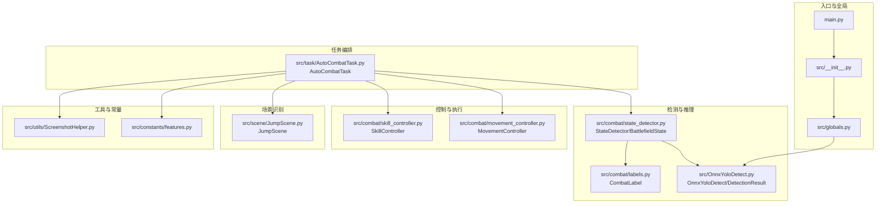
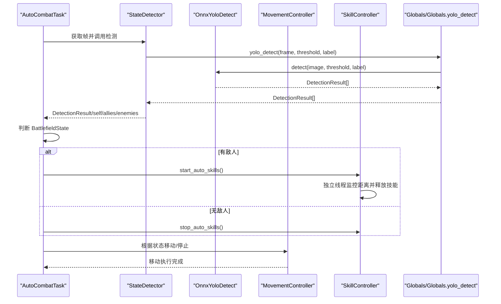
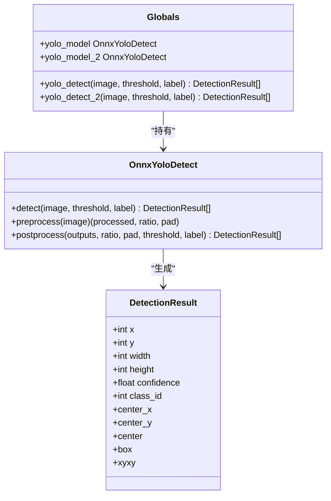
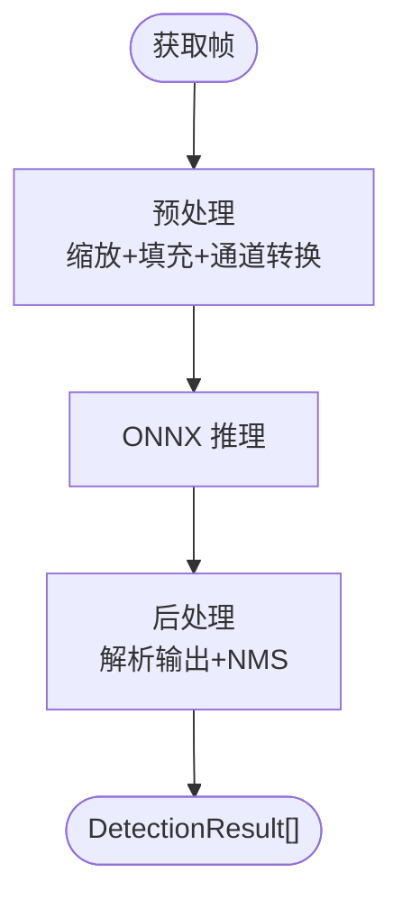
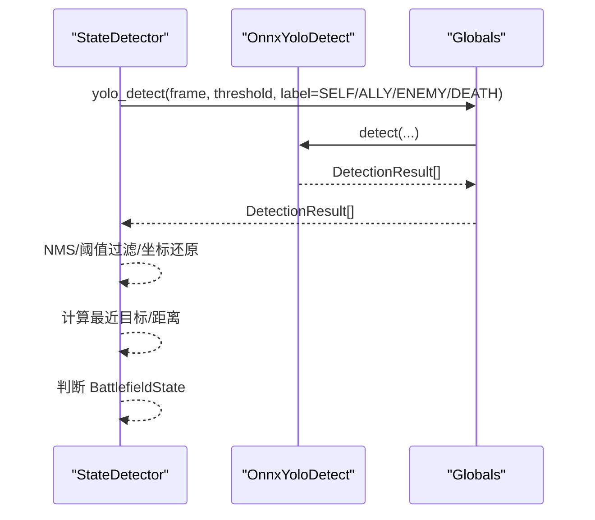
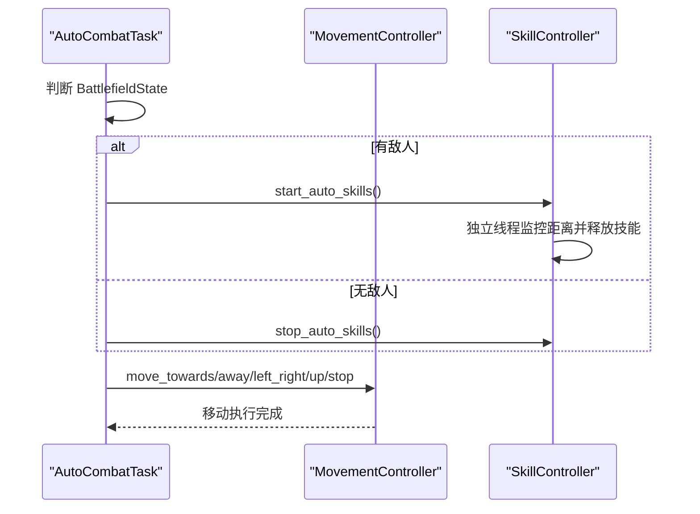
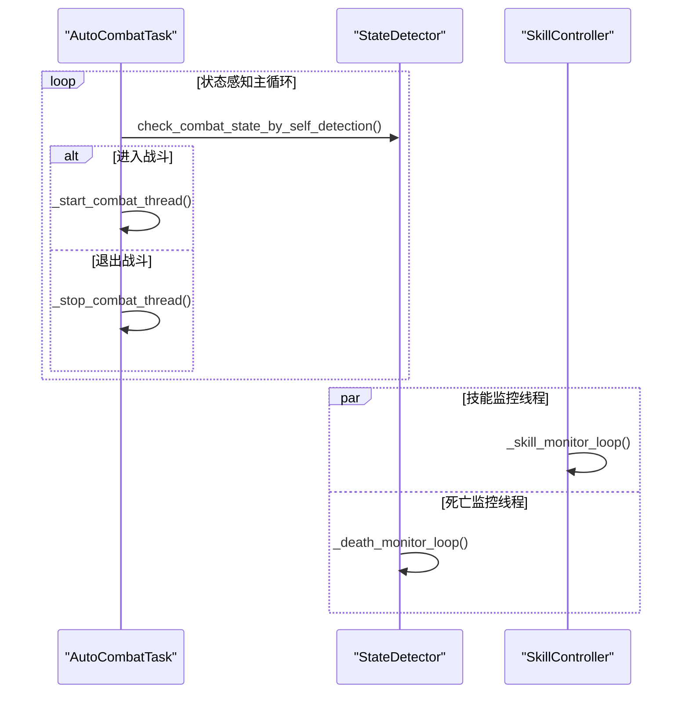
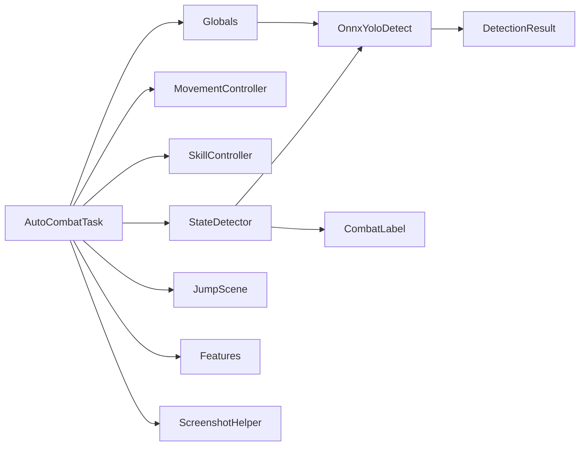

# 数据流设计

<cite>
**本文档引用的文件**
- [main.py](file://main.py)
- [src/__init__.py](file://src/__init__.py)
- [src/globals.py](file://src/globals.py)
- [src/OnnxYoloDetect.py](file://src/OnnxYoloDetect.py)
- [src/combat/state_detector.py](file://src/combat/state_detector.py)
- [src/combat/movement_controller.py](file://src/combat/movement_controller.py)
- [src/combat/skill_controller.py](file://src/combat/skill_controller.py)
- [src/combat/labels.py](file://src/combat/labels.py)
- [src/task/AutoCombatTask.py](file://src/task/AutoCombatTask.py)
- [src/scene/JumpScene.py](file://src/scene/JumpScene.py)
- [src/utils/ScreenshotHelper.py](file://src/utils/ScreenshotHelper.py)
- [src/constants/features.py](file://src/constants/features.py)
</cite>

## 目录
1. [简介](#简介)
2. [项目结构](#项目结构)
3. [核心组件](#核心组件)
4. [架构总览](#架构总览)
5. [详细组件分析](#详细组件分析)
6. [依赖关系分析](#依赖关系分析)
7. [性能考量](#性能考量)
8. [故障排查指南](#故障排查指南)
9. [结论](#结论)

## 简介
本文件面向 ok-jump 项目的开发者与使用者，系统性梳理“从图像采集到动作执行”的完整数据流路径，重点解释以下内容：
- 图像采集与预处理：截图获取、分辨率适配、YOLO 模型推理
- 检测与状态判定：DetectionResult、BattlefieldState 等核心数据结构与传递机制
- 动作执行：移动控制、技能释放、后台输入适配
- 同步与异步数据传递：并行死亡检测、技能监控线程、状态感知主循环
- 缓存策略与性能优化：OCR 缓存、YOLO 模型延迟加载、NMS 后处理
- 数据验证与错误处理：帧有效性校验、异常捕获与降级策略
- 调试与排障：日志体系、截图保存、常见问题定位

## 项目结构
ok-jump 基于 OK 框架构建，采用模块化组织：
- 入口与全局：main.py、src/__init__.py、src/globals.py
- 检测与推理：src/OnnxYoloDetect.py、src/combat/state_detector.py、src/combat/labels.py
- 控制与执行：src/combat/movement_controller.py、src/combat/skill_controller.py
- 任务编排：src/task/AutoCombatTask.py
- 场景识别：src/scene/JumpScene.py
- 工具与常量：src/utils/ScreenshotHelper.py、src/constants/features.py

图表来源
- [main.py:1-693](file://main.py#L1-L693)
- [src/__init__.py:1-32](file://src/__init__.py#L1-L32)
- [src/globals.py:1-406](file://src/globals.py#L1-L406)
- [src/OnnxYoloDetect.py:1-315](file://src/OnnxYoloDetect.py#L1-L315)
- [src/combat/state_detector.py:1-589](file://src/combat/state_detector.py#L1-L589)
- [src/combat/movement_controller.py:1-687](file://src/combat/movement_controller.py#L1-L687)
- [src/combat/skill_controller.py:1-589](file://src/combat/skill_controller.py#L1-L589)
- [src/combat/labels.py:1-51](file://src/combat/labels.py#L1-L51)
- [src/task/AutoCombatTask.py:1-800](file://src/task/AutoCombatTask.py#L1-L800)
- [src/scene/JumpScene.py:1-216](file://src/scene/JumpScene.py#L1-L216)
- [src/utils/ScreenshotHelper.py:1-68](file://src/utils/ScreenshotHelper.py#L1-L68)
- [src/constants/features.py:1-100](file://src/constants/features.py#L1-L100)

章节来源
- [main.py:1-693](file://main.py#L1-L693)
- [src/__init__.py:1-32](file://src/__init__.py#L1-L32)
- [src/globals.py:1-406](file://src/globals.py#L1-L406)

## 核心组件
- 全局资源管理器 Globals：统一管理登录状态、OCR 缓存、YOLO 模型（延迟加载）、CI 状态等；提供 yolo_detect 接口。
- OnnxYoloDetect：封装 ONNXRuntime 推理，提供 DetectionResult 数据结构与 NMS 后处理。
- StateDetector：基于 YOLO 的战场状态检测，支持并行死亡监控、自身检测、友方/敌方检测、状态判定。
- MovementController：跨平台移动控制（PC 键盘 WASD、ADB 虚拟摇杆），支持后台输入与伪最小化。
- SkillController：技能释放控制（普攻、技能1/2、大招），独立冷却线程与按键映射。
- AutoCombatTask：自动战斗任务编排，状态感知主循环、战斗线程、卡住/抖动检测、随机移动搜索。
- JumpScene：场景识别（登录、大厅、游戏中、结算等），分辨率适配与特征匹配。
- ScreenshotHelper：截图保存与 COCO 注释生成工具。
- Features：特征名称常量，保证与 coco_detection.json 一致。

章节来源
- [src/globals.py:16-406](file://src/globals.py#L16-L406)
- [src/OnnxYoloDetect.py:17-315](file://src/OnnxYoloDetect.py#L17-L315)
- [src/combat/state_detector.py:24-589](file://src/combat/state_detector.py#L24-L589)
- [src/combat/movement_controller.py:24-687](file://src/combat/movement_controller.py#L24-L687)
- [src/combat/skill_controller.py:82-589](file://src/combat/skill_controller.py#L82-L589)
- [src/task/AutoCombatTask.py:35-800](file://src/task/AutoCombatTask.py#L35-L800)
- [src/scene/JumpScene.py:8-216](file://src/scene/JumpScene.py#L8-L216)
- [src/utils/ScreenshotHelper.py:7-68](file://src/utils/ScreenshotHelper.py#L7-L68)
- [src/constants/features.py:9-100](file://src/constants/features.py#L9-L100)

## 架构总览
从图像采集到动作执行的完整数据流如下：

图表来源
- [src/task/AutoCombatTask.py:357-451](file://src/task/AutoCombatTask.py#L357-L451)
- [src/combat/state_detector.py:394-447](file://src/combat/state_detector.py#L394-L447)
- [src/globals.py:293-335](file://src/globals.py#L293-L335)
- [src/OnnxYoloDetect.py:234-258](file://src/OnnxYoloDetect.py#L234-L258)
- [src/combat/skill_controller.py:226-252](file://src/combat/skill_controller.py#L226-L252)
- [src/combat/movement_controller.py:106-165](file://src/combat/movement_controller.py#L106-L165)

## 详细组件分析

### 数据结构与传递机制
- DetectionResult：封装单个检测框的几何属性（x,y,width,height）与置信度、类别ID，提供中心点、边界框等便捷属性，作为检测结果的统一载体。
- BattlefieldState：枚举战场状态（无单位、仅友方、仅敌方、混合），用于状态感知与行为决策。
- 全局接口：Globals 提供 yolo_detect 与 yolo_detect_2，内部延迟加载 fight.onnx/fight2.onnx，统一异常处理与缓存策略。

图表来源
- [src/OnnxYoloDetect.py:261-315](file://src/OnnxYoloDetect.py#L261-L315)
- [src/OnnxYoloDetect.py:17-67](file://src/OnnxYoloDetect.py#L17-L67)
- [src/globals.py:238-335](file://src/globals.py#L238-L335)

章节来源
- [src/OnnxYoloDetect.py:261-315](file://src/OnnxYoloDetect.py#L261-L315)
- [src/globals.py:238-335](file://src/globals.py#L238-L335)

### 图像采集与预处理
- 截图来源：AutoCombatTask 通过任务框架提供的 next_frame()/frame 获取当前帧，确保使用最新画面。
- 分辨率适配：JumpScene 在检测场景时更新分辨率适配器，确保特征匹配与坐标计算准确。
- YOLO 预处理：OnnxYoloDetect.preprocess 将输入图像缩放到模型输入尺寸，保持纵横比并填充至正方形，BGR->RGB、归一化、HWC->CHW、增加 batch 维度。
- 后处理：OnnxYoloDetect.postprocess 解析模型输出，NMS 非极大值抑制，按置信度阈值过滤，还原到原始图像坐标。

图表来源
- [src/combat/state_detector.py:73-79](file://src/combat/state_detector.py#L73-L79)
- [src/OnnxYoloDetect.py:68-108](file://src/OnnxYoloDetect.py#L68-L108)
- [src/OnnxYoloDetect.py:110-186](file://src/OnnxYoloDetect.py#L110-L186)

章节来源
- [src/combat/state_detector.py:73-79](file://src/combat/state_detector.py#L73-L79)
- [src/OnnxYoloDetect.py:68-108](file://src/OnnxYoloDetect.py#L68-L108)
- [src/OnnxYoloDetect.py:110-186](file://src/OnnxYoloDetect.py#L110-L186)

### 检测与状态判定
- 并行死亡监控：StateDetector.start_death_monitor 启动后台线程，周期性检测死亡标签，快速查询 is_death_detected，降低主线程开销。
- 自身检测：detect_self/detect_self_once 基于 YOLO SELF 标签检测自身位置，支持超时与详细日志。
- 友方/敌方检测：detect_allies/detect_enemies 基于 YOLO ALLY/ENEMY 标签，返回 DetectionResult 列表。
- 战场状态：get_battlefield_state/get_battlefield_state_detailed 基于同一帧同时检测友方与敌方，返回 BattlefieldState 与单位列表。
- 目标锁定与距离：_get_nearest_target/_get_skill_distance 用于最近目标选择与技能释放距离计算。

图表来源
- [src/combat/state_detector.py:199-241](file://src/combat/state_detector.py#L199-L241)
- [src/combat/state_detector.py:243-323](file://src/combat/state_detector.py#L243-L323)
- [src/combat/state_detector.py:344-380](file://src/combat/state_detector.py#L344-L380)
- [src/combat/state_detector.py:394-447](file://src/combat/state_detector.py#L394-L447)
- [src/globals.py:293-335](file://src/globals.py#L293-L335)
- [src/OnnxYoloDetect.py:234-258](file://src/OnnxYoloDetect.py#L234-L258)

章节来源
- [src/combat/state_detector.py:199-241](file://src/combat/state_detector.py#L199-L241)
- [src/combat/state_detector.py:243-323](file://src/combat/state_detector.py#L243-L323)
- [src/combat/state_detector.py:344-380](file://src/combat/state_detector.py#L344-L380)
- [src/combat/state_detector.py:394-447](file://src/combat/state_detector.py#L394-L447)
- [src/globals.py:293-335](file://src/globals.py#L293-L335)

### 动作执行与控制
- 移动控制：MovementController 支持 PC 键盘 WASD 与 ADB 虚拟摇杆，自动按键组合、后台输入适配、可中断移动、左右来回移动、向上移动等。
- 技能控制：SkillController 独立冷却线程，独立冷却器（普攻、技能1/2、大招），按键映射来自全局热键配置，支持 ADB 点击与键盘按键双重路径。
- AutoCombatTask 主循环：根据 BattlefieldState 执行不同策略（无单位随机移动、仅友方跟随、仅敌方/混合追击与攻击），并集成卡住/抖动检测与随机移动搜索。

图表来源
- [src/task/AutoCombatTask.py:690-714](file://src/task/AutoCombatTask.py#L690-L714)
- [src/combat/movement_controller.py:106-165](file://src/combat/movement_controller.py#L106-L165)
- [src/combat/skill_controller.py:226-252](file://src/combat/skill_controller.py#L226-L252)

章节来源
- [src/combat/movement_controller.py:106-165](file://src/combat/movement_controller.py#L106-L165)
- [src/combat/skill_controller.py:226-252](file://src/combat/skill_controller.py#L226-L252)
- [src/task/AutoCombatTask.py:690-714](file://src/task/AutoCombatTask.py#L690-L714)

### 同步与异步数据传递
- 并行死亡检测：StateDetector 后台线程持续检测死亡状态，主线程通过 is_death_detected 快速查询，避免阻塞主循环。
- 技能监控线程：SkillController 独立线程持续监控距离并在范围内释放技能，与主循环解耦。
- 状态感知主循环：AutoCombatTask 的 _state_aware_main_loop 通过 YOLO 自身检测动态启停战斗线程，降低无效计算。
- 帧更新策略：StateDetector.detect_self 与 _combat_loop 中均显式调用 next_frame()，确保使用最新画面。

图表来源
- [src/combat/state_detector.py:83-196](file://src/combat/state_detector.py#L83-L196)
- [src/combat/skill_controller.py:279-321](file://src/combat/skill_controller.py#L279-L321)
- [src/task/AutoCombatTask.py:452-516](file://src/task/AutoCombatTask.py#L452-L516)
- [src/task/AutoCombatTask.py:517-560](file://src/task/AutoCombatTask.py#L517-L560)

章节来源
- [src/combat/state_detector.py:83-196](file://src/combat/state_detector.py#L83-L196)
- [src/combat/skill_controller.py:279-321](file://src/combat/skill_controller.py#L279-L321)
- [src/task/AutoCombatTask.py:452-516](file://src/task/AutoCombatTask.py#L452-L516)
- [src/task/AutoCombatTask.py:517-560](file://src/task/AutoCombatTask.py#L517-L560)

### 缓存策略与性能优化
- OCR 缓存：Globals.get_ocr_cache/set_ocr_cache 提供 TTL 缓存，避免重复 OCR，提升 UI/场景识别效率。
- YOLO 模型延迟加载：首次使用时才加载 fight.onnx/fight2.onnx，减少启动时间；异常时返回空列表并打印错误。
- NMS 后处理：OnnxYoloDetect.postprocess 中 NMS 降低重复检测，提高稳定性。
- 线程化与解耦：死亡监控、技能监控、状态感知分别在独立线程运行，避免相互阻塞。
- 帧更新与分辨率适配：JumpScene 在 detect_scene 时更新分辨率适配器，确保特征匹配与坐标计算准确。

章节来源
- [src/globals.py:171-227](file://src/globals.py#L171-L227)
- [src/globals.py:293-335](file://src/globals.py#L293-L335)
- [src/OnnxYoloDetect.py:188-232](file://src/OnnxYoloDetect.py#L188-L232)
- [src/scene/JumpScene.py:30-38](file://src/scene/JumpScene.py#L30-L38)

### 数据验证与错误处理
- 帧有效性：StateDetector.detect_self/_combat_loop 中对 frame=None 进行保护，记录日志并等待或退出。
- 异常捕获：AutoCombatTask._main_loop/_combat_loop 捕获异常并调用 _cleanup，记录帧信息以便调试。
- 模板与 OCR 结束检测：_detect_battle_end 使用模板匹配 fight_end.png 与 OCR 文本“对战结束”，避免误判。
- 日志与调试：大量日志输出（详细日志开关），支持截图保存（ScreenshotHelper.save_screenshot）辅助定位问题。

章节来源
- [src/combat/state_detector.py:275-286](file://src/combat/state_detector.py#L275-L286)
- [src/task/AutoCombatTask.py:446-450](file://src/task/AutoCombatTask.py#L446-L450)
- [src/task/AutoCombatTask.py:574-648](file://src/task/AutoCombatTask.py#L574-L648)
- [src/task/AutoCombatTask.py:323-355](file://src/task/AutoCombatTask.py#L323-L355)
- [src/utils/ScreenshotHelper.py:17-30](file://src/utils/ScreenshotHelper.py#L17-L30)

## 依赖关系分析

图表来源
- [src/task/AutoCombatTask.py:23-32](file://src/task/AutoCombatTask.py#L23-L32)
- [src/combat/state_detector.py:13-16](file://src/combat/state_detector.py#L13-L16)
- [src/OnnxYoloDetect.py:261-315](file://src/OnnxYoloDetect.py#L261-L315)
- [src/combat/labels.py:8-37](file://src/combat/labels.py#L8-L37)
- [src/globals.py:238-335](file://src/globals.py#L238-L335)
- [src/scene/JumpScene.py:1-6](file://src/scene/JumpScene.py#L1-L6)
- [src/constants/features.py:9-100](file://src/constants/features.py#L9-L100)
- [src/utils/ScreenshotHelper.py:67](file://src/utils/ScreenshotHelper.py#L67)

章节来源
- [src/task/AutoCombatTask.py:23-32](file://src/task/AutoCombatTask.py#L23-L32)
- [src/combat/state_detector.py:13-16](file://src/combat/state_detector.py#L13-L16)
- [src/OnnxYoloDetect.py:261-315](file://src/OnnxYoloDetect.py#L261-L315)
- [src/combat/labels.py:8-37](file://src/combat/labels.py#L8-L37)
- [src/globals.py:238-335](file://src/globals.py#L238-L335)
- [src/scene/JumpScene.py:1-6](file://src/scene/JumpScene.py#L1-L6)
- [src/constants/features.py:9-100](file://src/constants/features.py#L9-L100)
- [src/utils/ScreenshotHelper.py:67](file://src/utils/ScreenshotHelper.py#L67)

## 性能考量
- 检测频率与间隔：StateDetector 死亡监控 30ms 一次，自身检测 30ms 一次，战斗循环 50ms 一次，技能监控 20-50ms 一次，平衡实时性与 CPU 占用。
- 线程化与解耦：死亡监控、技能监控、状态感知分别在独立线程运行，避免相互阻塞。
- 模型推理优化：ONNXRuntime 提供 CPU/GPU 执行提供者选择；预处理与后处理在 CPU 上完成，尽量减少数据拷贝。
- 缓存与延迟加载：OCR 缓存与 YOLO 模型延迟加载，减少启动与运行时开销。
- 帧更新策略：在关键路径显式调用 next_frame()，避免使用过期帧导致误判。

## 故障排查指南
- 无法获取帧：检查 AutoCombatTask.next_frame() 是否被正确调用；查看日志中帧尺寸与 None 提示。
- 检测不到自身：确认 YOLO 模型权重路径存在；检查阈值与标签；查看详细日志中的置信度与检测次数。
- 技能不释放：检查技能开关与热键配置；确认技能冷却线程已启动；查看技能状态字典输出。
- 移动无效：区分 PC 键盘与 ADB 摇杆模式；检查窗口句柄与后台输入初始化；查看按键组合与持续时间。
- 战斗结束误判：确认模板匹配与 OCR 文本正则；检查分辨率与特征匹配准确性。
- 截图辅助：使用 ScreenshotHelper.save_screenshot 保存关键帧，结合日志定位问题。

章节来源
- [src/combat/state_detector.py:275-323](file://src/combat/state_detector.py#L275-L323)
- [src/combat/skill_controller.py:375-406](file://src/combat/skill_controller.py#L375-L406)
- [src/combat/movement_controller.py:76-104](file://src/combat/movement_controller.py#L76-L104)
- [src/task/AutoCombatTask.py:323-355](file://src/task/AutoCombatTask.py#L323-L355)
- [src/utils/ScreenshotHelper.py:17-30](file://src/utils/ScreenshotHelper.py#L17-L30)

## 结论
ok-jump 的数据流设计以“检测-决策-执行”为主线，通过 DetectionResult 与 BattlefieldState 实现清晰的数据传递与状态判定，借助并行线程与延迟加载策略实现高性能与低耦合。开发者在扩展功能时，应遵循现有数据结构与线程化模式，确保帧更新与异常处理的一致性，以获得稳定可靠的自动化体验。