# 核心架构

<cite>
**本文档引用的文件**
- [main.py](file://main.py)
- [config.py](file://config.py)
- [src/__init__.py](file://src/__init__.py)
- [src/globals.py](file://src/globals.py)
- [src/task/__init__.py](file://src/task/__init__.py)
- [src/combat/__init__.py](file://src/combat/__init__.py)
- [src/utils/__init__.py](file://src/utils/__init__.py)
- [src/scene/__init__.py](file://src/scene/__init__.py)
- [src/tutorial/__init__.py](file://src/tutorial/__init__.py)
- [src/task/BaseJumpTask.py](file://src/task/BaseJumpTask.py)
- [src/task/AutoCombatTask.py](file://src/task/AutoCombatTask.py)
- [src/combat/state_detector.py](file://src/combat/state_detector.py)
- [src/combat/movement_controller.py](file://src/combat/movement_controller.py)
- [src/combat/skill_controller.py](file://src/combat/skill_controller.py)
- [src/combat/distance_calculator.py](file://src/combat/distance_calculator.py)
- [src/utils/BackgroundInputHelper.py](file://src/utils/BackgroundInputHelper.py)
- [src/tutorial/phase1_handler.py](file://src/tutorial/phase1_handler.py)
- [README.md](file://README.md)
- [docs/自动战斗系统流程图.md](file://docs/自动战斗系统流程图.md)
- [configs/AutoCombatTask.json](file://configs/AutoCombatTask.json)
- [configs/游戏热键配置.json](file://configs/游戏热键配置.json)
- [tests/test_tutorial.py](file://tests/test_tutorial.py)
</cite>

## 更新摘要
**变更内容**
- 新增AI技能系统集成章节，详细描述技能控制器的整体架构设计
- 更新技能系统模块化组织方式，包括技能冷却机制、配置驱动设计
- 增加距离计算器与技能系统的协同工作机制
- 补充后台输入支持与跨平台适配的技能释放机制
- 添加技能系统测试用例与配置文件分析

## 目录
1. [简介](#简介)
2. [项目结构](#项目结构)
3. [核心组件](#核心组件)
4. [架构总览](#架构总览)
5. [详细组件分析](#详细组件分析)
6. [AI技能系统集成](#ai技能系统集成)
7. [依赖关系分析](#依赖关系分析)
8. [性能考量](#性能考量)
9. [故障排查指南](#故障排查指南)
10. [结论](#结论)
11. [附录](#附录)

## 简介
本项目为基于 ok-script 框架的自动化工具，面向游戏场景提供模块化、可扩展的自动化能力。系统采用模块化架构与事件驱动思想，围绕"任务-控制器-检测器"三层协作，实现从图像采集到动作执行的闭环流程。核心包括：
- 任务层：负责业务编排与生命周期管理（一次性任务、触发任务）
- 控制器层：负责具体动作执行（移动、技能释放）
- 检测器层：负责状态与场景感知（YOLO 检测、死亡状态监控）
- 工具层：提供分辨率适配、后台输入、伪最小化等通用能力
- 全局资源：集中管理登录状态、OCR 缓存、YOLO 模型等共享资源
- **AI技能系统**：新增智能化技能释放机制，支持多技能独立冷却与配置驱动

## 项目结构
项目采用按功能域划分的模块化组织方式，核心目录与职责如下：
- src：源代码根目录
  - task：任务定义与基类，包含一次性任务与触发任务
  - combat：战斗相关控制器与检测器（新增技能控制器、距离计算器）
  - utils：通用工具模块（分辨率适配、后台输入、伪最小化等）
  - scene：场景定义（如跳跃场景）
  - tutorial：新手教程模块（新增战斗配置适配器）
  - globals：全局资源管理器
- configs：配置文件集合（任务配置、窗口配置、热键配置等）
- assets：资源文件（模型、图片、模板等）
- docs：文档与流程图
- scripts：辅助脚本
- tests：测试用例

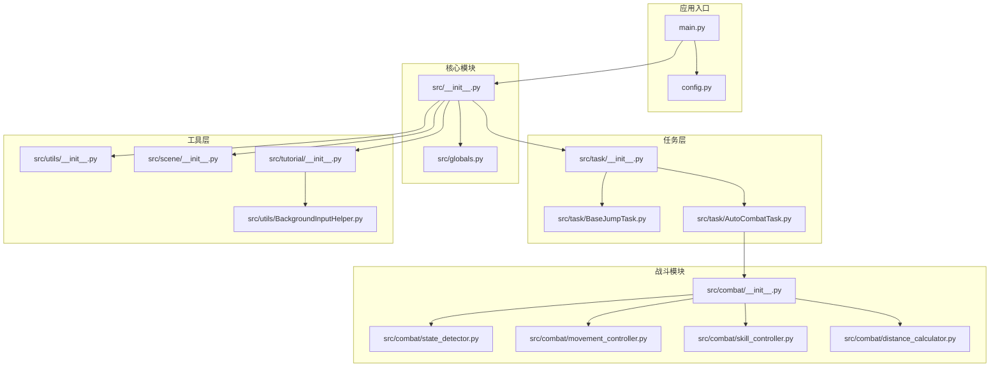

**图表来源**
- [main.py:1-693](file://main.py#L1-L693)
- [config.py:1-146](file://config.py#L1-L146)
- [src/__init__.py:1-32](file://src/__init__.py#L1-L32)
- [src/globals.py:1-406](file://src/globals.py#L1-L406)
- [src/task/__init__.py:1-24](file://src/task/__init__.py#L1-L24)
- [src/combat/__init__.py:1-22](file://src/combat/__init__.py#L1-L22)
- [src/utils/__init__.py:1-6](file://src/utils/__init__.py#L1-L6)
- [src/scene/__init__.py:1-4](file://src/scene/__init__.py#L1-L4)
- [src/tutorial/__init__.py:1-24](file://src/tutorial/__init__.py#L1-L24)

**章节来源**
- [README.md:1-8](file://README.md#L1-L8)
- [main.py:1-693](file://main.py#L1-L693)
- [config.py:1-146](file://config.py#L1-L146)

## 核心组件
- 全局资源管理器（Globals）
  - 统一管理登录状态、OCR 缓存、YOLO 模型等全局资源，支持延迟加载与重置
  - 提供 YOLO 检测接口，封装 fight.onnx 与 fight2.onnx 两个模型
- 任务基类（BaseJumpTask）
  - 提供游戏状态检测、分辨率自适应、后台模式支持、登录等待机制、伪最小化处理等通用能力
  - 封装 OCR 模糊匹配、特征匹配、等待条件等工具方法
- 自动战斗任务（AutoCombatTask）
  - 作为触发任务运行，结合状态检测器、移动控制器、技能控制器实现完整的自动战斗逻辑
  - 支持测试模式与状态感知模式，具备并行死亡检测、卡住/抖动检测等高级特性
  - **新增技能距离计算与智能释放机制**
- 战斗状态检测器（StateDetector）
  - 基于 YOLO 检测自身、友方、敌方与死亡状态，提供并行死亡监控与战斗状态判断
- 移动控制器（MovementController）
  - 支持 PC 端 WASD 键盘与手机端虚拟摇杆，适配后台模式与前台模式
- **技能控制器（SkillController）**
  - **支持 PC 端键盘与手机端点击，具备独立冷却线程与冷却管理**
  - **基于配置驱动的技能释放机制，支持多技能独立控制**
  - **智能距离检测与范围判断，确保技能释放的准确性**
- **距离计算器（DistanceCalculator）**
  - **提供精确的距离计算与最佳攻击范围判断**
  - **带缓冲区的滞后效应，避免边界值附近频繁切换**
  - **支持移动方向建议与单位向量计算**
- 工具模块（utils）
  - 提供分辨率适配、后台管理、伪最小化等通用能力
  - **新增后台输入助手，支持 Unity 游戏的可靠后台输入**

**章节来源**
- [src/globals.py:1-406](file://src/globals.py#L1-L406)
- [src/task/BaseJumpTask.py:1-572](file://src/task/BaseJumpTask.py#L1-L572)
- [src/task/AutoCombatTask.py:740-782](file://src/task/AutoCombatTask.py#L740-L782)
- [src/combat/state_detector.py:1-589](file://src/combat/state_detector.py#L1-L589)
- [src/combat/movement_controller.py:1-687](file://src/combat/movement_controller.py#L1-L687)
- [src/combat/skill_controller.py:1-589](file://src/combat/skill_controller.py#L1-L589)
- [src/combat/distance_calculator.py:1-197](file://src/combat/distance_calculator.py#L1-L197)
- [src/utils/BackgroundInputHelper.py:1-841](file://src/utils/BackgroundInputHelper.py#L1-L841)

## 架构总览
系统采用"任务-控制器-检测器-工具-全局资源"的分层架构，配合配置驱动与事件驱动机制，实现高度模块化与可扩展性。

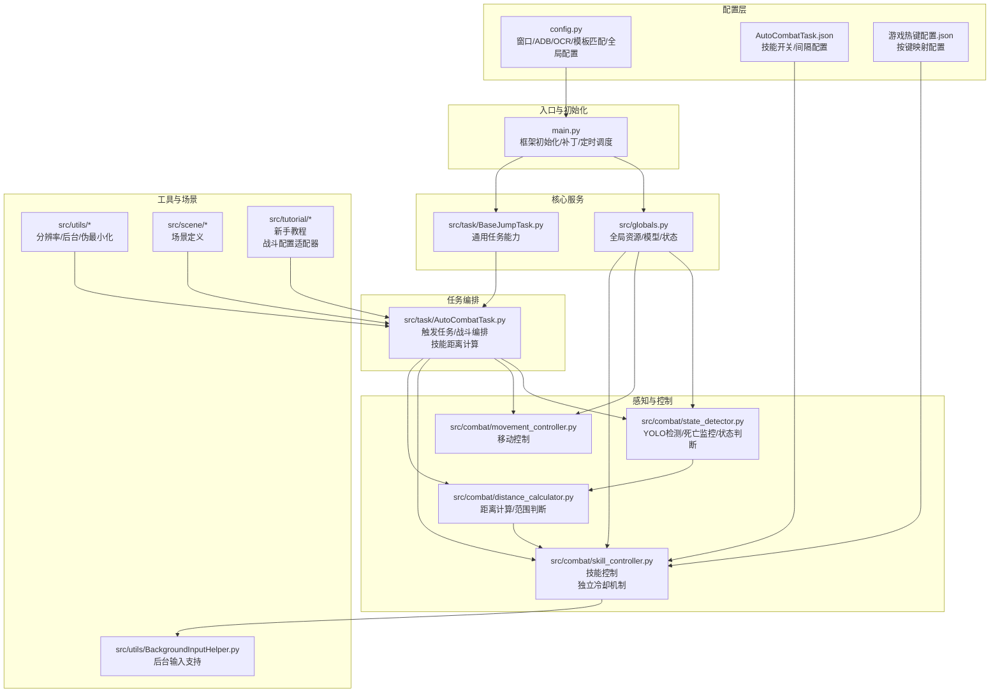

**图表来源**
- [config.py:1-146](file://config.py#L1-L146)
- [main.py:1-693](file://main.py#L1-L693)
- [src/globals.py:1-406](file://src/globals.py#L1-L406)
- [src/task/BaseJumpTask.py:1-572](file://src/task/BaseJumpTask.py#L1-L572)
- [src/task/AutoCombatTask.py:740-782](file://src/task/AutoCombatTask.py#L740-L782)
- [src/combat/state_detector.py:1-589](file://src/combat/state_detector.py#L1-L589)
- [src/combat/movement_controller.py:1-687](file://src/combat/movement_controller.py#L1-L687)
- [src/combat/skill_controller.py:1-589](file://src/combat/skill_controller.py#L1-L589)
- [src/combat/distance_calculator.py:1-197](file://src/combat/distance_calculator.py#L1-L197)

## 详细组件分析

### 全局资源管理器（Globals）
- 职责
  - 登录状态管理与重置
  - OCR 缓存管理（带 TTL）
  - YOLO 模型管理（fight.onnx/fight2.onnx，延迟加载）
  - CI 测试状态与报告管理
- 设计要点
  - 单例模式，通过 src/__init__.py 导出与初始化
  - 与 ok 框架集成，通过 og.my_app 暴露 YOLO 检测能力
- 复杂度
  - YOLO 模型加载 O(1)，检测调用受图像尺寸与类别数量影响

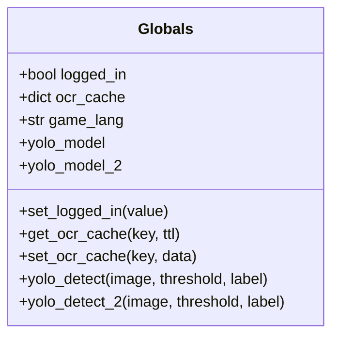

**图表来源**
- [src/globals.py:16-406](file://src/globals.py#L16-L406)

**章节来源**
- [src/globals.py:1-406](file://src/globals.py#L1-L406)
- [src/__init__.py:17-32](file://src/__init__.py#L17-L32)

### 任务基类（BaseJumpTask）
- 职责
  - 游戏状态检测（大厅/登录/主界面）
  - 分辨率自适应与后台模式支持
  - 登录等待与按钮点击处理
  - OCR 模糊匹配与特征匹配
  - 等待条件与超时控制
- 设计要点
  - 继承 ok.BaseTask，融合 JumpTaskMixin
  - 提供智能点击（后台/前台适配）、坐标提取、边界筛选等工具
  - 语言适配（简繁转换）与 OCR 缓存策略

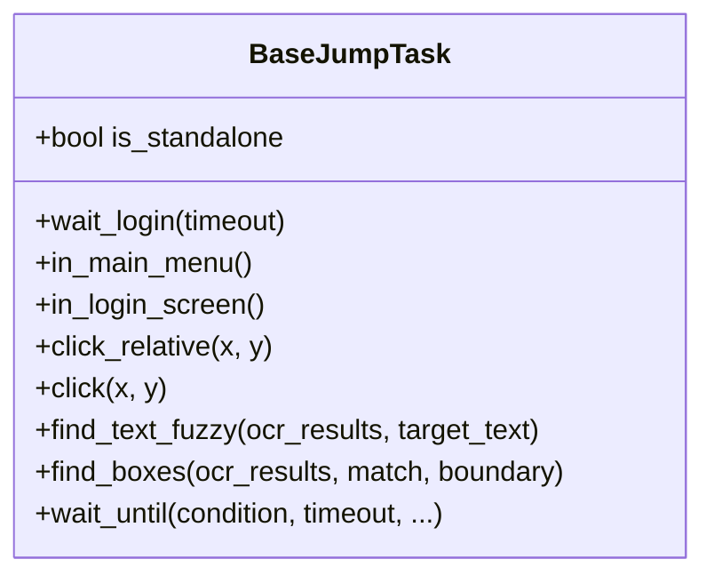

**图表来源**
- [src/task/BaseJumpTask.py:26-572](file://src/task/BaseJumpTask.py#L26-L572)

**章节来源**
- [src/task/BaseJumpTask.py:1-572](file://src/task/BaseJumpTask.py#L1-L572)

### 自动战斗任务（AutoCombatTask）
- 职责
  - 作为触发任务运行，编排战斗流程
  - 管理战斗线程与状态切换（进入/退出战斗）
  - 驱动状态检测器、移动控制器、技能控制器
  - **新增技能距离计算与智能释放逻辑**
- 设计要点
  - 测试模式与状态感知模式双模式
  - 并行死亡监控线程，快速响应死亡状态
  - 卡住/抖动检测与随机移动策略
  - 技能释放范围与距离管理
  - **智能技能距离计算：优先返回技能范围内的敌人距离**

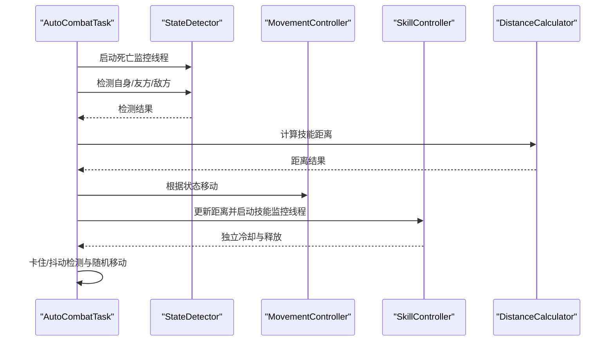

**图表来源**
- [src/task/AutoCombatTask.py:740-782](file://src/task/AutoCombatTask.py#L740-L782)
- [src/combat/state_detector.py:83-196](file://src/combat/state_detector.py#L83-L196)
- [src/combat/movement_controller.py:106-356](file://src/combat/movement_controller.py#L106-L356)
- [src/combat/skill_controller.py:226-355](file://src/combat/skill_controller.py#L226-L355)
- [src/combat/distance_calculator.py:52-82](file://src/combat/distance_calculator.py#L52-L82)

**章节来源**
- [src/task/AutoCombatTask.py:1-800](file://src/task/AutoCombatTask.py#L1-L800)

### 战斗状态检测器（StateDetector）
- 职责
  - 死亡状态并行监控（后台线程）
  - 自身/友方/敌方检测（YOLO）
  - 战斗状态判断（通过自身检测防抖动）
- 设计要点
  - 防抖动阈值控制（连续 N 次确认状态变化）
  - 详细日志与性能优化（高频检测间隔）

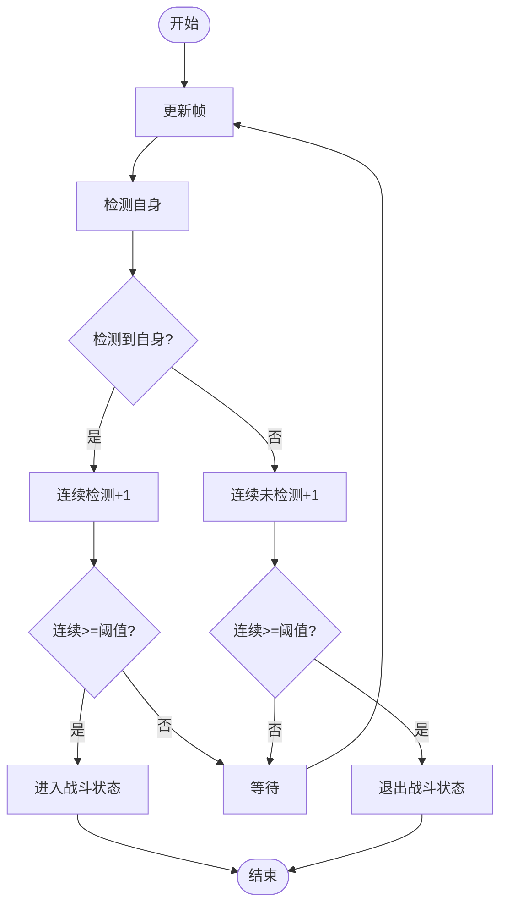

**图表来源**
- [src/combat/state_detector.py:510-554](file://src/combat/state_detector.py#L510-L554)

**章节来源**
- [src/combat/state_detector.py:1-589](file://src/combat/state_detector.py#L1-L589)

### 移动控制器（MovementController）
- 职责
  - PC 端 WASD 键盘移动与手机端虚拟摇杆移动
  - 支持后台模式（SendInput）与前台模式（pydirectinput）
  - 可中断移动与随机移动策略
- 设计要点
  - 八方向按键计算与阈值控制
  - ADB 模式下摇杆半径与中心坐标随分辨率适配

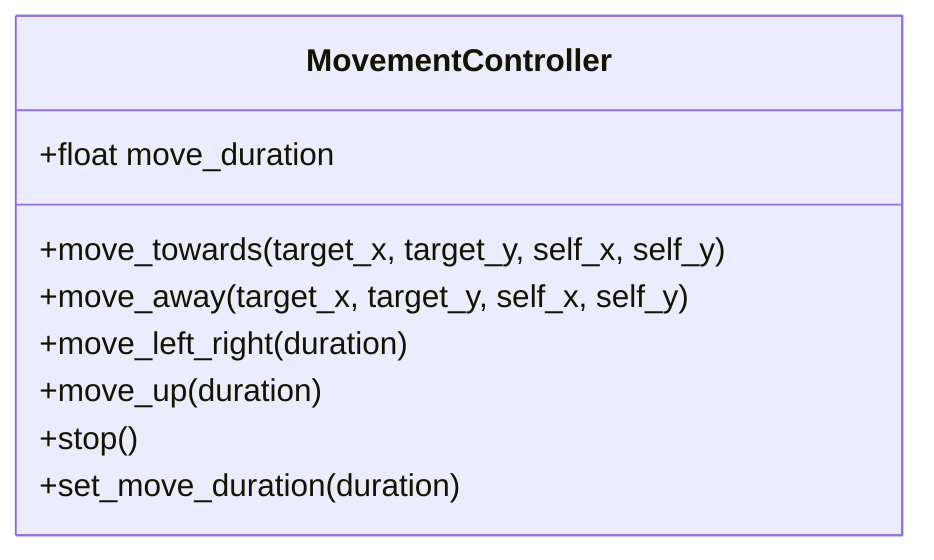

**图表来源**
- [src/combat/movement_controller.py:24-687](file://src/combat/movement_controller.py#L24-L687)

**章节来源**
- [src/combat/movement_controller.py:1-687](file://src/combat/movement_controller.py#L1-L687)

### 技能控制器（SkillController）
- 职责
  - **独立技能冷却线程，互不影响**
  - PC 端键盘按键与手机端点击
  - 距离监控与技能释放范围判断
  - **配置驱动的技能释放机制**
- 设计要点
  - 每个技能独立冷却器，冷却时间可配置
  - 与 AutoCombatTask 配置联动
  - **智能距离检测与范围判断（0-225px）**
  - **后台输入支持，适配 Unity 游戏**
  - **手机端技能按钮相对位置预设**

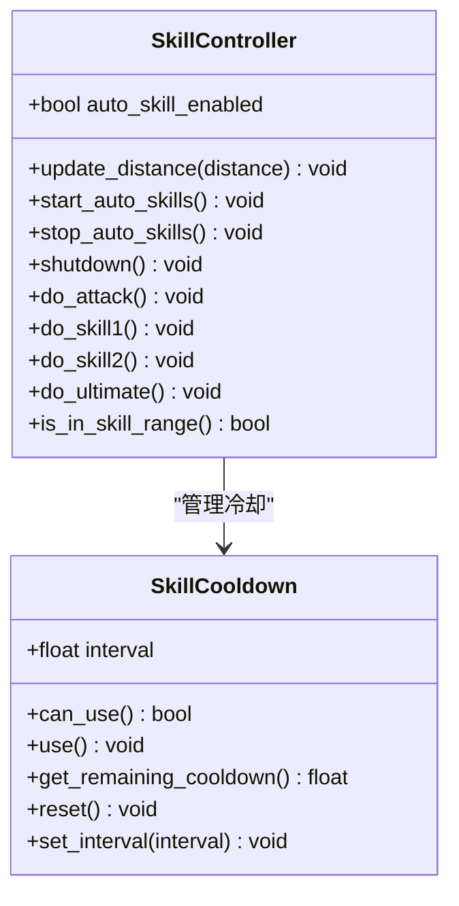

**图表来源**
- [src/combat/skill_controller.py:29-589](file://src/combat/skill_controller.py#L29-L589)

**章节来源**
- [src/combat/skill_controller.py:1-589](file://src/combat/skill_controller.py#L1-L589)

### 距离计算器（DistanceCalculator）
- 职责
  - **精确的距离计算与最佳攻击范围判断**
  - **带缓冲区的滞后效应，避免边界值附近频繁切换**
  - 移动方向建议与单位向量计算
- 设计要点
  - **最佳攻击距离范围：0-225px（扩大技能释放范围）**
  - **缓冲区机制：15px 避免频繁切换状态**
  - 滞后效应：进入范围与离开范围使用不同阈值

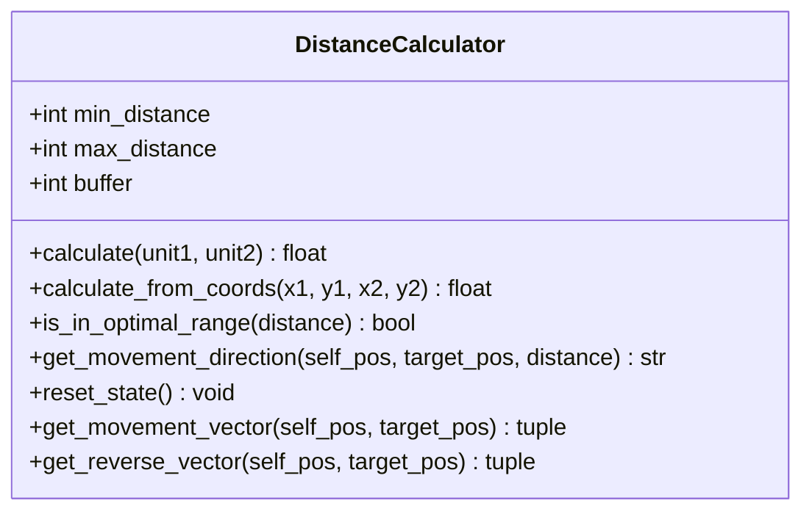

**图表来源**
- [src/combat/distance_calculator.py:14-197](file://src/combat/distance_calculator.py#L14-L197)

**章节来源**
- [src/combat/distance_calculator.py:1-197](file://src/combat/distance_calculator.py#L1-L197)

### 插件式设计与扩展点
- 任务扩展
  - 通过 config.py 的 onetime_tasks/trigger_tasks 注册新任务
  - 任务继承 BaseJumpTask 或 BaseJumpTriggerTask，复用通用能力
- 模块扩展
  - 新增战斗控制器/检测器放入 combat 子模块，通过 __init__.py 暴露
  - 新增工具模块放入 utils 子模块，通过 __init__.py 暴露
- 配置驱动
  - 窗口/ADB/OCR/模板匹配/全局配置集中管理
  - GUI 配置项与任务配置联动
  - **技能配置通过 AutoCombatTask.json 与游戏热键配置.json 驱动**

**章节来源**
- [config.py:126-144](file://config.py#L126-L144)
- [src/task/__init__.py:1-24](file://src/task/__init__.py#L1-L24)
- [src/combat/__init__.py:1-22](file://src/combat/__init__.py#L1-L22)
- [src/utils/__init__.py:1-6](file://src/utils/__init__.py#L1-L6)

## AI技能系统集成

### 技能系统整体架构
AI技能系统作为自动战斗系统的核心智能化组件，采用模块化设计与配置驱动机制：

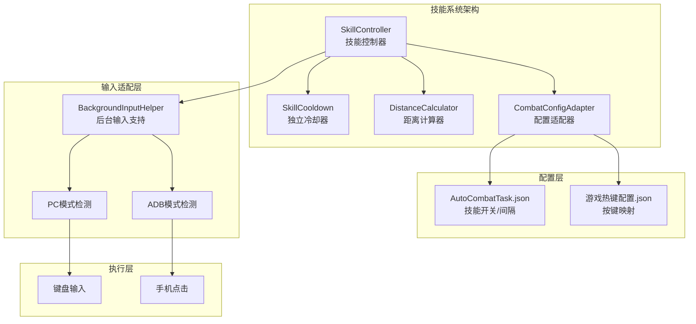

**图表来源**
- [src/combat/skill_controller.py:82-589](file://src/combat/skill_controller.py#L82-L589)
- [src/combat/distance_calculator.py:14-197](file://src/combat/distance_calculator.py#L14-L197)
- [src/tutorial/phase1_handler.py:576-595](file://src/tutorial/phase1_handler.py#L576-L595)
- [src/utils/BackgroundInputHelper.py:99-401](file://src/utils/BackgroundInputHelper.py#L99-L401)

### 技能冷却机制
技能系统采用独立冷却线程与多技能独立冷却设计：

- **独立冷却器**：每个技能拥有独立的 SkillCooldown 实例
- **冷却时间配置**：普攻0.5秒、技能12.0秒、技能23.0秒、大招5.0秒
- **冷却状态管理**：线程安全的冷却状态检查与重置
- **动态配置更新**：运行时从配置文件动态更新冷却间隔

### 距离检测与范围判断
距离计算器与技能系统的深度集成：

- **技能范围**：0-225像素的最佳攻击范围
- **滞后效应**：15像素缓冲区避免频繁切换状态
- **智能距离计算**：优先返回技能范围内的敌人距离
- **移动方向建议**：根据距离提供靠近/远离/停止指令

### 配置驱动设计
技能系统通过多层配置实现灵活控制：

- **技能开关**：自动普攻、自动技能1、自动技能2、自动大招
- **冷却间隔**：可配置的技能释放间隔时间
- **按键映射**：从游戏热键配置读取技能按键
- **配置适配器**：为 SkillController 提供统一的配置访问接口

### 跨平台适配机制
支持多种运行环境的技能释放：

- **Unity游戏支持**：通过 BackgroundInputHelper 提供可靠的后台输入
- **ADB模式检测**：自动识别手机端运行环境
- **输入方式适配**：PC端键盘输入 vs 手机端屏幕点击
- **窗口模式支持**：前台激活 vs 后台伪最小化模式

### 测试与验证
技能系统具备完善的测试覆盖：

- **距离范围测试**：验证0-225像素范围判断
- **None值处理测试**：确保距离为None时的安全处理
- **冷却机制测试**：验证独立冷却器的正确性
- **配置读取测试**：验证配置驱动的正确性

**章节来源**
- [src/combat/skill_controller.py:1-589](file://src/combat/skill_controller.py#L1-L589)
- [src/combat/distance_calculator.py:1-197](file://src/combat/distance_calculator.py#L1-L197)
- [src/tutorial/phase1_handler.py:576-595](file://src/tutorial/phase1_handler.py#L576-L595)
- [src/utils/BackgroundInputHelper.py:1-841](file://src/utils/BackgroundInputHelper.py#L1-L841)
- [configs/AutoCombatTask.json:1-14](file://configs/AutoCombatTask.json#L1-L14)
- [configs/游戏热键配置.json:1-6](file://configs/游戏热键配置.json#L1-L6)
- [tests/test_tutorial.py:768-859](file://tests/test_tutorial.py#L768-L859)

## 依赖关系分析
- 模块耦合
  - AutoCombatTask 依赖 StateDetector/MovementController/SkillController
  - **SkillController 依赖 DistanceCalculator 进行距离判断**
  - **SkillController 依赖 BackgroundInputHelper 进行后台输入**
  - **Phase1Handler 通过 CombatConfigAdapter 适配 SkillController 配置**
  - 各控制器依赖 Globals 提供的 YOLO 检测能力
  - 工具模块与任务模块松耦合，通过公共接口交互
- 外部依赖
  - ok-script 框架（BaseTask、executor、interaction 等）
  - adbutils（ADB 连接与设备管理）
  - PySide6（GUI 与定时器）
  - **ctypes、win32api（Windows API 调用）**
- 循环依赖
  - 通过延迟导入与运行时初始化避免循环依赖

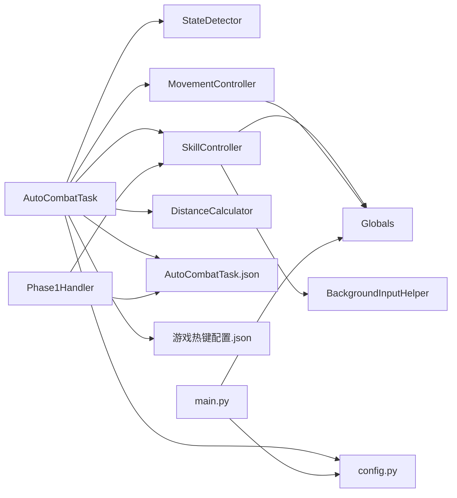

**图表来源**
- [src/task/AutoCombatTask.py:740-782](file://src/task/AutoCombatTask.py#L740-L782)
- [src/combat/state_detector.py:16-63](file://src/combat/state_detector.py#L16-L63)
- [src/combat/movement_controller.py:24-52](file://src/combat/movement_controller.py#L24-L52)
- [src/combat/skill_controller.py:82-589](file://src/combat/skill_controller.py#L82-L589)
- [src/combat/distance_calculator.py:14-197](file://src/combat/distance_calculator.py#L14-L197)
- [src/utils/BackgroundInputHelper.py:99-401](file://src/utils/BackgroundInputHelper.py#L99-L401)
- [src/tutorial/phase1_handler.py:576-595](file://src/tutorial/phase1_handler.py#L576-L595)
- [src/globals.py:238-341](file://src/globals.py#L238-L341)
- [config.py:68-144](file://config.py#L68-L144)
- [main.py:659-693](file://main.py#L659-L693)

**章节来源**
- [main.py:1-693](file://main.py#L1-L693)
- [config.py:1-146](file://config.py#L1-L146)

## 性能考量
- YOLO 检测
  - 通过 Globals 延迟加载模型，避免启动时开销
  - 检测器内部使用高频检测（~30Hz）与防抖动阈值平衡响应速度与稳定性
- 后台模式
  - 使用 SendInput/BackgroundInputHelper 保证后台按键稳定
  - 定时器与线程池合理配置，避免 CPU 占用过高
  - **技能监控线程采用非阻塞设计，避免影响主线程性能**
- OCR 与缓存
  - OCR 缓存 TTL 控制，减少重复识别
- 移动与技能
  - 移动持续时间与技能间隔可配置，平衡效率与稳定性
  - **技能冷却机制避免技能滥用，提高战斗效率**

## 故障排查指南
- 日志与导出
  - 提供日志打包导出功能，便于问题定位
- ADB 连接
  - 预连接 ADB，支持多种地址格式；连接失败降级为警告日志
- 模拟器/窗口
  - 支持最小化/屏幕外窗口，后台模式下自动伪最小化
- 任务停止
  - 修复 TaskButtons.stop_clicked，确保停止时不恢复执行器
- OCR 与捕获
  - 过滤 PaddleOCR "negative box"与捕获模块 "process no longer exists" 等噪音日志
- **技能系统故障排查**
  - **检查 AutoCombatTask.json 配置文件的技能开关与间隔设置**
  - **验证游戏热键配置.json 中的按键映射是否正确**
  - **确认技能冷却时间配置是否合理**
  - **检查后台输入支持是否正常工作**

**章节来源**
- [main.py:49-85](file://main.py#L49-L85)
- [main.py:258-301](file://main.py#L258-L301)
- [main.py:332-366](file://main.py#L332-L366)
- [main.py:87-112](file://main.py#L87-L112)
- [main.py:388-430](file://main.py#L388-L430)

## 结论
本项目通过清晰的模块化分层与配置驱动，构建了可扩展、可维护的自动化系统。核心在于：
- 以任务为中心的编排能力（BaseJumpTask/AutoCombatTask）
- 以检测器为核心的感知体系（YOLO/死亡监控/状态判断）
- 以控制器为基础的动作执行（移动/技能）
- 以全局资源为支撑的共享能力（模型/状态/缓存）
- **以技能系统为代表的智能化组件（独立冷却/配置驱动/跨平台适配）**

**新增的AI技能系统集成了以下关键特性**：
- **模块化技能控制器**：独立冷却机制与配置驱动设计
- **智能距离判断**：基于距离计算器的最佳攻击范围判断
- **跨平台适配**：支持PC端键盘与手机端点击的统一接口
- **后台输入支持**：专门针对Unity游戏的可靠后台输入机制
- **完善的测试覆盖**：确保技能系统的稳定性和可靠性

开发者可基于现有框架快速扩展新任务与新模块，同时通过配置实现灵活的功能开关与行为定制。AI技能系统的加入进一步提升了系统的智能化水平和战斗效率。

## 附录
- 数据流设计（从图像采集到动作执行）
  - 图像采集：通过 ok 框架获取帧（frame）
  - 感知处理：Globals.yolo_detect -> StateDetector（YOLO 检测）
  - **距离计算**：DistanceCalculator.calculate -> 技能距离判断
  - 决策执行：AutoCombatTask（状态判断）-> MovementController/SkillController
  - **技能释放**：SkillController.update_distance -> 独立冷却检查 -> 技能释放
  - 动作反馈：SendInput/ADB 命令 -> 游戏窗口
- 可扩展性设计
  - 任务注册表（config.py）与模块导出（__init__.py）
  - 配置驱动（GUI/JSON）与热更新（定时器/文件监听）
  - 插件式模块（combat/utils/scene/tutorial）按需扩展
  - **技能系统通过配置适配器实现无缝集成**
- **AI技能系统集成要点**
  - **技能控制器与距离计算器的紧密协作**
  - **配置驱动的技能释放机制**
  - **跨平台输入适配的统一接口设计**
  - **后台输入支持的Unity游戏优化**

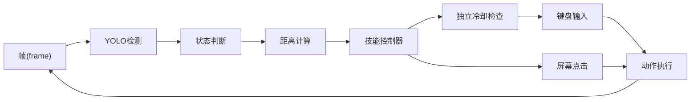

**图表来源**
- [src/globals.py:293-336](file://src/globals.py#L293-L336)
- [src/combat/state_detector.py:394-447](file://src/combat/state_detector.py#L394-L447)
- [src/combat/distance_calculator.py:52-82](file://src/combat/distance_calculator.py#L52-L82)
- [src/combat/skill_controller.py:271-355](file://src/combat/skill_controller.py#L271-L355)
- [src/combat/movement_controller.py:106-165](file://src/combat/movement_controller.py#L106-L165)
- [src/combat/skill_controller.py:463-507](file://src/combat/skill_controller.py#L463-L507)