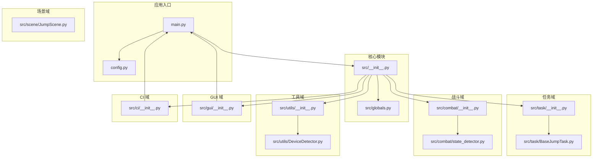
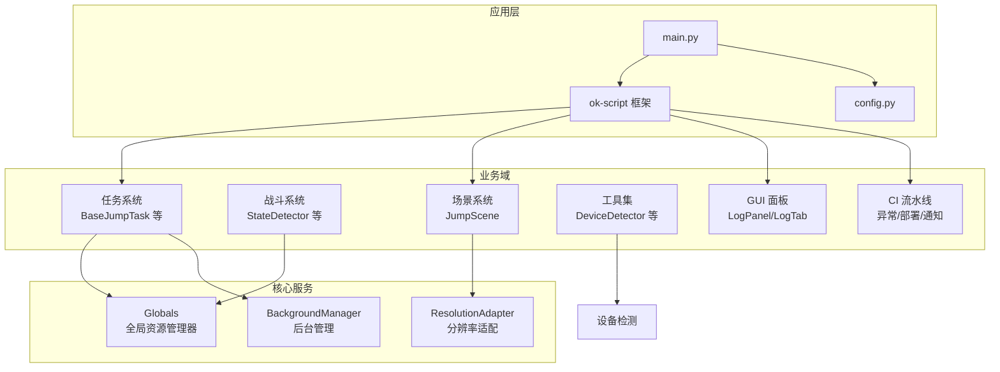
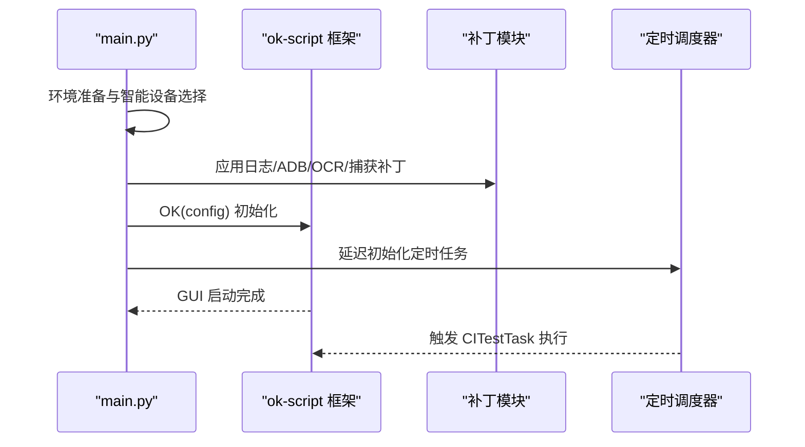
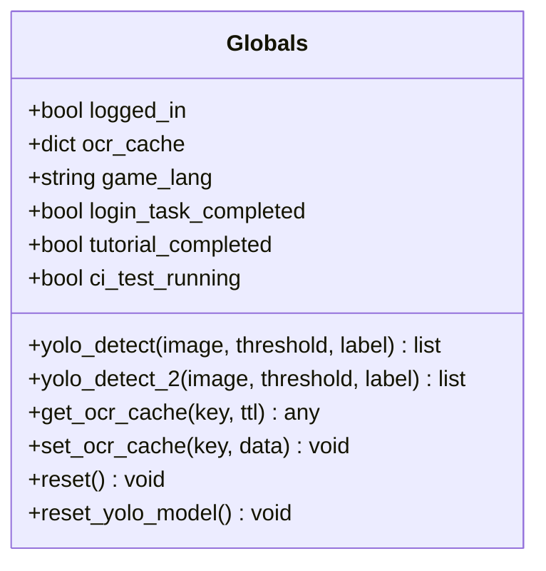
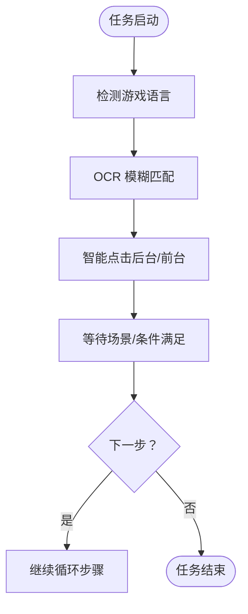
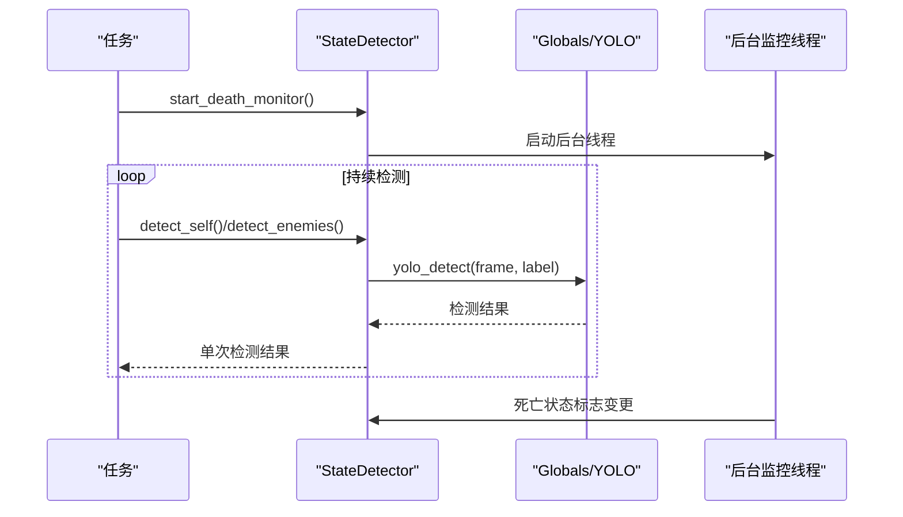
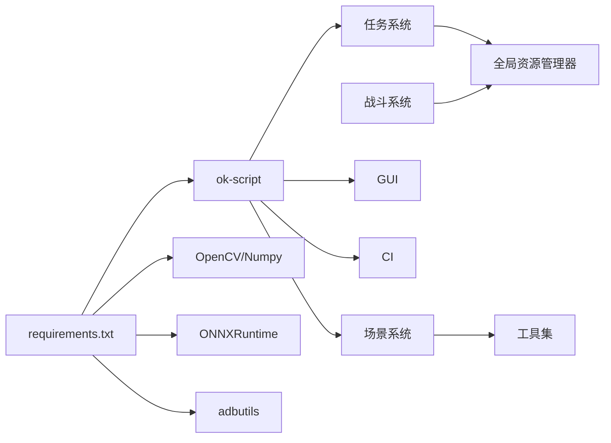

# 模块化设计架构

<cite>
**本文档引用的文件**
- [main.py](file://main.py)
- [config.py](file://config.py)
- [src/__init__.py](file://src/__init__.py)
- [src/globals.py](file://src/globals.py)
- [src/task/__init__.py](file://src/task/__init__.py)
- [src/combat/__init__.py](file://src/combat/__init__.py)
- [src/utils/__init__.py](file://src/utils/__init__.py)
- [src/gui/__init__.py](file://src/gui/__init__.py)
- [src/ci/__init__.py](file://src/ci/__init__.py)
- [src/task/BaseJumpTask.py](file://src/task/BaseJumpTask.py)
- [src/combat/state_detector.py](file://src/combat/state_detector.py)
- [src/scene/JumpScene.py](file://src/scene/JumpScene.py)
- [src/utils/DeviceDetector.py](file://src/utils/DeviceDetector.py)
- [requirements.txt](file://requirements.txt)
</cite>

## 目录
1. [简介](#简介)
2. [项目结构](#项目结构)
3. [核心组件](#核心组件)
4. [架构总览](#架构总览)
5. [详细组件分析](#详细组件分析)
6. [依赖关系分析](#依赖关系分析)
7. [性能考虑](#性能考虑)
8. [故障排查指南](#故障排查指南)
9. [结论](#结论)
10. [附录](#附录)

## 简介
本项目采用模块化设计，围绕 ok-script 框架构建，将功能划分为任务层、战斗层、场景层、工具层、GUI 层与 CI 层，通过清晰的职责边界与统一的导入导出机制实现高内聚、低耦合。模块间通过公共配置、全局资源管理器与框架提供的任务注册机制进行松耦合通信，支持插件式扩展与动态加载。

## 项目结构
项目采用按功能域划分的目录结构，每个功能域提供独立的 __init__.py 控制导出，形成“域级模块”的聚合入口，便于上层统一引用与扩展。

**图表来源**
- [main.py:659-693](file://main.py#L659-L693)
- [config.py:68-145](file://config.py#L68-L145)
- [src/__init__.py:7-31](file://src/__init__.py#L7-L31)
- [src/task/__init__.py:1-24](file://src/task/__init__.py#L1-L24)
- [src/combat/__init__.py:1-22](file://src/combat/__init__.py#L1-L22)
- [src/utils/__init__.py:1-6](file://src/utils/__init__.py#L1-L6)
- [src/gui/__init__.py:1-9](file://src/gui/__init__.py#L1-L9)
- [src/ci/__init__.py:1-64](file://src/ci/__init__.py#L1-L64)

**章节来源**
- [main.py:659-693](file://main.py#L659-L693)
- [config.py:68-145](file://config.py#L68-L145)
- [src/__init__.py:7-31](file://src/__init__.py#L7-L31)

## 核心组件
- 入口与配置
  - 应用入口负责环境初始化、补丁注入、定时任务调度与 GUI 启动。
  - 配置文件集中定义全局配置、任务注册、窗口属性、OCR/模板匹配参数等。
- 全局资源管理器
  - 提供登录状态、OCR 缓存、语言设置、YOLO 模型等全局共享资源的统一访问与生命周期管理。
- 任务系统
  - 任务基类封装通用交互能力（后台点击、OCR 模糊匹配、场景等待等），具体任务通过注册机制接入框架。
- 战斗系统
  - 战斗状态检测器基于 YOLO 模型进行单位检测与战斗状态判定，支持并行死亡监控与防抖动策略。
- 场景系统
  - 场景检测器根据特征匹配识别游戏各阶段场景，维护场景历史与分辨率适配。
- 工具与设备
  - 设备检测器用于智能选择 PC/ADB 设备；分辨率适配器等工具提供跨平台兼容性。
- GUI 与 CI
  - GUI 提供日志面板与自定义标签页；CI 模块提供自动化测试流水线与异常处理。

**章节来源**
- [main.py:22-330](file://main.py#L22-L330)
- [config.py:68-145](file://config.py#L68-L145)
- [src/globals.py:16-406](file://src/globals.py#L16-L406)
- [src/task/BaseJumpTask.py:26-572](file://src/task/BaseJumpTask.py#L26-L572)
- [src/combat/state_detector.py:24-589](file://src/combat/state_detector.py#L24-L589)
- [src/scene/JumpScene.py:8-216](file://src/scene/JumpScene.py#L8-L216)
- [src/utils/DeviceDetector.py:11-149](file://src/utils/DeviceDetector.py#L11-L149)
- [src/gui/__init__.py:1-9](file://src/gui/__init__.py#L1-L9)
- [src/ci/__init__.py:1-64](file://src/ci/__init__.py#L1-L64)

## 架构总览
模块化架构通过“域级聚合 + 统一入口”的方式实现解耦与复用：

**图表来源**
- [main.py:659-693](file://main.py#L659-L693)
- [config.py:68-145](file://config.py#L68-L145)
- [src/globals.py:16-406](file://src/globals.py#L16-L406)
- [src/task/BaseJumpTask.py:26-572](file://src/task/BaseJumpTask.py#L26-L572)
- [src/combat/state_detector.py:24-589](file://src/combat/state_detector.py#L24-L589)
- [src/scene/JumpScene.py:8-216](file://src/scene/JumpScene.py#L8-L216)
- [src/utils/DeviceDetector.py:11-149](file://src/utils/DeviceDetector.py#L11-L149)

## 详细组件分析

### 入口与配置模块
- 入口模块负责：
  - 环境修复（PATH 注入）、日志处理器补丁、任务按钮补丁、ADB 连接补丁、OCR/捕获日志过滤补丁、定时任务调度器初始化等。
  - 通过 OK(config) 启动框架，随后延迟初始化定时调度器，保证 GUI 组件可用。
- 配置模块负责：
  - 定义全局配置项（窗口、ADB、OCR、模板匹配、窗口尺寸、日志路径、截图目录等）。
  - 通过 onetime_tasks/trigger_tasks/custom_tabs/scene 等键注册任务、触发器、自定义标签与场景。

**图表来源**
- [main.py:659-693](file://main.py#L659-L693)
- [config.py:68-145](file://config.py#L68-L145)

**章节来源**
- [main.py:22-330](file://main.py#L22-L330)
- [main.py:482-656](file://main.py#L482-L656)
- [config.py:68-145](file://config.py#L68-L145)

### 全局资源管理器（Globals）
- 职责与边界：
  - 登录状态、OCR 缓存、语言设置、CI 状态等全局状态管理。
  - YOLO 模型的延迟加载与统一检测接口，避免重复初始化与资源浪费。
- 导入导出机制：
  - 通过 src/__init__.py 暴露 init_globals 与 jump_globals，供框架启动后创建实例。
- 错误处理与性能：
  - 模型加载失败时返回空结果，避免中断流程；OCR 缓存带 TTL，降低重复计算。

**图表来源**
- [src/globals.py:16-406](file://src/globals.py#L16-L406)
- [src/__init__.py:17-31](file://src/__init__.py#L17-L31)

**章节来源**
- [src/globals.py:16-406](file://src/globals.py#L16-L406)
- [src/__init__.py:7-31](file://src/__init__.py#L7-L31)

### 任务系统（BaseJumpTask 与任务聚合）
- 职责与边界：
  - BaseJumpTask 提供通用能力：后台点击、OCR 模糊匹配、场景等待、登录等待、坐标提取等。
  - 任务聚合通过 src/task/__init__.py 暴露所有任务类，便于统一导入与注册。
- 通信机制：
  - 通过 ok-script 的 og.executor 访问任务实例，避免直接实例化。
- 插件式扩展：
  - 在 config.py 的 onetime_tasks/trigger_tasks 中新增条目即可动态加载新任务。

**图表来源**
- [src/task/BaseJumpTask.py:26-572](file://src/task/BaseJumpTask.py#L26-L572)
- [src/task/__init__.py:1-24](file://src/task/__init__.py#L1-L24)
- [config.py:126-139](file://config.py#L126-L139)

**章节来源**
- [src/task/BaseJumpTask.py:26-572](file://src/task/BaseJumpTask.py#L26-L572)
- [src/task/__init__.py:1-24](file://src/task/__init__.py#L1-L24)
- [config.py:126-139](file://config.py#L126-L139)

### 战斗系统（StateDetector）
- 职责与边界：
  - 基于 YOLO 检测自身、友方、敌方与死亡状态，提供战斗状态判定与最近目标选择。
- 并行与防抖：
  - 死亡状态后台监控线程 + 防抖阈值，提升响应稳定性。
- 与全局资源交互：
  - 通过 og.my_app.yolo_detect 调用全局 YOLO 模型，实现跨模块共享。

**图表来源**
- [src/combat/state_detector.py:24-589](file://src/combat/state_detector.py#L24-L589)
- [src/globals.py:238-341](file://src/globals.py#L238-L341)

**章节来源**
- [src/combat/state_detector.py:24-589](file://src/combat/state_detector.py#L24-L589)
- [src/globals.py:238-341](file://src/globals.py#L238-L341)

### 场景系统（JumpScene）
- 职责与边界：
  - 通过特征匹配识别主菜单、登录界面、大厅、英雄选择、加载中、游戏中、结算等场景。
  - 维护场景历史与分辨率信息，提供场景等待与分辨率告警。
- 与工具层协作：
  - 依赖分辨率适配器进行坐标转换与校验。

**章节来源**
- [src/scene/JumpScene.py:8-216](file://src/scene/JumpScene.py#L8-L216)

### 工具与设备（DeviceDetector）
- 职责与边界：
  - 智能检测 PC 游戏窗口与 ADB 设备连接状态，提供默认设备选择策略。
- 与入口模块协作：
  - 在 main.py 中用于智能设备选择与配置持久化。

**章节来源**
- [src/utils/DeviceDetector.py:11-149](file://src/utils/DeviceDetector.py#L11-L149)
- [main.py:388-429](file://main.py#L388-L429)

### GUI 与 CI
- GUI：
  - 通过 src/gui/__init__.py 暴露日志面板与自定义标签页，集成到框架 GUI。
- CI：
  - 通过 src/ci/__init__.py 暴露异常类、包管理、模拟器管理、异常处理、测试结果与部署管理等，支持自动化测试流水线。

**章节来源**
- [src/gui/__init__.py:1-9](file://src/gui/__init__.py#L1-L9)
- [src/ci/__init__.py:1-64](file://src/ci/__init__.py#L1-L64)

## 依赖关系分析
- 内部依赖：
  - 任务系统依赖全局资源管理器与工具层；战斗系统依赖全局 YOLO；场景系统依赖分辨率适配器。
- 外部依赖：
  - 通过 requirements.txt 管理第三方库，ok-script 为核心框架，PySide6 用于 GUI，OpenCV/Numpy 用于图像处理，ONNXRuntime 用于推理，adbutils 用于 ADB 连接等。

**图表来源**
- [requirements.txt:1-17](file://requirements.txt#L1-L17)
- [main.py:659-693](file://main.py#L659-L693)
- [config.py:68-145](file://config.py#L68-L145)

**章节来源**
- [requirements.txt:1-17](file://requirements.txt#L1-L17)
- [config.py:68-145](file://config.py#L68-L145)

## 性能考虑
- 模型与缓存
  - YOLO 模型延迟加载与显存释放，避免启动开销；OCR 缓存带 TTL，减少重复识别。
- 检测频率与线程
  - 战斗状态检测采用后台线程与防抖阈值，降低误判与 CPU 占用。
- 后台交互
  - 智能点击与伪最小化支持，结合触发间隔配置，平衡性能与稳定性。

## 故障排查指南
- 日志与补丁
  - 入口模块内置多项日志过滤与错误处理补丁，减少噪音与异常崩溃。
- 设备与连接
  - 使用设备检测器与 ADB 连接补丁，定位 PC/ADB 状态问题。
- 定时任务
  - 定时调度器支持配置热更新与执行键去重，避免重复执行。

**章节来源**
- [main.py:22-330](file://main.py#L22-L330)
- [main.py:482-656](file://main.py#L482-L656)
- [src/utils/DeviceDetector.py:11-149](file://src/utils/DeviceDetector.py#L11-L149)

## 结论
本项目通过“域级模块 + 统一入口”的模块化设计，实现了功能解耦与复用，借助全局资源管理器与框架注册机制，支持插件式扩展与动态加载。配合完善的补丁与异常处理策略，提升了系统的稳定性与可维护性。

## 附录
- 开发与集成最佳实践
  - 新增任务：在 src/task 下创建任务类，完善 __all__ 导出并在 config.py 的 onetime_tasks/trigger_tasks 中注册。
  - 新增战斗能力：在 src/combat 下扩展检测器或控制器，通过 Globals 暴露统一接口。
  - 新增工具：在 src/utils 下新增工具类并通过 __init__.py 暴露，供其他模块使用。
  - GUI 扩展：在 src/gui 下新增面板或标签页，通过 config.py 的 custom_tabs 注册。
  - CI 扩展：在 src/ci 下新增模块并通过 __init__.py 暴露，完善异常处理与通知。