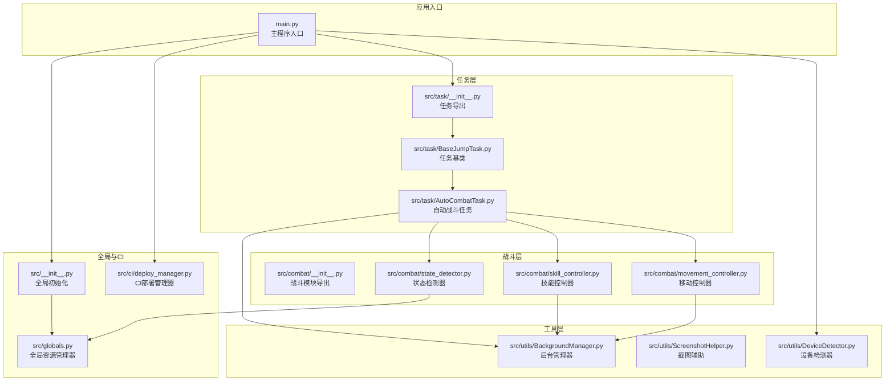
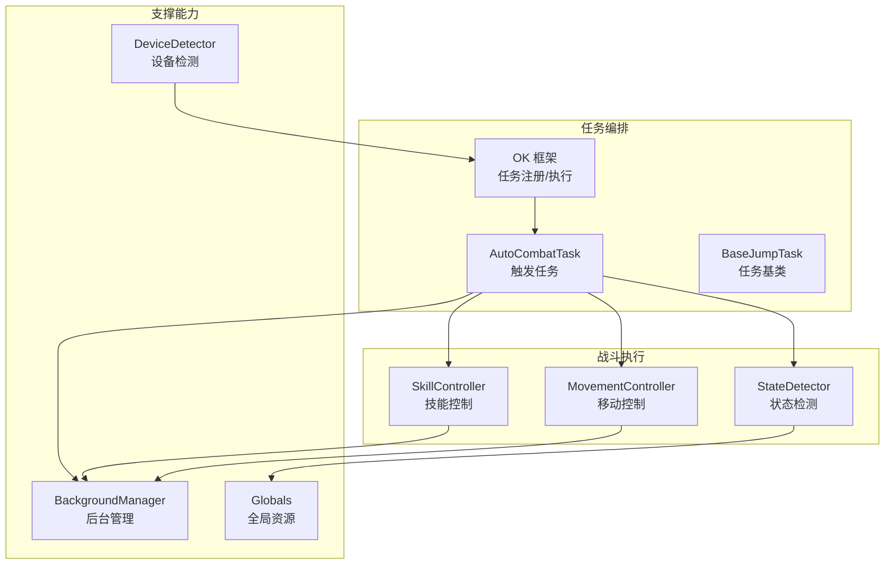
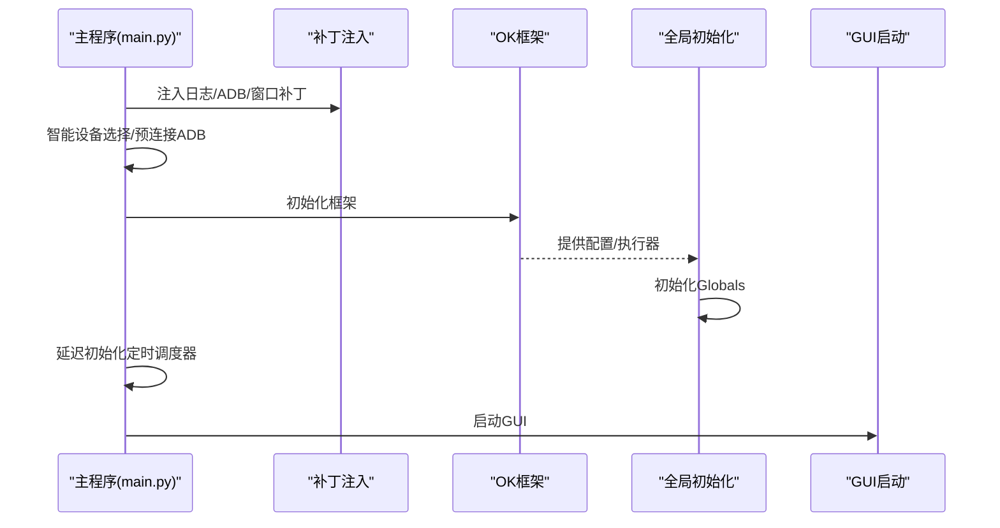
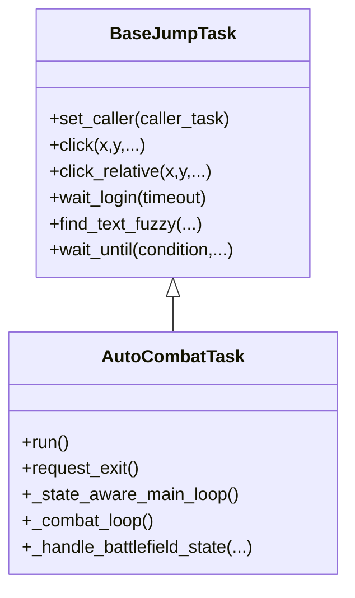
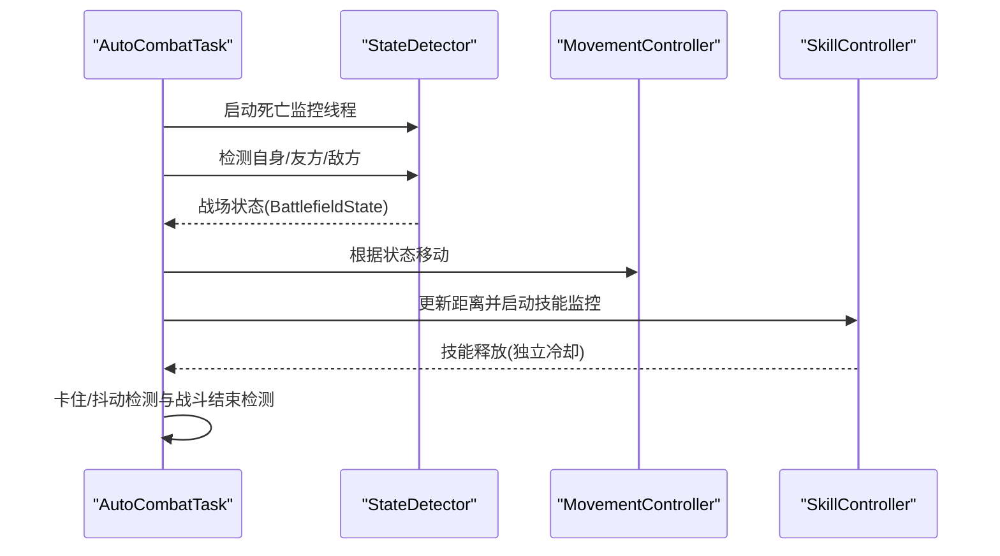
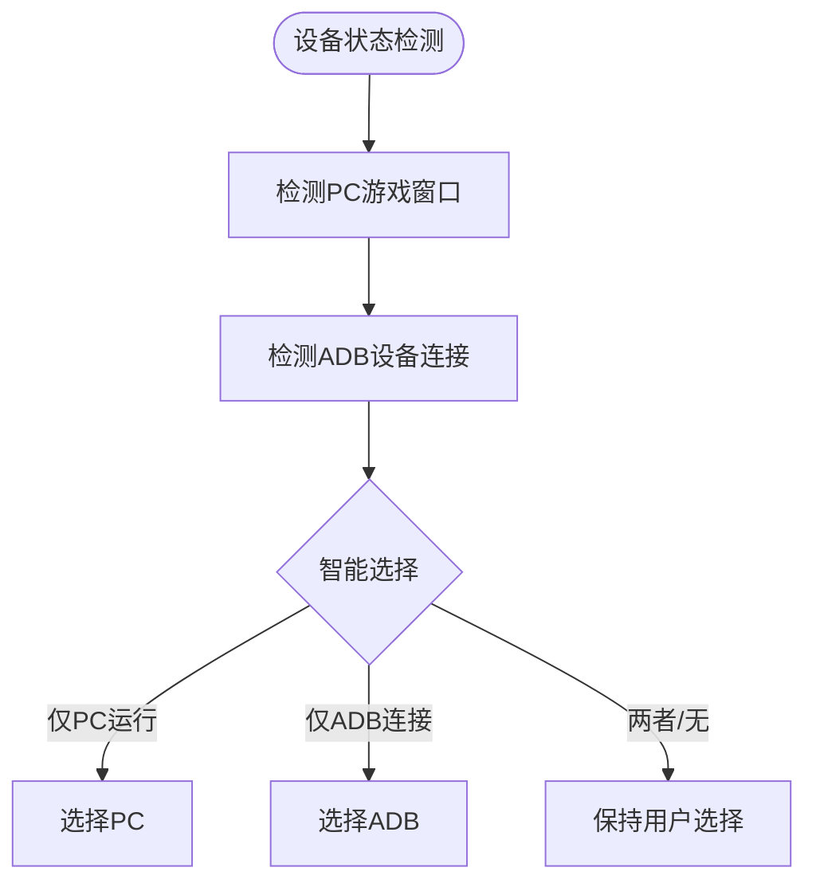
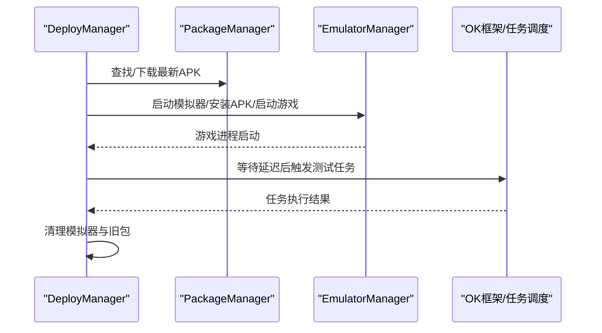
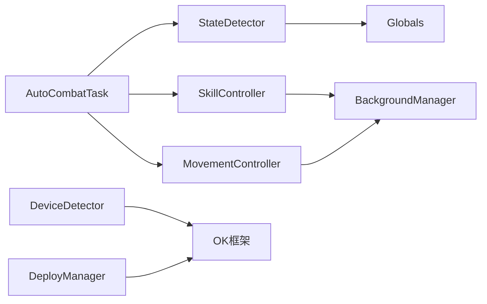

# 组件交互关系

<cite>
**本文档引用的文件**
- [main.py](file://main.py)
- [src/__init__.py](file://src/__init__.py)
- [src/globals.py](file://src/globals.py)
- [src/task/__init__.py](file://src/task/__init__.py)
- [src/combat/__init__.py](file://src/combat/__init__.py)
- [src/task/BaseJumpTask.py](file://src/task/BaseJumpTask.py)
- [src/task/AutoCombatTask.py](file://src/task/AutoCombatTask.py)
- [src/combat/state_detector.py](file://src/combat/state_detector.py)
- [src/combat/skill_controller.py](file://src/combat/skill_controller.py)
- [src/combat/movement_controller.py](file://src/combat/movement_controller.py)
- [src/utils/BackgroundManager.py](file://src/utils/BackgroundManager.py)
- [src/utils/ScreenshotHelper.py](file://src/utils/ScreenshotHelper.py)
- [src/utils/DeviceDetector.py](file://src/utils/DeviceDetector.py)
- [src/ci/deploy_manager.py](file://src/ci/deploy_manager.py)
</cite>

## 目录
1. [简介](#简介)
2. [项目结构](#项目结构)
3. [核心组件](#核心组件)
4. [架构总览](#架构总览)
5. [详细组件分析](#详细组件分析)
6. [依赖关系分析](#依赖关系分析)
7. [性能考量](#性能考量)
8. [故障排查指南](#故障排查指南)
9. [结论](#结论)
10. [附录](#附录)

## 简介
本文件聚焦 ok-jump 项目的组件交互关系，系统性梳理主程序、任务管理器、战斗系统、工具模块等核心组件的职责分工、依赖注入与接口调用方式、事件驱动与观察者模式的实现、组件生命周期与状态同步机制，以及异常处理与错误传播策略。文档旨在为开发者提供组件集成与扩展的参考框架。

## 项目结构
ok-jump 采用模块化分层组织：
- 主程序入口负责框架初始化、补丁注入、定时调度与全局资源初始化
- 任务层提供触发任务与一次性任务的抽象与具体实现
- 战斗层封装状态检测、移动控制、技能控制与距离计算
- 工具层提供后台模式管理、截图辅助、设备检测等通用能力
- CI 层提供打包、模拟器与游戏进程的自动化部署与触发

图表来源
- [main.py:659-693](file://main.py#L659-L693)
- [src/__init__.py:17-32](file://src/__init__.py#L17-L32)
- [src/globals.py:16-406](file://src/globals.py#L16-L406)
- [src/task/__init__.py:1-24](file://src/task/__init__.py#L1-L24)
- [src/task/BaseJumpTask.py:26-572](file://src/task/BaseJumpTask.py#L26-L572)
- [src/task/AutoCombatTask.py:35-800](file://src/task/AutoCombatTask.py#L35-L800)
- [src/combat/__init__.py:1-22](file://src/combat/__init__.py#L1-L22)
- [src/combat/state_detector.py:24-589](file://src/combat/state_detector.py#L24-L589)
- [src/combat/movement_controller.py:24-687](file://src/combat/movement_controller.py#L24-L687)
- [src/combat/skill_controller.py:82-589](file://src/combat/skill_controller.py#L82-L589)
- [src/utils/BackgroundManager.py:7-155](file://src/utils/BackgroundManager.py#L7-L155)
- [src/utils/ScreenshotHelper.py:7-68](file://src/utils/ScreenshotHelper.py#L7-L68)
- [src/utils/DeviceDetector.py:11-149](file://src/utils/DeviceDetector.py#L11-L149)
- [src/ci/deploy_manager.py:38-428](file://src/ci/deploy_manager.py#L38-L428)

章节来源
- [main.py:659-693](file://main.py#L659-L693)
- [src/__init__.py:17-32](file://src/__init__.py#L17-L32)
- [src/globals.py:16-406](file://src/globals.py#L16-L406)
- [src/task/__init__.py:1-24](file://src/task/__init__.py#L1-L24)
- [src/combat/__init__.py:1-22](file://src/combat/__init__.py#L1-L22)

## 核心组件
- 主程序入口（main.py）
  - 负责框架初始化、日志与设备连接补丁、定时任务调度器延迟初始化、全局资源初始化与 GUI 启动
  - 提供任务停止、窗口位置检查、ADB 连接错误抑制、OCR/捕获日志过滤等补丁
- 全局资源管理器（src/globals.py）
  - 单例模式管理登录状态、OCR 缓存、YOLO 模型、CI 状态等全局共享资源
  - 提供 YOLO 模型延迟加载与检测接口
- 任务层（src/task/*）
  - BaseJumpTask：提供通用游戏状态检测、分辨率自适应、后台点击、OCR 文本模糊匹配、等待条件等能力
  - AutoCombatTask：触发式自动战斗任务，协调状态检测、移动与技能控制，支持测试模式与状态感知主循环
- 战斗层（src/combat/*）
  - StateDetector：基于 YOLO 的死亡/自身/友方/敌方检测，战斗状态判定与防抖动
  - MovementController：PC/ADB 模式下的移动控制，支持后台按键与虚拟摇杆
  - SkillController：PC/ADB 模式下的技能释放，独立冷却与监控线程
- 工具层（src/utils/*）
  - BackgroundManager：后台模式检测、伪最小化、静音策略与窗口可见性保障
  - ScreenshotHelper：截图保存与 COCO 标注辅助
  - DeviceDetector：PC/ADB 设备状态检测与智能默认设备选择
- CI 层（src/ci/*）
  - DeployManager：CI 部署流程编排，包含 APK 下载、模拟器启动、APK 安装、游戏启动与任务触发

章节来源
- [main.py:22-693](file://main.py#L22-L693)
- [src/globals.py:16-406](file://src/globals.py#L16-L406)
- [src/task/BaseJumpTask.py:26-572](file://src/task/BaseJumpTask.py#L26-L572)
- [src/task/AutoCombatTask.py:35-800](file://src/task/AutoCombatTask.py#L35-L800)
- [src/combat/state_detector.py:24-589](file://src/combat/state_detector.py#L24-L589)
- [src/combat/movement_controller.py:24-687](file://src/combat/movement_controller.py#L24-L687)
- [src/combat/skill_controller.py:82-589](file://src/combat/skill_controller.py#L82-L589)
- [src/utils/BackgroundManager.py:7-155](file://src/utils/BackgroundManager.py#L7-L155)
- [src/utils/ScreenshotHelper.py:7-68](file://src/utils/ScreenshotHelper.py#L7-L68)
- [src/utils/DeviceDetector.py:11-149](file://src/utils/DeviceDetector.py#L11-L149)
- [src/ci/deploy_manager.py:38-428](file://src/ci/deploy_manager.py#L38-L428)

## 架构总览
ok-jump 采用“任务驱动 + 模块化组件”的架构：
- 任务层通过 OK 框架注册与调度，AutoCombatTask 作为触发任务被其他任务调用
- 战斗层通过 StateDetector 与 YOLO 模型进行状态感知，MovementController 与 SkillController 提供动作执行
- 工具层为战斗层提供后台模式支持与设备状态检测
- 全局资源管理器集中管理共享资源与状态，降低模块间耦合
- CI 层提供自动化部署与任务触发，与主程序的定时调度配合

图表来源
- [src/task/AutoCombatTask.py:35-800](file://src/task/AutoCombatTask.py#L35-L800)
- [src/combat/state_detector.py:24-589](file://src/combat/state_detector.py#L24-L589)
- [src/combat/movement_controller.py:24-687](file://src/combat/movement_controller.py#L24-L687)
- [src/combat/skill_controller.py:82-589](file://src/combat/skill_controller.py#L82-L589)
- [src/utils/BackgroundManager.py:7-155](file://src/utils/BackgroundManager.py#L7-L155)
- [src/globals.py:16-406](file://src/globals.py#L16-L406)
- [src/utils/DeviceDetector.py:11-149](file://src/utils/DeviceDetector.py#L11-L149)

## 详细组件分析

### 主程序与全局初始化
- 主程序负责：
  - 日志处理器补丁与队列清理，避免退出时 I/O 错误
  - ADB 连接错误抑制与 OCR/捕获模块日志过滤
  - StartController 与 TaskButtons 的行为补丁（设备检查、停止逻辑）
  - 智能设备选择（PC/ADB）与预连接 ADB
  - 定时任务调度器（CITestTask）延迟初始化与热更新
  - 全局资源初始化（Globals）与 GUI 启动
- 全局资源管理器（Globals）：
  - 登录状态、OCR 缓存、游戏语言、YOLO 模型（延迟加载）
  - CI 测试状态管理与重置
  - 提供统一的 YOLO 检测接口与模型重置

图表来源
- [main.py:22-693](file://main.py#L22-L693)
- [src/__init__.py:17-32](file://src/__init__.py#L17-L32)
- [src/globals.py:16-406](file://src/globals.py#L16-L406)

章节来源
- [main.py:22-693](file://main.py#L22-L693)
- [src/__init__.py:17-32](file://src/__init__.py#L17-L32)
- [src/globals.py:16-406](file://src/globals.py#L16-L406)

### 任务层：触发任务与基类
- BaseJumpTask：
  - 提供 in_game/in_lobby/in_main 等场景检测
  - 后台模式下的点击与按键适配
  - OCR 文本模糊匹配与等待条件工具
- AutoCombatTask：
  - 触发式运行，支持测试模式与状态感知主循环
  - 并行死亡监控线程，独立战斗线程与状态锁
  - 卡住/抖动检测、敌人最后位置记录、战斗结束检测

图表来源
- [src/task/BaseJumpTask.py:26-572](file://src/task/BaseJumpTask.py#L26-L572)
- [src/task/AutoCombatTask.py:35-800](file://src/task/AutoCombatTask.py#L35-L800)

章节来源
- [src/task/BaseJumpTask.py:26-572](file://src/task/BaseJumpTask.py#L26-L572)
- [src/task/AutoCombatTask.py:35-800](file://src/task/AutoCombatTask.py#L35-L800)

### 战斗层：状态检测、移动与技能控制
- StateDetector：
  - 死亡状态并行监控（后台线程 + 快速查询）
  - 自身/友方/敌方检测与战斗状态判定（防抖动）
  - 状态感知主循环（通过自身检测动态启停战斗）
- MovementController：
  - PC 模式：WASD 键盘 + SendInput/后台按键
  - ADB 模式：虚拟摇杆滑动（全速移动策略）
  - 可中断移动与方向计算
- SkillController：
  - 独立冷却与监控线程，四个技能独立冷却
  - PC/ADB 模式按键与点击适配
  - 技能状态查询与冷却剩余时间

图表来源
- [src/task/AutoCombatTask.py:35-800](file://src/task/AutoCombatTask.py#L35-L800)
- [src/combat/state_detector.py:24-589](file://src/combat/state_detector.py#L24-L589)
- [src/combat/movement_controller.py:24-687](file://src/combat/movement_controller.py#L24-L687)
- [src/combat/skill_controller.py:82-589](file://src/combat/skill_controller.py#L82-L589)

章节来源
- [src/combat/state_detector.py:24-589](file://src/combat/state_detector.py#L24-L589)
- [src/combat/movement_controller.py:24-687](file://src/combat/movement_controller.py#L24-L687)
- [src/combat/skill_controller.py:82-589](file://src/combat/skill_controller.py#L82-L589)

### 工具模块：后台管理与设备检测
- BackgroundManager：
  - 后台模式检测、前台窗口判断、静音策略
  - 伪最小化与可见性保障，自动伪最小化
- DeviceDetector：
  - PC 游戏窗口检测、ADB 设备连接检测
  - 智能默认设备选择（PC/ADB）

图表来源
- [src/utils/DeviceDetector.py:11-149](file://src/utils/DeviceDetector.py#L11-L149)
- [src/utils/BackgroundManager.py:7-155](file://src/utils/BackgroundManager.py#L7-L155)

章节来源
- [src/utils/DeviceDetector.py:11-149](file://src/utils/DeviceDetector.py#L11-L149)
- [src/utils/BackgroundManager.py:7-155](file://src/utils/BackgroundManager.py#L7-L155)

### CI 部署与任务触发
- DeployManager：
  - CI 部署流程：下载 APK → 启动模拟器 → 安装 APK → 启动游戏 → 等待进程 → 触发任务
  - 任务触发超时与游戏进程退出异常处理
  - 清理模拟器与旧包

图表来源
- [src/ci/deploy_manager.py:38-428](file://src/ci/deploy_manager.py#L38-L428)

章节来源
- [src/ci/deploy_manager.py:38-428](file://src/ci/deploy_manager.py#L38-L428)

## 依赖关系分析
- 组件耦合与内聚
  - AutoCombatTask 与战斗层高度内聚，通过 StateDetector/MovementController/SkillController 解耦
  - 工具层（BackgroundManager/DeviceDetector）低耦合，被多个模块复用
  - Globals 作为全局单例，被战斗与任务层间接依赖
- 直接与间接依赖
  - AutoCombatTask 直接依赖战斗层；通过 OK 框架间接依赖任务注册与执行器
  - StateDetector 依赖 Globals 的 YOLO 模型与配置
  - SkillController/MovementController 依赖 BackgroundManager 的后台输入能力
- 外部依赖与集成点
  - adbutils：ADB 设备连接与进程检测
  - OK 框架：任务注册、执行器、GUI 通信
  - PySide6：定时器与文件系统监听（定时任务调度）

图表来源
- [src/task/AutoCombatTask.py:35-800](file://src/task/AutoCombatTask.py#L35-L800)
- [src/combat/state_detector.py:24-589](file://src/combat/state_detector.py#L24-L589)
- [src/combat/movement_controller.py:24-687](file://src/combat/movement_controller.py#L24-L687)
- [src/combat/skill_controller.py:82-589](file://src/combat/skill_controller.py#L82-L589)
- [src/utils/BackgroundManager.py:7-155](file://src/utils/BackgroundManager.py#L7-L155)
- [src/globals.py:16-406](file://src/globals.py#L16-L406)
- [src/utils/DeviceDetector.py:11-149](file://src/utils/DeviceDetector.py#L11-L149)
- [src/ci/deploy_manager.py:38-428](file://src/ci/deploy_manager.py#L38-L428)

章节来源
- [src/task/AutoCombatTask.py:35-800](file://src/task/AutoCombatTask.py#L35-L800)
- [src/combat/state_detector.py:24-589](file://src/combat/state_detector.py#L24-L589)
- [src/combat/movement_controller.py:24-687](file://src/combat/movement_controller.py#L24-L687)
- [src/combat/skill_controller.py:82-589](file://src/combat/skill_controller.py#L82-L589)
- [src/utils/BackgroundManager.py:7-155](file://src/utils/BackgroundManager.py#L7-L155)
- [src/globals.py:16-406](file://src/globals.py#L16-L406)
- [src/utils/DeviceDetector.py:11-149](file://src/utils/DeviceDetector.py#L11-L149)
- [src/ci/deploy_manager.py:38-428](file://src/ci/deploy_manager.py#L38-L428)

## 性能考量
- 检测频率与线程化
  - 死亡状态检测线程以高频（~30ms）轮询，避免主线程阻塞
  - 技能控制与移动控制采用独立线程，降低 CPU 占用
- 缓存与延迟加载
  - OCR 缓存 TTL 控制（默认 1 秒），减少重复 OCR
  - YOLO 模型延迟加载，首次使用时初始化，释放时可重置
- 后台模式优化
  - SendInput/后台按键避免前台切换开销
  - 伪最小化与可见性保障减少截图失败与窗口抖动
- 资源清理
  - 退出时停止技能与移动线程，释放按键，避免资源泄漏

## 故障排查指南
- 日志与错误抑制
  - SafeFileHandler 补丁抑制退出与轮转时的 I/O 错误
  - ADB 连接超时/错误降级为 DEBUG/WARNING，避免噪音
  - OCR 与捕获模块的“负框”与“进程不存在”日志过滤
- 任务停止与状态
  - TaskButtons 停止补丁确保任务禁用且不恢复执行器
  - AutoCombatTask 提供请求退出与战斗线程停止接口
- 设备与窗口问题
  - StartController 设备检查可跳过最小化/出屏窗口（配置项）
  - DeviceDetector 智能设备选择，避免误判
- CI 部署异常
  - DeployManager 提供超时与进程退出异常，便于定位问题阶段

章节来源
- [main.py:22-693](file://main.py#L22-L693)
- [src/task/AutoCombatTask.py:35-800](file://src/task/AutoCombatTask.py#L35-L800)
- [src/utils/DeviceDetector.py:11-149](file://src/utils/DeviceDetector.py#L11-L149)
- [src/ci/deploy_manager.py:38-428](file://src/ci/deploy_manager.py#L38-L428)

## 结论
ok-jump 通过明确的模块划分与松耦合设计，实现了任务驱动与事件感知的自动化系统。主程序负责初始化与调度，任务层提供触发与等待能力，战斗层以状态检测为核心协调移动与技能控制，工具层保障后台运行与设备状态，CI 层完成端到端部署与任务触发。全局资源管理器与补丁机制进一步降低了组件间的耦合度，提升了稳定性与可维护性。

## 附录
- 组件生命周期管理
  - AutoCombatTask：类变量跟踪运行实例与暂停状态，支持重置与强制停止
  - Globals：重置登录/教程/CI 状态与 YOLO 模型释放
  - BackgroundManager：窗口句柄缓存与状态复位
- 状态同步机制
  - AutoCombatTask 使用线程锁保护战斗状态，独立线程更新距离与释放技能
  - StateDetector 使用锁与后台线程同步死亡状态
- 事件驱动与观察者模式
  - OK 框架的任务注册/执行器提供事件驱动的基础
  - AutoCombatTask 的状态感知主循环与死亡监控线程体现事件驱动的异步处理

章节来源
- [src/task/AutoCombatTask.py:35-800](file://src/task/AutoCombatTask.py#L35-L800)
- [src/globals.py:16-406](file://src/globals.py#L16-L406)
- [src/utils/BackgroundManager.py:7-155](file://src/utils/BackgroundManager.py#L7-L155)
- [src/combat/state_detector.py:24-589](file://src/combat/state_detector.py#L24-L589)