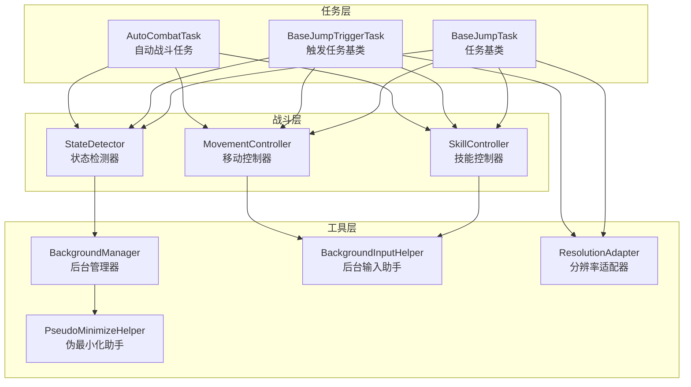
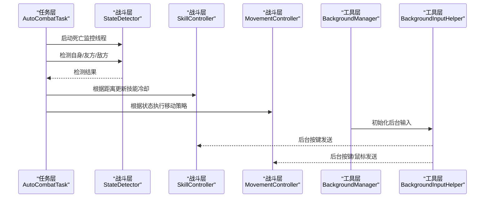
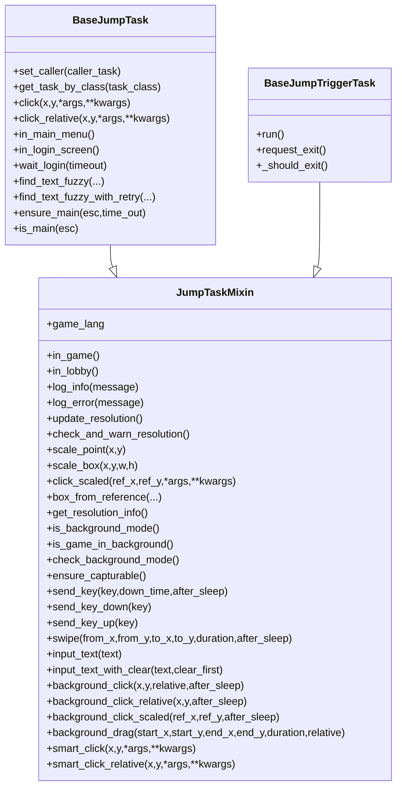
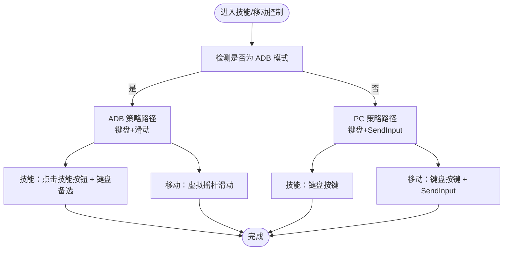
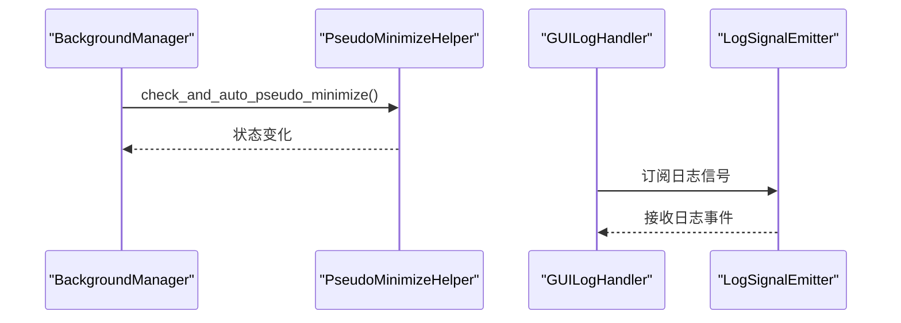
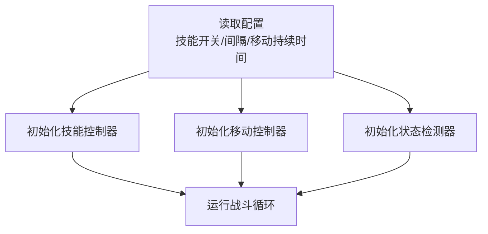
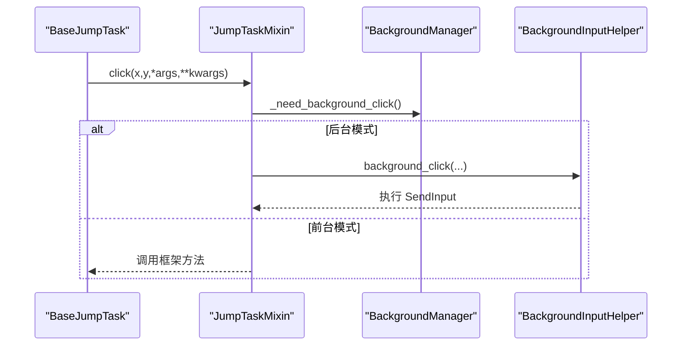
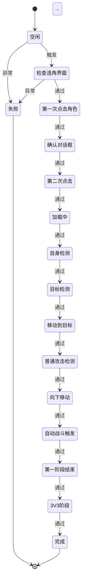
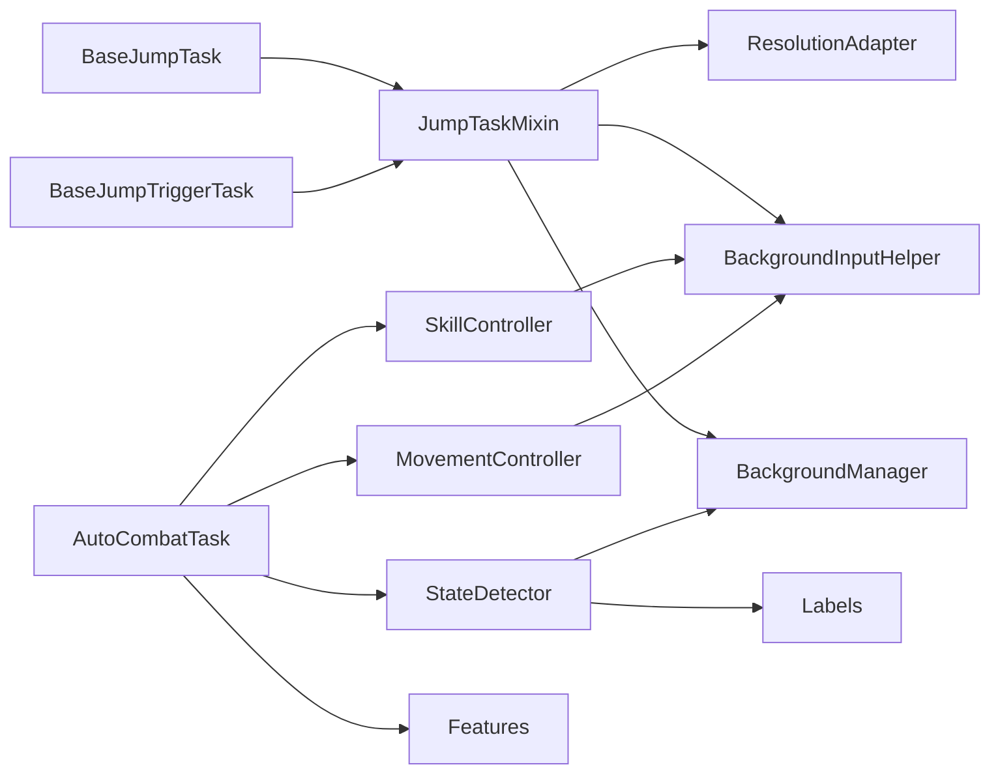

# 设计模式应用

<cite>
**本文档引用的文件**
- [BaseJumpTask.py](file://src/task/BaseJumpTask.py)
- [mixins.py](file://src/task/mixins.py)
- [AutoCombatTask.py](file://src/task/AutoCombatTask.py)
- [BaseJumpTriggerTask.py](file://src/task/BaseJumpTriggerTask.py)
- [skill_controller.py](file://src/combat/skill_controller.py)
- [state_detector.py](file://src/combat/state_detector.py)
- [movement_controller.py](file://src/combat/movement_controller.py)
- [BackgroundManager.py](file://src/utils/BackgroundManager.py)
- [BackgroundInputHelper.py](file://src/utils/BackgroundInputHelper.py)
- [PseudoMinimizeHelper.py](file://src/utils/PseudoMinimizeHelper.py)
- [ResolutionAdapter.py](file://src/utils/ResolutionAdapter.py)
- [features.py](file://src/constants/features.py)
- [labels.py](file://src/combat/labels.py)
- [state_machine.py](file://src/tutorial/state_machine.py)
- [log_panel.py](file://src/gui/log_panel.py)
</cite>

## 目录
1. [简介](#简介)
2. [项目结构](#项目结构)
3. [核心组件](#核心组件)
4. [架构总览](#架构总览)
5. [详细组件分析](#详细组件分析)
6. [依赖关系分析](#依赖关系分析)
7. [性能考虑](#性能考虑)
8. [故障排除指南](#故障排除指南)
9. [结论](#结论)
10. [附录](#附录)

## 简介
本文件系统性梳理 ok-jump 项目中应用的设计模式，重点覆盖策略模式、观察者模式、工厂模式、装饰器模式等，并结合项目实际代码实现，解释每种模式的应用场景、解决的问题、具体实现方式以及如何提升代码的可维护性和可扩展性。同时，文档还分析了模式间的组合使用与协同工作机制，为开发者提供设计模式选择与应用的决策指导。

## 项目结构
ok-jump 采用模块化的分层架构，围绕“任务-战斗-工具”三层组织代码：
- 任务层：负责业务流程编排与状态管理（如 AutoCombatTask、BaseJumpTask、BaseJumpTriggerTask）
- 战斗层：负责战斗状态检测、技能控制、移动控制等（如 StateDetector、SkillController、MovementController）
- 工具层：提供后台模式、分辨率适配、输入模拟等基础设施（如 BackgroundManager、BackgroundInputHelper、ResolutionAdapter）

图表来源
- [BaseJumpTask.py:26-572](file://src/task/BaseJumpTask.py#L26-L572)
- [BaseJumpTriggerTask.py:13-29](file://src/task/BaseJumpTriggerTask.py#L13-L29)
- [AutoCombatTask.py:35-800](file://src/task/AutoCombatTask.py#L35-L800)
- [state_detector.py:24-589](file://src/combat/state_detector.py#L24-L589)
- [skill_controller.py:82-589](file://src/combat/skill_controller.py#L82-L589)
- [movement_controller.py:24-687](file://src/combat/movement_controller.py#L24-L687)
- [BackgroundManager.py:7-155](file://src/utils/BackgroundManager.py#L7-L155)
- [BackgroundInputHelper.py:99-841](file://src/utils/BackgroundInputHelper.py#L99-L841)
- [PseudoMinimizeHelper.py:13-238](file://src/utils/PseudoMinimizeHelper.py#L13-L238)
- [ResolutionAdapter.py:4-163](file://src/utils/ResolutionAdapter.py#L4-L163)

章节来源
- [BaseJumpTask.py:26-572](file://src/task/BaseJumpTask.py#L26-L572)
- [mixins.py:15-784](file://src/task/mixins.py#L15-L784)
- [AutoCombatTask.py:35-800](file://src/task/AutoCombatTask.py#L35-L800)

## 核心组件
本节聚焦于项目中体现设计模式的核心组件与其实现要点。

- 任务混入（Mixin）模式：通过 JumpTaskMixin 为 BaseJumpTask 与 BaseJumpTriggerTask 提供通用能力，消除重复代码，提升可复用性。
- 策略模式：在技能控制与移动控制中，通过不同模式（PC/ADB）选择不同的策略实现，实现运行时策略切换。
- 观察者模式：后台管理器与伪最小化助手之间通过状态变化进行解耦，日志处理器通过信号机制将日志事件发布到 GUI。
- 工厂模式：通过配置驱动的技能冷却器与控制器初始化，实现“配置即策略”的工厂式装配。
- 装饰器模式：在任务点击与按键操作中，通过智能适配装饰器（后台/前台）增强原有行为。

章节来源
- [mixins.py:15-784](file://src/task/mixins.py#L15-L784)
- [skill_controller.py:82-589](file://src/combat/skill_controller.py#L82-L589)
- [movement_controller.py:24-687](file://src/combat/movement_controller.py#L24-L687)
- [BackgroundManager.py:7-155](file://src/utils/BackgroundManager.py#L7-L155)
- [BackgroundInputHelper.py:99-841](file://src/utils/BackgroundInputHelper.py#L99-L841)
- [log_panel.py:29-55](file://src/gui/log_panel.py#L29-L55)

## 架构总览
ok-jump 的整体架构围绕“任务编排 + 智能策略 + 基础设施”展开。任务层负责业务流程与状态管理；战斗层通过 YOLO 检测与控制器实现智能战斗；工具层提供跨平台、跨模式的输入与窗口管理能力。

图表来源
- [AutoCombatTask.py:265-289](file://src/task/AutoCombatTask.py#L265-L289)
- [state_detector.py:83-122](file://src/combat/state_detector.py#L83-L122)
- [skill_controller.py:226-252](file://src/combat/skill_controller.py#L226-L252)
- [movement_controller.py:156-165](file://src/combat/movement_controller.py#L156-L165)
- [BackgroundManager.py:18-23](file://src/utils/BackgroundManager.py#L18-L23)
- [BackgroundInputHelper.py:310-356](file://src/utils/BackgroundInputHelper.py#L310-L356)

## 详细组件分析

### 任务混入（Mixin）模式：JumpTaskMixin
- 应用场景：BaseJumpTask 与 BaseJumpTriggerTask 需要共享大量通用功能（分辨率适配、后台模式、点击/按键封装等），避免重复实现。
- 实现要点：
  - 将通用方法集中到 JumpTaskMixin，通过多重继承引入。
  - 提供统一的分辨率适配、后台模式检测、点击/按键智能适配等方法。
- 设计收益：
  - 提升代码复用性，降低重复代码。
  - 通过混入模式实现“横切关注点”的模块化。

图表来源
- [BaseJumpTask.py:26-572](file://src/task/BaseJumpTask.py#L26-L572)
- [BaseJumpTriggerTask.py:13-29](file://src/task/BaseJumpTriggerTask.py#L13-L29)
- [mixins.py:15-784](file://src/task/mixins.py#L15-L784)

章节来源
- [mixins.py:15-784](file://src/task/mixins.py#L15-L784)
- [BaseJumpTask.py:26-572](file://src/task/BaseJumpTask.py#L26-L572)
- [BaseJumpTriggerTask.py:13-29](file://src/task/BaseJumpTriggerTask.py#L13-L29)

### 策略模式：技能控制与移动控制
- 应用场景：PC 端与手机端（ADB）在输入方式、移动策略上差异较大，需要在运行时选择合适的策略。
- 实现要点：
  - 技能控制：根据 is_adb() 判断模式，分别使用键盘按键或点击技能按钮。
  - 移动控制：根据 is_adb() 判断模式，PC 端使用 WASD 键盘，ADB 端使用虚拟摇杆滑动。
  - 后台输入：统一通过 BackgroundInputHelper 发送输入，支持 SendInput 与前台模式回退。
- 设计收益：
  - 将“策略选择”与“策略执行”解耦，便于扩展新平台或新策略。

图表来源
- [skill_controller.py:150-171](file://src/combat/skill_controller.py#L150-L171)
- [skill_controller.py:463-507](file://src/combat/skill_controller.py#L463-L507)
- [movement_controller.py:72-74](file://src/combat/movement_controller.py#L72-L74)
- [movement_controller.py:561-610](file://src/combat/movement_controller.py#L561-L610)
- [BackgroundInputHelper.py:310-356](file://src/utils/BackgroundInputHelper.py#L310-L356)

章节来源
- [skill_controller.py:82-589](file://src/combat/skill_controller.py#L82-L589)
- [movement_controller.py:24-687](file://src/combat/movement_controller.py#L24-L687)
- [BackgroundInputHelper.py:99-841](file://src/utils/BackgroundInputHelper.py#L99-L841)

### 观察者模式：后台管理与日志显示
- 应用场景：后台模式状态变化、窗口焦点变化需要通知相关组件；GUI 需要实时接收日志事件。
- 实现要点：
  - 后台管理器：通过 BackgroundManager 管理后台模式、伪最小化状态，提供状态查询与自动处理。
  - 日志系统：GUILogHandler 通过信号发射器 LogSignalEmitter 将日志事件发布到 GUI。
- 设计收益：
  - 解耦状态变更与订阅者，提升系统的可观测性与可维护性。

图表来源
- [BackgroundManager.py:101-121](file://src/utils/BackgroundManager.py#L101-L121)
- [PseudoMinimizeHelper.py:123-163](file://src/utils/PseudoMinimizeHelper.py#L123-L163)
- [log_panel.py:29-55](file://src/gui/log_panel.py#L29-L55)

章节来源
- [BackgroundManager.py:7-155](file://src/utils/BackgroundManager.py#L7-L155)
- [PseudoMinimizeHelper.py:13-238](file://src/utils/PseudoMinimizeHelper.py#L13-L238)
- [log_panel.py:29-55](file://src/gui/log_panel.py#L29-L55)

### 工厂模式：配置驱动的控制器初始化
- 应用场景：AutoCombatTask 需要根据配置动态初始化技能控制器、移动控制器、状态检测器等。
- 实现要点：
  - 通过配置项（如技能开关、间隔、移动持续时间）驱动控制器的初始化与行为。
  - 技能冷却器按配置设置冷却间隔，移动控制器按配置设置移动持续时间。
- 设计收益：
  - 将“配置即策略”的思想落地，降低硬编码，提升可配置性与可扩展性。

图表来源
- [AutoCombatTask.py:265-289](file://src/task/AutoCombatTask.py#L265-L289)
- [skill_controller.py:356-370](file://src/combat/skill_controller.py#L356-L370)
- [movement_controller.py:62-69](file://src/combat/movement_controller.py#L62-L69)

章节来源
- [AutoCombatTask.py:143-289](file://src/task/AutoCombatTask.py#L143-L289)
- [skill_controller.py:356-370](file://src/combat/skill_controller.py#L356-L370)
- [movement_controller.py:62-69](file://src/combat/movement_controller.py#L62-L69)

### 装饰器模式：智能点击与按键封装
- 应用场景：在任务层对点击与按键进行智能封装，自动适配后台/前台模式，减少重复逻辑。
- 实现要点：
  - BaseJumpTask.click/click_relative 智能判断是否需要后台点击，委托给 BackgroundInputHelper。
  - JumpTaskMixin.send_key/send_key_down/send_key_up 智能选择 SendInput 或前台输入。
- 设计收益：
  - 将“装饰”逻辑集中在一处，提升调用端透明性与易用性。

图表来源
- [BaseJumpTask.py:140-156](file://src/task/BaseJumpTask.py#L140-L156)
- [mixins.py:383-398](file://src/task/mixins.py#L383-L398)
- [mixins.py:666-696](file://src/task/mixins.py#L666-L696)
- [BackgroundManager.py:46-75](file://src/utils/BackgroundManager.py#L46-L75)
- [BackgroundInputHelper.py:630-708](file://src/utils/BackgroundInputHelper.py#L630-L708)

章节来源
- [BaseJumpTask.py:123-156](file://src/task/BaseJumpTask.py#L123-L156)
- [mixins.py:383-398](file://src/task/mixins.py#L383-L398)
- [mixins.py:666-696](file://src/task/mixins.py#L666-L696)

### 状态机模式：新手教程状态管理
- 应用场景：新手教程需要严格的流程控制与状态转换，避免状态错乱。
- 实现要点：
  - TutorialStateMachine 定义状态转换映射，提供 can_transition_to/transition_to/fail/reset 等方法。
  - 通过状态历史记录与失败原因，便于调试与回溯。
- 设计收益：
  - 将复杂流程建模为状态机，提升可读性与可控性。

图表来源
- [state_machine.py:56-172](file://src/tutorial/state_machine.py#L56-L172)

章节来源
- [state_machine.py:56-172](file://src/tutorial/state_machine.py#L56-L172)

## 依赖关系分析
- 任务层依赖工具层：BaseJumpTask/BaseJumpTriggerTask 依赖 JumpTaskMixin，后者依赖 BackgroundManager、BackgroundInputHelper、ResolutionAdapter 等。
- 战斗层依赖工具层：StateDetector/SkillController/MovementController 依赖 BackgroundManager/BackgroundInputHelper。
- 配置与特征：AutoCombatTask 依赖 features.py 中的特征常量；战斗标签依赖 labels.py。

图表来源
- [BaseJumpTask.py:6-10](file://src/task/BaseJumpTask.py#L6-L10)
- [mixins.py:7-12](file://src/task/mixins.py#L7-L12)
- [AutoCombatTask.py:23-32](file://src/task/AutoCombatTask.py#L23-L32)
- [state_detector.py:11-14](file://src/combat/state_detector.py#L11-L14)
- [features.py:9-100](file://src/constants/features.py#L9-L100)
- [labels.py:8-51](file://src/combat/labels.py#L8-L51)

章节来源
- [BaseJumpTask.py:6-10](file://src/task/BaseJumpTask.py#L6-L10)
- [mixins.py:7-12](file://src/task/mixins.py#L7-L12)
- [AutoCombatTask.py:23-32](file://src/task/AutoCombatTask.py#L23-L32)
- [state_detector.py:11-14](file://src/combat/state_detector.py#L11-L14)
- [features.py:9-100](file://src/constants/features.py#L9-L100)
- [labels.py:8-51](file://src/combat/labels.py#L8-L51)

## 性能考虑
- 线程化监控：StateDetector 的死亡监控与 AutoCombatTask 的战斗线程分离，避免阻塞主线程。
- 状态感知循环：AutoCombatTask 的状态感知主循环采用较短检测间隔，兼顾响应速度与 CPU 占用。
- 缓存与去抖：后台模式状态、ADB 模式检测、分辨率信息等均有缓存与去抖机制，减少重复计算与误判。
- 输入优化：后台输入统一走 SendInput，避免窗口激活带来的开销与闪烁。

## 故障排除指南
- 后台模式失效：检查 BackgroundManager.update_config() 与 is_game_in_background()，确认后台模式配置与窗口状态。
- 伪最小化失败：查看 PseudoMinimizeHelper 的状态与窗口矩形，确认窗口是否被最小化或在前台。
- 输入无效：确认 BackgroundInputHelper 的模式选择（前台/伪最小化/自动），必要时切换到 SendInput 路径。
- 日志不显示：检查 GUILogHandler 是否正确连接到 LogSignalEmitter，确认信号发射与接收链路。

章节来源
- [BackgroundManager.py:18-92](file://src/utils/BackgroundManager.py#L18-L92)
- [PseudoMinimizeHelper.py:123-163](file://src/utils/PseudoMinimizeHelper.py#L123-L163)
- [BackgroundInputHelper.py:177-207](file://src/utils/BackgroundInputHelper.py#L177-L207)
- [log_panel.py:29-55](file://src/gui/log_panel.py#L29-L55)

## 结论
ok-jump 项目通过多种设计模式的有机组合，实现了“可配置、可扩展、可维护”的自动化战斗系统：
- Mixin 模式提升了代码复用与模块化；
- 策略模式使平台差异与运行时选择清晰可控；
- 观察者模式增强了系统的可观测性；
- 工厂模式将配置转化为策略，降低了硬编码；
- 装饰器模式简化了调用端的复杂性。

这些模式的协同工作使得项目在面对多平台、多分辨率、多交互模式时仍能保持良好的可维护性与可扩展性。

## 附录
- 设计模式选择建议：
  - 需要横切关注点时优先考虑 Mixin；
  - 需要运行时策略切换时优先考虑策略模式；
  - 需要事件驱动与解耦时优先考虑观察者模式；
  - 需要配置即策略时优先考虑工厂模式；
  - 需要透明增强行为时优先考虑装饰器模式。
- 模式组合实践：
  - 任务层 + 策略模式（PC/ADB）+ 装饰器模式（智能输入）+ 观察者模式（后台状态）构成完整的自动化体系。