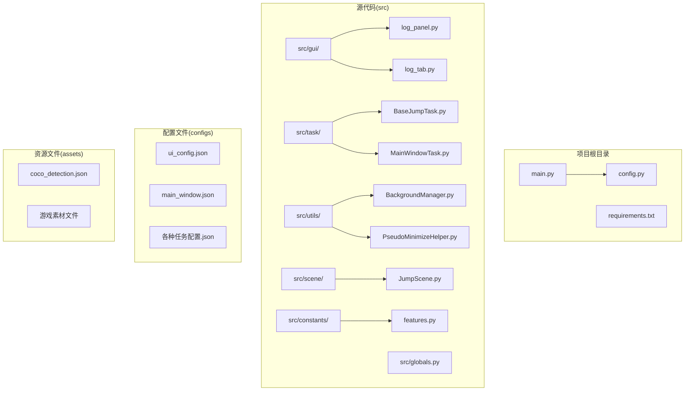
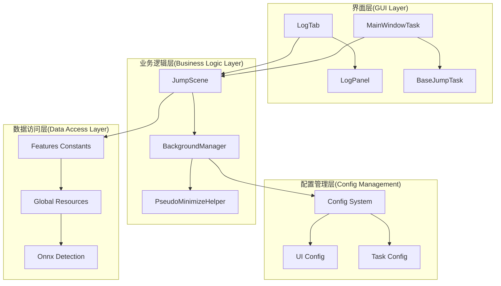
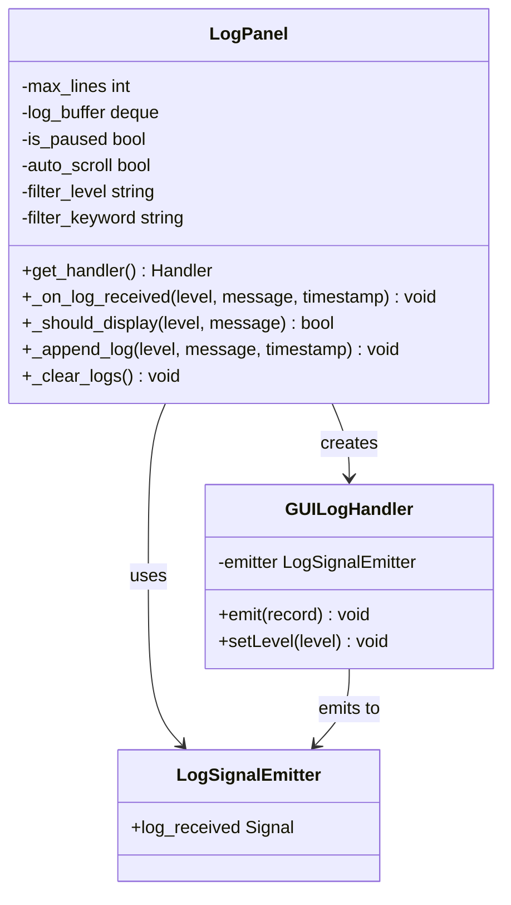
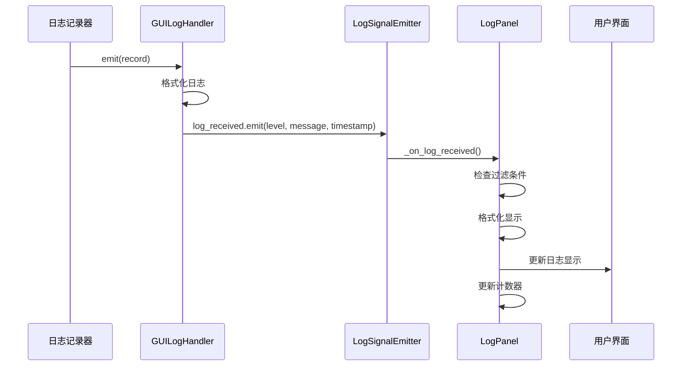
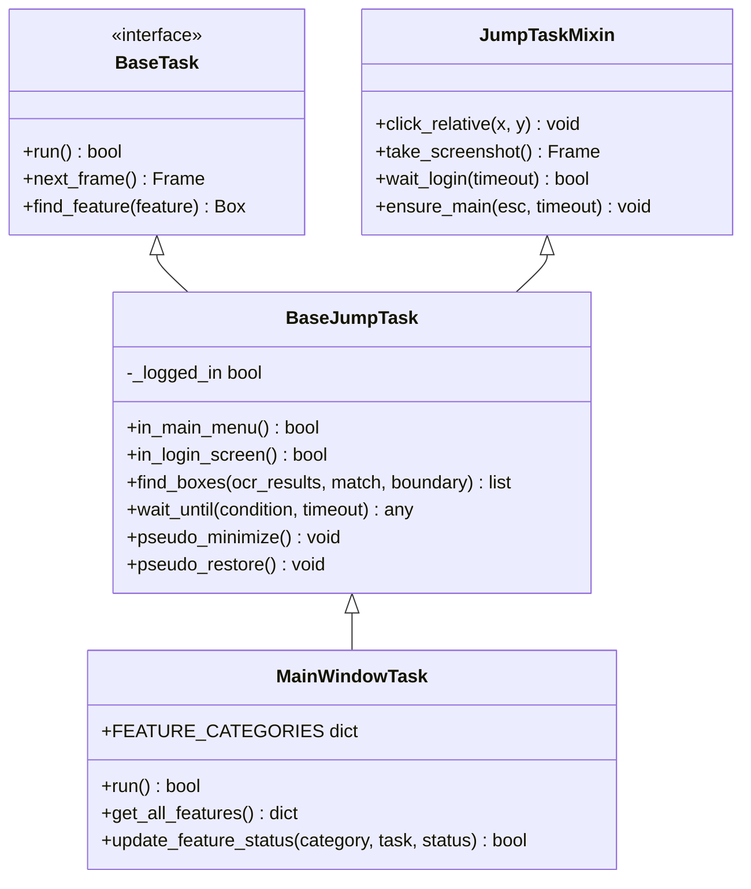
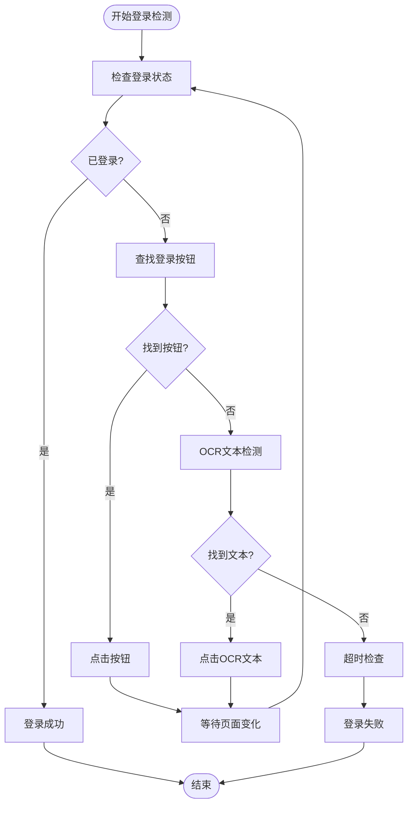
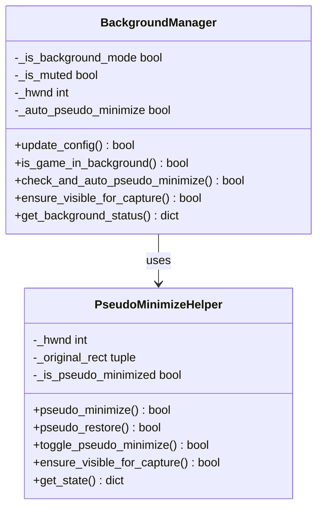
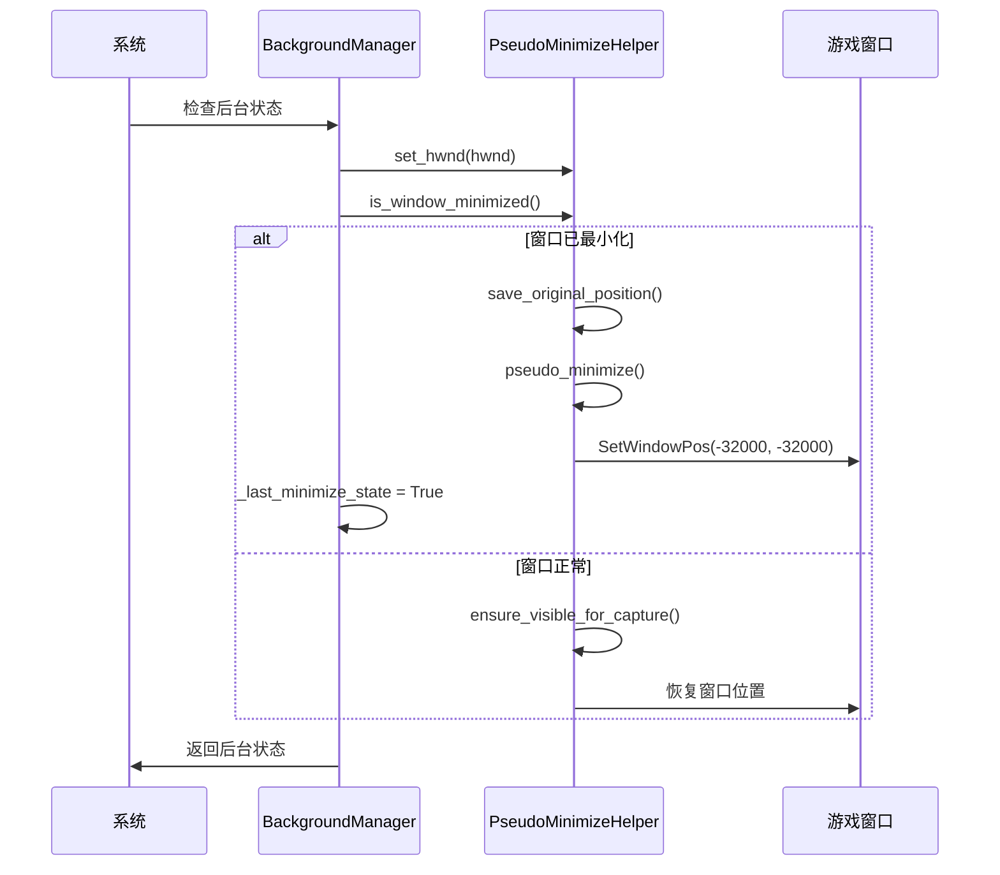
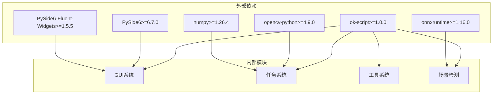

# GUI界面系统

<cite>
**本文档引用的文件**
- [main.py](file://main.py)
- [config.py](file://config.py)
- [src/gui/__init__.py](file://src/gui/__init__.py)
- [src/gui/log_panel.py](file://src/gui/log_panel.py)
- [src/gui/log_tab.py](file://src/gui/log_tab.py)
- [src/tas/BaseJumpTask.py](file://src/task/BaseJumpTask.py)
- [src/task/MainWindowTask.py](file://src/task/MainWindowTask.py)
- [src/utils/BackgroundManager.py](file://src/utils/BackgroundManager.py)
- [src/utils/PseudoMinimizeHelper.py](file://src/utils/PseudoMinimizeHelper.py)
- [src/constants/features.py](file://src/constants/features.py)
- [src/globals.py](file://src/globals.py)
- [src/scene/JumpScene.py](file://src/scene/JumpScene.py)
- [requirements.txt](file://requirements.txt)
- [configs/ui_config.json](file://configs/ui_config.json)
- [configs/main_window.json](file://configs/main_window.json)
</cite>

## 目录
1. [简介](#简介)
2. [项目结构](#项目结构)
3. [核心组件](#核心组件)
4. [架构概览](#架构概览)
5. [详细组件分析](#详细组件分析)
6. [依赖关系分析](#依赖关系分析)
7. [性能考虑](#性能考虑)
8. [故障排除指南](#故障排除指南)
9. [结论](#结论)

## 简介

漫画群星：大集结自动化工具是一个基于ok-script框架开发的GUI界面系统，主要用于游戏自动化操作。该系统提供了完整的图形用户界面，包括实时日志监控、任务管理和游戏状态检测等功能。

系统采用模块化设计，主要包含以下核心功能：
- 实时日志监控面板
- 游戏窗口检测和截图
- 分辨率自适应
- 后台模式支持
- 伪最小化功能
- 场景检测和状态管理

## 项目结构

该项目采用清晰的分层架构，主要目录结构如下：

**图表来源**
- [main.py:1-33](file://main.py#L1-L33)
- [config.py:65-145](file://config.py#L65-L145)

**章节来源**
- [main.py:1-33](file://main.py#L1-L33)
- [config.py:1-145](file://config.py#L1-L145)

## 核心组件

### GUI日志系统

GUI日志系统是整个界面的核心组件，提供了实时日志监控功能。该系统包含三个主要组件：

1. **LogPanel**: 主要的日志显示面板
2. **GUILogHandler**: 日志处理器，负责捕获和格式化日志
3. **LogTab**: GUI标签页包装器

### 任务管理系统

系统实现了基于ok-script框架的任务管理机制，主要包括：

1. **BaseJumpTask**: 任务基类，提供通用的游戏状态检测和操作功能
2. **MainWindowTask**: 主窗口任务，展示功能开发索引和系统状态
3. **JumpScene**: 场景检测器，管理游戏场景状态转换

### 后台支持系统

为了实现游戏的后台运行，系统提供了完整的后台支持机制：

1. **BackgroundManager**: 后台管理器，处理窗口状态检测和音频控制
2. **PseudoMinimizeHelper**: 伪最小化助手，实现窗口的"伪最小化"效果

**章节来源**
- [src/gui/log_panel.py:58-388](file://src/gui/log_panel.py#L58-L388)
- [src/task/BaseJumpTask.py:10-295](file://src/task/BaseJumpTask.py#L10-L295)
- [src/utils/BackgroundManager.py:7-145](file://src/utils/BackgroundManager.py#L7-L145)

## 架构概览

系统采用分层架构设计，各层之间职责明确，耦合度低：

**图表来源**
- [src/gui/log_tab.py:15-70](file://src/gui/log_tab.py#L15-L70)
- [src/task/MainWindowTask.py:5-215](file://src/task/MainWindowTask.py#L5-L215)
- [src/scene/JumpScene.py:8-216](file://src/scene/JumpScene.py#L8-L216)

## 详细组件分析

### LogPanel组件分析

LogPanel是GUI日志系统的核心组件，提供了完整的日志监控功能：

**图表来源**
- [src/gui/log_panel.py:29-114](file://src/gui/log_panel.py#L29-L114)
- [src/gui/log_panel.py:58-352](file://src/gui/log_panel.py#L58-L352)

#### 日志处理流程

**图表来源**
- [src/gui/log_panel.py:49-271](file://src/gui/log_panel.py#L49-L271)

**章节来源**
- [src/gui/log_panel.py:58-388](file://src/gui/log_panel.py#L58-L388)

### 任务管理系统分析

BaseJumpTask作为所有任务的基类，提供了丰富的游戏状态检测和操作功能：

**图表来源**
- [src/task/BaseJumpTask.py:10-295](file://src/task/BaseJumpTask.py#L10-L295)
- [src/task/MainWindowTask.py:5-215](file://src/task/MainWindowTask.py#L5-L215)

#### 登录流程处理

**图表来源**
- [src/task/BaseJumpTask.py:81-153](file://src/task/BaseJumpTask.py#L81-L153)

**章节来源**
- [src/task/BaseJumpTask.py:10-295](file://src/task/BaseJumpTask.py#L10-L295)
- [src/task/MainWindowTask.py:55-215](file://src/task/MainWindowTask.py#L55-L215)

### 后台支持系统分析

后台支持系统是实现游戏后台运行的关键组件：

**图表来源**
- [src/utils/BackgroundManager.py:7-145](file://src/utils/BackgroundManager.py#L7-L145)
- [src/utils/PseudoMinimizeHelper.py:13-193](file://src/utils/PseudoMinimizeHelper.py#L13-L193)

#### 伪最小化工作流程

**图表来源**
- [src/utils/BackgroundManager.py:91-118](file://src/utils/BackgroundManager.py#L91-L118)
- [src/utils/PseudoMinimizeHelper.py:78-114](file://src/utils/PseudoMinimizeHelper.py#L78-L114)

**章节来源**
- [src/utils/BackgroundManager.py:7-145](file://src/utils/BackgroundManager.py#L7-L145)
- [src/utils/PseudoMinimizeHelper.py:13-193](file://src/utils/PseudoMinimizeHelper.py#L13-L193)

## 依赖关系分析

系统使用ok-script框架作为核心，依赖关系如下：

**图表来源**
- [requirements.txt:1-13](file://requirements.txt#L1-L13)

**章节来源**
- [requirements.txt:1-13](file://requirements.txt#L1-L13)

## 性能考虑

### 日志系统性能优化

1. **缓冲区管理**: LogPanel使用deque作为环形缓冲区，限制最大行数以控制内存使用
2. **线程安全**: 通过信号槽机制实现线程间通信，避免UI阻塞
3. **增量更新**: 日志面板只更新变化的部分，减少UI重绘开销

### 后台模式优化

1. **状态缓存**: BackgroundManager缓存前台窗口状态，减少频繁的系统调用
2. **智能检测**: 使用定时器控制检测频率，避免过度占用CPU
3. **懒加载**: 资源按需加载，减少启动时间和内存占用

### 场景检测优化

1. **特征缓存**: 使用特征常量类统一管理特征名称，避免字符串错误
2. **分辨率适配**: 自动检测和适配不同分辨率，提高检测准确性
3. **状态机设计**: 使用有限状态机管理游戏场景转换，提高响应速度

## 故障排除指南

### 常见问题及解决方案

#### 日志不显示问题
- **症状**: 日志面板空白或不更新
- **原因**: 日志处理器未正确注册
- **解决**: 检查`setup_log_panel_handler()`函数是否正确调用

#### 后台模式失效
- **症状**: 游戏窗口最小化后无法继续运行
- **原因**: 伪最小化功能未正确配置
- **解决**: 检查`最小化时伪最小化`选项是否启用

#### 分辨率检测错误
- **症状**: 场景检测失败或坐标不准确
- **原因**: 分辨率不匹配
- **解决**: 调整游戏分辨率为推荐的16:9比例

#### 窗口检测失败
- **症状**: 系统无法识别游戏窗口
- **原因**: 窗口标题或类名不匹配
- **解决**: 检查配置中的窗口标题关键词

**章节来源**
- [src/gui/log_panel.py:366-388](file://src/gui/log_panel.py#L366-L388)
- [src/utils/BackgroundManager.py:18-31](file://src/utils/BackgroundManager.py#L18-L31)
- [src/scene/JumpScene.py:198-216](file://src/scene/JumpScene.py#L198-L216)

## 结论

漫画群星：大集结自动化工具的GUI界面系统展现了良好的架构设计和实现质量。系统的主要特点包括：

1. **模块化设计**: 清晰的分层架构，各组件职责明确
2. **功能完整性**: 提供了从日志监控到游戏自动化的完整解决方案
3. **用户体验**: 基于PySide6和Fluent Widgets的现代化界面设计
4. **性能优化**: 采用多种技术优化系统性能和响应速度
5. **扩展性**: 基于ok-script框架，易于添加新功能和任务

该系统为游戏自动化提供了一个稳定、可靠的GUI平台，具有良好的维护性和扩展性。通过合理的架构设计和性能优化，能够满足复杂游戏自动化场景的需求。