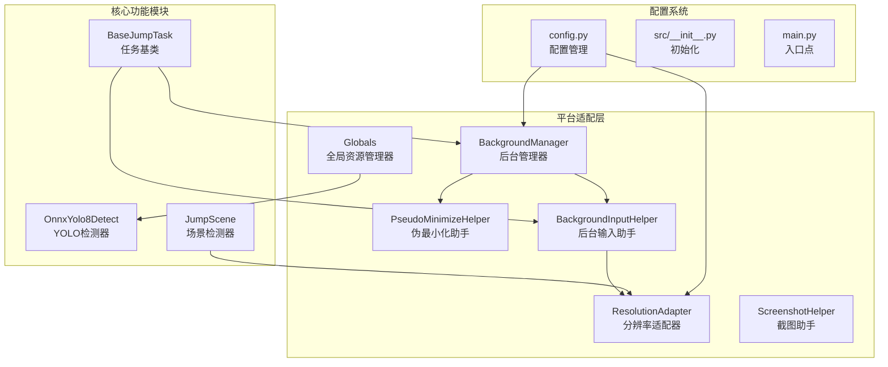
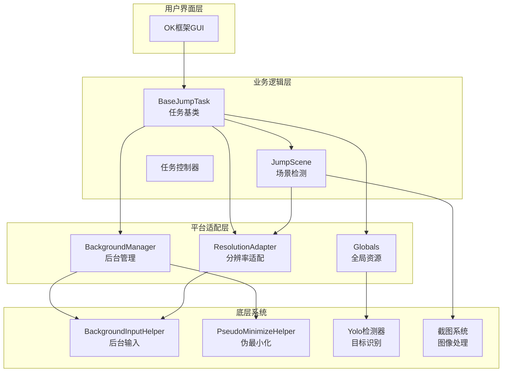
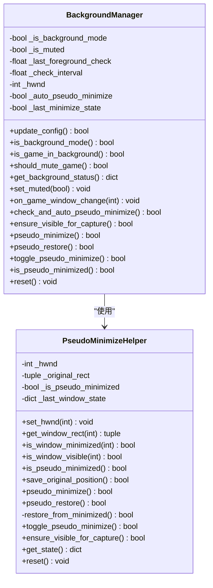
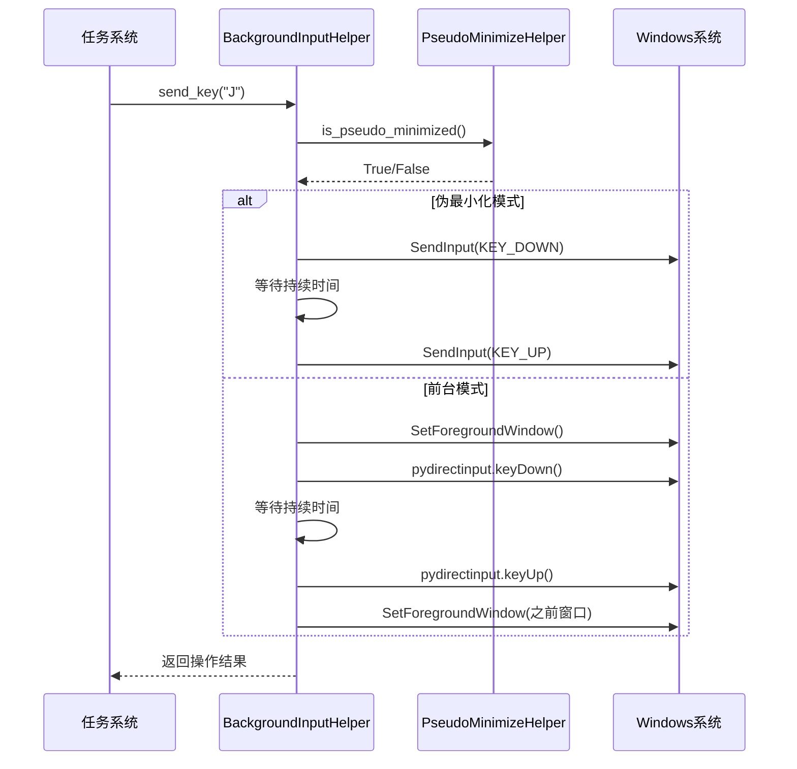
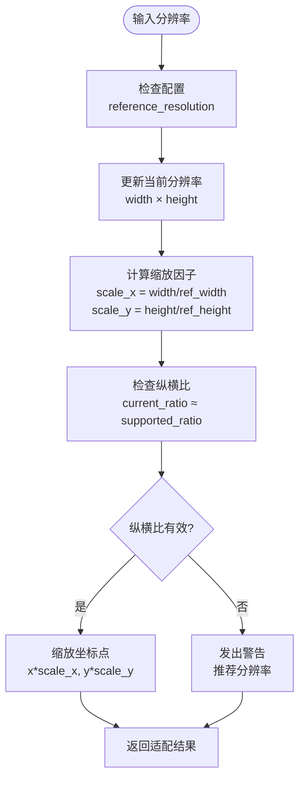
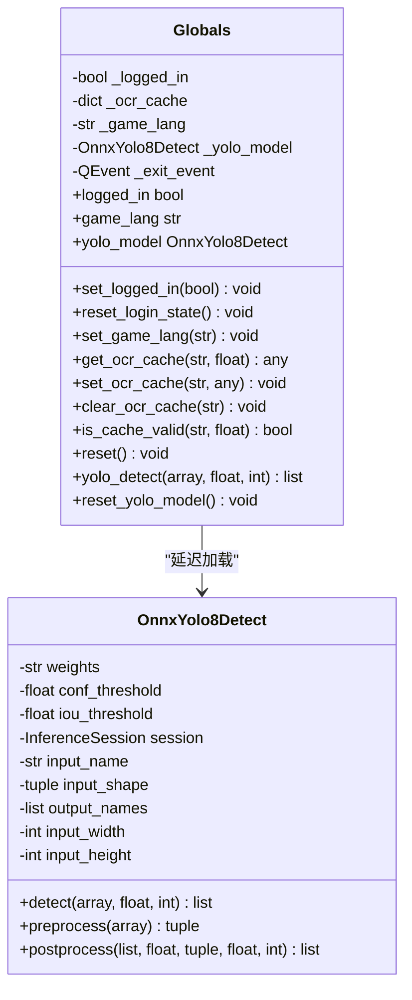
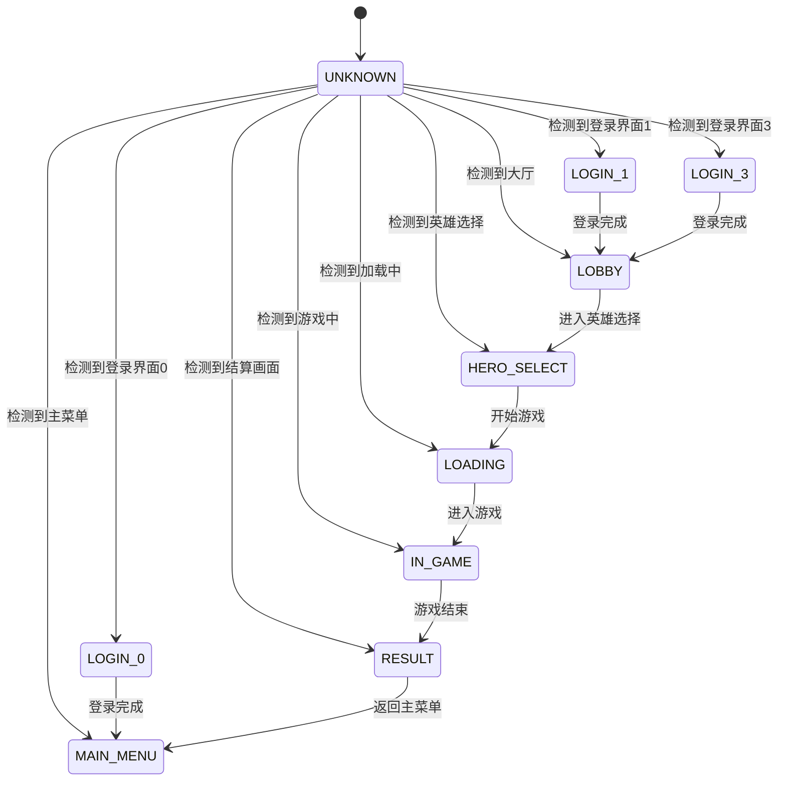
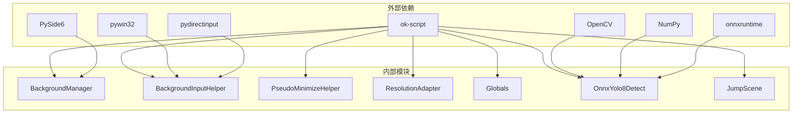

# 平台适配层

<cite>
**本文档引用的文件**
- [main.py](file://main.py)
- [config.py](file://config.py)
- [src/__init__.py](file://src/__init__.py)
- [src/globals.py](file://src/globals.py)
- [src/utils/BackgroundManager.py](file://src/utils/BackgroundManager.py)
- [src/utils/PseudoMinimizeHelper.py](file://src/utils/PseudoMinimizeHelper.py)
- [src/utils/BackgroundInputHelper.py](file://src/utils/BackgroundInputHelper.py)
- [src/utils/ResolutionAdapter.py](file://src/utils/ResolutionAdapter.py)
- [src/utils/ScreenshotHelper.py](file://src/utils/ScreenshotHelper.py)
- [src/OnnxYolo8Detect.py](file://src/OnnxYolo8Detect.py)
- [src/scene/JumpScene.py](file://src/scene/JumpScene.py)
- [src/task/BaseJumpTask.py](file://src/task/BaseJumpTask.py)
- [requirements.txt](file://requirements.txt)
</cite>

## 目录
1. [简介](#简介)
2. [项目结构](#项目结构)
3. [核心组件](#核心组件)
4. [架构概览](#架构概览)
5. [详细组件分析](#详细组件分析)
6. [依赖关系分析](#依赖关系分析)
7. [性能考虑](#性能考虑)
8. [故障排除指南](#故障排除指南)
9. [结论](#结论)

## 简介

平台适配层是漫画群星自动化工具的核心基础设施，负责处理不同平台和环境下的兼容性问题。该层主要解决以下关键挑战：

- **多平台支持**：Windows桌面应用和Android设备的统一适配
- **后台模式**：Unity游戏的后台输入和窗口管理
- **分辨率适配**：不同屏幕分辨率和纵横比的自动适配
- **输入系统**：可靠的键盘输入和鼠标操作支持
- **资源管理**：全局状态和共享资源的统一管理

## 项目结构

**图表来源**
- [config.py:65-144](file://config.py#L65-144)
- [src/utils/BackgroundManager.py:1-145](file://src/utils/BackgroundManager.py#L1-145)
- [src/utils/ResolutionAdapter.py:1-163](file://src/utils/ResolutionAdapter.py#L1-163)

**章节来源**
- [config.py:1-145](file://config.py#L1-145)
- [src/__init__.py:1-32](file://src/__init__.py#L1-32)

## 核心组件

平台适配层包含以下核心组件：

### 1. 后台管理系统
- **BackgroundManager**：统一管理后台模式、静音状态和窗口伪最小化
- **PseudoMinimizeHelper**：实现窗口伪最小化和恢复功能
- **BackgroundInputHelper**：提供可靠的后台键盘输入支持

### 2. 平台适配器
- **ResolutionAdapter**：处理分辨率和纵横比适配
- **ScreenshotHelper**：管理截图和特征模板存储

### 3. 全局资源管理
- **Globals**：集中管理登录状态、OCR缓存和YOLO模型

**章节来源**
- [src/utils/BackgroundManager.py:1-145](file://src/utils/BackgroundManager.py#L1-145)
- [src/utils/PseudoMinimizeHelper.py:1-193](file://src/utils/PseudoMinimizeHelper.py#L1-193)
- [src/utils/BackgroundInputHelper.py:1-452](file://src/utils/BackgroundInputHelper.py#L1-452)
- [src/utils/ResolutionAdapter.py:1-163](file://src/utils/ResolutionAdapter.py#L1-163)
- [src/utils/ScreenshotHelper.py:1-68](file://src/utils/ScreenshotHelper.py#L1-68)
- [src/globals.py:1-227](file://src/globals.py#L1-227)

## 架构概览

**图表来源**
- [src/task/BaseJumpTask.py:10-295](file://src/task/BaseJumpTask.py#L10-295)
- [src/scene/JumpScene.py:1-216](file://src/scene/JumpScene.py#L1-216)
- [src/utils/BackgroundManager.py:1-145](file://src/utils/BackgroundManager.py#L1-145)
- [src/utils/ResolutionAdapter.py:1-163](file://src/utils/ResolutionAdapter.py#L1-163)
- [src/globals.py:16-227](file://src/globals.py#L16-227)

## 详细组件分析

### 后台管理器 (BackgroundManager)

后台管理器是平台适配层的核心组件，负责处理Unity游戏的后台运行需求。

**图表来源**
- [src/utils/BackgroundManager.py:7-145](file://src/utils/BackgroundManager.py#L7-145)
- [src/utils/PseudoMinimizeHelper.py:13-193](file://src/utils/PseudoMinimizeHelper.py#L13-193)

#### 关键特性

1. **智能后台检测**：自动检测游戏窗口是否在后台运行
2. **自动静音管理**：根据配置自动静音后台游戏
3. **伪最小化支持**：实现窗口移出屏幕但保持活动状态
4. **窗口状态跟踪**：维护窗口的最小化和可见性状态

**章节来源**
- [src/utils/BackgroundManager.py:1-145](file://src/utils/BackgroundManager.py#L1-145)
- [src/utils/PseudoMinimizeHelper.py:1-193](file://src/utils/PseudoMinimizeHelper.py#L1-193)

### 后台输入助手 (BackgroundInputHelper)

专门为Unity游戏设计的后台输入解决方案，解决了DirectInput和Raw Input的兼容性问题。

**图表来源**
- [src/utils/BackgroundInputHelper.py:253-315](file://src/utils/BackgroundInputHelper.py#L253-315)
- [src/utils/BackgroundInputHelper.py:360-448](file://src/utils/BackgroundInputHelper.py#L360-448)

#### 输入模式

1. **伪最小化模式**：窗口移出屏幕外但仍保持活动状态
2. **前台模式**：短暂激活游戏窗口进行输入
3. **自动模式**：根据当前状态自动选择最佳模式

**章节来源**
- [src/utils/BackgroundInputHelper.py:1-452](file://src/utils/BackgroundInputHelper.py#L1-452)

### 分辨率适配器 (ResolutionAdapter)

处理不同屏幕分辨率和纵横比的适配问题，确保UI元素和游戏元素的正确缩放。

**图表来源**
- [src/utils/ResolutionAdapter.py:34-100](file://src/utils/ResolutionAdapter.py#L34-100)

#### 支持的分辨率

- **参考分辨率**：1920×1080 (16:9)
- **支持的纵横比**：16:9 ± 0.01
- **推荐调整**：2560×1440 → 1920×1080 → 1600×900 → 1280×720

**章节来源**
- [src/utils/ResolutionAdapter.py:1-163](file://src/utils/ResolutionAdapter.py#L1-163)

### 全局资源管理器 (Globals)

集中管理应用程序的全局状态和共享资源，采用单例模式确保资源的一致性。

**图表来源**
- [src/globals.py:16-227](file://src/globals.py#L16-227)
- [src/OnnxYolo8Detect.py:17-254](file://src/OnnxYolo8Detect.py#L17-254)

#### 资源管理策略

1. **延迟加载**：YOLO模型仅在首次使用时加载
2. **缓存机制**：OCR结果缓存1秒，避免重复计算
3. **内存管理**：提供显式重置接口释放资源

**章节来源**
- [src/globals.py:1-227](file://src/globals.py#L1-227)
- [src/OnnxYolo8Detect.py:1-311](file://src/OnnxYolo8Detect.py#L1-311)

### 场景检测器 (JumpScene)

基于图像特征的场景识别系统，支持多种游戏状态的自动检测。

**图表来源**
- [src/scene/JumpScene.py:8-71](file://src/scene/JumpScene.py#L8-71)

#### 场景检测流程

1. **分辨率更新**：实时检测并更新当前分辨率
2. **特征匹配**：使用模板匹配识别UI元素
3. **状态转换**：根据检测结果更新游戏状态
4. **历史记录**：维护最近10个场景状态的历史

**章节来源**
- [src/scene/JumpScene.py:1-216](file://src/scene/JumpScene.py#L1-216)

## 依赖关系分析

**图表来源**
- [requirements.txt:1-13](file://requirements.txt#L1-13)
- [config.py:78-144](file://config.py#L78-144)

### 核心依赖关系

1. **OK框架集成**：所有组件都依赖ok-script框架提供的基础功能
2. **Windows系统API**：通过pywin32和ctypes直接调用Windows API
3. **机器学习推理**：使用onnxruntime进行YOLO目标检测
4. **图形处理**：OpenCV和NumPy用于图像处理和计算机视觉

**章节来源**
- [requirements.txt:1-13](file://requirements.txt#L1-13)
- [config.py:1-145](file://config.py#L1-145)

## 性能考虑

### 内存优化策略

1. **YOLO模型延迟加载**：仅在首次检测时加载模型，减少启动时间
2. **OCR缓存机制**：1秒缓存避免重复OCR计算
3. **窗口状态缓存**：后台状态检查结果缓存1秒
4. **资源重置接口**：提供显式资源释放方法

### 性能监控指标

- **检测延迟**：平均检测时间应小于100ms
- **内存使用**：YOLO模型占用约500MB内存
- **CPU使用率**：后台模式下应低于10%
- **GPU使用率**：启用CUDA时可显著提升检测速度

### 优化建议

1. **批量处理**：对连续的相似操作进行批处理
2. **异步处理**：将耗时操作移至后台线程
3. **缓存策略**：合理设置缓存失效时间
4. **资源池**：复用连接和会话对象

## 故障排除指南

### 常见问题及解决方案

#### 1. 后台输入失效

**症状**：游戏无法接收键盘输入
**原因**：
- 游戏使用反作弊机制
- 窗口焦点问题
- 权限不足

**解决方案**：
- 确保以管理员权限运行
- 检查游戏是否在后台模式
- 验证窗口句柄获取是否成功

#### 2. 分辨率适配问题

**症状**：UI元素位置错误或点击无效
**原因**：
- 分辨率不支持
- 纵横比不匹配
- 缩放因子计算错误

**解决方案**：
- 调整到推荐分辨率
- 检查config.py中的supported_resolution配置
- 验证分辨率检测逻辑

#### 3. YOLO检测失败

**症状**：目标识别不准确或完全失败
**原因**：
- ONNX模型文件缺失
- CUDA驱动问题
- 内存不足

**解决方案**：
- 确认fight.onnx文件存在
- 检查CUDA安装情况
- 降低检测阈值或分辨率

**章节来源**
- [src/utils/BackgroundInputHelper.py:1-452](file://src/utils/BackgroundInputHelper.py#L1-452)
- [src/utils/ResolutionAdapter.py:1-163](file://src/utils/ResolutionAdapter.py#L1-163)
- [src/globals.py:172-227](file://src/globals.py#L172-227)

## 结论

平台适配层通过精心设计的架构和实现，成功解决了漫画群星游戏在不同平台和环境下的兼容性问题。其核心优势包括：

1. **全面的平台支持**：覆盖Windows桌面和Android设备
2. **可靠的后台运行**：专门针对Unity游戏优化
3. **智能的资源管理**：高效的内存和性能管理
4. **灵活的扩展性**：模块化设计便于功能扩展

该适配层为上层业务逻辑提供了稳定的基础，使得自动化功能能够可靠地运行在各种环境下。通过持续的优化和改进，该系统将继续为用户提供更好的自动化体验。