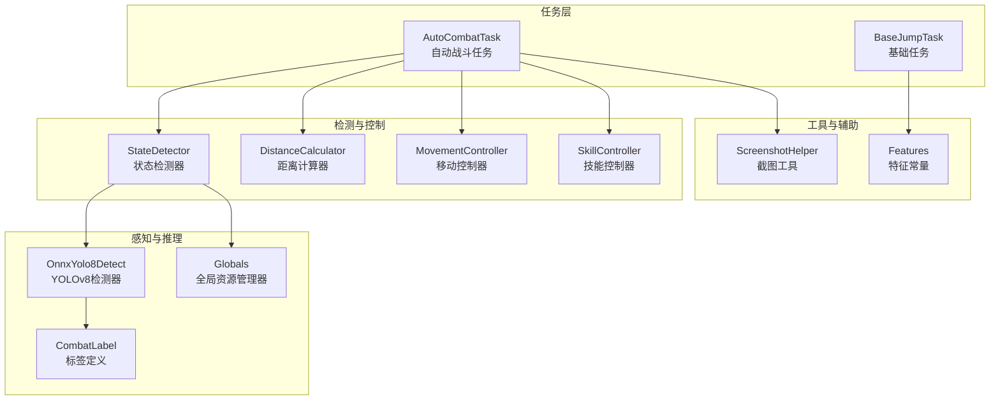
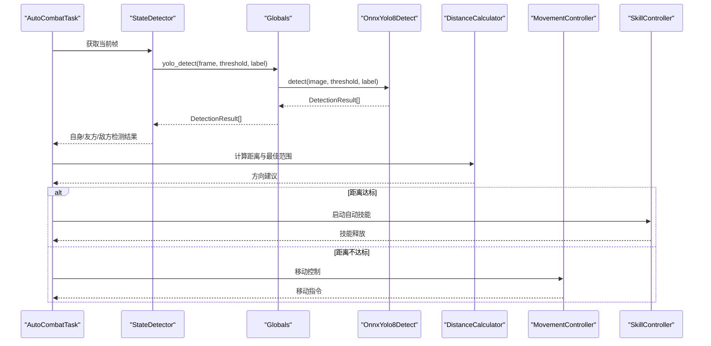
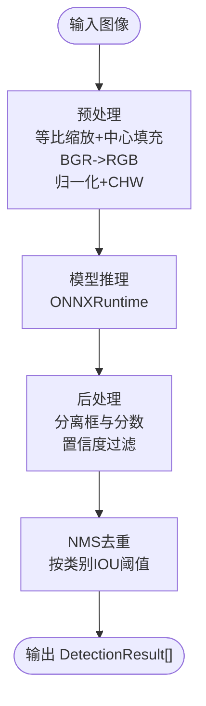
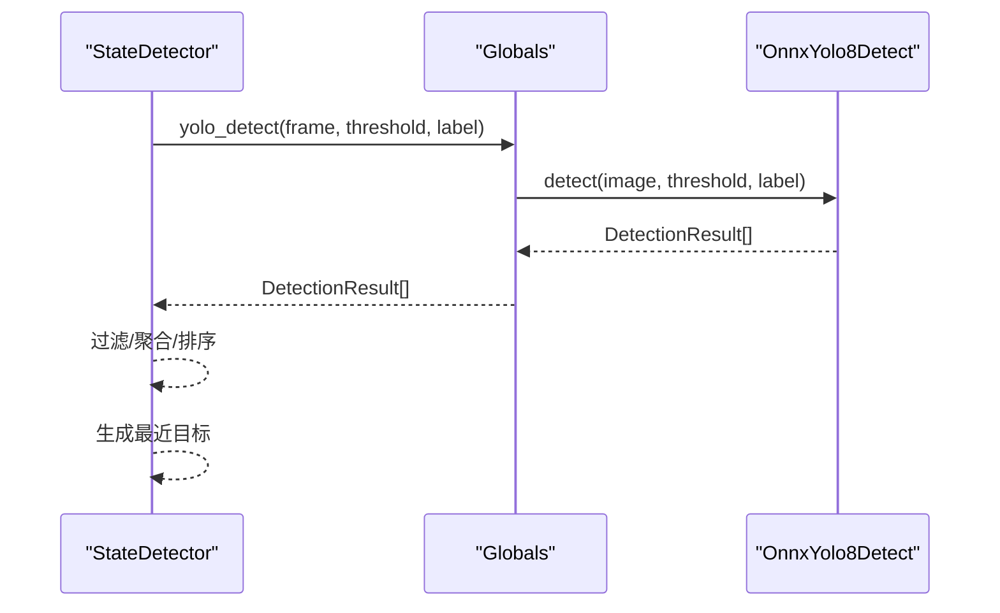
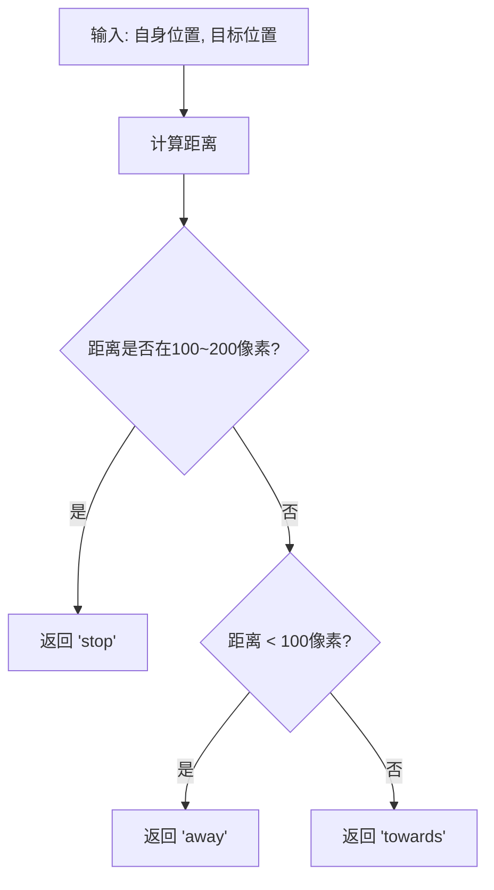
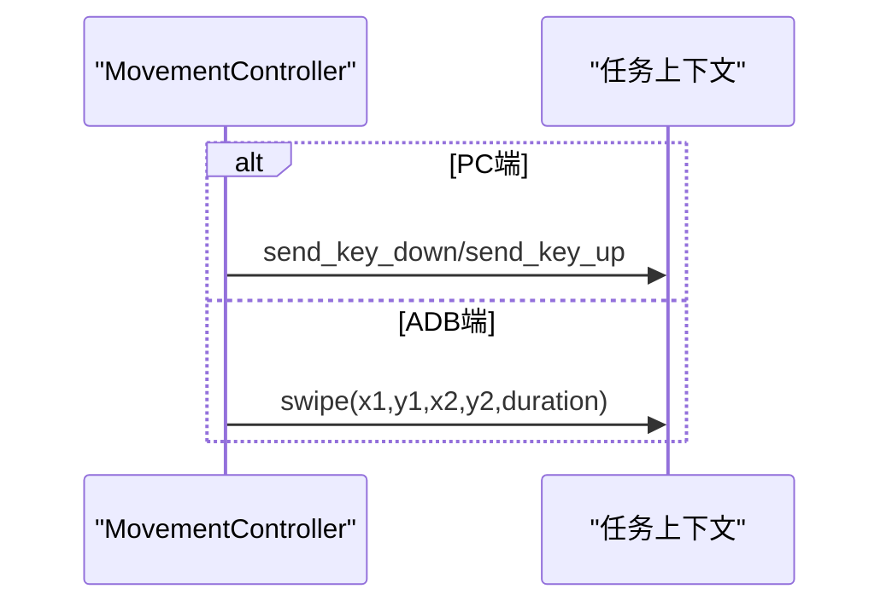
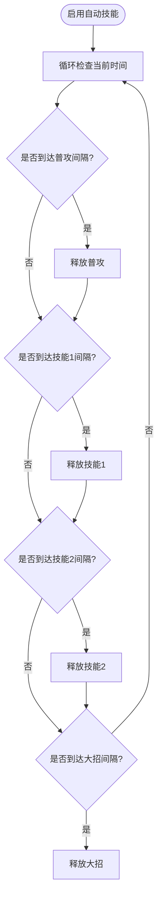
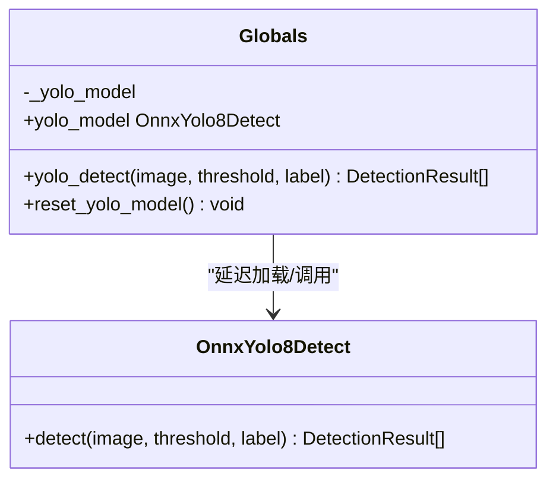
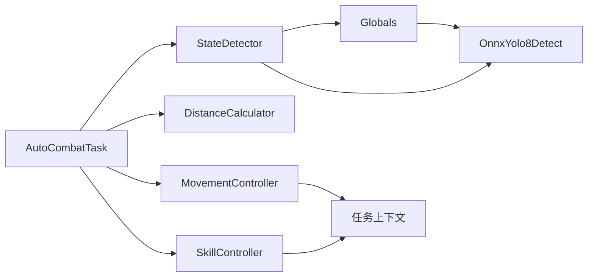

# 数据流设计

<cite>
**本文档引用的文件**
- [OnnxYolo8Detect.py](file://src/OnnxYolo8Detect.py)
- [state_detector.py](file://src/combat/state_detector.py)
- [movement_controller.py](file://src/combat/movement_controller.py)
- [skill_controller.py](file://src/combat/skill_controller.py)
- [distance_calculator.py](file://src/combat/distance_calculator.py)
- [labels.py](file://src/combat/labels.py)
- [globals.py](file://src/globals.py)
- [ScreenshotHelper.py](file://src/utils/ScreenshotHelper.py)
- [BaseJumpTask.py](file://src/task/BaseJumpTask.py)
- [AutoCombatTask.py](file://src/task/AutoCombatTask.py)
- [features.py](file://src/constants/features.py)
- [main.py](file://main.py)
</cite>

## 目录
1. [简介](#简介)
2. [项目结构](#项目结构)
3. [核心组件](#核心组件)
4. [架构总览](#架构总览)
5. [详细组件分析](#详细组件分析)
6. [依赖关系分析](#依赖关系分析)
7. [性能考量](#性能考量)
8. [故障排查指南](#故障排查指南)
9. [结论](#结论)

## 简介
本文件面向OK-Jump项目的开发者，系统性阐述从游戏画面捕获到最终控制输出的完整数据流。重点覆盖以下环节：
- 图像数据的预处理与归一化
- YOLOv8 ONNX模型推理与后处理（含NMS）
- 检测结果解析与过滤
- 战场状态判断与控制决策
- 移动与技能控制的执行链路
- 数据结构定义、中间结果格式与错误处理机制

通过数据流图与关键节点说明，帮助读者快速理解数据在系统中的流转过程与转换规则。

## 项目结构
OK-Jump采用模块化分层组织，核心数据流由任务层驱动，通过状态检测器、YOLO检测器、距离计算器、移动与技能控制器协同完成闭环控制。

图表来源
- [AutoCombatTask.py:25-120](file://src/task/AutoCombatTask.py#L25-L120)
- [state_detector.py:23-60](file://src/combat/state_detector.py#L23-L60)
- [OnnxYolo8Detect.py:17-63](file://src/OnnxYolo8Detect.py#L17-L63)
- [globals.py:16-60](file://src/globals.py#L16-L60)
- [labels.py:8-37](file://src/combat/labels.py#L8-L37)
- [distance_calculator.py:10-34](file://src/combat/distance_calculator.py#L10-L34)
- [movement_controller.py:11-40](file://src/combat/movement_controller.py#L11-L40)
- [skill_controller.py:12-48](file://src/combat/skill_controller.py#L12-L48)
- [ScreenshotHelper.py:7-30](file://src/utils/ScreenshotHelper.py#L7-L30)
- [features.py:9-86](file://src/constants/features.py#L9-L86)

章节来源
- [AutoCombatTask.py:25-120](file://src/task/AutoCombatTask.py#L25-L120)
- [BaseJumpTask.py:10-42](file://src/task/BaseJumpTask.py#L10-L42)

## 核心组件
- YOLOv8检测器：负责图像预处理、模型推理与后处理（含NMS），输出DetectionResult列表。
- 状态检测器：封装YOLO检测调用，提供死亡状态、自身、友方、敌方的检测方法，并汇总战场状态。
- 距离计算器：计算单位间距离、判断最佳攻击范围与移动方向。
- 移动控制器：根据目标位置与平台（PC/ADB）生成移动指令（键盘或虚拟摇杆）。
- 技能控制器：基于配置周期性释放技能，支持PC键盘与手机点击两种模式。
- 全局资源管理器：延迟加载YOLO模型，提供统一的yolo_detect接口与缓存策略。
- 截图工具：保存截图与特征模板，辅助调试与标注。
- 任务框架：提供截图、场景检测、登录等待、伪最小化等通用能力。

章节来源
- [OnnxYolo8Detect.py:17-63](file://src/OnnxYolo8Detect.py#L17-L63)
- [state_detector.py:23-60](file://src/combat/state_detector.py#L23-L60)
- [distance_calculator.py:10-34](file://src/combat/distance_calculator.py#L10-L34)
- [movement_controller.py:11-40](file://src/combat/movement_controller.py#L11-L40)
- [skill_controller.py:12-48](file://src/combat/skill_controller.py#L12-L48)
- [globals.py:16-60](file://src/globals.py#L16-L60)
- [ScreenshotHelper.py:7-30](file://src/utils/ScreenshotHelper.py#L7-L30)
- [BaseJumpTask.py:10-42](file://src/task/BaseJumpTask.py#L10-L42)

## 架构总览
整体数据流遵循“采集-推理-解析-决策-执行”的闭环：
- 采集：任务层获取当前帧（frame）。
- 推理：状态检测器调用全局YOLO检测接口，返回DetectionResult列表。
- 解析：解析自身、友方、敌方位置，计算距离与最近目标。
- 决策：根据战场状态与距离范围决定移动与技能策略。
- 执行：移动控制器与技能控制器下发控制指令。

图表来源
- [AutoCombatTask.py:165-243](file://src/task/AutoCombatTask.py#L165-L243)
- [state_detector.py:89-103](file://src/combat/state_detector.py#L89-L103)
- [globals.py:200-222](file://src/globals.py#L200-L222)
- [OnnxYolo8Detect.py:230-254](file://src/OnnxYolo8Detect.py#L230-L254)
- [distance_calculator.py:35-104](file://src/combat/distance_calculator.py#L35-L104)
- [movement_controller.py:45-103](file://src/combat/movement_controller.py#L45-L103)
- [skill_controller.py:53-102](file://src/combat/skill_controller.py#L53-L102)

## 详细组件分析

### YOLOv8检测器（OnnxYolo8Detect）
- 输入：BGR图像（numpy数组）
- 预处理：等比缩放、中心填充、BGR->RGB、归一化、HWC->CHW、添加batch维
- 推理：ONNXRuntime会话运行，支持CPU/GPU执行提供者
- 后处理：解析输出为(框, 置信度, 类别)，按置信度过滤，按类别NMS去重
- 输出：DetectionResult列表（包含x,y,width,height,confidence,class_id）

图表来源
- [OnnxYolo8Detect.py:64-104](file://src/OnnxYolo8Detect.py#L64-L104)
- [OnnxYolo8Detect.py:106-182](file://src/OnnxYolo8Detect.py#L106-L182)
- [OnnxYolo8Detect.py:230-254](file://src/OnnxYolo8Detect.py#L230-L254)

章节来源
- [OnnxYolo8Detect.py:17-63](file://src/OnnxYolo8Detect.py#L17-L63)
- [OnnxYolo8Detect.py:64-104](file://src/OnnxYolo8Detect.py#L64-L104)
- [OnnxYolo8Detect.py:106-182](file://src/OnnxYolo8Detect.py#L106-L182)
- [OnnxYolo8Detect.py:184-228](file://src/OnnxYolo8Detect.py#L184-L228)
- [OnnxYolo8Detect.py:230-254](file://src/OnnxYolo8Detect.py#L230-L254)

### 状态检测器（StateDetector）
- 功能：封装YOLO检测调用，提供死亡状态、自身、友方、敌方检测；汇总战场状态；计算最近目标
- 关键方法：
  - detect_death_state：10秒内持续检测死亡状态
  - detect_self/detect_self_once：检测自身位置（带超时/单次）
  - detect_allies/detect_enemies：检测友方/敌方
  - get_battlefield_state/get_battlefield_state_detailed：汇总战场状态
  - get_nearest_ally/get_nearest_enemy：最近目标选择

图表来源
- [state_detector.py:62-103](file://src/combat/state_detector.py#L62-L103)
- [state_detector.py:105-152](file://src/combat/state_detector.py#L105-L152)
- [state_detector.py:173-210](file://src/combat/state_detector.py#L173-L210)
- [state_detector.py:223-255](file://src/combat/state_detector.py#L223-L255)
- [state_detector.py:257-314](file://src/combat/state_detector.py#L257-L314)
- [globals.py:200-222](file://src/globals.py#L200-L222)
- [OnnxYolo8Detect.py:230-254](file://src/OnnxYolo8Detect.py#L230-L254)

章节来源
- [state_detector.py:23-60](file://src/combat/state_detector.py#L23-L60)
- [state_detector.py:62-103](file://src/combat/state_detector.py#L62-L103)
- [state_detector.py:105-152](file://src/combat/state_detector.py#L105-L152)
- [state_detector.py:173-210](file://src/combat/state_detector.py#L173-L210)
- [state_detector.py:223-255](file://src/combat/state_detector.py#L223-L255)
- [state_detector.py:257-314](file://src/combat/state_detector.py#L257-L314)

### 距离计算器（DistanceCalculator）
- 功能：计算两单位间欧氏距离；判断是否在最佳攻击范围（100~200像素）；给出移动方向建议
- 关键方法：
  - calculate/calculate_from_coords：距离计算
  - is_in_optimal_range：范围判断
  - get_movement_direction：返回"towards"/"away"/"stop"
  - get_movement_vector/get_reverse_vector：单位向量计算

图表来源
- [distance_calculator.py:35-104](file://src/combat/distance_calculator.py#L35-L104)

章节来源
- [distance_calculator.py:10-34](file://src/combat/distance_calculator.py#L10-L34)
- [distance_calculator.py:35-104](file://src/combat/distance_calculator.py#L35-L104)
- [distance_calculator.py:106-139](file://src/combat/distance_calculator.py#L106-L139)

### 移动控制器（MovementController）
- 功能：根据目标位置与平台（PC/ADB）生成移动指令
- 平台差异：
  - PC：WASD键盘，支持八方向移动
  - ADB：虚拟摇杆滑动，支持左右来回与向上移动
- 关键方法：
  - move_towards/move_away：向/远离目标移动
  - move_left_right/move_up：左右来回/向上移动
  - stop：停止移动

图表来源
- [movement_controller.py:45-103](file://src/combat/movement_controller.py#L45-L103)
- [movement_controller.py:107-222](file://src/combat/movement_controller.py#L107-L222)
- [movement_controller.py:237-310](file://src/combat/movement_controller.py#L237-L310)

章节来源
- [movement_controller.py:11-40](file://src/combat/movement_controller.py#L11-L40)
- [movement_controller.py:45-103](file://src/combat/movement_controller.py#L45-L103)
- [movement_controller.py:107-222](file://src/combat/movement_controller.py#L107-L222)
- [movement_controller.py:237-310](file://src/combat/movement_controller.py#L237-L310)

### 技能控制器（SkillController）
- 功能：基于配置周期性释放技能（普攻、技能1、技能2、大招）
- 平台差异：
  - PC：键盘按键（J/K/L/U）
  - ADB：点击技能按钮相对位置
- 关键方法：
  - start_auto_skills/stop_auto_skills：启停自动技能
  - update：按配置间隔更新并释放技能
  - do_attack/do_skill1/do_skill2/do_ultimate：具体技能释放

图表来源
- [skill_controller.py:65-102](file://src/combat/skill_controller.py#L65-L102)
- [skill_controller.py:104-139](file://src/combat/skill_controller.py#L104-L139)

章节来源
- [skill_controller.py:12-48](file://src/combat/skill_controller.py#L12-L48)
- [skill_controller.py:53-102](file://src/combat/skill_controller.py#L53-L102)
- [skill_controller.py:104-139](file://src/combat/skill_controller.py#L104-L139)

### 全局资源管理器（Globals）
- 功能：延迟加载YOLO模型、提供统一的yolo_detect接口、管理OCR缓存与登录状态
- 关键方法：
  - yolo_model：延迟加载并缓存OnnxYolo8Detect实例
  - yolo_detect：调用模型detect并捕获异常返回空列表
  - reset_yolo_model：重置模型以释放内存

图表来源
- [globals.py:172-198](file://src/globals.py#L172-L198)
- [globals.py:200-222](file://src/globals.py#L200-L222)
- [OnnxYolo8Detect.py:230-254](file://src/OnnxYolo8Detect.py#L230-L254)

章节来源
- [globals.py:16-60](file://src/globals.py#L16-L60)
- [globals.py:172-198](file://src/globals.py#L172-L198)
- [globals.py:200-222](file://src/globals.py#L200-L222)

### 截图工具（ScreenshotHelper）
- 功能：保存截图与特征模板，生成COCO格式元数据条目
- 关键方法：
  - save_screenshot：保存当前帧
  - save_feature_template：裁剪并保存特征模板
  - get_coco_annotation/get_coco_image_entry：生成COCO标注/图片条目

章节来源
- [ScreenshotHelper.py:7-30](file://src/utils/ScreenshotHelper.py#L7-L30)
- [ScreenshotHelper.py:32-64](file://src/utils/ScreenshotHelper.py#L32-L64)

### 标签定义（CombatLabel）
- 功能：定义YOLO模型输出类别与名称映射（自己、友方、敌军、死亡状态、目标圈）
- 关键属性：
  - SELF/ALLY/ENEMY/DEATH/TARGET_CIRCLE
  - LABEL_NAMES：类别到中文名称映射

章节来源
- [labels.py:8-37](file://src/combat/labels.py#L8-L37)
- [labels.py:39-50](file://src/combat/labels.py#L39-L50)

### 任务框架（BaseJumpTask/AutoCombatTask）
- BaseJumpTask：提供截图、场景检测、登录等待、伪最小化等通用能力
- AutoCombatTask：实现自动战斗主循环，按步骤执行死亡检测、自身检测、战场状态判断与控制决策

章节来源
- [BaseJumpTask.py:10-42](file://src/task/BaseJumpTask.py#L10-L42)
- [BaseJumpTask.py:59-106](file://src/task/BaseJumpTask.py#L59-L106)
- [AutoCombatTask.py:71-113](file://src/task/AutoCombatTask.py#L71-L113)
- [AutoCombatTask.py:165-243](file://src/task/AutoCombatTask.py#L165-L243)

## 依赖关系分析
- 组件耦合：
  - AutoCombatTask依赖StateDetector、DistanceCalculator、MovementController、SkillController
  - StateDetector依赖Globals与OnnxYolo8Detect
  - Globals依赖OnnxYolo8Detect并延迟加载
  - MovementController/SkillController依赖任务上下文提供的输入输出接口
- 外部依赖：
  - OpenCV用于图像处理与保存
  - ONNXRuntime用于推理
  - ok框架提供任务调度、截图、输入事件等基础设施

图表来源
- [AutoCombatTask.py:115-124](file://src/task/AutoCombatTask.py#L115-L124)
- [state_detector.py:89-103](file://src/combat/state_detector.py#L89-L103)
- [globals.py:200-222](file://src/globals.py#L200-L222)
- [OnnxYolo8Detect.py:230-254](file://src/OnnxYolo8Detect.py#L230-L254)
- [movement_controller.py:45-103](file://src/combat/movement_controller.py#L45-L103)
- [skill_controller.py:53-102](file://src/combat/skill_controller.py#L53-L102)

章节来源
- [AutoCombatTask.py:115-124](file://src/task/AutoCombatTask.py#L115-L124)
- [state_detector.py:89-103](file://src/combat/state_detector.py#L89-L103)
- [globals.py:200-222](file://src/globals.py#L200-L222)
- [OnnxYolo8Detect.py:230-254](file://src/OnnxYolo8Detect.py#L230-L254)

## 性能考量
- 模型推理：
  - 优先使用GPU执行提供者（若可用），否则回退CPU
  - 预处理采用等比缩放与中心填充，避免失真
  - 后处理阶段先按置信度过滤再做NMS，减少无效计算
- 控制频率：
  - AutoCombatTask主循环sleep 0.1秒，平衡实时性与开销
  - 技能释放按配置间隔更新，避免频繁按键/点击
- 资源管理：
  - Globals延迟加载YOLO模型，首次使用时初始化
  - 提供reset_yolo_model以释放内存，适合长时间运行场景

[本节为通用性能讨论，无需列出章节来源]

## 故障排查指南
- YOLO模型加载失败：
  - 症状：yolo_detect返回空列表并打印错误
  - 处理：确认ONNX模型文件存在，检查路径与权限
- 检测结果为空：
  - 症状：自身/友方/敌方检测超时或无结果
  - 处理：提高置信度阈值，检查标签过滤，确认模型权重正确
- 移动/技能无效：
  - 症状：PC端无按键响应或ADB端无滑动
  - 处理：确认任务上下文提供send_key/click接口，ADB模式下检查分辨率与坐标换算
- 战场状态异常：
  - 症状：始终为NO_UNITS或状态判断错误
  - 处理：检查帧获取与标签过滤，确认CombatLabel与模型类别一致

章节来源
- [globals.py:217-222](file://src/globals.py#L217-L222)
- [state_detector.py:62-103](file://src/combat/state_detector.py#L62-L103)
- [movement_controller.py:107-222](file://src/combat/movement_controller.py#L107-L222)
- [skill_controller.py:104-139](file://src/combat/skill_controller.py#L104-L139)

## 结论
OK-Jump的数据流以任务层为核心，通过状态检测器与YOLOv8检测器实现对战场的感知，结合距离计算器与控制决策模块完成闭环控制。该架构具备清晰的职责划分与良好的扩展性，便于在不同平台（PC/ADB）与场景（登录、匹配、战斗）下复用。建议在实际部署中关注模型加载、帧获取与控制频率的平衡，以获得稳定高效的自动化体验。