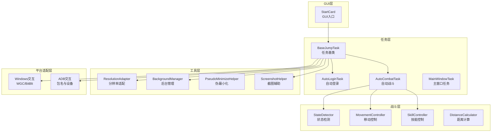
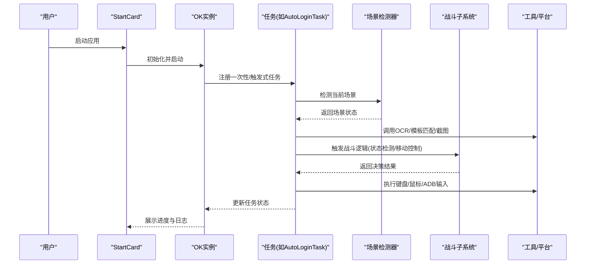
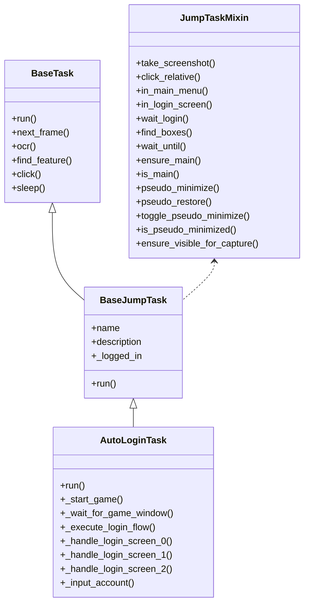
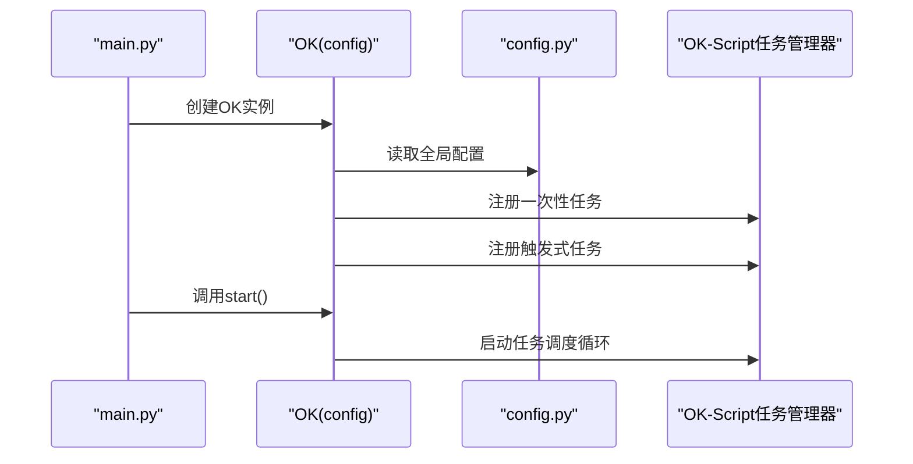
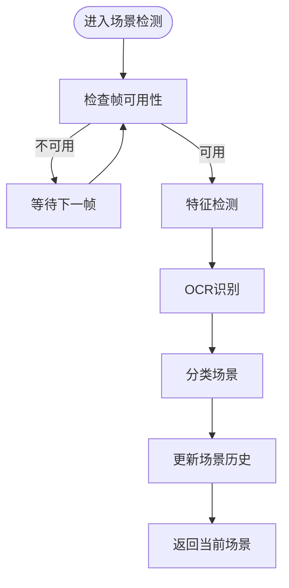
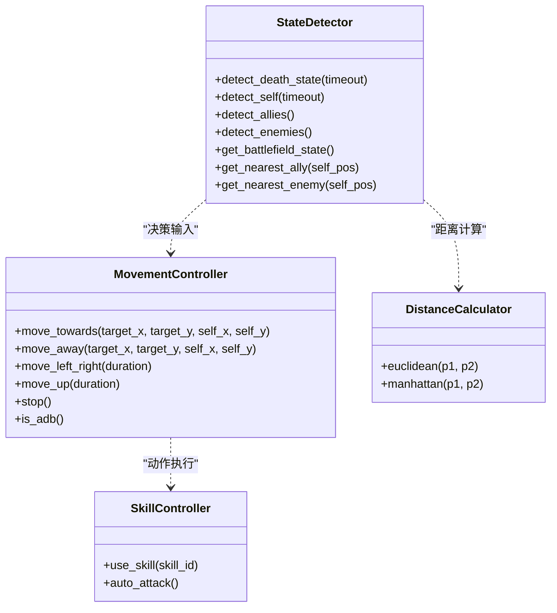
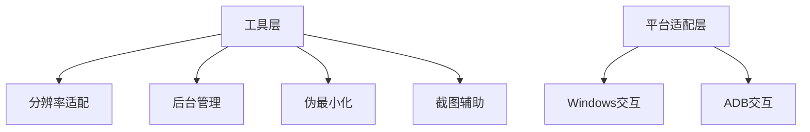
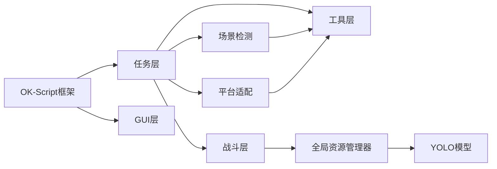

# 整体架构概览

<cite>
**本文档引用的文件**
- [main.py](file://main.py)
- [config.py](file://config.py)
- [src/__init__.py](file://src/__init__.py)
- [src/globals.py](file://src/globals.py)
- [src/task/BaseJumpTask.py](file://src/task/BaseJumpTask.py)
- [src/task/AutoLoginTask.py](file://src/task/AutoLoginTask.py)
- [src/scene/JumpScene.py](file://src/scene/JumpScene.py)
- [src/combat/state_detector.py](file://src/combat/state_detector.py)
- [src/combat/movement_controller.py](file://src/combat/movement_controller.py)
- [requirements.txt](file://requirements.txt)
</cite>

## 目录
1. [引言](#引言)
2. [项目结构](#项目结构)
3. [核心组件](#核心组件)
4. [架构总览](#架构总览)
5. [详细组件分析](#详细组件分析)
6. [依赖关系分析](#依赖关系分析)
7. [性能考虑](#性能考虑)
8. [故障排除指南](#故障排除指南)
9. [结论](#结论)

## 引言
本项目基于 OK-Script 框架构建，采用任务驱动架构与插件化模块设计，围绕 GUI 层、任务层、战斗层、工具层与平台适配层进行分层解耦。系统通过 OK-Script 的 OK 实例启动，注册一次性任务与触发式任务，并结合场景检测、OCR、模板匹配与 YOLO 目标检测实现自动化登录、挂机战斗等核心能力。全局资源管理器集中管理登录状态、OCR 缓存与 YOLO 模型，确保跨模块共享与复用。

## 项目结构
项目采用按功能域分层的目录组织方式：
- GUI 层：由 OK-Script 提供的 GUI 组件与 StartCard 集成，负责用户交互与日志导出。
- 任务层：包含一次性任务（如登录、教程、匹配、日常）与触发式任务（如自动战斗），统一继承自 OK-Script 的 BaseTask 并扩展 Jump 特性。
- 战斗层：提供状态检测、移动控制、技能控制、距离计算等模块，支撑自动战斗逻辑。
- 工具层：封装分辨率适配、后台管理、伪最小化、截图辅助等通用工具。
- 平台适配层：通过 Windows 与 ADB 两种交互方式适配 PC 与移动端，支持不同输入输出策略。

图表来源
- [main.py:30-33](file://main.py#L30-L33)
- [config.py:124-137](file://config.py#L124-L137)
- [src/task/BaseJumpTask.py:10-28](file://src/task/BaseJumpTask.py#L10-L28)
- [src/scene/JumpScene.py:8-29](file://src/scene/JumpScene.py#L8-L29)
- [src/combat/state_detector.py:23-46](file://src/combat/state_detector.py#L23-L46)
- [src/combat/movement_controller.py:11-44](file://src/combat/movement_controller.py#L11-L44)

章节来源
- [main.py:30-33](file://main.py#L30-L33)
- [config.py:65-137](file://config.py#L65-L137)

## 核心组件
- OK-Script 启动器：通过 OK(config) 创建应用实例并启动 GUI 与任务调度。
- 全局资源管理器：集中管理登录状态、OCR 缓存、YOLO 模型加载与重置，提供统一访问接口。
- 任务基类与具体任务：BaseJumpTask 提供通用能力（截图、相对点击、场景检测、登录等待、伪最小化），各任务继承扩展业务逻辑。
- 场景检测器：根据特征模板与 OCR 文本识别当前场景，维护场景历史与分辨率信息。
- 战斗子系统：状态检测（YOLO）、移动控制（PC/ADB）、技能控制、距离计算，形成闭环控制链路。
- 工具与平台适配：分辨率适配、后台/伪最小化、截图辅助；Windows 与 ADB 两种交互方式。

章节来源
- [src/globals.py:16-227](file://src/globals.py#L16-L227)
- [src/task/BaseJumpTask.py:10-295](file://src/task/BaseJumpTask.py#L10-L295)
- [src/scene/JumpScene.py:8-216](file://src/scene/JumpScene.py#L8-L216)
- [src/combat/state_detector.py:23-274](file://src/combat/state_detector.py#L23-L274)
- [src/combat/movement_controller.py:11-311](file://src/combat/movement_controller.py#L11-L311)

## 架构总览
系统采用“OK-Script 驱动 + 任务插件 + 模块化子系统”的分层架构：
- 系统边界：GUI 层负责用户交互与日志导出；任务层负责业务编排；战斗层负责智能决策与动作执行；工具层提供横切能力；平台适配层屏蔽底层差异。
- 控制流：OK-Script 启动后，按配置注册一次性任务与触发式任务；任务在运行时通过场景检测与 OCR/模板匹配感知环境，调用战斗子系统执行动作；全局资源管理器提供共享状态与模型。
- 数据流：摄像头/窗口捕获 → OCR/模板匹配/特征检测 → 场景识别 → 任务决策 → 动作执行（键盘/鼠标/ADB）→ 屏幕反馈 → 下一帧循环。

图表来源
- [main.py:30-33](file://main.py#L30-L33)
- [config.py:124-137](file://config.py#L124-L137)
- [src/task/AutoLoginTask.py:96-141](file://src/task/AutoLoginTask.py#L96-L141)
- [src/scene/JumpScene.py:39-71](file://src/scene/JumpScene.py#L39-L71)
- [src/combat/state_detector.py:43-86](file://src/combat/state_detector.py#L43-L86)
- [src/combat/movement_controller.py:41-104](file://src/combat/movement_controller.py#L41-L104)

## 详细组件分析

### 任务驱动架构与插件化设计
- 一次性任务与触发式任务：通过配置项 onetime_tasks 与 trigger_tasks 注册，OK-Script 在启动时自动调度。
- 任务基类扩展：BaseJumpTask 提供统一的截图、相对点击、场景检测、登录等待、伪最小化等能力，降低重复代码。
- 任务间协作：AutoLoginTask 作为前置任务，完成后为后续战斗任务提供“已登录”状态；战斗任务通过状态检测器与移动控制器形成闭环。

图表来源
- [src/task/BaseJumpTask.py:10-295](file://src/task/BaseJumpTask.py#L10-L295)
- [src/task/AutoLoginTask.py:18-1105](file://src/task/AutoLoginTask.py#L18-L1105)

章节来源
- [config.py:124-137](file://config.py#L124-L137)
- [src/task/BaseJumpTask.py:10-295](file://src/task/BaseJumpTask.py#L10-L295)
- [src/task/AutoLoginTask.py:96-271](file://src/task/AutoLoginTask.py#L96-L271)

### OK-Script 集成与任务调度机制
- 启动流程：main.py 中创建 OK(config) 并调用 start()，OK-Script 负责初始化 GUI、加载配置与任务。
- 任务注册：config.py 中的 onetime_tasks 与 trigger_tasks 指定任务类路径，OK-Script 自动导入并调度。
- 日志导出：StartCard 导出日志压缩包，便于问题排查。

图表来源
- [main.py:30-33](file://main.py#L30-L33)
- [config.py:124-137](file://config.py#L124-L137)

章节来源
- [main.py:30-33](file://main.py#L30-L33)
- [config.py:65-137](file://config.py#L65-L137)

### 场景检测与数据流
- 场景检测器：根据特征模板与 OCR 文本识别当前场景，维护场景历史与分辨率信息，提供等待场景切换的能力。
- 数据流：摄像头/窗口捕获 → 特征/OCR 检测 → 场景识别 → 任务决策 → 动作执行 → 下一帧循环。

图表来源
- [src/scene/JumpScene.py:39-71](file://src/scene/JumpScene.py#L39-L71)

章节来源
- [src/scene/JumpScene.py:39-216](file://src/scene/JumpScene.py#L39-L216)

### 战斗层：状态检测与移动控制
- 状态检测：使用 YOLO 模型检测自身、友方、敌方与死亡状态，支持持续检测与最近目标选择。
- 移动控制：支持 PC 端 WASD 键盘与移动端虚拟摇杆两种模式，提供前进、后退、左右移动与停止。
- 技能控制与距离计算：作为战斗子系统的重要组成部分，与状态检测和移动控制协同工作。

图表来源
- [src/combat/state_detector.py:23-274](file://src/combat/state_detector.py#L23-L274)
- [src/combat/movement_controller.py:11-311](file://src/combat/movement_controller.py#L11-L311)

章节来源
- [src/combat/state_detector.py:43-274](file://src/combat/state_detector.py#L43-L274)
- [src/combat/movement_controller.py:41-311](file://src/combat/movement_controller.py#L41-L311)

### 工具层与平台适配层
- 工具层：分辨率适配、后台管理、伪最小化、截图辅助，提供跨平台一致的用户体验。
- 平台适配层：Windows 与 ADB 两种交互方式，分别支持 WGC/BitBlt 截图与包名/设备控制。

图表来源
- [src/scene/JumpScene.py:30-38](file://src/scene/JumpScene.py#L30-L38)
- [config.py:88-99](file://config.py#L88-L99)

章节来源
- [src/scene/JumpScene.py:30-38](file://src/scene/JumpScene.py#L30-L38)
- [config.py:88-99](file://config.py#L88-L99)

## 依赖关系分析
- 外部依赖：OK-Script 作为核心框架，提供任务调度、GUI、OCR、模板匹配与平台交互能力。
- 内部依赖：任务层依赖场景检测与工具层；战斗层依赖全局资源管理器中的 YOLO 模型；平台适配层为任务与战斗提供底层支持。

图表来源
- [requirements.txt:1-13](file://requirements.txt#L1-L13)
- [src/globals.py:172-227](file://src/globals.py#L172-L227)

章节来源
- [requirements.txt:1-13](file://requirements.txt#L1-L13)
- [src/globals.py:172-227](file://src/globals.py#L172-L227)

## 性能考虑
- 触发间隔：通过配置项控制任务触发间隔，适当增大可降低 CPU/GPU 占用。
- OCR 缓存：全局 OCR 缓存减少重复识别开销，合理设置 TTL。
- YOLO 模型：延迟加载与显存释放，避免常驻占用。
- 截图与模板匹配：优先使用模板匹配与特征检测，必要时再启用 OCR/YOLO。
- 后台模式：伪最小化与后台静音减少系统干扰，提升稳定性。

## 故障排除指南
- 登录失败：检查游戏路径配置、窗口可见性与协议勾选状态；查看登录状态信息与错误截图。
- 场景识别异常：确认分辨率比例与模板/特征文件有效性；检查 OCR 识别结果与缓存。
- 战斗无效：验证 YOLO 模型加载状态与检测阈值；检查移动控制与技能控制的输入映射。
- 日志导出：使用 GUI 中的日志导出功能，定位问题并反馈。

章节来源
- [src/task/AutoLoginTask.py:107-141](file://src/task/AutoLoginTask.py#L107-L141)
- [src/scene/JumpScene.py:206-216](file://src/scene/JumpScene.py#L206-L216)
- [src/globals.py:217-227](file://src/globals.py#L217-L227)

## 结论
本项目以 OK-Script 为核心，通过任务驱动与插件化设计实现了 GUI、任务、战斗、工具与平台适配的清晰分层。全局资源管理器统一管理关键状态与模型，场景检测与 OCR/模板匹配提供环境感知，战斗子系统实现智能决策与动作执行。该架构具备良好的扩展性与可维护性，适合进一步完善战斗策略与多平台适配。