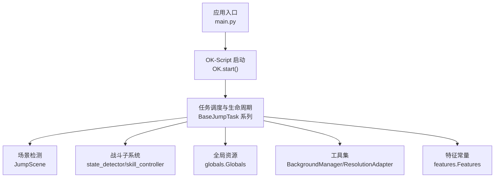
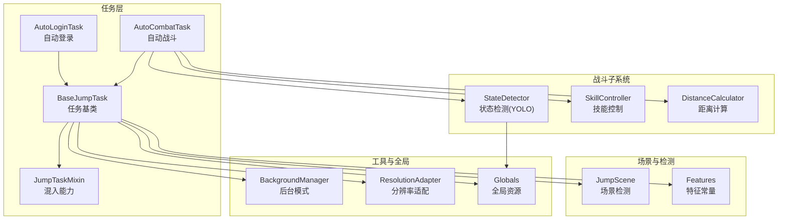
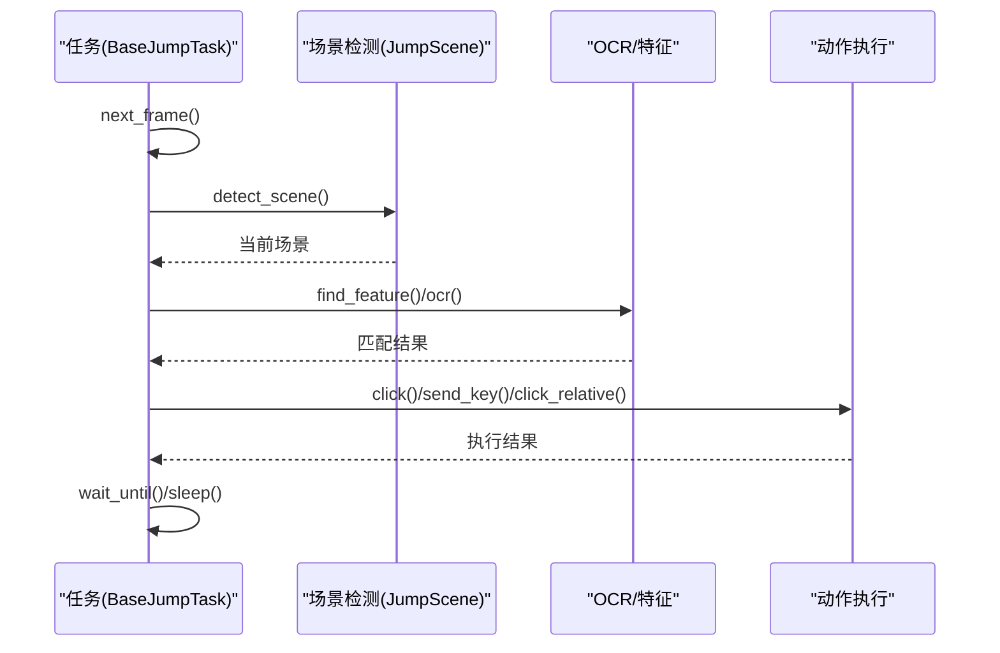
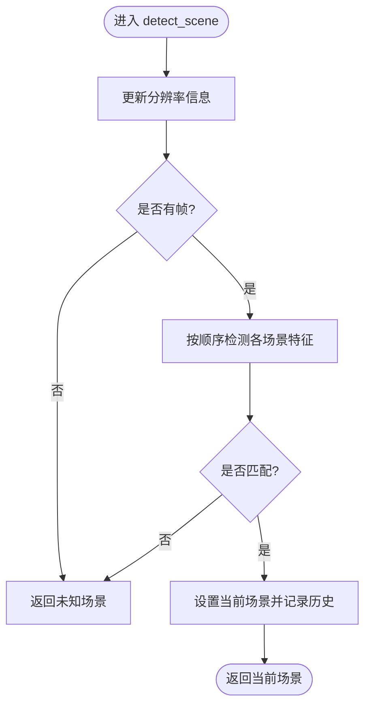
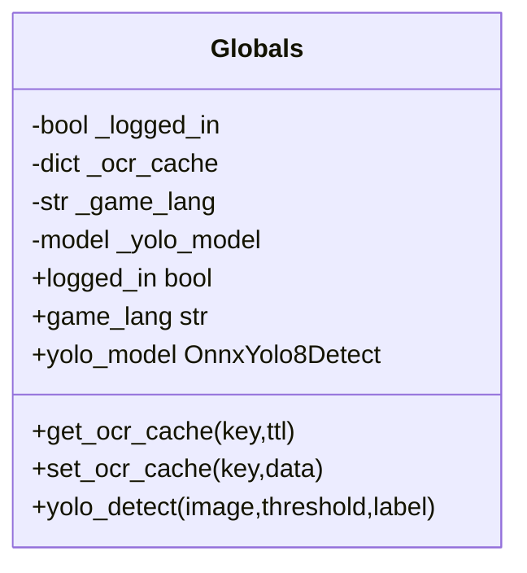
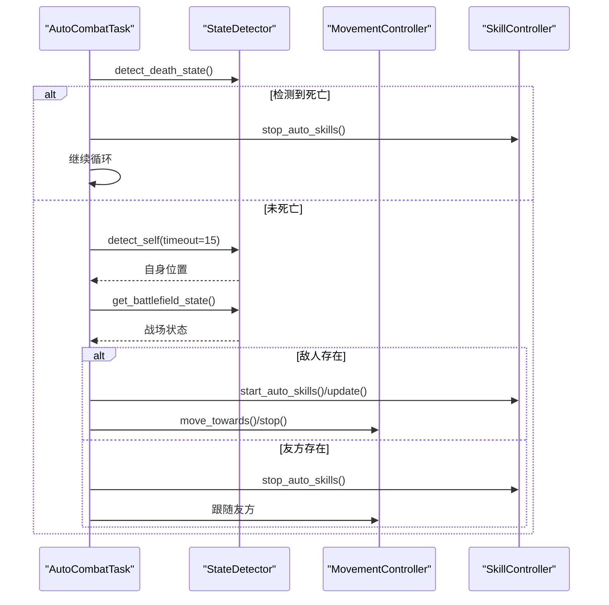
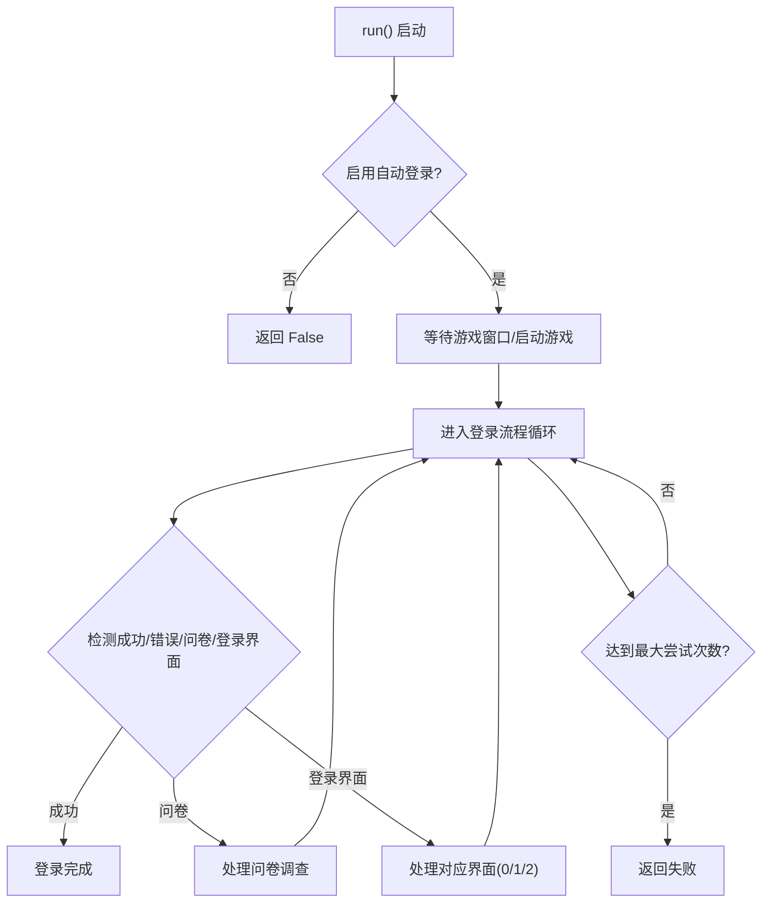
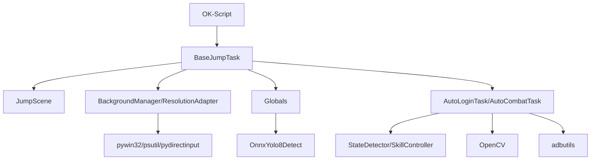

# 核心架构设计

<cite>
**本文档引用的文件**
- [main.py](file://main.py)
- [src/globals.py](file://src/globals.py)
- [src/task/BaseJumpTask.py](file://src/task/BaseJumpTask.py)
- [src/scene/JumpScene.py](file://src/scene/JumpScene.py)
- [src/task/mixins.py](file://src/task/mixins.py)
- [src/constants/features.py](file://src/constants/features.py)
- [src/utils/BackgroundManager.py](file://src/utils/BackgroundManager.py)
- [src/combat/state_detector.py](file://src/combat/state_detector.py)
- [src/combat/skill_controller.py](file://src/combat/skill_controller.py)
- [src/tas/AutoLoginTask.py](file://src/tas/AutoLoginTask.py)
- [src/task/AutoCombatTask.py](file://src/task/AutoCombatTask.py)
- [src/utils/ResolutionAdapter.py](file://src/utils/ResolutionAdapter.py)
- [src/combat/labels.py](file://src/combat/labels.py)
- [requirements.txt](file://requirements.txt)
</cite>

## 目录
1. [引言](#引言)
2. [项目结构](#项目结构)
3. [核心组件](#核心组件)
4. [架构总览](#架构总览)
5. [详细组件分析](#详细组件分析)
6. [依赖关系分析](#依赖关系分析)
7. [性能考虑](#性能考虑)
8. [故障排除指南](#故障排除指南)
9. [结论](#结论)
10. [附录](#附录)

## 引言
本项目基于 OK-Script 框架构建，采用任务驱动架构与插件化模块设计，围绕“自动登录”“自动战斗”等核心任务，结合场景检测、图像识别、分辨率适配、后台模式等能力，形成可扩展、可维护的自动化控制系统。本文档旨在帮助开发者深入理解系统架构、模块职责、数据流与控制流，并提供扩展与维护指导。

## 项目结构
项目采用按功能域分层的组织方式：
- 应用入口与启动：main.py
- 全局资源与工具：src/globals.py、src/utils/*
- 任务体系：src/task/*（包含基类与具体任务）
- 场景检测：src/scene/JumpScene.py
- 战斗子系统：src/combat/*
- 常量与特征：src/constants/features.py
- 依赖声明：requirements.txt

图表来源
- [main.py:30-33](file://main.py#L30-L33)
- [src/task/BaseJumpTask.py:10-295](file://src/task/BaseJumpTask.py#L10-L295)
- [src/scene/JumpScene.py:8-216](file://src/scene/JumpScene.py#L8-L216)
- [src/globals.py:16-227](file://src/globals.py#L16-L227)
- [src/utils/BackgroundManager.py:7-145](file://src/utils/BackgroundManager.py#L7-L145)
- [src/utils/ResolutionAdapter.py:4-163](file://src/utils/ResolutionAdapter.py#L4-L163)
- [src/constants/features.py:9-86](file://src/constants/features.py#L9-L86)

章节来源
- [main.py:1-33](file://main.py#L1-L33)
- [requirements.txt:1-13](file://requirements.txt#L1-L13)

## 核心组件
- 任务基类与混入：BaseJumpTask 与 JumpTaskMixin 提供统一的任务能力（截图、OCR、场景检测、分辨率适配、后台模式、等待条件等），并通过混入消除重复。
- 场景检测器：JumpScene 基于特征识别与 OCR，维护场景历史与分辨率信息。
- 全局资源管理器：Globals 提供登录状态、OCR 缓存、YOLO 模型的统一访问与延迟加载。
- 战斗子系统：StateDetector（YOLO 检测）、SkillController（技能释放）、MovementController（移动控制）、DistanceCalculator（距离计算）协同工作。
- 工具与适配：BackgroundManager（后台模式与伪最小化）、ResolutionAdapter（16:9 适配与坐标缩放）。
- 任务实现：AutoLoginTask（自动登录）、AutoCombatTask（自动战斗）。

章节来源
- [src/task/BaseJumpTask.py:10-295](file://src/task/BaseJumpTask.py#L10-L295)
- [src/task/mixins.py:12-301](file://src/task/mixins.py#L12-L301)
- [src/scene/JumpScene.py:8-216](file://src/scene/JumpScene.py#L8-L216)
- [src/globals.py:16-227](file://src/globals.py#L16-L227)
- [src/combat/state_detector.py:23-274](file://src/combat/state_detector.py#L23-L274)
- [src/combat/skill_controller.py:12-181](file://src/combat/skill_controller.py#L12-L181)
- [src/utils/BackgroundManager.py:7-145](file://src/utils/BackgroundManager.py#L7-L145)
- [src/utils/ResolutionAdapter.py:4-163](file://src/utils/ResolutionAdapter.py#L4-L163)
- [src/constants/features.py:9-86](file://src/constants/features.py#L9-L86)

## 架构总览
系统采用“任务驱动 + 插件化模块”的混合架构：
- 任务驱动：以 BaseJumpTask 为核心，派生出 AutoLoginTask、AutoCombatTask 等具体任务；任务间通过 OK-Script 的调度与生命周期管理协作。
- 插件化模块：场景检测、战斗子系统、全局资源、工具集以独立模块提供能力，通过混入与组合注入到任务中。
- 数据与控制流：任务从设备采集帧，经 OCR/特征/模型检测，生成动作指令（点击、按键、ADB 点击），并反馈到任务状态与日志。

图表来源
- [src/task/BaseJumpTask.py:10-295](file://src/task/BaseJumpTask.py#L10-L295)
- [src/task/mixins.py:12-301](file://src/task/mixins.py#L12-L301)
- [src/scene/JumpScene.py:8-216](file://src/scene/JumpScene.py#L8-L216)
- [src/constants/features.py:9-86](file://src/constants/features.py#L9-L86)
- [src/combat/state_detector.py:23-274](file://src/combat/state_detector.py#L23-L274)
- [src/combat/skill_controller.py:12-181](file://src/combat/skill_controller.py#L12-L181)
- [src/utils/BackgroundManager.py:7-145](file://src/utils/BackgroundManager.py#L7-L145)
- [src/utils/ResolutionAdapter.py:4-163](file://src/utils/ResolutionAdapter.py#L4-L163)
- [src/globals.py:16-227](file://src/globals.py#L16-L227)

## 详细组件分析

### 任务驱动架构与生命周期
- 任务基类 BaseJumpTask 继承 OK-Script 的 BaseTask，并混入 JumpTaskMixin，提供统一的截图、OCR、场景检测、等待条件、分辨率适配、后台模式与伪最小化等能力。
- 任务通过 next_frame() 获取帧，通过 find_feature()/ocr()/find_boxes() 进行识别，通过 click()/send_key()/click_relative() 发送交互指令。
- 任务支持 wait_until() 等等待机制，确保在正确场景或条件满足后再执行下一步。

图表来源
- [src/task/BaseJumpTask.py:202-232](file://src/task/BaseJumpTask.py#L202-L232)
- [src/scene/JumpScene.py:39-71](file://src/scene/JumpScene.py#L39-L71)

章节来源
- [src/task/BaseJumpTask.py:10-295](file://src/task/BaseJumpTask.py#L10-L295)
- [src/task/mixins.py:12-301](file://src/task/mixins.py#L12-L301)

### 场景检测与状态管理
- JumpScene 基于特征与 OCR 判断当前场景（主菜单、登录界面、大厅、英雄选择、加载中、游戏中、结算等），并维护场景历史与分辨率信息。
- 提供 wait_for_scene()、is_in_game()/is_in_menu()/is_in_login() 等便捷方法，简化任务中的场景等待与判断。

图表来源
- [src/scene/JumpScene.py:39-71](file://src/scene/JumpScene.py#L39-L71)
- [src/scene/JumpScene.py:73-148](file://src/scene/JumpScene.py#L73-L148)

章节来源
- [src/scene/JumpScene.py:8-216](file://src/scene/JumpScene.py#L8-L216)

### 全局资源与 YOLO 检测
- Globals 提供全局状态与资源：登录状态、OCR 缓存（带 TTL）、游戏语言、YOLO 模型（延迟加载）。YOLO 模型通过 OnnxYolo8Detect 加载权重文件，提供 detect() 接口。
- AutoLoginTask 与 AutoCombatTask 通过 og.my_app.yolo_detect 访问全局 YOLO 能力，实现 OCR 与特征识别。

图表来源
- [src/globals.py:16-227](file://src/globals.py#L16-L227)

章节来源
- [src/globals.py:16-227](file://src/globals.py#L16-L227)

### 战斗状态检测与智能控制
- StateDetector 使用 YOLO 检测自身、友方、敌方与死亡状态，支持超时检测与最近目标选择。
- SkillController 根据配置与设备类型（PC/ADB）选择按键或点击释放技能，具备冷却与自动技能开关。
- AutoCombatTask 将上述能力编排为完整战斗流程：死亡检测 → 自身检测 → 战场状态判断 → 距离维持与技能释放。

图表来源
- [src/task/AutoCombatTask.py:65-200](file://src/task/AutoCombatTask.py#L65-L200)
- [src/combat/state_detector.py:51-192](file://src/combat/state_detector.py#L51-L192)
- [src/combat/skill_controller.py:53-103](file://src/combat/skill_controller.py#L53-L103)

章节来源
- [src/task/AutoCombatTask.py:25-357](file://src/task/AutoCombatTask.py#L25-L357)
- [src/combat/state_detector.py:23-274](file://src/combat/state_detector.py#L23-L274)
- [src/combat/skill_controller.py:12-181](file://src/combat/skill_controller.py#L12-L181)

### 自动登录任务流程
- AutoLoginTask 负责处理登录界面（适龄提示、账户登录、开始游戏）、问卷调查、账号输入（可选）与角色选择检测。
- 通过特征识别与 OCR 双通道定位按钮，结合模板匹配定位输入框，使用剪贴板与键盘事件完成账号输入与校验。

图表来源
- [src/tas/AutoLoginTask.py:96-141](file://src/tas/AutoLoginTask.py#L96-L141)
- [src/tas/AutoLoginTask.py:196-271](file://src/tas/AutoLoginTask.py#L196-L271)

章节来源
- [src/tas/AutoLoginTask.py:18-800](file://src/tas/AutoLoginTask.py#L18-L800)

### 设计模式应用
- 混入模式（Mixin）：JumpTaskMixin 将通用能力注入 BaseJumpTask，避免重复代码，提升复用性。
- 工厂/延迟初始化：Globals 的 YOLO 模型延迟加载，ResolutionAdapter 依据配置动态更新参考分辨率与缩放因子。
- 观察者风格的状态通知：JumpScene 维护场景历史，任务可通过轮询或等待接口感知场景变化。
- 策略模式：AutoCombatTask 根据战场状态选择不同策略（跟随/追击/搜索），SkillController 根据设备类型选择不同交互方式。

章节来源
- [src/task/mixins.py:12-301](file://src/task/mixins.py#L12-L301)
- [src/globals.py:174-198](file://src/globals.py#L174-L198)
- [src/utils/ResolutionAdapter.py:19-44](file://src/utils/ResolutionAdapter.py#L19-L44)
- [src/scene/JumpScene.py:66-70](file://src/scene/JumpScene.py#L66-L70)
- [src/combat/skill_controller.py:49-51](file://src/combat/skill_controller.py#L49-L51)

## 依赖关系分析
- 外部框架：OK-Script 提供任务基类、设备交互、配置与日志能力。
- 图像与模型：OpenCV、ONNX Runtime/DirectML 用于图像处理与 YOLO 推理。
- 平台与系统：pywin32、psutil、pydirectinput 用于窗口与输入控制；adbutils 用于移动端 ADB 交互。
- GUI：PySide6 用于图形界面与配置展示。

图表来源
- [requirements.txt:1-13](file://requirements.txt#L1-L13)
- [src/task/BaseJumpTask.py:4-7](file://src/task/BaseJumpTask.py#L4-L7)
- [src/globals.py:182-196](file://src/globals.py#L182-L196)

章节来源
- [requirements.txt:1-13](file://requirements.txt#L1-L13)

## 性能考虑
- YOLO 模型延迟加载与缓存：避免启动时占用资源，首次使用时加载并在异常时降级为空结果。
- OCR 缓存：对 OCR 结果按 TTL 缓存，减少重复识别开销。
- 分辨率适配：统一缩放坐标与区域，降低因分辨率差异导致的误判与重复识别。
- 后台模式与伪最小化：在后台模式下减少不必要的窗口交互，必要时自动伪最小化以保证截图质量。
- 循环节流：战斗主循环与等待循环设置合理休眠，避免过度占用 CPU。

## 故障排除指南
- 登录失败：检查游戏路径配置、窗口可见性与按钮特征是否匹配；查看 OCR 缓存与模板匹配阈值。
- YOLO 检测异常：确认 fight.onnx 文件存在与路径正确；检查模型加载异常日志并重置模型缓存。
- 分辨率问题：使用 check_and_warn_resolution() 输出警告并建议调整到推荐分辨率。
- 后台模式无效：检查基础选项中的后台模式与静音设置，确认窗口句柄与前台状态检测。
- 账号输入失败：核对输入框模板路径、OCR 校验超时与键盘输入延迟配置。

章节来源
- [src/tas/AutoLoginTask.py:143-176](file://src/tas/AutoLoginTask.py#L143-L176)
- [src/globals.py:217-222](file://src/globals.py#L217-L222)
- [src/utils/BackgroundManager.py:18-31](file://src/utils/BackgroundManager.py#L18-L31)
- [src/utils/ResolutionAdapter.py:121-143](file://src/utils/ResolutionAdapter.py#L121-L143)

## 结论
本项目以 OK-Script 为基础，构建了清晰的任务驱动与插件化架构：任务基类与混入提供统一能力，场景检测与全局资源解耦，战斗子系统模块化协作。通过特征与 OCR 双通道识别、分辨率适配与后台模式优化，系统在多场景下具备良好的稳定性与可扩展性。建议后续增强配置热更新、日志导出与可视化监控，进一步提升可观测性与易用性。

## 附录
- 系统边界：任务层负责业务流程编排；场景与检测层负责环境感知；战斗子系统负责智能决策；工具与全局层提供基础设施。
- 关键技术决策：采用 16:9 作为标准宽高比与参考分辨率；使用 ONNX Runtime/DirectML 以兼顾跨平台与性能；通过混入与延迟初始化提升模块内聚与启动效率。