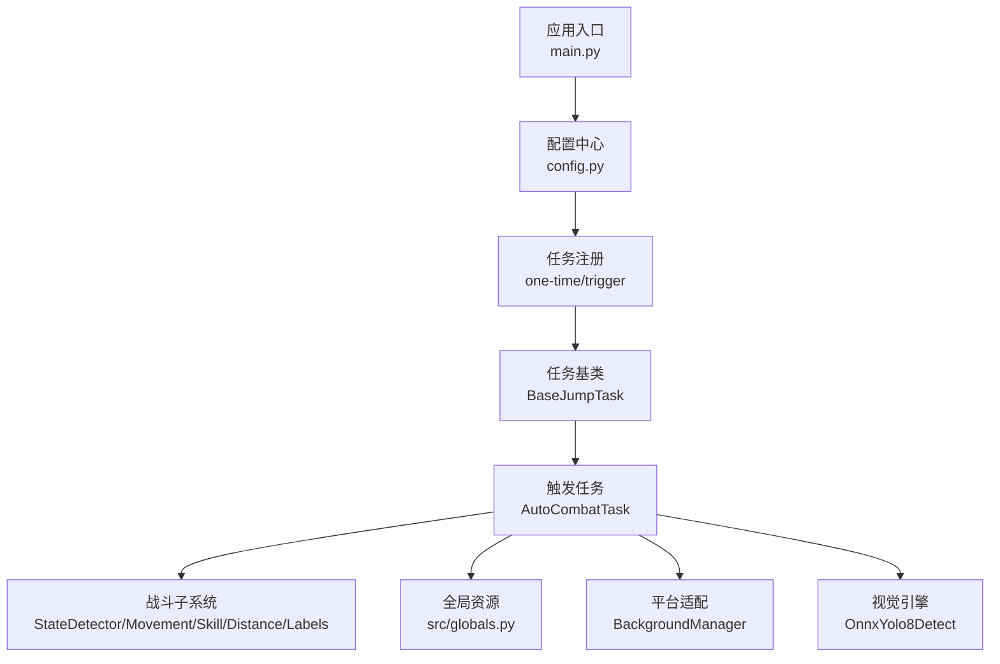
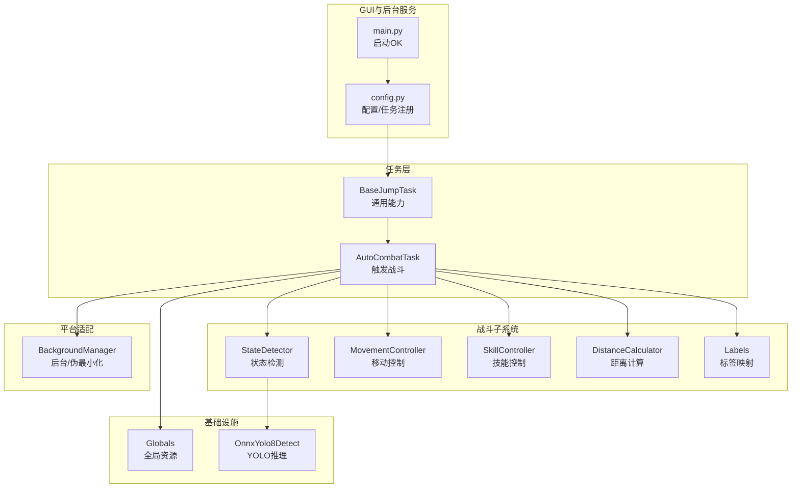
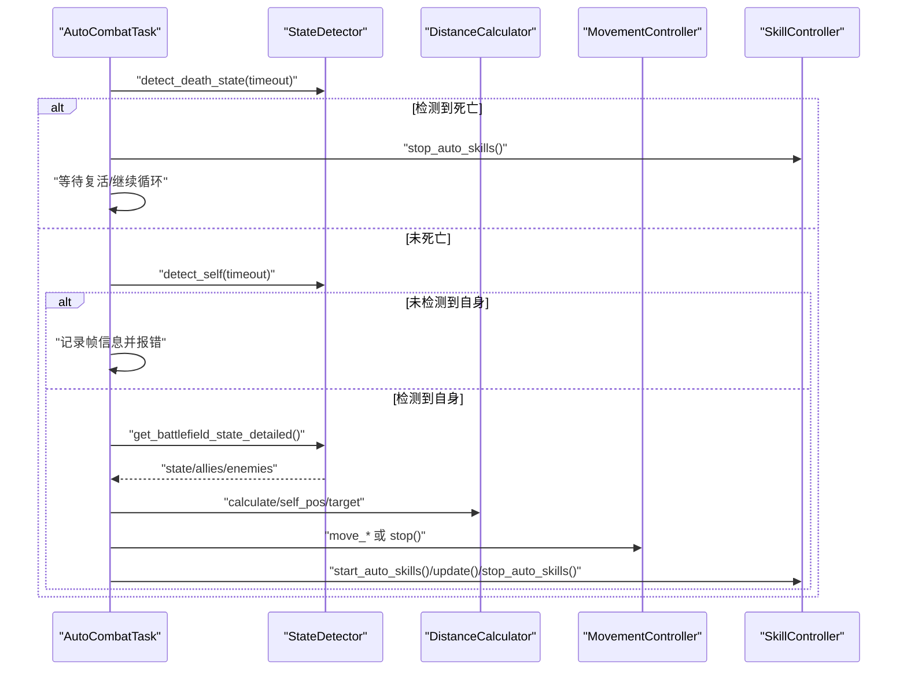
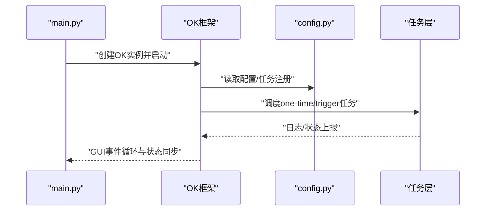
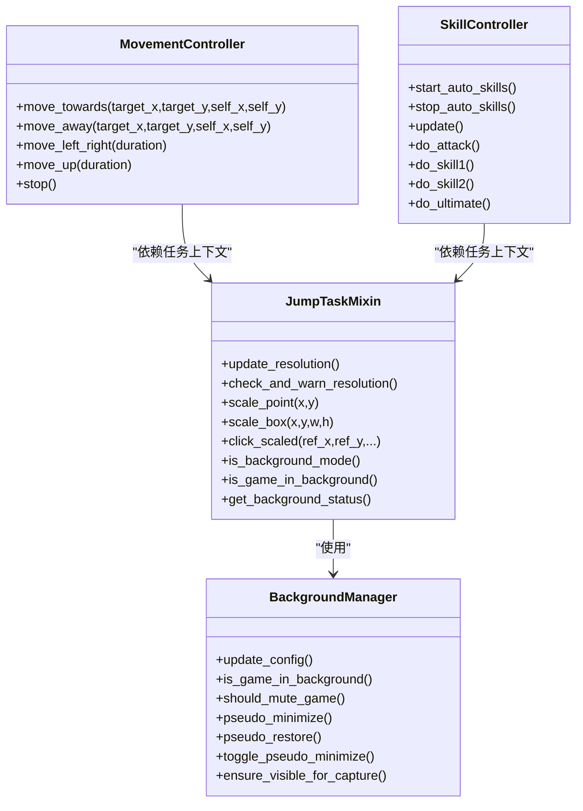
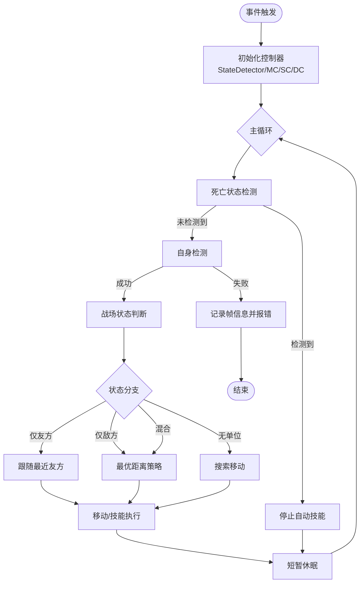
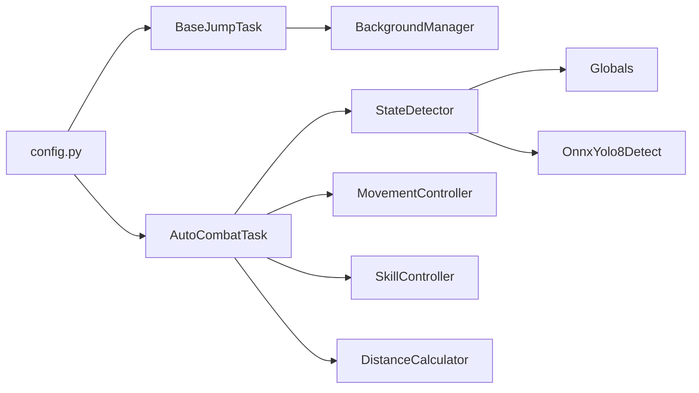

# 组件交互机制

<cite>
**本文引用的文件**
- [main.py](file://main.py)
- [config.py](file://config.py)
- [src/globals.py](file://src/globals.py)
- [src/task/BaseJumpTask.py](file://src/task/BaseJumpTask.py)
- [src/task/AutoCombatTask.py](file://src/task/AutoCombatTask.py)
- [src/combat/state_detector.py](file://src/combat/state_detector.py)
- [src/combat/movement_controller.py](file://src/combat/movement_controller.py)
- [src/combat/skill_controller.py](file://src/combat/skill_controller.py)
- [src/combat/distance_calculator.py](file://src/combat/distance_calculator.py)
- [src/combat/labels.py](file://src/combat/labels.py)
- [src/constants/features.py](file://src/constants/features.py)
- [src/utils/BackgroundManager.py](file://src/utils/BackgroundManager.py)
- [src/utils/ScreenshotHelper.py](file://src/utils/ScreenshotHelper.py)
- [src/OnnxYolo8Detect.py](file://src/OnnxYolo8Detect.py)
</cite>

## 目录
1. [简介](#简介)
2. [项目结构](#项目结构)
3. [核心组件](#核心组件)
4. [架构总览](#架构总览)
5. [详细组件分析](#详细组件分析)
6. [依赖关系分析](#依赖关系分析)
7. [性能考量](#性能考量)
8. [故障排查指南](#故障排查指南)
9. [结论](#结论)

## 简介
本文件聚焦于OK-Jump项目的组件交互机制，系统性阐述任务系统与战斗系统的交互流程、GUI界面与后台服务的通信方式，以及平台适配层的抽象机制。文档覆盖事件驱动架构、消息传递模式与状态同步机制，并提供组件依赖关系图与交互时序图，帮助开发者快速理解复杂系统中的模块协作。

## 项目结构
OK-Jump采用分层与职责分离的设计：
- 应用入口与配置：main.py负责启动应用，config.py集中管理全局配置与任务注册。
- 任务层：BaseJumpTask与AutoCombatTask等任务类负责业务流程编排与状态流转。
- 战斗子系统：StateDetector、MovementController、SkillController、DistanceCalculator、Labels等模块协同完成视觉识别、决策与动作执行。
- 平台适配与工具：BackgroundManager、ScreenshotHelper、OnnxYolo8Detect等提供跨平台能力与基础设施。
- 全局资源：src/globals.py统一管理登录状态、OCR缓存、YOLO模型等全局资源。

图表来源
- [main.py:30-33](file://main.py#L30-L33)
- [config.py:124-137](file://config.py#L124-L137)
- [src/task/BaseJumpTask.py:10-295](file://src/task/BaseJumpTask.py#L10-L295)
- [src/task/AutoCombatTask.py:25-431](file://src/task/AutoCombatTask.py#L25-L431)
- [src/globals.py:16-227](file://src/globals.py#L16-L227)
- [src/utils/BackgroundManager.py:7-145](file://src/utils/BackgroundManager.py#L7-L145)
- [src/OnnxYolo8Detect.py:17-311](file://src/OnnxYolo8Detect.py#L17-L311)

章节来源
- [main.py:30-33](file://main.py#L30-L33)
- [config.py:124-137](file://config.py#L124-L137)

## 核心组件
- 任务系统
  - BaseJumpTask：提供截图、场景检测、登录等待、伪最小化等通用能力。
  - AutoCombatTask：触发式战斗任务，封装完整AI战斗流程。
- 战斗系统
  - StateDetector：基于YOLO的战场状态检测与单位识别。
  - MovementController：跨平台移动控制（PC键盘/ADB触摸）。
  - SkillController：跨平台技能释放控制（PC按键/ADB点击）。
  - DistanceCalculator：距离计算与移动方向建议。
  - Labels：YOLO标签映射。
- 平台适配与工具
  - BackgroundManager：后台模式、静音、伪最小化。
  - ScreenshotHelper：截图与模板保存。
  - OnnxYolo8Detect：YOLOv8 ONNX推理引擎。
- 全局资源
  - Globals：登录状态、OCR缓存、YOLO模型统一管理。

章节来源
- [src/task/BaseJumpTask.py:10-295](file://src/task/BaseJumpTask.py#L10-L295)
- [src/task/AutoCombatTask.py:25-431](file://src/task/AutoCombatTask.py#L25-L431)
- [src/combat/state_detector.py:23-315](file://src/combat/state_detector.py#L23-L315)
- [src/combat/movement_controller.py:11-311](file://src/combat/movement_controller.py#L11-L311)
- [src/combat/skill_controller.py:12-181](file://src/combat/skill_controller.py#L12-L181)
- [src/combat/distance_calculator.py:10-139](file://src/combat/distance_calculator.py#L10-L139)
- [src/combat/labels.py:8-51](file://src/combat/labels.py#L8-L51)
- [src/utils/BackgroundManager.py:7-145](file://src/utils/BackgroundManager.py#L7-L145)
- [src/utils/ScreenshotHelper.py:7-68](file://src/utils/ScreenshotHelper.py#L7-L68)
- [src/OnnxYolo8Detect.py:17-311](file://src/OnnxYolo8Detect.py#L17-L311)
- [src/globals.py:16-227](file://src/globals.py#L16-L227)

## 架构总览
OK-Jump采用“任务驱动 + 模块化子系统”的架构：
- GUI与后台服务通过OK框架集成，main.py启动OK实例并交由其调度。
- 任务层通过继承与混入复用通用能力，触发任务在其他任务中被调用。
- 战斗系统以StateDetector为核心，围绕其构建决策与动作执行链路。
- 平台适配层通过BackgroundManager屏蔽窗口前后台状态差异。
- 全局资源通过Globals集中管理，避免重复加载与状态分散。

图表来源
- [main.py:30-33](file://main.py#L30-L33)
- [config.py:124-137](file://config.py#L124-L137)
- [src/task/BaseJumpTask.py:10-295](file://src/task/BaseJumpTask.py#L10-L295)
- [src/task/AutoCombatTask.py:25-431](file://src/task/AutoCombatTask.py#L25-L431)
- [src/combat/state_detector.py:23-315](file://src/combat/state_detector.py#L23-L315)
- [src/combat/movement_controller.py:11-311](file://src/combat/movement_controller.py#L11-L311)
- [src/combat/skill_controller.py:12-181](file://src/combat/skill_controller.py#L12-L181)
- [src/combat/distance_calculator.py:10-139](file://src/combat/distance_calculator.py#L10-L139)
- [src/combat/labels.py:8-51](file://src/combat/labels.py#L8-L51)
- [src/utils/BackgroundManager.py:7-145](file://src/utils/BackgroundManager.py#L7-L145)
- [src/globals.py:16-227](file://src/globals.py#L16-L227)
- [src/OnnxYolo8Detect.py:17-311](file://src/OnnxYolo8Detect.py#L17-L311)

## 详细组件分析

### 任务系统与战斗系统的交互流程
AutoCombatTask作为触发任务，协调战斗子系统完成“死亡检测—自身定位—状态判断—动作执行”的闭环。其主循环按步骤执行，结合状态检测器与距离计算器做出移动与技能决策，并通过移动/技能控制器下发操作。

图表来源
- [src/task/AutoCombatTask.py:165-243](file://src/task/AutoCombatTask.py#L165-L243)
- [src/combat/state_detector.py:105-152](file://src/combat/state_detector.py#L105-L152)
- [src/combat/distance_calculator.py:35-104](file://src/combat/distance_calculator.py#L35-L104)
- [src/combat/movement_controller.py:45-103](file://src/combat/movement_controller.py#L45-L103)
- [src/combat/skill_controller.py:65-102](file://src/combat/skill_controller.py#L65-L102)

章节来源
- [src/task/AutoCombatTask.py:165-243](file://src/task/AutoCombatTask.py#L165-L243)
- [src/combat/state_detector.py:105-152](file://src/combat/state_detector.py#L105-L152)
- [src/combat/distance_calculator.py:35-104](file://src/combat/distance_calculator.py#L35-L104)
- [src/combat/movement_controller.py:45-103](file://src/combat/movement_controller.py#L45-L103)
- [src/combat/skill_controller.py:65-102](file://src/combat/skill_controller.py#L65-L102)

### GUI界面与后台服务的通信方式
- 应用入口通过OK框架启动，main.py创建OK实例并调用start()，由OK框架负责GUI生命周期与任务调度。
- 配置中心config.py集中声明全局配置、任务注册、窗口与ADB参数等，供OK框架读取与应用。
- 任务层通过继承OK提供的BaseTask/TriggerTask获得统一的日志、截图、输入模拟等能力。

图表来源
- [main.py:30-33](file://main.py#L30-L33)
- [config.py:65-137](file://config.py#L65-L137)
- [src/task/BaseJumpTask.py:10-295](file://src/task/BaseJumpTask.py#L10-L295)

章节来源
- [main.py:30-33](file://main.py#L30-L33)
- [config.py:65-137](file://config.py#L65-L137)
- [src/task/BaseJumpTask.py:10-295](file://src/task/BaseJumpTask.py#L10-L295)

### 平台适配层的抽象机制
- BackgroundManager统一处理后台模式、静音、伪最小化与前台窗口检测，屏蔽不同平台的窗口管理差异。
- JumpTaskMixin提供分辨率适配、坐标缩放、后台模式状态查询等通用能力，减少任务类重复代码。
- MovementController与SkillController分别针对PC键盘与ADB触摸提供统一接口，隐藏底层交互细节。

图表来源
- [src/utils/BackgroundManager.py:7-145](file://src/utils/BackgroundManager.py#L7-L145)
- [src/task/mixins.py:12-301](file://src/task/mixins.py#L12-L301)
- [src/combat/movement_controller.py:11-311](file://src/combat/movement_controller.py#L11-L311)
- [src/combat/skill_controller.py:12-181](file://src/combat/skill_controller.py#L12-L181)

章节来源
- [src/utils/BackgroundManager.py:7-145](file://src/utils/BackgroundManager.py#L7-L145)
- [src/task/mixins.py:12-301](file://src/task/mixins.py#L12-L301)
- [src/combat/movement_controller.py:11-311](file://src/combat/movement_controller.py#L11-L311)
- [src/combat/skill_controller.py:12-181](file://src/combat/skill_controller.py#L12-L181)

### 事件驱动架构与消息传递模式
- 任务层采用“触发任务”模式：AutoCombatTask作为触发任务在其他任务中被调用，形成事件驱动的执行流。
- 战斗子系统内部通过方法调用实现消息传递：StateDetector提供检测结果，DistanceCalculator提供距离与方向，MovementController/SkillController接收指令并执行。
- 全局资源通过Globals集中管理，避免跨模块直接耦合；YOLO检测通过og.my_app.yolo_detect间接访问，降低模块间紧耦合。

图表来源
- [src/task/AutoCombatTask.py:165-243](file://src/task/AutoCombatTask.py#L165-L243)
- [src/combat/state_detector.py:223-255](file://src/combat/state_detector.py#L223-L255)
- [src/combat/distance_calculator.py:67-104](file://src/combat/distance_calculator.py#L67-L104)
- [src/combat/movement_controller.py:45-103](file://src/combat/movement_controller.py#L45-L103)
- [src/combat/skill_controller.py:65-102](file://src/combat/skill_controller.py#L65-L102)

章节来源
- [src/task/AutoCombatTask.py:165-243](file://src/task/AutoCombatTask.py#L165-L243)
- [src/combat/state_detector.py:223-255](file://src/combat/state_detector.py#L223-L255)
- [src/combat/distance_calculator.py:67-104](file://src/combat/distance_calculator.py#L67-L104)
- [src/combat/movement_controller.py:45-103](file://src/combat/movement_controller.py#L45-L103)
- [src/combat/skill_controller.py:65-102](file://src/combat/skill_controller.py#L65-L102)

### 状态同步机制
- AutoCombatTask通过内部计数器与_last_state记录循环状态，配合详细日志实现状态可视化。
- StateDetector在检测过程中记录检测次数与耗时，便于诊断性能与稳定性问题。
- Globals提供全局状态（登录状态、语言、OCR缓存、YOLO模型）的统一访问与重置，确保多任务间状态一致性。

章节来源
- [src/task/AutoCombatTask.py:57-70](file://src/task/AutoCombatTask.py#L57-L70)
- [src/combat/state_detector.py:42-52](file://src/combat/state_detector.py#L42-L52)
- [src/globals.py:43-171](file://src/globals.py#L43-L171)

## 依赖关系分析
- 任务层依赖平台适配与工具层：BaseJumpTask依赖JumpTaskMixin与BackgroundManager；AutoCombatTask依赖StateDetector、MovementController、SkillController、DistanceCalculator。
- 战斗子系统依赖全局资源与视觉引擎：StateDetector依赖Globals与OnnxYolo8Detect；MovementController/SkillController依赖任务上下文。
- 配置中心贯穿全局：config.py提供任务注册、窗口参数、ADB参数、分辨率与参考分辨率等，影响所有模块行为。

图表来源
- [config.py:65-137](file://config.py#L65-L137)
- [src/task/BaseJumpTask.py:10-295](file://src/task/BaseJumpTask.py#L10-L295)
- [src/task/AutoCombatTask.py:25-431](file://src/task/AutoCombatTask.py#L25-L431)
- [src/utils/BackgroundManager.py:7-145](file://src/utils/BackgroundManager.py#L7-L145)
- [src/combat/state_detector.py:23-315](file://src/combat/state_detector.py#L23-L315)
- [src/globals.py:16-227](file://src/globals.py#L16-L227)
- [src/OnnxYolo8Detect.py:17-311](file://src/OnnxYolo8Detect.py#L17-L311)

章节来源
- [config.py:65-137](file://config.py#L65-L137)
- [src/task/BaseJumpTask.py:10-295](file://src/task/BaseJumpTask.py#L10-L295)
- [src/task/AutoCombatTask.py:25-431](file://src/task/AutoCombatTask.py#L25-L431)
- [src/utils/BackgroundManager.py:7-145](file://src/utils/BackgroundManager.py#L7-L145)
- [src/combat/state_detector.py:23-315](file://src/combat/state_detector.py#L23-L315)
- [src/globals.py:16-227](file://src/globals.py#L16-L227)
- [src/OnnxYolo8Detect.py:17-311](file://src/OnnxYolo8Detect.py#L17-L311)

## 性能考量
- YOLO推理优化：OnnxYolo8Detect优先尝试GPU执行提供者，预处理与NMS后处理在CPU上完成，建议在高分辨率下适当提高置信度阈值以减少误检。
- 检测频率控制：AutoCombatTask主循环短周期休眠，StateDetector在超时时间内多次检测，建议根据实际帧率调整timeout与sleep参数。
- 资源复用：Globals延迟加载YOLO模型并在重置时释放内存，避免重复初始化带来的开销。
- 后台模式：BackgroundManager在后台时可启用伪最小化与静音，降低系统负载并提升稳定性。

## 故障排查指南
- 自身检测超时：检查分辨率适配与窗口可见性，必要时调用ensure_visible_for_capture；查看帧信息日志定位问题。
- 死亡状态误判：调整YOLO置信度阈值与检测标签；确认战斗标签映射正确。
- 技能释放异常：核对config中的热键配置；ADB模式下确认技能按钮相对坐标与分辨率缩放一致。
- 后台模式失效：检查config中的后台模式与伪最小化开关；确认窗口句柄正确设置。

章节来源
- [src/task/AutoCombatTask.py:244-251](file://src/task/AutoCombatTask.py#L244-L251)
- [src/combat/state_detector.py:89-103](file://src/combat/state_detector.py#L89-L103)
- [src/combat/labels.py:39-50](file://src/combat/labels.py#L39-L50)
- [src/utils/BackgroundManager.py:18-31](file://src/utils/BackgroundManager.py#L18-L31)

## 结论
OK-Jump通过清晰的层次划分与模块化设计，实现了任务系统与战斗系统的高效协作。平台适配层抽象了窗口与输入差异，全局资源统一管理提升了可维护性。建议在生产环境中进一步完善异常监控与日志聚合，以增强跨环境稳定性与可观测性。