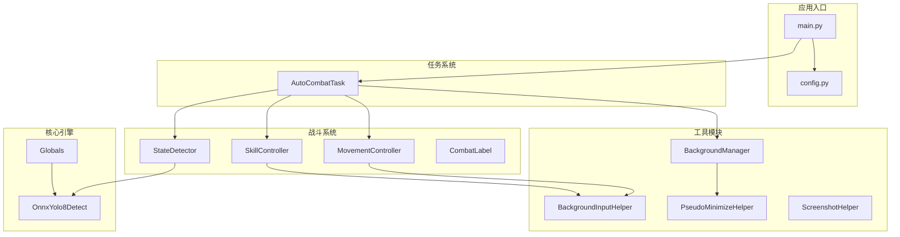
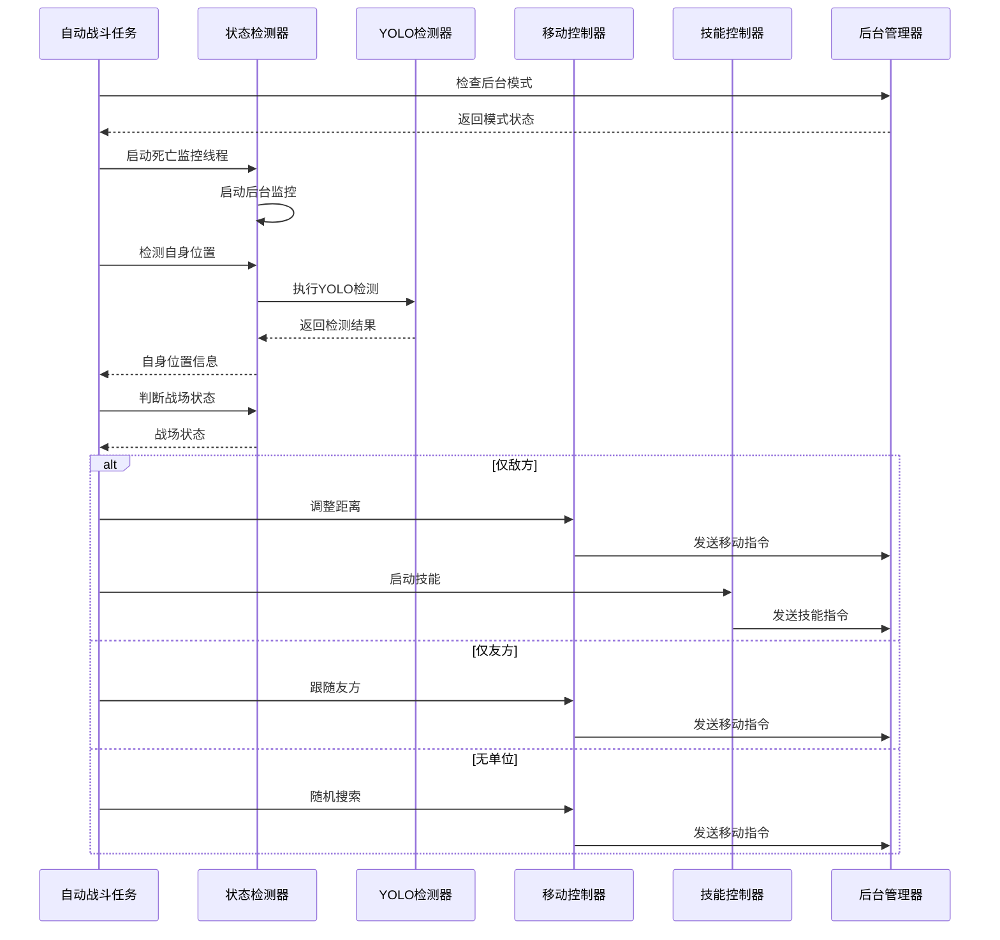
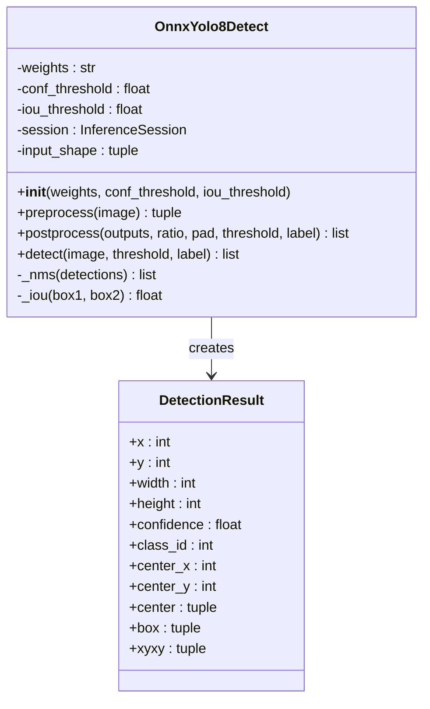
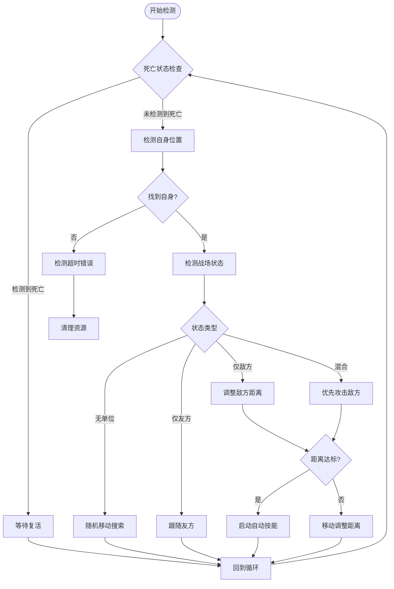
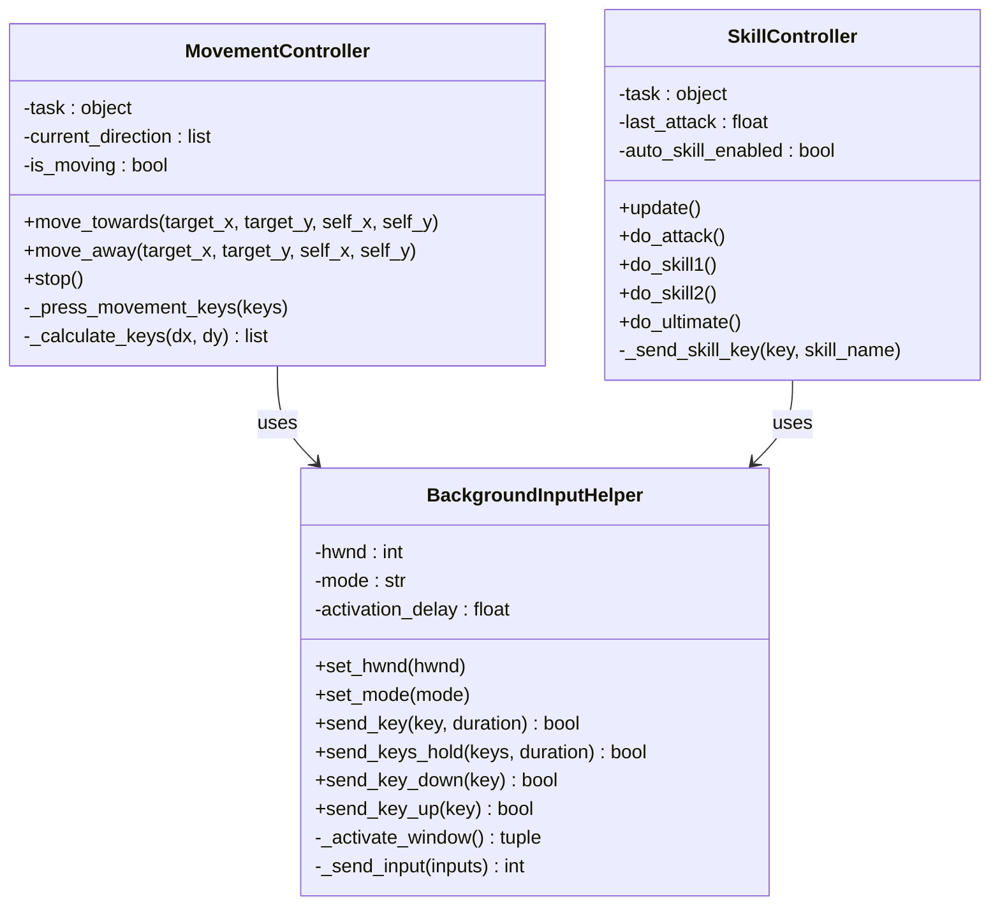
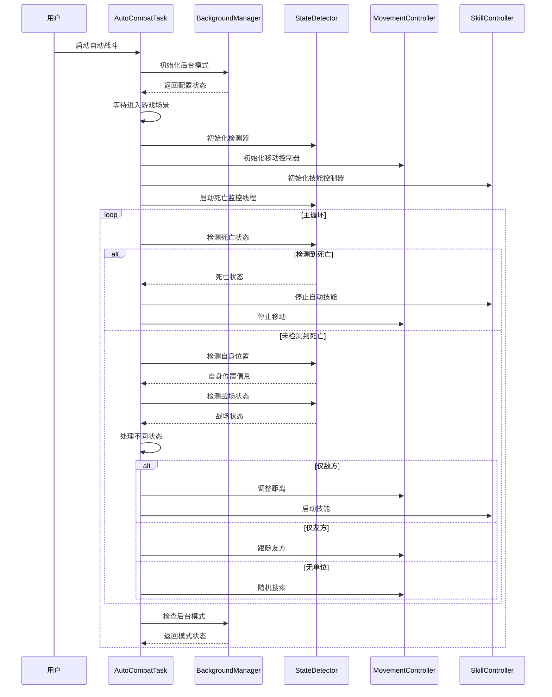
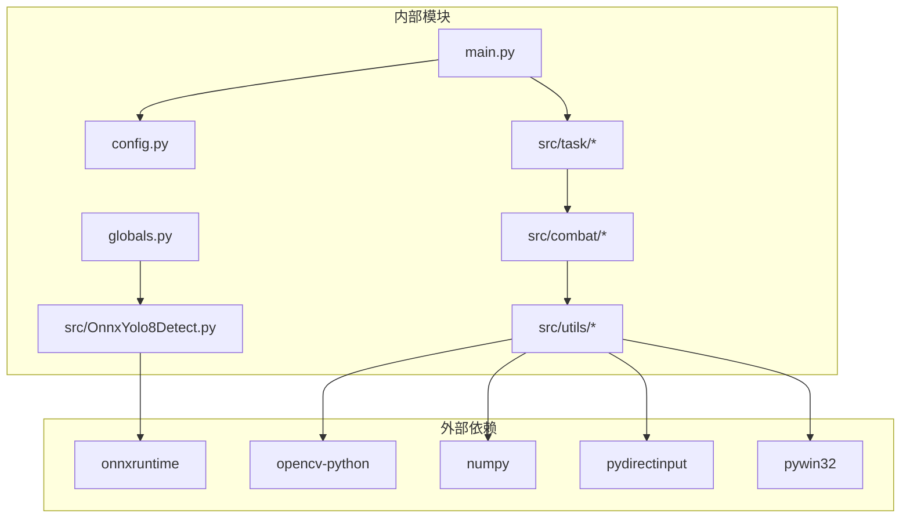

# 计算机视觉引擎

<cite>
**本文档引用的文件**
- [main.py](file://main.py)
- [OnnxYolo8Detect.py](file://src/OnnxYolo8Detect.py)
- [state_detector.py](file://src/combat/state_detector.py)
- [skill_controller.py](file://src/combat/skill_controller.py)
- [movement_controller.py](file://src/combat/movement_controller.py)
- [labels.py](file://src/combat/labels.py)
- [BackgroundInputHelper.py](file://src/utils/BackgroundInputHelper.py)
- [AutoCombatTask.py](file://src/task/AutoCombatTask.py)
- [config.py](file://config.py)
- [globals.py](file://src/globals.py)
- [BackgroundManager.py](file://src/utils/BackgroundManager.py)
- [PseudoMinimizeHelper.py](file://src/utils/PseudoMinimizeHelper.py)
- [ScreenshotHelper.py](file://src/utils/ScreenshotHelper.py)
- [requirements.txt](file://requirements.txt)
</cite>

## 目录
1. [简介](#简介)
2. [项目结构](#项目结构)
3. [核心组件](#核心组件)
4. [架构概览](#架构概览)
5. [详细组件分析](#详细组件分析)
6. [依赖关系分析](#依赖关系分析)
7. [性能考虑](#性能考虑)
8. [故障排除指南](#故障排除指南)
9. [结论](#结论)

## 简介

这是一个基于计算机视觉技术的游戏自动化引擎，专门用于实现自动战斗功能。该系统集成了YOLOv8目标检测算法、智能路径规划、技能释放控制和后台输入模拟等核心技术，能够在游戏窗口最小化或被遮挡的情况下继续运行。

系统的核心功能包括：
- **实时战场状态检测**：通过YOLOv8模型识别玩家、友方、敌方单位和死亡状态
- **智能移动控制**：根据战场态势自动调整角色位置
- **自动化技能释放**：基于距离和战斗状态智能释放技能
- **后台模式支持**：支持游戏窗口在后台时的持续运行
- **多平台兼容**：支持PC端键盘控制和移动端触摸控制

## 项目结构

**图表来源**
- [main.py:1-33](file://main.py#L1-L33)
- [config.py:1-145](file://config.py#L1-L145)
- [globals.py:1-227](file://src/globals.py#L1-L227)

**章节来源**
- [main.py:1-33](file://main.py#L1-L33)
- [config.py:1-145](file://config.py#L1-L145)

## 核心组件

### YOLOv8目标检测器

系统使用ONNX版本的YOLOv8模型进行实时目标检测，支持以下检测类别：
- **自己** (标签0)：玩家控制的角色
- **友方** (标签1)：队伍中的其他玩家
- **敌军** (标签2)：敌对玩家或NPC
- **死亡状态** (标签3)：角色死亡状态检测
- **目标圈** (标签4)：战斗目标指示器

检测器具备以下特性：
- **GPU加速支持**：优先使用CUDAExecutionProvider，回退到CPUExecutionProvider
- **预处理优化**：智能缩放和填充，保持图像比例
- **后处理优化**：NMS非极大值抑制，提高检测精度
- **实时性能**：支持高频检测需求

### 战斗状态检测器

负责实时监控战场态势，提供以下功能：
- **并行死亡检测**：独立线程持续监控死亡状态，响应延迟低至30ms
- **多目标检测**：同时检测自身、友方、敌方单位
- **状态判断**：根据检测结果判断战场状态（无单位、仅友方、仅敌方、混合）
- **距离计算**：计算与目标的最优距离范围（100-200像素）

### 移动控制系统

提供智能移动控制功能：
- **PC端支持**：WASD键盘控制，支持后台模式
- **移动端支持**：虚拟摇杆控制，预留扩展接口
- **智能路径规划**：根据距离和目标位置自动调整移动方向
- **防抖动机制**：避免微小偏移导致的频繁按键切换

### 技能控制系统

实现自动化技能释放：
- **配置驱动**：严格遵循GUI设置的技能开关和间隔
- **按键映射**：支持自定义热键配置
- **冷却管理**：精确管理各技能的冷却时间
- **多平台支持**：PC端键盘输入，移动端触摸点击

**章节来源**
- [OnnxYolo8Detect.py:1-311](file://src/OnnxYolo8Detect.py#L1-L311)
- [state_detector.py:1-446](file://src/combat/state_detector.py#L1-L446)
- [movement_controller.py:1-447](file://src/combat/movement_controller.py#L1-L447)
- [skill_controller.py:1-349](file://src/combat/skill_controller.py#L1-L349)

## 架构概览

**图表来源**
- [AutoCombatTask.py:191-265](file://src/task/AutoCombatTask.py#L191-L265)
- [state_detector.py:118-184](file://src/combat/state_detector.py#L118-L184)
- [movement_controller.py:93-152](file://src/combat/movement_controller.py#L93-L152)
- [skill_controller.py:141-153](file://src/combat/skill_controller.py#L141-L153)

## 详细组件分析

### YOLOv8检测器类结构

**图表来源**
- [OnnxYolo8Detect.py:17-254](file://src/OnnxYolo8Detect.py#L17-L254)
- [OnnxYolo8Detect.py:257-311](file://src/OnnxYolo8Detect.py#L257-L311)

### 战斗状态检测器工作流程

**图表来源**
- [state_detector.py:188-231](file://src/combat/state_detector.py#L188-L231)
- [state_detector.py:232-283](file://src/combat/state_detector.py#L232-L283)
- [state_detector.py:354-386](file://src/combat/state_detector.py#L354-L386)

### 后台输入控制系统

**图表来源**
- [BackgroundInputHelper.py:73-452](file://src/utils/BackgroundInputHelper.py#L73-L452)
- [movement_controller.py:24-447](file://src/combat/movement_controller.py#L24-L447)
- [skill_controller.py:24-349](file://src/combat/skill_controller.py#L24-L349)

**章节来源**
- [state_detector.py:70-184](file://src/combat/state_detector.py#L70-L184)
- [BackgroundInputHelper.py:147-252](file://src/utils/BackgroundInputHelper.py#L147-L252)

### 自动战斗任务执行流程

**图表来源**
- [AutoCombatTask.py:82-133](file://src/task/AutoCombatTask.py#L82-L133)
- [AutoCombatTask.py:191-265](file://src/task/AutoCombatTask.py#L191-L265)

**章节来源**
- [AutoCombatTask.py:32-133](file://src/task/AutoCombatTask.py#L32-L133)
- [AutoCombatTask.py:191-265](file://src/task/AutoCombatTask.py#L191-L265)

## 依赖关系分析

**图表来源**
- [requirements.txt:1-13](file://requirements.txt#L1-L13)
- [main.py:1-33](file://main.py#L1-L33)
- [config.py:1-145](file://config.py#L1-L145)

系统采用模块化设计，各组件职责清晰：
- **低耦合高内聚**：每个模块专注于特定功能
- **延迟加载**：YOLO模型按需加载，节省内存
- **配置驱动**：大部分行为通过配置文件控制
- **异常处理**：完善的错误处理和恢复机制

**章节来源**
- [requirements.txt:1-13](file://requirements.txt#L1-L13)
- [config.py:65-145](file://config.py#L65-L145)

## 性能考虑

### 检测性能优化

系统在保证准确性的同时，采用了多项性能优化措施：

1. **GPU加速优先**：优先使用CUDAExecutionProvider进行推理
2. **预处理优化**：智能缩放和填充，减少不必要的计算
3. **后处理优化**：NMS算法优化，提高检测效率
4. **内存管理**：YOLO模型延迟加载，避免启动时占用过多内存

### 后台模式性能

- **伪最小化技术**：窗口移至屏幕外但仍保持活动状态
- **后台输入模拟**：使用SendInput绕过DirectInput限制
- **资源监控**：动态调整触发间隔降低CPU使用率

### 实时性保障

- **并行死亡检测**：独立线程持续监控，响应延迟低
- **智能重试机制**：检测失败时自动重试，保证稳定性
- **状态缓存**：常用状态信息缓存，减少重复计算

## 故障排除指南

### 常见问题及解决方案

#### YOLO模型加载失败
**症状**：启动时提示"YOLO模型文件不存在"
**解决方法**：
1. 确认assets/Fight/fight.onnx文件存在
2. 检查文件权限和完整性
3. 重新下载或重新训练模型

#### 后台输入失败
**症状**：游戏窗口最小化后无法正常操作
**解决方法**：
1. 检查Windows版本兼容性
2. 确认管理员权限运行
3. 尝试不同的输入模式（前台/伪最小化）

#### 检测精度问题
**症状**：目标检测不准确或漏检
**解决方法**：
1. 调整置信度阈值（conf_threshold）
2. 检查游戏分辨率和缩放设置
3. 确保游戏窗口无遮挡

#### 性能问题
**症状**：CPU使用率过高或响应延迟
**解决方法**：
1. 增加触发间隔（trigger interval）
2. 降低检测频率
3. 检查硬件性能和驱动更新

**章节来源**
- [globals.py:182-198](file://src/globals.py#L182-L198)
- [BackgroundInputHelper.py:147-252](file://src/utils/BackgroundInputHelper.py#L147-L252)
- [BackgroundManager.py:91-111](file://src/utils/BackgroundManager.py#L91-L111)

## 结论

该计算机视觉引擎通过集成先进的YOLOv8目标检测技术和智能控制算法，实现了高度自动化的游戏战斗功能。系统具有以下优势：

1. **技术先进性**：采用最新的深度学习技术和后台输入模拟技术
2. **稳定性强**：完善的错误处理和恢复机制，支持长时间稳定运行
3. **可扩展性好**：模块化设计，易于添加新功能和适配新游戏
4. **用户体验佳**：配置驱动的GUI界面，支持个性化定制

未来可以考虑的功能增强：
- 支持更多游戏场景和目标类型
- 集成更高级的AI决策算法
- 提供更丰富的可视化和调试功能
- 优化移动端适配和性能

该系统为游戏自动化领域提供了完整的解决方案，具有良好的实用价值和推广前景。