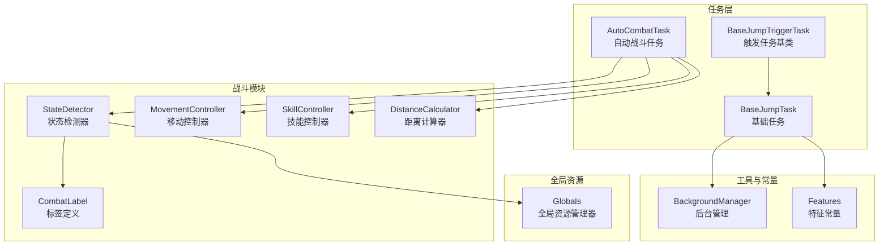
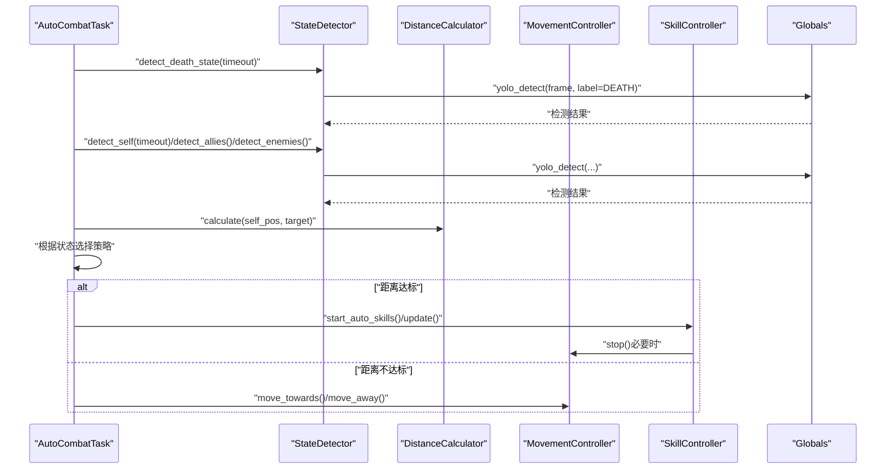
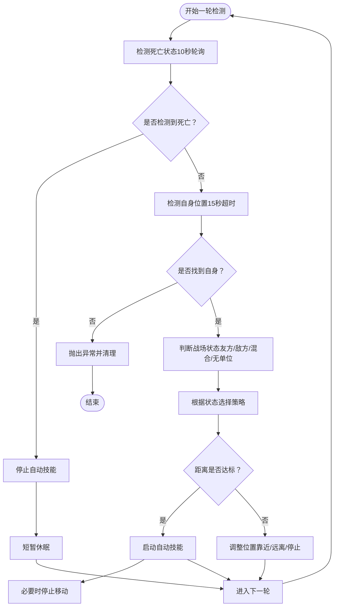
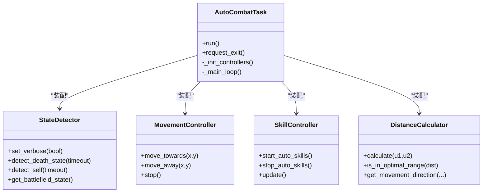
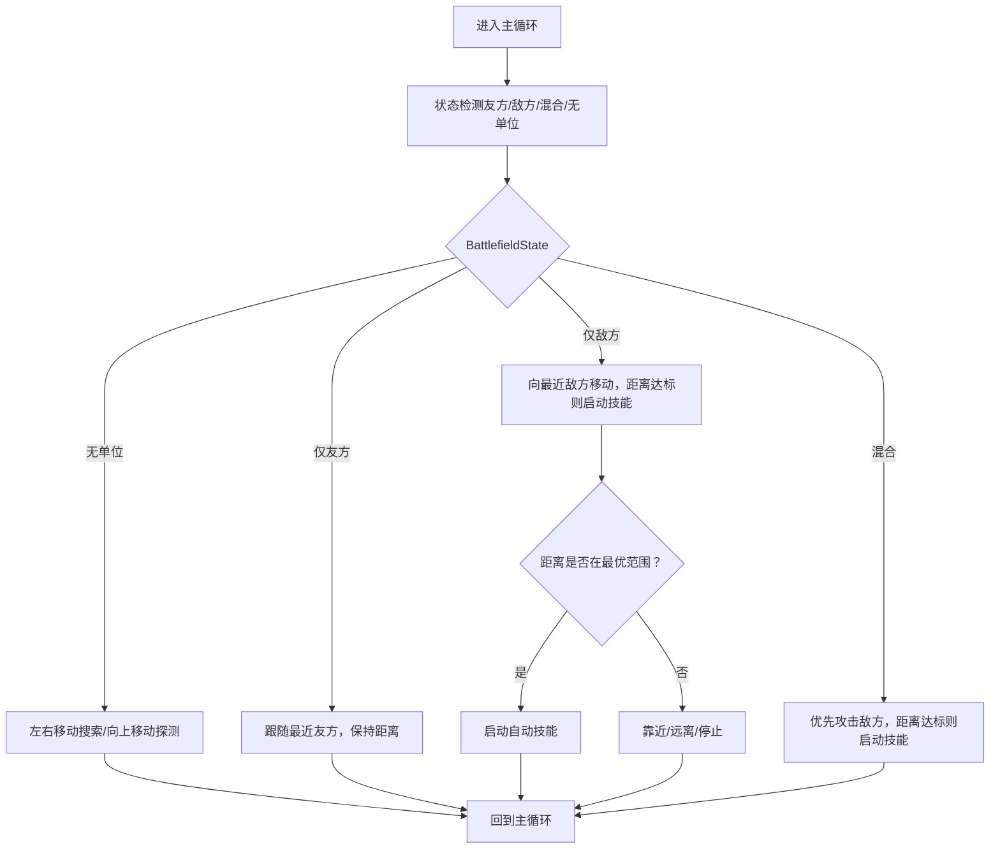
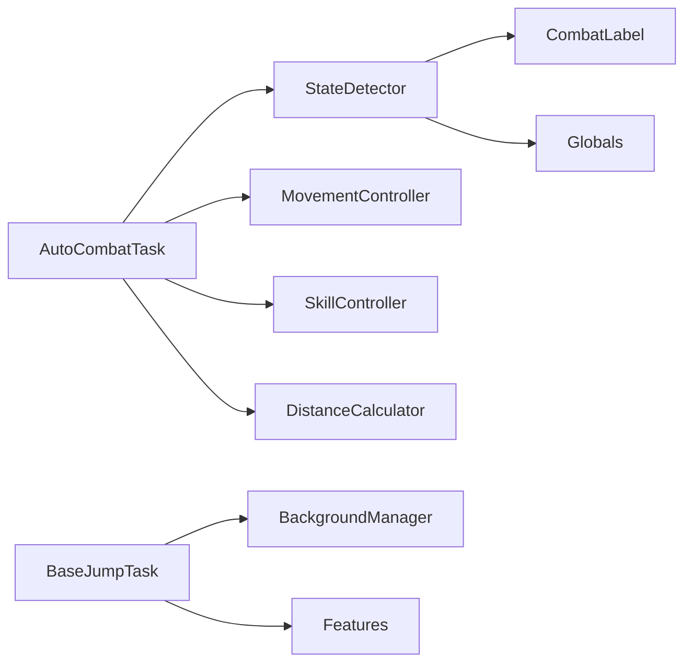

# 设计模式应用

<cite>
**本文引用的文件**
- [AutoCombatTask.py](file://src/task/AutoCombatTask.py)
- [BaseJumpTriggerTask.py](file://src/task/BaseJumpTriggerTask.py)
- [BaseJumpTask.py](file://src/task/BaseJumpTask.py)
- [mixins.py](file://src/task/mixins.py)
- [state_detector.py](file://src/combat/state_detector.py)
- [movement_controller.py](file://src/combat/movement_controller.py)
- [skill_controller.py](file://src/combat/skill_controller.py)
- [distance_calculator.py](file://src/combat/distance_calculator.py)
- [labels.py](file://src/combat/labels.py)
- [BackgroundManager.py](file://src/utils/BackgroundManager.py)
- [features.py](file://src/constants/features.py)
- [globals.py](file://src/globals.py)
</cite>

## 目录
1. [引言](#引言)
2. [项目结构](#项目结构)
3. [核心组件](#核心组件)
4. [架构总览](#架构总览)
5. [详细组件分析](#详细组件分析)
6. [依赖分析](#依赖分析)
7. [性能考虑](#性能考虑)
8. [故障排查指南](#故障排查指南)
9. [结论](#结论)
10. [附录](#附录)

## 引言
本文件聚焦于 OK-Jump 项目中设计模式的应用与落地，围绕以下主题展开：
- 观察者模式在状态监听中的应用：通过“状态检测器”对战场状态的持续监测，实现对“死亡状态”“自身位置”“友方/敌方单位”的轮询与事件式反馈。
- 工厂模式在控制器创建中的使用：在任务中集中初始化与装配多个控制器（状态检测、移动、技能、距离计算），形成“控制器工厂式”组合。
- 策略模式在战斗策略选择中的体现：根据战场状态（无单位、仅友方、仅敌方、混合）选择不同的行为策略，并在距离达标与否时切换“自动技能释放”策略。

同时，文档解释每种设计模式如何解决特定的架构问题，给出具体实现细节与代码路径引用，并总结模式间的协作关系与最佳实践。

## 项目结构
项目采用分层与功能域结合的组织方式：
- 顶层入口与配置位于仓库根目录，业务逻辑集中在 src 目录。
- 任务层（task）：负责编排与调度，包含触发任务基类与具体任务（如自动战斗任务）。
- 战斗模块（combat）：封装状态检测、移动控制、技能控制、距离计算等子系统。
- 工具与常量（utils、constants）：提供分辨率适配、后台管理、特征常量等支撑能力。
- 全局资源（globals）：提供全局资源管理与延迟加载的 YOLO 检测器。

**图表来源**
- [AutoCombatTask.py:1-431](file://src/task/AutoCombatTask.py#L1-L431)
- [BaseJumpTriggerTask.py:1-30](file://src/task/BaseJumpTriggerTask.py#L1-L30)
- [BaseJumpTask.py:1-295](file://src/task/BaseJumpTask.py#L1-L295)
- [state_detector.py:1-315](file://src/combat/state_detector.py#L1-L315)
- [movement_controller.py:1-311](file://src/combat/movement_controller.py#L1-L311)
- [skill_controller.py:1-181](file://src/combat/skill_controller.py#L1-L181)
- [distance_calculator.py:1-139](file://src/combat/distance_calculator.py#L1-L139)
- [labels.py:1-51](file://src/combat/labels.py#L1-L51)
- [BackgroundManager.py:1-145](file://src/utils/BackgroundManager.py#L1-L145)
- [features.py:1-86](file://src/constants/features.py#L1-L86)
- [globals.py:1-227](file://src/globals.py#L1-L227)

**章节来源**
- [AutoCombatTask.py:1-431](file://src/task/AutoCombatTask.py#L1-L431)
- [BaseJumpTriggerTask.py:1-30](file://src/task/BaseJumpTriggerTask.py#L1-L30)
- [BaseJumpTask.py:1-295](file://src/task/BaseJumpTask.py#L1-L295)

## 核心组件
- 自动战斗任务（AutoCombatTask）：作为触发任务，负责主循环、状态检测、策略决策与控制器编排。
- 状态检测器（StateDetector）：基于 YOLO 模型进行死亡状态、自身、友方、敌方的检测，并提供战场状态判定与最近目标选择。
- 移动控制器（MovementController）：根据平台差异（PC/ADB）执行移动操作（WASD 键盘或虚拟摇杆滑动）。
- 技能控制器（SkillController）：根据配置周期性释放技能，支持自动技能开关与冷却管理。
- 距离计算器（DistanceCalculator）：提供距离计算、最优范围判断与移动方向建议。
- 触发任务基类（BaseJumpTriggerTask）与任务混入（JumpTaskMixin）：提供通用的游戏状态检测、分辨率适配、后台模式支持等能力。
- 全局资源管理器（Globals）：延迟加载 YOLO 模型并提供统一检测接口。

**章节来源**
- [AutoCombatTask.py:25-125](file://src/task/AutoCombatTask.py#L25-L125)
- [state_detector.py:23-60](file://src/combat/state_detector.py#L23-L60)
- [movement_controller.py:11-44](file://src/combat/movement_controller.py#L11-L44)
- [skill_controller.py:12-51](file://src/combat/skill_controller.py#L12-L51)
- [distance_calculator.py:10-34](file://src/combat/distance_calculator.py#L10-L34)
- [BaseJumpTriggerTask.py:13-29](file://src/task/BaseJumpTriggerTask.py#L13-L29)
- [mixins.py:12-25](file://src/task/mixins.py#L12-L25)
- [globals.py:16-58](file://src/globals.py#L16-L58)

## 架构总览
OK-Jump 的战斗自动化采用“任务编排 + 子系统解耦 + 策略选择”的架构：
- 任务层（AutoCombatTask）负责整体流程与状态机，通过状态检测器获取环境信息，再根据距离计算器与策略逻辑决定移动与技能释放。
- 控制器层（Movement/Skill）负责与底层设备交互，屏蔽平台差异。
- 全局资源层（Globals）提供模型与资源的统一入口，避免各模块重复初始化。

**图表来源**
- [AutoCombatTask.py:165-243](file://src/task/AutoCombatTask.py#L165-L243)
- [state_detector.py:62-103](file://src/combat/state_detector.py#L62-L103)
- [distance_calculator.py:35-104](file://src/combat/distance_calculator.py#L35-L104)
- [movement_controller.py:45-103](file://src/combat/movement_controller.py#L45-L103)
- [skill_controller.py:53-102](file://src/combat/skill_controller.py#L53-L102)
- [globals.py:200-222](file://src/globals.py#L200-L222)

## 详细组件分析

### 观察者模式在状态监听中的应用
- 角色定位
  - 状态发布者：状态检测器（StateDetector）持续从当前帧中提取“死亡状态”“自身位置”“友方/敌方单位”等信息。
  - 状态订阅者：自动战斗任务（AutoCombatTask）订阅这些状态变化，驱动后续策略与动作。
- 实现要点
  - 轮询与超时：检测器对关键状态（如死亡状态）进行定时轮询，对自身位置设定超时上限，保证鲁棒性。
  - 事件式反馈：任务层在每次主循环中读取最新状态，相当于“事件回调式”的状态消费。
  - 日志与可视化：检测器支持详细日志开关，任务层汇总输出状态摘要，便于调试与监控。
- 代码路径
  - 状态轮询与超时：[detect_death_state:62-103](file://src/combat/state_detector.py#L62-L103)、[detect_self:105-152](file://src/combat/state_detector.py#L105-L152)
  - 任务侧订阅与策略：[主循环与状态处理:165-243](file://src/task/AutoCombatTask.py#L165-L243)、[状态汇总日志:186-189](file://src/task/AutoCombatTask.py#L186-L189)

**图表来源**
- [state_detector.py:62-152](file://src/combat/state_detector.py#L62-L152)
- [AutoCombatTask.py:165-243](file://src/task/AutoCombatTask.py#L165-L243)

**章节来源**
- [state_detector.py:62-152](file://src/combat/state_detector.py#L62-L152)
- [AutoCombatTask.py:165-243](file://src/task/AutoCombatTask.py#L165-L243)

### 工厂模式在控制器创建中的使用
- 角色定位
  - 工厂：自动战斗任务（AutoCombatTask）集中初始化与装配多个控制器（状态检测、移动、技能、距离计算）。
- 实现要点
  - 统一装配：在任务初始化阶段创建控制器实例，并将任务上下文（如配置、日志、帧数据）注入各控制器。
  - 解耦与扩展：新增控制器时只需在工厂方法中注册，无需修改业务主循环逻辑。
  - 平台适配：控制器内部通过 is_adb/is_pc 等判断实现跨平台行为。
- 代码路径
  - 控制器工厂式装配：[_init_controllers:115-128](file://src/task/AutoCombatTask.py#L115-L128)
  - 控制器职责边界：[StateDetector:23-60](file://src/combat/state_detector.py#L23-L60)、[MovementController:11-44](file://src/combat/movement_controller.py#L11-L44)、[SkillController:12-51](file://src/combat/skill_controller.py#L12-L51)、[DistanceCalculator:10-34](file://src/combat/distance_calculator.py#L10-L34)

**图表来源**
- [AutoCombatTask.py:115-128](file://src/task/AutoCombatTask.py#L115-L128)
- [state_detector.py:23-60](file://src/combat/state_detector.py#L23-L60)
- [movement_controller.py:11-44](file://src/combat/movement_controller.py#L11-L44)
- [skill_controller.py:12-51](file://src/combat/skill_controller.py#L12-L51)
- [distance_calculator.py:10-34](file://src/combat/distance_calculator.py#L10-L34)

**章节来源**
- [AutoCombatTask.py:115-128](file://src/task/AutoCombatTask.py#L115-L128)
- [state_detector.py:23-60](file://src/combat/state_detector.py#L23-L60)
- [movement_controller.py:11-44](file://src/combat/movement_controller.py#L11-L44)
- [skill_controller.py:12-51](file://src/combat/skill_controller.py#L12-L51)
- [distance_calculator.py:10-34](file://src/combat/distance_calculator.py#L10-L34)

### 策略模式在战斗策略选择中的体现
- 角色定位
  - 策略接口：根据战场状态（无单位、仅友方、仅敌方、混合）定义不同行为策略。
  - 策略实现：任务层在主循环中依据状态与距离计算结果，选择“移动/停止/启动自动技能”等策略。
- 实现要点
  - 状态机：通过状态检测器返回的 BattlefieldState 枚举，任务层分流到不同处理分支。
  - 距离策略：借助距离计算器判断“最优范围”，在达标时启动自动技能，在不达标时调整位置。
  - 可扩展性：新增状态或策略时，只需扩展状态枚举与对应处理方法，不影响其他策略。
- 代码路径
  - 状态枚举与判断：[BattlefieldState:15-21](file://src/combat/state_detector.py#L15-L21)、[get_battlefield_state_detailed:233-255](file://src/combat/state_detector.py#L233-L255)
  - 策略分发与执行：[_handle_battlefield_state:274-290](file://src/task/AutoCombatTask.py#L274-L290)、[_handle_enemies_only/_handle_allies_only/_handle_mixed/_handle_no_units:340-394](file://src/task/AutoCombatTask.py#L340-L394)
  - 距离策略：[_maintain_distance:396-420](file://src/task/AutoCombatTask.py#L396-L420)、[DistanceCalculator.is_in_optimal_range:67-77](file://src/combat/distance_calculator.py#L67-L77)

**图表来源**
- [state_detector.py:233-255](file://src/combat/state_detector.py#L233-L255)
- [AutoCombatTask.py:274-394](file://src/task/AutoCombatTask.py#L274-L394)
- [distance_calculator.py:67-104](file://src/combat/distance_calculator.py#L67-L104)

**章节来源**
- [state_detector.py:15-255](file://src/combat/state_detector.py#L15-L255)
- [AutoCombatTask.py:274-394](file://src/task/AutoCombatTask.py#L274-L394)
- [distance_calculator.py:67-104](file://src/combat/distance_calculator.py#L67-L104)

### 模式间的协作关系与最佳实践
- 观察者 + 策略：状态检测器提供“事件源”，任务层根据事件内容选择策略；策略内部再结合距离计算器进行细粒度控制。
- 工厂 + 策略：控制器工厂统一装配，策略在任务层集中编排，降低耦合度，提升可维护性。
- 最佳实践
  - 将“状态来源”“策略决策”“动作执行”三层清晰分离，避免交叉污染。
  - 使用统一的全局资源（如 Globals）提供模型与配置，减少重复初始化。
  - 为每个控制器提供平台适配与错误兜底，确保在异常情况下能安全停止。

**章节来源**
- [AutoCombatTask.py:115-128](file://src/task/AutoCombatTask.py#L115-L128)
- [globals.py:172-222](file://src/globals.py#L172-L222)

## 依赖分析
- 任务层依赖
  - AutoCombatTask 依赖战斗模块（状态检测、移动、技能、距离计算）、任务混入（分辨率、后台模式）、特征常量（场景检测）。
- 战斗模块依赖
  - StateDetector 依赖标签定义与全局资源（YOLO 检测器）。
  - MovementController/SkillController 依赖任务上下文（帧、输入事件）。
- 工具与常量
  - BackgroundManager 提供后台模式与伪最小化支持，为任务层提供运行环境保障。
  - Features 提供统一的特征名称常量，确保场景检测一致性。

**图表来源**
- [AutoCombatTask.py:15-22](file://src/task/AutoCombatTask.py#L15-L22)
- [state_detector.py:12-12](file://src/combat/state_detector.py#L12-L12)
- [labels.py:8-37](file://src/combat/labels.py#L8-L37)
- [globals.py:172-198](file://src/globals.py#L172-L198)
- [BaseJumpTask.py:1-8](file://src/task/BaseJumpTask.py#L1-L8)
- [BackgroundManager.py:1-145](file://src/utils/BackgroundManager.py#L1-L145)
- [features.py:9-86](file://src/constants/features.py#L9-L86)

**章节来源**
- [AutoCombatTask.py:15-22](file://src/task/AutoCombatTask.py#L15-L22)
- [state_detector.py:12-12](file://src/combat/state_detector.py#L12-L12)
- [labels.py:8-37](file://src/combat/labels.py#L8-L37)
- [globals.py:172-198](file://src/globals.py#L172-L198)
- [BaseJumpTask.py:1-8](file://src/task/BaseJumpTask.py#L1-L8)
- [BackgroundManager.py:1-145](file://src/utils/BackgroundManager.py#L1-L145)
- [features.py:9-86](file://src/constants/features.py#L9-L86)

## 性能考虑
- 检测频率与超时
  - 死亡状态轮询与自身检测分别设置超时阈值，避免长时间阻塞主循环。
- 距离计算与策略
  - 距离计算采用简单欧氏距离，策略判断在主循环中短暂停顿，整体开销可控。
- 资源管理
  - YOLO 模型延迟加载与重置，减少初始化成本；全局资源统一入口，避免重复加载。
- 平台差异
  - 移动与技能控制器针对 PC/ADB 分支处理，避免不必要的输入操作。

[本节为通用性能讨论，不直接分析具体文件]

## 故障排查指南
- 自身检测超时
  - 现象：15 秒内未检测到自身位置，任务抛出异常并记录帧信息。
  - 排查：确认截图可用性、分辨率适配、YOLO 模型加载状态。
  - 参考路径：[自身检测超时处理:212-215](file://src/task/AutoCombatTask.py#L212-L215)、[帧信息记录:244-251](file://src/task/AutoCombatTask.py#L244-L251)
- 死亡状态检测
  - 现象：检测到死亡状态时自动停止技能并等待复活。
  - 排查：确认 YOLO 模型对“死亡状态”标签的识别效果。
  - 参考路径：[死亡状态检测:62-103](file://src/combat/state_detector.py#L62-L103)
- 后台模式与窗口状态
  - 现象：窗口被遮挡或最小化导致截图异常。
  - 排查：检查后台模式配置、伪最小化开关、窗口句柄有效性。
  - 参考路径：[后台状态检查:36-65](file://src/utils/BackgroundManager.py#L36-L65)、[任务层后台检查:272-291](file://src/task/mixins.py#L272-L291)

**章节来源**
- [AutoCombatTask.py:212-251](file://src/task/AutoCombatTask.py#L212-L251)
- [state_detector.py:62-103](file://src/combat/state_detector.py#L62-L103)
- [BackgroundManager.py:36-65](file://src/utils/BackgroundManager.py#L36-L65)
- [mixins.py:272-291](file://src/task/mixins.py#L272-L291)

## 结论
OK-Jump 通过“观察者模式 + 工厂模式 + 策略模式”的协同，实现了稳定、可扩展的自动战斗系统：
- 观察者模式使状态检测与任务决策解耦，提高响应性与可维护性；
- 工厂模式统一控制器装配，降低模块间耦合；
- 策略模式将复杂的状态与距离决策抽象为可扩展的行为分支，便于演进与测试。

建议在后续迭代中进一步：
- 将“策略选择”抽象为独立策略接口，便于单元测试与插拔式扩展；
- 增加状态变更事件通知机制，减少轮询带来的 CPU 占用；
- 对 YOLO 检测结果增加缓存与去抖动，提升稳定性与性能。

[本节为总结性内容，不直接分析具体文件]

## 附录
- 术语
  - 触发任务：由外部条件驱动执行的任务类型，适用于需要周期性检查与响应的场景。
  - 混入（Mixin）：通过多重继承引入通用功能，避免重复代码。
  - 策略模式：定义一系列算法并将每种算法封装起来，使它们可以相互替换。
- 相关实现路径
  - 触发任务基类与混入：[BaseJumpTriggerTask:13-29](file://src/task/BaseJumpTriggerTask.py#L13-L29)、[JumpTaskMixin:12-25](file://src/task/mixins.py#L12-L25)
  - 全局资源与 YOLO 检测：[Globals:16-58](file://src/globals.py#L16-L58)、[yolo_detect:200-222](file://src/globals.py#L200-L222)
  - 标签定义与特征常量：[CombatLabel:8-50](file://src/combat/labels.py#L8-L50)、[Features:9-86](file://src/constants/features.py#L9-L86)

**章节来源**
- [BaseJumpTriggerTask.py:13-29](file://src/task/BaseJumpTriggerTask.py#L13-L29)
- [mixins.py:12-25](file://src/task/mixins.py#L12-L25)
- [globals.py:16-58](file://src/globals.py#L16-L58)
- [labels.py:8-50](file://src/combat/labels.py#L8-L50)
- [features.py:9-86](file://src/constants/features.py#L9-L86)