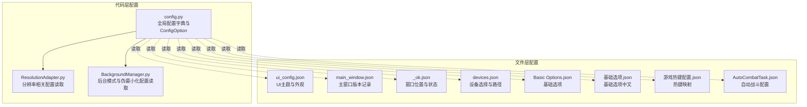
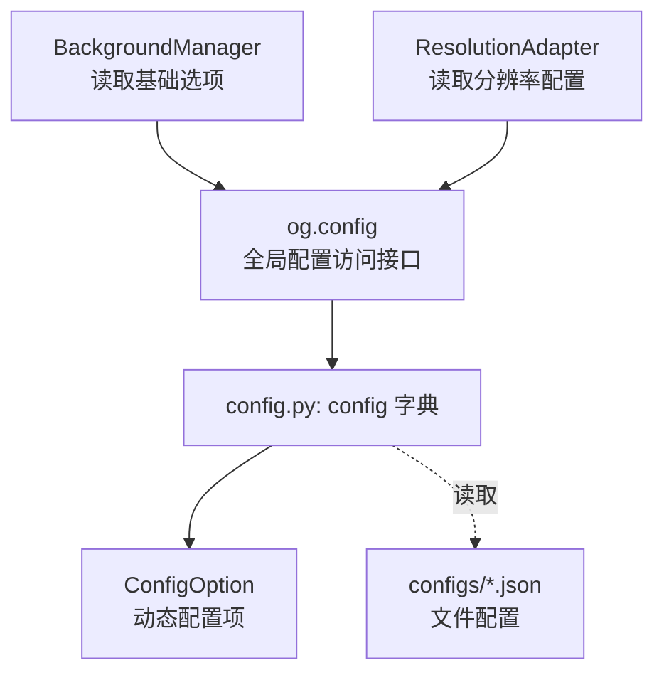
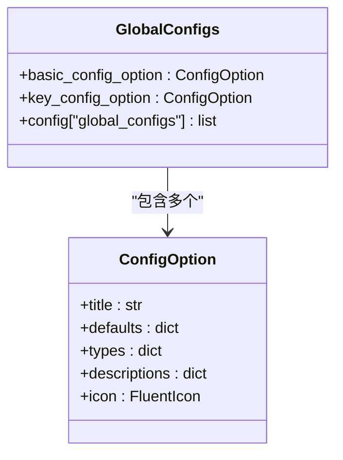
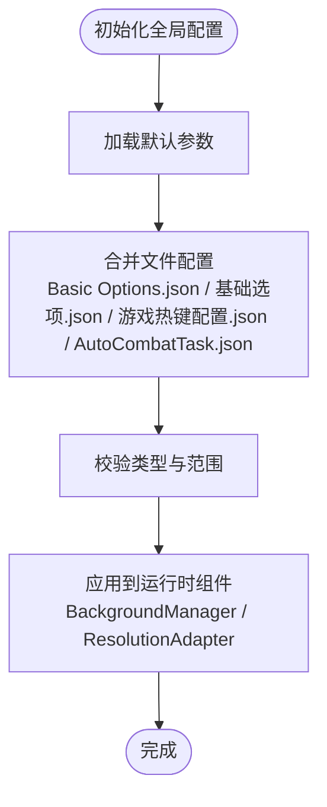
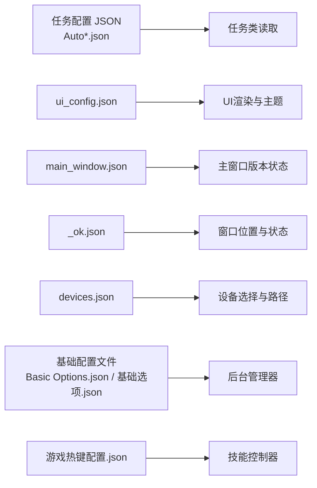
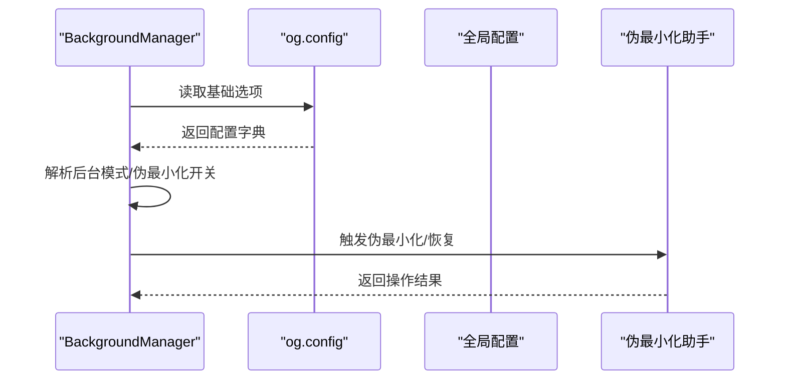
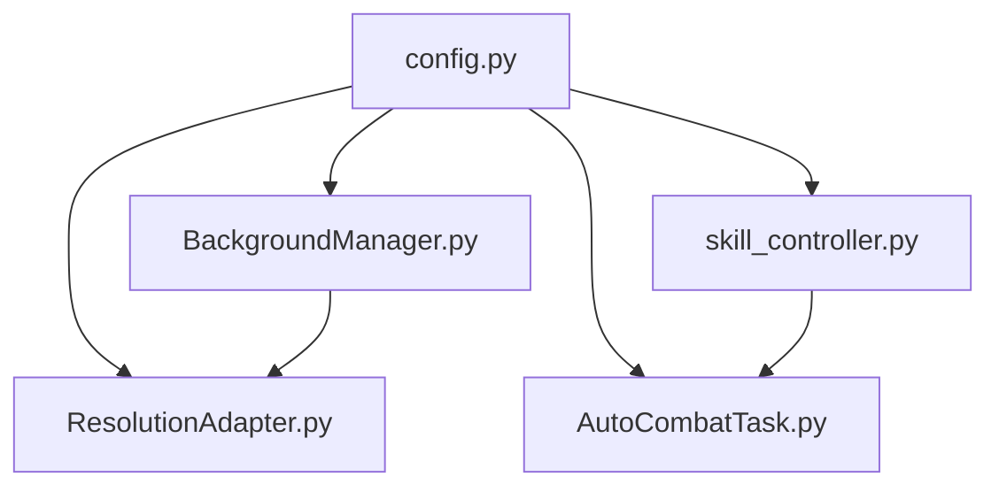

# 配置系统架构

<cite>
**本文档引用的文件**
- [config.py](file://config.py)
- [Basic Options.json](file://configs/Basic Options.json)
- [基础选项.json](file://configs/基础选项.json)
- [AutoCombatTask.json](file://configs/AutoCombatTask.json)
- [游戏热键配置.json](file://configs/游戏热键配置.json)
- [ui_config.json](file://configs/ui_config.json)
- [main_window.json](file://configs/main_window.json)
- [_ok.json](file://configs/_ok.json)
- [devices.json](file://configs/devices.json)
- [BackgroundManager.py](file://src/utils/BackgroundManager.py)
- [PseudoMinimizeHelper.py](file://src/utils/PseudoMinimizeHelper.py)
- [AutoCombatTask.py](file://src/task/AutoCombatTask.py)
- [skill_controller.py](file://src/combat/skill_controller.py)
</cite>

## 更新摘要
**所做更改**
- 新增基础配置文件Basic Options.json与基础选项.json的对比分析
- 改进AutoCombatTask.json配置结构说明
- 新增JSON配置管理机制的详细说明
- 更新配置文件加载顺序与优先级处理
- 完善热更新支持与最佳实践指南

## 目录
1. [引言](#引言)
2. [项目结构](#项目结构)
3. [核心组件](#核心组件)
4. [架构总览](#架构总览)
5. [详细组件分析](#详细组件分析)
6. [依赖关系分析](#依赖关系分析)
7. [性能考虑](#性能考虑)
8. [故障排除指南](#故障排除指南)
9. [结论](#结论)
10. [附录](#附录)

## 引言
本文件面向OK-Jump项目的开发者与维护者，系统性阐述配置系统的层次结构、管理机制与扩展方法。重点覆盖以下方面：
- 全局配置、任务配置与用户界面配置的组织方式
- ConfigOption类的设计与配置项的动态生成机制
- 配置文件的加载顺序与优先级处理
- 热更新支持与最佳实践
- 配置扩展指南与常见问题排查

## 项目结构
OK-Jump的配置体系由"代码层配置"和"文件层配置"两部分组成：
- 代码层配置：通过config.py中的字典与ConfigOption对象集中声明全局参数、窗口尺寸、设备信息、任务映射等。
- 文件层配置：位于configs目录下的JSON文件，用于存储用户界面状态、设备选择、任务参数等。

**图表来源**
- [config.py:65-145](file://config.py#L65-L145)
- [BackgroundManager.py:18-31](file://src/utils/BackgroundManager.py#L18-L31)

**章节来源**
- [config.py:1-145](file://config.py#L1-L145)
- [Basic Options.json:1-13](file://configs/Basic Options.json#L1-L13)
- [基础选项.json:1-11](file://configs/基础选项.json#L1-L11)
- [AutoCombatTask.json:1-13](file://configs/AutoCombatTask.json#L1-L13)
- [游戏热键配置.json:1-6](file://configs/游戏热键配置.json#L1-L6)
- [ui_config.json:1-17](file://configs/ui_config.json#L1-L17)
- [main_window.json:1-3](file://configs/main_window.json#L1-L3)
- [_ok.json:1-7](file://configs/_ok.json#L1-L7)
- [devices.json:1-7](file://configs/devices.json#L1-L7)

## 核心组件
- 全局配置中心：config.py中的config字典，集中定义应用的全局行为、窗口与日志、任务映射、场景与资源路径等。
- 动态配置项：通过ConfigOption类声明的可动态生成的配置项，如"基本设置"和"游戏热键配置"，支持图标、类型与描述等元数据。
- 文件配置：configs目录下的JSON文件，承载用户界面状态、设备选择、基础选项与热键映射等持久化配置。
- 运行时配置读取：BackgroundManager与ResolutionAdapter分别从全局配置中读取后台模式、伪最小化、分辨率参考与支持比例等参数。

**章节来源**
- [config.py:23-63](file://config.py#L23-L63)
- [config.py:65-145](file://config.py#L65-L145)
- [BackgroundManager.py:18-31](file://src/utils/BackgroundManager.py#L18-L31)

## 架构总览
配置系统采用"代码声明 + 文件持久化"的双层架构：
- 代码层负责定义默认值、类型约束、描述信息与UI展示元数据；文件层负责存储用户实际修改后的值。
- 运行时通过全局对象og（来自ok框架）访问配置，实现按需读取与热更新。

**图表来源**
- [config.py:65-145](file://config.py#L65-L145)
- [BackgroundManager.py:25-31](file://src/utils/BackgroundManager.py#L25-L31)

## 详细组件分析

### ConfigOption类与动态配置生成
ConfigOption用于声明一组具有统一标题、描述、图标与类型约束的配置项。其典型用途包括：
- 将"基本设置"和"游戏热键配置"等配置项以统一的UI控件呈现
- 为下拉框、开关等控件提供类型与选项定义
- 通过config['global_configs']将多个ConfigOption聚合到全局配置中

**图表来源**
- [config.py:23-63](file://config.py#L23-L63)
- [config.py:73](file://config.py#L73)

**章节来源**
- [config.py:23-63](file://config.py#L23-L63)
- [config.py:65-73](file://config.py#L65-L73)

### 全局配置（config.py）
全局配置涵盖以下关键域：
- 应用元信息：调试开关、GUI开关、配置文件夹、图标与标题、版本号
- OCR与模板匹配：OCR库选择、ONNX参数、COCO特征文件路径、默认阈值
- 窗口与设备：窗口标题、可执行文件名、窗口类名、交互模式、捕获方法
- ADB支持：ADB开关与包名
- 分辨率与参考分辨率：支持的比例、最小尺寸、目标缩放序列
- 窗口尺寸：默认宽高与最小宽高
- 日志与截图：日志文件路径、错误日志路径、截图保存目录
- 任务映射：一次性任务、触发式任务、自定义标签页、场景类
- GUI场景：场景模块与类名

**图表来源**
- [config.py:65-145](file://config.py#L65-L145)

**章节来源**
- [config.py:65-145](file://config.py#L65-L145)

### 基础配置文件管理
OK-Jump项目包含多套基础配置文件，每套文件针对不同的使用场景：

#### 英文基础配置（Basic Options.json）
- 包含英文键名的配置项
- 适用于国际化环境
- 键值包括：启动时自动开始游戏、最小化到系统托盘、后台模式等

#### 中文基础配置（基础选项.json）
- 包含中文键名的配置项  
- 适用于中文用户环境
- 键值包括：后台模式、最小化时伪最小化、后台时静音游戏等

#### 配置文件对比分析
| 配置项 | Basic Options.json | 基础选项.json |
|--------|-------------------|---------------|
| 后台模式 | Auto Start Game When App Starts | 后台模式 |
| 最小化处理 | Minimize Window to System Tray when Closing | 最小化时伪最小化 |
| 静音设置 | Mute Game while in Background | 后台时静音游戏 |
| 窗口管理 | Auto Resize Game Window | 自动调整游戏窗口大小 |
| 退出行为 | Exit App when Game Exits | 游戏退出时关闭程序 |

**章节来源**
- [Basic Options.json:1-13](file://configs/Basic Options.json#L1-L13)
- [基础选项.json:1-11](file://configs/基础选项.json#L1-L11)

### 任务配置与用户界面配置
- 任务配置：各任务的JSON文件（如AutoCombatTask.json、AutoLoginTask.json等）存储任务参数与行为开关，供任务类在运行时读取。
- 用户界面配置：ui_config.json控制主题颜色、主题模式、DPI缩放、语言、是否启用Mica等；main_window.json记录上次版本；_ok.json记录窗口位置与最大化状态；devices.json记录设备选择与可执行文件路径。

**图表来源**
- [AutoCombatTask.json:1-13](file://configs/AutoCombatTask.json#L1-L13)
- [游戏热键配置.json:1-6](file://configs/游戏热键配置.json#L1-L6)
- [ui_config.json:1-17](file://configs/ui_config.json#L1-L17)
- [main_window.json:1-3](file://configs/main_window.json#L1-L3)
- [_ok.json:1-7](file://configs/_ok.json#L1-L7)
- [devices.json:1-7](file://configs/devices.json#L1-L7)

**章节来源**
- [AutoCombatTask.json:1-13](file://configs/AutoCombatTask.json#L1-L13)
- [游戏热键配置.json:1-6](file://configs/游戏热键配置.json#L1-L6)
- [ui_config.json:1-17](file://configs/ui_config.json#L1-L17)
- [main_window.json:1-3](file://configs/main_window.json#L1-L3)
- [_ok.json:1-7](file://configs/_ok.json#L1-L7)
- [devices.json:1-7](file://configs/devices.json#L1-L7)

### 运行时配置读取与热更新
- 后台模式与伪最小化：BackgroundManager通过读取基础选项中的"后台模式""最小化时伪最小化"等键，动态决定是否启用伪最小化与静音策略。
- 分辨率适配：ResolutionAdapter从全局配置读取参考分辨率与支持比例，在窗口尺寸变化时计算缩放因子并判断当前分辨率有效性。
- 热更新机制：通过og.config访问配置，运行时可直接读取最新值；若需要热替换，可在配置变更后调用对应组件的update_config或重载逻辑。

**图表来源**
- [BackgroundManager.py:18-31](file://src/utils/BackgroundManager.py#L18-L31)
- [BackgroundManager.py:91-111](file://src/utils/BackgroundManager.py#L91-L111)

**章节来源**
- [BackgroundManager.py:18-31](file://src/utils/BackgroundManager.py#L18-L31)
- [BackgroundManager.py:91-111](file://src/utils/BackgroundManager.py#L91-L111)
- [PseudoMinimizeHelper.py:1-193](file://src/utils/PseudoMinimizeHelper.py#L1-L193)

### JSON配置管理机制
OK-Jump采用统一的JSON配置管理机制，支持多种配置类型的灵活处理：

#### 配置文件加载流程
1. **初始化阶段**：系统启动时读取所有JSON配置文件
2. **合并阶段**：将文件配置与代码默认配置进行合并
3. **验证阶段**：校验配置类型与范围的有效性
4. **应用阶段**：将配置应用到对应的运行时组件

#### 配置优先级处理
- **代码默认值**：最高优先级，定义配置的基本结构
- **文件配置**：中等优先级，覆盖默认值
- **运行时动态**：最低优先级，允许实时修改

#### 配置热更新支持
- **后台管理器**：支持动态更新基础配置
- **技能控制器**：支持热更新游戏热键配置
- **任务配置**：支持热更新任务参数

**章节来源**
- [BackgroundManager.py:18-31](file://src/utils/BackgroundManager.py#L18-L31)
- [skill_controller.py:175-186](file://src/combat/skill_controller.py#L175-L186)
- [AutoCombatTask.py:96-154](file://src/task/AutoCombatTask.py#L96-L154)

## 依赖关系分析
- config.py是配置系统的核心，定义了全局配置字典与ConfigOption集合，并通过全局对象og暴露给其他模块。
- BackgroundManager与ResolutionAdapter分别依赖og.config读取基础选项与分辨率配置，形成低耦合的配置消费层。
- 任务类（如AutoCombatTask）通过继承框架基类间接使用配置，保持业务逻辑与配置解耦。

**图表来源**
- [config.py:65-145](file://config.py#L65-L145)
- [BackgroundManager.py:18-31](file://src/utils/BackgroundManager.py#L18-L31)
- [AutoCombatTask.py:96-154](file://src/task/AutoCombatTask.py#L96-L154)
- [skill_controller.py:175-186](file://src/combat/skill_controller.py#L175-L186)

**章节来源**
- [config.py:65-145](file://config.py#L65-L145)
- [BackgroundManager.py:18-31](file://src/utils/BackgroundManager.py#L18-L31)
- [AutoCombatTask.py:96-154](file://src/task/AutoCombatTask.py#L96-L154)
- [skill_controller.py:175-186](file://src/combat/skill_controller.py#L175-L186)

## 性能考虑
- 配置读取频率：BackgroundManager对前台窗口的检测带缓存与节流，避免频繁调用系统API导致性能损耗。
- 分辨率计算：ResolutionAdapter在窗口尺寸变化时才重新计算缩放因子，减少不必要的浮点运算。
- 日志与截图：全局配置中定义的日志与截图路径应避免频繁I/O，建议在批量操作时合并写入。
- 配置文件I/O：基础配置文件采用异步读取机制，避免阻塞主线程。

## 故障排除指南
- 配置读取失败：确认og.config可用且全局配置已初始化；检查ConfigOption的默认值与类型约束是否正确。
- 后台模式无效：检查基础选项中的"后台模式""最小化时伪最小化"开关；确认设备句柄已正确设置。
- 分辨率不生效：检查全局配置中的reference_resolution与supported_resolution；确认当前分辨率比例与支持比例一致。
- 热键冲突：核对游戏热键配置与系统快捷键；必要时调整ConfigOption中的下拉选项与默认值。
- 配置文件损坏：检查JSON格式的正确性；提供备份配置文件进行恢复。

**章节来源**
- [BackgroundManager.py:36-65](file://src/utils/BackgroundManager.py#L36-L65)
- [PseudoMinimizeHelper.py:78-118](file://src/utils/PseudoMinimizeHelper.py#L78-L118)
- [config.py:23-63](file://config.py#L23-L63)

## 结论
OK-Jump的配置系统通过"代码层声明 + 文件层持久化"的双层架构实现了清晰的职责分离与良好的扩展性。ConfigOption提供了统一的配置项建模能力，全局配置字典集中管理应用行为，而运行时组件通过og.config实现按需读取与热更新。新增的基础配置文件管理机制进一步增强了系统的国际化支持和用户体验。遵循本文档的最佳实践，可确保配置系统的稳定性与可维护性。

## 附录

### 配置加载顺序与优先级
- 默认值：来自config.py中的默认配置
- 文件覆盖：configs目录下的JSON文件按需读取并覆盖默认值
- 运行时动态：BackgroundManager与ResolutionAdapter在运行时读取最新配置，实现热更新

**章节来源**
- [config.py:65-145](file://config.py#L65-L145)
- [BackgroundManager.py:18-23](file://src/utils/BackgroundManager.py#L18-L23)
- [PseudoMinimizeHelper.py:1-193](file://src/utils/PseudoMinimizeHelper.py#L1-L193)

### 配置扩展指南
- 新增全局配置：在config.py的config字典中添加新键值，必要时新增ConfigOption并加入global_configs
- 新增任务配置：在configs目录下创建对应任务的JSON文件，任务类中通过og.config读取
- 新增UI配置：在ui_config.json中添加新的主题或外观键值
- 新增设备配置：在devices.json中添加设备选择与路径键值
- 新增基础配置：根据语言需求创建对应的JSON配置文件，确保键值对的一致性

**章节来源**
- [config.py:65-145](file://config.py#L65-L145)
- [ui_config.json:1-17](file://configs/ui_config.json#L1-L17)
- [devices.json:1-7](file://configs/devices.json#L1-L7)
- [Basic Options.json:1-13](file://configs/Basic Options.json#L1-L13)
- [基础选项.json:1-11](file://configs/基础选项.json#L1-L11)

### 配置文件命名规范
- **英文配置文件**：使用英文命名，如Basic Options.json
- **中文配置文件**：使用中文命名，如基础选项.json
- **任务配置文件**：使用任务名称+Task.json格式，如AutoCombatTask.json
- **通用配置文件**：使用功能描述命名，如游戏热键配置.json

### 配置验证机制
- **类型验证**：确保配置值符合预期的数据类型
- **范围验证**：检查数值配置在合理范围内
- **依赖验证**：验证配置项之间的逻辑关系
- **兼容性验证**：确保配置与当前系统环境兼容

**章节来源**
- [config.py:23-63](file://config.py#L23-L63)
- [AutoCombatTask.py:96-154](file://src/task/AutoCombatTask.py#L96-L154)
- [skill_controller.py:175-186](file://src/combat/skill_controller.py#L175-L186)