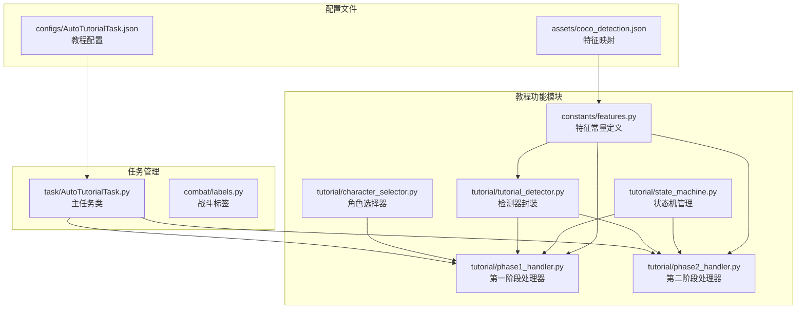
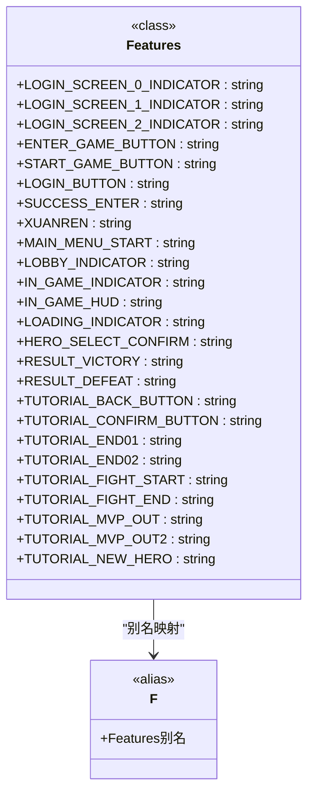
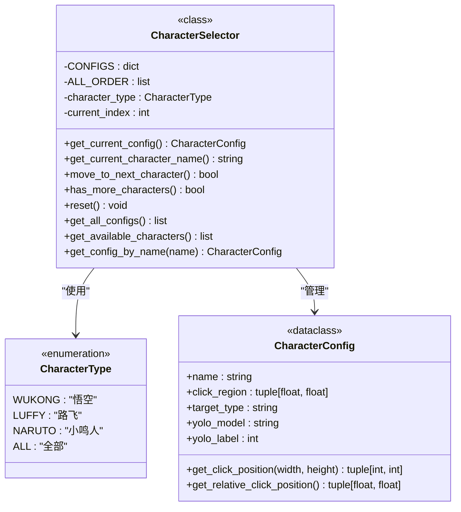
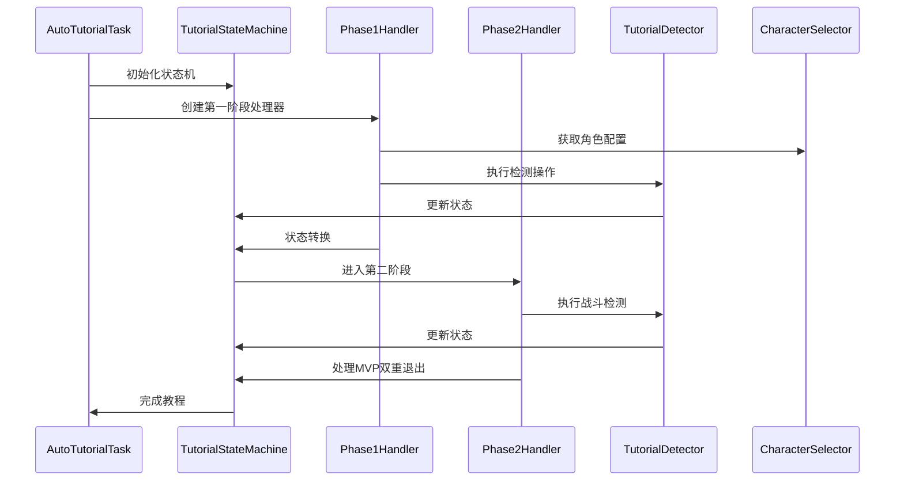
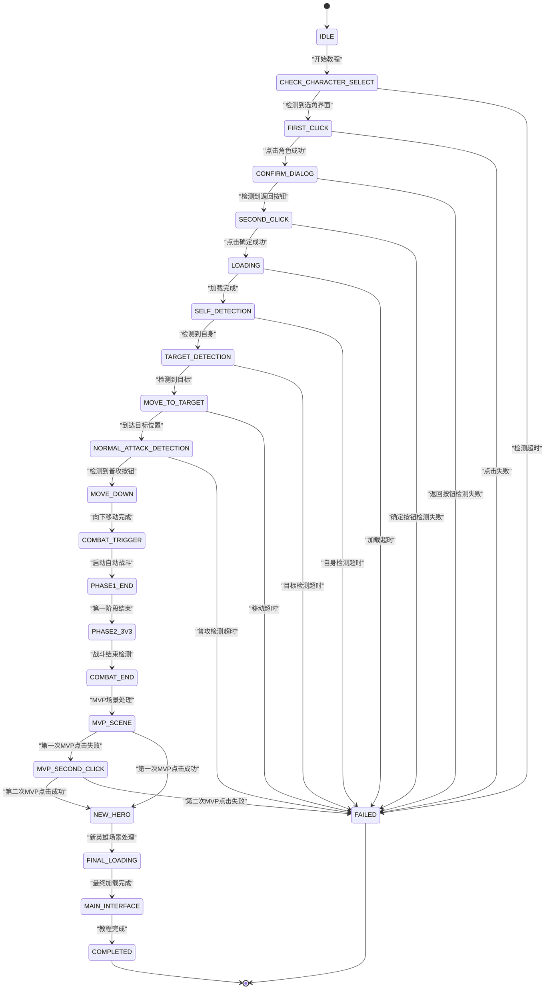
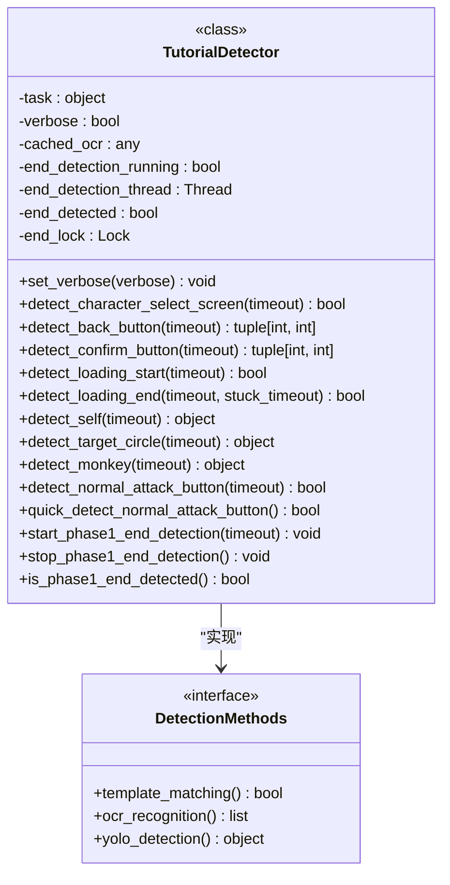
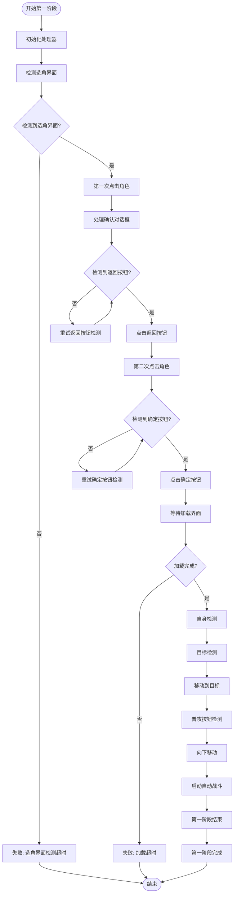
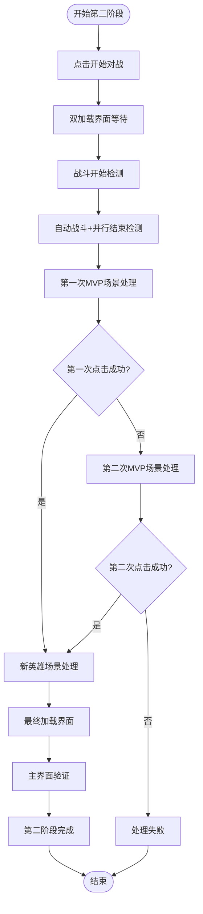
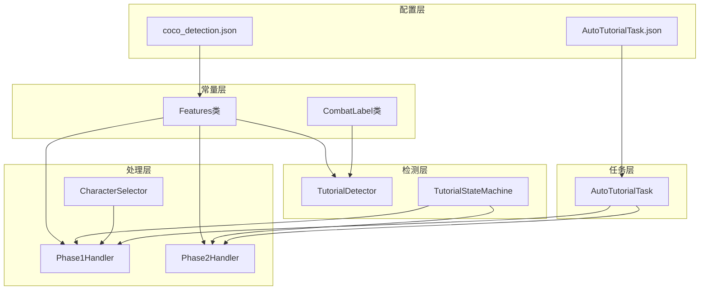

# 教程功能常量

<cite>
**本文档引用的文件**
- [features.py](file://src/constants/features.py)
- [coco_detection.json](file://assets/coco_detection.json)
- [labels.py](file://src/combat/labels.py)
- [AutoTutorialTask.py](file://src/task/AutoTutorialTask.py)
- [state_machine.py](file://src/tutorial/state_machine.py)
- [tutorial_detector.py](file://src/tutorial/tutorial_detector.py)
- [phase1_handler.py](file://src/tutorial/phase1_handler.py)
- [phase2_handler.py](file://src/tutorial/phase2_handler.py)
- [character_selector.py](file://src/tutorial/character_selector.py)
- [AutoTutorialTask.json](file://configs/AutoTutorialTask.json)
</cite>

## 更新摘要
**所做更改**
- 新增TUTORIAL_MVP_OUT2常量的详细说明，扩展教程状态管理能力
- 更新MVP场景处理章节，增加双重退出处理机制的完整描述
- 补充MVP场景双重检测的技术实现细节
- 完善状态机架构图，反映新增的MVP双重处理流程

## 目录
1. [简介](#简介)
2. [项目结构](#项目结构)
3. [核心组件](#核心组件)
4. [架构概览](#架构概览)
5. [详细组件分析](#详细组件分析)
6. [依赖分析](#依赖分析)
7. [性能考虑](#性能考虑)
8. [故障排除指南](#故障排除指南)
9. [结论](#结论)

## 简介

教程功能常量是游戏自动化教程系统的核心组成部分，负责管理新手教程中使用的所有特征名称和常量定义。该系统实现了完整的自动化新手教程流程，包括角色选择、界面检测、动作执行和状态管理等功能。

系统采用模块化设计，通过统一的常量管理机制确保各个组件之间的协调一致，同时提供了灵活的配置选项以适应不同的游戏版本和界面变化。**最新更新**：新增TUTORIAL_MVP_OUT2常量，扩展了教程状态管理能力，支持MVP场景的双重退出处理机制，提高了系统的鲁棒性和兼容性。

## 项目结构

项目采用清晰的模块化组织结构，教程功能相关的文件分布如下：

**图表来源**
- [features.py:1-98](file://src/constants/features.py#L1-L98)
- [state_machine.py:1-209](file://src/tutorial/state_machine.py#L1-L209)
- [tutorial_detector.py:1-823](file://src/tutorial/tutorial_detector.py#L1-L823)

**章节来源**
- [features.py:1-98](file://src/constants/features.py#L1-L98)
- [AutoTutorialTask.py:1-293](file://src/task/AutoTutorialTask.py#L1-L293)

## 核心组件

### 特征常量管理

特征常量系统是教程功能的核心基础，通过统一的管理机制确保所有检测和操作的一致性。

#### 特征分类体系

系统将特征常量按照功能领域进行分类管理：

**图表来源**
- [features.py:9-98](file://src/constants/features.py#L9-L98)

#### 角色配置系统

角色选择器提供了灵活的角色配置管理，支持多种角色类型的检测和操作：

**图表来源**
- [character_selector.py:12-232](file://src/tutorial/character_selector.py#L12-L232)

**章节来源**
- [features.py:1-98](file://src/constants/features.py#L1-L98)
- [character_selector.py:1-232](file://src/tutorial/character_selector.py#L1-L232)

## 架构概览

教程功能采用分层架构设计，通过状态机驱动整个流程控制：

**图表来源**
- [AutoTutorialTask.py:92-192](file://src/task/AutoTutorialTask.py#L92-L192)
- [state_machine.py:56-209](file://src/tutorial/state_machine.py#L56-L209)

## 详细组件分析

### 状态机管理

教程状态机定义了完整的状态转换流程，确保每个阶段的有序执行：

**图表来源**
- [state_machine.py:10-54](file://src/tutorial/state_machine.py#L10-L54)

#### 状态转换规则

状态机实现了严格的转换规则，确保系统的稳定性和可靠性：

| 当前状态 | 允许转换 | 触发条件 |
|---------|---------|---------|
| IDLE | CHECK_CHARACTER_SELECT, FAILED | 用户启动, 异常处理 |
| CHECK_CHARACTER_SELECT | FIRST_CLICK, FAILED | 选角界面检测成功/失败 |
| FIRST_CLICK | CONFIRM_DIALOG, FAILED | 角色点击成功/失败 |
| CONFIRM_DIALOG | SECOND_CLICK, FAILED | 返回按钮检测成功/失败 |
| SECOND_CLICK | LOADING, FAILED | 确定按钮点击成功/失败 |
| LOADING | SELF_DETECTION, FAILED | 加载完成/超时 |
| SELF_DETECTION | TARGET_DETECTION, FAILED | 自身检测成功/超时 |
| TARGET_DETECTION | MOVE_TO_TARGET, FAILED | 目标检测成功/超时 |
| MOVE_TO_TARGET | NORMAL_ATTACK_DETECTION, FAILED | 到达目标/移动超时 |
| NORMAL_ATTACK_DETECTION | MOVE_DOWN, FAILED | 普攻按钮检测成功/超时 |
| MOVE_DOWN | COMBAT_TRIGGER, FAILED | 向下移动完成/失败 |
| COMBAT_TRIGGER | PHASE1_END, FAILED | 自动战斗启动/失败 |
| PHASE1_END | PHASE2_3V3, FAILED | 第一阶段结束/失败 |
| PHASE2_3V3 | COMBAT_END, FAILED | 第二阶段开始/失败 |
| COMBAT_END | MVP_SCENE, FAILED | 战斗结束/失败 |
| MVP_SCENE | MVP_SECOND_CLICK, NEW_HERO | MVP场景处理/成功 |
| MVP_SECOND_CLICK | NEW_HERO, FAILED | 第二次MVP点击/成功/失败 |
| NEW_HERO | FINAL_LOADING, FAILED | 新英雄场景/失败 |
| FINAL_LOADING | MAIN_INTERFACE, FAILED | 最终加载/失败 |
| MAIN_INTERFACE | COMPLETED, FAILED | 主界面验证/失败 |

**章节来源**
- [state_machine.py:56-181](file://src/tutorial/state_machine.py#L56-L181)

### 检测器系统

检测器封装了多种检测技术，提供了强大的界面识别能力：

**图表来源**
- [tutorial_detector.py:21-823](file://src/tutorial/tutorial_detector.py#L21-L823)

#### 检测技术组合

系统采用了多层次的检测策略，确保在不同情况下都能准确识别：

1. **模板匹配**：基于预定义的图像特征进行精确匹配
2. **OCR文字识别**：通过光学字符识别检测界面文字
3. **YOLO模型检测**：使用深度学习模型进行实时目标检测

**章节来源**
- [tutorial_detector.py:1-823](file://src/tutorial/tutorial_detector.py#L1-L823)

### 第一阶段处理器

第一阶段处理器实现了新手教程的核心流程控制：

**图表来源**
- [phase1_handler.py:103-184](file://src/tutorial/phase1_handler.py#L103-L184)

**章节来源**
- [phase1_handler.py:1-800](file://src/tutorial/phase1_handler.py#L1-L800)

### 第二阶段处理器

第二阶段处理器负责教程的后续流程处理，**包含新增的MVP双重退出处理机制**：

**图表来源**
- [phase2_handler.py:77-147](file://src/tutorial/phase2_handler.py#L77-L147)

#### MVP场景双重处理机制

**新增功能**：系统现在支持MVP场景的双重退出处理，提高了检测的可靠性：

1. **第一次MVP处理**：使用标准的MVP退出模板进行检测
2. **第二次MVP处理**：当第一次失败时，使用TUTORIAL_MVP_OUT2常量进行备用检测
3. **多语言支持**：支持简体中文"点击荧幕继续"和繁体中文"點擊螢幕繼續"两种文字识别
4. **智能回退**：当模板匹配失败时，自动切换到OCR文字识别模式

**章节来源**
- [phase2_handler.py:1-851](file://src/tutorial/phase2_handler.py#L1-L851)

### 特征常量系统更新

**新增常量**：TUTORIAL_MVP_OUT2常量的引入扩展了教程状态管理能力：

| 常量名称 | 功能描述 | 使用场景 | 模板文件 |
|---------|---------|---------|---------|
| TUTORIAL_MVP_OUT | MVP场景退出按钮（第一次） | 标准MVP场景处理 | out.png |
| TUTORIAL_MVP_OUT2 | MVP场景退出按钮（第二次） | 备用MVP场景处理 | out2.png |

**章节来源**
- [features.py:91-92](file://src/constants/features.py#L91-L92)

## 依赖分析

教程功能常量系统与其他组件的依赖关系如下：

**图表来源**
- [features.py:17-18](file://src/constants/features.py#L17-L18)
- [labels.py:8-51](file://src/combat/labels.py#L8-L51)

### 关键依赖关系

1. **特征常量依赖**：所有检测器和处理器都依赖于统一的特征常量定义
2. **配置文件依赖**：教程配置文件为整个系统提供运行参数
3. **模型文件依赖**：YOLO模型文件为目标检测提供技术支持
4. **模板文件依赖**：新增的out2.png模板文件支持MVP场景的双重处理

**章节来源**
- [AutoTutorialTask.py:28-26](file://src/task/AutoTutorialTask.py#L28-L26)

## 性能考虑

### 检测性能优化

系统在多个层面进行了性能优化：

1. **缓存机制**：OCR结果缓存减少重复计算
2. **异步检测**：并行线程处理提高响应速度
3. **智能重试**：指数退避算法减少无效请求
4. **阈值优化**：合理的匹配阈值平衡准确性与速度
5. **双重检测优化**：MVP场景的双重处理机制避免了重复扫描

### 内存管理

- **资源清理**：及时释放检测器和处理器资源
- **线程安全**：使用锁机制确保并发访问安全
- **状态重置**：定期重置检测状态避免内存泄漏

## 故障排除指南

### 常见问题及解决方案

| 问题类型 | 症状 | 可能原因 | 解决方案 |
|---------|------|---------|---------|
| 检测失败 | 特征无法识别 | 图像质量差 | 调整阈值参数 |
| 状态转换异常 | 状态卡死 | 异常处理缺失 | 添加异常捕获 |
| 性能问题 | 响应缓慢 | 检测过于频繁 | 优化检测频率 |
| 配置错误 | 功能异常 | 参数设置不当 | 检查配置文件 |
| MVP点击失败 | 第一次点击成功但流程中断 | out2模板文件缺失 | 检查模板文件存在性 |
| 双重处理失效 | 第二次MVP点击仍然失败 | 文字识别不准确 | 调整OCR识别阈值 |

### 调试工具

系统提供了完善的调试支持：

- **详细日志**：可配置的详细日志输出
- **错误截图**：自动保存错误时刻的截图
- **状态监控**：实时显示当前状态和历史记录
- **性能统计**：检测耗时和成功率统计
- **OCR诊断**：首次OCR识别结果和目标文字显示

**章节来源**
- [AutoTutorialTask.py:251-273](file://src/task/AutoTutorialTask.py#L251-L273)

## 结论

教程功能常量系统通过统一的常量管理和模块化设计，实现了高效、可靠的自动化教程功能。**最新更新**显著增强了系统的鲁棒性和兼容性：

1. **统一管理**：通过Features类统一管理所有特征常量，包括新增的TUTORIAL_MVP_OUT2常量
2. **模块化设计**：各组件职责明确，耦合度低，支持MVP场景的双重处理机制
3. **灵活配置**：支持多种角色和配置选项，新增的MVP双重处理提高了适配性
4. **健壮性增强**：完善的异常处理和容错机制，特别是MVP场景的双重退出处理
5. **可扩展性**：易于添加新的检测技术和功能，如TUTORIAL_MVP_OUT2常量的引入

该系统为游戏自动化提供了坚实的基础，能够适应不同的游戏版本和界面变化，为用户提供稳定可靠的服务。新增的MVP双重处理机制特别适用于界面变化或模板文件缺失的情况，确保了教程流程的连续性和成功率。