# 教程检测系统

<cite>
**本文档引用的文件**
- [main.py](file://main.py)
- [config.py](file://config.py)
- [requirements.txt](file://requirements.txt)
- [src/tutorial/__init__.py](file://src/tutorial/__init__.py)
- [src/tutorial/state_machine.py](file://src/tutorial/state_machine.py)
- [src/tutorial/tutorial_detector.py](file://src/tutorial/tutorial_detector.py)
- [src/tutorial/phase1_handler.py](file://src/tutorial/phase1_handler.py)
- [src/tutorial/character_selector.py](file://src/tutorial/character_selector.py)
- [src/task/AutoTutorialTask.py](file://src/task/AutoTutorialTask.py)
- [src/constants/features.py](file://src/constants/features.py)
- [src/combat/labels.py](file://src/combat/labels.py)
- [src/utils/BackgroundManager.py](file://src/utils/BackgroundManager.py)
- [src/utils/ScreenshotHelper.py](file://src/utils/ScreenshotHelper.py)
- [configs/AutoTutorialTask.json](file://configs/AutoTutorialTask.json)
</cite>

## 目录
1. [简介](#简介)
2. [项目结构](#项目结构)
3. [核心组件](#核心组件)
4. [架构概览](#架构概览)
5. [详细组件分析](#详细组件分析)
6. [依赖关系分析](#依赖关系分析)
7. [性能考虑](#性能考虑)
8. [故障排除指南](#故障排除指南)
9. [结论](#结论)

## 简介

教程检测系统是一个基于计算机视觉和人工智能技术的游戏自动化解决方案，专门用于自动完成《漫画群星：大集结》的新手教程流程。该系统集成了多种先进的检测技术和智能控制算法，能够自动识别游戏界面元素、执行精确的操作，并在整个过程中保持高可靠性和稳定性。

系统的核心优势包括：
- **多模态检测技术**：结合YOLO目标检测、OCR文字识别和模板匹配
- **智能状态管理**：完整的状态机架构确保流程的有序执行
- **多角色支持**：支持悟空、路飞、小鸣人三种角色的新手教程
- **后台模式**：支持游戏窗口最小化或被遮挡时继续运行
- **实时监控**：提供详细的日志记录和错误截图功能

## 项目结构

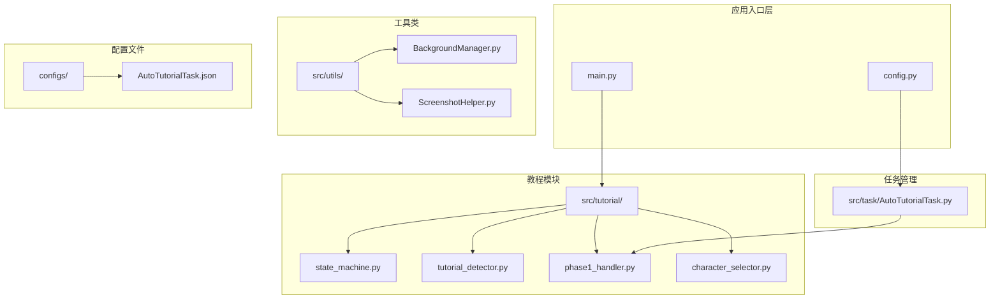

**图表来源**
- [main.py:1-128](file://main.py#L1-L128)
- [config.py:68-150](file://config.py#L68-L150)

**章节来源**
- [main.py:1-128](file://main.py#L1-L128)
- [config.py:1-150](file://config.py#L1-L150)

## 核心组件

### 状态机管理系统

教程检测系统采用状态机架构来管理整个新手教程流程，确保每个步骤都能正确执行和过渡。

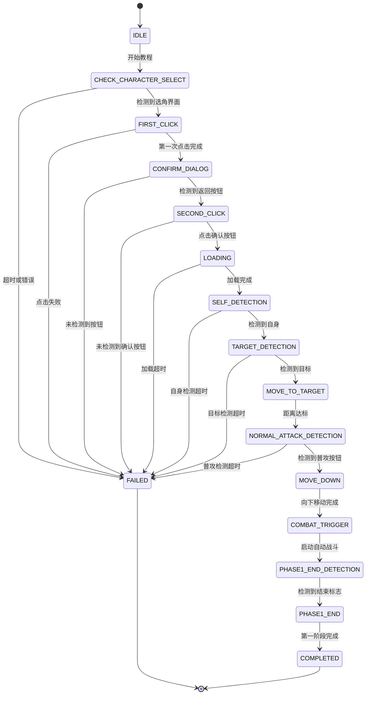

**图表来源**
- [src/tutorial/state_machine.py:10-52](file://src/tutorial/state_machine.py#L10-L52)

### 多模态检测系统

系统集成了三种主要的检测技术来确保高精度的目标识别：

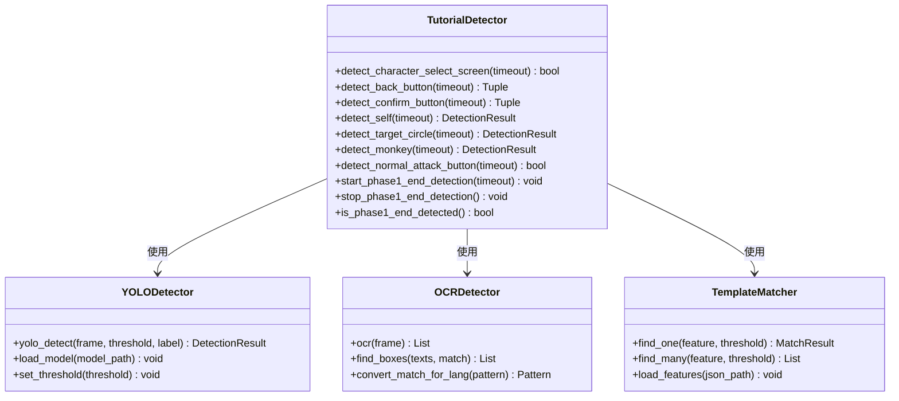

**图表来源**
- [src/tutorial/tutorial_detector.py:21-44](file://src/tutorial/tutorial_detector.py#L21-L44)

### 角色选择系统

系统支持三种不同角色的新手教程，每种角色都有特定的检测策略和操作方式：

| 角色 | 选角区域 | 目标检测类型 | YOLO模型 | 特殊说明 |
|------|----------|--------------|----------|----------|
| 悟空 | 左侧1/3 | 猴子检测 | fight2.onnx | 使用特殊模型检测猴子 |
| 路飞 | 中间1/3 | 目标圈检测 | fight.onnx | 标签ID: 4 |
| 小鸣人 | 右侧1/3 | 目标圈检测 | fight.onnx | 标签ID: 4 |

**章节来源**
- [src/tutorial/character_selector.py:76-99](file://src/tutorial/character_selector.py#L76-L99)
- [src/tutorial/phase1_handler.py:29-42](file://src/tutorial/phase1_handler.py#L29-L42)

## 架构概览

教程检测系统采用分层架构设计，确保各组件之间的松耦合和高内聚性：

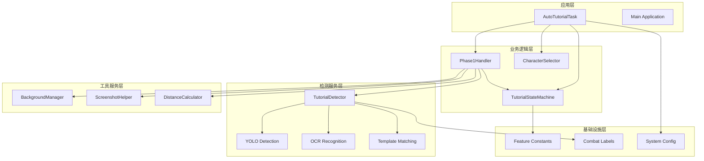

**图表来源**
- [src/task/AutoTutorialTask.py:27-81](file://src/task/AutoTutorialTask.py#L27-L81)
- [src/tutorial/phase1_handler.py:22-42](file://src/tutorial/phase1_handler.py#L22-L42)

**章节来源**
- [src/task/AutoTutorialTask.py:1-253](file://src/task/AutoTutorialTask.py#L1-L253)
- [src/tutorial/phase1_handler.py:1-473](file://src/tutorial/phase1_handler.py#L1-L473)

## 详细组件分析

### 状态机管理器

状态机管理器是整个教程检测系统的核心控制组件，负责管理教程流程的状态转换和执行顺序。

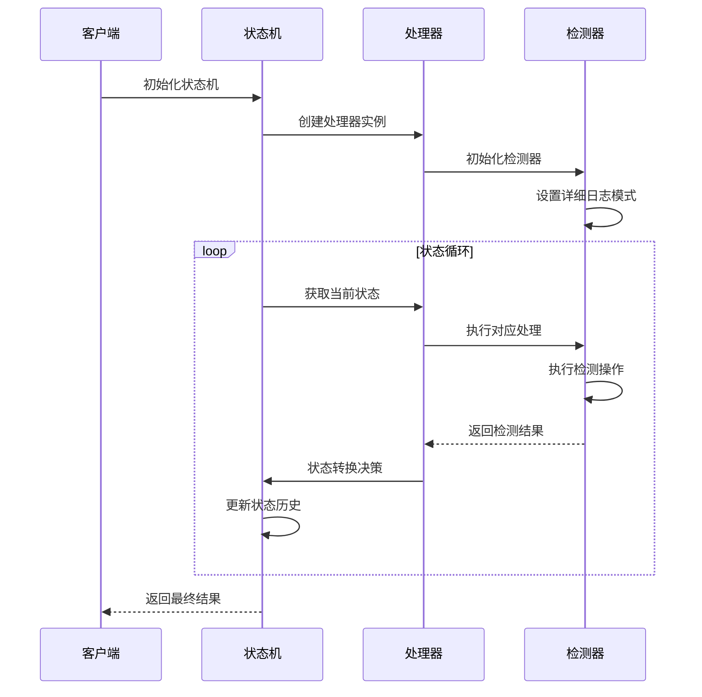

**图表来源**
- [src/tutorial/state_machine.py:81-151](file://src/tutorial/state_machine.py#L81-L151)
- [src/tutorial/phase1_handler.py:90-167](file://src/tutorial/phase1_handler.py#L90-L167)

#### 状态转换规则

系统定义了严格的状态转换规则，确保教程流程的正确性：

| 当前状态 | 允许转换状态 | 触发条件 |
|----------|-------------|----------|
| IDLE | CHECK_CHARACTER_SELECT, FAILED | 系统启动 |
| CHECK_CHARACTER_SELECT | FIRST_CLICK, FAILED | 检测到选角界面 |
| FIRST_CLICK | CONFIRM_DIALOG, FAILED | 第一次点击完成 |
| CONFIRM_DIALOG | SECOND_CLICK, FAILED | 检测到返回按钮 |
| SECOND_CLICK | LOADING, FAILED | 点击确认按钮 |
| LOADING | SELF_DETECTION, FAILED | 加载完成 |
| SELF_DETECTION | TARGET_DETECTION, FAILED | 检测到自身 |
| TARGET_DETECTION | MOVE_TO_TARGET, FAILED | 检测到目标 |
| MOVE_TO_TARGET | NORMAL_ATTACK_DETECTION, FAILED | 距离达标 |
| NORMAL_ATTACK_DETECTION | MOVE_DOWN, FAILED | 检测到普攻按钮 |
| MOVE_DOWN | COMBAT_TRIGGER, FAILED | 向下移动完成 |
| COMBAT_TRIGGER | PHASE1_END_DETECTION, FAILED | 启动自动战斗 |
| PHASE1_END_DETECTION | PHASE1_END, FAILED | 检测到结束标志 |

**章节来源**
- [src/tutorial/state_machine.py:61-79](file://src/tutorial/state_machine.py#L61-L79)
- [src/tutorial/state_machine.py:115-136](file://src/tutorial/state_machine.py#L115-L136)

### 检测器组件

检测器组件是系统的核心感知模块，负责识别游戏界面中的各种元素。

#### YOLO目标检测

系统使用YOLO模型进行精确的目标检测，支持多种游戏元素的识别：

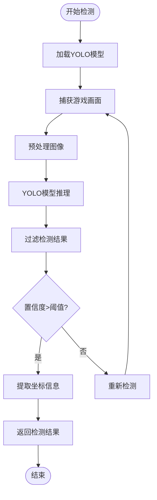

**图表来源**
- [src/tutorial/tutorial_detector.py:367-380](file://src/tutorial/tutorial_detector.py#L367-L380)

#### OCR文字识别

OCR组件负责识别游戏界面中的文字内容，支持多种语言环境：

| 检测类型 | 关键词模式 | 语言支持 |
|----------|------------|----------|
| 选角界面 | 请选择一位你心仪的角色 | 简体中文、繁体中文 |
| 返回按钮 | 返回 | 简体中文 |
| 确认按钮 | 确定、確定 | 简体中文、繁体中文 |
| 普攻按钮 | 普攻按钮、普攻 | 简体中文 |

**章节来源**
- [src/tutorial/tutorial_detector.py:56-112](file://src/tutorial/tutorial_detector.py#L56-L112)
- [src/tutorial/tutorial_detector.py:116-260](file://src/tutorial/tutorial_detector.py#L116-L260)

### 第一阶段处理器

第一阶段处理器负责执行新手教程的核心流程，包括角色选择、界面检测和自动操作。

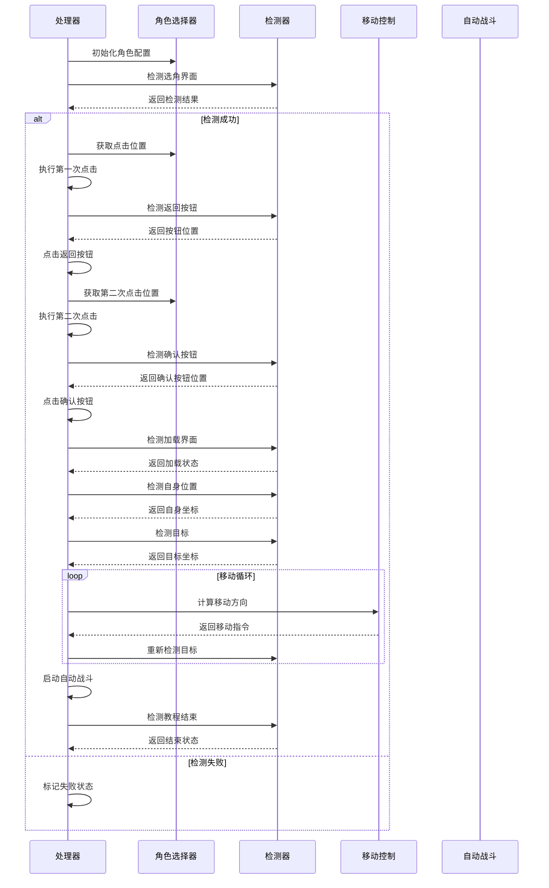

**图表来源**
- [src/tutorial/phase1_handler.py:90-167](file://src/tutorial/phase1_handler.py#L90-L167)
- [src/tutorial/phase1_handler.py:175-455](file://src/tutorial/phase1_handler.py#L175-L455)

**章节来源**
- [src/tutorial/phase1_handler.py:90-473](file://src/tutorial/phase1_handler.py#L90-L473)

### 后台管理模式

系统支持后台模式运行，允许游戏窗口最小化或被其他窗口遮挡时继续执行教程。

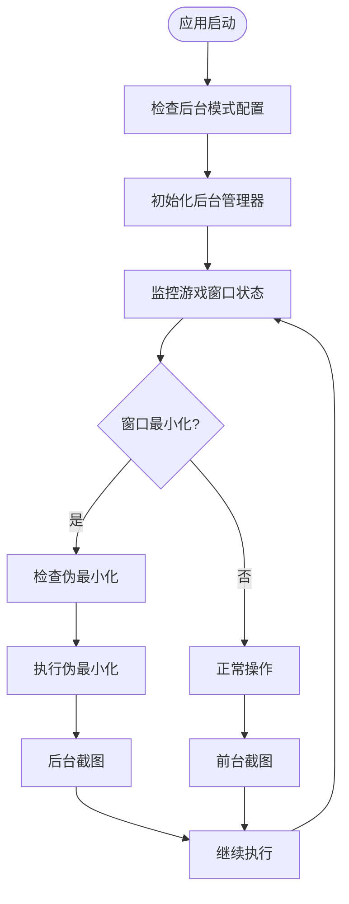

**图表来源**
- [src/utils/BackgroundManager.py:101-121](file://src/utils/BackgroundManager.py#L101-L121)

**章节来源**
- [src/utils/BackgroundManager.py:1-155](file://src/utils/BackgroundManager.py#L1-155)

## 依赖关系分析

### 外部依赖

系统依赖以下主要外部库：

| 依赖库 | 版本要求 | 用途 |
|--------|----------|------|
| ok-script | >=1.0.0 | 核心框架和任务管理 |
| PySide6 | >=6.7.0 | GUI界面开发 |
| opencv-python | >=4.9.0.80 | 图像处理和计算机视觉 |
| numpy | >=1.26.4 | 数值计算和数组操作 |
| onnxruntime | >=1.16.0 | ONNX模型推理 |
| adbutils | >=2.2.1 | Android设备通信 |
| psutil | >=6.0.0 | 系统资源监控 |

### 内部模块依赖

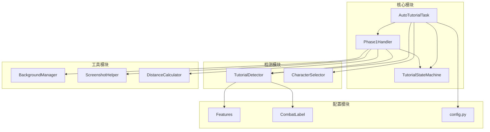

**图表来源**
- [src/task/AutoTutorialTask.py:20-24](file://src/task/AutoTutorialTask.py#L20-L24)
- [src/tutorial/phase1_handler.py:14-20](file://src/tutorial/phase1_handler.py#L14-L20)

**章节来源**
- [requirements.txt:1-14](file://requirements.txt#L1-L14)
- [src/constants/features.py:9-93](file://src/constants/features.py#L9-L93)

## 性能考虑

### 计算效率优化

系统在多个层面进行了性能优化以确保流畅运行：

1. **检测频率控制**：通过配置参数控制检测频率，平衡准确性和性能
2. **缓存机制**：OCR结果和模板匹配结果的缓存减少重复计算
3. **异步处理**：第一阶段结束检测使用独立线程避免阻塞主流程
4. **资源管理**：及时释放检测器和处理器资源防止内存泄漏

### 内存管理

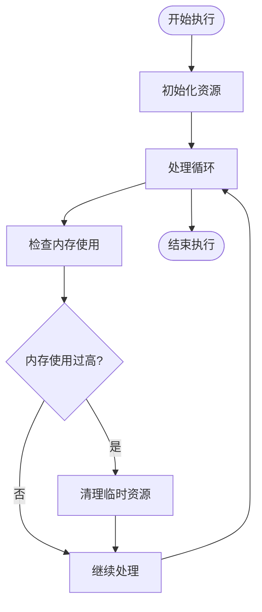

### 并发处理

系统采用多线程架构处理不同类型的任务：

| 线程类型 | 用途 | 同步机制 |
|----------|------|----------|
| 主处理线程 | 状态机执行和流程控制 | 状态机锁 |
| 检测线程 | 第一阶段结束检测 | 线程锁和事件信号 |
| 后台监控线程 | 窗口状态监控 | 定时检查 |
| OCR线程 | 文字识别处理 | 缓存机制 |

## 故障排除指南

### 常见问题及解决方案

#### 检测失败问题

| 问题类型 | 可能原因 | 解决方案 |
|----------|----------|----------|
| 选角界面检测失败 | 分辨率不匹配、语言设置错误 | 调整分辨率适配、检查语言配置 |
| 目标检测超时 | YOLO模型加载失败、GPU内存不足 | 重启应用、检查显存使用情况 |
| 按钮点击失败 | 后台模式未启用、窗口不在前台 | 启用后台模式、确保窗口可见 |
| 自动战斗触发失败 | AutoCombatTask未正确初始化 | 检查任务注册、验证配置文件 |

#### 性能问题诊断

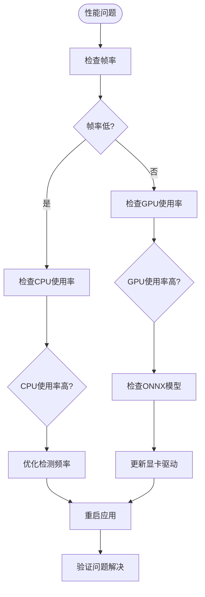

#### 日志分析

系统提供了详细的日志记录功能，便于问题诊断：

1. **日志级别**：INFO（普通信息）、ERROR（错误信息）、DEBUG（调试信息）
2. **日志文件**：位于logs目录下的ok-jump.log和ok-jump_error.log
3. **关键日志**：检测结果、状态转换、错误堆栈跟踪

**章节来源**
- [src/tutorial/phase1_handler.py:162-166](file://src/tutorial/phase1_handler.py#L162-L166)
- [src/utils/BackgroundManager.py:82-92](file://src/utils/BackgroundManager.py#L82-L92)

## 结论

教程检测系统是一个功能完整、架构清晰的游戏自动化解决方案。通过集成多模态检测技术、智能状态管理和后台运行能力，系统能够在各种环境下稳定地完成新手教程的自动化流程。

### 主要优势

1. **高可靠性**：多重检测机制确保识别准确性
2. **强扩展性**：模块化设计支持新功能添加
3. **易维护性**：清晰的代码结构和完善的文档
4. **高性能**：优化的算法和资源管理

### 发展方向

未来可以考虑的功能增强：
- 支持更多角色和教程场景
- 集成机器学习模型提升检测精度
- 添加图形化配置界面
- 扩展到其他游戏的支持

该系统为游戏自动化领域提供了一个优秀的参考实现，展示了如何将多种先进技术有机结合以解决复杂的实际问题。