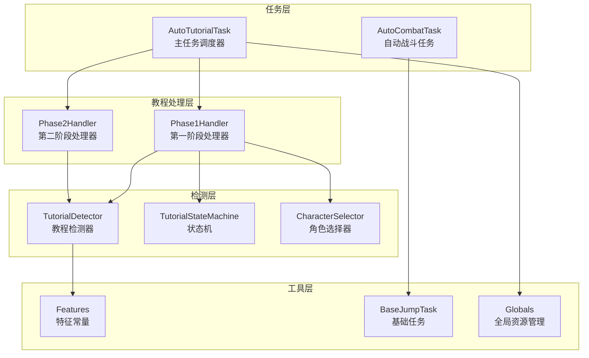
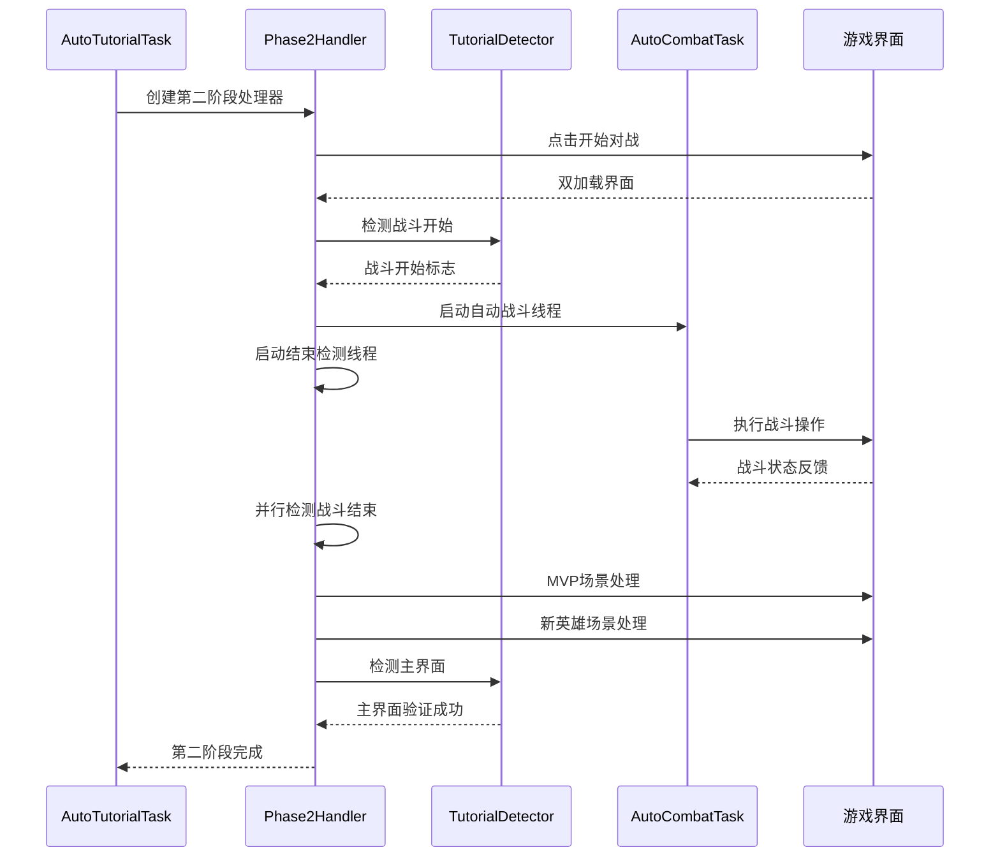
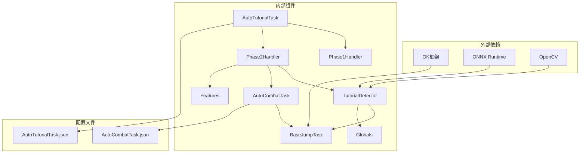

# 教程第二阶段处理器

<cite>
**本文档引用的文件**
- [phase2_handler.py](file://src/tutorial/phase2_handler.py)
- [phase1_handler.py](file://src/tutorial/phase1_handler.py)
- [state_machine.py](file://src/tutorial/state_machine.py)
- [tutorial_detector.py](file://src/tutorial/tutorial_detector.py)
- [character_selector.py](file://src/tutorial/character_selector.py)
- [features.py](file://src/constants/features.py)
- [AutoCombatTask.py](file://src/task/AutoCombatTask.py)
- [AutoTutorialTask.py](file://src/task/AutoTutorialTask.py)
- [BaseJumpTask.py](file://src/task/BaseJumpTask.py)
- [globals.py](file://src/globals.py)
- [AutoTutorialTask.json](file://configs/AutoTutorialTask.json)
- [main.py](file://main.py)
</cite>

## 目录
1. [简介](#简介)
2. [项目结构](#项目结构)
3. [核心组件](#核心组件)
4. [架构概览](#架构概览)
5. [详细组件分析](#详细组件分析)
6. [依赖关系分析](#依赖关系分析)
7. [性能考虑](#性能考虑)
8. [故障排除指南](#故障排除指南)
9. [结论](#结论)

## 简介

教程第二阶段处理器是《漫画群星》自动战斗系统中的关键组件，负责处理新手教程的第二阶段流程。该处理器实现了完整的自动化战斗流程，包括开始对战、双加载界面等待、战斗开始检测、自动战斗执行、MVP场景处理、新英雄场景处理、最终加载界面等待以及主界面验证等功能。

该处理器采用模块化设计，通过状态机管理和多线程并发控制，确保在复杂的战斗环境中能够稳定可靠地执行各项操作。系统支持多种检测方式（模板匹配、OCR识别、YOLO模型检测），提供了强大的容错机制和详细的日志记录功能。

## 项目结构

项目采用清晰的分层架构设计，主要包含以下核心模块：



**图表来源**
- [AutoTutorialTask.py:28-192](file://src/task/AutoTutorialTask.py#L28-L192)
- [phase2_handler.py:18-46](file://src/tutorial/phase2_handler.py#L18-L46)
- [tutorial_detector.py:21-48](file://src/tutorial/tutorial_detector.py#L21-L48)

**章节来源**
- [AutoTutorialTask.py:1-200](file://src/task/AutoTutorialTask.py#L1-L200)
- [phase2_handler.py:1-851](file://src/tutorial/phase2_handler.py#L1-L851)

## 核心组件

### Phase2Handler - 第二阶段处理器

Phase2Handler是教程第二阶段的核心处理器，负责实现完整的自动化战斗流程。该处理器具有以下关键特性：

**主要功能模块：**
- 开始对战按钮检测与点击
- 双加载界面等待与容错处理
- 战斗开始标志检测
- 自动战斗执行与并行结束检测
- MVP场景处理（两次点击）
- 新英雄场景处理
- 最终加载界面等待
- 主界面验证

**并发控制机制：**
处理器采用多线程架构，通过独立的战斗线程和结束检测线程实现并行处理，提高了系统的响应性和稳定性。

**错误处理与容错：**
- 超时检测和自动重试机制
- 详细的日志记录和错误截图保存
- 状态恢复和资源清理功能

**章节来源**
- [phase2_handler.py:18-148](file://src/tutorial/phase2_handler.py#L18-L148)
- [phase2_handler.py:328-378](file://src/tutorial/phase2_handler.py#L328-L378)

### TutorialDetector - 教程检测器

TutorialDetector提供了统一的检测接口，封装了多种检测方法：

**检测能力：**
- 模板匹配检测（Features常量）
- OCR文字识别
- YOLO模型检测（fight.onnx和fight2.onnx）
- 加载界面百分比检测

**多线程支持：**
- 独立的结束检测线程
- OCR缓存机制
- 状态重置功能

**章节来源**
- [tutorial_detector.py:21-48](file://src/tutorial/tutorial_detector.py#L21-L48)
- [tutorial_detector.py:271-415](file://src/tutorial/tutorial_detector.py#L271-L415)

### TutorialStateMachine - 状态机

TutorialStateMachine管理教程的完整状态流程：

**状态定义：**
- IDLE（空闲）
- CHECK_CHARACTER_SELECT（检查选角界面）
- FIRST_CLICK（第一次点击角色）
- SECOND_CLICK（第二次点击角色）
- LOADING（等待加载）
- SELF_DETECTION（自身检测）
- TARGET_DETECTION（目标检测）
- MOVE_TO_TARGET（移动靠近目标）
- NORMAL_ATTACK_DETECTION（普攻按钮检测）
- MOVE_DOWN（向下移动）
- COMBAT_TRIGGER（启动自动战斗）
- PHASE1_END_DETECTION（第一阶段结束检测）
- PHASE1_END（第一阶段结束）
- PHASE2_3V3（第二阶段3V3）
- COMPLETED（完成）
- FAILED（失败）

**状态转换：**
处理器定义了完整的状态转换映射，确保流程的正确性和完整性。

**章节来源**
- [state_machine.py:10-54](file://src/tutorial/state_machine.py#L10-L54)
- [state_machine.py:63-79](file://src/tutorial/state_machine.py#L63-L79)

## 架构概览

系统采用分层架构设计，各组件职责明确，耦合度低，易于维护和扩展：



**图表来源**
- [AutoTutorialTask.py:135-179](file://src/task/AutoTutorialTask.py#L135-L179)
- [phase2_handler.py:77-148](file://src/tutorial/phase2_handler.py#L77-L148)
- [phase2_handler.py:328-378](file://src/tutorial/phase2_handler.py#L328-L378)

## 详细组件分析

### Phase2Handler详细流程

#### 开始对战检测流程

```mermaid
flowchart TD
Start([开始对战检测]) --> CheckTimeout[检查超时时间]
CheckTimeout --> TemplateMatch[模板匹配检测]
TemplateMatch --> TemplateFound{检测到按钮?}
TemplateFound --> |是| ClickButton[点击按钮]
TemplateFound --> |否| OCRCheck[OCR文字检测]
OCRCheck --> OCRFound{OCR检测到"开始对战"?}
OCRFound --> |是| ClickButton
OCRFound --> |否| WaitTime[等待0.2秒]
WaitTime --> CheckTimeout
ClickButton --> VerifyClick[验证点击成功]
VerifyClick --> ClickSuccess{点击成功?}
ClickSuccess --> |是| Success[检测完成]
ClickSuccess --> |否| Retry[重试检测]
Retry --> TemplateMatch
CheckTimeout --> |超时| Error[检测失败]
```

**图表来源**
- [phase2_handler.py:151-201](file://src/tutorial/phase2_handler.py#L151-L201)

#### 双加载界面等待机制

双加载界面等待是第二阶段的关键环节，系统实现了智能的容错处理：

**加载界面检测流程：**
1. 检测第一个加载界面开始
2. 等待第一个加载界面完成
3. 等待两个加载界面之间的容错窗口
4. 检测第二个加载界面开始
5. 等待第二个加载界面完成

**容错机制：**
- 加载停滞检测（stuck_timeout）
- 百分比变化检测
- 状态重置功能

**章节来源**
- [phase2_handler.py:222-281](file://src/tutorial/phase2_handler.py#L222-L281)
- [tutorial_detector.py:277-415](file://src/tutorial/tutorial_detector.py#L277-L415)

#### 自动战斗与结束检测并行处理

系统采用多线程架构实现自动战斗和结束检测的并行处理：

**线程管理：**
- 战斗线程：执行AutoCombatTask.run()
- 结束检测线程：独立检测战斗结束标志
- 线程同步：使用Lock确保线程安全

**检测策略：**
- 模板匹配：fight_end.png
- OCR检测："对战结束"文字
- 超时控制：combat_timeout参数

**章节来源**
- [phase2_handler.py:328-510](file://src/tutorial/phase2_handler.py#L328-L510)
- [AutoCombatTask.py:84-135](file://src/task/AutoCombatTask.py#L84-L135)

### MVP场景处理机制

MVP场景处理包含两次点击操作，系统实现了智能的过渡检测：

**MVP检测流程：**
1. 等待MVP场景出现（过渡容错窗口）
2. 检测MVP退出按钮（模板匹配或OCR）
3. 点击屏幕中心
4. 等待中间加载界面
5. 检测第二次MVP场景
6. 重复点击流程

**新英雄场景处理：**
- 同时检测"新英雄"标志和"确定"按钮
- 两个元素都检测到才执行点击
- 支持OCR备选检测

**章节来源**
- [phase2_handler.py:512-687](file://src/tutorial/phase2_handler.py#L512-L687)

### 主界面验证系统

主界面验证确保系统正确返回到游戏主界面：

**验证策略：**
- OCR检测"漫斗赛"和"排位赛"文字
- 简繁双语支持
- 多次重试机制
- 最大重试次数控制

**检测流程：**
1. 设置超时时间和重试次数
2. 循环执行OCR检测
3. 同时检测两个关键文字
4. 验证成功后返回True

**章节来源**
- [phase2_handler.py:725-784](file://src/tutorial/phase2_handler.py#L725-L784)

## 依赖关系分析

系统采用松耦合的设计原则，各组件之间的依赖关系清晰明确：



**图表来源**
- [phase2_handler.py:14-15](file://src/tutorial/phase2_handler.py#L14-L15)
- [AutoTutorialTask.py:23-25](file://src/task/AutoTutorialTask.py#L23-L25)
- [AutoCombatTask.py:21-29](file://src/task/AutoCombatTask.py#L21-L29)

**章节来源**
- [features.py:9-97](file://src/constants/features.py#L9-L97)
- [BaseJumpTask.py:14-24](file://src/task/BaseJumpTask.py#L14-L24)

## 性能考虑

### 多线程优化

系统通过合理的多线程设计提升了整体性能：

**线程池管理：**
- 战斗线程：独立执行战斗逻辑
- 检测线程：专门负责状态检测
- 后台线程：处理非关键任务

**资源共享：**
- 线程安全的共享变量
- Lock保护的临界区
- 避免死锁的设计

### 检测效率优化

**缓存机制：**
- OCR结果缓存（1秒TTL）
- YOLO模型缓存
- 特征检测结果缓存

**智能检测策略：**
- 优先使用高效的模板匹配
- OCR检测的频率控制
- YOLO检测的阈值优化

### 内存管理

**资源清理：**
- 线程安全的资源释放
- 图像数据的及时释放
- 缓存的自动清理

**内存监控：**
- 大对象的及时销毁
- 避免内存泄漏的设计
- 资源使用量的监控

## 故障排除指南

### 常见问题及解决方案

**加载界面检测失败：**
- 检查加载界面百分比区域
- 验证OCR配置正确性
- 确认游戏语言设置

**战斗开始检测超时：**
- 检查fight_start模板文件
- 验证OCR文字识别准确性
- 调整检测超时参数

**自动战斗线程异常：**
- 检查AutoCombatTask配置
- 验证技能控制器状态
- 确认线程同步机制

**MVP场景处理失败：**
- 检查out模板文件
- 验证OCR文字识别
- 确认点击位置准确性

### 调试工具和日志

**详细日志模式：**
- 启用详细日志配置
- 查看检测过程的详细信息
- 分析OCR识别结果

**错误截图保存：**
- 自动保存错误时刻的截图
- 截图文件命名规范
- 截图文件存储位置

**章节来源**
- [phase2_handler.py:823-851](file://src/tutorial/phase2_handler.py#L823-L851)
- [AutoTutorialTask.py:145-148](file://src/task/AutoTutorialTask.py#L145-L148)

## 结论

教程第二阶段处理器是一个功能完整、设计合理的自动化系统组件。该处理器通过模块化设计、多线程架构和智能容错机制，实现了稳定可靠的自动化战斗流程。

**主要优势：**
- 完整的流程覆盖：从开始对战到主界面验证的全流程自动化
- 强大的检测能力：支持模板匹配、OCR识别、YOLO检测等多种技术
- 稳定的并发控制：多线程架构确保系统的响应性和可靠性
- 丰富的容错机制：超时检测、重试机制、状态恢复等功能

**技术特点：**
- 松耦合的组件设计
- 清晰的职责分离
- 完善的错误处理
- 详细的日志记录

该处理器为《漫画群星》的自动化战斗系统提供了坚实的基础，通过持续的优化和完善，能够满足不同用户的需求和使用场景。