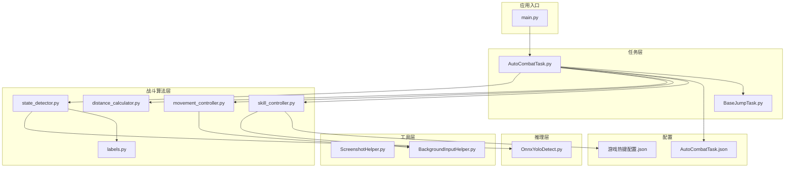
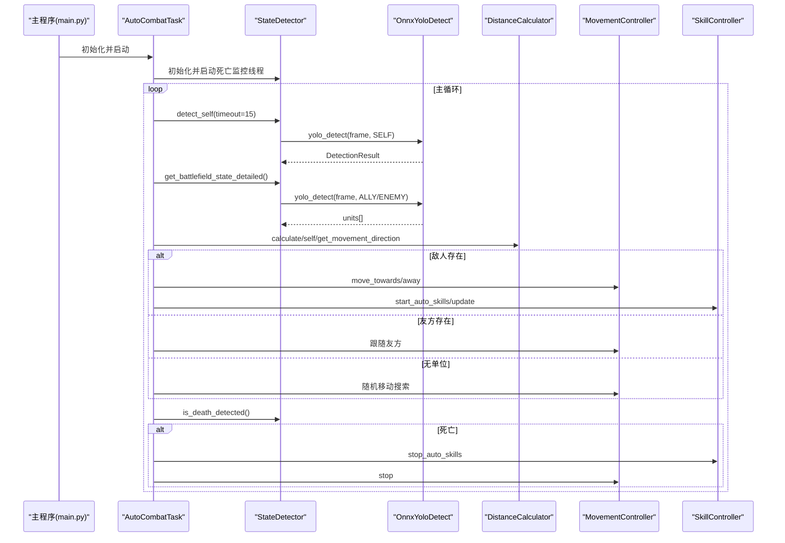
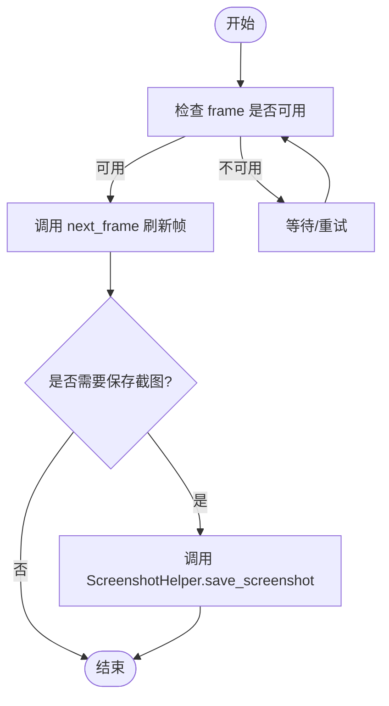
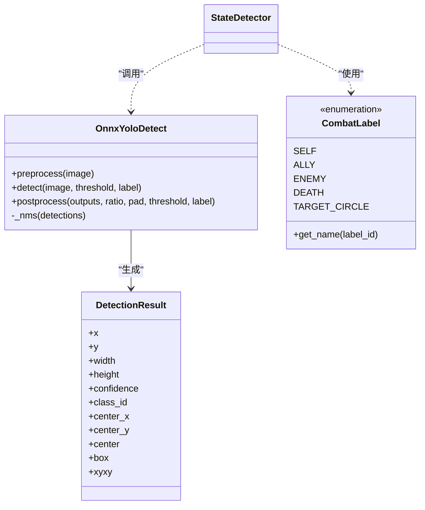
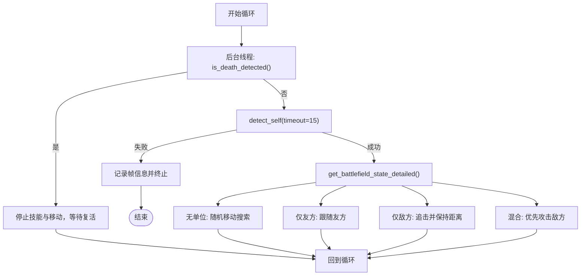
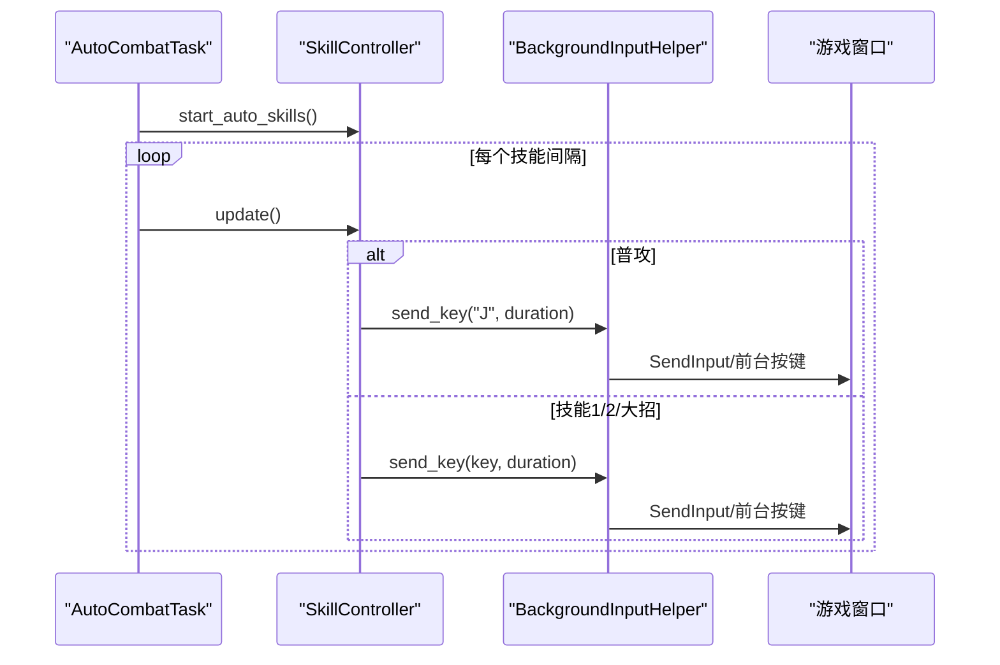
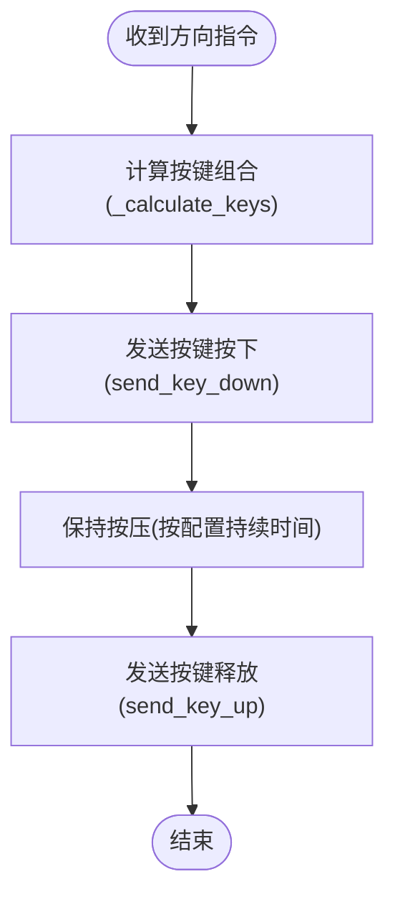
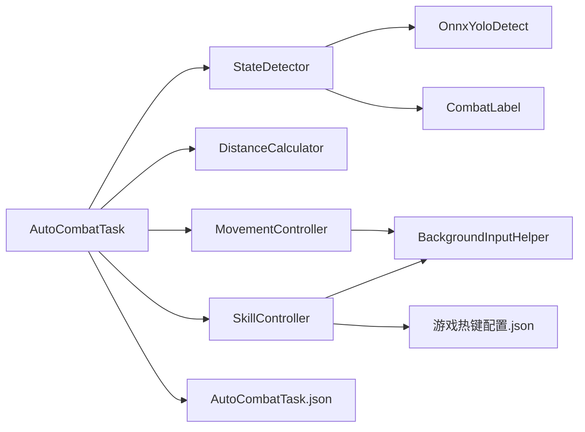

# 数据流分析

<cite>
**本文档引用的文件**
- [main.py](file://main.py)
- [AutoCombatTask.py](file://src/task/AutoCombatTask.py)
- [state_detector.py](file://src/combat/state_detector.py)
- [skill_controller.py](file://src/combat/skill_controller.py)
- [distance_calculator.py](file://src/combat/distance_calculator.py)
- [movement_controller.py](file://src/combat/movement_controller.py)
- [OnnxYoloDetect.py](file://src/OnnxYoloDetect.py)
- [labels.py](file://src/combat/labels.py)
- [ScreenshotHelper.py](file://src/utils/ScreenshotHelper.py)
- [BackgroundInputHelper.py](file://src/utils/BackgroundInputHelper.py)
- [BaseJumpTask.py](file://src/task/BaseJumpTask.py)
- [requirements.txt](file://requirements.txt)
- [AutoCombatTask.json](file://configs/AutoCombatTask.json)
- [游戏热键配置.json](file://configs/游戏热键配置.json)
</cite>

## 目录
1. [简介](#简介)
2. [项目结构](#项目结构)
3. [核心组件](#核心组件)
4. [架构总览](#架构总览)
5. [详细组件分析](#详细组件分析)
6. [依赖关系分析](#依赖关系分析)
7. [性能考量](#性能考量)
8. [故障排查指南](#故障排查指南)
9. [结论](#结论)

## 简介
本文件面向OK-Jump项目的自动战斗系统，围绕“从游戏画面捕获到技能释放”的完整数据流进行深入解析。文档覆盖截图采集、YOLO模型检测、状态分析、决策制定、技能执行等阶段，阐明各模块间的输入输出关系与数据传递机制，并提供数据流图与时序图，说明异步处理与并发控制的实现方式，最后给出性能优化与缓存策略建议。

## 项目结构
OK-Jump采用分层架构，主要目录与职责如下：
- src/task：任务编排层，负责业务流程调度与状态协调
- src/combat：战斗算法层，包含状态检测、距离计算、移动与技能控制
- src/utils：通用工具层，提供截图、后台输入、设备检测等能力
- src：核心推理层，封装ONNX YOLO检测器
- configs：配置文件，驱动GUI设置与行为参数
- assets：模型与资源文件

**图表来源**
- [main.py:1-107](file://main.py#L1-L107)
- [AutoCombatTask.py:1-693](file://src/task/AutoCombatTask.py#L1-L693)
- [state_detector.py:1-446](file://src/combat/state_detector.py#L1-L446)
- [OnnxYoloDetect.py:1-315](file://src/OnnxYoloDetect.py#L1-L315)
- [labels.py:1-51](file://src/combat/labels.py#L1-L51)
- [distance_calculator.py:1-197](file://src/combat/distance_calculator.py#L1-L197)
- [movement_controller.py:1-296](file://src/combat/movement_controller.py#L1-L296)
- [skill_controller.py:1-347](file://src/combat/skill_controller.py#L1-L347)
- [BackgroundInputHelper.py:1-841](file://src/utils/BackgroundInputHelper.py#L1-L841)
- [ScreenshotHelper.py:1-68](file://src/utils/ScreenshotHelper.py#L1-L68)
- [AutoCombatTask.json:1-13](file://configs/AutoCombatTask.json#L1-L13)
- [游戏热键配置.json:1-6](file://configs/游戏热键配置.json#L1-L6)

**章节来源**
- [main.py:1-107](file://main.py#L1-L107)
- [requirements.txt:1-14](file://requirements.txt#L1-L14)

## 核心组件
- 自动战斗任务（AutoCombatTask）：作为触发任务，负责主循环、场景等待、控制器初始化与状态流转
- 状态检测器（StateDetector）：基于YOLO模型进行自身、友方、敌方与死亡状态检测，支持后台线程并行监控
- 距离计算器（DistanceCalculator）：计算单位间距离与移动方向，提供滞后缓冲区避免边界抖动
- 移动控制器（MovementController）：发送移动按键或鼠标点击，支持后台模式
- 技能控制器（SkillController）：根据配置与冷却时间释放技能，支持GUI热键映射
- YOLO检测器（OnnxYoloDetect）：封装ONNXRuntime推理，提供预处理、推理与后处理
- 标签定义（labels）：统一YOLO类别映射
- 截图工具（ScreenshotHelper）：保存截图与特征模板
- 后台输入助手（BackgroundInputHelper）：为Unity游戏提供可靠的后台输入支持

**章节来源**
- [AutoCombatTask.py:32-160](file://src/task/AutoCombatTask.py#L32-L160)
- [state_detector.py:24-120](file://src/combat/state_detector.py#L24-L120)
- [distance_calculator.py:14-120](file://src/combat/distance_calculator.py#L14-L120)
- [movement_controller.py:24-120](file://src/combat/movement_controller.py#L24-L120)
- [skill_controller.py:24-120](file://src/combat/skill_controller.py#L24-L120)
- [OnnxYoloDetect.py:17-120](file://src/OnnxYoloDetect.py#L17-L120)
- [labels.py:8-51](file://src/combat/labels.py#L8-L51)
- [ScreenshotHelper.py:7-68](file://src/utils/ScreenshotHelper.py#L7-L68)
- [BackgroundInputHelper.py:99-207](file://src/utils/BackgroundInputHelper.py#L99-L207)

## 架构总览
自动战斗系统以任务为中心，通过状态检测器与距离计算器进行环境感知，移动控制器与技能控制器执行动作，YOLO检测器提供视觉推理能力。整体采用“主循环-并行监控-条件驱动”的异步架构，保证低延迟与高鲁棒性。

**图表来源**
- [main.py:99-107](file://main.py#L99-L107)
- [AutoCombatTask.py:197-271](file://src/task/AutoCombatTask.py#L197-L271)
- [state_detector.py:118-184](file://src/combat/state_detector.py#L118-L184)
- [OnnxYoloDetect.py:234-258](file://src/OnnxYoloDetect.py#L234-L258)
- [distance_calculator.py:52-158](file://src/combat/distance_calculator.py#L52-L158)
- [movement_controller.py:120-296](file://src/combat/movement_controller.py#L120-L296)
- [skill_controller.py:211-250](file://src/combat/skill_controller.py#L211-L250)

## 详细组件分析

### 截图采集与帧管理
- 帧来源：任务基类提供frame与next_frame，确保每次检测前刷新最新画面
- 截图工具：提供保存截图与特征模板的能力，便于调试与标注
- 设备与后台：通过后台管理器与伪最小化辅助，确保窗口在后台时仍可稳定截图

**图表来源**
- [BaseJumpTask.py:61-72](file://src/task/BaseJumpTask.py#L61-L72)
- [ScreenshotHelper.py:17-30](file://src/utils/ScreenshotHelper.py#L17-L30)

**章节来源**
- [BaseJumpTask.py:61-72](file://src/task/BaseJumpTask.py#L61-L72)
- [ScreenshotHelper.py:17-30](file://src/utils/ScreenshotHelper.py#L17-L30)

### YOLO模型检测与标签体系
- 模型封装：OnnxYoloDetect提供预处理、推理与后处理，支持NMS与类别过滤
- 标签定义：CombatLabel统一SELF/ALLY/ENEMY/DEATH/TARGET_CIRCLE
- 检测调用：StateDetector在不同阶段调用yolo_detect，分别检测自身、友方、敌方与死亡状态

**图表来源**
- [OnnxYoloDetect.py:17-258](file://src/OnnxYoloDetect.py#L17-L258)
- [labels.py:8-51](file://src/combat/labels.py#L8-L51)
- [state_detector.py:152-156](file://src/combat/state_detector.py#L152-L156)

**章节来源**
- [OnnxYoloDetect.py:17-258](file://src/OnnxYoloDetect.py#L17-L258)
- [labels.py:8-51](file://src/combat/labels.py#L8-L51)
- [state_detector.py:152-156](file://src/combat/state_detector.py#L152-L156)

### 状态分析与决策制定
- 死亡状态并行监控：独立线程以高频检测死亡状态，主线程快速查询标志位
- 自身检测：15秒超时内定位自身，超时即终止
- 战场状态：根据友方/敌方存在性分为四种状态，指导后续动作
- 距离与方向：使用DistanceCalculator提供滞后缓冲区，避免边界抖动

**图表来源**
- [state_detector.py:72-184](file://src/combat/state_detector.py#L72-L184)
- [state_detector.py:232-283](file://src/combat/state_detector.py#L232-L283)
- [state_detector.py:354-386](file://src/combat/state_detector.py#L354-L386)
- [distance_calculator.py:84-158](file://src/combat/distance_calculator.py#L84-L158)

**章节来源**
- [state_detector.py:72-184](file://src/combat/state_detector.py#L72-L184)
- [state_detector.py:232-283](file://src/combat/state_detector.py#L232-L283)
- [state_detector.py:354-386](file://src/combat/state_detector.py#L354-L386)
- [distance_calculator.py:84-158](file://src/combat/distance_calculator.py#L84-L158)

### 技能执行与后台输入
- 配置驱动：从AutoCombatTask.json读取技能开关与间隔，从游戏热键配置读取按键映射
- 冷却管理：每个技能维护独立冷却时间戳，update按间隔触发
- 后台支持：通过BackgroundInputHelper自动选择SendInput或pydirectinput，确保Unity游戏后台可接收输入

**图表来源**
- [skill_controller.py:139-250](file://src/combat/skill_controller.py#L139-L250)
- [skill_controller.py:114-138](file://src/combat/skill_controller.py#L114-L138)
- [BackgroundInputHelper.py:310-356](file://src/utils/BackgroundInputHelper.py#L310-L356)

**章节来源**
- [skill_controller.py:139-250](file://src/combat/skill_controller.py#L139-L250)
- [skill_controller.py:114-138](file://src/combat/skill_controller.py#L114-L138)
- [BackgroundInputHelper.py:310-356](file://src/utils/BackgroundInputHelper.py#L310-L356)

### 移动控制与输入适配
- 八方向移动：根据目标相对位置计算需要按下的键集合，支持斜向组合键
- 后台模式：在伪最小化或后台窗口时使用SendInput发送键盘事件
- 停止机制：释放所有已按下的键，避免残留按键影响游戏

**图表来源**
- [movement_controller.py:251-296](file://src/combat/movement_controller.py#L251-L296)
- [movement_controller.py:120-236](file://src/combat/movement_controller.py#L120-L236)
- [BackgroundInputHelper.py:310-356](file://src/utils/BackgroundInputHelper.py#L310-L356)

**章节来源**
- [movement_controller.py:251-296](file://src/combat/movement_controller.py#L251-L296)
- [movement_controller.py:120-236](file://src/combat/movement_controller.py#L120-L236)
- [BackgroundInputHelper.py:310-356](file://src/utils/BackgroundInputHelper.py#L310-L356)

## 依赖关系分析
- 外部依赖：onnxruntime、opencv、numpy、pydirectinput、adbutils等
- 内部耦合：AutoCombatTask高度依赖StateDetector、DistanceCalculator、MovementController、SkillController；StateDetector依赖OnnxYoloDetect与CombatLabel；Skill/Movement依赖BackgroundInputHelper
- 配置驱动：AutoCombatTask.json与游戏热键配置.json贯穿技能与输入配置

**图表来源**
- [AutoCombatTask.py:136-150](file://src/task/AutoCombatTask.py#L136-L150)
- [state_detector.py:152-156](file://src/combat/state_detector.py#L152-L156)
- [skill_controller.py:167-184](file://src/combat/skill_controller.py#L167-L184)

**章节来源**
- [requirements.txt:1-14](file://requirements.txt#L1-L14)
- [AutoCombatTask.py:136-150](file://src/task/AutoCombatTask.py#L136-L150)
- [skill_controller.py:167-184](file://src/combat/skill_controller.py#L167-L184)

## 性能考量
- 检测频率与延迟
  - 死亡监控线程以30ms间隔检测，兼顾响应速度与CPU占用
  - 自身检测默认50ms间隔，减少YOLO推理压力
  - 建议在高分辨率或低性能设备上适当提高间隔，降低推理负载
- 模型推理优化
  - OnNXRuntime优先尝试CUDAExecutionProvider，若不可用回退CPU
  - 输入尺寸固定为640x640，预处理与NMS在CPU上完成
  - 建议在支持CUDA的GPU上部署，显著提升推理速度
- 并发与异步
  - 死亡监控独立线程，避免阻塞主循环
  - 主循环中尽量使用快速查询接口，避免重复推理
- 缓存策略
  - 帧缓存：通过任务基类的frame与next_frame确保每帧仅推理一次
  - 检测结果缓存：对短周期内稳定的单位（如友方）可复用最近一次检测结果
  - 配置缓存：技能开关与热键映射在初始化时读取并缓存，避免频繁IO
- 输入延迟
  - SendInput在后台模式下避免窗口激活开销，降低输入延迟
  - 建议在移动与技能释放之间合理安排持续时间，避免按键重叠

[本节为通用性能建议，无需具体文件分析]

## 故障排查指南
- 自身检测超时
  - 现象：15秒内未检测到自身，任务终止
  - 排查：确认模型权重文件存在、分辨率适配、窗口可见性
  - 参考：[state_detector.py:232-283](file://src/combat/state_detector.py#L232-L283)
- 死亡状态误判
  - 现象：连续误报/漏报
  - 排查：检查阈值与标签配置，确认背景相似度
  - 参考：[state_detector.py:118-184](file://src/combat/state_detector.py#L118-L184)
- 技能释放无效
  - 现象：按键无响应或游戏未识别
  - 排查：确认后台模式、窗口句柄获取、热键映射正确
  - 参考：[skill_controller.py:114-138](file://src/combat/skill_controller.py#L114-L138)、[BackgroundInputHelper.py:310-356](file://src/utils/BackgroundInputHelper.py#L310-L356)
- 移动控制异常
  - 现象：按键不释放导致角色持续移动
  - 排查：检查_stop_pc逻辑与异常分支
  - 参考：[movement_controller.py:234-250](file://src/combat/movement_controller.py#L234-L250)
- 配置不生效
  - 现象：技能开关或间隔未按预期
  - 排查：核对AutoCombatTask.json与游戏热键配置.json
  - 参考：[AutoCombatTask.json:1-13](file://configs/AutoCombatTask.json#L1-L13)、[游戏热键配置.json:1-6](file://configs/游戏热键配置.json#L1-L6)

**章节来源**
- [state_detector.py:118-184](file://src/combat/state_detector.py#L118-L184)
- [state_detector.py:232-283](file://src/combat/state_detector.py#L232-L283)
- [skill_controller.py:114-138](file://src/combat/skill_controller.py#L114-L138)
- [movement_controller.py:234-250](file://src/combat/movement_controller.py#L234-L250)
- [AutoCombatTask.json:1-13](file://configs/AutoCombatTask.json#L1-L13)
- [游戏热键配置.json:1-6](file://configs/游戏热键配置.json#L1-L6)

## 结论
OK-Jump的自动战斗系统通过清晰的分层设计与异步并发机制，实现了从画面捕获到技能释放的高效闭环。YOLO检测器提供稳定的视觉感知，状态检测器与距离计算器保障决策的准确性，移动与技能控制器在后台模式下可靠执行。结合合理的性能优化与缓存策略，系统可在多场景下保持稳定与低延迟。建议在部署时关注模型推理性能与输入延迟，并根据设备能力调整检测频率与间隔。