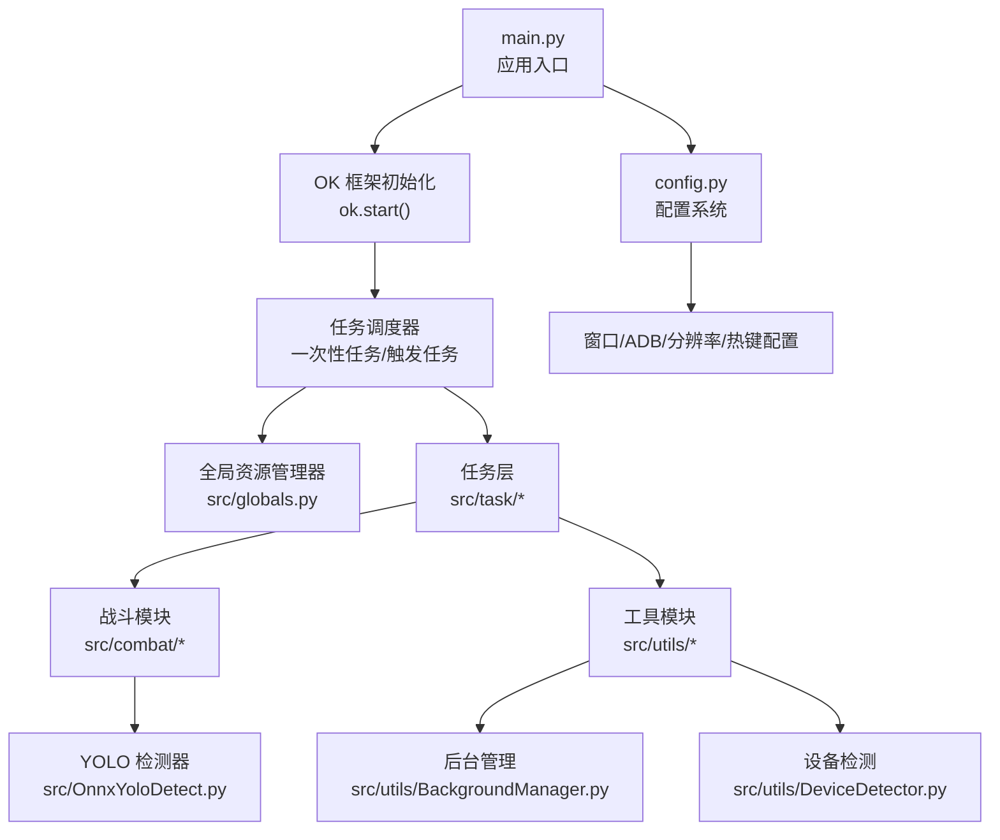
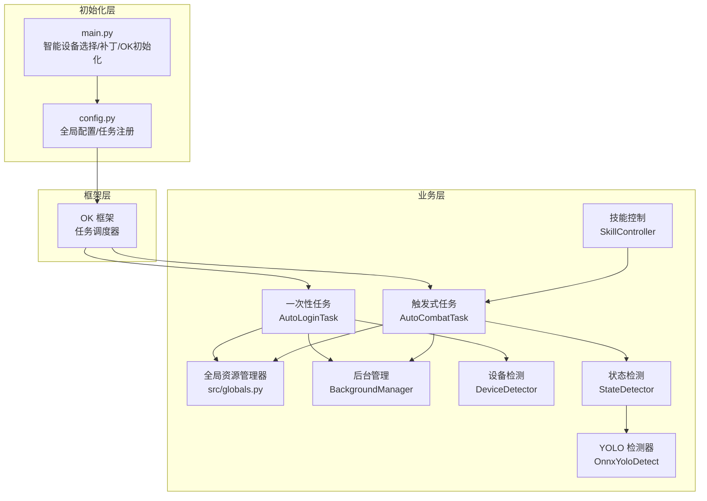
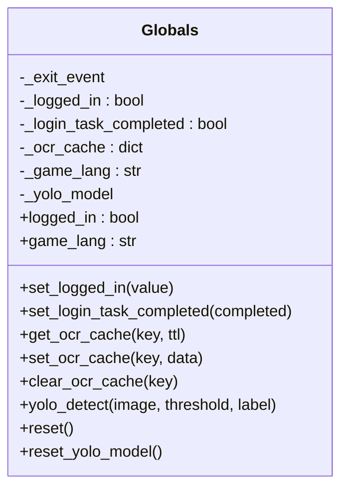
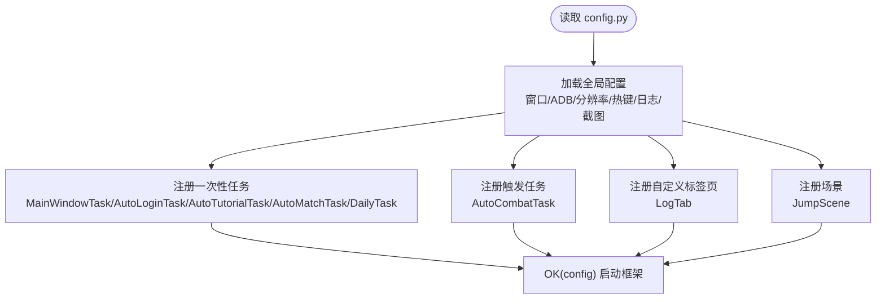
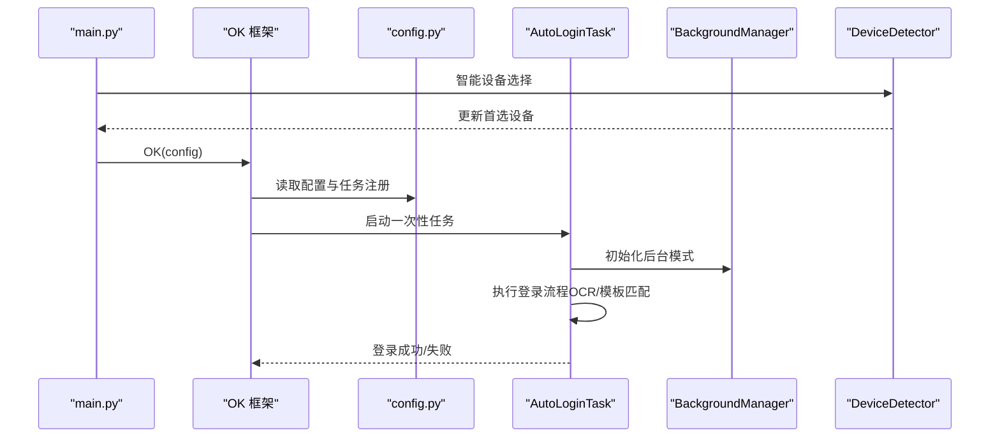
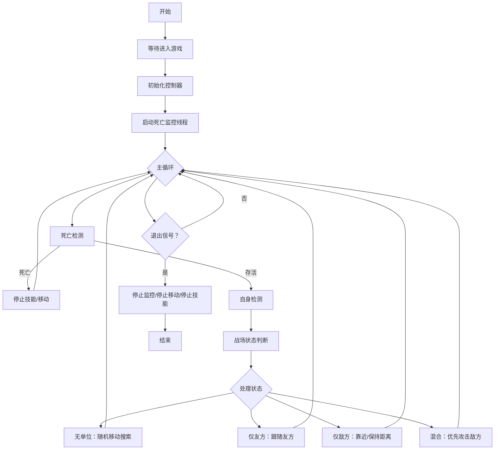
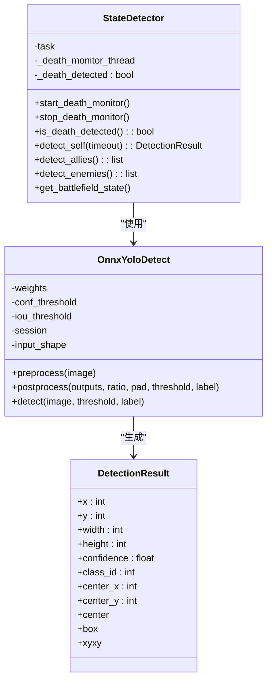
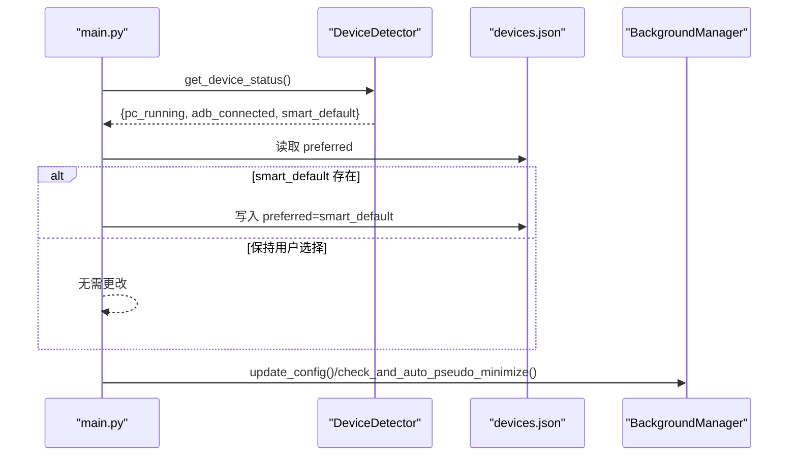
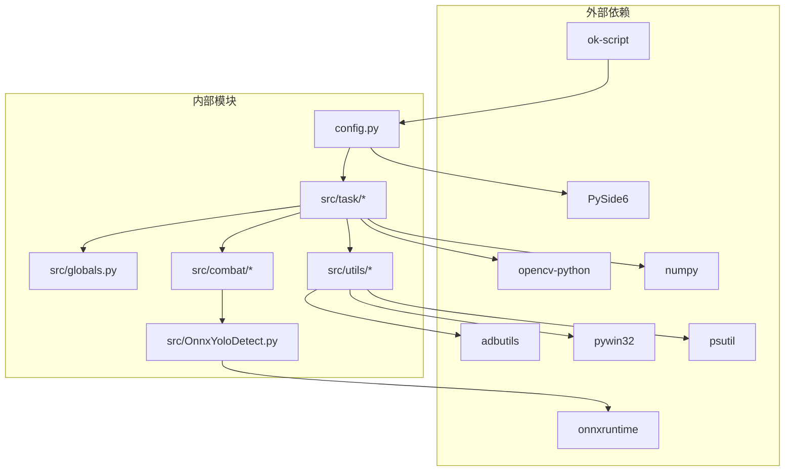

# 架构总览

<cite>
**本文档引用的文件**
- [main.py](file://main.py)
- [config.py](file://config.py)
- [src/globals.py](file://src/globals.py)
- [src/task/BaseJumpTask.py](file://src/task/BaseJumpTask.py)
- [src/task/AutoLoginTask.py](file://src/task/AutoLoginTask.py)
- [src/task/AutoCombatTask.py](file://src/task/AutoCombatTask.py)
- [src/utils/DeviceDetector.py](file://src/utils/DeviceDetector.py)
- [src/utils/BackgroundManager.py](file://src/utils/BackgroundManager.py)
- [src/OnnxYoloDetect.py](file://src/OnnxYoloDetect.py)
- [src/combat/state_detector.py](file://src/combat/state_detector.py)
- [src/combat/skill_controller.py](file://src/combat/skill_controller.py)
- [src/constants/features.py](file://src/constants/features.py)
- [requirements.txt](file://requirements.txt)
</cite>

## 目录
1. [引言](#引言)
2. [项目结构](#项目结构)
3. [核心组件](#核心组件)
4. [架构总览](#架构总览)
5. [详细组件分析](#详细组件分析)
6. [依赖关系分析](#依赖关系分析)
7. [性能考虑](#性能考虑)
8. [故障排查指南](#故障排查指南)
9. [结论](#结论)

## 引言
本项目基于 OK-Script 框架构建，采用任务驱动架构与模块化设计原则，围绕“自动登录”“自动战斗”等核心业务场景，提供稳定的后台运行能力与可配置的图形界面。系统通过全局资源管理器统一管理登录状态、OCR 缓存与 YOLO 模型；通过配置系统集中管理窗口、ADB、分辨率、热键等参数；通过任务调度器组织一次性任务与触发式任务，形成清晰的职责划分与交互关系。

## 项目结构
项目采用按功能域划分的模块化组织方式，主要目录与职责如下：
- src：核心源码
  - task：任务层，包含一次性任务与触发式任务
  - combat：战斗相关检测与控制模块
  - utils：通用工具与后台管理
  - constants：常量定义
  - globals.py：全局资源管理器
  - OnnxYoloDetect.py：YOLO 检测器封装
- configs：配置文件集合
- assets：资源文件（模型、模板等）
- docs：文档
- i18n/zh_CN：国际化翻译
- tests：单元测试

图表来源
- [main.py:1-107](file://main.py#L1-L107)
- [config.py:1-149](file://config.py#L1-L149)

章节来源
- [main.py:1-107](file://main.py#L1-L107)
- [config.py:1-149](file://config.py#L1-L149)

## 核心组件
- 全局资源管理器（src/globals.py）
  - 统一管理登录状态、OCR 缓存、游戏语言、YOLO 模型等全局资源
  - 提供延迟加载的 YOLO 检测器与缓存清理能力
- 配置系统（config.py）
  - 定义窗口、ADB、分辨率、热键、日志、截图等全局配置
  - 注册一次性任务与触发任务，以及自定义 GUI 标签页与场景
- 任务调度器（OK 框架）
  - 通过 config.py 中的注册项自动加载任务
  - 支持一次性任务与触发式任务的调度与生命周期管理
- 任务层（src/task/*）
  - BaseJumpTask：一次性任务基类，提供截图、点击、登录等待、语言转换等通用能力
  - AutoLoginTask：自动登录任务，负责登录界面识别、问卷处理、账号输入等
  - AutoCombatTask：触发式战斗任务，基于 YOLO 检测与技能控制实现智能战斗
- 战斗模块（src/combat/*）
  - StateDetector：并行死亡检测与单位检测（自己、友方、敌方）
  - SkillController：技能释放控制（键盘/ADB 点击），支持后台模式
- 工具模块（src/utils/*）
  - BackgroundManager：后台模式、伪最小化、静音等窗口状态管理
  - DeviceDetector：智能设备选择（PC/ADB），自动更新首选设备
- YOLO 检测器（src/OnnxYoloDetect.py）
  - ONNXRuntime 推理封装，支持 CPU/GPU 执行提供者
  - 提供预处理、后处理与 NMS 非极大值抑制

章节来源
- [src/globals.py:1-257](file://src/globals.py#L1-L257)
- [config.py:68-148](file://config.py#L68-L148)
- [src/task/BaseJumpTask.py:14-422](file://src/task/BaseJumpTask.py#L14-L422)
- [src/task/AutoLoginTask.py:21-800](file://src/task/AutoLoginTask.py#L21-L800)
- [src/task/AutoCombatTask.py:32-693](file://src/task/AutoCombatTask.py#L32-L693)
- [src/combat/state_detector.py:24-446](file://src/combat/state_detector.py#L24-L446)
- [src/combat/skill_controller.py:24-347](file://src/combat/skill_controller.py#L24-L347)
- [src/utils/BackgroundManager.py:7-155](file://src/utils/BackgroundManager.py#L7-L155)
- [src/utils/DeviceDetector.py:11-149](file://src/utils/DeviceDetector.py#L11-L149)
- [src/OnnxYoloDetect.py:17-315](file://src/OnnxYoloDetect.py#L17-L315)

## 架构总览
系统采用“OK-Script 框架 + 任务驱动 + 模块化”的整体架构：
- 初始化阶段：main.py 中进行智能设备选择与 StartController 补丁，随后初始化 OK(config) 并启动框架
- 配置阶段：config.py 定义全局配置与任务注册，OK 框架读取并加载
- 运行阶段：任务调度器根据注册项启动一次性任务与触发式任务，任务通过全局资源管理器与工具模块协作完成业务目标

图表来源
- [main.py:99-107](file://main.py#L99-L107)
- [config.py:131-148](file://config.py#L131-L148)
- [src/task/AutoLoginTask.py:205-267](file://src/task/AutoLoginTask.py#L205-L267)
- [src/task/AutoCombatTask.py:84-134](file://src/task/AutoCombatTask.py#L84-L134)
- [src/globals.py:16-257](file://src/globals.py#L16-L257)
- [src/utils/BackgroundManager.py:7-155](file://src/utils/BackgroundManager.py#L7-L155)
- [src/utils/DeviceDetector.py:11-149](file://src/utils/DeviceDetector.py#L11-L149)
- [src/combat/state_detector.py:24-446](file://src/combat/state_detector.py#L24-L446)
- [src/combat/skill_controller.py:24-347](file://src/combat/skill_controller.py#L24-L347)
- [src/OnnxYoloDetect.py:17-315](file://src/OnnxYoloDetect.py#L17-L315)

## 详细组件分析

### 全局资源管理器（Globals）
- 职责
  - 登录状态与登录任务完成状态管理
  - OCR 缓存（带 TTL 的键值缓存）
  - 游戏语言设置与转换
  - YOLO 模型延迟加载与检测代理
  - 全局重置与模型释放
- 设计要点
  - 单例模式与 Qt 对象继承，便于跨模块共享
  - 延迟加载避免启动开销，异常时返回空结果
  - 提供统一的 yolo_detect 接口，屏蔽底层模型细节

图表来源
- [src/globals.py:16-257](file://src/globals.py#L16-L257)

章节来源
- [src/globals.py:16-257](file://src/globals.py#L16-L257)

### 配置系统（Config）
- 职责
  - 定义窗口、ADB、分辨率、热键、日志、截图等全局参数
  - 注册一次性任务与触发式任务
  - 注册自定义 GUI 标签页与场景
  - 提供 my_app 全局对象（指向 Globals）
- 设计要点
  - 使用 ConfigOption 定义可配置项与描述
  - 通过 config 字典集中管理，OK 框架读取并应用

图表来源
- [config.py:68-148](file://config.py#L68-L148)

章节来源
- [config.py:68-148](file://config.py#L68-L148)

### 任务驱动架构与模块化设计
- 一次性任务（One-time tasks）
  - AutoLoginTask：自动登录流程，包含加载检测、状态容错、问卷处理、账号输入等
  - MainWindowTask、AutoTutorialTask、AutoMatchTask、DailyTask：其他一次性任务
- 触发式任务（Trigger tasks）
  - AutoCombatTask：触发式战斗任务，被其他任务调用，实现智能战斗逻辑
- 模块化设计原则
  - 任务间通过 OK 框架调度，解耦业务逻辑
  - 共享能力下沉至工具模块（后台管理、设备检测）
  - 检测与控制分离（StateDetector/SkillController）

图表来源
- [main.py:99-107](file://main.py#L99-L107)
- [config.py:131-148](file://config.py#L131-L148)
- [src/task/AutoLoginTask.py:205-267](file://src/task/AutoLoginTask.py#L205-L267)
- [src/utils/BackgroundManager.py:7-155](file://src/utils/BackgroundManager.py#L7-L155)
- [src/utils/DeviceDetector.py:11-149](file://src/utils/DeviceDetector.py#L11-L149)

章节来源
- [src/task/BaseJumpTask.py:14-422](file://src/task/BaseJumpTask.py#L14-L422)
- [src/task/AutoLoginTask.py:21-800](file://src/task/AutoLoginTask.py#L21-L800)
- [src/task/AutoCombatTask.py:32-693](file://src/task/AutoCombatTask.py#L32-L693)

### 自动战斗任务（触发式）
- 职责
  - 作为触发任务被其他任务调用
  - 基于 YOLO 检测战场状态，控制移动与技能释放
  - 支持后台模式下的伪最小化与静音
- 流程
  1) 等待进入游戏（测试模式可跳过）
  2) 初始化控制器（状态检测/移动/技能/距离计算）
  3) 启动死亡状态并行监控
  4) 主循环：死亡检测 → 自身检测 → 战场状态判断 → 技能/移动控制

图表来源
- [src/task/AutoCombatTask.py:84-134](file://src/task/AutoCombatTask.py#L84-L134)
- [src/task/AutoCombatTask.py:197-271](file://src/task/AutoCombatTask.py#L197-L271)
- [src/combat/state_detector.py:72-184](file://src/combat/state_detector.py#L72-L184)
- [src/combat/skill_controller.py:139-250](file://src/combat/skill_controller.py#L139-L250)

章节来源
- [src/task/AutoCombatTask.py:32-693](file://src/task/AutoCombatTask.py#L32-L693)
- [src/combat/state_detector.py:24-446](file://src/combat/state_detector.py#L24-L446)
- [src/combat/skill_controller.py:24-347](file://src/combat/skill_controller.py#L24-L347)

### YOLO 检测器与战斗状态检测
- OnnxYoloDetect
  - ONNXRuntime 推理封装，支持 CPU/GPU 执行提供者
  - 预处理/后处理/NMS，统一 DetectionResult 接口
- StateDetector
  - 并行死亡检测线程，快速查询死亡状态
  - 自身/友方/敌方检测，战场状态枚举（无单位/仅友方/仅敌方/混合）

图表来源
- [src/OnnxYoloDetect.py:17-315](file://src/OnnxYoloDetect.py#L17-L315)
- [src/combat/state_detector.py:24-446](file://src/combat/state_detector.py#L24-L446)

章节来源
- [src/OnnxYoloDetect.py:17-315](file://src/OnnxYoloDetect.py#L17-L315)
- [src/combat/state_detector.py:24-446](file://src/combat/state_detector.py#L24-L446)

### 后台模式与设备智能选择
- BackgroundManager
  - 后台模式开关、静音策略、伪最小化、前台检测
  - 自动伪最小化以保证后台截图与输入
- DeviceDetector
  - 检测 PC 游戏窗口与 ADB 设备连接
  - 智能默认设备选择（PC/ADB），自动写回首选设备

图表来源
- [main.py:54-95](file://main.py#L54-L95)
- [src/utils/DeviceDetector.py:112-149](file://src/utils/DeviceDetector.py#L112-L149)
- [src/utils/BackgroundManager.py:18-121](file://src/utils/BackgroundManager.py#L18-L121)

章节来源
- [src/utils/BackgroundManager.py:7-155](file://src/utils/BackgroundManager.py#L7-L155)
- [src/utils/DeviceDetector.py:11-149](file://src/utils/DeviceDetector.py#L11-L149)

## 依赖关系分析
- 外部依赖
  - ok-script：OK-Script 框架核心
  - opencv-python、numpy：图像处理与矩阵运算
  - onnxruntime/onnxruntime-directml：YOLO 推理
  - adbutils、pywin32、psutil：ADB 设备检测与系统交互
  - PySide6：GUI 界面
- 内部依赖
  - 任务层依赖全局资源管理器与工具模块
  - 战斗模块依赖 YOLO 检测器
  - 配置系统贯穿初始化与运行阶段

图表来源
- [requirements.txt:1-14](file://requirements.txt#L1-L14)
- [config.py:68-148](file://config.py#L68-L148)
- [src/OnnxYoloDetect.py:11-15](file://src/OnnxYoloDetect.py#L11-L15)

章节来源
- [requirements.txt:1-14](file://requirements.txt#L1-L14)
- [config.py:68-148](file://config.py#L68-L148)

## 性能考虑
- YOLO 推理优化
  - 优先使用 CUDAExecutionProvider，降级至 CPU
  - 预处理与后处理批量化，NMS 降低重复检测
- 后台模式优化
  - 伪最小化与前台检测减少截图失败
  - 后台输入使用 SendInput，降低前台切换成本
- 任务调度优化
  - 触发式任务按需启动，避免不必要的资源占用
  - OCR 缓存与 YOLO 模型延迟加载，缩短启动时间

## 故障排查指南
- 登录任务失败
  - 检查设备首选项是否正确（智能设备选择）
  - 查看登录状态日志与错误截图保存
  - 核对热键配置与窗口标题匹配
- 战斗任务异常
  - 确认后台模式与伪最小化状态
  - 检查 YOLO 模型路径与 ONNXRuntime 安装
  - 查看详细日志中的帧尺寸与检测结果
- 设备连接问题
  - 使用 DeviceDetector 检查 PC/ADB 状态
  - 确认 ADB 工具可用与设备权限

章节来源
- [src/task/AutoLoginTask.py:512-681](file://src/task/AutoLoginTask.py#L512-L681)
- [src/task/AutoCombatTask.py:197-271](file://src/task/AutoCombatTask.py#L197-L271)
- [src/utils/DeviceDetector.py:112-149](file://src/utils/DeviceDetector.py#L112-L149)

## 结论
本项目以 OK-Script 框架为基础，结合任务驱动与模块化设计，实现了稳定可靠的自动化流程。通过全局资源管理器统一资源、配置系统集中参数、任务调度器编排流程，配合后台管理与设备检测，形成了可扩展、可维护的架构体系。自动登录与自动战斗两大核心场景覆盖完整业务闭环，具备良好的可配置性与可移植性。