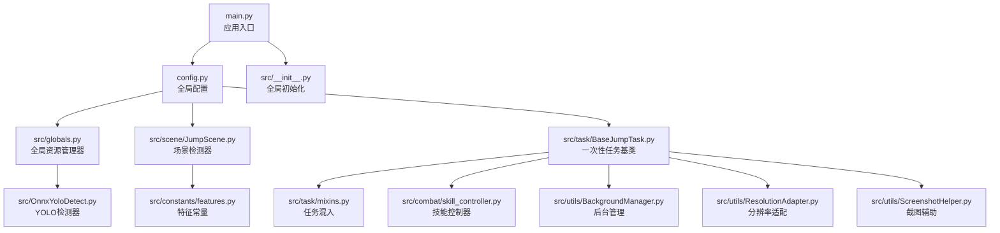
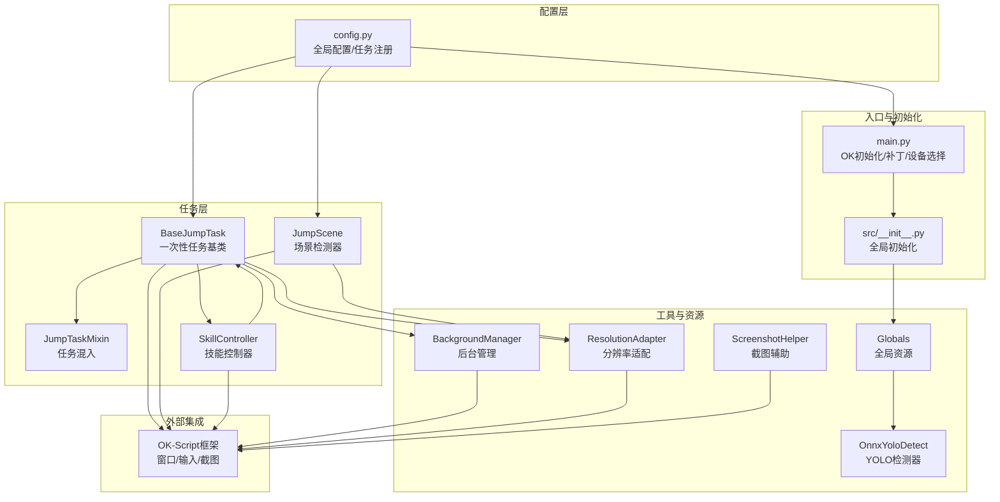
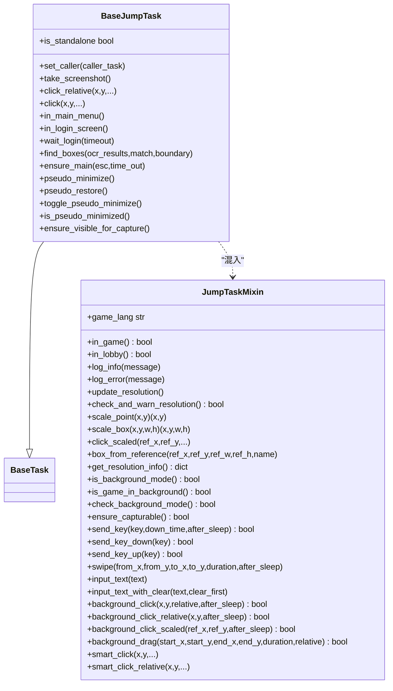
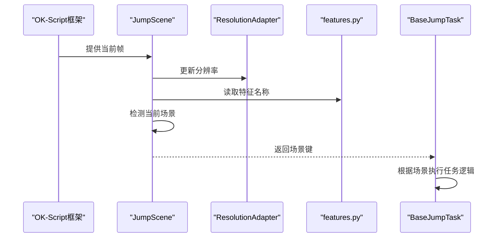
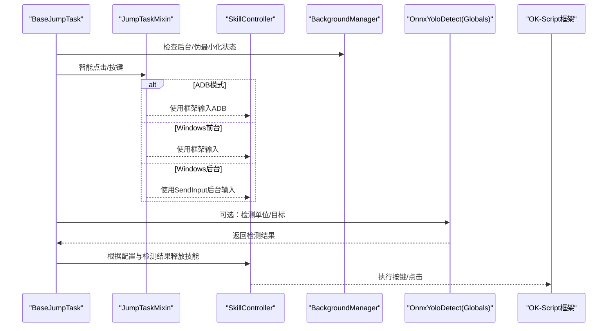
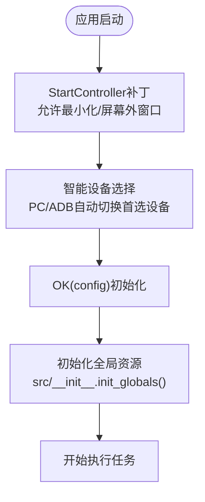
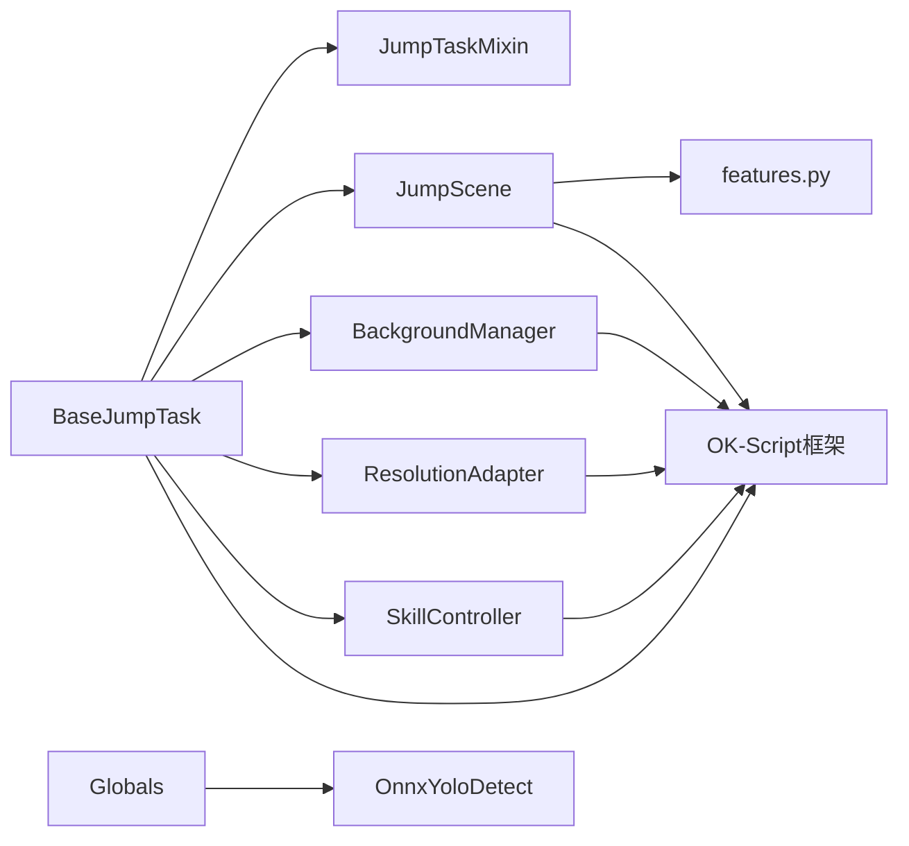

# 核心系统架构

<cite>
**本文档引用的文件**
- [main.py](file://main.py)
- [config.py](file://config.py)
- [src/__init__.py](file://src/__init__.py)
- [src/globals.py](file://src/globals.py)
- [src/task/BaseJumpTask.py](file://src/task/BaseJumpTask.py)
- [src/task/mixins.py](file://src/task/mixins.py)
- [src/OnnxYoloDetect.py](file://src/OnnxYoloDetect.py)
- [src/combat/skill_controller.py](file://src/combat/skill_controller.py)
- [src/scene/JumpScene.py](file://src/scene/JumpScene.py)
- [src/constants/features.py](file://src/constants/features.py)
- [src/utils/BackgroundManager.py](file://src/utils/BackgroundManager.py)
- [src/utils/ResolutionAdapter.py](file://src/utils/ResolutionAdapter.py)
- [src/utils/ScreenshotHelper.py](file://src/utils/ScreenshotHelper.py)
- [configs/AutoCombatTask.json](file://configs/AutoCombatTask.json)
- [configs/Basic Options.json](file://configs/Basic Options.json)
</cite>

## 目录
1. [引言](#引言)
2. [项目结构](#项目结构)
3. [核心组件](#核心组件)
4. [架构总览](#架构总览)
5. [详细组件分析](#详细组件分析)
6. [依赖关系分析](#依赖关系分析)
7. [性能考量](#性能考量)
8. [故障排查指南](#故障排查指南)
9. [结论](#结论)
10. [附录](#附录)

## 引言
本文件面向开发者与高级用户，系统性梳理 OK-Jump 的核心系统架构，重点解释任务驱动架构、模块化设计、数据流与关键组件关系。文档覆盖从游戏画面到技能释放的完整流程，阐述 OK-Script 框架集成方式，并提供架构图与组件交互说明，帮助快速理解与扩展系统。

## 项目结构
OK-Jump 采用分层与模块化结合的组织方式：
- 根入口与配置：main.py 初始化 OK 框架并加载配置；config.py 定义全局配置与任务注册。
- 任务层：src/task 下包含一次性任务与触发任务基类及混入，统一抽象输入、场景检测、分辨率适配、后台模式等能力。
- 场景层：src/scene 提供场景检测器，基于特征模板识别当前游戏阶段。
- 战斗层：src/combat 提供技能控制器，按配置驱动键盘/点击释放技能。
- 工具层：src/utils 提供后台管理、分辨率适配、截图辅助等通用能力。
- 全局资源：src/globals 提供全局状态与资源（登录态、OCR 缓存、YOLO 模型）统一访问。
- 常量与配置：src/constants 定义特征常量；configs 存放任务与基础配置 JSON。

**图表来源**
- [main.py:1-107](file://main.py#L1-L107)
- [config.py:1-149](file://config.py#L1-L149)
- [src/__init__.py:1-32](file://src/__init__.py#L1-L32)
- [src/globals.py:1-257](file://src/globals.py#L1-L257)
- [src/scene/JumpScene.py:1-216](file://src/scene/JumpScene.py#L1-L216)
- [src/task/BaseJumpTask.py:1-422](file://src/task/BaseJumpTask.py#L1-L422)
- [src/task/mixins.py:1-774](file://src/task/mixins.py#L1-L774)
- [src/combat/skill_controller.py:1-347](file://src/combat/skill_controller.py#L1-L347)
- [src/utils/BackgroundManager.py:1-155](file://src/utils/BackgroundManager.py#L1-L155)
- [src/utils/ResolutionAdapter.py:1-163](file://src/utils/ResolutionAdapter.py#L1-L163)
- [src/constants/features.py:1-86](file://src/constants/features.py#L1-L86)
- [src/OnnxYoloDetect.py:1-315](file://src/OnnxYoloDetect.py#L1-L315)
- [src/utils/ScreenshotHelper.py:1-68](file://src/utils/ScreenshotHelper.py#L1-L68)

**章节来源**
- [main.py:1-107](file://main.py#L1-L107)
- [config.py:1-149](file://config.py#L1-L149)

## 核心组件
- 全局资源管理器（Globals）：集中管理登录状态、OCR 缓存、YOLO 模型等全局资源，提供延迟加载与统一访问接口。
- 场景检测器（JumpScene）：基于特征模板识别当前游戏场景（登录、大厅、主菜单、游戏中、结算等）。
- 任务基类与混入（BaseJumpTask + JumpTaskMixin）：统一抽象后台模式、分辨率适配、智能点击/按键、语言转换、等待条件等能力。
- 技能控制器（SkillController）：根据任务配置与热键映射，驱动键盘或点击释放技能，支持后台模式。
- YOLO 检测器（OnnxYoloDetect）：提供战场单位与目标圈识别，支持 CPU/GPU 执行提供者。
- 后台管理器（BackgroundManager）：检测后台状态、静音策略、伪最小化等。
- 分辨率适配器（ResolutionAdapter）：提供参考分辨率与缩放因子，保障不同分辨率下的坐标一致性。
- 截图辅助（ScreenshotHelper）：提供截图保存与特征模板导出能力。

**章节来源**
- [src/globals.py:16-257](file://src/globals.py#L16-L257)
- [src/scene/JumpScene.py:8-216](file://src/scene/JumpScene.py#L8-L216)
- [src/task/BaseJumpTask.py:14-422](file://src/task/BaseJumpTask.py#L14-L422)
- [src/task/mixins.py:15-774](file://src/task/mixins.py#L15-L774)
- [src/combat/skill_controller.py:24-347](file://src/combat/skill_controller.py#L24-L347)
- [src/OnnxYoloDetect.py:17-315](file://src/OnnxYoloDetect.py#L17-L315)
- [src/utils/BackgroundManager.py:7-155](file://src/utils/BackgroundManager.py#L7-L155)
- [src/utils/ResolutionAdapter.py:4-163](file://src/utils/ResolutionAdapter.py#L4-L163)
- [src/utils/ScreenshotHelper.py:7-68](file://src/utils/ScreenshotHelper.py#L7-L68)

## 架构总览
OK-Jump 采用“配置驱动 + 任务驱动”的架构：
- 配置驱动：config.py 定义窗口、ADB、OCR、模板匹配、全局配置项与任务注册，OK-Script 框架据此初始化。
- 任务驱动：一次性任务（如自动登录、教程、匹配、日常）与触发任务（如自动战斗）通过基类与混入统一能力，按配置执行。
- 数据流：从 OK-Script 捕获游戏画面，经场景检测与特征识别，到任务逻辑决策，再到技能控制器释放技能，最终回到画面反馈。

**图表来源**
- [config.py:68-149](file://config.py#L68-L149)
- [main.py:99-107](file://main.py#L99-L107)
- [src/__init__.py:17-32](file://src/__init__.py#L17-L32)
- [src/globals.py:43-257](file://src/globals.py#L43-L257)
- [src/scene/JumpScene.py:21-216](file://src/scene/JumpScene.py#L21-L216)
- [src/task/BaseJumpTask.py:26-422](file://src/task/BaseJumpTask.py#L26-L422)
- [src/task/mixins.py:32-774](file://src/task/mixins.py#L32-L774)
- [src/combat/skill_controller.py:61-347](file://src/combat/skill_controller.py#L61-L347)
- [src/utils/BackgroundManager.py:18-155](file://src/utils/BackgroundManager.py#L18-L155)
- [src/utils/ResolutionAdapter.py:34-163](file://src/utils/ResolutionAdapter.py#L34-L163)
- [src/OnnxYoloDetect.py:33-315](file://src/OnnxYoloDetect.py#L33-L315)
- [src/utils/ScreenshotHelper.py:17-68](file://src/utils/ScreenshotHelper.py#L17-L68)

## 详细组件分析

### 任务驱动架构与模块化设计
- 一次性任务基类（BaseJumpTask）：继承 OK-Script 的 BaseTask，融合 JumpTaskMixin，提供登录等待、场景检测、智能点击/按键、语言转换、等待条件、伪最小化等能力。
- 任务混入（JumpTaskMixin）：抽取通用能力（分辨率适配、后台模式、输入适配、坐标缩放、输入法适配等），避免重复代码，提升可维护性。
- 触发任务注册：config.py 的 trigger_tasks 注册自动战斗任务，配合 OK-Script 的触发器周期执行。

**图表来源**
- [src/task/BaseJumpTask.py:14-422](file://src/task/BaseJumpTask.py#L14-L422)
- [src/task/mixins.py:15-774](file://src/task/mixins.py#L15-L774)

**章节来源**
- [src/task/BaseJumpTask.py:14-422](file://src/task/BaseJumpTask.py#L14-L422)
- [src/task/mixins.py:15-774](file://src/task/mixins.py#L15-L774)
- [config.py:139-141](file://config.py#L139-L141)

### 场景检测与数据流
- 场景检测器（JumpScene）：在每帧画面中检测当前场景（登录、大厅、主菜单、游戏中、结算等），并维护场景历史。
- 特征常量（features.py）：统一管理 coco_detection.json 中的类别名称，保证识别一致性。
- 分辨率适配（ResolutionAdapter）：在检测前更新分辨率，确保特征匹配与坐标缩放准确。

**图表来源**
- [src/scene/JumpScene.py:39-71](file://src/scene/JumpScene.py#L39-L71)
- [src/constants/features.py:9-86](file://src/constants/features.py#L9-L86)
- [src/utils/ResolutionAdapter.py:34-44](file://src/utils/ResolutionAdapter.py#L34-L44)

**章节来源**
- [src/scene/JumpScene.py:39-197](file://src/scene/JumpScene.py#L39-L197)
- [src/constants/features.py:9-86](file://src/constants/features.py#L9-L86)
- [src/utils/ResolutionAdapter.py:34-163](file://src/utils/ResolutionAdapter.py#L34-L163)

### 技能释放流程（从游戏画面到技能释放）
- 技能控制器（SkillController）：依据任务配置与热键映射，按间隔释放技能；在 ADB 模式下使用点击，在 Windows 模式下使用键盘或后台输入。
- 任务混入（JumpTaskMixin）：提供智能输入与后台点击能力，确保在后台或伪最小化状态下仍可正确操作。
- YOLO 检测器（可选）：在需要识别单位/目标时，通过 Globals 提供的 yolo_detect 接口进行检测。

**图表来源**
- [src/combat/skill_controller.py:114-282](file://src/combat/skill_controller.py#L114-L282)
- [src/task/mixins.py:381-774](file://src/task/mixins.py#L381-L774)
- [src/globals.py:204-257](file://src/globals.py#L204-L257)
- [src/utils/BackgroundManager.py:46-92](file://src/utils/BackgroundManager.py#L46-L92)

**章节来源**
- [src/combat/skill_controller.py:61-347](file://src/combat/skill_controller.py#L61-L347)
- [src/task/mixins.py:381-774](file://src/task/mixins.py#L381-L774)
- [src/globals.py:204-257](file://src/globals.py#L204-L257)
- [src/utils/BackgroundManager.py:46-155](file://src/utils/BackgroundManager.py#L46-L155)

### 全局资源与配置系统
- 全局资源（Globals）：集中管理登录状态、OCR 缓存、游戏语言、YOLO 模型等；提供延迟加载与统一访问接口。
- 配置系统（config.py）：定义窗口、ADB、OCR、模板匹配、全局配置项与任务注册；OK-Script 框架据此初始化。
- 入口补丁与设备选择：main.py 在 OK 初始化前进行 StartController 补丁与智能设备选择，确保后台模式与设备兼容。

**图表来源**
- [main.py:29-95](file://main.py#L29-L95)
- [main.py:99-107](file://main.py#L99-L107)
- [src/__init__.py:17-32](file://src/__init__.py#L17-L32)
- [config.py:68-149](file://config.py#L68-L149)

**章节来源**
- [src/globals.py:43-257](file://src/globals.py#L43-L257)
- [config.py:68-149](file://config.py#L68-L149)
- [main.py:29-95](file://main.py#L29-L95)

## 依赖关系分析
- 组件耦合与内聚：
  - BaseJumpTask 与 JumpTaskMixin 通过混入实现高内聚、低耦合的能力复用。
  - JumpScene 与 features.py 解耦特征名称，便于维护与扩展。
  - Globals 与 OnnxYoloDetect 解耦模型加载与使用，支持延迟加载与重置。
- 外部依赖与集成：
  - OK-Script 框架提供窗口交互、截图、输入、ADB 等能力。
  - onnxruntime 提供 YOLO 推理执行提供者（CPU/GPU）。
- 循环依赖规避：
  - 通过延迟导入与模块化拆分，避免循环依赖；例如 Globals 在首次使用时才导入 OnnxYoloDetect。

**图表来源**
- [src/task/BaseJumpTask.py:14-422](file://src/task/BaseJumpTask.py#L14-L422)
- [src/task/mixins.py:15-774](file://src/task/mixins.py#L15-L774)
- [src/scene/JumpScene.py:8-216](file://src/scene/JumpScene.py#L8-L216)
- [src/constants/features.py:9-86](file://src/constants/features.py#L9-L86)
- [src/utils/BackgroundManager.py:7-155](file://src/utils/BackgroundManager.py#L7-L155)
- [src/utils/ResolutionAdapter.py:4-163](file://src/utils/ResolutionAdapter.py#L4-L163)
- [src/combat/skill_controller.py:24-347](file://src/combat/skill_controller.py#L24-L347)
- [src/globals.py:204-257](file://src/globals.py#L204-L257)

**章节来源**
- [src/task/BaseJumpTask.py:14-422](file://src/task/BaseJumpTask.py#L14-L422)
- [src/task/mixins.py:15-774](file://src/task/mixins.py#L15-L774)
- [src/scene/JumpScene.py:8-216](file://src/scene/JumpScene.py#L8-L216)
- [src/constants/features.py:9-86](file://src/constants/features.py#L9-L86)
- [src/utils/BackgroundManager.py:7-155](file://src/utils/BackgroundManager.py#L7-L155)
- [src/utils/ResolutionAdapter.py:4-163](file://src/utils/ResolutionAdapter.py#L4-L163)
- [src/combat/skill_controller.py:24-347](file://src/combat/skill_controller.py#L24-L347)
- [src/globals.py:204-257](file://src/globals.py#L204-L257)

## 性能考量
- 后台模式与伪最小化：通过 BackgroundManager 与 BackgroundInputHelper，在后台或最小化状态下仍可截图与输入，减少 CPU/GPU 占用。
- 分辨率适配：ResolutionAdapter 统一缩放坐标，避免因分辨率差异导致的重复识别与误判。
- YOLO 模型延迟加载与重置：Globals 在首次使用时加载模型，必要时可重置以释放显存。
- 触发间隔与节流：config 中的触发间隔与任务配置（如 AutoCombatTask.json）控制执行频率，降低资源消耗。
- 截图与日志：ScreenshotHelper 提供截图保存，便于问题定位与训练样本收集。

[本节为通用指导，无需具体文件分析]

## 故障排查指南
- 后台模式无效或无法截图：
  - 检查 config 中 windows.skip_pos_check 与基本设置中的后台模式、最小化时伪最小化。
  - 确认 StartController 补丁已应用，且窗口句柄可获取。
- 技能释放失败：
  - 核对 AutoCombatTask.json 中技能开关与间隔配置。
  - 检查热键配置与任务混入的智能输入逻辑。
- 场景识别异常：
  - 确认 features.py 与 coco_detection.json 的类别名称一致。
  - 检查分辨率是否符合 16:9 比例，必要时调整窗口大小。
- YOLO 检测报错：
  - 确认 onnxruntime 已安装，模型文件存在且路径正确。
  - 检查 Globals 的 yolo_model 是否成功初始化。

**章节来源**
- [src/utils/BackgroundManager.py:18-92](file://src/utils/BackgroundManager.py#L18-L92)
- [main.py:29-51](file://main.py#L29-L51)
- [configs/AutoCombatTask.json:1-13](file://configs/AutoCombatTask.json#L1-L13)
- [src/constants/features.py:9-86](file://src/constants/features.py#L9-L86)
- [src/utils/ResolutionAdapter.py:98-143](file://src/utils/ResolutionAdapter.py#L98-L143)
- [src/globals.py:204-257](file://src/globals.py#L204-L257)

## 结论
OK-Jump 通过“配置驱动 + 任务驱动”实现了清晰的模块化架构：任务层统一抽象后台模式、分辨率适配、输入与场景检测；场景层与战斗层分别负责状态识别与动作执行；全局资源与工具层提供跨模块共享能力。该设计既保证了可维护性，又为扩展（如新增任务、识别模型、输入方式）提供了良好基础。

[本节为总结性内容，无需具体文件分析]

## 附录
- 关键配置项参考：
  - 基本设置与热键配置：见 config.py 与 Basic Options.json。
  - 自动战斗任务配置：见 AutoCombatTask.json。
- 常用路径参考：
  - 入口与初始化：main.py、src/__init__.py。
  - 全局资源：src/globals.py。
  - 任务与混入：src/task/BaseJumpTask.py、src/task/mixins.py。
  - 场景检测：src/scene/JumpScene.py、src/constants/features.py。
  - 技能控制：src/combat/skill_controller.py。
  - 工具与资源：src/utils/BackgroundManager.py、src/utils/ResolutionAdapter.py、src/utils/ScreenshotHelper.py、src/OnnxYoloDetect.py。

[本节为概览性内容，无需具体文件分析]