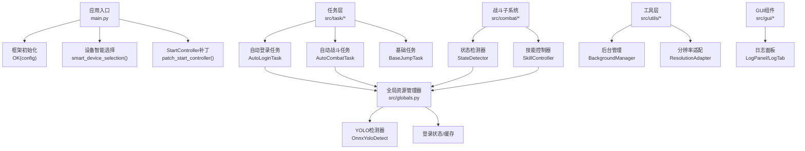
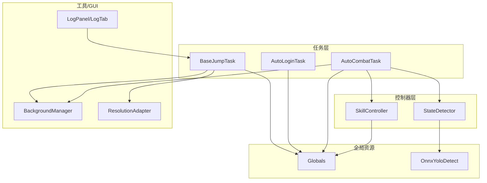
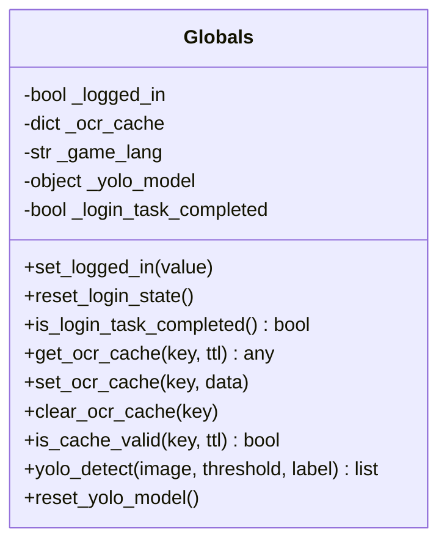
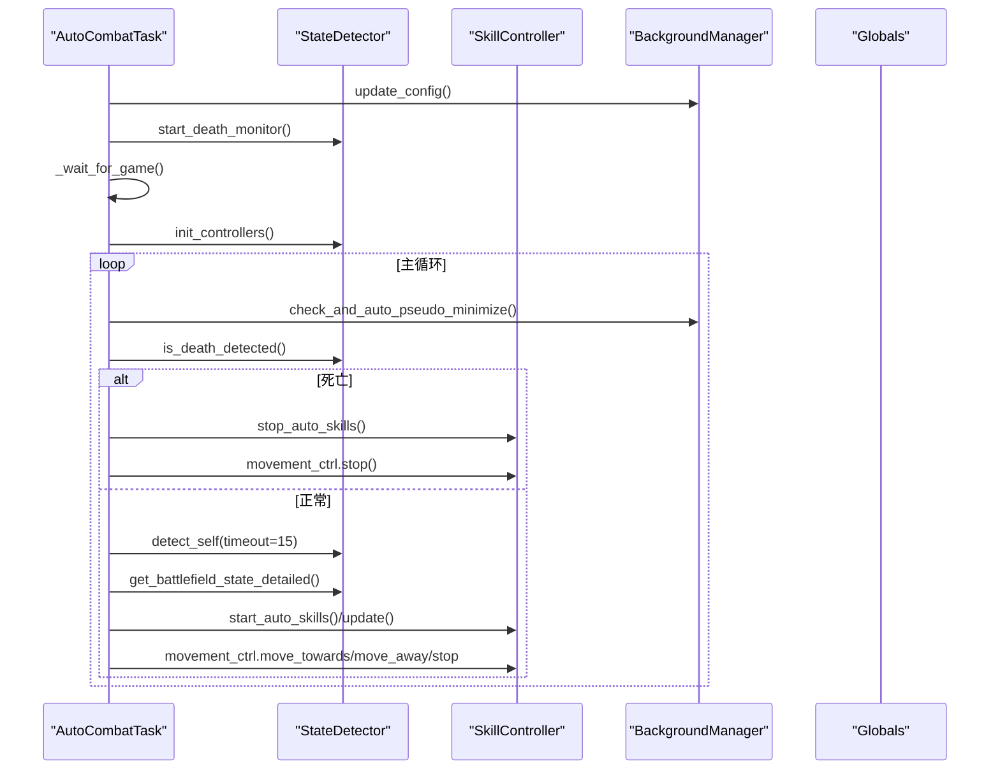
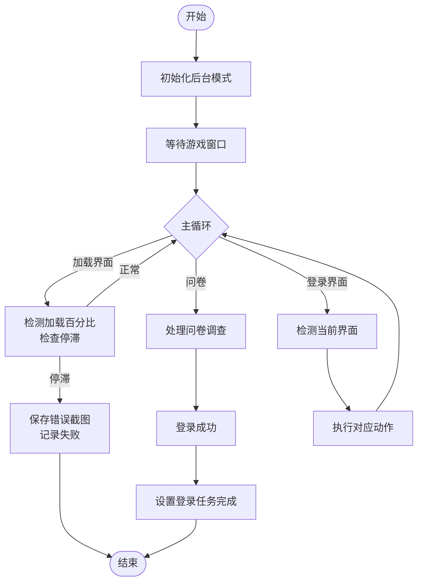
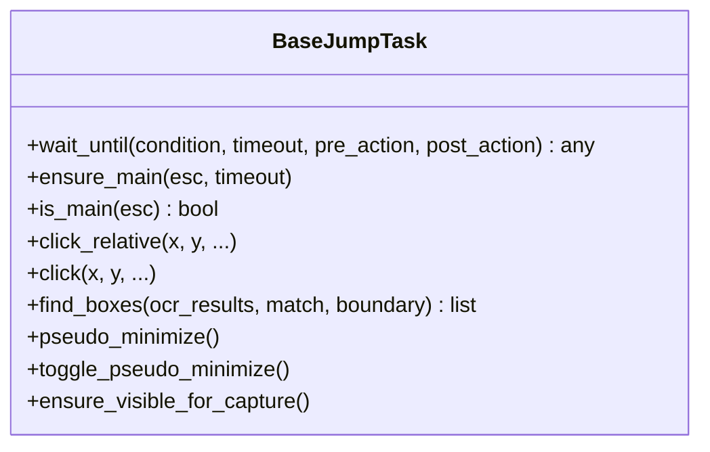
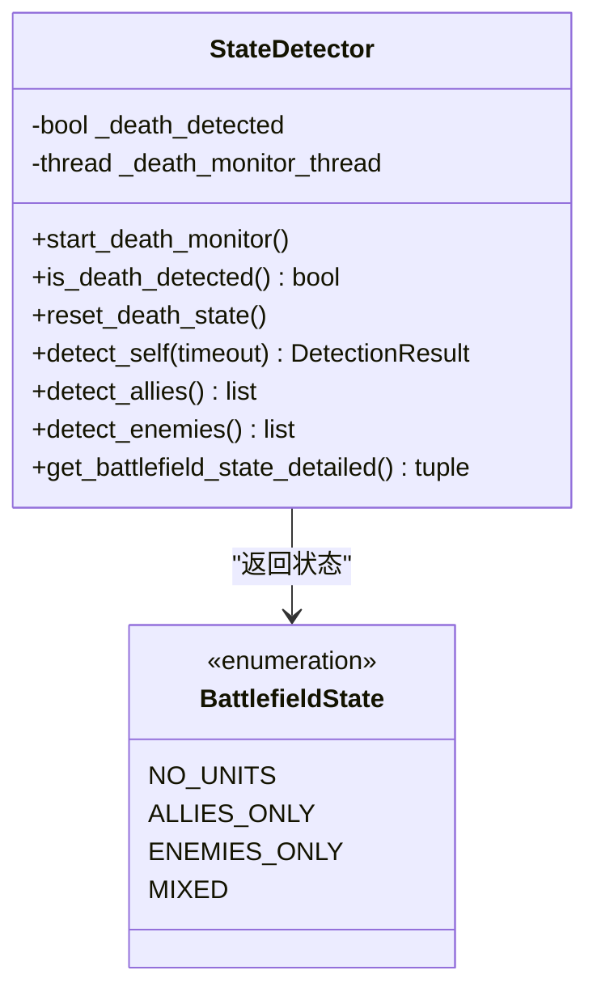
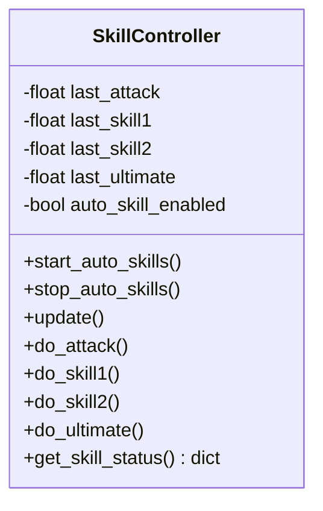
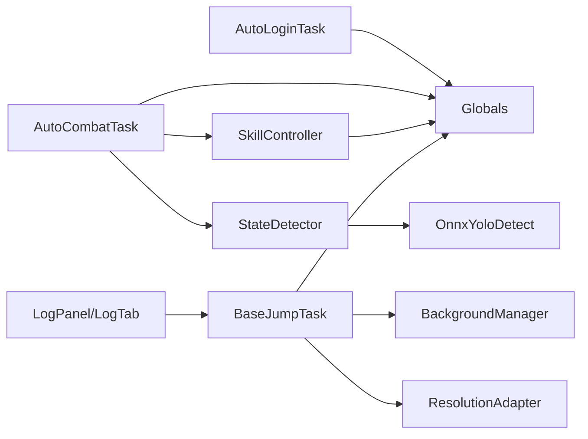

# 组件交互机制

<cite>
**本文档引用的文件**
- [main.py](file://main.py)
- [src/globals.py](file://src/globals.py)
- [src/OnnxYoloDetect.py](file://src/OnnxYoloDetect.py)
- [src/task/BaseJumpTask.py](file://src/task/BaseJumpTask.py)
- [src/task/AutoLoginTask.py](file://src/task/AutoLoginTask.py)
- [src/task/AutoCombatTask.py](file://src/task/AutoCombatTask.py)
- [src/combat/state_detector.py](file://src/combat/state_detector.py)
- [src/combat/skill_controller.py](file://src/combat/skill_controller.py)
- [src/gui/__init__.py](file://src/gui/__init__.py)
- [src/utils/__init__.py](file://src/utils/__init__.py)
</cite>

## 目录
1. [简介](#简介)
2. [项目结构](#项目结构)
3. [核心组件](#核心组件)
4. [架构总览](#架构总览)
5. [详细组件分析](#详细组件分析)
6. [依赖关系分析](#依赖关系分析)
7. [性能考量](#性能考量)
8. [故障排查指南](#故障排查指南)
9. [结论](#结论)
10. [附录](#附录)

## 简介
本文件聚焦OK-Jump的组件交互机制，系统性阐述全局资源管理器如何协调各模块、任务系统与控制器系统的交互关系、GUI组件与业务逻辑的解耦设计、事件驱动与回调的使用方式，并提供组件依赖图与接口定义，帮助开发者深入理解系统的动态交互特性。

## 项目结构
OK-Jump采用模块化分层组织：
- 应用入口与框架集成：main.py负责框架初始化、设备智能选择与补丁注入
- 全局资源管理：src/globals.py提供登录状态、OCR缓存、YOLO模型等全局共享资源
- 任务层：src/task/* 提供任务编排与业务流程（登录、战斗、日常等）
- 战斗子系统：src/combat/* 提供状态检测、技能控制、距离计算等
- 工具与GUI：src/utils/* 提供后台管理、分辨率适配、伪最小化等；src/gui/* 提供日志面板等GUI能力
- 检测引擎：src/OnnxYoloDetect.py封装ONNX YOLO推理

图表来源
- [main.py:1-107](file://main.py#L1-L107)
- [src/globals.py:16-257](file://src/globals.py#L16-L257)
- [src/OnnxYoloDetect.py:17-315](file://src/OnnxYoloDetect.py#L17-L315)
- [src/task/BaseJumpTask.py:14-422](file://src/task/BaseJumpTask.py#L14-L422)
- [src/task/AutoLoginTask.py:21-800](file://src/task/AutoLoginTask.py#L21-L800)
- [src/task/AutoCombatTask.py:32-693](file://src/task/AutoCombatTask.py#L32-L693)
- [src/combat/state_detector.py:24-446](file://src/combat/state_detector.py#L24-L446)
- [src/combat/skill_controller.py:24-347](file://src/combat/skill_controller.py#L24-L347)
- [src/gui/__init__.py:1-9](file://src/gui/__init__.py#L1-L9)
- [src/utils/__init__.py:1-6](file://src/utils/__init__.py#L1-L6)

章节来源
- [main.py:1-107](file://main.py#L1-L107)
- [src/globals.py:16-257](file://src/globals.py#L16-L257)

## 核心组件
- 全局资源管理器（Globals）
  - 职责：集中管理登录状态、OCR缓存、游戏语言、YOLO模型等全局共享资源
  - 关键能力：延迟加载YOLO模型、OCR缓存TTL管理、全局重置与状态复位
- 任务系统（BaseJumpTask、AutoLoginTask、AutoCombatTask）
  - 职责：封装业务流程、窗口状态检测、后台/前台适配、OCR与特征匹配
  - 关键能力：等待条件、场景检测、智能点击、伪最小化、后台输入
- 战斗子系统（StateDetector、SkillController）
  - 职责：并行死亡检测、自身/友方/敌方检测、状态判断、技能释放
  - 关键能力：后台线程监控、YOLO标签过滤、冷却与间隔控制
- 工具与GUI（BackgroundManager、ResolutionAdapter、LogPanel等）
  - 职责：后台模式、分辨率适配、伪最小化、日志面板
  - 关键能力：窗口句柄管理、日志路由、配置驱动

章节来源
- [src/globals.py:16-257](file://src/globals.py#L16-L257)
- [src/task/BaseJumpTask.py:14-422](file://src/task/BaseJumpTask.py#L14-L422)
- [src/task/AutoLoginTask.py:21-800](file://src/task/AutoLoginTask.py#L21-L800)
- [src/task/AutoCombatTask.py:32-693](file://src/task/AutoCombatTask.py#L32-L693)
- [src/combat/state_detector.py:24-446](file://src/combat/state_detector.py#L24-L446)
- [src/combat/skill_controller.py:24-347](file://src/combat/skill_controller.py#L24-L347)
- [src/gui/__init__.py:1-9](file://src/gui/__init__.py#L1-L9)
- [src/utils/__init__.py:1-6](file://src/utils/__init__.py#L1-L6)

## 架构总览
OK-Jump采用“任务驱动 + 控制器协同 + 全局资源协调”的架构：
- 任务层负责业务编排与流程控制
- 控制器层负责具体行为（点击、移动、技能释放）
- 全局资源管理器提供统一的资源访问与缓存策略
- GUI与业务逻辑通过配置与日志解耦，支持外部扩展

图表来源
- [src/task/BaseJumpTask.py:14-422](file://src/task/BaseJumpTask.py#L14-L422)
- [src/task/AutoLoginTask.py:21-800](file://src/task/AutoLoginTask.py#L21-L800)
- [src/task/AutoCombatTask.py:32-693](file://src/task/AutoCombatTask.py#L32-L693)
- [src/combat/state_detector.py:24-446](file://src/combat/state_detector.py#L24-L446)
- [src/combat/skill_controller.py:24-347](file://src/combat/skill_controller.py#L24-L347)
- [src/globals.py:16-257](file://src/globals.py#L16-L257)
- [src/OnnxYoloDetect.py:17-315](file://src/OnnxYoloDetect.py#L17-L315)
- [src/gui/__init__.py:1-9](file://src/gui/__init__.py#L1-L9)
- [src/utils/__init__.py:1-6](file://src/utils/__init__.py#L1-L6)

## 详细组件分析

### 全局资源管理器（Globals）
- 设计要点
  - 单例模式，集中管理登录状态、OCR缓存、游戏语言、YOLO模型
  - YOLO模型延迟加载，按需初始化，支持重置释放内存
  - OCR缓存带TTL，避免重复OCR开销
- 关键接口
  - 登录状态：set_logged_in、reset_login_state、is_login_task_completed
  - OCR缓存：get_ocr_cache、set_ocr_cache、clear_ocr_cache、is_cache_valid
  - YOLO：yolo_detect、reset_yolo_model
- 交互模式
  - 任务层通过全局资源访问YOLO检测与缓存
  - 控制器层通过全局资源访问YOLO检测结果

图表来源
- [src/globals.py:16-257](file://src/globals.py#L16-L257)

章节来源
- [src/globals.py:16-257](file://src/globals.py#L16-L257)

### 任务系统与控制器交互（AutoCombatTask）
- 设计要点
  - AutoCombatTask继承触发任务基类，内部组合StateDetector与SkillController
  - 并行死亡监控线程持续检测，主线程快速查询
  - 详细日志开关与配置驱动，严格遵循GUI设置
- 关键流程
  - 初始化后台模式与分辨率
  - 等待进入游戏（测试模式可跳过）
  - 启动死亡监控线程
  - 主循环：死亡检测 → 自身检测 → 战场状态判断 → 技能/移动控制
- 事件与回调
  - 死亡监控线程通过标志位快速通知主线程
  - 技能释放基于冷却时间与配置开关

图表来源
- [src/task/AutoCombatTask.py:32-693](file://src/task/AutoCombatTask.py#L32-L693)
- [src/combat/state_detector.py:24-446](file://src/combat/state_detector.py#L24-L446)
- [src/combat/skill_controller.py:24-347](file://src/combat/skill_controller.py#L24-L347)

章节来源
- [src/task/AutoCombatTask.py:32-693](file://src/task/AutoCombatTask.py#L32-L693)
- [src/combat/state_detector.py:24-446](file://src/combat/state_detector.py#L24-L446)
- [src/combat/skill_controller.py:24-347](file://src/combat/skill_controller.py#L24-L347)

### 自动登录任务（AutoLoginTask）
- 设计要点
  - 支持加载界面检测与停滞超时、问卷调查处理、账号输入（可选）
  - OCR缓存与截图管理，后台模式下的窗口状态记录
  - 登录成功后设置全局登录任务完成状态
- 关键流程
  - 后台模式初始化 → 等待游戏窗口 → 执行登录流程 → 成功/失败处理 → 容错检查
  - 加载界面检测优先级最高，避免误触其他界面
- 事件与回调
  - 加载停滞抛出异常，交由上层处理
  - 登录成功设置全局状态，通知任务已完成

图表来源
- [src/task/AutoLoginTask.py:21-800](file://src/task/AutoLoginTask.py#L21-L800)

章节来源
- [src/task/AutoLoginTask.py:21-800](file://src/task/AutoLoginTask.py#L21-L800)

### 基础任务（BaseJumpTask）
- 设计要点
  - 提供等待条件、场景检测、智能点击、伪最小化、后台输入等通用能力
  - OCR文本匹配支持简繁转换，语言配置来自全局配置
- 关键接口
  - 等待条件：wait_until、ensure_main、is_main
  - 点击适配：click_relative、click（后台/前台自动选择）
  - 伪最小化：pseudo_minimize、toggle_pseudo_minimize、ensure_visible_for_capture

图表来源
- [src/task/BaseJumpTask.py:14-422](file://src/task/BaseJumpTask.py#L14-L422)

章节来源
- [src/task/BaseJumpTask.py:14-422](file://src/task/BaseJumpTask.py#L14-L422)

### 战斗状态检测器（StateDetector）
- 设计要点
  - 并行死亡检测线程，30ms高频检测，降低误判
  - 自身/友方/敌方检测，支持单次与循环检测
  - 战场状态枚举（无单位、仅友方、仅敌方、混合）
- 关键接口
  - 死亡监控：start_death_monitor、is_death_detected、reset_death_state
  - 同步检测：detect_self、detect_allies、detect_enemies、get_battlefield_state_detailed

图表来源
- [src/combat/state_detector.py:24-446](file://src/combat/state_detector.py#L24-L446)

章节来源
- [src/combat/state_detector.py:24-446](file://src/combat/state_detector.py#L24-L446)

### 技能控制器（SkillController）
- 设计要点
  - 配置驱动：技能开关与间隔严格遵循GUI设置
  - 后台模式：使用SendInput或框架send_key适配ADB/Windows
  - 按键映射：从全局热键配置读取，支持默认键位
- 关键接口
  - 自动技能：start_auto_skills、stop_auto_skills、update
  - 技能释放：do_attack、do_skill1、do_skill2、do_ultimate
  - 状态查询：get_skill_status

图表来源
- [src/combat/skill_controller.py:24-347](file://src/combat/skill_controller.py#L24-L347)

章节来源
- [src/combat/skill_controller.py:24-347](file://src/combat/skill_controller.py#L24-L347)

### GUI与业务逻辑解耦
- 设计要点
  - GUI组件通过模块导出暴露接口（如LogPanel、LogTab），业务逻辑通过配置与日志与之解耦
  - 日志面板通过全局日志器输出，任务与控制器无需直接依赖GUI实现
- 关键接口
  - 日志面板导出：get_log_panel、setup_log_panel_handler

章节来源
- [src/gui/__init__.py:1-9](file://src/gui/__init__.py#L1-L9)

## 依赖关系分析
- 组件耦合
  - 任务层依赖全局资源（Globals）与工具层（BackgroundManager、ResolutionAdapter）
  - 控制器层依赖全局资源（Globals）与检测引擎（OnnxYoloDetect）
  - GUI与业务逻辑通过日志与配置解耦
- 外部依赖
  - onnxruntime用于YOLO推理
  - pydirectinput用于键盘输入（禁用FAILSAFE）
  - OK框架提供任务调度、设备管理、日志系统

图表来源
- [src/task/AutoLoginTask.py:21-800](file://src/task/AutoLoginTask.py#L21-L800)
- [src/task/AutoCombatTask.py:32-693](file://src/task/AutoCombatTask.py#L32-L693)
- [src/task/BaseJumpTask.py:14-422](file://src/task/BaseJumpTask.py#L14-L422)
- [src/combat/state_detector.py:24-446](file://src/combat/state_detector.py#L24-L446)
- [src/combat/skill_controller.py:24-347](file://src/combat/skill_controller.py#L24-L347)
- [src/globals.py:16-257](file://src/globals.py#L16-L257)
- [src/OnnxYoloDetect.py:17-315](file://src/OnnxYoloDetect.py#L17-L315)
- [src/gui/__init__.py:1-9](file://src/gui/__init__.py#L1-L9)
- [src/utils/__init__.py:1-6](file://src/utils/__init__.py#L1-L6)

章节来源
- [src/task/AutoLoginTask.py:21-800](file://src/task/AutoLoginTask.py#L21-L800)
- [src/task/AutoCombatTask.py:32-693](file://src/task/AutoCombatTask.py#L32-L693)
- [src/task/BaseJumpTask.py:14-422](file://src/task/BaseJumpTask.py#L14-L422)
- [src/combat/state_detector.py:24-446](file://src/combat/state_detector.py#L24-L446)
- [src/combat/skill_controller.py:24-347](file://src/combat/skill_controller.py#L24-L347)
- [src/globals.py:16-257](file://src/globals.py#L16-L257)
- [src/OnnxYoloDetect.py:17-315](file://src/OnnxYoloDetect.py#L17-L315)
- [src/gui/__init__.py:1-9](file://src/gui/__init__.py#L1-L9)
- [src/utils/__init__.py:1-6](file://src/utils/__init__.py#L1-L6)

## 性能考量
- YOLO延迟加载与缓存
  - YOLO模型按需初始化，避免启动开销；OCR缓存TTL控制减少重复识别
- 并行监控
  - 死亡检测线程以30ms间隔高频检测，降低误判概率
- 后台模式优化
  - 伪最小化与后台输入适配，保证窗口不可见时仍可运行
- 配置驱动
  - 技能间隔与开关严格来自GUI配置，避免硬编码带来的性能浪费

## 故障排查指南
- 登录任务失败
  - 检查加载界面停滞：查看加载百分比检测与停滞超时日志
  - 核对OCR缓存：确认缓存是否命中与TTL设置
  - 窗口状态：记录窗口最小化/可见/前台状态，必要时启用伪最小化
- 自动战斗异常
  - 自身检测超时：确认分辨率与缩放比例，检查详细日志中的帧信息
  - 技能释放失败：核对热键配置与ADB模式适配
  - 死亡状态误判：检查死亡监控线程的连续检测阈值
- 全局资源问题
  - YOLO模型加载失败：检查模型文件路径与权限
  - OCR缓存污染：使用clear_ocr_cache清理无效缓存

章节来源
- [src/task/AutoLoginTask.py:21-800](file://src/task/AutoLoginTask.py#L21-L800)
- [src/task/AutoCombatTask.py:32-693](file://src/task/AutoCombatTask.py#L32-L693)
- [src/combat/state_detector.py:24-446](file://src/combat/state_detector.py#L24-L446)
- [src/combat/skill_controller.py:24-347](file://src/combat/skill_controller.py#L24-L347)
- [src/globals.py:16-257](file://src/globals.py#L16-L257)

## 结论
OK-Jump通过“全局资源管理器 + 任务系统 + 控制器子系统”的分层设计，实现了业务流程与底层行为的清晰分离。全局资源统一访问、并行监控与配置驱动的技能释放，共同构成了稳定的自动化交互体系。GUI与业务逻辑的解耦设计进一步提升了系统的可维护性与可扩展性。

## 附录
- 入口与框架集成
  - main.py负责设备智能选择、StartController补丁与框架初始化
- 检测引擎
  - OnnxYoloDetect封装预处理、推理与后处理，支持NMS与标签过滤

章节来源
- [main.py:1-107](file://main.py#L1-L107)
- [src/OnnxYoloDetect.py:17-315](file://src/OnnxYoloDetect.py#L17-L315)