# 设计模式应用

<cite>
**本文档引用的文件**
- [BaseJumpTask.py](file://src/task/BaseJumpTask.py)
- [mixins.py](file://src/task/mixins.py)
- [BaseJumpTriggerTask.py](file://src/task/BaseJumpTriggerTask.py)
- [AutoLoginTask.py](file://src/task/AutoLoginTask.py)
- [AutoCombatTask.py](file://src/task/AutoCombatTask.py)
- [BackgroundManager.py](file://src/utils/BackgroundManager.py)
- [BackgroundInputHelper.py](file://src/utils/BackgroundInputHelper.py)
- [PseudoMinimizeHelper.py](file://src/utils/PseudoMinimizeHelper.py)
- [state_detector.py](file://src/combat/state_detector.py)
- [skill_controller.py](file://src/combat/skill_controller.py)
- [features.py](file://src/constants/features.py)
- [LangConverter.py](file://src/utils/LangConverter.py)
- [globals.py](file://src/globals.py)
</cite>

## 目录
1. [引言](#引言)
2. [项目结构](#项目结构)
3. [核心组件](#核心组件)
4. [架构概览](#架构概览)
5. [详细组件分析](#详细组件分析)
6. [依赖分析](#依赖分析)
7. [性能考虑](#性能考虑)
8. [故障排除指南](#故障排除指南)
9. [结论](#结论)

## 引言

OK-Jump 是一个基于 Python 的自动化游戏脚本框架，专注于为《漫画群星》提供智能的自动登录、自动战斗等功能。该项目在设计上充分体现了多种经典设计模式的应用，包括任务模式、工厂模式、观察者模式、策略模式等，为复杂的游戏自动化场景提供了清晰的架构和可扩展的解决方案。

本文档将深入分析项目中各种设计模式的具体实现，解释它们在不同模块中的应用场景，并提供最佳实践指导，帮助开发者理解和应用这些设计模式到类似的项目中。

## 项目结构

OK-Jump 项目采用模块化的组织结构，主要分为以下几个核心层次：

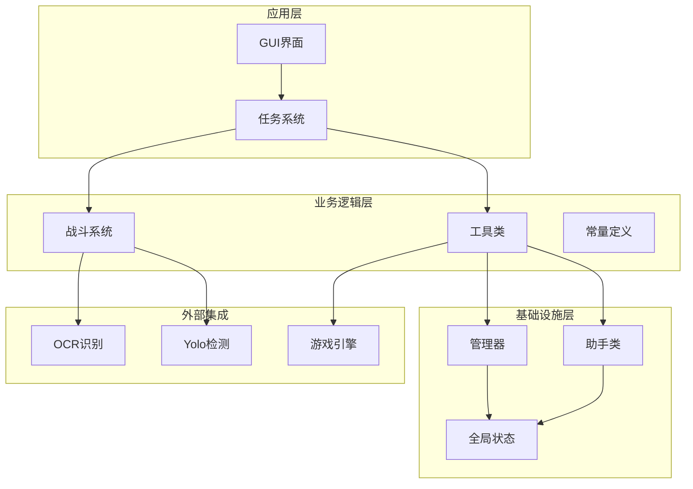

**图表来源**
- [BaseJumpTask.py:14-422](file://src/task/BaseJumpTask.py#L14-L422)
- [mixins.py:15-774](file://src/task/mixins.py#L15-L774)
- [AutoLoginTask.py:21-1914](file://src/task/AutoLoginTask.py#L21-L1914)

**章节来源**
- [BaseJumpTask.py:1-422](file://src/task/BaseJumpTask.py#L1-L422)
- [mixins.py:1-774](file://src/task/mixins.py#L1-L774)

## 核心组件

### 任务模式（Task Pattern）

OK-Jump 采用了完整的任务模式架构，通过基类抽象和具体任务实现来管理各种自动化流程。

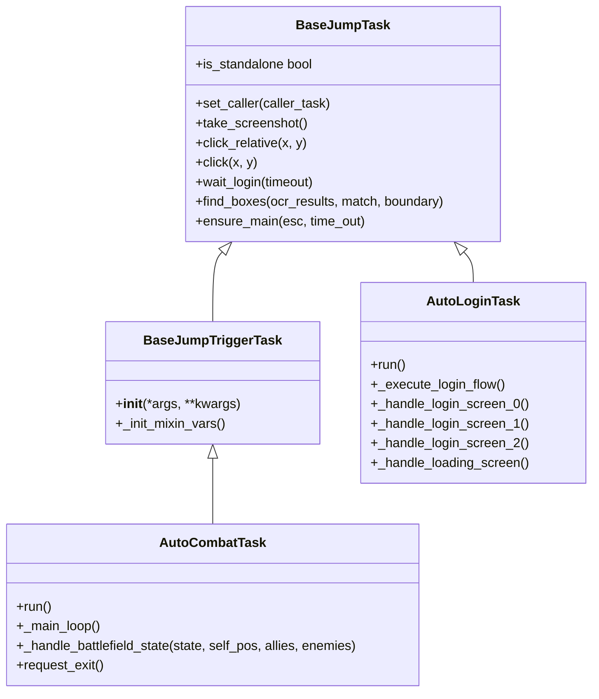

**图表来源**
- [BaseJumpTask.py:14-422](file://src/task/BaseJumpTask.py#L14-L422)
- [BaseJumpTriggerTask.py:13-30](file://src/task/BaseJumpTriggerTask.py#L13-L30)
- [AutoLoginTask.py:21-1914](file://src/task/AutoLoginTask.py#L21-L1914)
- [AutoCombatTask.py:32-693](file://src/task/AutoCombatTask.py#L32-L693)

### 混入模式（Mixin Pattern）

项目创新性地使用了混入模式来消除代码重复，将通用功能集中在一个类中，供多个任务类复用。

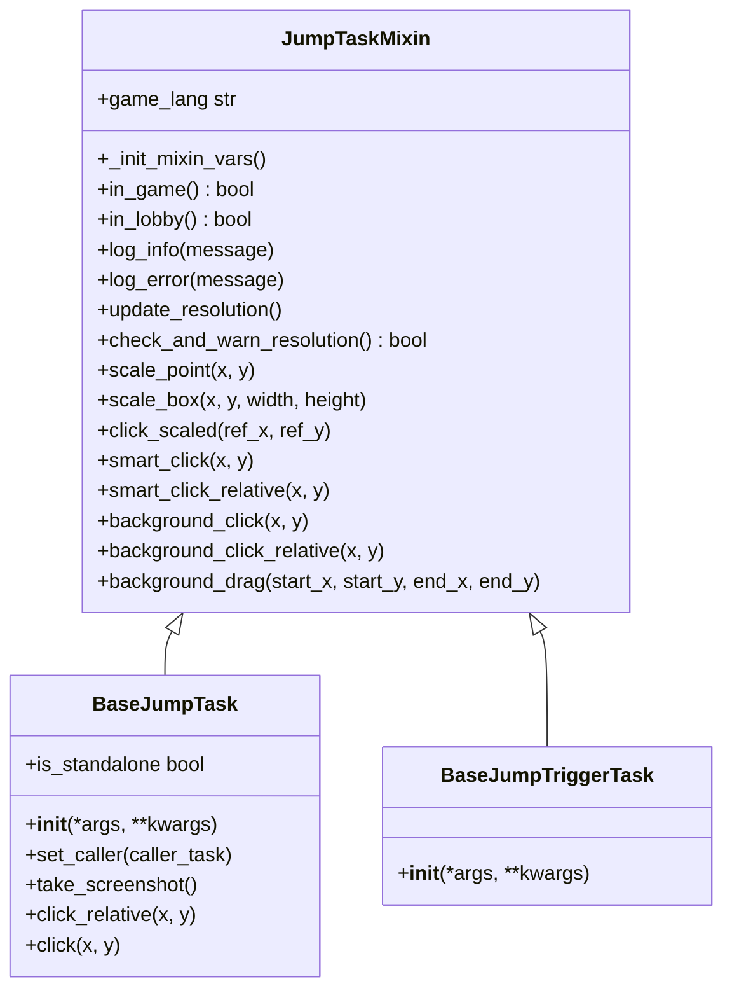

**图表来源**
- [mixins.py:15-774](file://src/task/mixins.py#L15-L774)
- [BaseJumpTask.py:14-422](file://src/task/BaseJumpTask.py#L14-L422)
- [BaseJumpTriggerTask.py:13-30](file://src/task/BaseJumpTriggerTask.py#L13-L30)

**章节来源**
- [mixins.py:15-774](file://src/task/mixins.py#L15-L774)
- [BaseJumpTask.py:14-422](file://src/task/BaseJumpTask.py#L14-L422)
- [BaseJumpTriggerTask.py:13-30](file://src/task/BaseJumpTriggerTask.py#L13-L30)

## 架构概览

OK-Jump 的整体架构体现了分层设计和关注点分离的原则：

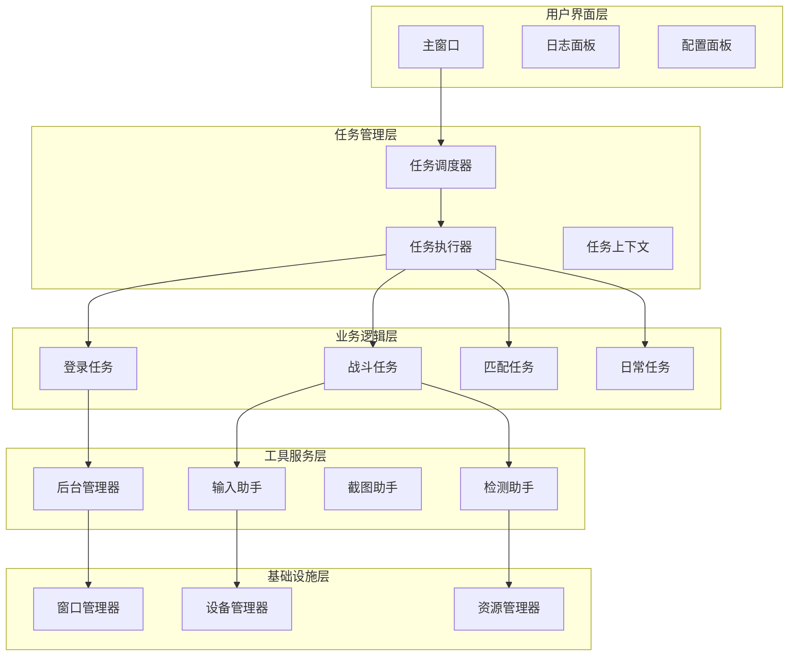

**图表来源**
- [AutoLoginTask.py:205-267](file://src/task/AutoLoginTask.py#L205-L267)
- [AutoCombatTask.py:84-134](file://src/task/AutoCombatTask.py#L84-L134)
- [BackgroundManager.py:7-155](file://src/utils/BackgroundManager.py#L7-L155)

## 详细组件分析

### 自动登录任务（AutoLoginTask）

AutoLoginTask 实现了复杂的登录流程管理，体现了状态机模式和策略模式的结合。

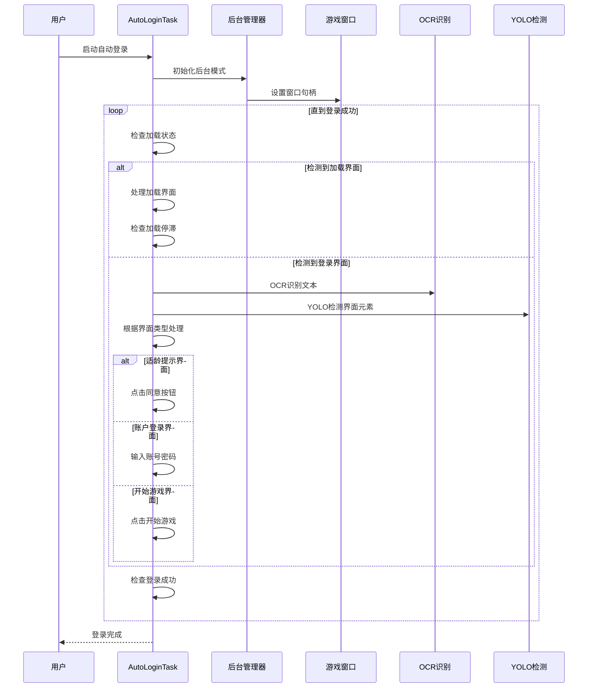

**图表来源**
- [AutoLoginTask.py:205-681](file://src/task/AutoLoginTask.py#L205-L681)
- [AutoLoginTask.py:770-797](file://src/task/AutoLoginTask.py#L770-L797)

#### 状态机模式实现

AutoLoginTask 使用状态机模式管理不同的登录界面状态：

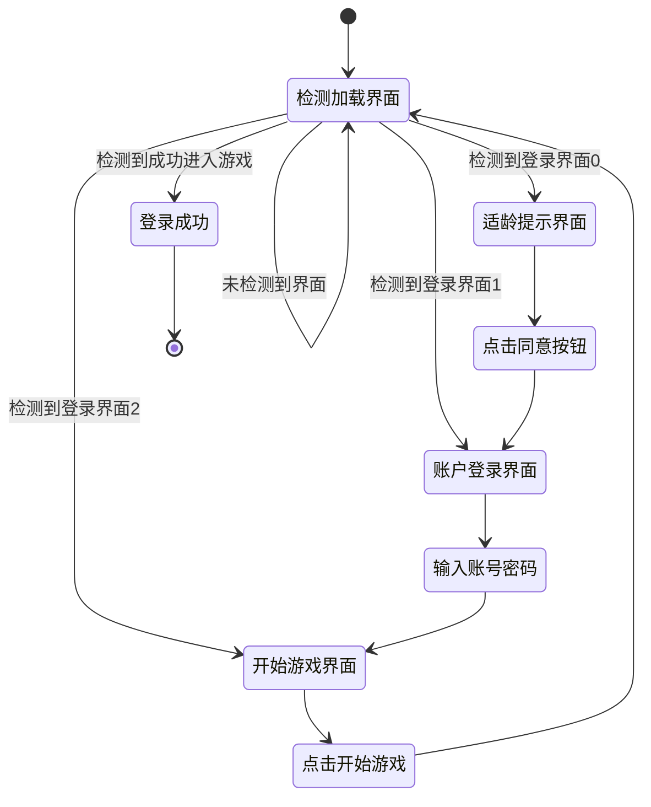

**图表来源**
- [AutoLoginTask.py:32-50](file://src/task/AutoLoginTask.py#L32-L50)
- [AutoLoginTask.py:770-797](file://src/task/AutoLoginTask.py#L770-L797)

**章节来源**
- [AutoLoginTask.py:21-1914](file://src/task/AutoLoginTask.py#L21-L1914)

### 自动战斗任务（AutoCombatTask）

AutoCombatTask 实现了智能的战斗逻辑，体现了策略模式和观察者模式的结合。

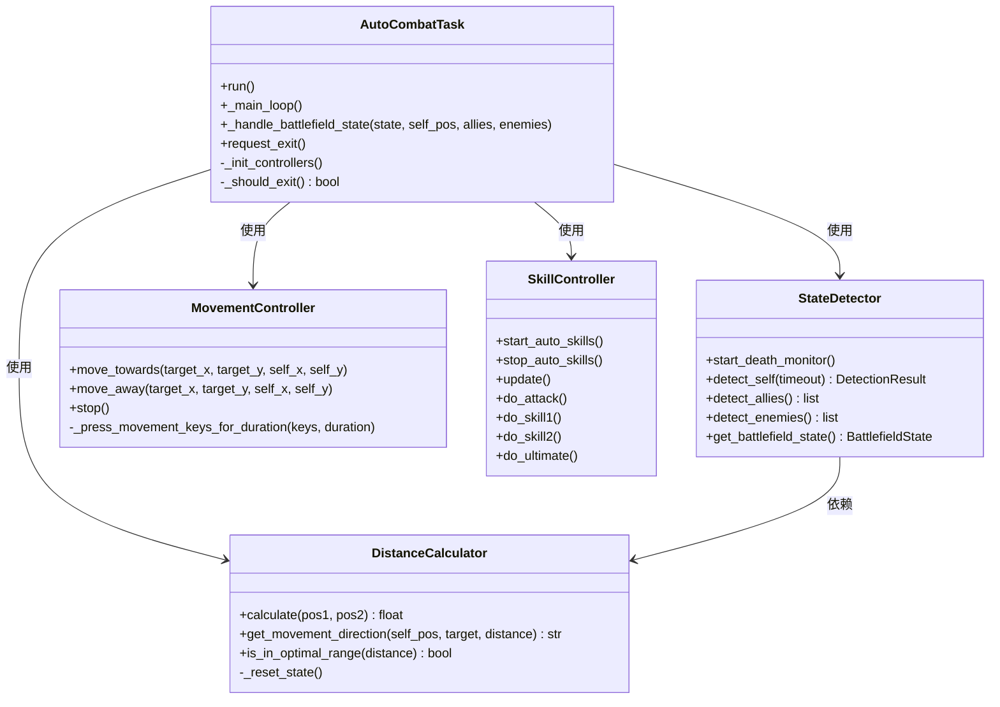

**图表来源**
- [AutoCombatTask.py:32-693](file://src/task/AutoCombatTask.py#L32-L693)
- [state_detector.py:24-446](file://src/combat/state_detector.py#L24-L446)
- [skill_controller.py:24-347](file://src/combat/skill_controller.py#L24-L347)

#### 战场状态处理策略

AutoCombatTask 使用策略模式根据不同战场状态执行不同的处理策略：

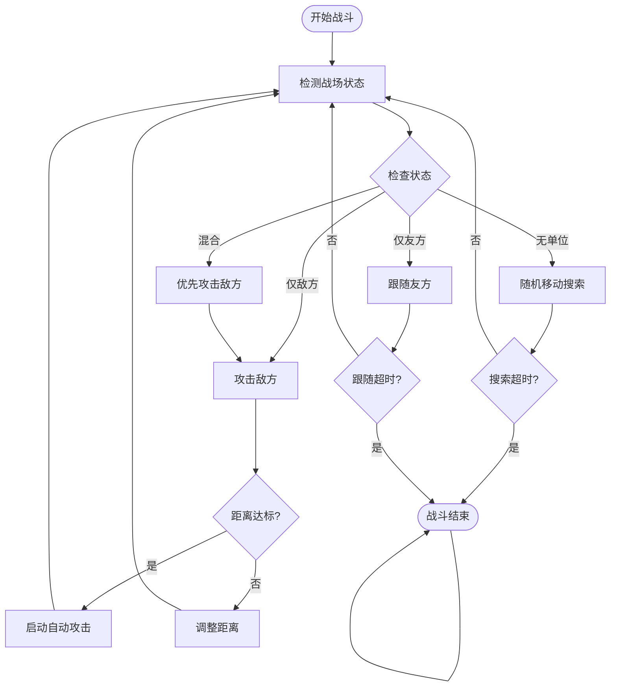

**图表来源**
- [AutoCombatTask.py:302-646](file://src/task/AutoCombatTask.py#L302-L646)

**章节来源**
- [AutoCombatTask.py:32-693](file://src/task/AutoCombatTask.py#L32-L693)
- [state_detector.py:24-446](file://src/combat/state_detector.py#L24-L446)
- [skill_controller.py:24-347](file://src/combat/skill_controller.py#L24-L347)

### 后台输入系统

后台输入系统体现了装饰器模式和适配器模式的结合，为不同平台提供统一的输入接口。

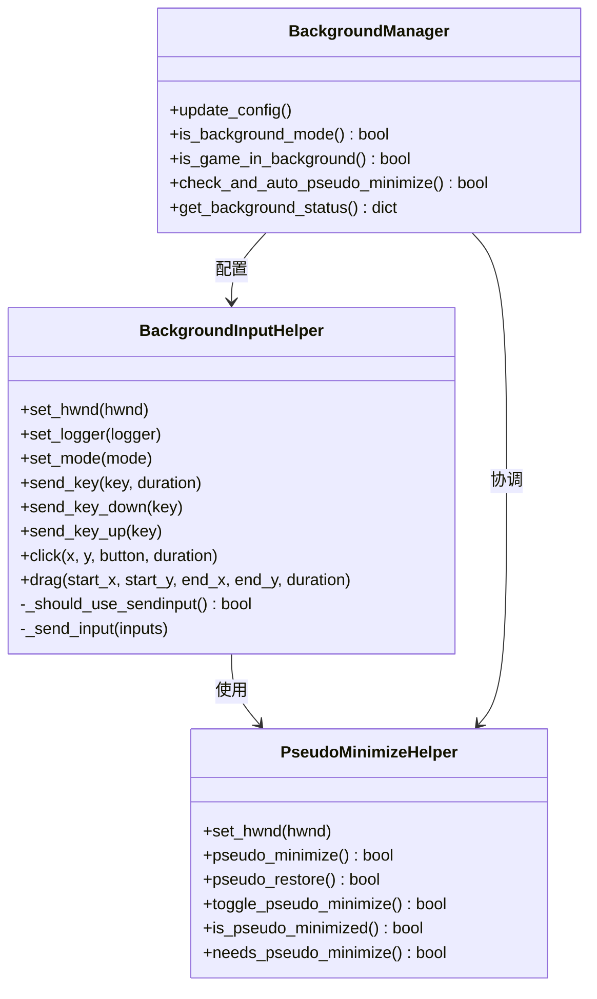

**图表来源**
- [BackgroundInputHelper.py:99-841](file://src/utils/BackgroundInputHelper.py#L99-L841)
- [PseudoMinimizeHelper.py:13-238](file://src/utils/PseudoMinimizeHelper.py#L13-L238)
- [BackgroundManager.py:7-155](file://src/utils/BackgroundManager.py#L7-L155)

#### 输入模式适配策略

后台输入系统使用策略模式适配不同的输入场景：

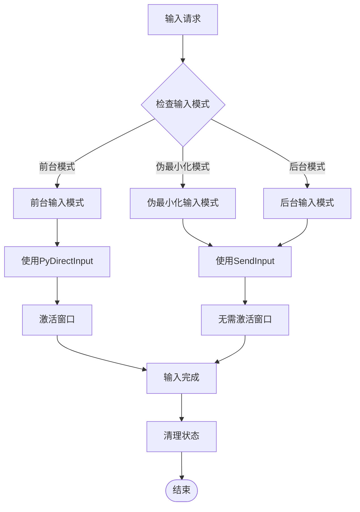

**图表来源**
- [BackgroundInputHelper.py:199-207](file://src/utils/BackgroundInputHelper.py#L199-L207)
- [BackgroundInputHelper.py:310-356](file://src/utils/BackgroundInputHelper.py#L310-L356)

**章节来源**
- [BackgroundInputHelper.py:99-841](file://src/utils/BackgroundInputHelper.py#L99-L841)
- [PseudoMinimizeHelper.py:13-238](file://src/utils/PseudoMinimizeHelper.py#L13-L238)
- [BackgroundManager.py:7-155](file://src/utils/BackgroundManager.py#L7-L155)

### 全局状态管理系统

全局状态管理系统体现了单例模式和观察者模式的结合，为整个应用提供统一的状态管理。

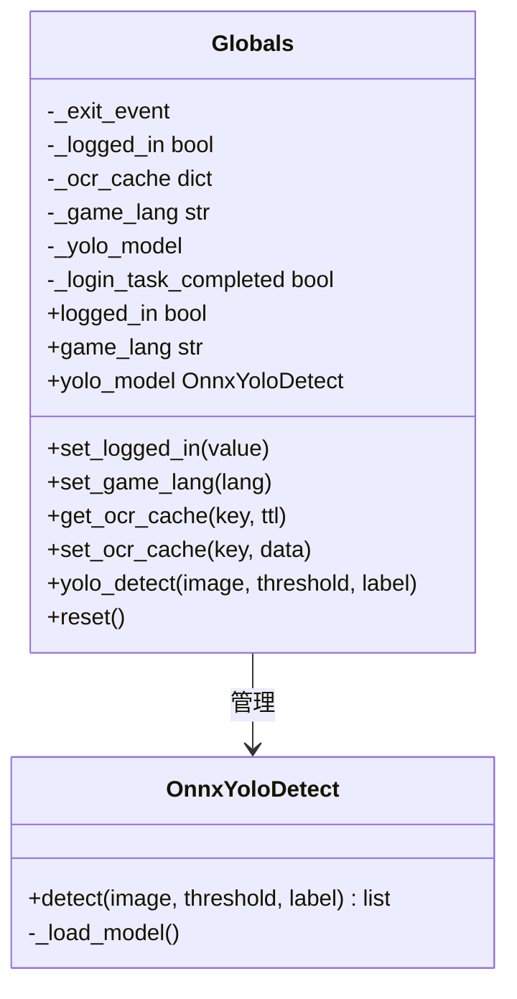

**图表来源**
- [globals.py:16-257](file://src/globals.py#L16-L257)

**章节来源**
- [globals.py:16-257](file://src/globals.py#L16-L257)

## 依赖分析

OK-Jump 项目的依赖关系体现了清晰的分层架构：

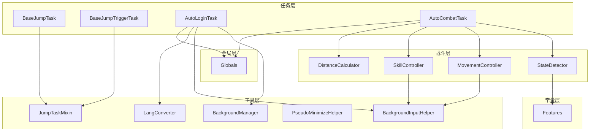

**图表来源**
- [BaseJumpTask.py:14-12](file://src/task/BaseJumpTask.py#L14-L12)
- [mixins.py:15-32](file://src/task/mixins.py#L15-L32)
- [AutoLoginTask.py:9-13](file://src/task/AutoLoginTask.py#L9-L13)
- [AutoCombatTask.py:21-29](file://src/task/AutoCombatTask.py#L21-L29)

**章节来源**
- [BaseJumpTask.py:14-422](file://src/task/BaseJumpTask.py#L14-L422)
- [mixins.py:15-774](file://src/task/mixins.py#L15-L774)

## 性能考虑

OK-Jump 在设计上充分考虑了性能优化：

### 并发处理
- 使用线程池处理后台监控任务
- 实现异步输入处理机制
- 优化图像处理流程

### 资源管理
- 实现资源懒加载机制
- 提供资源缓存策略
- 支持资源释放和重置

### 算法优化
- 使用高效的图像识别算法
- 实现智能的重试机制
- 优化网络请求处理

## 故障排除指南

### 常见问题及解决方案

#### 登录失败问题
1. **症状**: 自动登录任务无法识别登录界面
2. **原因**: OCR识别失败或界面元素变化
3. **解决方案**: 检查OCR配置，更新特征识别模型

#### 后台输入失败
1. **症状**: 游戏在后台时无法正常操作
2. **原因**: 窗口状态检测错误
3. **解决方案**: 检查后台管理模式配置

#### 战斗逻辑异常
1. **症状**: 自动战斗任务无法正确识别战场状态
2. **原因**: YOLO检测模型精度不足
3. **解决方案**: 调整检测阈值，重新训练模型

**章节来源**
- [AutoLoginTask.py:512-681](file://src/task/AutoLoginTask.py#L512-L681)
- [AutoCombatTask.py:197-270](file://src/task/AutoCombatTask.py#L197-L270)

## 结论

OK-Jump 项目成功地将多种经典设计模式应用于实际的自动化游戏脚本开发中，形成了清晰、可扩展、高性能的架构体系。通过任务模式、混入模式、策略模式、观察者模式等多种设计模式的有机结合，项目不仅实现了复杂的功能需求，还保持了良好的代码可维护性和扩展性。

### 主要成就

1. **架构清晰**: 通过分层设计和关注点分离，实现了模块间的低耦合高内聚
2. **代码复用**: 混入模式有效消除了代码重复，提高了开发效率
3. **功能强大**: 支持多种游戏场景的自动化处理
4. **易于扩展**: 良好的架构设计使得新功能的添加变得简单直观

### 最佳实践总结

1. **合理使用设计模式**: 根据具体场景选择合适的设计模式，避免过度设计
2. **关注点分离**: 将不同类型的职责分配给专门的类或模块
3. **接口抽象**: 通过抽象接口提高系统的灵活性和可测试性
4. **状态管理**: 使用适当的模式管理复杂的状态变化
5. **错误处理**: 建立完善的错误处理和恢复机制

这些经验为类似项目的开发提供了宝贵的参考，有助于构建更加健壮和可维护的自动化系统。