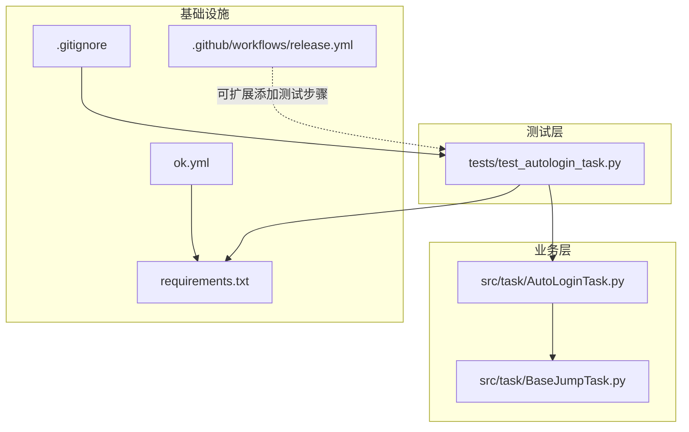
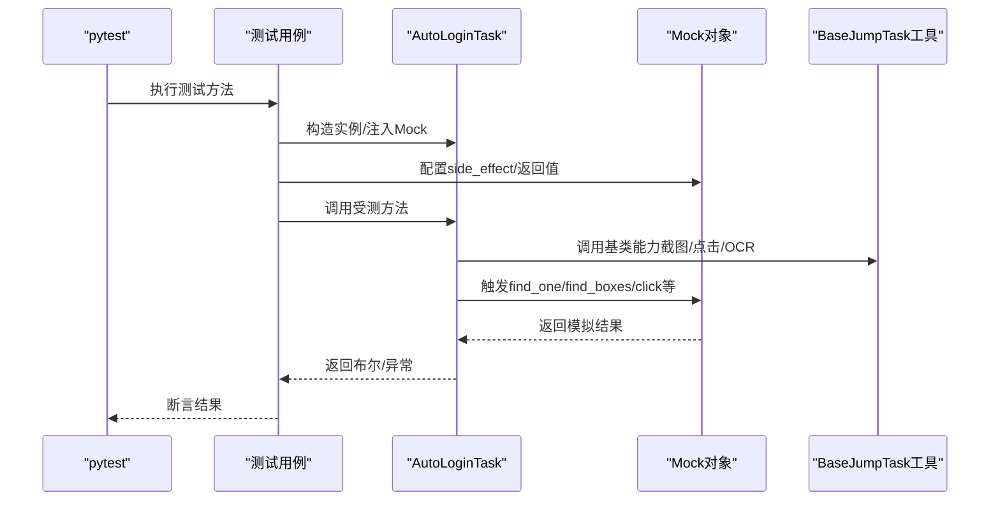
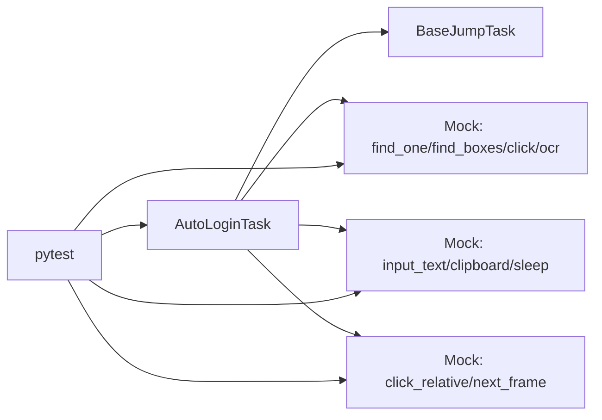

# 单元测试

<cite>
**本文档引用的文件**
- [tests/test_autologin_task.py](file://tests/test_autologin_task.py)
- [src/task/AutoLoginTask.py](file://src/task/AutoLoginTask.py)
- [src/task/BaseJumpTask.py](file://src/task/BaseJumpTask.py)
- [requirements.txt](file://requirements.txt)
- [test_input.py](file://test_input.py)
- [.github/workflows/release.yml](file://.github/workflows/release.yml)
- [ok.yml](file://ok.yml)
- [.gitignore](file://.gitignore)
</cite>

## 目录
1. [简介](#简介)
2. [项目结构](#项目结构)
3. [核心组件](#核心组件)
4. [架构概览](#架构概览)
5. [详细组件分析](#详细组件分析)
6. [依赖分析](#依赖分析)
7. [性能考虑](#性能考虑)
8. [故障排查指南](#故障排查指南)
9. [结论](#结论)
10. [附录](#附录)

## 简介
本文件面向OK-Jump项目的单元测试体系，聚焦自动登录任务的测试设计与实现。文档涵盖测试框架选择与配置（pytest）、测试用例设计原则与组织结构、Mock对象与测试替身的使用、自动登录任务的测试覆盖范围与场景设计、断言最佳实践与错误处理测试、测试数据准备与环境配置、以及在持续集成中执行测试的建议。目标是帮助开发者与测试人员高效理解并扩展该测试体系。

## 项目结构
OK-Jump采用“功能模块+测试”并行的组织方式：
- 测试位于 tests/ 目录，当前包含针对自动登录任务的单文件测试。
- 业务逻辑位于 src/ 目录，自动登录任务位于 src/task/AutoLoginTask.py，其基类位于 src/task/BaseJumpTask.py。
- 依赖通过 requirements.txt 管理，测试依赖 pytest 及标准库 unittest.mock。
- 持续集成工作流位于 .github/workflows/release.yml，当前用于构建发布包；可在其中扩展测试执行步骤。

图表来源
- [tests/test_autologin_task.py:1-407](file://tests/test_autologin_task.py#L1-L407)
- [src/task/AutoLoginTask.py:1-800](file://src/task/AutoLoginTask.py#L1-L800)
- [src/task/BaseJumpTask.py:1-422](file://src/task/BaseJumpTask.py#L1-L422)
- [requirements.txt:1-14](file://requirements.txt#L1-L14)
- [.github/workflows/release.yml:1-70](file://.github/workflows/release.yml#L1-L70)
- [ok.yml:1-12](file://ok.yml#L1-L12)
- [.gitignore:1-53](file://.gitignore#L1-L53)

章节来源
- [tests/test_autologin_task.py:1-407](file://tests/test_autologin_task.py#L1-L407)
- [src/task/AutoLoginTask.py:1-800](file://src/task/AutoLoginTask.py#L1-L800)
- [src/task/BaseJumpTask.py:1-422](file://src/task/BaseJumpTask.py#L1-L422)
- [requirements.txt:1-14](file://requirements.txt#L1-L14)
- [.github/workflows/release.yml:1-70](file://.github/workflows/release.yml#L1-L70)
- [ok.yml:1-12](file://ok.yml#L1-L12)
- [.gitignore:1-53](file://.gitignore#L1-L53)

## 核心组件
- 测试框架与配置
  - 使用 pytest 作为测试运行器，配合 unittest.mock 提供的 Mock、Patch、PropertyMock 等能力。
  - 测试文件位于 tests/test_autologin_task.py，采用类与函数混合组织，按功能模块分组（如问卷调查、登录界面0/1/2、账号输入等）。
- 自动登录任务类
  - AutoLoginTask 继承自 BaseJumpTask，封装登录流程、界面检测、OCR缓存、加载界面检测与状态容错等能力。
  - 关键方法包括 run、_execute_login_flow、_handle_login_screen_0/1/2、_check_wenjuan_screen、_handle_wenjuan、_input_account、_verify_account_input 等。
- 基类能力
  - BaseJumpTask 提供截图、点击（含后台模式支持）、OCR文本匹配、登录等待、伪最小化等通用能力，为测试替身注入提供了清晰的接口边界。

章节来源
- [tests/test_autologin_task.py:1-407](file://tests/test_autologin_task.py#L1-L407)
- [src/task/AutoLoginTask.py:1-800](file://src/task/AutoLoginTask.py#L1-L800)
- [src/task/BaseJumpTask.py:1-422](file://src/task/BaseJumpTask.py#L1-L422)

## 架构概览
测试与被测代码的交互关系如下：

图表来源
- [tests/test_autologin_task.py:1-407](file://tests/test_autologin_task.py#L1-L407)
- [src/task/AutoLoginTask.py:1-800](file://src/task/AutoLoginTask.py#L1-L800)
- [src/task/BaseJumpTask.py:1-422](file://src/task/BaseJumpTask.py#L1-L422)

## 详细组件分析

### 测试框架与配置（pytest）
- 运行器：pytest，支持参数化、夹具、断言、捕获异常等特性。
- Mock策略：
  - 使用 MagicMock 替代外部依赖（如截图、点击、OCR、键盘输入、窗口句柄等）。
  - 使用 side_effect 控制多次调用的不同行为（如第一次找不到模板、第二次找到）。
  - 使用 PropertyMock 为只读属性（width/height）提供固定值。
- 测试组织：
  - 类分组：按界面阶段划分（问卷调查、登录界面0/1/2、登录成功检查、账号输入）。
  - 函数测试：独立验证特定行为（如输入校验、GUI配置优先级）。
- 断言风格：
  - 使用 pytest 内置断言（如 assert result is True/False）。
  - 使用 Mock 的 assert_called/assert_called_once/assert_called_with 等验证调用轨迹。
  - 使用 with pytest.raises 捕获并断言预期异常（如 AutoLoginInputException）。

章节来源
- [tests/test_autologin_task.py:1-407](file://tests/test_autologin_task.py#L1-L407)

### 自动登录任务类（AutoLoginTask）
- 主流程
  - run：初始化后台模式、检查启用状态、启动游戏、等待窗口、执行登录流程、记录状态。
  - _execute_login_flow：主循环，负责截图、OCR缓存、加载检测、错误检查、界面识别与动作执行。
- 界面处理
  - _handle_login_screen_0/1/2：分别处理适龄提示、账号登录、开始游戏界面，含勾选框检测与点击。
  - _check_wenjuan_screen/_handle_wenjuan：问卷调查检测与自动化点击。
- 账号输入
  - _input_account：定位输入框、输入账号、校验（剪贴板+OCR回读）、重试与异常。
  - _verify_account_input：基于剪贴板与OCR的精确匹配校验。
- 加载检测与状态容错
  - _detect_loading_percentage/_check_loading_state：右下角百分比检测与停滞判断。
  - _check_success_after_failure/_record_failure：失败后的容错检查。
- 基类能力
  - BaseJumpTask 提供 click_relative/click、OCR文本匹配、登录等待、伪最小化等通用能力，便于测试替身注入。

章节来源
- [src/task/AutoLoginTask.py:1-800](file://src/task/AutoLoginTask.py#L1-L800)
- [src/task/BaseJumpTask.py:1-422](file://src/task/BaseJumpTask.py#L1-L422)

### Mock对象与测试替身
- 替身构建
  - 通过 build_task 构造 AutoLoginTask 实例，并将所有外部依赖替换为 MagicMock/PropertyMock。
  - 关键替身：find_one/find_boxes/click/click_relative/input_text/clipboard/ocr/sleep/next_frame 等。
- 行为控制
  - 使用 side_effect 模拟“先失败再成功”、“多次调用返回不同结果”等复杂场景。
  - 使用 return_value 指定固定返回（如模板匹配成功、OCR为空列表）。
- 属性与方法断言
  - 使用 assert_called/assert_called_once/assert_called_with 验证调用次数与参数。
  - 使用 assert_not_called 验证未触发的分支。

章节来源
- [tests/test_autologin_task.py:1-407](file://tests/test_autologin_task.py#L1-L407)

### 测试用例设计原则与组织结构
- 原则
  - 单一职责：每个测试关注一个具体行为或边界条件。
  - 可重复性：通过 Mock 固定外部依赖，保证测试可重复。
  - 可维护性：测试命名清晰，断言明确，便于定位问题。
- 组织
  - 类分组：按界面阶段划分，便于横向对比与回归。
  - 函数测试：独立验证特定逻辑（如输入校验、GUI配置优先级）。
  - 数据驱动：通过参数化或多次调用 side_effect 模拟多轮交互。

章节来源
- [tests/test_autologin_task.py:1-407](file://tests/test_autologin_task.py#L1-L407)

### 自动登录任务的测试覆盖范围与场景设计
- 问卷调查
  - 模板匹配成功、OCR回退成功、均失败返回未发现。
  - 全流程点击（多个选项、返回、提交、感谢页面）与超时处理。
  - 点击选项成功/超时。
- 登录界面0/1/2
  - 勾选框已勾选/未勾选的处理差异。
  - 角色选择检测与登录成功标记。
- 登录成功检查
  - OCR匹配角色/排位赛成功/失败。
- 账号输入
  - 可见且可用：点击、全选、删除、Tab、校验通过。
  - 不可见：抛出 AutoLoginInputException 并截图保存。
  - GUI配置优先级：当 GUI 显式开启输入时，忽略默认配置。
  - 多次重试：失败后重试直至成功或达到上限。
  - 剪贴板与OCR双重校验：精确匹配要求。
- 加载检测与状态容错
  - 加载百分比检测、停滞超时、加载结束后的界面稳定等待。
  - 失败后的容错检查与最终状态修正。

章节来源
- [tests/test_autologin_task.py:1-407](file://tests/test_autologin_task.py#L1-L407)
- [src/task/AutoLoginTask.py:1-800](file://src/task/AutoLoginTask.py#L1-L800)

### 断言最佳实践与错误处理测试
- 断言策略
  - 使用 pytest 内置断言与 Mock 断言相结合。
  - 对关键调用（如点击、OCR、截图）进行轨迹断言。
  - 对异常路径使用 pytest.raises 捕获并断言异常信息。
- 错误处理
  - 输入框不可见：断言抛出 AutoLoginInputException，且保存错误截图。
  - 加载停滞：断言记录错误并保存截图。
  - 登录超时/达到最大尝试次数：断言最终错误信息与容错记录。

章节来源
- [tests/test_autologin_task.py:1-407](file://tests/test_autologin_task.py#L1-L407)
- [src/task/AutoLoginTask.py:1-800](file://src/task/AutoLoginTask.py#L1-L800)

### 测试数据准备与测试环境配置
- 依赖安装
  - 通过 requirements.txt 安装 pytest、unittest.mock（标准库）及其他运行时依赖。
- 运行环境
  - Python 版本要求：3.12（ok.yml 中定义）。
  - 测试运行：pytest tests/test_autologin_task.py。
- 输入辅助测试
  - test_input.py 提供 pydirectinput 的输入测试脚本，可用于验证输入通道在真实环境中的可用性（需管理员权限与游戏前台）。

章节来源
- [requirements.txt:1-14](file://requirements.txt#L1-L14)
- [ok.yml:1-12](file://ok.yml#L1-L12)
- [test_input.py:1-58](file://test_input.py#L1-L58)

### 持续集成中的测试执行
- 当前工作流
  - .github/workflows/release.yml 用于构建与发布，未包含测试步骤。
- 建议扩展
  - 在构建作业中添加测试步骤：安装依赖、运行 pytest 并生成报告。
  - 可结合覆盖率工具（如 pytest-cov）输出覆盖率报告。
  - 将覆盖率阈值纳入 CI 检查，确保关键路径得到覆盖。

章节来源
- [.github/workflows/release.yml:1-70](file://.github/workflows/release.yml#L1-L70)

## 依赖分析
- 组件耦合
  - AutoLoginTask 依赖 BaseJumpTask 提供的截图、点击、OCR等通用能力，测试通过 Mock 注入这些依赖，降低耦合度。
- 外部依赖
  - opencv、onnxruntime、pydirectinput 等在运行时使用，测试中通过 Mock 替代，避免真实环境依赖。
- 测试隔离
  - 通过 build_task 构造最小化替身，确保测试彼此独立，互不干扰。

图表来源
- [src/task/AutoLoginTask.py:1-800](file://src/task/AutoLoginTask.py#L1-L800)
- [src/task/BaseJumpTask.py:1-422](file://src/task/BaseJumpTask.py#L1-L422)
- [tests/test_autologin_task.py:1-407](file://tests/test_autologin_task.py#L1-L407)

章节来源
- [src/task/AutoLoginTask.py:1-800](file://src/task/AutoLoginTask.py#L1-L800)
- [src/task/BaseJumpTask.py:1-422](file://src/task/BaseJumpTask.py#L1-L422)
- [tests/test_autologin_task.py:1-407](file://tests/test_autologin_task.py#L1-L407)

## 性能考虑
- Mock 的性能优势
  - 通过 Mock 替代真实 I/O 与外部调用，显著提升测试执行速度。
- 测试粒度
  - 将复杂流程拆分为多个小测试，减少单测耗时，便于并行执行。
- 资源清理
  - 使用 Mock 时注意清理缓存（如 OCR 缓存）以避免跨用例污染。

## 故障排查指南
- 常见问题
  - Mock 行为与期望不符：检查 side_effect/return_value 配置顺序与参数。
  - 断言失败：确认断言点是否正确（如调用次数、参数）。
  - 异常未被捕获：确保使用 pytest.raises 并断言异常消息。
- 环境问题
  - 输入通道不可用：参考 test_input.py 进行输入通道验证。
  - Python 版本不匹配：确保使用 3.12（ok.yml）。

章节来源
- [tests/test_autologin_task.py:1-407](file://tests/test_autologin_task.py#L1-L407)
- [test_input.py:1-58](file://test_input.py#L1-L58)
- [ok.yml:1-12](file://ok.yml#L1-L12)

## 结论
OK-Jump 的单元测试以 pytest 为核心，通过精心设计的 Mock 替身与清晰的测试组织，实现了对自动登录任务关键路径的全面覆盖。建议在现有基础上扩展 CI 中的测试执行与覆盖率统计，进一步提升质量保障水平。

## 附录
- 测试运行命令（示例）
  - pytest tests/test_autologin_task.py -v
- 覆盖率建议
  - pytest tests/test_autologin_task.py --cov=src --cov-report=html
- 忽略项
  - .pytest_cache、.coverage、htmlcov 等测试产物已在 .gitignore 中忽略。