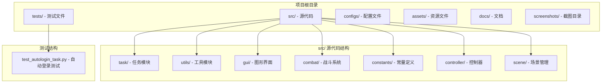
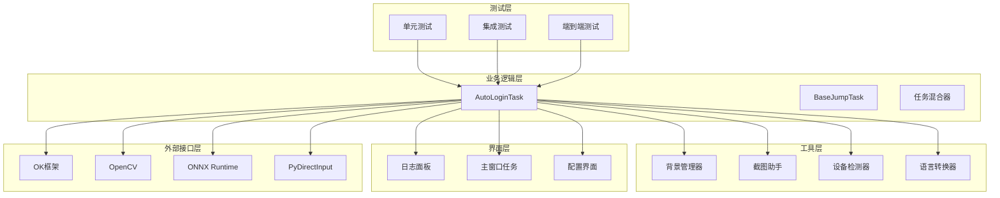
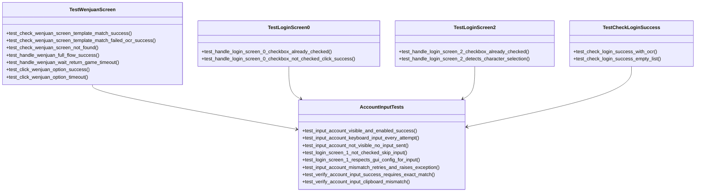
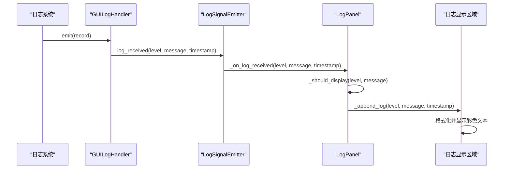
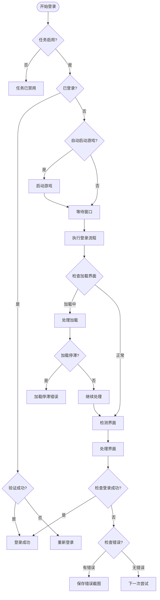
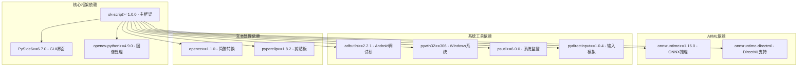
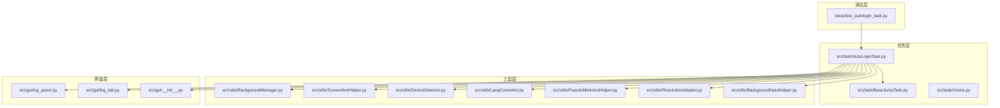
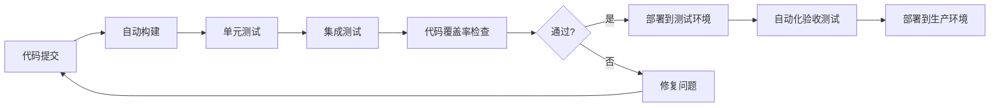

# 测试与调试

<cite>
**本文档引用的文件**
- [test_autologin_task.py](file://tests/test_autologin_task.py)
- [AutoLoginTask.py](file://src/task/AutoLoginTask.py)
- [log_panel.py](file://src/gui/log_panel.py)
- [ScreenshotHelper.py](file://src/utils/ScreenshotHelper.py)
- [AutoLoginTask.json](file://configs/AutoLoginTask.json)
- [BaseJumpTask.py](file://src/task/BaseJumpTask.py)
- [BackgroundManager.py](file://src/utils/BackgroundManager.py)
- [main.py](file://main.py)
- [requirements.txt](file://requirements.txt)
- [README.md](file://README.md)
- [AutoLoginTask.md](file://docs/AutoLoginTask.md)
- [test_input.py](file://test_input.py)
</cite>

## 目录
1. [简介](#简介)
2. [项目结构](#项目结构)
3. [核心组件](#核心组件)
4. [架构概览](#架构概览)
5. [详细组件分析](#详细组件分析)
6. [依赖关系分析](#依赖关系分析)
7. [性能考虑](#性能考虑)
8. [故障排除指南](#故障排除指南)
9. [结论](#结论)
10. [附录](#附录)

## 简介

OK-Jump测试与调试系统是一个基于`ok-script`框架构建的自动化测试平台，专门用于测试《漫画群星：大集结》游戏的自动登录功能。该系统提供了完整的测试策略、调试工具和错误处理机制，确保自动化登录流程的稳定性和可靠性。

系统采用分层架构设计，包含测试层、任务层、工具层和配置层，通过单元测试、集成测试和端到端测试相结合的方式，全面验证自动登录功能的各个方面。

## 项目结构

OK-Jump项目采用模块化的文件组织结构，主要分为以下几个核心目录：

**图表来源**
- [test_autologin_task.py:1-407](file://tests/test_autologin_task.py#L1-L407)
- [AutoLoginTask.py:1-800](file://src/task/AutoLoginTask.py#L1-L800)

**章节来源**
- [README.md:1-90](file://README.md#L1-L90)
- [requirements.txt:1-14](file://requirements.txt#L1-L14)

## 核心组件

### 测试框架组件

系统采用pytest作为主要的测试框架，配合unittest.mock进行模拟测试。测试组件包括：

- **测试套件组织**: 使用pytest的类组织方式，将相关的测试用例分组管理
- **模拟对象**: 通过MagicMock创建高度可控的模拟对象
- **测试夹具**: 提供可复用的测试基础设施

### 任务执行组件

AutoLoginTask是系统的核心任务类，负责整个自动登录流程的执行：

- **状态管理**: 维护登录状态和各种中间状态
- **界面检测**: 识别不同的登录界面状态
- **交互控制**: 执行点击、输入等用户交互操作
- **错误处理**: 处理各种异常情况和错误状态

### 调试工具组件

系统提供了完整的调试工具集：

- **实时日志面板**: GUI界面中的实时日志监控
- **截图保存**: 自动保存关键场景的截图
- **状态监控**: 监控游戏窗口状态和后台模式

**章节来源**
- [test_autologin_task.py:9-48](file://tests/test_autologin_task.py#L9-L48)
- [AutoLoginTask.py:21-100](file://src/task/AutoLoginTask.py#L21-L100)
- [log_panel.py:58-114](file://src/gui/log_panel.py#L58-L114)

## 架构概览

系统采用分层架构设计，各层之间职责明确，耦合度低：

**图表来源**
- [AutoLoginTask.py:1-800](file://src/task/AutoLoginTask.py#L1-L800)
- [BaseJumpTask.py:14-422](file://src/task/BaseJumpTask.py#L14-L422)
- [BackgroundManager.py:7-155](file://src/utils/BackgroundManager.py#L7-L155)

## 详细组件分析

### 自动登录任务测试

#### 测试策略设计

系统采用行为驱动开发(BDD)的测试策略，重点关注以下方面：

- **状态驱动测试**: 针对不同的登录界面状态进行测试
- **异常场景测试**: 模拟各种异常情况和边界条件
- **配置驱动测试**: 验证不同配置下的行为差异
- **集成测试**: 测试组件间的协作和交互

#### 测试用例设计

测试用例按照功能模块进行组织：

**图表来源**
- [test_autologin_task.py:56-407](file://tests/test_autologin_task.py#L56-L407)

#### 测试数据模拟

测试通过精心设计的模拟对象来模拟真实环境：

- **OCR模拟**: 模拟OCR识别结果，支持成功和失败场景
- **点击模拟**: 模拟鼠标点击操作，支持成功和失败
- **配置模拟**: 模拟不同配置下的行为差异
- **异常模拟**: 模拟各种异常情况

**章节来源**
- [test_autologin_task.py:9-48](file://tests/test_autologin_task.py#L9-L48)
- [test_autologin_task.py:56-407](file://tests/test_autologin_task.py#L56-L407)

### 调试工具系统

#### 实时日志监控面板

日志面板提供了强大的实时监控功能：

**图表来源**
- [log_panel.py:29-56](file://src/gui/log_panel.py#L29-L56)
- [log_panel.py:252-313](file://src/gui/log_panel.py#L252-L313)

#### 截图保存机制

系统提供了灵活的截图保存功能：

- **自动截图**: 在关键节点自动保存截图
- **错误截图**: 发生错误时自动保存错误截图
- **模板截图**: 保存特征模板用于调试
- **时间戳命名**: 自动生成带时间戳的文件名

**章节来源**
- [log_panel.py:58-388](file://src/gui/log_panel.py#L58-L388)
- [ScreenshotHelper.py:7-68](file://src/utils/ScreenshotHelper.py#L7-L68)

### 错误处理机制

#### 异常分类处理

系统实现了多层次的错误处理机制：

**图表来源**
- [AutoLoginTask.py:512-682](file://src/task/AutoLoginTask.py#L512-L682)

#### 错误恢复策略

系统实现了智能的错误恢复机制：

- **状态容错**: 在判定失败后进行二次确认
- **重试机制**: 对关键操作提供重试机会
- **降级处理**: 在部分功能失效时提供降级方案
- **优雅降级**: 确保系统在异常情况下仍能提供基本功能

**章节来源**
- [AutoLoginTask.py:475-501](file://src/task/AutoLoginTask.py#L475-L501)
- [AutoLoginTask.py:502-509](file://src/task/AutoLoginTask.py#L502-L509)

## 依赖关系分析

### 外部依赖管理

系统依赖于多个第三方库，每个依赖都有明确的作用：

**图表来源**
- [requirements.txt:1-14](file://requirements.txt#L1-L14)

### 内部模块依赖

系统内部模块之间的依赖关系清晰明确：

**图表来源**
- [AutoLoginTask.py:1-800](file://src/task/AutoLoginTask.py#L1-L800)
- [BaseJumpTask.py:1-422](file://src/task/BaseJumpTask.py#L1-L422)

**章节来源**
- [requirements.txt:1-14](file://requirements.txt#L1-L14)
- [AutoLoginTask.py:1-800](file://src/task/AutoLoginTask.py#L1-L800)

## 性能考虑

### 测试性能优化

系统在测试性能方面采用了多项优化策略：

- **异步测试执行**: 使用pytest的并发执行能力
- **缓存机制**: OCR结果和图像匹配结果的缓存
- **资源池管理**: 复用测试资源，减少创建销毁开销
- **智能等待**: 根据场景动态调整等待时间

### 运行时性能优化

在实际运行时，系统通过以下方式优化性能：

- **延迟加载**: 按需加载模型和资源
- **内存管理**: 及时清理不需要的对象和缓存
- **GPU加速**: 利用DirectML进行ONNX推理加速
- **批处理**: 合并相似的操作减少调用开销

### 监控指标

系统提供了完善的性能监控指标：

- **FPS监控**: 实时显示日志处理速度
- **内存使用**: 监控内存占用情况
- **CPU使用率**: 监控处理器使用情况
- **IO性能**: 监控磁盘读写性能

## 故障排除指南

### 常见问题诊断

#### 登录失败问题

**问题症状**: 自动登录多次尝试后仍然失败

**诊断步骤**:
1. 检查游戏窗口状态和后台模式配置
2. 验证OCR识别是否正常工作
3. 确认账号输入框模板是否正确
4. 检查网络连接和服务器状态

**解决方案**:
- 调整OCR阈值和匹配参数
- 更新账号输入框模板
- 检查网络代理设置
- 重启游戏客户端

#### 截图失败问题

**问题症状**: 系统无法截取游戏画面

**诊断步骤**:
1. 检查后台模式是否正确初始化
2. 验证窗口句柄是否有效
3. 确认伪最小化功能是否正常
4. 检查权限设置

**解决方案**:
- 重新初始化后台模式
- 检查窗口状态
- 调整权限设置
- 重启相关服务

#### OCR识别问题

**问题症状**: OCR无法正确识别界面文字

**诊断步骤**:
1. 检查OCR模型文件是否完整
2. 验证图像质量是否足够
3. 确认语言设置是否正确
4. 检查对比度和亮度设置

**解决方案**:
- 重新下载OCR模型
- 调整图像预处理参数
- 更新语言包
- 优化图像采集设置

### 调试技巧

#### 日志分析技巧

- **级别过滤**: 使用DEBUG/INFO/WARNING/ERROR级别过滤日志
- **关键词搜索**: 通过关键词快速定位问题
- **时间线分析**: 按时间顺序分析问题发生过程
- **状态跟踪**: 监控关键状态的变化

#### 性能分析技巧

- **FPS监控**: 通过日志面板的FPS标签监控性能
- **内存泄漏检测**: 定期检查内存使用情况
- **CPU热点分析**: 识别性能瓶颈
- **IO等待分析**: 监控磁盘和网络I/O

**章节来源**
- [log_panel.py:272-352](file://src/gui/log_panel.py#L272-L352)
- [AutoLoginTask.py:182-202](file://src/task/AutoLoginTask.py#L182-L202)

## 结论

OK-Jump测试与调试系统通过其完善的测试策略、强大的调试工具和智能的错误处理机制，为自动化登录功能提供了可靠的保障。系统的设计充分考虑了可维护性、可扩展性和稳定性，在保证功能完整性的同时，也为未来的功能扩展奠定了坚实的基础。

通过本文档的详细说明，开发者可以更好地理解和使用这个测试与调试系统，为项目的持续改进和维护提供有力支持。

## 附录

### 测试环境搭建

#### 开发环境要求

- **操作系统**: Windows 10/11
- **Python版本**: 3.10 或 3.11
- **开发工具**: Visual Studio Code 或 PyCharm
- **Git**: 用于版本控制

#### 依赖安装步骤

1. 克隆项目仓库
2. 创建虚拟环境
3. 安装依赖包
4. 配置开发环境

#### 测试运行指南

- **单个测试运行**: `pytest tests/test_autologin_task.py::TestWenjuanScreen::test_check_wenjuan_screen_template_match_success`
- **测试套件运行**: `pytest tests/`
- **覆盖率报告**: `pytest --cov=src tests/`
- **详细输出**: `pytest -v`

### 持续集成建议

#### CI/CD流程建议

#### 最佳实践

- **分支策略**: 使用Git Flow进行版本管理
- **代码审查**: 强制代码审查流程
- **自动化测试**: 确保所有提交都通过测试
- **监控告警**: 建立完善的监控和告警机制

**章节来源**
- [README.md:27-85](file://README.md#L27-L85)
- [AutoLoginTask.md:1-77](file://docs/AutoLoginTask.md#L1-L77)