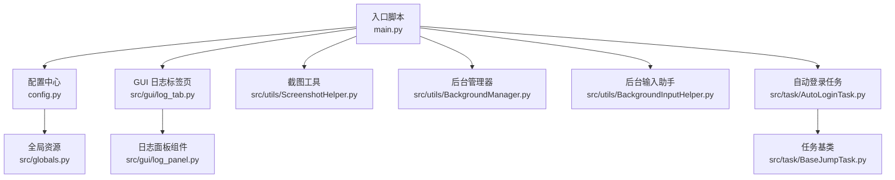
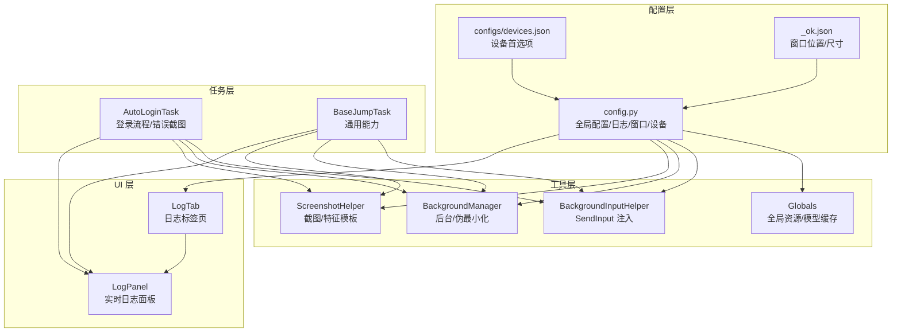
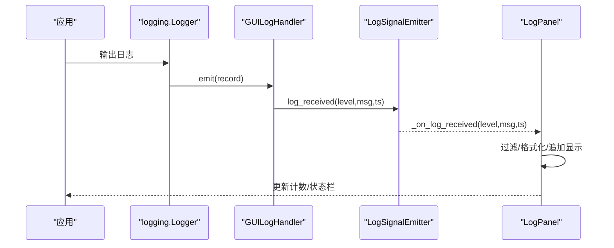
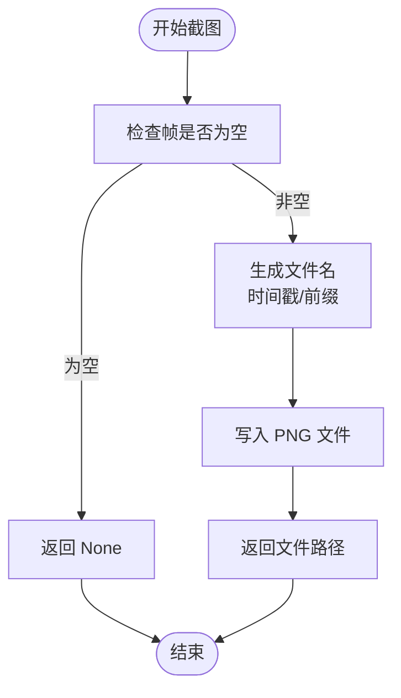
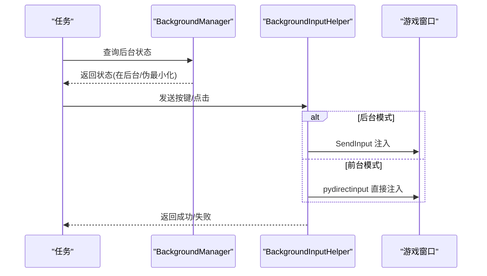
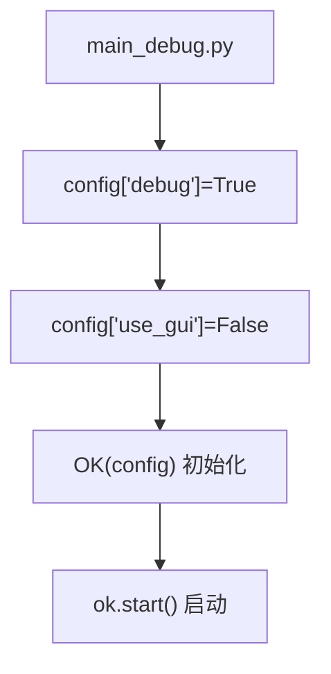
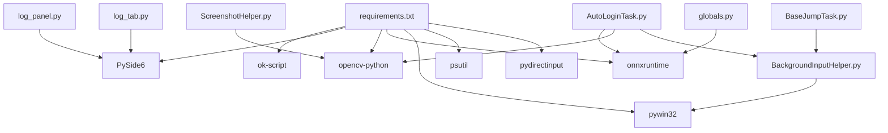

# 调试工具

<cite>
**本文档引用的文件**
- [main.py](file://main.py)
- [main_debug.py](file://main_debug.py)
- [config.py](file://config.py)
- [src/globals.py](file://src/globals.py)
- [src/gui/log_panel.py](file://src/gui/log_panel.py)
- [src/gui/log_tab.py](file://src/gui/log_tab.py)
- [src/utils/ScreenshotHelper.py](file://src/utils/ScreenshotHelper.py)
- [src/utils/BackgroundManager.py](file://src/utils/BackgroundManager.py)
- [src/utils/BackgroundInputHelper.py](file://src/utils/BackgroundInputHelper.py)
- [src/task/AutoLoginTask.py](file://src/task/AutoLoginTask.py)
- [src/task/BaseJumpTask.py](file://src/task/BaseJumpTask.py)
- [configs/_ok.json](file://configs/_ok.json)
- [configs/devices.json](file://configs/devices.json)
- [requirements.txt](file://requirements.txt)
</cite>

## 目录
1. [简介](#简介)
2. [项目结构](#项目结构)
3. [核心组件](#核心组件)
4. [架构总览](#架构总览)
5. [详细组件分析](#详细组件分析)
6. [依赖分析](#依赖分析)
7. [性能考虑](#性能考虑)
8. [故障排查指南](#故障排查指南)
9. [结论](#结论)
10. [附录](#附录)

## 简介
本文件面向使用 OK-Jump 调试工具的用户与开发者，系统性说明以下内容：
- 日志系统的配置与使用方法
- 实时日志监控的功能与操作界面
- 截图调试工具的使用技巧与保存策略
- 错误日志的分析方法与问题定位技巧
- 调试模式的启用与配置选项
- 常见问题的调试步骤与解决方案
- 性能分析与内存泄漏检测方法

## 项目结构
OK-Jump 采用模块化组织，核心围绕 OK 框架构建，调试能力主要体现在：
- GUI 日志面板与标签页集成
- 截图辅助工具与错误截图保存
- 后台模式与输入注入支持
- 配置驱动的调试行为（如最小化/屏幕外窗口跳过）

**图表来源**
- [main.py:1-107](file://main.py#L1-L107)
- [config.py:68-149](file://config.py#L68-L149)
- [src/gui/log_tab.py:15-70](file://src/gui/log_tab.py#L15-L70)
- [src/gui/log_panel.py:58-388](file://src/gui/log_panel.py#L58-L388)
- [src/utils/ScreenshotHelper.py:1-68](file://src/utils/ScreenshotHelper.py#L1-L68)
- [src/utils/BackgroundManager.py:1-155](file://src/utils/BackgroundManager.py#L1-L155)
- [src/utils/BackgroundInputHelper.py:1-841](file://src/utils/BackgroundInputHelper.py#L1-L841)
- [src/task/AutoLoginTask.py:1-800](file://src/task/AutoLoginTask.py#L1-L800)
- [src/task/BaseJumpTask.py:1-422](file://src/task/BaseJumpTask.py#L1-L422)
- [src/globals.py:1-257](file://src/globals.py#L1-L257)

**章节来源**
- [main.py:1-107](file://main.py#L1-L107)
- [config.py:68-149](file://config.py#L68-L149)

## 核心组件
- 日志系统与实时监控
  - 通过 GUI 标签页集成日志面板，支持级别过滤、关键词搜索、暂停/恢复、自动滚动、清空与计数统计。
  - 日志处理器线程安全，使用信号槽在 UI 线程中更新显示。
- 截图与错误截图
  - 提供统一截图保存策略，支持命名规范与特征模板提取。
  - 登录任务在异常时自动保存错误截图，便于问题复现与分析。
- 后台模式与输入注入
  - 支持伪最小化与后台静音，确保窗口在最小化或被遮挡时仍可截图与输入。
  - 针对 Unity 游戏使用 SendInput 注入键盘/鼠标事件，避免前台切换。
- 配置驱动的调试行为
  - 允许最小化/屏幕外窗口跳过，便于后台模式运行。
  - 设备智能选择（PC/模拟器）与首选项持久化。

**章节来源**
- [src/gui/log_panel.py:58-388](file://src/gui/log_panel.py#L58-L388)
- [src/gui/log_tab.py:15-70](file://src/gui/log_tab.py#L15-L70)
- [src/utils/ScreenshotHelper.py:1-68](file://src/utils/ScreenshotHelper.py#L1-L68)
- [src/task/AutoLoginTask.py:570-682](file://src/task/AutoLoginTask.py#L570-L682)
- [src/utils/BackgroundManager.py:1-155](file://src/utils/BackgroundManager.py#L1-L155)
- [src/utils/BackgroundInputHelper.py:1-841](file://src/utils/BackgroundInputHelper.py#L1-L841)
- [config.py:68-149](file://config.py#L68-L149)

## 架构总览
OK-Jump 的调试能力由“配置驱动 + GUI 面板 + 工具组件 + 任务层”构成，形成闭环的可观测性与可操作性。

**图表来源**
- [config.py:68-149](file://config.py#L68-L149)
- [configs/devices.json:1-7](file://configs/devices.json#L1-L7)
- [configs/_ok.json:1-7](file://configs/_ok.json#L1-L7)
- [src/gui/log_tab.py:15-70](file://src/gui/log_tab.py#L15-L70)
- [src/gui/log_panel.py:58-388](file://src/gui/log_panel.py#L58-L388)
- [src/utils/ScreenshotHelper.py:1-68](file://src/utils/ScreenshotHelper.py#L1-L68)
- [src/utils/BackgroundManager.py:1-155](file://src/utils/BackgroundManager.py#L1-L155)
- [src/utils/BackgroundInputHelper.py:1-841](file://src/utils/BackgroundInputHelper.py#L1-L841)
- [src/globals.py:1-257](file://src/globals.py#L1-L257)
- [src/task/AutoLoginTask.py:1-800](file://src/task/AutoLoginTask.py#L1-L800)
- [src/task/BaseJumpTask.py:1-422](file://src/task/BaseJumpTask.py#L1-L422)

## 详细组件分析

### 日志系统与实时监控
- 集成方式
  - 在 GUI 标签页中注册根日志器，避免重复添加，确保捕获所有子日志器输出。
  - 日志处理器线程安全，通过信号发射器与 UI 组件解耦。
- 功能特性
  - 级别过滤（DEBUG/INFO/WARNING/ERROR）、关键词搜索、暂停/恢复、自动滚动、清空、计数统计。
  - 特殊标记颜色区分不同业务含义，提升可读性。
- 使用建议
  - 调试阶段将日志级别设为 DEBUG，问题定位后可提升至 INFO。
  - 使用关键词过滤快速定位特定模块或事件。

**图表来源**
- [src/gui/log_panel.py:29-114](file://src/gui/log_panel.py#L29-L114)
- [src/gui/log_panel.py:248-313](file://src/gui/log_panel.py#L248-L313)
- [src/gui/log_tab.py:47-66](file://src/gui/log_tab.py#L47-L66)

**章节来源**
- [src/gui/log_panel.py:58-388](file://src/gui/log_panel.py#L58-L388)
- [src/gui/log_tab.py:15-70](file://src/gui/log_tab.py#L15-L70)

### 截图调试工具
- 统一保存策略
  - 默认保存目录为 screenshots；支持自定义名称与 PNG 扩展名。
  - 提供特征模板提取子目录，便于标注与复用。
- 错误截图保存
  - 登录任务在检测到加载停滞或错误时自动保存截图，文件名包含上下文信息，便于回溯。
- 使用技巧
  - 在关键节点调用截图保存，结合日志时间戳定位问题。
  - 对可疑区域截图并提取模板，建立稳定的特征匹配。

**图表来源**
- [src/utils/ScreenshotHelper.py:17-30](file://src/utils/ScreenshotHelper.py#L17-L30)

**章节来源**
- [src/utils/ScreenshotHelper.py:1-68](file://src/utils/ScreenshotHelper.py#L1-L68)
- [src/task/AutoLoginTask.py:577-581](file://src/task/AutoLoginTask.py#L577-L581)
- [src/task/AutoLoginTask.py:611](file://src/task/AutoLoginTask.py#L611)

### 后台模式与输入注入
- 后台模式
  - 通过后台管理器判断游戏是否在后台，支持静音与伪最小化。
  - 在最小化或被遮挡时自动伪最小化，保证截图与输入可用。
- 输入注入
  - 针对 Unity 游戏使用 SendInput 注入键盘/鼠标事件，避免前台切换。
  - 支持多种输入模式（前台/伪最小化/自动），自动选择最优策略。

**图表来源**
- [src/utils/BackgroundManager.py:43-92](file://src/utils/BackgroundManager.py#L43-L92)
- [src/utils/BackgroundInputHelper.py:199-207](file://src/utils/BackgroundInputHelper.py#L199-L207)
- [src/utils/BackgroundInputHelper.py:310-356](file://src/utils/BackgroundInputHelper.py#L310-L356)
- [src/utils/BackgroundInputHelper.py:630-708](file://src/utils/BackgroundInputHelper.py#L630-L708)

**章节来源**
- [src/utils/BackgroundManager.py:1-155](file://src/utils/BackgroundManager.py#L1-L155)
- [src/utils/BackgroundInputHelper.py:1-841](file://src/utils/BackgroundInputHelper.py#L1-L841)

### 调试模式与配置选项
- 启用调试模式
  - 通过专用调试入口脚本开启 debug 模式并禁用 GUI，适合命令行调试。
- 关键配置项
  - 后台模式、最小化时伪最小化、后台时静音游戏、触发间隔、窗口标题/类名、捕获方法、ADB 启用与包名等。
  - 日志文件路径与错误日志文件路径，便于导出与分析。
  - 设备首选项与窗口位置/尺寸，影响后台模式与截图稳定性。

**图表来源**
- [main_debug.py:6-16](file://main_debug.py#L6-L16)

**章节来源**
- [main_debug.py:1-16](file://main_debug.py#L1-L16)
- [config.py:68-149](file://config.py#L68-L149)
- [configs/devices.json:1-7](file://configs/devices.json#L1-L7)
- [configs/_ok.json:1-7](file://configs/_ok.json#L1-L7)

## 依赖分析
- 外部依赖
  - OK 框架、PySide6、OpenCV、ONNXRuntime、pywin32、psutil、pydirectinput 等。
- 内部依赖
  - GUI 日志依赖 PySide6 与 Fluent Widgets；截图依赖 OpenCV；后台输入依赖 Windows API 与 pywin32。
  - 任务层依赖工具层与全局资源，全局资源负责 YOLO 模型与 OCR 缓存。

**图表来源**
- [requirements.txt:1-14](file://requirements.txt#L1-L14)
- [src/gui/log_panel.py:11-26](file://src/gui/log_panel.py#L11-L26)
- [src/gui/log_tab.py:9-12](file://src/gui/log_tab.py#L9-L12)
- [src/utils/ScreenshotHelper.py:1-6](file://src/utils/ScreenshotHelper.py#L1-L6)
- [src/utils/BackgroundInputHelper.py:16-24](file://src/utils/BackgroundInputHelper.py#L16-L24)
- [src/task/AutoLoginTask.py:5-13](file://src/task/AutoLoginTask.py#L5-L13)
- [src/task/BaseJumpTask.py:4-11](file://src/task/BaseJumpTask.py#L4-L11)
- [src/globals.py:212-228](file://src/globals.py#L212-L228)

**章节来源**
- [requirements.txt:1-14](file://requirements.txt#L1-L14)

## 性能考虑
- CPU/GPU 使用率
  - 通过“触发间隔”配置降低任务触发频率，减少资源占用。
  - OCR/检测结果缓存（全局 OCR 缓存与 YOLO 模型）可显著降低重复计算。
- 内存管理
  - YOLO 模型采用延迟加载与显式重置，避免常驻内存。
  - 截图与特征模板按需创建，注意及时清理临时文件。
- 后台模式优化
  - 伪最小化避免窗口激活带来的额外开销。
  - 后台静音减少音频驱动交互成本。

**章节来源**
- [config.py:50-66](file://config.py#L50-L66)
- [src/globals.py:137-193](file://src/globals.py#L137-L193)
- [src/globals.py:202-257](file://src/globals.py#L202-L257)
- [src/utils/BackgroundManager.py:77-80](file://src/utils/BackgroundManager.py#L77-L80)

## 故障排查指南
- 日志无法显示或显示异常
  - 确认日志标签页已正确注册根日志器，避免重复添加。
  - 检查日志级别过滤与关键词搜索是否过于严格。
  - 导出日志压缩包以便进一步分析。
- 截图失败或黑屏
  - 检查后台模式与伪最小化状态，必要时手动切换。
  - 确认窗口可截图（最小化时自动伪最小化）。
- 输入无效或前台切换
  - 确认后台输入模式已启用，SendInput 注入路径正常。
  - 检查 Unity 游戏的输入接收方式，确保使用正确的注入策略。
- 加载停滞或登录超时
  - 查看错误截图与日志中的百分比变化，定位卡点。
  - 调整加载停滞超时与登录等待超时配置。
- 设备选择冲突
  - 智能设备选择会在 PC 与模拟器同时运行时保持用户选择，避免冲突。
  - 如需强制切换，修改设备首选项配置文件。

**章节来源**
- [src/gui/log_tab.py:47-66](file://src/gui/log_tab.py#L47-L66)
- [src/gui/log_panel.py:272-283](file://src/gui/log_panel.py#L272-L283)
- [main.py:11-26](file://main.py#L11-L26)
- [src/utils/BackgroundManager.py:101-128](file://src/utils/BackgroundManager.py#L101-L128)
- [src/utils/BackgroundInputHelper.py:199-207](file://src/utils/BackgroundInputHelper.py#L199-L207)
- [src/task/AutoLoginTask.py:426-430](file://src/task/AutoLoginTask.py#L426-L430)
- [src/task/AutoLoginTask.py:534-538](file://src/task/AutoLoginTask.py#L534-L538)
- [main.py:54-95](file://main.py#L54-L95)
- [configs/devices.json:1-7](file://configs/devices.json#L1-L7)

## 结论
OK-Jump 的调试工具以配置为中心、以 GUI 面板为入口、以工具组件为支撑，形成了完整的可观测与可操作体系。通过合理配置日志级别、利用实时监控与截图保存、结合后台模式与输入注入，能够高效定位问题并优化性能。建议在日常使用中：
- 将日志级别设为 DEBUG 以获得完整信息，问题定位后再降级。
- 在关键节点保存截图并命名规范，配合错误日志快速回溯。
- 根据环境启用后台模式与伪最小化，确保稳定性。
- 定期导出日志与截图，建立问题知识库。

## 附录
- 常用导出与诊断
  - 导出日志压缩包：在启动卡片中触发导出，自动打开下载目录。
  - 检查设备首选项与窗口位置，确保后台模式兼容。
- 参考文件路径
  - 日志文件：config 中定义的日志与错误日志路径。
  - 截图目录：默认 screenshots，可在配置中调整。

**章节来源**
- [main.py:11-26](file://main.py#L11-L26)
- [config.py:126-127](file://config.py#L126-L127)
- [config.py:129](file://config.py#L129)
- [configs/devices.json:1-7](file://configs/devices.json#L1-L7)
- [configs/_ok.json:1-7](file://configs/_ok.json#L1-L7)