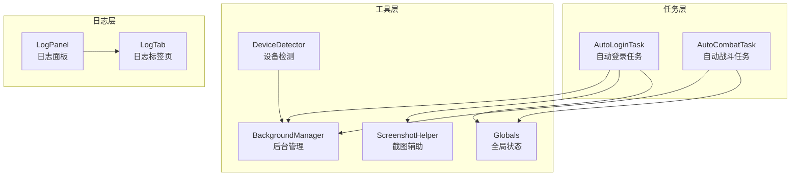
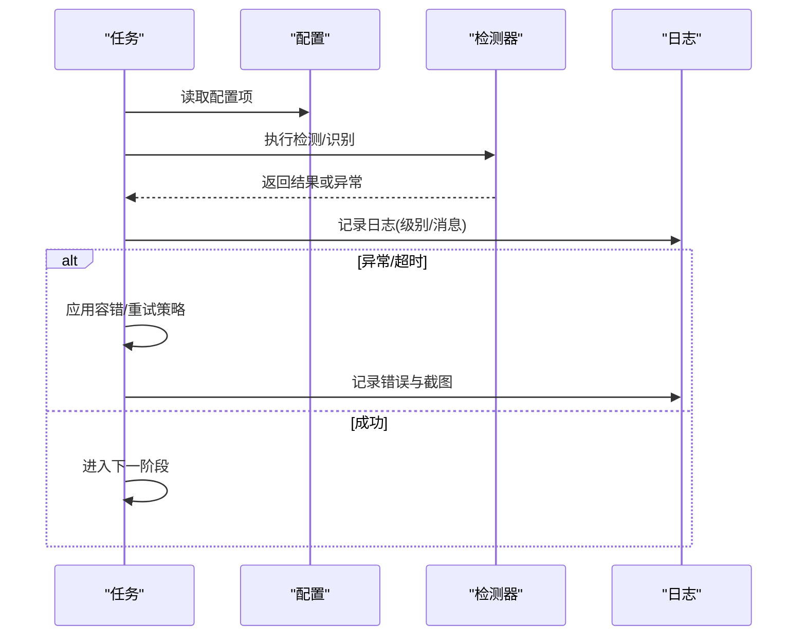
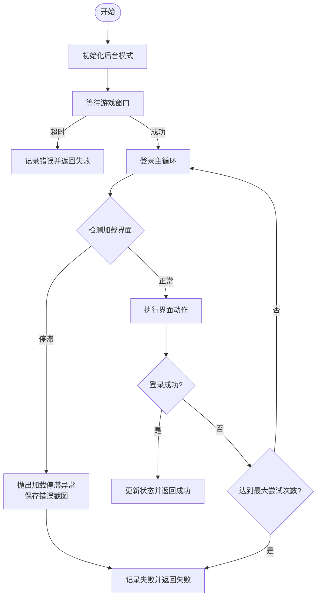
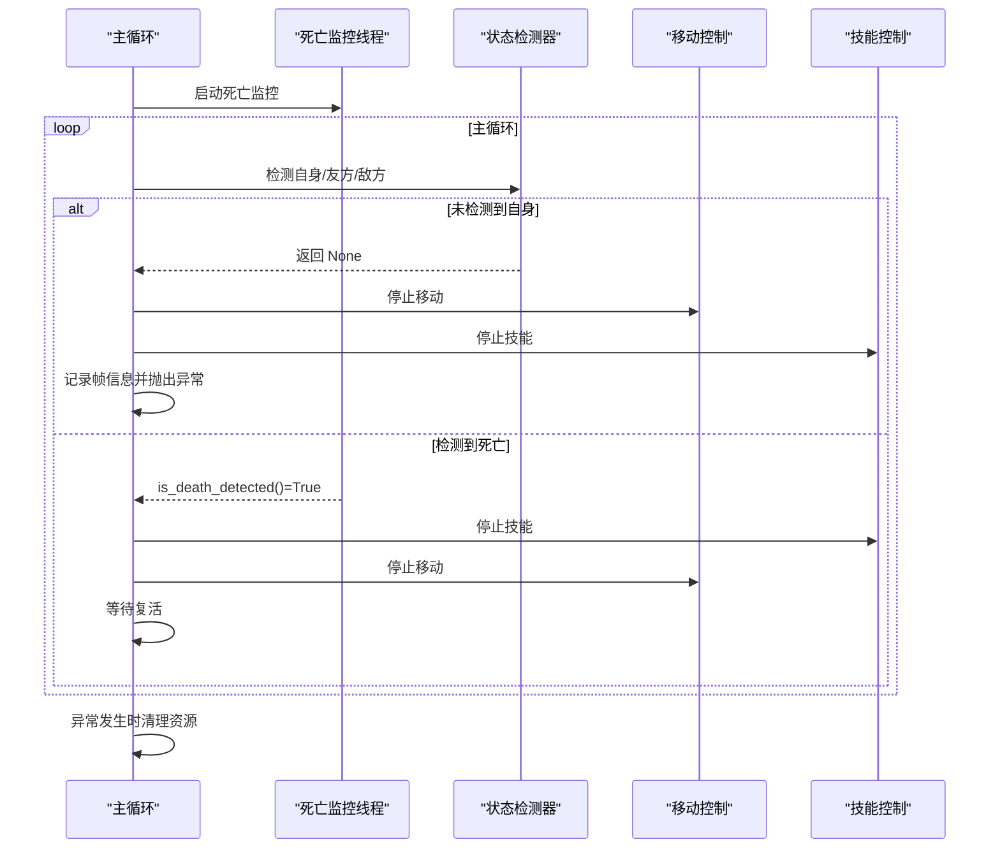
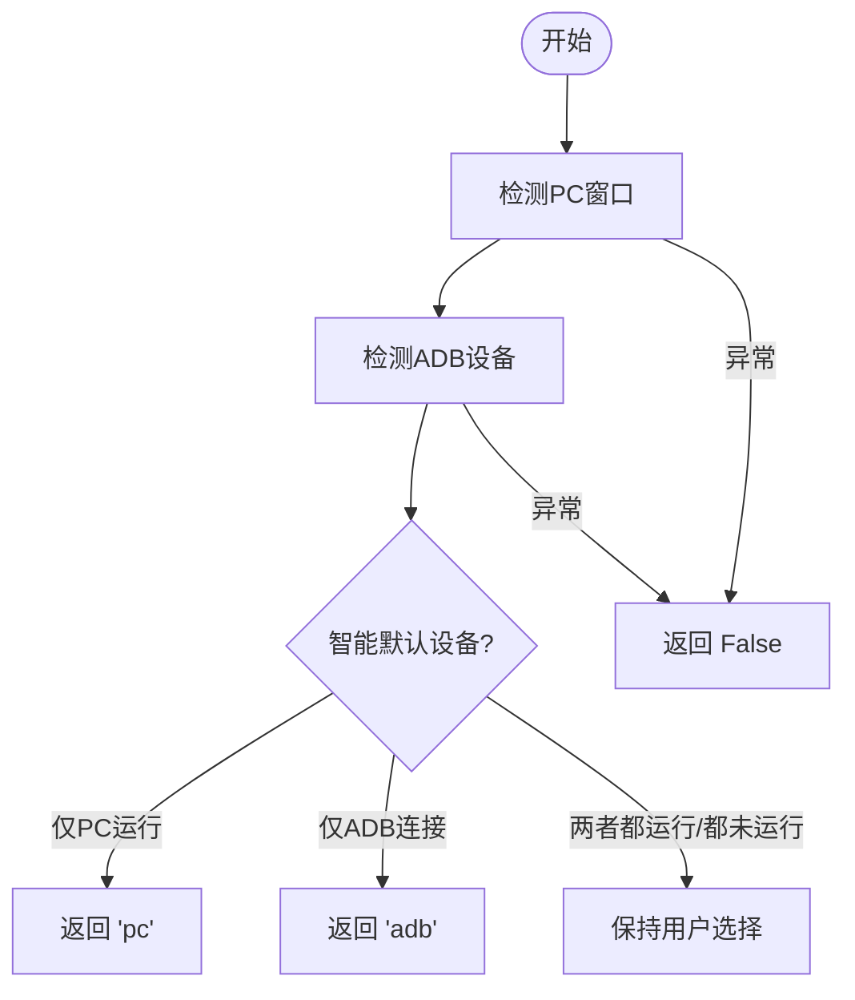
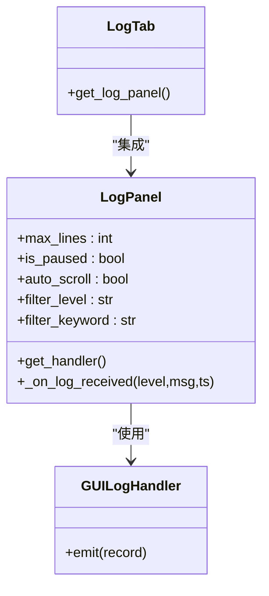
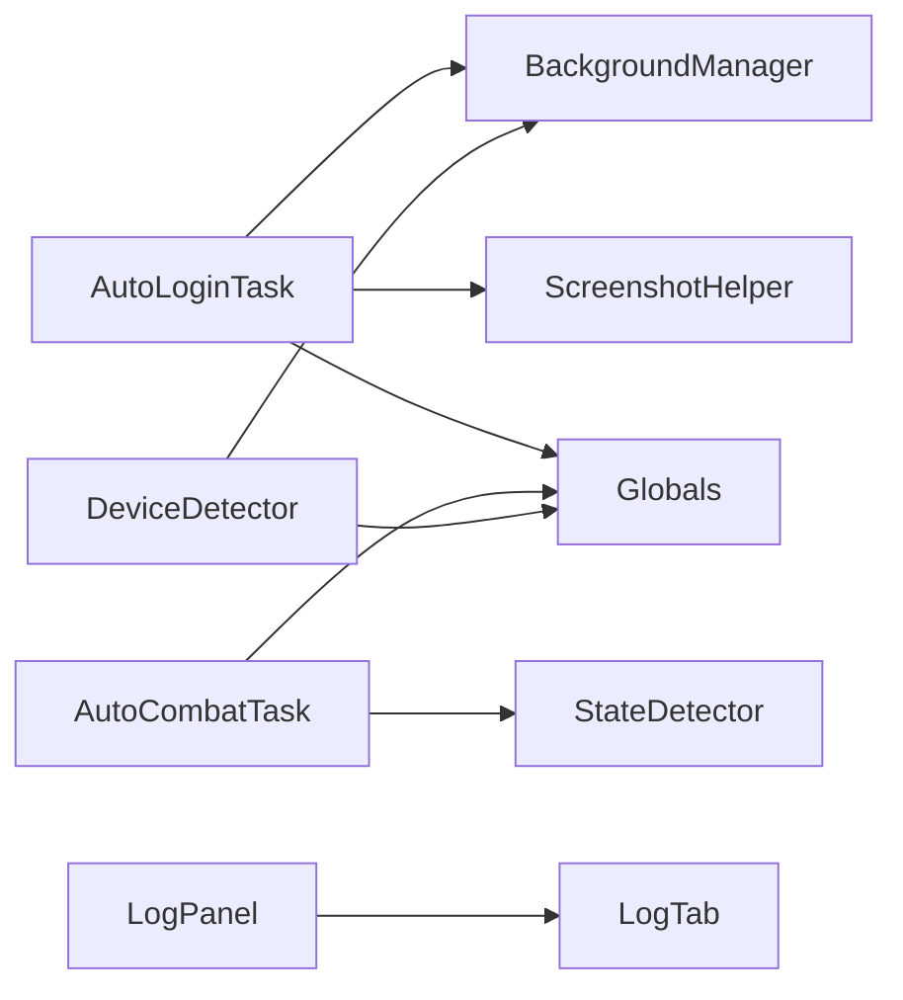

# 错误处理

<cite>
**本文档引用的文件**
- [AutoLoginTask.py](file://src/task/AutoLoginTask.py)
- [AutoCombatTask.py](file://src/task/AutoCombatTask.py)
- [DeviceDetector.py](file://src/utils/DeviceDetector.py)
- [globals.py](file://src/globals.py)
- [BaseJumpTask.py](file://src/task/BaseJumpTask.py)
- [state_detector.py](file://src/combat/state_detector.py)
- [ScreenshotHelper.py](file://src/utils/ScreenshotHelper.py)
- [BackgroundManager.py](file://src/utils/BackgroundManager.py)
- [log_panel.py](file://src/gui/log_panel.py)
- [log_tab.py](file://src/gui/log_tab.py)
- [AutoLoginTask.json](file://configs/AutoLoginTask.json)
</cite>

## 目录
1. [简介](#简介)
2. [项目结构](#项目结构)
3. [核心组件](#核心组件)
4. [架构总览](#架构总览)
5. [详细组件分析](#详细组件分析)
6. [依赖分析](#依赖分析)
7. [性能考虑](#性能考虑)
8. [故障排查指南](#故障排查指南)
9. [结论](#结论)

## 简介
本文件系统性梳理 OK-Jump 的错误处理机制，覆盖以下主题：
- 异常类型分类与处理策略
- 自动登录任务的错误处理流程
- 战斗系统中的异常恢复机制
- 设备检测失败的处理与重试策略
- 网络异常与 IO 异常的处理方案
- 错误日志记录与错误报告生成
- 优雅降级与故障转移策略

## 项目结构
OK-Jump 的错误处理分布在多个层次：
- 任务层：自动登录与自动战斗任务封装了业务错误与流程控制
- 工具层：设备检测、后台管理、截图辅助等提供底层能力与容错
- 日志层：GUI 实时日志面板与处理器，统一采集与展示
- 全局层：全局状态与资源管理，提供跨任务的统一错误上下文

图表来源
- [AutoLoginTask.py:1-120](file://src/task/AutoLoginTask.py#L1-120)
- [AutoCombatTask.py:1-120](file://src/task/AutoCombatTask.py#L1-120)
- [DeviceDetector.py:1-149](file://src/utils/DeviceDetector.py#L1-149)
- [BackgroundManager.py:1-155](file://src/utils/BackgroundManager.py#L1-155)
- [ScreenshotHelper.py:1-68](file://src/utils/ScreenshotHelper.py#L1-68)
- [log_panel.py:1-120](file://src/gui/log_panel.py#L1-120)
- [log_tab.py:1-69](file://src/gui/log_tab.py#L1-69)

章节来源
- [AutoLoginTask.py:1-120](file://src/task/AutoLoginTask.py#L1-120)
- [AutoCombatTask.py:1-120](file://src/task/AutoCombatTask.py#L1-120)
- [DeviceDetector.py:1-149](file://src/utils/DeviceDetector.py#L1-149)
- [BackgroundManager.py:1-155](file://src/utils/BackgroundManager.py#L1-155)
- [ScreenshotHelper.py:1-68](file://src/utils/ScreenshotHelper.py#L1-68)
- [log_panel.py:1-120](file://src/gui/log_panel.py#L1-120)
- [log_tab.py:1-69](file://src/gui/log_tab.py#L1-69)

## 核心组件
- 自动登录任务：负责登录流程的完整错误处理，包括加载界面检测、状态容错、账号输入异常、截图失败等
- 自动战斗任务：负责战斗过程中的异常恢复与资源清理
- 设备检测器：负责 PC 与模拟器设备状态检测，提供智能默认设备选择
- 后台管理器：负责后台模式、伪最小化、静音等环境适配
- 截图辅助器：负责截图保存与特征模板提取
- 全局状态：提供登录状态、OCR 缓存、YOLO 模型等全局资源
- 日志面板：提供 GUI 实时日志展示与过滤

章节来源
- [AutoLoginTask.py:16-120](file://src/task/AutoLoginTask.py#L16-120)
- [AutoCombatTask.py:32-120](file://src/task/AutoCombatTask.py#L32-120)
- [DeviceDetector.py:11-149](file://src/utils/DeviceDetector.py#L11-149)
- [BackgroundManager.py:7-155](file://src/utils/BackgroundManager.py#L7-155)
- [ScreenshotHelper.py:7-68](file://src/utils/ScreenshotHelper.py#L7-68)
- [globals.py:16-257](file://src/globals.py#L16-257)
- [log_panel.py:58-120](file://src/gui/log_panel.py#L58-120)

## 架构总览
错误处理贯穿任务执行的全生命周期，采用“配置驱动 + 状态机 + 容错 + 日志”的架构：
- 配置驱动：通过 JSON 配置控制超时、重试、加载检测等行为
- 状态机：登录与战斗分别维护内部状态，结合容错机制修正最终状态
- 容错：加载停滞、自身检测超时、失败后的二次确认等
- 日志：统一采集、分级过滤、GUI 展示

图表来源
- [AutoLoginTask.py:512-681](file://src/task/AutoLoginTask.py#L512-681)
- [AutoCombatTask.py:197-271](file://src/task/AutoCombatTask.py#L197-271)
- [AutoLoginTask.json:1-15](file://configs/AutoLoginTask.json#L1-15)

## 详细组件分析

### 异常类型分类与处理策略
- 登录输入异常：账号输入过程中抛出的专用异常，用于中断登录流程并记录错误
- 加载停滞异常：加载界面长时间无进度变化时触发，保存错误截图并记录失败
- 自身检测超时：战斗中 15 秒内未检测到自身位置，终止脚本并记录帧信息
- 无单位搜索超时：随机移动搜索 30 秒未发现单位，终止脚本
- 设备检测异常：ADB 未连接或 PC 窗口未找到时，返回 False 并记录异常
- 模型加载异常：YOLO 模型加载失败时返回空列表，避免崩溃

章节来源
- [AutoLoginTask.py:16-18](file://src/task/AutoLoginTask.py#L16-18)
- [AutoLoginTask.py:736-736](file://src/task/AutoLoginTask.py#L736-736)
- [AutoCombatTask.py:243-243](file://src/task/AutoCombatTask.py#L243-243)
- [AutoCombatTask.py:413-413](file://src/task/AutoCombatTask.py#L413-413)
- [DeviceDetector.py:67-110](file://src/utils/DeviceDetector.py#L67-110)
- [globals.py:249-252](file://src/globals.py#L249-252)

### 自动登录任务的错误处理流程
- 初始化与后台模式：确保窗口可截图，记录后台状态
- 游戏启动与窗口等待：超时则记录错误并返回失败
- 登录流程主循环：按界面状态执行对应动作，支持加载检测与状态容错
- 加载界面处理：检测百分比，若停滞则抛出异常并保存错误截图
- 失败记录与容错：记录失败时间，缓冲期内再次确认成功
- 成功后清理与状态更新：清除失败记录，更新登录状态

图表来源
- [AutoLoginTask.py:205-267](file://src/task/AutoLoginTask.py#L205-267)
- [AutoLoginTask.py:512-681](file://src/task/AutoLoginTask.py#L512-681)
- [AutoLoginTask.py:704-768](file://src/task/AutoLoginTask.py#L704-768)

章节来源
- [AutoLoginTask.py:205-267](file://src/task/AutoLoginTask.py#L205-267)
- [AutoLoginTask.py:512-681](file://src/task/AutoLoginTask.py#L512-681)
- [AutoLoginTask.py:704-768](file://src/task/AutoLoginTask.py#L704-768)
- [AutoLoginTask.json:1-15](file://configs/AutoLoginTask.json#L1-15)

### 战斗系统中的异常恢复机制
- 死亡状态并行监控：独立线程持续检测死亡状态，主线程快速查询
- 自身检测超时：15 秒内未检测到自身位置，记录帧信息并抛出异常
- 无单位搜索超时：30 秒内未发现单位，记录错误并抛出异常
- 资源清理：异常发生时停止移动与技能，停止死亡监控线程
- 详细日志：可选输出 YOLO 检测、位置、距离等详细信息

图表来源
- [AutoCombatTask.py:197-271](file://src/task/AutoCombatTask.py#L197-271)
- [state_detector.py:72-184](file://src/combat/state_detector.py#L72-184)
- [state_detector.py:232-283](file://src/combat/state_detector.py#L232-283)

章节来源
- [AutoCombatTask.py:197-271](file://src/task/AutoCombatTask.py#L197-271)
- [state_detector.py:72-184](file://src/combat/state_detector.py#L72-184)
- [state_detector.py:232-283](file://src/combat/state_detector.py#L232-283)

### 设备检测失败的处理与重试策略
- PC 窗口检测：通过枚举窗口标题关键词判断 PC 游戏是否运行，排除模拟器与工具窗口
- ADB 连接检测：优先使用 adbutils 包；若未安装则回退到系统 adb 命令
- 智能默认设备：仅当 PC 运行或仅 ADB 连接时返回具体设备，否则保持用户选择
- 异常处理：捕获导入异常与命令执行异常，返回 False 并记录异常

图表来源
- [DeviceDetector.py:28-134](file://src/utils/DeviceDetector.py#L28-134)
- [DeviceDetector.py:67-110](file://src/utils/DeviceDetector.py#L67-110)

章节来源
- [DeviceDetector.py:28-134](file://src/utils/DeviceDetector.py#L28-134)
- [DeviceDetector.py:67-110](file://src/utils/DeviceDetector.py#L67-110)

### 网络异常与 IO 异常的处理方案
- 网络异常（ADB）：捕获导入异常与命令执行异常，回退到系统 adb 命令；超时控制在 10 秒
- IO 异常（文件/截图）：截图保存与特征模板提取时进行存在性检查与扩展名处理；模型加载失败时返回空列表
- 日志异常：日志处理器捕获异常并调用 handleError，避免影响主流程

章节来源
- [DeviceDetector.py:88-110](file://src/utils/DeviceDetector.py#L88-110)
- [ScreenshotHelper.py:17-44](file://src/utils/ScreenshotHelper.py#L17-44)
- [globals.py:249-252](file://src/globals.py#L249-252)
- [log_panel.py:49-55](file://src/gui/log_panel.py#L49-55)

### 错误日志记录与错误报告生成
- 日志级别与颜色：DEBUG/INFO/WARNING/ERROR/CRITICAL，不同级别与特殊标记（如检测、成功、失败、死亡、战斗等）使用不同颜色
- GUI 实时展示：支持级别过滤、关键词搜索、暂停/恢复、自动滚动、清空日志
- 日志处理器：GUILogHandler 将日志信号发射到 LogPanel，线程安全
- 错误截图：登录任务在加载停滞、检测到错误等场景保存截图，便于问题定位

图表来源
- [log_panel.py:58-120](file://src/gui/log_panel.py#L58-120)
- [log_panel.py:248-250](file://src/gui/log_panel.py#L248-250)
- [log_tab.py:47-69](file://src/gui/log_tab.py#L47-69)

章节来源
- [log_panel.py:58-120](file://src/gui/log_panel.py#L58-120)
- [log_panel.py:248-250](file://src/gui/log_panel.py#L248-250)
- [log_tab.py:47-69](file://src/gui/log_tab.py#L47-69)

### 优雅降级与故障转移策略
- 后台模式与伪最小化：在后台或最小化时自动伪最小化，确保截图与输入可用
- 静音策略：后台时可选择静音游戏，降低资源占用
- 智能设备选择：根据 PC 与 ADB 状态自动选择设备，避免冲突
- 资源释放：异常时停止死亡监控线程、停止移动与技能，释放 YOLO 模型

章节来源
- [BackgroundManager.py:101-128](file://src/utils/BackgroundManager.py#L101-128)
- [BackgroundManager.py:77-80](file://src/utils/BackgroundManager.py#L77-80)
- [DeviceDetector.py:113-134](file://src/utils/DeviceDetector.py#L113-134)
- [AutoCombatTask.py:679-691](file://src/task/AutoCombatTask.py#L679-691)

## 依赖分析
- 任务依赖：AutoLoginTask 依赖后台管理器、截图辅助器、全局状态；AutoCombatTask 依赖状态检测器、移动控制、技能控制
- 工具依赖：设备检测器依赖 win32gui 与 adbutils 或系统 adb；后台管理器依赖 ctypes 与伪最小化助手
- 日志依赖：日志面板依赖 PySide6/qfluentwidgets，提供 GUI 展示

图表来源
- [AutoLoginTask.py:101-115](file://src/task/AutoLoginTask.py#L101-115)
- [AutoCombatTask.py:136-150](file://src/task/AutoCombatTask.py#L136-150)
- [DeviceDetector.py:82-86](file://src/utils/DeviceDetector.py#L82-86)
- [log_panel.py:358-387](file://src/gui/log_panel.py#L358-387)

章节来源
- [AutoLoginTask.py:101-115](file://src/task/AutoLoginTask.py#L101-115)
- [AutoCombatTask.py:136-150](file://src/task/AutoCombatTask.py#L136-150)
- [DeviceDetector.py:82-86](file://src/utils/DeviceDetector.py#L82-86)
- [log_panel.py:358-387](file://src/gui/log_panel.py#L358-387)

## 性能考虑
- 加载检测优化：加载界面检测优先级最高，避免其他检测干扰；使用 OCR 缓存与 ROI 区域减少计算开销
- 检测频率控制：死亡监控线程检测间隔 30ms，自身检测 30ms，避免过度占用 CPU
- 超时与重试：登录等待超时、最大尝试次数、加载停滞超时等配置可调，平衡稳定性与效率
- 后台模式：后台时自动伪最小化，减少窗口状态切换带来的性能损耗

## 故障排查指南
- 登录失败排查
  - 检查游戏路径配置与窗口等待超时
  - 查看加载界面百分比是否停滞，保存的错误截图
  - 启用状态容错，观察缓冲期内是否自动修正
- 战斗异常排查
  - 查看自身检测超时日志与帧信息
  - 检查死亡监控线程是否正常运行
  - 开启详细日志，关注 YOLO 检测与距离计算
- 设备检测问题
  - 确认 adbutils 是否安装，或系统 adb 可用
  - 检查 PC 窗口标题关键词是否匹配
- 日志与截图
  - 使用日志面板过滤级别与关键词
  - 查看 screenshots 目录下的错误截图与特征模板

章节来源
- [AutoLoginTask.py:534-544](file://src/task/AutoLoginTask.py#L534-544)
- [AutoLoginTask.py:576-581](file://src/task/AutoLoginTask.py#L576-581)
- [AutoCombatTask.py:243-243](file://src/task/AutoCombatTask.py#L243-243)
- [state_detector.py:158-177](file://src/combat/state_detector.py#L158-177)
- [DeviceDetector.py:88-110](file://src/utils/DeviceDetector.py#L88-110)
- [log_panel.py:272-283](file://src/gui/log_panel.py#L272-283)
- [ScreenshotHelper.py:17-44](file://src/utils/ScreenshotHelper.py#L17-44)

## 结论
OK-Jump 的错误处理机制通过“配置驱动 + 状态机 + 容错 + 日志”形成闭环，既保证了任务的鲁棒性，又提供了良好的可观测性与可维护性。登录与战斗两大核心流程分别针对其特点实现了针对性的异常恢复与资源清理策略，设备检测与后台适配进一步提升了跨平台兼容性。建议在生产环境中：
- 合理配置超时与重试参数
- 启用详细日志与错误截图
- 定期检查 adb 与 PC 窗口状态
- 在 GUI 中使用日志面板进行实时监控