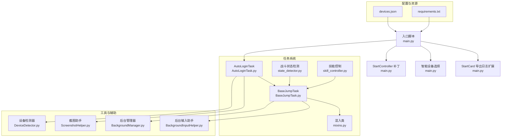
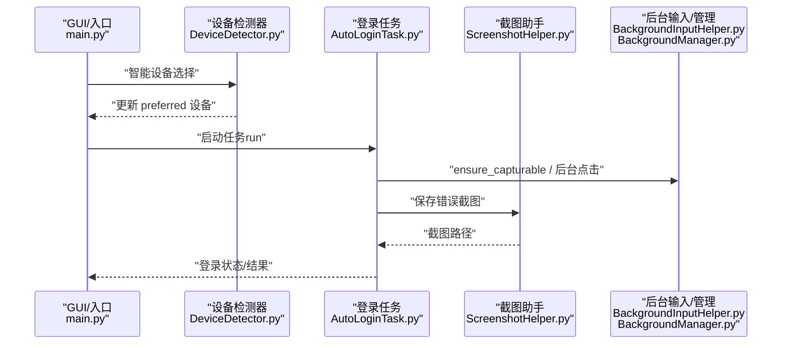
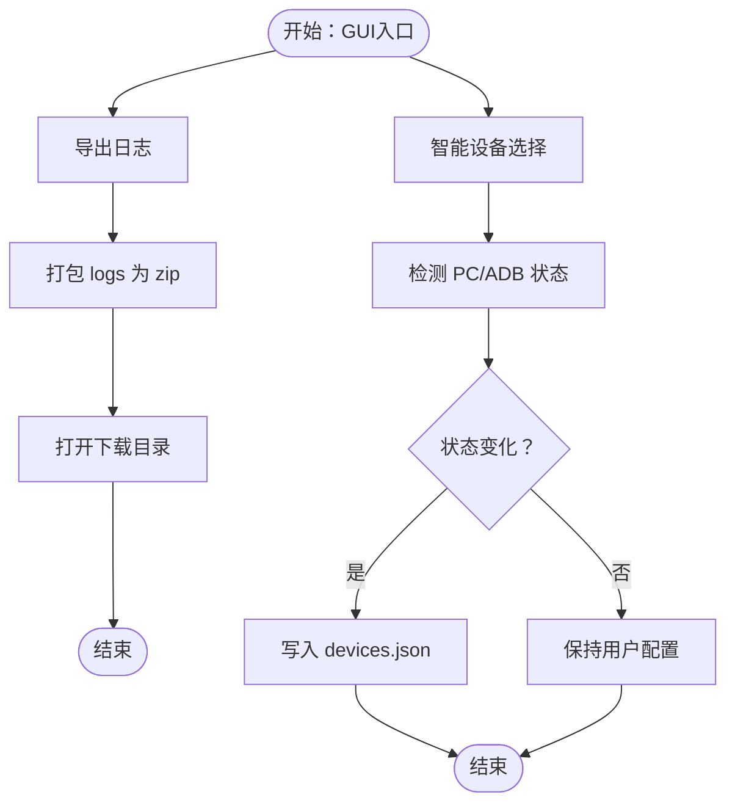
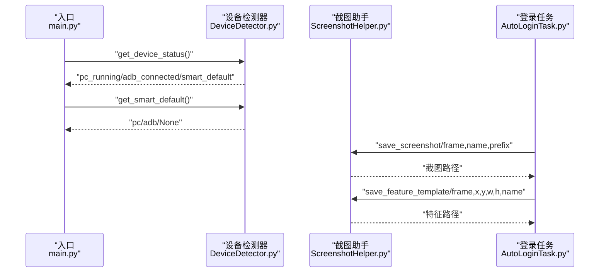
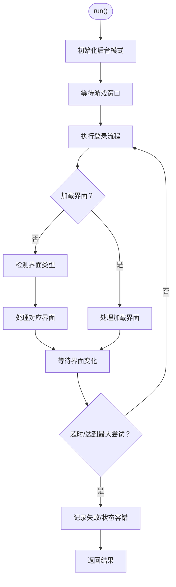
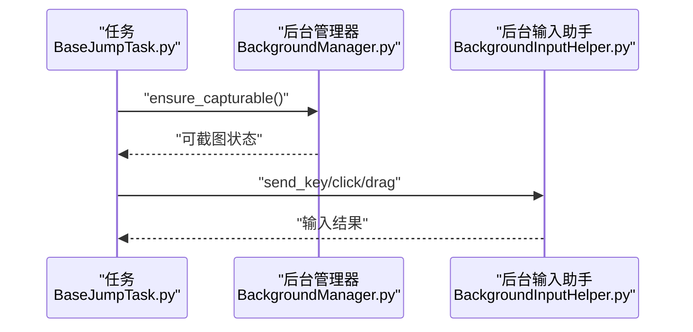
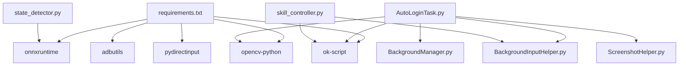

# 集成测试

<cite>
**本文档引用的文件**   
- [main.py](file://main.py)
- [test_input.py](file://test_input.py)
- [test_autologin_task.py](file://tests/test_autologin_task.py)
- [DeviceDetector.py](file://src/utils/DeviceDetector.py)
- [ScreenshotHelper.py](file://src/utils/ScreenshotHelper.py)
- [AutoLoginTask.py](file://src/task/AutoLoginTask.py)
- [BaseJumpTask.py](file://src/task/BaseJumpTask.py)
- [mixins.py](file://src/task/mixins.py)
- [BackgroundInputHelper.py](file://src/utils/BackgroundInputHelper.py)
- [BackgroundManager.py](file://src/utils/BackgroundManager.py)
- [state_detector.py](file://src/combat/state_detector.py)
- [skill_controller.py](file://src/combat/skill_controller.py)
- [devices.json](file://configs/devices.json)
- [requirements.txt](file://requirements.txt)
</cite>

## 目录
1. [简介](#简介)
2. [项目结构](#项目结构)
3. [核心组件](#核心组件)
4. [架构总览](#架构总览)
5. [详细组件分析](#详细组件分析)
6. [依赖分析](#依赖分析)
7. [性能考虑](#性能考虑)
8. [故障排查指南](#故障排查指南)
9. [结论](#结论)
10. [附录](#附录)

## 简介
本文件面向OK-Jump项目的集成测试设计与实施，聚焦以下目标：
- 多组件协同工作的测试方法：GUI组件、设备检测器、截图助手、任务系统（登录、战斗、技能、后台输入）。
- GUI组件与业务逻辑的集成测试策略：通过StartCard导出日志、智能设备选择、StartController补丁等入口验证端到端行为。
- 设备检测器与截图助手的集成测试流程：设备状态检测、截图保存与特征提取。
- 任务系统各模块间的交互测试：登录流程、加载检测、状态容错、OCR缓存、后台模式适配。
- 端到端测试场景设计与实现：覆盖登录、问卷调查、加载停滞、后台输入等真实场景。
- 测试数据管理与测试环境隔离：配置文件、截图目录、ADB/PC设备选择。
- 性能测试与压力测试：加载检测频率、OCR缓存复用、后台输入吞吐。

## 项目结构
OK-Jump采用“任务驱动 + 框架集成”的结构，核心位于src目录，测试位于tests目录，配置位于configs目录，资源位于assets目录，截图输出在screenshots目录。

**图表来源**
- [main.py:1-107](file://main.py#L1-L107)
- [AutoLoginTask.py:1-800](file://src/task/AutoLoginTask.py#L1-L800)
- [BaseJumpTask.py:1-422](file://src/task/BaseJumpTask.py#L1-L422)
- [mixins.py:1-774](file://src/task/mixins.py#L1-L774)
- [DeviceDetector.py:1-149](file://src/utils/DeviceDetector.py#L1-L149)
- [ScreenshotHelper.py:1-68](file://src/utils/ScreenshotHelper.py#L1-L68)
- [BackgroundInputHelper.py:1-800](file://src/utils/BackgroundInputHelper.py#L1-L800)
- [BackgroundManager.py:1-155](file://src/utils/BackgroundManager.py#L1-L155)
- [state_detector.py:1-446](file://src/combat/state_detector.py#L1-L446)
- [skill_controller.py:1-347](file://src/combat/skill_controller.py#L1-L347)
- [devices.json:1-7](file://configs/devices.json#L1-L7)
- [requirements.txt:1-14](file://requirements.txt#L1-L14)

**章节来源**
- [main.py:1-107](file://main.py#L1-L107)
- [devices.json:1-7](file://configs/devices.json#L1-L7)
- [requirements.txt:1-14](file://requirements.txt#L1-L14)

## 核心组件
- 入口与GUI集成
  - StartCard导出日志：提供一键打包logs目录为zip并打开下载目录。
  - 智能设备选择：基于PC运行与ADB连接状态自动更新devices.json的preferred字段。
  - StartController补丁：允许最小化/出屏窗口在后台模式下继续运行。
- 设备检测器
  - 检测PC游戏窗口与模拟器ADB连接，提供智能默认设备选择。
- 截图助手
  - 保存截图与特征模板，生成COCO标注条目，便于训练与验证。
- 任务系统
  - AutoLoginTask：登录流程、问卷调查、OCR缓存、加载检测、状态容错。
  - BaseJumpTask：统一的后台模式、分辨率适配、OCR匹配、窗口状态检查。
  - 战斗与技能：状态检测（YOLO）、技能释放（键盘/ADB）。
- 后台输入与管理
  - BackgroundInputHelper：SendInput实现后台键盘/鼠标输入。
  - BackgroundManager：后台模式开关、前台窗口检测、伪最小化。

**章节来源**
- [main.py:11-97](file://main.py#L11-L97)
- [DeviceDetector.py:11-149](file://src/utils/DeviceDetector.py#L11-L149)
- [ScreenshotHelper.py:7-68](file://src/utils/ScreenshotHelper.py#L7-L68)
- [AutoLoginTask.py:21-100](file://src/task/AutoLoginTask.py#L21-L100)
- [BaseJumpTask.py:14-58](file://src/task/BaseJumpTask.py#L14-L58)
- [state_detector.py:24-61](file://src/combat/state_detector.py#L24-L61)
- [skill_controller.py:24-83](file://src/combat/skill_controller.py#L24-L83)
- [BackgroundInputHelper.py:99-148](file://src/utils/BackgroundInputHelper.py#L99-L148)
- [BackgroundManager.py:7-44](file://src/utils/BackgroundManager.py#L7-L44)

## 架构总览
下图展示集成测试关注的关键交互：GUI入口触发设备检测与任务执行；任务系统依赖截图与后台输入；战斗模块依赖YOLO检测与技能控制。

**图表来源**
- [main.py:54-97](file://main.py#L54-L97)
- [DeviceDetector.py:113-149](file://src/utils/DeviceDetector.py#L113-L149)
- [AutoLoginTask.py:205-267](file://src/task/AutoLoginTask.py#L205-L267)
- [ScreenshotHelper.py:17-30](file://src/utils/ScreenshotHelper.py#L17-L30)
- [BackgroundManager.py:101-128](file://src/utils/BackgroundManager.py#L101-L128)
- [BackgroundInputHelper.py:300-356](file://src/utils/BackgroundInputHelper.py#L300-L356)

## 详细组件分析

### GUI与业务逻辑集成测试策略
- StartCard导出日志
  - 验证：调用导出函数后，下载目录生成压缩包并打开。
  - 关注：日志目录存在性、压缩文件完整性、路径拼接正确性。
- 智能设备选择
  - 验证：根据PC运行与ADB连接状态，更新devices.json的preferred字段。
  - 关注：状态检测函数返回值、JSON写入成功、异常分支处理。
- StartController补丁
  - 验证：最小化/出屏窗口在开启skip_pos_check时可继续运行。
  - 关注：错误信息匹配、配置读取、原方法返回值透传。

**图表来源**
- [main.py:11-26](file://main.py#L11-L26)
- [main.py:54-97](file://main.py#L54-L97)

**章节来源**
- [main.py:11-26](file://main.py#L11-L26)
- [main.py:54-97](file://main.py#L54-L97)

### 设备检测器与截图助手集成测试
- 设备检测器
  - 功能：检测PC游戏窗口、ADB设备连接、智能默认设备。
  - 集成点：入口脚本在OK框架初始化前调用，影响devices.json。
- 截图助手
  - 功能：保存截图、保存特征模板、生成COCO条目。
  - 集成点：登录任务在错误时调用保存错误截图，便于回归定位。

**图表来源**
- [main.py:65-94](file://main.py#L65-L94)
- [DeviceDetector.py:137-149](file://src/utils/DeviceDetector.py#L137-L149)
- [ScreenshotHelper.py:17-44](file://src/utils/ScreenshotHelper.py#L17-L44)
- [AutoLoginTask.py:577-581](file://src/task/AutoLoginTask.py#L577-L581)

**章节来源**
- [DeviceDetector.py:11-149](file://src/utils/DeviceDetector.py#L11-L149)
- [ScreenshotHelper.py:7-68](file://src/utils/ScreenshotHelper.py#L7-L68)
- [AutoLoginTask.py:570-598](file://src/task/AutoLoginTask.py#L570-L598)

### 任务系统模块交互测试
- AutoLoginTask主流程
  - 后台模式初始化、窗口状态记录、等待游戏窗口、执行登录流程、加载检测、状态容错、问卷调查处理。
- BaseJumpTask与混入类
  - 统一后台点击、分辨率适配、语言转换、OCR匹配、窗口状态检查。
- 战斗与技能
  - 状态检测（死亡、自身、友方、敌方）、最近目标选择；技能释放（键盘/ADB）。

**图表来源**
- [AutoLoginTask.py:205-267](file://src/task/AutoLoginTask.py#L205-L267)
- [AutoLoginTask.py:512-681](file://src/task/AutoLoginTask.py#L512-L681)
- [BaseJumpTask.py:61-130](file://src/task/BaseJumpTask.py#L61-L130)
- [mixins.py:381-424](file://src/task/mixins.py#L381-L424)

**章节来源**
- [AutoLoginTask.py:205-681](file://src/task/AutoLoginTask.py#L205-L681)
- [BaseJumpTask.py:61-228](file://src/task/BaseJumpTask.py#L61-L228)
- [mixins.py:381-774](file://src/task/mixins.py#L381-L774)

### 后台输入与管理测试
- 后台输入助手
  - SendInput实现键盘/鼠标输入，支持前台与后台两种模式，避免窗口切换。
- 后台管理器
  - 检测前台窗口、伪最小化、静音策略、自动伪最小化。

**图表来源**
- [BaseJumpTask.py:305-342](file://src/task/BaseJumpTask.py#L305-L342)
- [BackgroundManager.py:101-128](file://src/utils/BackgroundManager.py#L101-L128)
- [BackgroundInputHelper.py:310-356](file://src/utils/BackgroundInputHelper.py#L310-L356)

**章节来源**
- [BackgroundInputHelper.py:99-474](file://src/utils/BackgroundInputHelper.py#L99-L474)
- [BackgroundManager.py:7-155](file://src/utils/BackgroundManager.py#L7-L155)

### 端到端测试场景设计与实现
- 场景1：登录流程（含问卷调查）
  - 步骤：启动游戏/等待窗口、检测登录界面、处理问卷调查、登录成功。
  - 断言：界面状态、点击次数、OCR匹配、登录成功标志。
- 场景2：加载检测与停滞
  - 步骤：检测右下角百分比、连续停滞判定、保存错误截图。
  - 断言：停滞超时、错误截图保存、状态容错。
- 场景3：后台输入与窗口状态
  - 步骤：最小化/出屏窗口、伪最小化、后台点击。
  - 断言：后台模式状态、输入成功、窗口状态日志。
- 场景4：设备选择与ADB/PC切换
  - 步骤：检测PC/ADB状态、更新devices.json、重启任务。
  - 断言：preferred字段变更、设备连接状态。

**章节来源**
- [test_autologin_task.py:1-407](file://tests/test_autologin_task.py#L1-L407)
- [AutoLoginTask.py:324-456](file://src/task/AutoLoginTask.py#L324-L456)
- [AutoLoginTask.py:570-598](file://src/task/AutoLoginTask.py#L570-L598)
- [BackgroundManager.py:18-23](file://src/utils/BackgroundManager.py#L18-L23)
- [BackgroundInputHelper.py:310-356](file://src/utils/BackgroundInputHelper.py#L310-L356)

## 依赖分析
- 外部依赖
  - ok-script：框架核心，提供BaseTask、OCR、截图、ADB交互。
  - opencv-python：图像处理与截图保存。
  - adbutils：ADB设备检测。
  - pydirectinput：前台键盘输入。
  - onnxruntime：YOLO推理。
- 内部依赖
  - AutoLoginTask依赖BaseJumpTask与混入类，间接依赖后台输入与管理。
  - 战斗模块依赖YOLO检测与技能控制。
  - 截图助手被任务系统广泛使用。

**图表来源**
- [requirements.txt:1-14](file://requirements.txt#L1-L14)
- [AutoLoginTask.py:1-14](file://src/task/AutoLoginTask.py#L1-L14)
- [state_detector.py:11-14](file://src/combat/state_detector.py#L11-L14)
- [skill_controller.py:14-22](file://src/combat/skill_controller.py#L14-L22)
- [BackgroundInputHelper.py:16-24](file://src/utils/BackgroundInputHelper.py#L16-L24)
- [BackgroundManager.py:1-4](file://src/utils/BackgroundManager.py#L1-L4)
- [ScreenshotHelper.py:1-6](file://src/utils/ScreenshotHelper.py#L1-L6)

**章节来源**
- [requirements.txt:1-14](file://requirements.txt#L1-L14)

## 性能考虑
- 加载检测频率
  - AutoLoginTask中加载百分比检测与停滞判定需平衡检测频率与CPU占用，避免过度OCR导致卡顿。
- OCR缓存复用
  - BaseJumpTask提供OCR缓存与清理，减少重复OCR开销。
- 后台输入吞吐
  - BackgroundInputHelper使用SendInput避免窗口激活带来的抖动，适合高频输入场景。
- YOLO推理优化
  - 战斗状态检测使用并行线程监控死亡状态，主线程快速查询，降低响应延迟。

**章节来源**
- [AutoLoginTask.py:324-456](file://src/task/AutoLoginTask.py#L324-L456)
- [BaseJumpTask.py:308-321](file://src/task/BaseJumpTask.py#L308-L321)
- [BackgroundInputHelper.py:143-148](file://src/utils/BackgroundInputHelper.py#L143-L148)
- [state_detector.py:72-184](file://src/combat/state_detector.py#L72-L184)

## 故障排查指南
- 输入测试
  - 使用test_input.py验证pydirectinput在前台窗口的有效性，若无效，检查管理员权限、窗口焦点、反作弊机制。
- 登录失败与错误截图
  - AutoLoginTask在检测到错误或加载停滞时保存错误截图，结合日志定位问题。
- 设备选择异常
  - 检查devices.json的preferred字段与ADB连接状态，必要时手动切换。
- 后台输入失败
  - 确认后台模式配置、窗口状态（最小化/伪最小化）、SendInput权限。

**章节来源**
- [test_input.py:1-58](file://test_input.py#L1-L58)
- [AutoLoginTask.py:577-581](file://src/task/AutoLoginTask.py#L577-L581)
- [devices.json:1-7](file://configs/devices.json#L1-L7)
- [BackgroundInputHelper.py:310-356](file://src/utils/BackgroundInputHelper.py#L310-L356)

## 结论
本集成测试文档围绕GUI入口、设备检测、截图助手、任务系统与后台输入五大方面，给出了端到端测试场景、数据与环境管理策略以及性能与压力测试建议。通过Mock与断言验证关键流程（登录、加载、问卷、后台输入），可有效提升系统的稳定性与可维护性。

## 附录
- 测试数据管理
  - 截图目录：默认“screenshots”，可配置；特征模板保存在“features”子目录。
  - 配置文件：devices.json用于设备选择；Basic Options.json用于后台模式等全局配置。
- 测试环境隔离
  - 使用不同devices.json副本或临时目录，避免多任务并发污染。
  - ADB/PC切换时注意设备连接状态与窗口句柄变化。
- 性能与压力测试建议
  - 加载检测：调整检测间隔与停滞阈值，观察CPU占用与响应时间。
  - OCR缓存：在多界面切换场景下验证缓存命中率与清理时机。
  - 后台输入：批量高频输入（如技能连发）验证SendInput稳定性。

**章节来源**
- [ScreenshotHelper.py:17-44](file://src/utils/ScreenshotHelper.py#L17-L44)
- [devices.json:1-7](file://configs/devices.json#L1-L7)
- [BackgroundManager.py:18-23](file://src/utils/BackgroundManager.py#L18-L23)