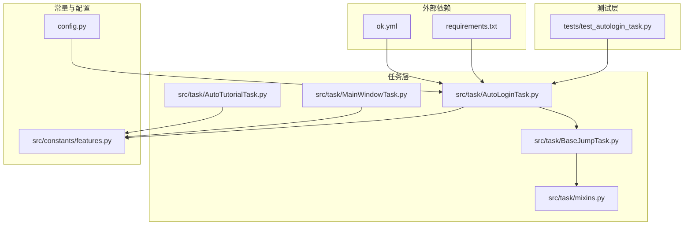
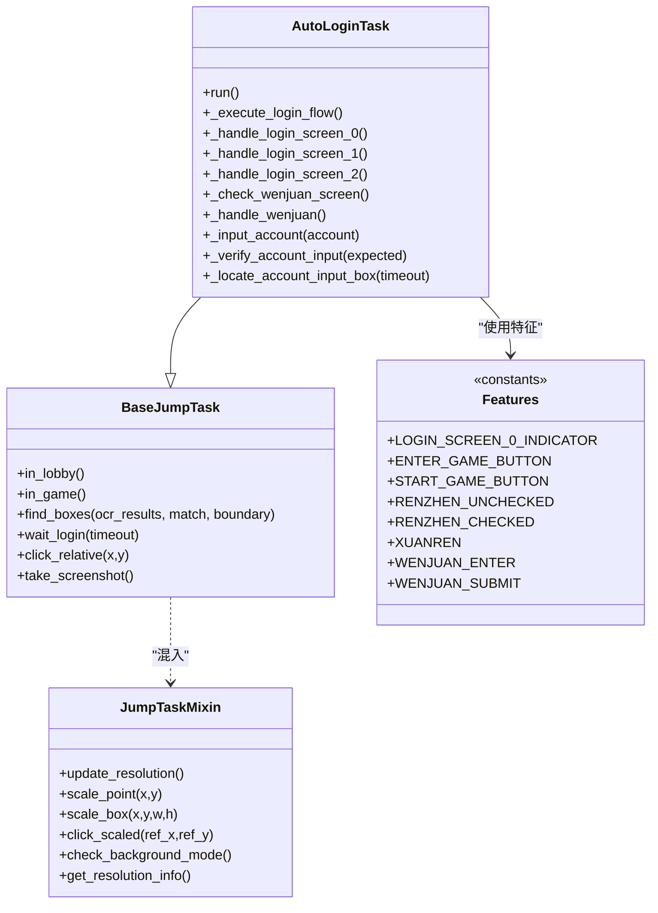
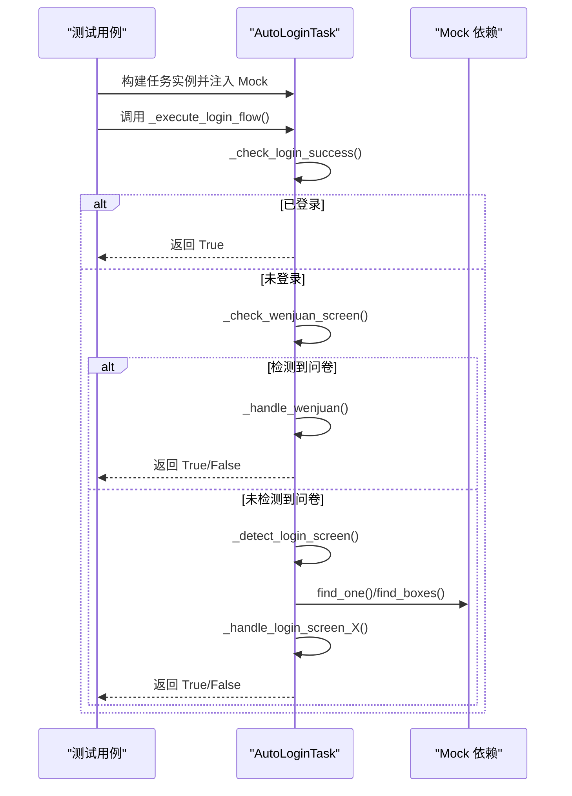
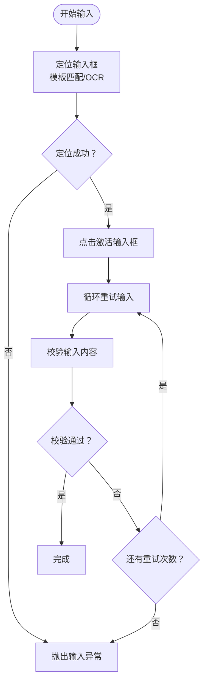
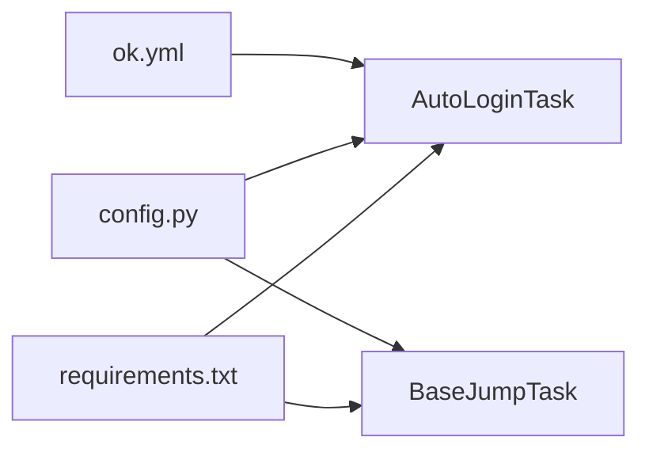

# 测试框架

<cite>
**本文引用的文件**
- [tests/test_autologin_task.py](file://tests/test_autologin_task.py)
- [src/task/AutoLoginTask.py](file://src/task/AutoLoginTask.py)
- [src/task/BaseJumpTask.py](file://src/task/BaseJumpTask.py)
- [src/constants/features.py](file://src/constants/features.py)
- [src/taks/mixins.py](file://src/task/mixins.py)
- [src/task/MainWindowTask.py](file://src/task/MainWindowTask.py)
- [src/task/AutoTutorialTask.py](file://src/task/AutoTutorialTask.py)
- [config.py](file://config.py)
- [requirements.txt](file://requirements.txt)
- [ok.yml](file://ok.yml)
</cite>

## 目录
1. [引言](#引言)
2. [项目结构](#项目结构)
3. [核心组件](#核心组件)
4. [架构总览](#架构总览)
5. [详细组件分析](#详细组件分析)
6. [依赖分析](#依赖分析)
7. [性能考虑](#性能考虑)
8. [故障排查指南](#故障排查指南)
9. [结论](#结论)
10. [附录](#附录)

## 引言
本文件面向开发者与测试工程师，系统性梳理该自动化测试框架的组织结构、测试策略、测试用例编写规范、测试环境搭建、测试数据准备、测试自动化与持续集成配置建议、测试覆盖率与性能测试方法，并提供编写高质量测试用例与维护测试框架的实践指导。当前仓库以单元测试为主，覆盖登录任务的关键流程与边界条件，后续可扩展集成测试与自动化流水线。

## 项目结构
项目采用“功能分层 + 任务驱动”的组织方式：
- src：核心业务逻辑，按功能域拆分（task、combat、constants、utils、scene 等）
- tests：单元测试集中于 tests 目录，当前仅包含登录任务测试
- configs/assets：配置与资源文件
- 根目录：应用入口、打包与依赖声明

图表来源
- [tests/test_autologin_task.py:1-407](file://tests/test_autologin_task.py#L1-L407)
- [src/task/AutoLoginTask.py:1-1105](file://src/task/AutoLoginTask.py#L1-L1105)
- [src/task/BaseJumpTask.py:1-295](file://src/task/BaseJumpTask.py#L1-L295)
- [src/constants/features.py:1-86](file://src/constants/features.py#L1-L86)
- [config.py:1-138](file://config.py#L1-L138)
- [requirements.txt:1-13](file://requirements.txt#L1-L13)
- [ok.yml:1-12](file://ok.yml#L1-L12)

章节来源
- [tests/test_autologin_task.py:1-407](file://tests/test_autologin_task.py#L1-L407)
- [src/task/AutoLoginTask.py:1-1105](file://src/task/AutoLoginTask.py#L1-L1105)
- [src/task/BaseJumpTask.py:1-295](file://src/task/BaseJumpTask.py#L1-L295)
- [src/constants/features.py:1-86](file://src/constants/features.py#L1-L86)
- [config.py:1-138](file://config.py#L1-L138)
- [requirements.txt:1-13](file://requirements.txt#L1-L13)
- [ok.yml:1-12](file://ok.yml#L1-L12)

## 核心组件
- AutoLoginTask：自动登录任务，负责适龄提示、账号输入、问卷调查、角色选择等全流程；提供异常类型 AutoLoginInputException 用于输入阶段的错误传播。
- BaseJumpTask：任务基类，提供 OCR 文本缓存、窗口检测、分辨率适配、后台模式支持、通用按钮点击等能力。
- JumpTaskMixin：混入类，封装分辨率适配、后台模式、日志封装、特征检测等通用能力。
- Features：统一管理模板/特征名称常量，确保代码与配置一致。
- MainWindowTask/AutoTutorialTask：其他任务示例，展示如何基于 BaseJumpTask 与 Features 进行开发。

章节来源
- [src/task/AutoLoginTask.py:13-142](file://src/task/AutoLoginTask.py#L13-L142)
- [src/task/BaseJumpTask.py:10-28](file://src/task/BaseJumpTask.py#L10-L28)
- [src/task/mixins.py:12-301](file://src/task/mixins.py#L12-L301)
- [src/constants/features.py:9-86](file://src/constants/features.py#L9-L86)
- [src/task/MainWindowTask.py:137-215](file://src/task/MainWindowTask.py#L137-L215)
- [src/task/AutoTutorialTask.py:1-154](file://src/task/AutoTutorialTask.py#L1-L154)

## 架构总览
测试框架围绕“任务-特征-配置”三层展开：
- 任务层：AutoLoginTask 为核心，调用基类与混入提供的通用能力
- 特征层：Features 统一特征名称，配合模板匹配与 OCR
- 配置层：config.py 提供 OCR、模板匹配、窗口、ADB、分辨率等全局配置

图表来源
- [src/task/AutoLoginTask.py:18-142](file://src/task/AutoLoginTask.py#L18-L142)
- [src/task/BaseJumpTask.py:10-295](file://src/task/BaseJumpTask.py#L10-L295)
- [src/task/mixins.py:12-301](file://src/task/mixins.py#L12-L301)
- [src/constants/features.py:9-86](file://src/constants/features.py#L9-L86)

## 详细组件分析

### 登录任务测试策略与用例设计
- 目标：验证登录流程各界面的识别与交互、问卷调查处理、账号输入与校验、异常分支与超时控制。
- 方法：通过构建任务实例并注入 Mock 依赖，隔离外部系统（窗口、OCR、模板匹配），重点断言关键行为与调用序列。
- 关键断言点：
  - 模板匹配与 OCR 的组合识别
  - 界面切换与点击顺序
  - 账号输入的重试与校验
  - 超时与异常传播

图表来源
- [tests/test_autologin_task.py:56-300](file://tests/test_autologin_task.py#L56-L300)
- [src/task/AutoLoginTask.py:196-271](file://src/task/AutoLoginTask.py#L196-L271)

章节来源
- [tests/test_autologin_task.py:56-407](file://tests/test_autologin_task.py#L56-L407)
- [src/task/AutoLoginTask.py:196-271](file://src/task/AutoLoginTask.py#L196-L271)

### 账号输入流程测试
- 输入前置条件：定位输入框（模板匹配优先，失败回退 OCR）、激活输入框、键盘输入、校验输入。
- 重试与超时：根据配置进行多次重试，累计超时后抛出自定义异常。
- 校验策略：OCR 文本包含预期值即视为通过，允许容错窗口。

图表来源
- [tests/test_autologin_task.py:302-390](file://tests/test_autologin_task.py#L302-L390)
- [src/task/AutoLoginTask.py:642-701](file://src/task/AutoLoginTask.py#L642-L701)
- [src/task/AutoLoginTask.py:728-756](file://src/task/AutoLoginTask.py#L728-L756)

章节来源
- [tests/test_autologin_task.py:302-390](file://tests/test_autologin_task.py#L302-L390)
- [src/task/AutoLoginTask.py:642-701](file://src/task/AutoLoginTask.py#L642-L701)
- [src/task/AutoLoginTask.py:728-756](file://src/task/AutoLoginTask.py#L728-L756)

### 问卷调查处理测试
- 检测：优先模板匹配，失败时通过 OCR 文本识别“问卷调查”入口。
- 处理：按题干匹配选项并点击，最后提交；若长时间未回到游戏界面则判定失败。
- 行为断言：点击次数、返回游戏检测、超时处理。

章节来源
- [tests/test_autologin_task.py:56-177](file://tests/test_autologin_task.py#L56-L177)
- [src/task/AutoLoginTask.py:223-233](file://src/task/AutoLoginTask.py#L223-L233)

### 登录界面识别与交互测试
- 三类登录界面识别：适龄提示、账户登录、开始游戏。
- 协议勾选：通过模板置信度比较与 OCR 定位，避免误点击。
- 通用按钮：OCR 定位“进入游戏/开始游戏/登录”。

章节来源
- [tests/test_autologin_task.py:205-266](file://tests/test_autologin_task.py#L205-L266)
- [src/task/AutoLoginTask.py:273-344](file://src/task/AutoLoginTask.py#L273-L344)
- [src/task/AutoLoginTask.py:348-408](file://src/task/AutoLoginTask.py#L348-L408)
- [src/task/BaseJumpTask.py:108-152](file://src/task/BaseJumpTask.py#L108-L152)

## 依赖分析
- 外部库：ok-script、opencv、numpy、onnxruntime、pywin32、psutil、pydirectinput、pyperclip 等
- 配置：OCR、模板匹配、窗口交互、ADB、分辨率与参考分辨率等
- 运行时要求：Python 3.12

图表来源
- [requirements.txt:1-13](file://requirements.txt#L1-L13)
- [config.py:75-137](file://config.py#L75-L137)
- [ok.yml:1-12](file://ok.yml#L1-L12)

章节来源
- [requirements.txt:1-13](file://requirements.txt#L1-L13)
- [config.py:75-137](file://config.py#L75-L137)
- [ok.yml:1-12](file://ok.yml#L1-L12)

## 性能考虑
- OCR 与模板匹配缓存：BaseJumpTask 提供 OCR 文本缓存与清理，减少重复计算。
- 分辨率适配：通过混入类统一缩放坐标与矩形框，避免重复计算。
- 等待与重试：登录流程中设置超时与最大尝试次数，防止无限等待。
- 建议优化：
  - 在测试中使用更小的 OCR 文本范围或局部裁剪，减少匹配开销
  - 对高频调用的模板匹配结果进行短期缓存
  - 控制测试中的帧采集频率，避免过度 sleep 导致整体耗时增长

章节来源
- [src/task/BaseJumpTask.py:180-193](file://src/task/BaseJumpTask.py#L180-L193)
- [src/task/mixins.py:101-179](file://src/task/mixins.py#L101-L179)
- [src/task/AutoLoginTask.py:196-271](file://src/task/AutoLoginTask.py#L196-L271)

## 故障排查指南
- 账号输入异常：当输入框识别超时、激活失败或校验失败时抛出 AutoLoginInputException。测试中应断言异常类型与截图保存。
- 窗口与后台模式：MainWindowTask 提供截图测试与分辨率/后台模式检查日志，便于定位窗口不可见或后台模式未启用的问题。
- OCR 与模板匹配：若识别不稳定，检查模板阈值、特征名称一致性与分辨率适配。

章节来源
- [src/task/AutoLoginTask.py:13-15](file://src/task/AutoLoginTask.py#L13-L15)
- [tests/test_autologin_task.py:340-390](file://tests/test_autologin_task.py#L340-L390)
- [src/task/MainWindowTask.py:137-215](file://src/task/MainWindowTask.py#L137-L215)
- [src/constants/features.py:22-57](file://src/constants/features.py#L22-L57)

## 结论
当前测试框架以 AutoLoginTask 为核心，采用 Mock 驱动的单元测试策略，覆盖登录流程的关键路径与异常分支。建议后续扩展：
- 集成测试：模拟真实窗口与 OCR 环境，验证端到端流程
- 自动化与 CI：结合现有依赖与运行时要求，配置测试脚本与覆盖率统计
- 覆盖率与性能：引入覆盖率工具与基准测试，持续优化识别稳定性与响应时间

## 附录

### 单元测试组织与编写规范
- 文件命名：tests/test_<模块名>.py
- 类命名：Test<目标类/功能>，按子功能拆分子类
- 函数命名：test_<场景描述>_<期望结果>
- 断言：优先断言行为（如调用次数、参数、异常类型），其次断言状态
- Mock 策略：使用 MagicMock/PropertyMock 注入依赖，隔离外部系统

章节来源
- [tests/test_autologin_task.py:1-407](file://tests/test_autologin_task.py#L1-L407)

### 集成测试设计思路
- 目标：验证真实窗口、OCR、模板匹配与任务流程的协同
- 数据准备：准备多分辨率截图、不同语言窗口标题、不同登录阶段的特征图片
- 环境要求：启用后台模式、配置 OCR 与模板匹配参数
- 用例设计：覆盖典型流程、异常分支、超时与重试、分辨率与语言差异

[本节为概念性说明，无需文件来源]

### 测试环境搭建与测试数据准备
- Python 版本：3.12（ok.yml）
- 依赖安装：requirements.txt
- 配置项：OCR、模板匹配、窗口交互、ADB、分辨率与参考分辨率（config.py）
- 测试数据：特征图片、OCR 字符串样本、不同分辨率与语言的截图

章节来源
- [ok.yml:1-12](file://ok.yml#L1-L12)
- [requirements.txt:1-13](file://requirements.txt#L1-L13)
- [config.py:75-137](file://config.py#L75-L137)

### 测试自动化与持续集成配置建议
- 测试命令：pytest tests/<模块>.py -v
- 覆盖率：pytest --cov=src --cov-report=html
- CI 阶段：安装依赖 → 启动模拟窗口/OCR → 运行单元测试 → 生成覆盖率报告
- 注意：确保后台模式与窗口可见性满足截图与 OCR 需求

[本节为通用实践建议，无需文件来源]

### 测试覆盖率分析与性能测试方法
- 覆盖率：基于 pytest-cov 收集模块级覆盖率，关注关键路径（模板匹配、OCR、异常分支）
- 性能：记录关键函数耗时（如模板匹配、OCR 调用、等待与重试），在 CI 中建立基线并告警

[本节为通用实践建议，无需文件来源]