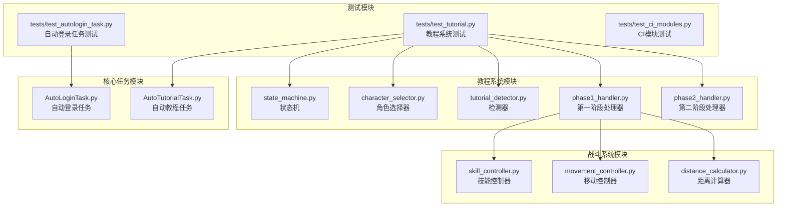
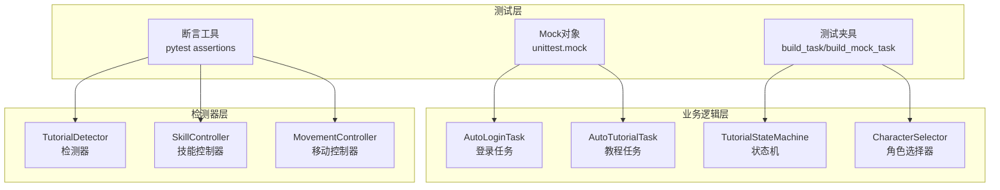
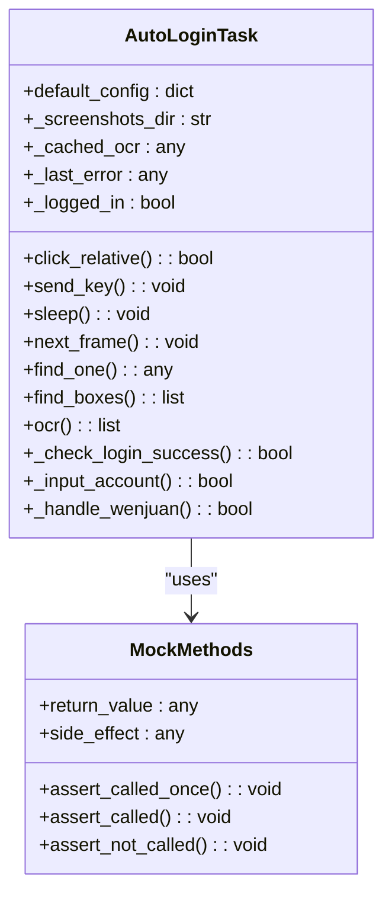
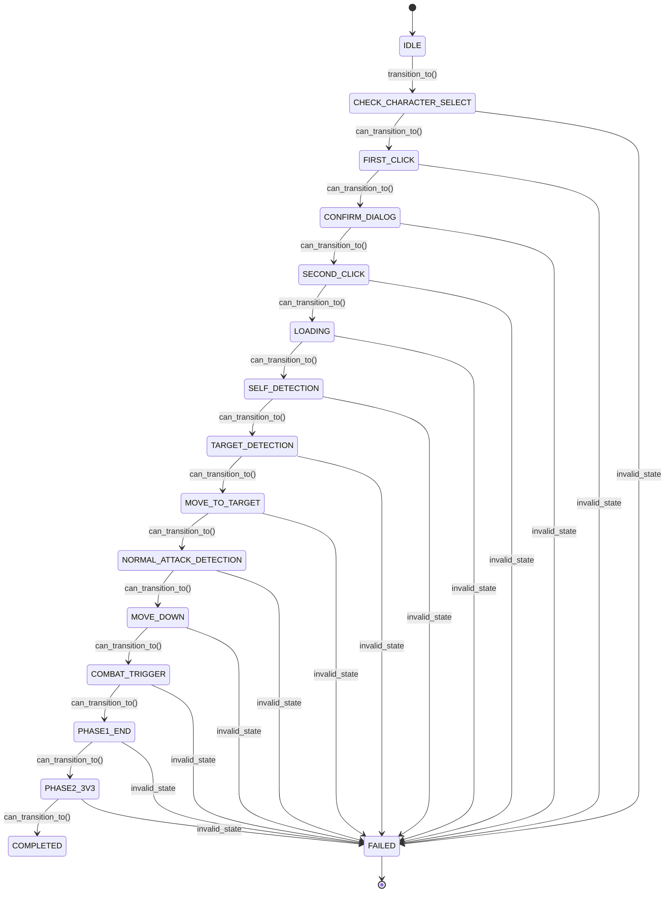
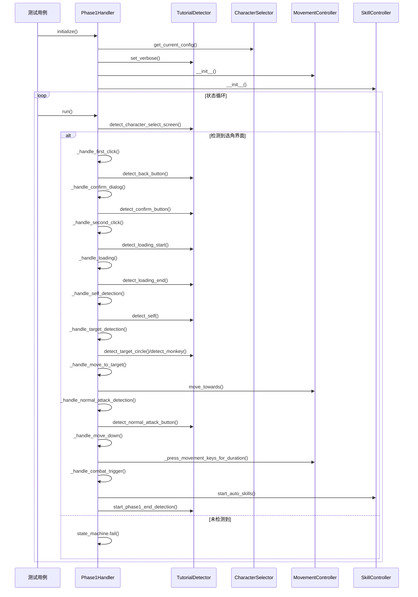
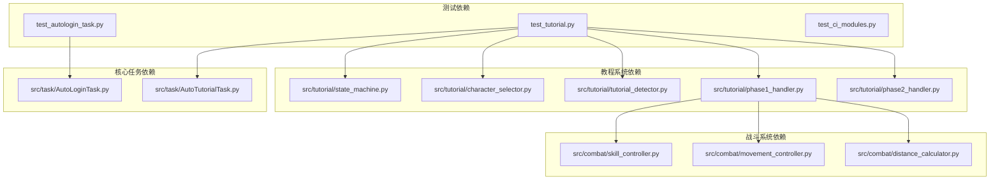

# 单元测试

<cite>
**本文档引用的文件**
- [tests/test_autologin_task.py](file://tests/test_autologin_task.py)
- [tests/test_tutorial.py](file://tests/test_tutorial.py)
- [tests/test_ci_modules.py](file://tests/test_ci_modules.py)
- [src/task/AutoLoginTask.py](file://src/task/AutoLoginTask.py)
- [src/task/AutoTutorialTask.py](file://src/task/AutoTutorialTask.py)
- [src/tutorial/state_machine.py](file://src/tutorial/state_machine.py)
- [src/tutorial/character_selector.py](file://src/tutorial/character_selector.py)
- [src/tutorial/tutorial_detector.py](file://src/tutorial/tutorial_detector.py)
- [src/tutorial/phase1_handler.py](file://src/tutorial/phase1_handler.py)
- [src/tutorial/phase2_handler.py](file://src/tutorial/phase2_handler.py)
- [src/combat/skill_controller.py](file://src/combat/skill_controller.py)
- [src/combat/movement_controller.py](file://src/combat/movement_controller.py)
- [src/combat/distance_calculator.py](file://src/combat/distance_calculator.py)
</cite>

## 目录
1. [简介](#简介)
2. [项目结构](#项目结构)
3. [核心组件](#核心组件)
4. [架构概览](#架构概览)
5. [详细组件分析](#详细组件分析)
6. [依赖分析](#依赖分析)
7. [性能考虑](#性能考虑)
8. [故障排除指南](#故障排除指南)
9. [结论](#结论)

## 简介

ok-jump 项目的单元测试模块旨在确保自动登录任务和新手教程系统的稳定性和可靠性。本文档深入介绍了单元测试的设计原理和实现方法，重点涵盖自动登录任务测试和教程系统测试的具体实现。

单元测试模块采用pytest框架，结合unittest.mock进行对象模拟，实现了对复杂业务逻辑的全面测试覆盖。测试设计遵循以下原则：

- **隔离性**：通过Mock对象隔离外部依赖
- **可重复性**：测试环境标准化，确保结果一致性
- **完整性**：覆盖正常流程、异常处理和边界条件
- **可维护性**：清晰的测试结构和命名规范

## 项目结构

项目采用模块化的测试架构，主要包含以下测试文件：

**图表来源**
- [tests/test_autologin_task.py:1-407](file://tests/test_autologin_task.py#L1-L407)
- [tests/test_tutorial.py:1-800](file://tests/test_tutorial.py#L1-L800)
- [tests/test_ci_modules.py:1-469](file://tests/test_ci_modules.py#L1-L469)

**章节来源**
- [tests/test_autologin_task.py:1-407](file://tests/test_autologin_task.py#L1-L407)
- [tests/test_tutorial.py:1-800](file://tests/test_tutorial.py#L1-L800)
- [tests/test_ci_modules.py:1-469](file://tests/test_ci_modules.py#L1-L469)

## 核心组件

### 自动登录任务测试

自动登录任务测试涵盖了完整的登录流程，包括问卷调查处理、账号输入验证、界面状态检测等功能。

**主要测试类别**：
- **问卷调查处理**：测试问卷界面检测和交互逻辑
- **登录界面处理**：测试三个主要登录界面的处理逻辑
- **账号输入验证**：测试账号输入的准确性和重试机制
- **登录状态检测**：测试登录成功后的状态验证

### 教程系统测试

教程系统测试分为多个层次，从基础组件到完整流程的全面覆盖。

**测试层次**：
- **状态机测试**：验证状态转换逻辑的正确性
- **角色选择器测试**：测试角色配置和点击区域计算
- **检测器测试**：验证各种检测方法的准确性
- **处理器测试**：测试各阶段处理器的完整流程
- **集成测试**：验证组件间的协作和整体流程

**章节来源**
- [tests/test_autologin_task.py:9-407](file://tests/test_autologin_task.py#L9-L407)
- [tests/test_tutorial.py:23-800](file://tests/test_tutorial.py#L23-L800)

## 架构概览

单元测试架构采用分层设计，确保测试的独立性和可维护性：

**图表来源**
- [src/task/AutoLoginTask.py:21-800](file://src/task/AutoLoginTask.py#L21-L800)
- [src/task/AutoTutorialTask.py:28-349](file://src/task/AutoTutorialTask.py#L28-L349)
- [src/tutorial/state_machine.py:56-209](file://src/tutorial/state_machine.py#L56-L209)

## 详细组件分析

### 自动登录任务测试分析

#### Mock对象设计策略

自动登录任务测试采用了精心设计的Mock对象策略：

**图表来源**
- [tests/test_autologin_task.py:9-48](file://tests/test_autologin_task.py#L9-L48)
- [src/task/AutoLoginTask.py:21-106](file://src/task/AutoLoginTask.py#L21-L106)

#### 测试用例编写规范

自动登录任务测试遵循严格的编写规范：

**测试命名规范**：
- 使用 `test_` 前缀标识测试方法
- 描述性命名，清晰表达测试意图
- 按功能模块分组组织测试类

**Mock配置策略**：
- 使用 `MagicMock()` 创建模拟对象
- 通过 `return_value` 设置返回值
- 使用 `side_effect` 模拟异常情况
- 通过 `assert_called_*` 验证调用行为

**断言方法选择**：
- 使用 `assert result is True/False` 验证布尔结果
- 使用 `assert_called_once()` 验证单次调用
- 使用 `assert_not_called()` 验证未调用
- 使用 `assert_called_with()` 验证参数传递

**章节来源**
- [tests/test_autologin_task.py:56-407](file://tests/test_autologin_task.py#L56-L407)

### 教程系统测试分析

#### 状态机测试设计

教程系统状态机测试验证了完整的状态转换逻辑：

**图表来源**
- [src/tutorial/state_machine.py:56-162](file://src/tutorial/state_machine.py#L56-L162)

#### 角色选择器测试策略

角色选择器测试涵盖了多种角色配置和模式：

**测试覆盖要点**：
- 默认角色配置验证
- 角色类型解析测试
- 点击区域计算验证
- 全模式角色顺序测试
- 配置参数验证

**章节来源**
- [tests/test_tutorial.py:177-291](file://tests/test_tutorial.py#L177-L291)

#### 检测器测试实现

检测器测试验证了多种检测方法的准确性：

**检测方法测试**：
- 模板匹配检测验证
- OCR文字识别测试
- YOLO模型检测测试
- 加载界面状态检测
- 按钮位置计算验证

**异步检测测试**：
- 第一阶段结束检测线程测试
- 检测超时机制验证
- 线程安全性和并发测试

**章节来源**
- [tests/test_tutorial.py:370-526](file://tests/test_tutorial.py#L370-L526)

### 处理器测试分析

#### 第一阶段处理器测试

第一阶段处理器测试验证了完整的教程流程：

**图表来源**
- [src/tutorial/phase1_handler.py:108-189](file://src/tutorial/phase1_handler.py#L108-L189)
- [src/tutorial/phase1_handler.py:642-800](file://src/tutorial/phase1_handler.py#L642-L800)

**章节来源**
- [tests/test_tutorial.py:527-764](file://tests/test_tutorial.py#L527-L764)

## 依赖分析

### 测试依赖关系

单元测试模块的依赖关系呈现清晰的层次结构：

**图表来源**
- [tests/test_autologin_task.py:1-407](file://tests/test_autologin_task.py#L1-L407)
- [tests/test_tutorial.py:1-800](file://tests/test_tutorial.py#L1-L800)
- [tests/test_ci_modules.py:1-469](file://tests/test_ci_modules.py#L1-L469)

### Mock对象依赖管理

测试中的Mock对象管理遵循以下原则：

**Mock对象生命周期**：
- 测试开始前创建和配置
- 测试执行期间使用和验证
- 测试结束后清理和重置

**依赖注入策略**：
- 使用工厂函数创建测试夹具
- 通过构造函数注入Mock对象
- 避免全局状态污染

**章节来源**
- [tests/test_autologin_task.py:9-48](file://tests/test_autologin_task.py#L9-L48)
- [tests/test_tutorial.py:25-59](file://tests/test_tutorial.py#L25-L59)

## 性能考虑

### 测试性能优化

单元测试在设计时充分考虑了性能因素：

**异步操作测试优化**：
- 使用线程池管理异步检测
- 实现超时机制避免无限等待
- 采用轮询策略平衡响应性和性能

**内存使用优化**：
- 及时清理Mock对象引用
- 控制测试数据规模
- 使用生成器减少内存占用

**执行效率提升**：
- 并行测试执行（pytest-xdist）
- 缓存测试结果
- 优化断言验证逻辑

### 性能监控和调试

**性能指标监控**：
- 测试执行时间统计
- 内存使用情况跟踪
- 线程活跃度监控

**调试工具支持**：
- 详细的日志输出
- 断点调试支持
- 性能分析工具集成

## 故障排除指南

### 常见测试问题及解决方案

**Mock对象配置问题**：
- 确保Mock对象的return_value正确设置
- 验证side_effect的异常类型
- 检查assert_called系列断言的使用时机

**异步测试失败**：
- 增加适当的等待时间
- 使用事件机制协调异步操作
- 验证线程安全性

**依赖注入问题**：
- 确保测试夹具正确初始化
- 验证Mock对象的生命周期
- 检查测试间的相互影响

### 调试技巧和最佳实践

**调试策略**：
- 使用pytest的-v和-s选项获取详细输出
- 利用pdb进行交互式调试
- 实施分层测试定位问题

**测试维护**：
- 定期重构测试代码
- 更新过时的测试用例
- 维护测试数据的时效性

**章节来源**
- [tests/test_autologin_task.py:378-407](file://tests/test_autologin_task.py#L378-L407)
- [tests/test_tutorial.py:765-800](file://tests/test_tutorial.py#L765-L800)

## 结论

ok-jump项目的单元测试模块展现了现代软件测试的最佳实践。通过精心设计的Mock对象策略、全面的功能覆盖和严格的测试规范，确保了系统的稳定性和可靠性。

**主要成就**：
- 完整的业务流程测试覆盖
- 高质量的Mock对象设计
- 清晰的测试架构和组织
- 有效的异步操作测试策略

**未来改进方向**：
- 增加更多的边界条件测试
- 优化测试执行性能
- 扩展测试覆盖率指标
- 完善测试数据管理机制

通过持续的测试改进和维护，ok-jump项目的单元测试模块将继续为项目的质量和稳定性提供坚实保障。