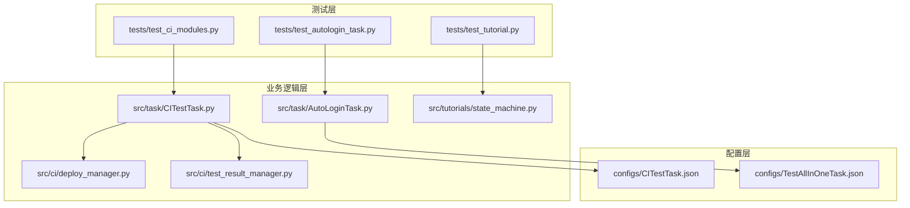
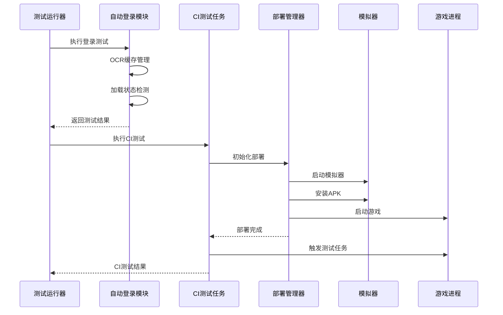
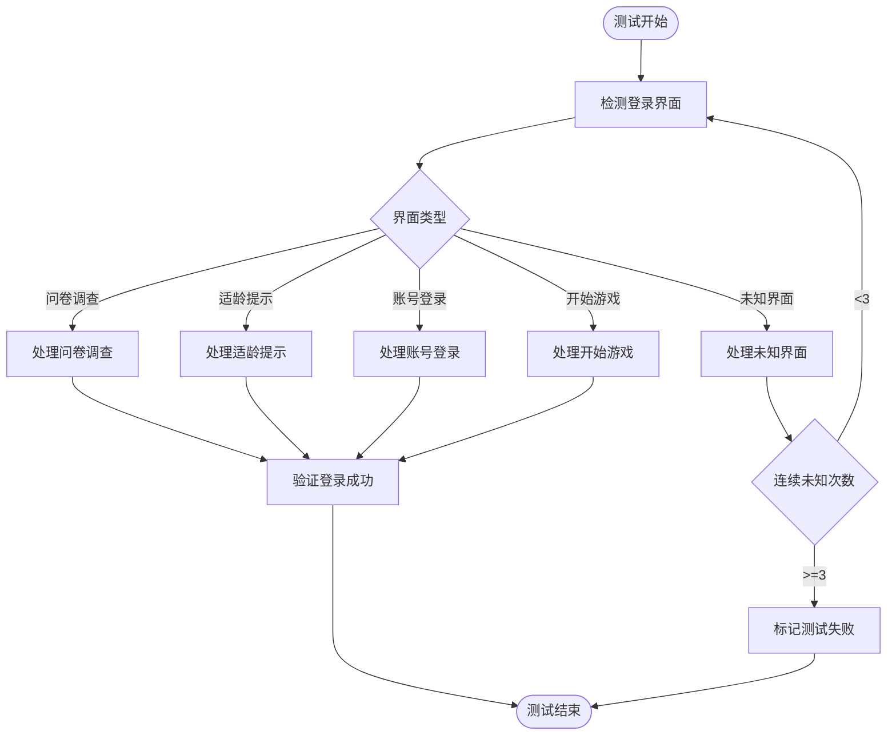
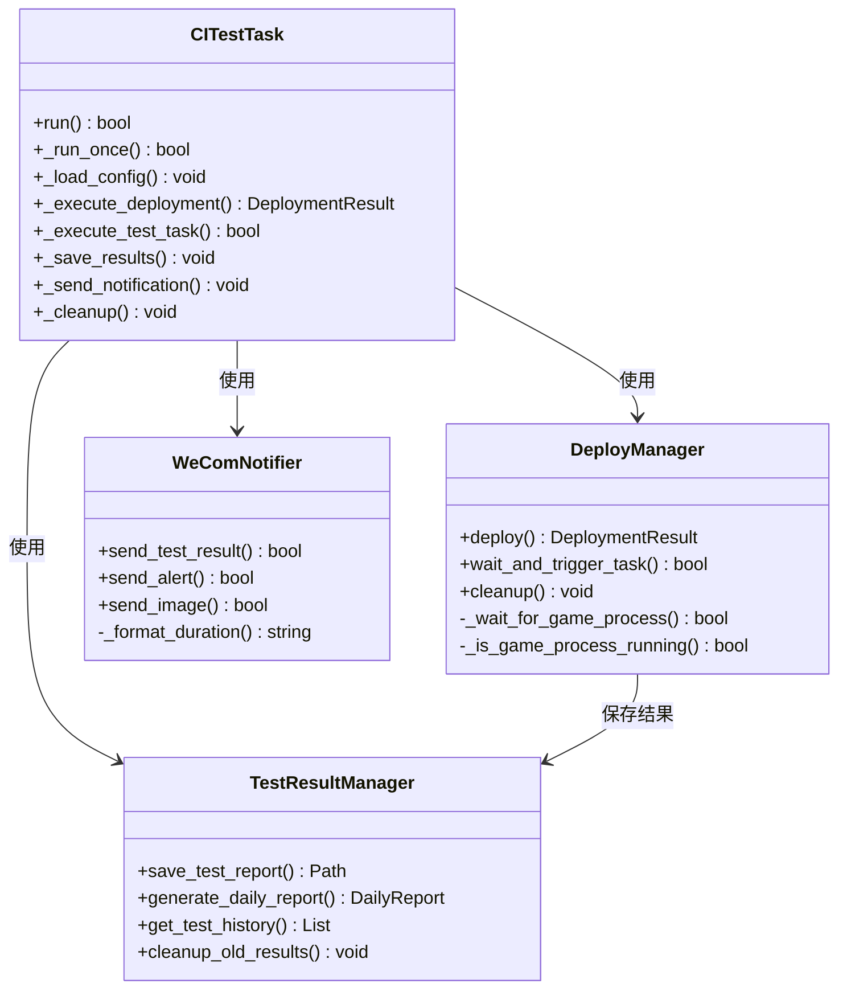
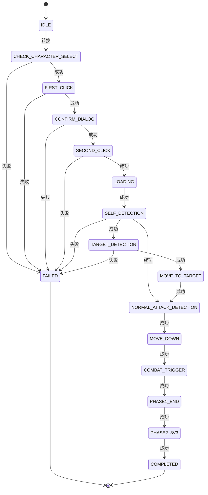
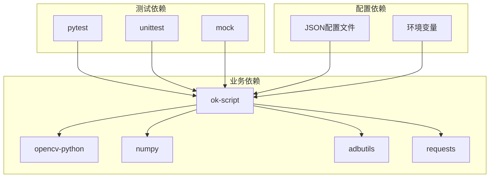

# 测试策略

<cite>
**本文档引用的文件**
- [tests/test_autologin_task.py](file://tests/test_autologin_task.py)
- [tests/test_ci_modules.py](file://tests/test_ci_modules.py)
- [tests/test_tutorial.py](file://tests/test_tutorial.py)
- [src/task/AutoLoginTask.py](file://src/task/AutoLoginTask.py)
- [src/task/CITestTask.py](file://src/task/CITestTask.py)
- [src/tutorials/state_machine.py](file://src/tutorials/state_machine.py)
- [src/ci/deploy_manager.py](file://src/ci/deploy_manager.py)
- [src/ci/test_result_manager.py](file://src/ci/test_result_manager.py)
- [configs/CITestTask.json](file://configs/CITestTask.json)
- [configs/TestAllInOneTask.json](file://configs/TestAllInOneTask.json)
- [requirements.txt](file://requirements.txt)
- [README.md](file://README.md)
- [pyappify.yml](file://pyappify.yml)
</cite>

## 目录
1. [简介](#简介)
2. [项目结构](#项目结构)
3. [核心组件](#核心组件)
4. [架构概览](#架构概览)
5. [详细组件分析](#详细组件分析)
6. [依赖分析](#依赖分析)
7. [性能考虑](#性能考虑)
8. [故障排除指南](#故障排除指南)
9. [结论](#结论)
10. [附录](#附录)

## 简介
本测试策略文档面向 ok-jump 项目的自动化测试体系，涵盖单元测试、集成测试和端到端测试的完整方案。项目采用 Python + ok-script 框架，结合 Jenkins CI/CD 实现自动化部署与测试。测试覆盖自动登录、CI 模块、新手教程等核心功能模块，确保在模拟器环境下稳定运行。

## 项目结构
项目采用模块化组织，测试文件位于 tests 目录，核心业务逻辑分布在 src 目录下的 task、ci、tutorial、combat 等子模块。配置文件集中于 configs 目录，便于测试环境隔离和参数化配置。

**图表来源**
- [tests/test_autologin_task.py:1-407](file://tests/test_autologin_task.py#L1-L407)
- [src/task/CITestTask.py:1-800](file://src/task/CITestTask.py#L1-L800)
- [src/ci/deploy_manager.py:1-428](file://src/ci/deploy_manager.py#L1-L428)

**章节来源**
- [README.md:1-8](file://README.md#L1-L8)
- [requirements.txt:1-17](file://requirements.txt#L1-L17)

## 核心组件
项目测试体系围绕三大核心组件构建：

### 自动登录测试模块
- **功能范围**：覆盖登录界面识别、问卷调查处理、账号输入验证、加载状态检测
- **测试策略**：基于状态机的多场景测试，包括正常流程、异常处理、超时控制
- **关键特性**：OCR 缓存管理、加载停滞检测、状态容错机制

### CI 模块测试
- **功能范围**：Jenkins 集成、模拟器管理、包下载、测试结果管理
- **测试策略**：模块化单元测试 + 集成测试，验证异常处理和配置加载
- **关键特性**：数据类验证、异常继承层次、通知机制测试

### 新手教程测试
- **功能范围**：状态机转换、角色选择、检测器功能、处理器逻辑
- **测试策略**：状态机完整性测试 + 组件协作测试
- **关键特性**：多角色配置、并行检测、状态历史追踪

**章节来源**
- [tests/test_autologin_task.py:1-407](file://tests/test_autologin_task.py#L1-L407)
- [tests/test_ci_modules.py:1-469](file://tests/test_ci_modules.py#L1-L469)
- [tests/test_tutorial.py:1-800](file://tests/test_tutorial.py#L1-L800)

## 架构概览
测试架构采用分层设计，从底层单元测试到端到端集成测试形成完整的质量保证体系。

**图表来源**
- [src/task/CITestTask.py:146-273](file://src/task/CITestTask.py#L146-L273)
- [src/ci/deploy_manager.py:123-246](file://src/ci/deploy_manager.py#L123-L246)

## 详细组件分析

### 自动登录测试策略
自动登录测试采用行为驱动的测试方法，重点验证复杂交互场景和边界条件。

#### 测试设计原则
- **状态驱动**：基于登录界面状态机的测试用例设计
- **异常覆盖**：涵盖网络异常、界面异常、输入异常等场景
- **性能考量**：超时控制和重试机制的验证
- **稳定性保障**：OCR 缓存管理和加载状态检测

#### 关键测试场景

**图表来源**
- [src/task/AutoLoginTask.py:552-752](file://src/task/AutoLoginTask.py#L552-L752)

#### 测试用例覆盖范围
- **界面识别**：支持多种登录界面的准确识别
- **交互流程**：完整的登录流程自动化
- **异常处理**：超时、网络中断、界面异常等情况
- **性能监控**：加载状态检测和停滞处理

**章节来源**
- [tests/test_autologin_task.py:56-407](file://tests/test_autologin_task.py#L56-L407)
- [src/task/AutoLoginTask.py:21-800](file://src/task/AutoLoginTask.py#L21-L800)

### CI 模块测试策略
CI 模块测试采用分层测试方法，确保整个 CI 流程的可靠性。

#### 模块化测试架构

**图表来源**
- [src/task/CITestTask.py:26-847](file://src/task/CITestTask.py#L26-L847)
- [src/ci/deploy_manager.py:38-428](file://src/ci/deploy_manager.py#L38-L428)
- [src/ci/test_result_manager.py:73-327](file://src/ci/test_result_manager.py#L73-L327)

#### CI 流程测试
CI 测试流程包含以下关键环节：
- **配置加载**：从 JSON 文件和运行时配置加载
- **部署执行**：APK 下载、模拟器启动、游戏安装
- **任务触发**：等待游戏进程启动后触发测试任务
- **结果收集**：保存测试报告和统计数据
- **通知发送**：通过企业微信发送测试结果

**章节来源**
- [tests/test_ci_modules.py:373-469](file://tests/test_ci_modules.py#L373-L469)
- [src/task/CITestTask.py:146-587](file://src/task/CITestTask.py#L146-L587)

### 新手教程测试策略
新手教程测试专注于状态机的正确性和组件间的协作。

#### 状态机测试

**图表来源**
- [src/tutorials/state_machine.py:10-54](file://src/tutorials/state_machine.py#L10-L54)

#### 组件协作测试
新手教程测试验证多个组件的协同工作：
- **状态机管理**：状态转换的正确性和历史追踪
- **角色选择**：多角色配置和切换逻辑
- **检测器功能**：界面元素的准确检测
- **处理器逻辑**：各阶段处理流程的实现

**章节来源**
- [tests/test_tutorial.py:64-764](file://tests/test_tutorial.py#L64-L764)
- [src/tutorials/state_machine.py:56-209](file://src/tutorials/state_machine.py#L56-L209)

## 依赖分析
测试依赖关系清晰，主要依赖于 ok-script 框架和相关 Python 库。

**图表来源**
- [requirements.txt:1-17](file://requirements.txt#L1-L17)
- [pyappify.yml:1-18](file://pyappify.yml#L1-L18)

**章节来源**
- [requirements.txt:1-17](file://requirements.txt#L1-L17)
- [pyappify.yml:1-18](file://pyappify.yml#L1-L18)

## 性能考虑
测试性能优化策略包括：

### 测试执行优化
- **并行测试**：利用 pytest 的并发执行能力
- **缓存机制**：OCR 结果缓存减少重复计算
- **超时控制**：合理的超时配置避免长时间阻塞
- **资源管理**：及时释放模拟器和内存资源

### 性能监控指标
- **测试执行时间**：单个测试用例的执行时长
- **模拟器响应时间**：界面元素检测的响应速度
- **内存使用情况**：长时间运行的内存占用
- **CPU 使用率**：OCR 和图像处理的 CPU 占用

## 故障排除指南

### 常见问题及解决方案

#### 登录测试失败
- **症状**：登录界面识别失败
- **原因**：OCR 模型不匹配或界面分辨率差异
- **解决**：调整 OCR 阈值和模板匹配参数

#### CI 部署失败
- **症状**：模拟器启动或游戏安装失败
- **原因**：ADB 连接问题或权限不足
- **解决**：检查模拟器配置和系统权限

#### 测试结果异常
- **症状**：测试报告格式错误或数据丢失
- **原因**：文件权限或磁盘空间不足
- **解决**：检查测试结果目录权限和磁盘空间

### 调试技巧
- **日志分析**：查看详细的执行日志定位问题
- **截图验证**：通过截图确认界面状态
- **环境隔离**：使用独立的测试环境避免干扰
- **逐步调试**：从简单场景开始逐步复杂化

**章节来源**
- [src/task/CITestTask.py:574-587](file://src/task/CITestTask.py#L574-L587)
- [src/task/AutoLoginTask.py:542-550](file://src/task/AutoLoginTask.py#L542-L550)

## 结论
ok-jump 项目的测试策略建立了完善的自动化测试体系，涵盖了从单元测试到端到端测试的全链路质量保证。通过模块化的测试设计、严格的测试用例覆盖和完善的故障排除机制，确保了系统的稳定性和可靠性。建议持续优化测试覆盖率，加强性能监控，并建立更完善的测试报告体系。

## 附录

### 测试环境配置
- **Python 版本**：3.12+
- **依赖库**：requirements.txt 中列出的所有依赖
- **模拟器**：雷电模拟器 LDPlayer 9
- **配置文件**：CITestTask.json 和 TestAllInOneTask.json

### 测试执行指南
- **单元测试**：`pytest tests/test_autologin_task.py`
- **集成测试**：`python -m pytest tests/test_ci_modules.py`
- **端到端测试**：`pytest tests/test_tutorial.py`

### 最佳实践建议
- **测试用例设计**：遵循 AAA 模式（Arrange-Act-Assert）
- **数据驱动测试**：使用参数化测试提高覆盖率
- **持续集成**：在 CI 环境中自动执行测试
- **测试维护**：定期更新测试用例以适应代码变更