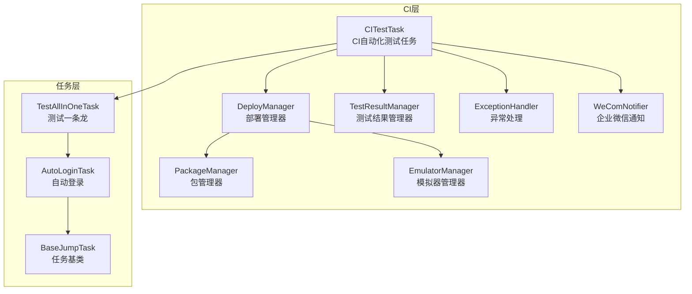
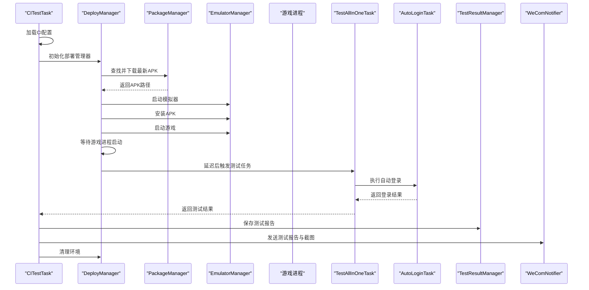
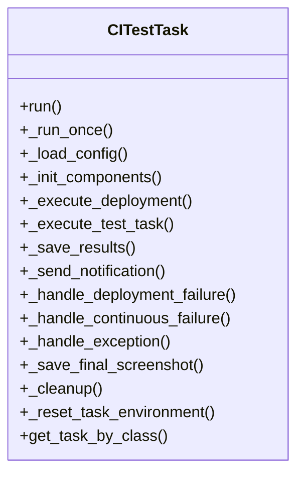
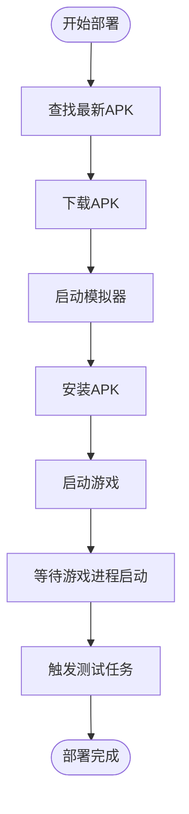
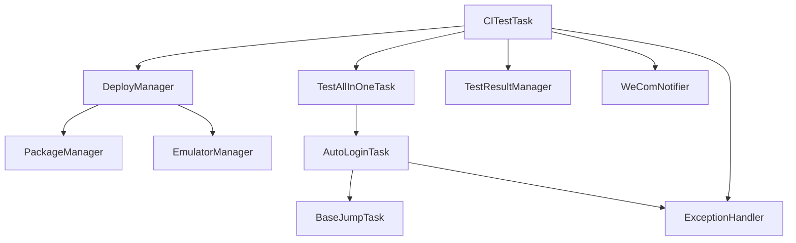

# 测试自动化

<cite>
**本文档引用的文件**
- [src\task\CITestTask.py](file://src/task/CITestTask.py)
- [src\task\TestAllInOneTask.py](file://src/task/TestAllInOneTask.py)
- [src\task\AutoLoginTask.py](file://src/task/AutoLoginTask.py)
- [src\task\BaseJumpTask.py](file://src/task/BaseJumpTask.py)
- [src\ci\deploy_manager.py](file://src/ci/deploy_manager.py)
- [src\ci\emulator_manager.py](file://src/ci/emulator_manager.py)
- [src\ci\package_manager.py](file://src/ci/package_manager.py)
- [src\ci\test_result_manager.py](file://src/ci/test_result_manager.py)
- [src\ci\exception_handler.py](file://src/ci/exception_handler.py)
- [src\ci\notifier\wecom_notifier.py](file://src/ci/notifier/wecom_notifier.py)
- [src\ci\exceptions.py](file://src/ci/exceptions.py)
- [configs\CITestTask.json](file://configs/CITestTask.json)
- [tests\test_autologin_task.py](file://tests/test_autologin_task.py)
- [tests\test_ci_modules.py](file://tests/test_ci_modules.py)
- [tests\test_tutorial.py](file://tests/test_tutorial.py)
- [test_input.py](file://test_input.py)
- [requirements.txt](file://requirements.txt)
</cite>

## 目录
1. [简介](#简介)
2. [项目结构](#项目结构)
3. [核心组件](#核心组件)
4. [架构概览](#架构概览)
5. [详细组件分析](#详细组件分析)
6. [依赖关系分析](#依赖关系分析)
7. [性能考虑](#性能考虑)
8. [故障排查指南](#故障排查指南)
9. [结论](#结论)
10. [附录](#附录)

## 简介
本文件面向 ok-jump 项目的测试自动化模块，系统性阐述其设计原理、工作机制与实现细节。内容涵盖：
- 自动化测试流水线：从 Jenkins 下载 APK、启动模拟器、安装游戏、触发测试任务、结果收集与通知。
- 输入测试与界面交互测试：基于 OCR/模板匹配的界面识别、点击与键盘输入、动态界面元素处理。
- 自动化测试脚本：TestAllInOneTask 的多任务编排与任务间过渡。
- 配置方法、执行流程与结果收集：CI 配置文件、重试机制、截图与报告生成。
- 稳定性保障与性能监控：异常处理、连续失败检测、游戏画面停滞检测、通知与日志。

## 项目结构
测试自动化模块围绕 CI 任务 CITestTask 展开，通过 DeployManager 统一调度包下载、模拟器管理与游戏启动，并在游戏进程稳定后触发 TestAllInOneTask 执行多任务编排。异常处理模块提供智能恢复与连续失败检测，通知模块负责将测试结果与截图推送到企业微信。

**图表来源**
- [src\task\CITestTask.py:26-847](file://src/task/CITestTask.py#L26-L847)
- [src\task\TestAllInOneTask.py:11-142](file://src/task/TestAllInOneTask.py#L11-L142)
- [src\task\AutoLoginTask.py:21-752](file://src/task/AutoLoginTask.py#L21-L752)
- [src\task\BaseJumpTask.py:26-572](file://src/task/BaseJumpTask.py#L26-L572)
- [src\ci\deploy_manager.py:38-427](file://src/ci/deploy_manager.py#L38-L427)
- [src\ci\package_manager.py:37-379](file://src/ci/package_manager.py#L37-L379)
- [src\ci\emulator_manager.py:39-456](file://src/ci/emulator_manager.py#L39-L456)
- [src\ci\test_result_manager.py:73-326](file://src/ci/test_result_manager.py#L73-L326)
- [src\ci\exception_handler.py:165-328](file://src/ci/exception_handler.py#L165-L328)
- [src\ci\notifier\wecom_notifier.py:21-287](file://src/ci/notifier/wecom_notifier.py#L21-L287)

**章节来源**
- [src\task\CITestTask.py:26-847](file://src/task/CITestTask.py#L26-L847)
- [src\ci\deploy_manager.py:38-427](file://src/ci/deploy_manager.py#L38-L427)

## 核心组件
- CITestTask：CI 自动化测试任务，负责完整的部署、触发、结果保存、通知与清理流程，内置失败自动重试与环境隔离。
- DeployManager：统一调度包下载、模拟器启动、APK 安装、游戏启动与任务触发，提供超时控制与进程存活检测。
- PackageManager：从 Jenkins 获取最新构建并下载 APK，解析版本信息，避免重复下载。
- EmulatorManager：启动/关闭模拟器、安装/卸载游戏、启动游戏、检测设备状态与进程存活。
- TestAllInOneTask：多任务编排，按配置顺序执行自动登录、新手教程、匹配、战斗、日常任务，并处理任务间过渡。
- AutoLoginTask：自动登录流程，处理登录界面、问卷调查、账号输入、加载界面检测与状态容错。
- TestResultManager：测试结果持久化、每日报告生成、历史记录查询与清理。
- ExceptionHandler：统一异常捕获、截图保存、错误摘要、连续失败检测与游戏画面停滞检测。
- WeComNotifier：企业微信通知，支持 Markdown、图片与测试报告推送。

**章节来源**
- [src\task\CITestTask.py:26-847](file://src/task/CITestTask.py#L26-L847)
- [src\task\TestAllInOneTask.py:11-142](file://src/task/TestAllInOneTask.py#L11-L142)
- [src\task\AutoLoginTask.py:21-752](file://src/task/AutoLoginTask.py#L21-L752)
- [src\ci\deploy_manager.py:38-427](file://src/ci/deploy_manager.py#L38-L427)
- [src\ci\package_manager.py:37-379](file://src/ci/package_manager.py#L37-L379)
- [src\ci\emulator_manager.py:39-456](file://src/ci/emulator_manager.py#L39-L456)
- [src\ci\test_result_manager.py:73-326](file://src/ci/test_result_manager.py#L73-L326)
- [src\ci\exception_handler.py:165-328](file://src/ci/exception_handler.py#L165-L328)
- [src\ci\notifier\wecom_notifier.py:21-287](file://src/ci/notifier/wecom_notifier.py#L21-L287)

## 架构概览
CI 自动化测试的整体流程如下：

**图表来源**
- [src\task\CITestTask.py:146-272](file://src/task/CITestTask.py#L146-L272)
- [src\ci\deploy_manager.py:123-307](file://src/ci/deploy_manager.py#L123-L307)
- [src\task\TestAllInOneTask.py:53-142](file://src/task/TestAllInOneTask.py#L53-L142)
- [src\task\AutoLoginTask.py:227-752](file://src/task/AutoLoginTask.py#L227-L752)
- [src\ci\test_result_manager.py:102-153](file://src/ci/test_result_manager.py#L102-L153)
- [src\ci\notifier\wecom_notifier.py:87-134](file://src/ci/notifier/wecom_notifier.py#L87-L134)

## 详细组件分析

### CITestTask：CI 自动化测试任务
- 职责：整合部署、测试、通知与清理，支持失败自动重试与环境隔离。
- 关键流程：
  - 配置加载：优先读取配置文件，再回退到框架缓存与默认值。
  - 组件初始化：部署管理器、测试结果管理器、企业微信通知器。
  - 部署执行：下载 APK、启动模拟器、安装 APK、启动游戏并等待进程。
  - 任务触发：等待指定延迟后触发 TestAllInOneTask。
  - 结果保存：生成测试报告并保存至文件系统。
  - 通知发送：推送测试报告与最终截图。
  - 环境清理：暂停截图循环、关闭模拟器、清理旧包。
- 重试机制：支持配置重试次数与间隔，重试前递增账号并恢复截图循环。
- 环境隔离：重置设备连接状态、AutoCombatTask 类变量状态与内部状态，确保多次执行的隔离性。

**图表来源**
- [src\task\CITestTask.py:26-847](file://src/task/CITestTask.py#L26-L847)

**章节来源**
- [src\task\CITestTask.py:146-847](file://src/task/CITestTask.py#L146-L847)
- [configs\CITestTask.json:1-29](file://configs/CITestTask.json#L1-L29)

### DeployManager：部署管理器
- 职责：协调包下载、模拟器管理与游戏启动，提供超时控制与进程存活检测。
- 关键流程：
  - 包下载：查找最新构建、解析版本信息、下载 APK。
  - 模拟器管理：启动模拟器、安装 APK、启动游戏、等待进程。
  - 任务触发：等待指定延迟后触发回调任务，期间持续检测进程存活。
- 超时与异常：游戏启动超时、任务触发超时、进程意外退出等异常处理。

**图表来源**
- [src\ci\deploy_manager.py:123-307](file://src/ci/deploy_manager.py#L123-L307)

**章节来源**
- [src\ci\deploy_manager.py:38-427](file://src/ci/deploy_manager.py#L38-L427)

### PackageManager：包管理器
- 职责：从 Jenkins 获取构建列表，定位 Build 文件夹下的 APK，解析版本信息，避免重复下载。
- 关键能力：
  - Jenkins API 调用：获取构建列表与产物。
  - 文件名解析：从 APK 文件名提取版本号、构建号、SVN 版本号、版本码与日期。
  - 下载与清理：流式下载、断点续传、保留最近 N 个版本。

**章节来源**
- [src\ci\package_manager.py:37-379](file://src/ci/package_manager.py#L37-L379)

### EmulatorManager：模拟器管理器
- 职责：启动/关闭模拟器、安装/卸载游戏、启动游戏、检测设备状态与进程存活。
- 关键能力：
  - 启动模拟器：支持 ldconsole 与直接启动两种方式，等待稳定后刷新 ok 框架设备连接。
  - ADB 设备检测：支持多种序列号格式与连接方式。
  - 游戏进程检测：使用 pidof 与 ps 命令检测进程是否存在。

**章节来源**
- [src\ci\emulator_manager.py:39-456](file://src/ci/emulator_manager.py#L39-L456)

### TestAllInOneTask：测试一条龙
- 职责：按配置顺序执行多个任务（自动登录、新手教程、匹配、战斗、日常任务），处理任务间过渡与界面验证。
- 关键流程：
  - 任务编排：根据配置启用相应任务，按顺序执行。
  - 过渡处理：在任务切换时等待界面稳定并验证目标界面。
  - 错误处理：任一任务失败即停止后续任务，并记录详细错误信息。

**章节来源**
- [src\task\TestAllInOneTask.py:11-142](file://src/task/TestAllInOneTask.py#L11-L142)

### AutoLoginTask：自动登录
- 职责：自动启动游戏并完成登录流程，包括处理登录界面、问卷调查、账号输入、加载界面检测与状态容错。
- 关键能力：
  - 界面识别：模板匹配与 OCR 双通道识别登录界面。
  - 账号输入：支持 GUI 配置与 CI 传递的账号，带输入校验与重试。
  - 加载检测：检测右下角加载百分比，防止停滞超时。
  - 状态容错：在判定失败后的一段时间内再次确认成功状态。

**章节来源**
- [src\task\AutoLoginTask.py:21-752](file://src/task/AutoLoginTask.py#L21-L752)

### TestResultManager：测试结果管理器
- 职责：保存测试报告与任务结果、生成每日报告、维护历史记录、清理旧数据。
- 关键能力：
  - 报告结构：TestReport、TaskResult、DailyReport 数据类。
  - 存储策略：按日期与时间分层存储，支持 JSON 序列化。
  - 统计分析：成功率、平均耗时、失败类型统计。

**章节来源**
- [src\ci\test_result_manager.py:73-326](file://src/ci/test_result_manager.py#L73-L326)

### ExceptionHandler：异常处理
- 职责：统一捕获异常、截图保存、错误摘要、连续失败检测与游戏画面停滞检测。
- 关键能力：
  - SmartTaskExecutor：非致命错误继续执行、过滤 negative box 错误、连续失败阈值控制。
  - GameActivityDetector：基于帧哈希的活动状态检测，判断画面是否停滞。
  - FailureInfo：失败信息结构，包含截图路径、堆栈与上下文。

**章节来源**
- [src\ci\exception_handler.py:165-328](file://src/ci/exception_handler.py#L165-L328)

### WeComNotifier：企业微信通知
- 职责：发送 Markdown 消息、图片与测试报告，支持告警与每日报告推送。
- 关键能力：
  - Markdown 格式：支持标题、列表与格式化文本。
  - 图片发送：Base64 编码与 MD5 校验。
  - 重试机制：网络异常时自动重试。

**章节来源**
- [src\ci\notifier\wecom_notifier.py:21-287](file://src/ci/notifier/wecom_notifier.py#L21-L287)

## 依赖关系分析
测试自动化模块的依赖关系如下：

**图表来源**
- [src\task\CITestTask.py:26-847](file://src/task/CITestTask.py#L26-L847)
- [src\task\TestAllInOneTask.py:11-142](file://src/task/TestAllInOneTask.py#L11-L142)
- [src\task\AutoLoginTask.py:21-752](file://src/task/AutoLoginTask.py#L21-L752)
- [src\task\BaseJumpTask.py:26-572](file://src/task/BaseJumpTask.py#L26-L572)
- [src\ci\deploy_manager.py:38-427](file://src/ci/deploy_manager.py#L38-L427)
- [src\ci\package_manager.py:37-379](file://src/ci/package_manager.py#L37-L379)
- [src\ci\emulator_manager.py:39-456](file://src/ci/emulator_manager.py#L39-L456)
- [src\ci\test_result_manager.py:73-326](file://src/ci/test_result_manager.py#L73-L326)
- [src\ci\exception_handler.py:165-328](file://src/ci/exception_handler.py#L165-L328)
- [src\ci\notifier\wecom_notifier.py:21-287](file://src/ci/notifier/wecom_notifier.py#L21-L287)

**章节来源**
- [src\task\CITestTask.py:26-847](file://src/task/CITestTask.py#L26-L847)
- [src\ci\deploy_manager.py:38-427](file://src/ci/deploy_manager.py#L38-L427)

## 性能考虑
- 截图与 OCR：频繁截图与 OCR 会带来 CPU/GPU 压力，建议：
  - 合理设置等待时间与检测频率，避免过度轮询。
  - 使用 OCR 缓存与区域裁剪，减少不必要的识别。
- 模拟器与网络：APK 下载与模拟器启动是性能瓶颈，建议：
  - 预下载与缓存策略，避免重复下载。
  - 合理设置超时与重试，平衡稳定性与效率。
- 异常处理：SmartTaskExecutor 的连续失败阈值与游戏画面停滞检测可避免无效重试，提升整体吞吐。

[本节为通用指导，无需具体文件引用]

## 故障排查指南
- 模拟器启动失败：检查模拟器路径、ADB 端口与实例索引配置；查看启动日志与异常类型。
- 游戏启动超时：确认 APK 安装成功、进程存活检测正常；适当延长启动超时。
- 任务触发超时：检查游戏进程是否在等待期间意外退出；确认延迟时间合理。
- 连续失败中断：查看异常历史与错误摘要，定位高频失败类型。
- 截图与通知：确认企业微信 Webhook 配置；检查截图保存路径与权限。

**章节来源**
- [src\ci\exceptions.py:8-46](file://src/ci/exceptions.py#L8-L46)
- [src\ci\exception_handler.py:165-328](file://src/ci/exception_handler.py#L165-L328)
- [src\ci\notifier\wecom_notifier.py:237-265](file://src/ci/notifier/wecom_notifier.py#L237-L265)

## 结论
ok-jump 的测试自动化模块通过 CITestTask 将 CI 流水线、界面识别、任务编排与通知机制有机结合，形成一套可扩展、可监控、可恢复的自动化测试体系。通过合理的配置、异常处理与性能优化，能够在保证稳定性的同时提升测试效率。

[本节为总结性内容，无需具体文件引用]

## 附录

### 配置方法与执行流程
- CI 配置文件：CITestTask.json，包含 Jenkins 地址、模拟器路径、ADB 端口、Webhook、超时与重试等配置项。
- 执行流程：CITestTask.run() → DeployManager.deploy() → TestAllInOneTask.run() → TestResultManager.save_test_report() → WeComNotifier.send_test_result() → DeployManager.cleanup()。

**章节来源**
- [configs\CITestTask.json:1-29](file://configs/CITestTask.json#L1-L29)
- [src\task\CITestTask.py:146-272](file://src/task/CITestTask.py#L146-L272)
- [src\ci\deploy_manager.py:123-307](file://src/ci/deploy_manager.py#L123-L307)
- [src\task\TestAllInOneTask.py:53-142](file://src/task/TestAllInOneTask.py#L53-L142)
- [src\ci\test_result_manager.py:102-153](file://src/ci/test_result_manager.py#L102-L153)
- [src\ci\notifier\wecom_notifier.py:87-134](file://src/ci/notifier/wecom_notifier.py#L87-L134)

### 输入测试与界面交互测试
- 输入测试：test_input.py 提供 pydirectinput 的按键测试方法，建议以管理员身份运行并快速切换到游戏窗口。
- 界面交互：BaseJumpTask 提供 click、click_relative、find_text_fuzzy 等接口，支持后台模式与分辨率自适应。

**章节来源**
- [test_input.py:1-58](file://test_input.py#L1-L58)
- [src\task\BaseJumpTask.py:123-450](file://src/task/BaseJumpTask.py#L123-L450)

### 单元测试与集成测试
- AutoLoginTask 单元测试：覆盖问卷调查、登录界面处理、账号输入与校验、OCR 验证等场景。
- CI 模块单元测试：覆盖异常类、包管理、模拟器管理、测试结果管理、异常处理、通知器与部署管理等模块。
- 新手教程测试：覆盖状态机、角色选择器、检测器、处理器与主任务类的测试。

**章节来源**
- [tests\test_autologin_task.py:1-407](file://tests/test_autologin_task.py#L1-L407)
- [tests\test_ci_modules.py:1-469](file://tests/test_ci_modules.py#L1-L469)
- [tests\test_tutorial.py:1-1022](file://tests/test_tutorial.py#L1-L1022)

### 依赖库与版本要求
- 依赖清单：ok-script、requests、opencv-python、numpy、adbutils、pywin32、psutil、pydirectinput、onnxruntime、onnxruntime-directml、pyperclip、opencc、onnxocr 等。

**章节来源**
- [requirements.txt:1-17](file://requirements.txt#L1-L17)