# 集成测试

<cite>
**本文档引用的文件**
- [tests/test_ci_modules.py](file://tests/test_ci_modules.py)
- [src/ci/__init__.py](file://src/ci/__init__.py)
- [src/ci/deploy_manager.py](file://src/ci/deploy_manager.py)
- [src/ci/emulator_manager.py](file://src/ci/emulator_manager.py)
- [src/ci/package_manager.py](file://src/ci/package_manager.py)
- [src/ci/test_result_manager.py](file://src/ci/test_result_manager.py)
- [src/ci/notifier/wecom_notifier.py](file://src/ci/notifier/wecom_notifier.py)
- [src/ci/exceptions.py](file://src/ci/exceptions.py)
- [src/ci/exception_handler.py](file://src/ci/exception_handler.py)
- [src/task/CITestTask.py](file://src/task/CITestTask.py)
- [configs/CITestTask.json](file://configs/CITestTask.json)
- [requirements.txt](file://requirements.txt)
- [README.md](file://README.md)
</cite>

## 目录
1. [简介](#简介)
2. [项目结构](#项目结构)
3. [核心组件](#核心组件)
4. [架构概览](#架构概览)
5. [详细组件分析](#详细组件分析)
6. [依赖关系分析](#依赖关系分析)
7. [性能考虑](#性能考虑)
8. [故障排除指南](#故障排除指南)
9. [结论](#结论)
10. [附录](#附录)

## 简介

ok-jump 项目的集成测试模块是一个完整的 CI/CD 自动化测试系统，专门设计用于在模拟器环境中执行端到端测试。该系统集成了 Jenkins 包管理、雷电模拟器管理、测试执行、异常处理、结果管理和通知功能，为游戏应用提供了全面的自动化测试解决方案。

本集成测试模块的核心目标是：
- 自动化测试流水线执行
- 模块间通信验证
- 外部依赖集成测试
- 端到端场景验证
- 智能异常处理和恢复
- 测试结果分析和报告

## 项目结构

项目采用模块化的架构设计，主要分为以下几个核心模块：

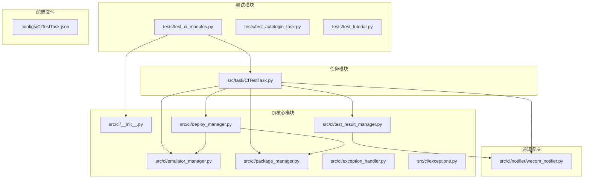

**图表来源**
- [tests/test_ci_modules.py:1-469](file://tests/test_ci_modules.py#L1-L469)
- [src/ci/__init__.py:1-64](file://src/ci/__init__.py#L1-L64)
- [src/task/CITestTask.py:1-1036](file://src/task/CITestTask.py#L1-L1036)

**章节来源**
- [tests/test_ci_modules.py:1-469](file://tests/test_ci_modules.py#L1-L469)
- [src/ci/__init__.py:1-64](file://src/ci/__init__.py#L1-L64)
- [src/task/CITestTask.py:1-1036](file://src/task/CITestTask.py#L1-L1036)

## 核心组件

### CI模块初始化

CI模块通过统一的初始化文件提供所有核心功能的访问接口：

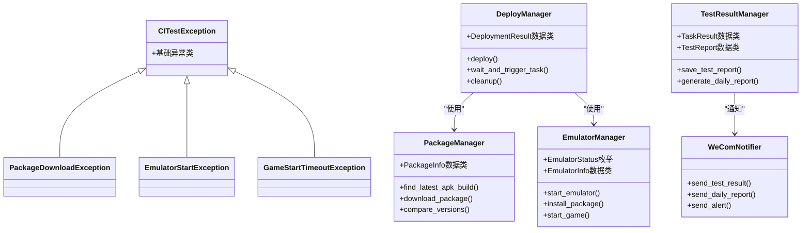

**图表来源**
- [src/ci/__init__.py:14-63](file://src/ci/__init__.py#L14-L63)
- [src/ci/package_manager.py:23-380](file://src/ci/package_manager.py#L23-L380)
- [src/ci/emulator_manager.py:22-457](file://src/ci/emulator_manager.py#L22-L457)
- [src/ci/deploy_manager.py:28-428](file://src/ci/deploy_manager.py#L28-L428)
- [src/ci/test_result_manager.py:22-327](file://src/ci/test_result_manager.py#L22-L327)
- [src/ci/notifier/wecom_notifier.py:21-288](file://src/ci/notifier/wecom_notifier.py#L21-L288)

### 测试任务执行流程

CITestTask 作为核心协调器，整合所有 CI 组件：

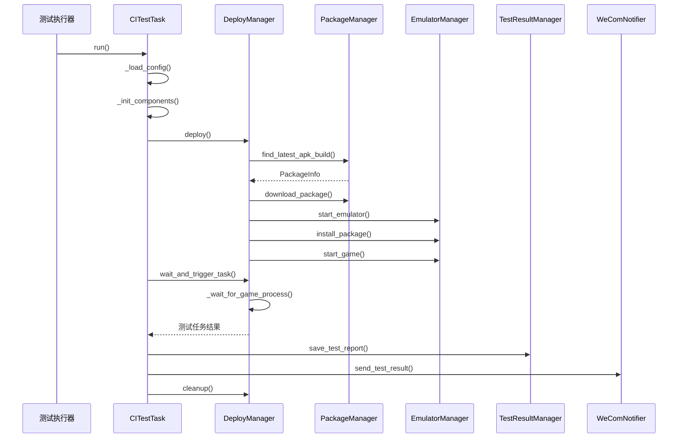

**图表来源**
- [src/task/CITestTask.py:146-273](file://src/task/CITestTask.py#L146-L273)
- [src/ci/deploy_manager.py:123-246](file://src/ci/deploy_manager.py#L123-L246)
- [src/ci/package_manager.py:86-159](file://src/ci/package_manager.py#L86-L159)
- [src/ci/emulator_manager.py:90-158](file://src/ci/emulator_manager.py#L90-L158)

**章节来源**
- [src/task/CITestTask.py:26-145](file://src/task/CITestTask.py#L26-L145)
- [src/ci/deploy_manager.py:38-123](file://src/ci/deploy_manager.py#L38-L123)

## 架构概览

### 系统架构设计

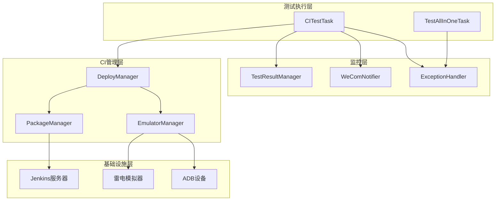

**图表来源**
- [src/task/CITestTask.py:344-380](file://src/task/CITestTask.py#L344-L380)
- [src/ci/deploy_manager.py:101-117](file://src/ci/deploy_manager.py#L101-L117)
- [src/ci/package_manager.py:37-54](file://src/ci/package_manager.py#L37-L54)
- [src/ci/emulator_manager.py:39-57](file://src/ci/emulator_manager.py#L39-L57)

### 数据流架构

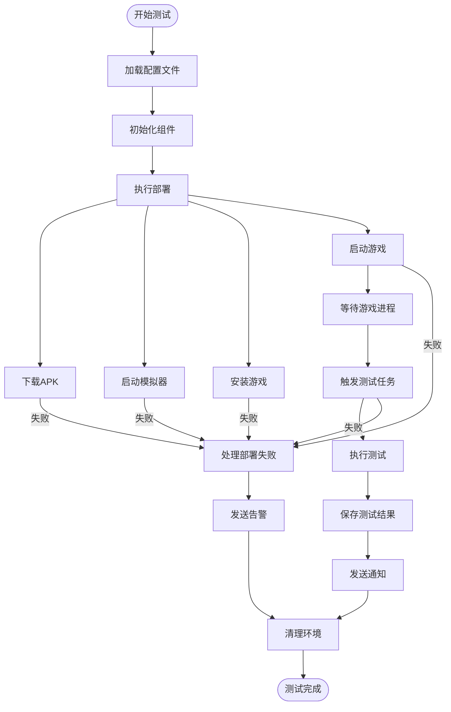

**图表来源**
- [src/task/CITestTask.py:213-273](file://src/task/CITestTask.py#L213-L273)
- [src/ci/deploy_manager.py:123-308](file://src/ci/deploy_manager.py#L123-L308)

**章节来源**
- [src/task/CITestTask.py:146-273](file://src/task/CITestTask.py#L146-L273)
- [src/ci/deploy_manager.py:123-308](file://src/ci/deploy_manager.py#L123-L308)

## 详细组件分析

### 包管理器 (PackageManager)

PackageManager 负责从 Jenkins 服务器获取最新的 APK 构建：

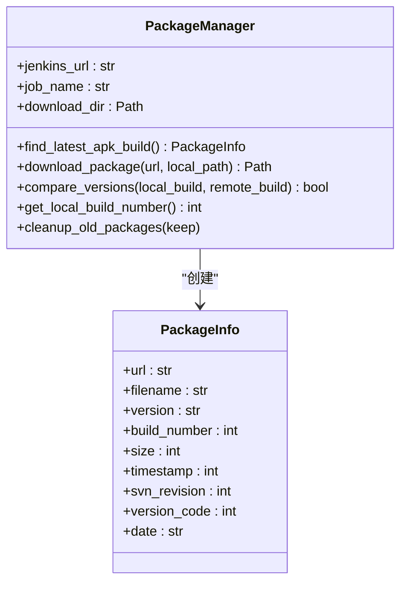

**图表来源**
- [src/ci/package_manager.py:37-380](file://src/ci/package_manager.py#L37-L380)

#### 包管理策略

包管理器实现了智能的版本控制和下载策略：

1. **构建搜索算法**：从最新构建开始向下遍历，最多搜索指定数量的构建
2. **文件名解析**：智能解析 APK 文件名中的版本信息
3. **版本比较**：基于构建号进行版本比较，避免重复下载
4. **清理策略**：自动清理旧版本 APK 文件

**章节来源**
- [src/ci/package_manager.py:86-380](file://src/ci/package_manager.py#L86-L380)

### 模拟器管理器 (EmulatorManager)

EmulatorManager 提供完整的模拟器生命周期管理：

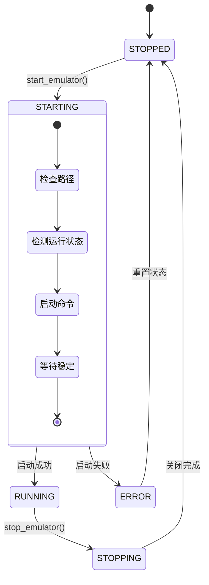

**图表来源**
- [src/ci/emulator_manager.py:90-158](file://src/ci/emulator_manager.py#L90-L158)

#### 模拟器管理特性

1. **多启动方式**：支持通过 ldconsole 或直接启动 dnplayer
2. **状态检测**：双重检测机制确保准确的状态判断
3. **设备刷新**：启动后自动刷新 ok 框架的设备连接
4. **ADB 集成**：深度集成 ADB 工具进行设备管理

**章节来源**
- [src/ci/emulator_manager.py:39-457](file://src/ci/emulator_manager.py#L39-L457)

### 部署管理器 (DeployManager)

DeployManager 是整个 CI 系统的核心协调器：

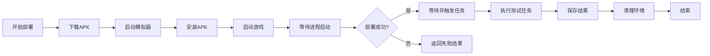

**图表来源**
- [src/ci/deploy_manager.py:123-246](file://src/ci/deploy_manager.py#L123-L246)

#### 部署流程控制

部署管理器实现了严格的流程控制和超时管理：

1. **步骤化部署**：将部署过程分解为明确的步骤
2. **超时控制**：为每个步骤设置合理的超时时间
3. **状态跟踪**：实时跟踪部署状态和进度
4. **错误恢复**：在每个步骤失败时提供详细的错误信息

**章节来源**
- [src/ci/deploy_manager.py:38-428](file://src/ci/deploy_manager.py#L38-L428)

### 测试结果管理器 (TestResultManager)

TestResultManager 提供完整的测试结果存储和分析功能：

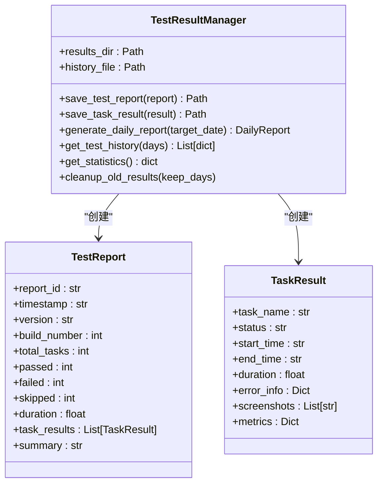

**图表来源**
- [src/ci/test_result_manager.py:73-327](file://src/ci/test_result_manager.py#L73-L327)

#### 结果管理策略

1. **层次化存储**：按日期和时间组织测试结果文件
2. **历史记录**：维护完整的测试历史和统计信息
3. **自动清理**：定期清理过期的测试数据
4. **报告生成**：自动生成每日和累计的测试报告

**章节来源**
- [src/ci/test_result_manager.py:73-327](file://src/ci/test_result_manager.py#L73-L327)

### 通知系统 (WeComNotifier)

WeComNotifier 提供企业微信集成的通知功能：

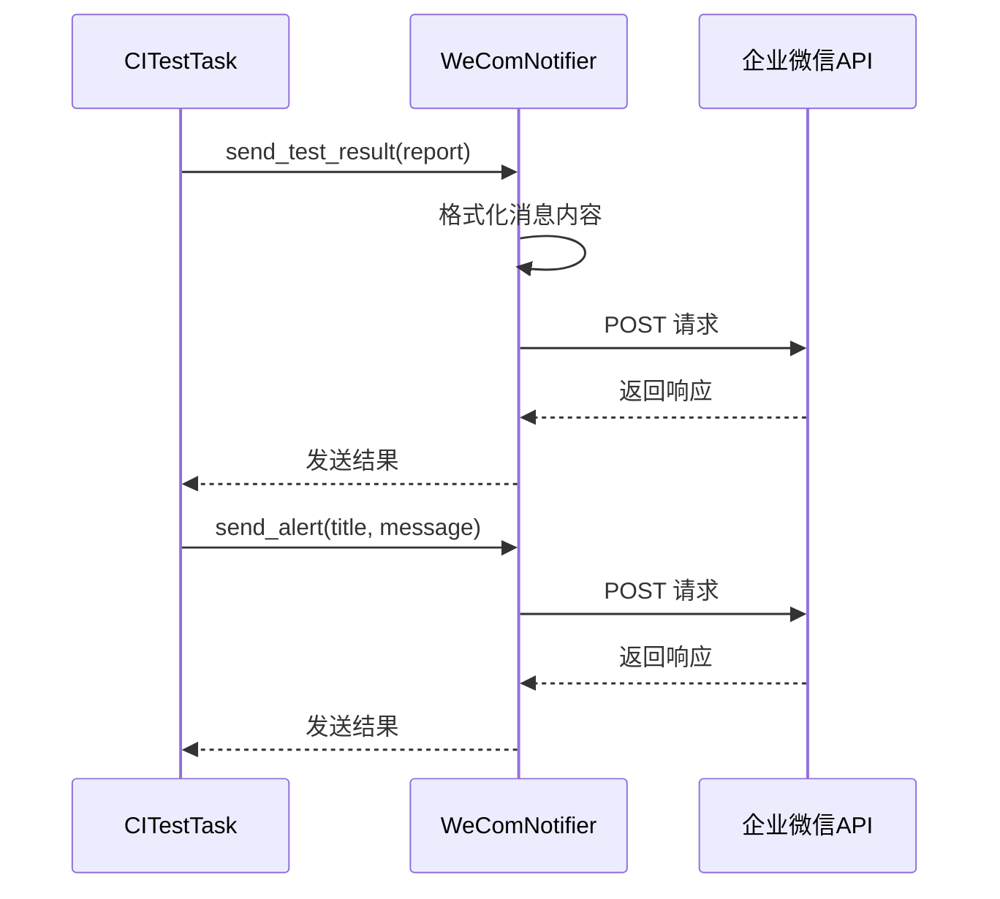

**图表来源**
- [src/ci/notifier/wecom_notifier.py:87-191](file://src/ci/notifier/wecom_notifier.py#L87-L191)

#### 通知功能特性

1. **多种消息类型**：支持测试报告、每日报告和告警通知
2. **Markdown 格式**：提供丰富的消息格式化能力
3. **图片支持**：支持发送测试截图作为附件
4. **重试机制**：网络异常时自动重试发送

**章节来源**
- [src/ci/notifier/wecom_notifier.py:21-288](file://src/ci/notifier/wecom_notifier.py#L21-L288)

### 异常处理系统

异常处理系统提供了智能的错误检测和恢复机制：

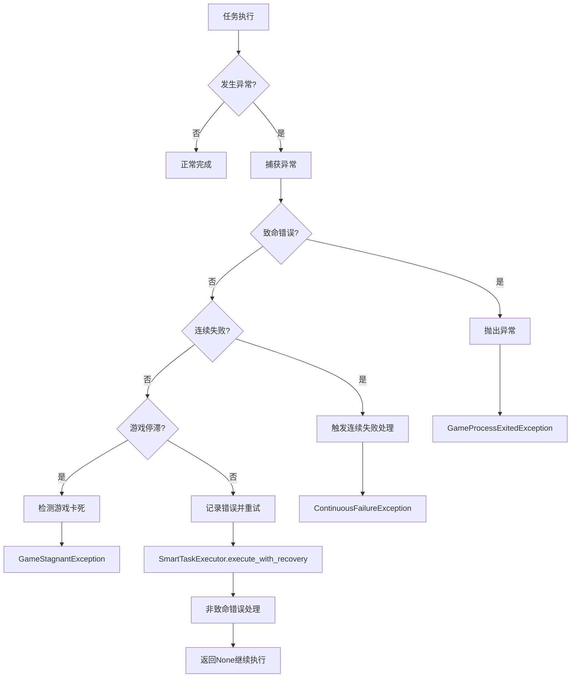

**图表来源**
- [src/ci/exception_handler.py:165-329](file://src/ci/exception_handler.py#L165-L329)

#### 异常处理策略

1. **智能分类**：区分致命错误和非致命错误
2. **连续失败检测**：防止无限重试循环
3. **游戏状态监控**：检测游戏卡死情况
4. **错误恢复**：提供多种恢复策略

**章节来源**
- [src/ci/exception_handler.py:165-493](file://src/ci/exception_handler.py#L165-L493)

## 依赖关系分析

### 外部依赖

项目依赖于多个外部库和服务：

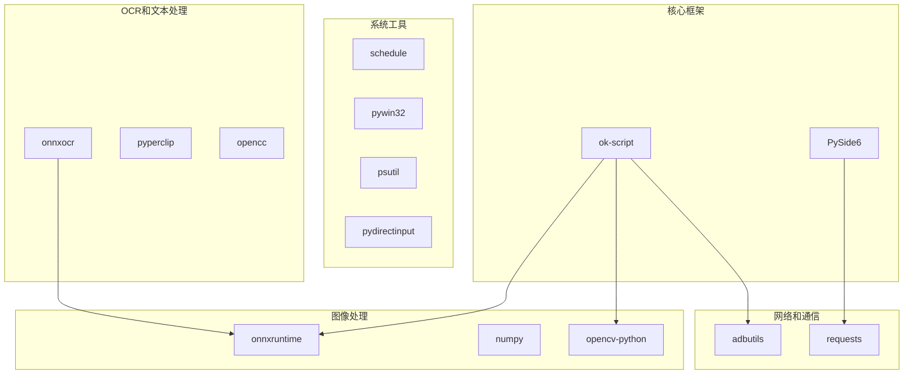

**图表来源**
- [requirements.txt:1-17](file://requirements.txt#L1-L17)

### 内部模块依赖

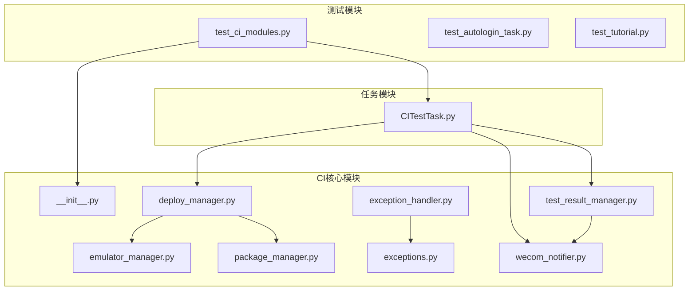

**图表来源**
- [tests/test_ci_modules.py:1-469](file://tests/test_ci_modules.py#L1-L469)
- [src/ci/__init__.py:1-64](file://src/ci/__init__.py#L1-L64)
- [src/task/CITestTask.py:1-1036](file://src/task/CITestTask.py#L1-L1036)

**章节来源**
- [requirements.txt:1-17](file://requirements.txt#L1-L17)
- [src/ci/__init__.py:1-64](file://src/ci/__init__.py#L1-L64)

## 性能考虑

### 性能优化策略

1. **异步处理**：使用异步模式处理网络请求和文件操作
2. **资源池管理**：合理管理模拟器和设备资源
3. **缓存机制**：缓存常用的数据和配置信息
4. **内存管理**：及时释放图像和模型资源

### 资源使用监控

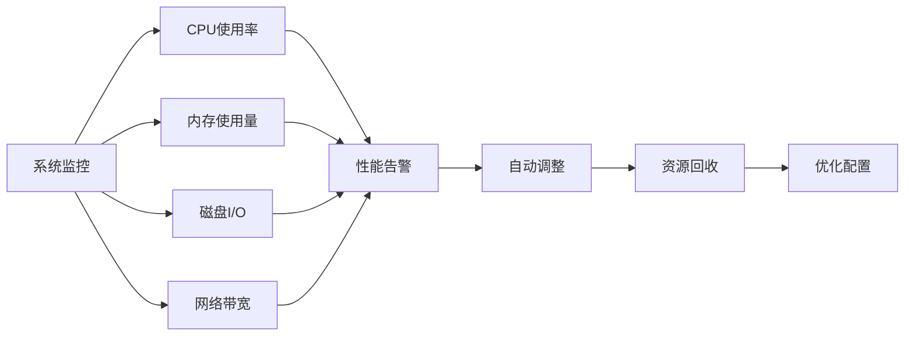

## 故障排除指南

### 常见问题诊断

#### 模拟器启动失败

**症状**：模拟器启动超时或无法连接

**诊断步骤**：
1. 检查模拟器路径配置
2. 验证 ADB 端口可用性
3. 确认防火墙设置
4. 检查系统资源

**解决方案**：
- 重启模拟器服务
- 调整启动超时时间
- 检查端口冲突

#### APK 下载失败

**症状**：Jenkins 连接超时或下载中断

**诊断步骤**：
1. 验证 Jenkins 服务器可达性
2. 检查网络连接稳定性
3. 确认认证配置正确
4. 验证磁盘空间充足

**解决方案**：
- 增加重试次数
- 调整下载超时
- 使用代理服务器

#### 游戏进程检测失败

**症状**：无法检测到游戏进程或进程异常退出

**诊断步骤**：
1. 检查游戏包名配置
2. 验证 ADB 连接状态
3. 确认模拟器设备识别
4. 检查游戏安装完整性

**解决方案**：
- 重新安装游戏
- 刷新 ADB 连接
- 检查模拟器配置

### 日志分析

系统提供了详细的日志记录机制：

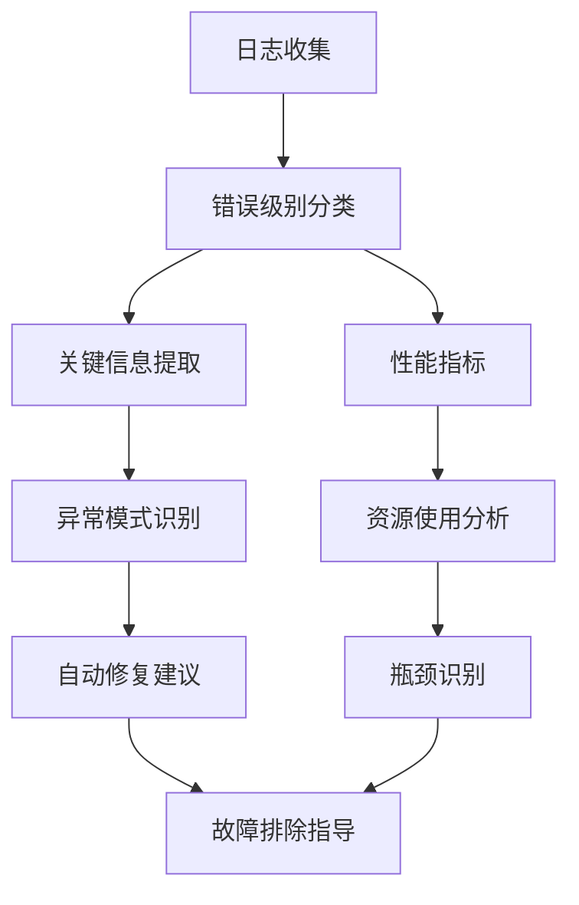

**章节来源**
- [src/ci/exception_handler.py:331-493](file://src/ci/exception_handler.py#L331-L493)

## 结论

ok-jump 项目的集成测试模块是一个设计精良的自动化测试系统，具有以下特点：

1. **模块化设计**：清晰的模块分离和职责划分
2. **完整的生命周期**：从环境准备到结果分析的全流程覆盖
3. **智能异常处理**：提供多种恢复策略和错误检测机制
4. **可扩展性**：易于添加新的测试场景和监控指标
5. **企业级功能**：支持通知集成和报告生成功能

该系统为游戏应用提供了可靠的自动化测试解决方案，能够有效提高测试效率和质量。

## 附录

### 测试配置参考

#### CITestTask 配置文件结构

| 配置项 | 类型 | 默认值 | 描述 |
|--------|------|--------|------|
| Jenkins服务器地址 | 字符串 | http://192.168.9.154:8080 | Jenkins 服务器 URL |
| 模拟器路径 | 字符串 | C:\LDPlayer\LDPlayer9\dnplayer.exe | 雷电模拟器可执行文件路径 |
| ADB端口 | 整数 | 5555 | ADB 连接端口号 |
| 企业微信Webhook | 字符串 | 空 | 企业微信机器人 Webhook URL |
| 失败自动重试 | 布尔值 | True | 是否启用失败自动重试 |
| 重试次数 | 整数 | 3 | 最大重试次数 |
| 重试间隔(秒) | 整数 | 60 | 每次重试间隔时间 |

### 测试环境要求

1. **硬件要求**：至少 8GB RAM，推荐 16GB+
2. **软件要求**：Windows 10/11，Python 3.8+
3. **网络要求**：稳定的互联网连接
4. **存储要求**：至少 50GB 可用空间

### 最佳实践建议

1. **配置管理**：使用配置文件管理环境差异
2. **监控告警**：建立完善的监控和告警机制
3. **数据备份**：定期备份测试数据和配置
4. **性能优化**：根据实际需求调整超时和重试参数
5. **安全考虑**：妥善管理敏感配置信息