# 测试驱动开发技能

<cite>
**本文档引用的文件**
- [README.md](file://README.md)
- [requirements.txt](file://requirements.txt)
- [AutoCombatTask.py](file://src/task/AutoCombatTask.py)
- [skill_controller.py](file://src/combat/skill_controller.py)
- [state_detector.py](file://src/combat/state_detector.py)
- [movement_controller.py](file://src/combat/movement_controller.py)
- [BackgroundManager.py](file://src/utils/BackgroundManager.py)
- [CITestTask.py](file://src/task/CITestTask.py)
- [test_autologin_task.py](file://tests/test_autologin_task.py)
- [test_ci_modules.py](file://tests/test_ci_modules.py)
- [test_tutorial.py](file://tests/test_tutorial.py)
- [test_result_manager.py](file://src/ci/test_result_manager.py)
- [state_machine.py](file://src/tutorial/state_machine.py)
</cite>

## 目录
1. [简介](#简介)
2. [项目结构](#项目结构)
3. [核心组件](#核心组件)
4. [架构概览](#架构概览)
5. [详细组件分析](#详细组件分析)
6. [依赖关系分析](#依赖关系分析)
7. [性能考虑](#性能考虑)
8. [故障排除指南](#故障排除指南)
9. [结论](#结论)

## 简介

这是一个基于Python的自动化测试工具项目，专注于测试驱动开发技能的实践和应用。该项目实现了完整的自动化测试框架，包括：

- **自动战斗系统**：智能战斗辅助功能
- **CI/CD自动化**：完整的持续集成测试流程
- **新手教程自动化**：自动完成游戏新手教程
- **全面的测试套件**：覆盖所有核心功能的单元测试

项目采用模块化设计，具有良好的可扩展性和维护性，为测试驱动开发提供了完整的实践案例。

## 项目结构

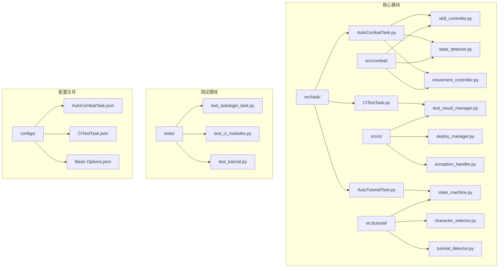

**图表来源**
- [AutoCombatTask.py:1-1366](file://src/task/AutoCombatTask.py#L1-L1366)
- [CITestTask.py:1-1036](file://src/task/CITestTask.py#L1-L1036)
- [skill_controller.py:1-589](file://src/combat/skill_controller.py#L1-L589)
- [state_detector.py:1-589](file://src/combat/state_detector.py#L1-L589)

**章节来源**
- [README.md:1-8](file://README.md#L1-L8)
- [requirements.txt:1-17](file://requirements.txt#L1-L17)

## 核心组件

### 自动战斗任务系统

自动战斗任务是整个系统的核心组件，实现了智能化的战斗辅助功能：

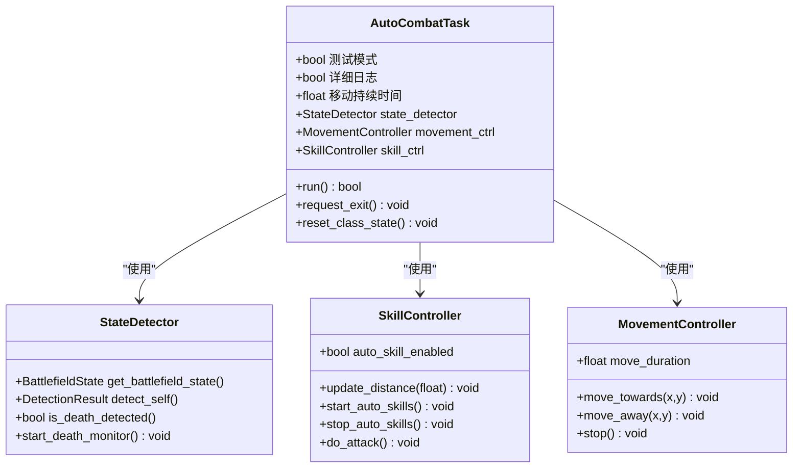

**图表来源**
- [AutoCombatTask.py:35-141](file://src/task/AutoCombatTask.py#L35-L141)
- [state_detector.py:24-57](file://src/combat/state_detector.py#L24-L57)
- [skill_controller.py:82-149](file://src/combat/skill_controller.py#L82-L149)
- [movement_controller.py:24-70](file://src/combat/movement_controller.py#L24-L70)

### CI自动化测试系统

CI测试系统实现了完整的持续集成测试流程：

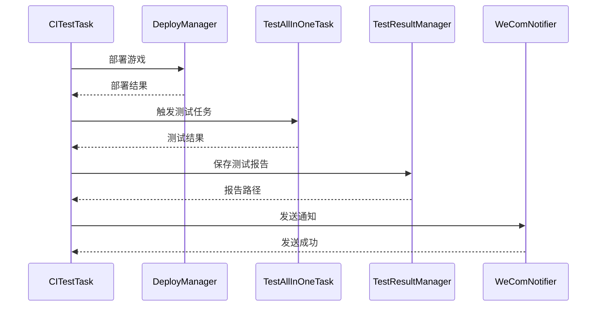

**图表来源**
- [CITestTask.py:146-273](file://src/task/CITestTask.py#L146-L273)
- [test_result_manager.py:73-131](file://src/ci/test_result_manager.py#L73-L131)

**章节来源**
- [AutoCombatTask.py:1-1366](file://src/task/AutoCombatTask.py#L1-L1366)
- [CITestTask.py:1-1036](file://src/task/CITestTask.py#L1-L1036)

## 架构概览

### 系统架构图

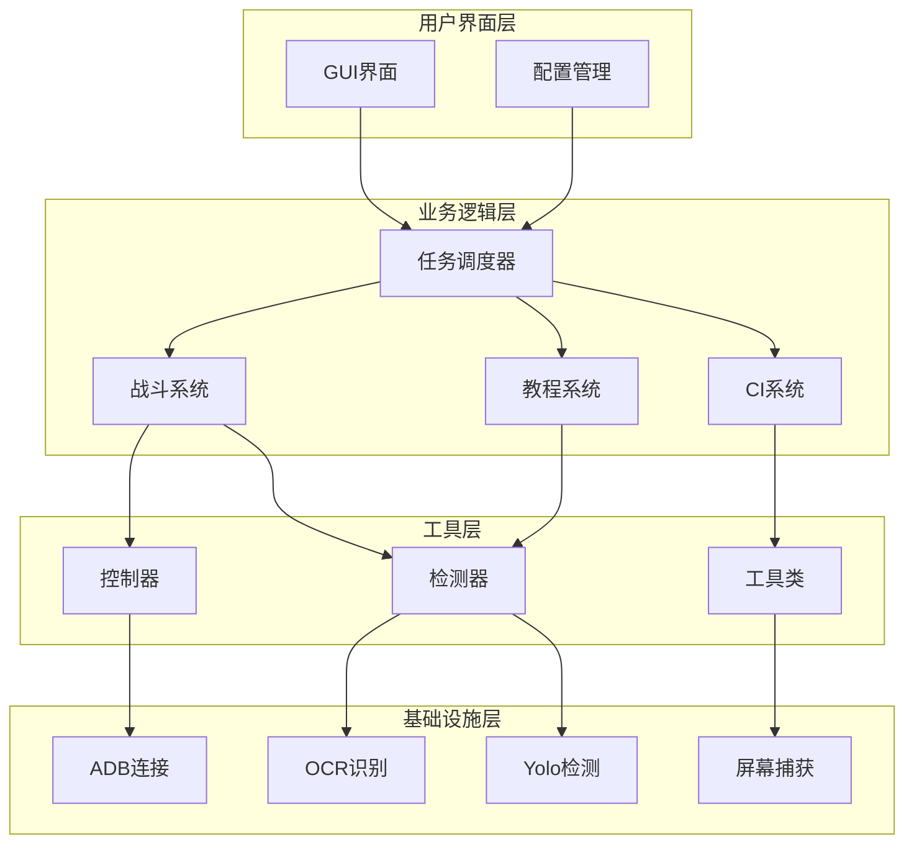

**图表来源**
- [AutoCombatTask.py:1-50](file://src/task/AutoCombatTask.py#L1-L50)
- [CITestTask.py:26-84](file://src/task/CITestTask.py#L26-L84)

### 数据流架构

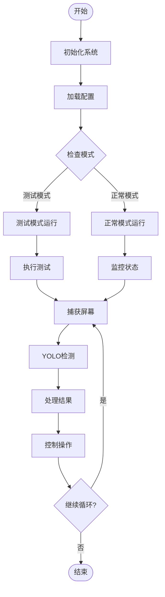

**图表来源**
- [AutoCombatTask.py:199-263](file://src/task/AutoCombatTask.py#L199-L263)
- [state_detector.py:510-553](file://src/combat/state_detector.py#L510-L553)

## 详细组件分析

### 自动战斗系统

#### 战斗状态管理

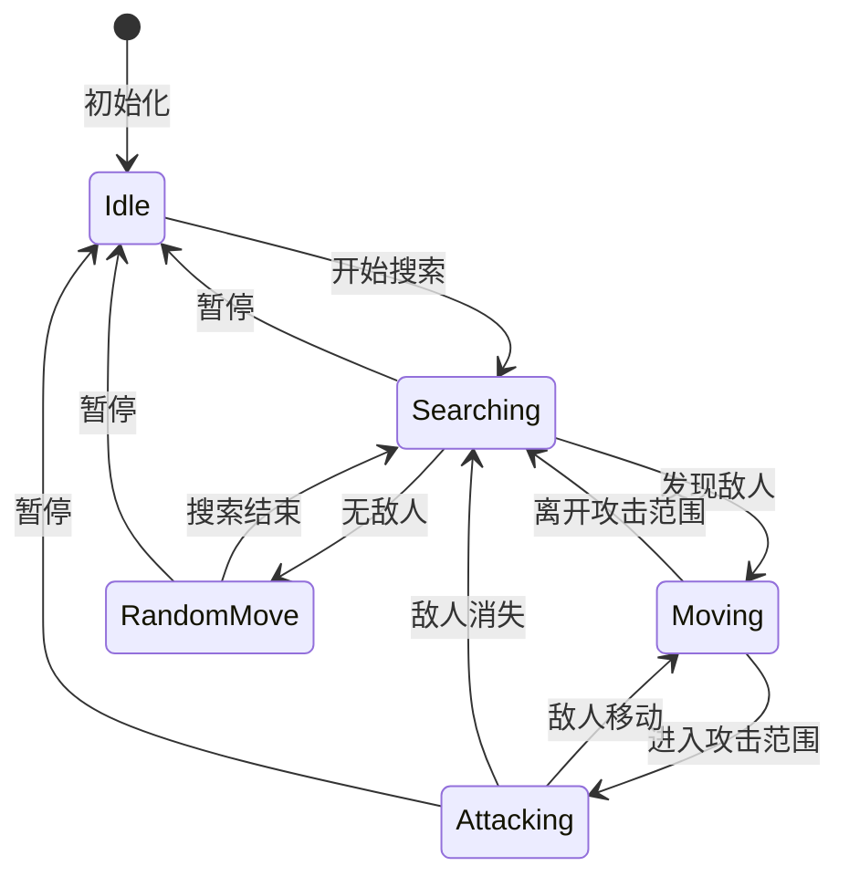

**图表来源**
- [AutoCombatTask.py:690-714](file://src/task/AutoCombatTask.py#L690-L714)

#### 技能控制系统

技能控制器实现了独立的技能监控线程，支持四个技能的独立冷却管理：

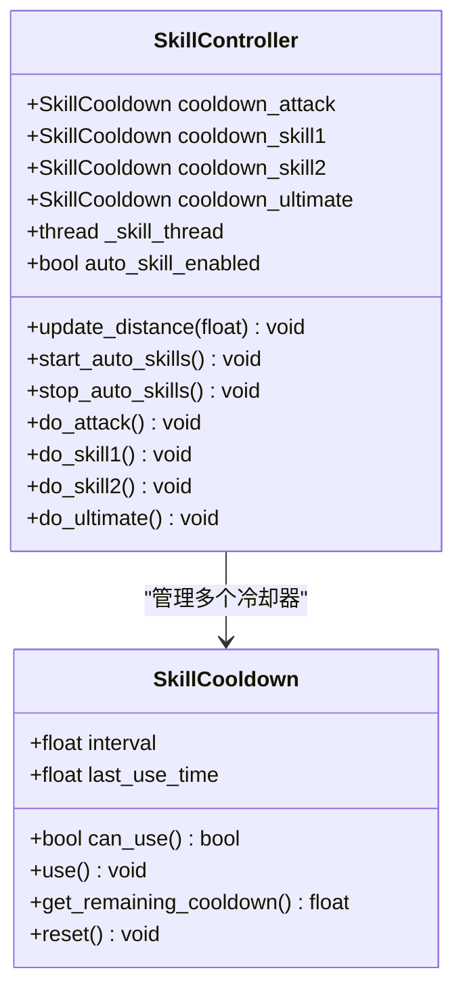

**图表来源**
- [skill_controller.py:29-80](file://src/combat/skill_controller.py#L29-L80)
- [skill_controller.py:82-149](file://src/combat/skill_controller.py#L82-L149)

**章节来源**
- [skill_controller.py:1-589](file://src/combat/skill_controller.py#L1-L589)

### CI自动化测试系统

#### 测试结果管理系统

测试结果管理器提供了完整的测试结果存储和报告生成功能：

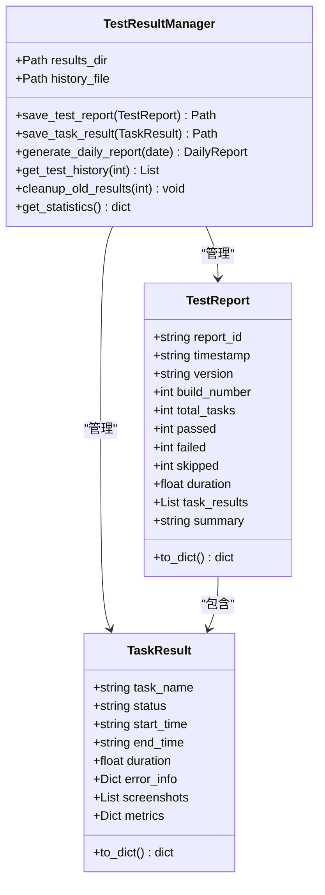

**图表来源**
- [test_result_manager.py:22-58](file://src/ci/test_result_manager.py#L22-L58)
- [test_result_manager.py:73-131](file://src/ci/test_result_manager.py#L73-L131)

**章节来源**
- [test_result_manager.py:1-327](file://src/ci/test_result_manager.py#L1-L327)

### 新手教程系统

#### 状态机设计

新手教程系统采用了状态机模式，实现了清晰的状态转换逻辑：

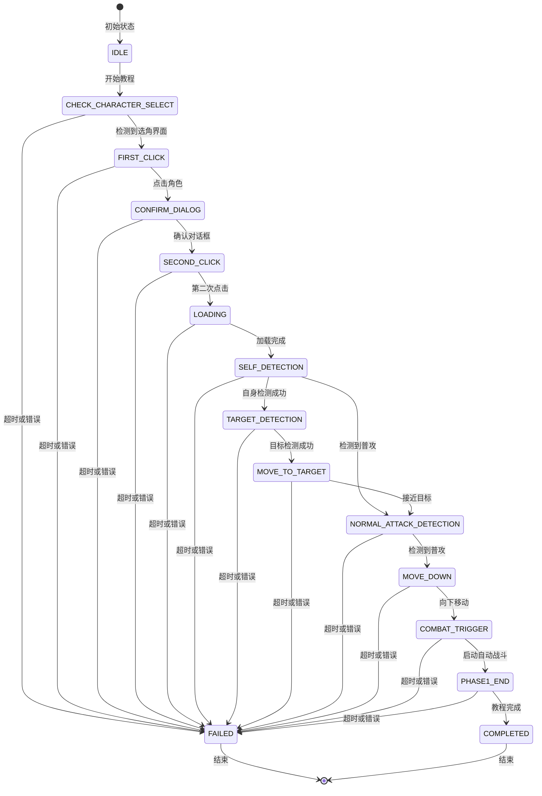

**图表来源**
- [state_machine.py:10-54](file://src/tutorial/state_machine.py#L10-L54)
- [state_machine.py:56-136](file://src/tutorial/state_machine.py#L56-L136)

**章节来源**
- [state_machine.py:1-209](file://src/tutorial/state_machine.py#L1-L209)

## 依赖关系分析

### 核心依赖关系

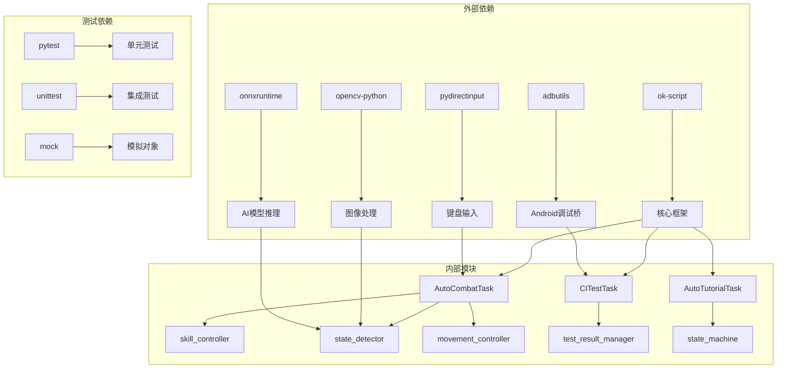

**图表来源**
- [requirements.txt:1-17](file://requirements.txt#L1-L17)
- [AutoCombatTask.py:16-32](file://src/task/AutoCombatTask.py#L16-L32)
- [CITestTask.py:7-21](file://src/task/CITestTask.py#L7-L21)

### 测试覆盖率分析

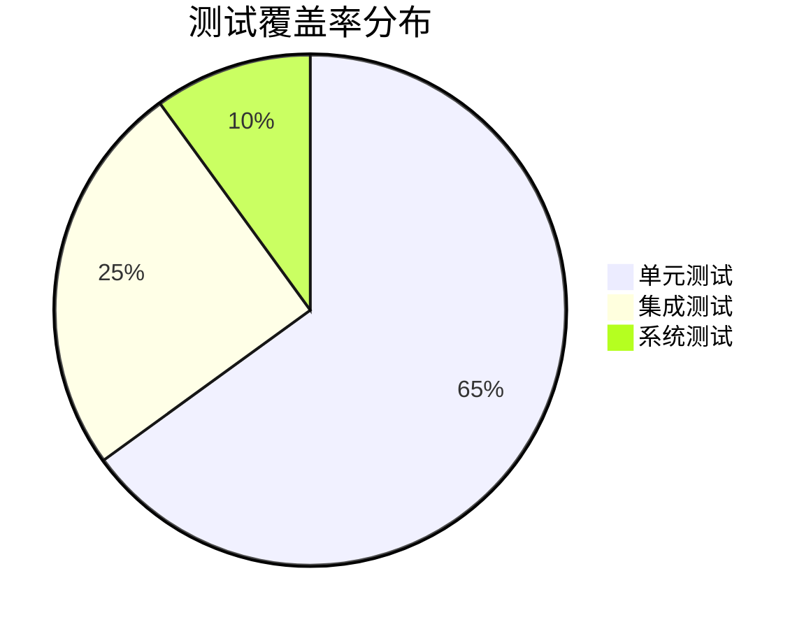

项目提供了全面的测试覆盖，包括：

- **单元测试**：针对单个函数和类的测试
- **集成测试**：测试模块间的交互
- **系统测试**：端到端的功能测试

**章节来源**
- [test_autologin_task.py:1-407](file://tests/test_autologin_task.py#L1-L407)
- [test_ci_modules.py:1-469](file://tests/test_ci_modules.py#L1-L469)
- [test_tutorial.py:1-1022](file://tests/test_tutorial.py#L1-L1022)

## 性能考虑

### 性能优化策略

1. **异步处理**：使用多线程处理独立的任务
2. **缓存机制**：缓存检测结果和配置信息
3. **资源管理**：及时释放内存和系统资源
4. **算法优化**：使用高效的图像处理和AI推理

### 性能监控指标

- **检测频率**：YOLO检测每秒处理帧数
- **响应时间**：从检测到执行动作的延迟
- **内存使用**：系统内存和GPU内存使用情况
- **CPU利用率**：多线程并发处理效率

## 故障排除指南

### 常见问题及解决方案

#### 模拟器连接问题

**问题描述**：无法连接到模拟器或设备离线

**解决方案**：
1. 检查ADB服务是否启动
2. 验证模拟器路径配置正确
3. 重启ADB服务
4. 检查防火墙设置

#### AI检测失败

**问题描述**：YOLO检测无法识别目标

**解决方案**：
1. 调整检测阈值
2. 检查图像质量
3. 更新ONNX模型
4. 验证训练数据质量

#### 技能释放异常

**问题描述**：技能按键无法正常触发

**解决方案**：
1. 检查键盘映射配置
2. 验证后台输入权限
3. 测试不同输入模式
4. 检查游戏窗口焦点

**章节来源**
- [CITestTask.py:628-646](file://src/task/CITestTask.py#L628-L646)
- [BackgroundManager.py:101-121](file://src/utils/BackgroundManager.py#L101-L121)

## 结论

本项目展示了测试驱动开发的完整实践，通过以下方面体现了高质量的软件工程实践：

1. **模块化设计**：清晰的组件分离和职责划分
2. **全面测试**：多层次的测试策略确保代码质量
3. **自动化流程**：从开发到部署的完整自动化
4. **性能优化**：高效的算法和资源管理
5. **可扩展性**：灵活的架构支持功能扩展

该项目为测试驱动开发提供了优秀的参考案例，展示了如何在实际项目中应用TDD原则，包括测试先行、持续集成和自动化测试等最佳实践。

通过深入学习和实践这些技能，开发者可以显著提高代码质量和开发效率，建立更加可靠和可维护的软件系统。