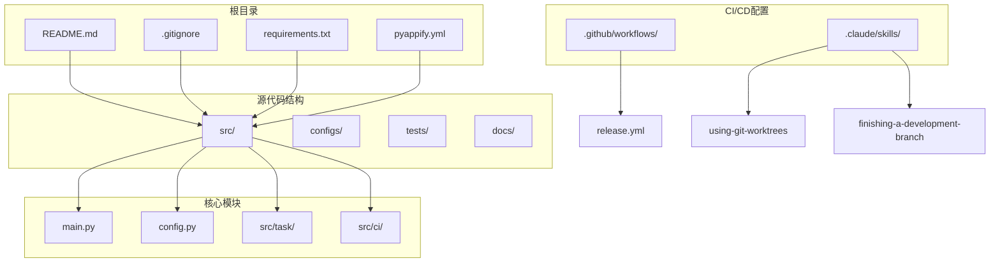
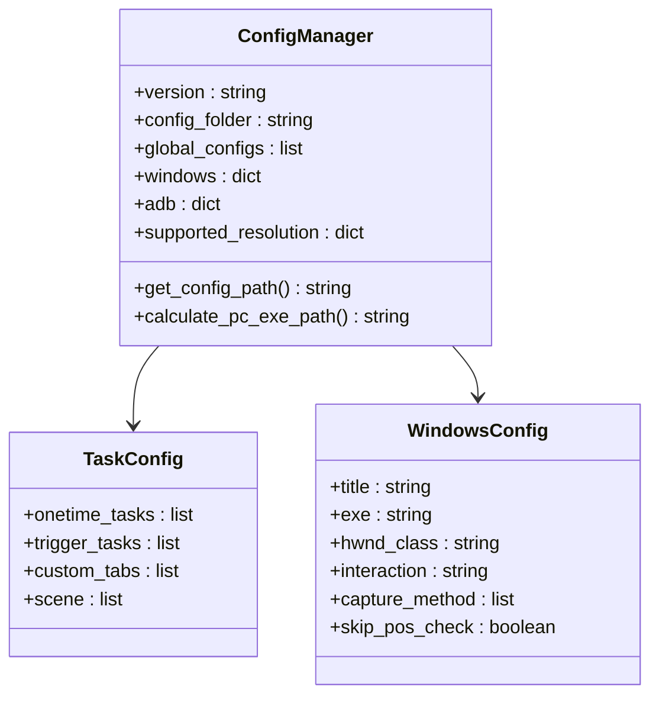
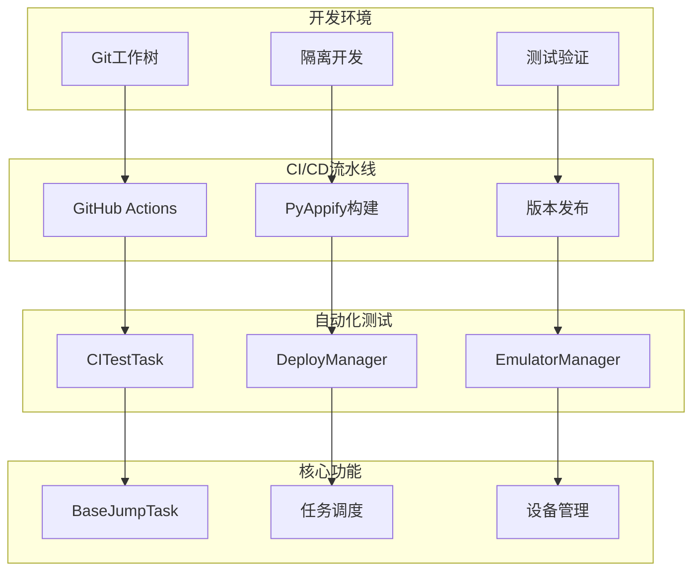
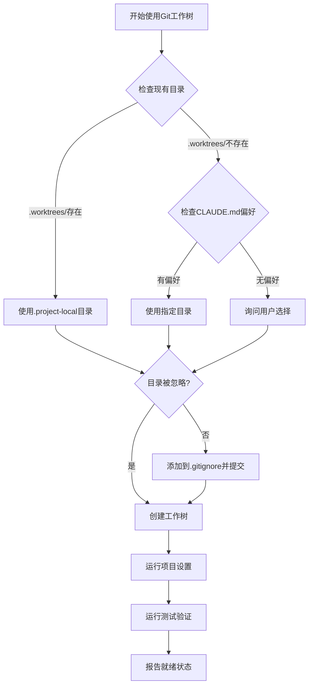
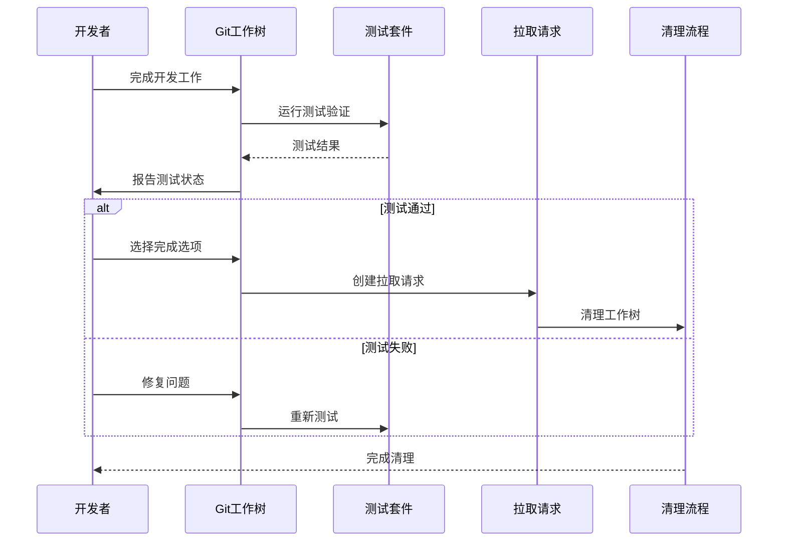
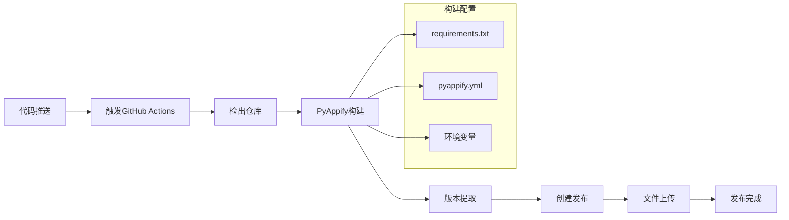
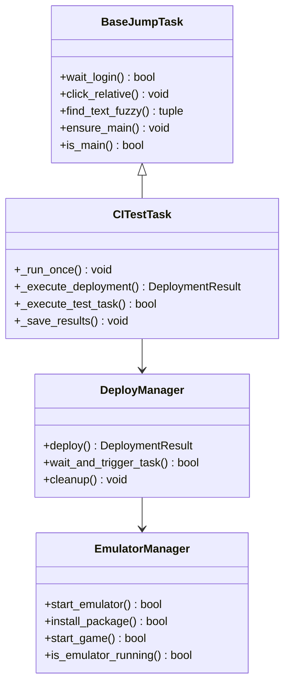
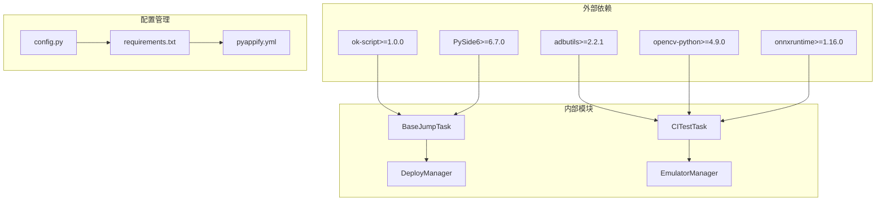

# 版本控制技能

<cite>
**本文档引用的文件**
- [README.md](file://README.md)
- [.gitignore](file://.gitignore)
- [config.py](file://config.py)
- [main.py](file://main.py)
- [requirements.txt](file://requirements.txt)
- [pyappify.yml](file://pyappify.yml)
- [.github/workflows/release.yml](file://.github/workflows/release.yml)
- [src/task/BaseJumpTask.py](file://src/task/BaseJumpTask.py)
- [src/task/CITestTask.py](file://src/task/CITestTask.py)
- [src/ci/deploy_manager.py](file://src/ci/deploy_manager.py)
- [src/ci/emulator_manager.py](file://src/ci/emulator_manager.py)
- [.claude/skills/using-git-worktrees/SKILL.md](file://.claude/skills/using-git-worktrees/SKILL.md)
- [.claude/skills/finishing-a-development-branch/SKILL.md](file://.claude/skills/finishing-a-development-branch/SKILL.md)
- [.claude/skills/executing-plans/SKILL.md](file://.claude/skills/executing-plans/SKILL.md)
</cite>

## 目录
1. [简介](#简介)
2. [项目结构](#项目结构)
3. [核心组件](#核心组件)
4. [架构概览](#架构概览)
5. [详细组件分析](#详细组件分析)
6. [依赖分析](#依赖分析)
7. [性能考虑](#性能考虑)
8. [故障排除指南](#故障排除指南)
9. [结论](#结论)
10. [附录](#附录)

## 简介

这是一个基于Python的自动化测试工具项目，专注于游戏自动化和CI/CD集成。该项目展示了现代软件开发中的版本控制最佳实践，包括Git工作树的使用、分支管理策略、持续集成流程以及发布管理。

项目采用模块化架构设计，集成了多个版本控制技能，包括使用Git工作树进行隔离开发、完成开发分支的标准化流程，以及完整的CI/CD管道管理。

## 项目结构

**图表来源**
- [README.md](file://README.md)
- [requirements.txt](file://requirements.txt)
- [pyappify.yml](file://pyappify.yml)

**章节来源**
- [README.md](file://README.md)
- [.gitignore](file://.gitignore)
- [requirements.txt](file://requirements.txt)

## 核心组件

### 版本控制基础设施

项目实现了完整的版本控制基础设施，包括：

1. **Git工作树管理**：通过`.claude/skills/using-git-worktrees/SKILL.md`实现隔离开发环境
2. **分支完成流程**：通过`.claude/skills/finishing-a-development-branch/SKILL.md`标准化合并流程
3. **CI/CD管道**：通过`.github/workflows/release.yml`实现自动化构建和发布

### 配置管理系统

**图表来源**
- [config.py](file://config.py)

**章节来源**
- [config.py](file://config.py)

## 架构概览

**图表来源**
- [.github/workflows/release.yml](file://.github/workflows/release.yml)
- [src/task/CITestTask.py](file://src/task/CITestTask.py)
- [src/ci/deploy_manager.py](file://src/ci/deploy_manager.py)
- [src/ci/emulator_manager.py](file://src/ci/emulator_manager.py)

## 详细组件分析

### Git工作树管理技能

**图表来源**
- [.claude/skills/using-git-worktrees/SKILL.md](file://.claude/skills/using-git-worktrees/SKILL.md)

#### 关键特性

1. **目录优先级选择**：`.worktrees/` > `worktrees/` > 用户偏好 > 询问
2. **安全验证**：强制检查目录是否被.gitignore忽略
3. **自动设置**：根据项目类型自动检测和运行设置命令
4. **基线测试**：确保工作树从干净状态开始

**章节来源**
- [.claude/skills/using-git-worktrees/SKILL.md](file://.claude/skills/using-git-worktrees/SKILL.md)

### 开发分支完成技能

**图表来源**
- [.claude/skills/finishing-a-development-branch/SKILL.md](file://.claude/skills/finishing-a-development-branch/SKILL.md)

#### 完成选项

1. **本地合并**：直接合并到基础分支
2. **创建PR**：推送并创建拉取请求
3. **保留分支**：保持分支不变
4. **丢弃工作**：永久删除所有相关更改

**章节来源**
- [.claude/skills/finishing-a-development-branch/SKILL.md](file://.claude/skills/finishing-a-development-branch/SKILL.md)

### CI/CD自动化流水线

**图表来源**
- [.github/workflows/release.yml](file://.github/workflows/release.yml)
- [pyappify.yml](file://pyappify.yml)

#### 构建特性

1. **多配置文件支持**：支持中国镜像加速和调试版本
2. **自动版本管理**：从标签自动提取版本号
3. **文件完整性检查**：确保构建产物完整性
4. **发布自动化**：完整的发布流程管理

**章节来源**
- [.github/workflows/release.yml](file://.github/workflows/release.yml)
- [pyappify.yml](file://pyappify.yml)

### 自动化测试框架

**图表来源**
- [src/task/BaseJumpTask.py](file://src/task/BaseJumpTask.py)
- [src/task/CITestTask.py](file://src/task/CITestTask.py)
- [src/ci/deploy_manager.py](file://src/ci/deploy_manager.py)
- [src/ci/emulator_manager.py](file://src/ci/emulator_manager.py)

#### 测试执行流程

1. **部署阶段**：从Jenkins下载APK并部署到模拟器
2. **启动阶段**：启动游戏进程并等待就绪
3. **测试阶段**：执行自动化测试任务
4. **清理阶段**：清理测试环境和资源

**章节来源**
- [src/task/BaseJumpTask.py](file://src/task/BaseJumpTask.py)
- [src/task/CITestTask.py](file://src/task/CITestTask.py)
- [src/ci/deploy_manager.py](file://src/ci/deploy_manager.py)
- [src/ci/emulator_manager.py](file://src/ci/emulator_manager.py)

## 依赖分析

**图表来源**
- [requirements.txt](file://requirements.txt)
- [config.py](file://config.py)
- [pyappify.yml](file://pyappify.yml)

### 依赖管理策略

1. **版本锁定**：使用精确版本号确保可重现性
2. **兼容性检查**：定期更新以获得安全补丁
3. **模块化设计**：清晰的依赖层次结构
4. **配置驱动**：通过配置文件管理依赖版本

**章节来源**
- [requirements.txt](file://requirements.txt)
- [config.py](file://config.py)

## 性能考虑

### 版本控制性能优化

1. **工作树隔离**：避免主分支污染，提高开发效率
2. **增量构建**：利用Git的增量特性减少不必要的构建
3. **并行测试**：支持多任务并行执行
4. **资源管理**：自动清理模拟器和测试资源

### CI/CD性能优化

1. **缓存策略**：合理使用构建缓存减少重复工作
2. **并行执行**：多任务并行处理提高整体效率
3. **资源复用**：模拟器和设备资源的高效复用
4. **监控指标**：实时监控构建和测试性能

## 故障排除指南

### 常见问题及解决方案

#### Git工作树相关问题

1. **工作树目录冲突**
   - 检查.gitignore配置
   - 确认目录权限
   - 验证工作树状态

2. **测试失败**
   - 检查测试环境配置
   - 验证模拟器状态
   - 查看日志输出

#### CI/CD相关问题

1. **构建失败**
   - 检查依赖版本
   - 验证网络连接
   - 查看构建日志

2. **发布失败**
   - 检查版本标签
   - 验证权限设置
   - 确认文件完整性

**章节来源**
- [.claude/skills/using-git-worktrees/SKILL.md](file://.claude/skills/using-git-worktrees/SKILL.md)
- [.claude/skills/finishing-a-development-branch/SKILL.md](file://.claude/skills/finishing-a-development-branch/SKILL.md)

## 结论

本项目展示了现代软件开发中的版本控制最佳实践，通过Git工作树实现隔离开发，通过标准化的分支完成流程确保代码质量，通过完整的CI/CD管道实现自动化发布。

关键优势包括：
- **开发效率**：隔离的工作环境提高开发速度
- **代码质量**：严格的测试和验证流程
- **发布自动化**：完整的自动化发布流程
- **维护性**：清晰的架构和文档

这些实践为类似项目的版本控制提供了参考模板。

## 附录

### 最佳实践清单

1. **开发阶段**
   - 使用Git工作树进行隔离开发
   - 定期运行测试验证
   - 保持分支清洁

2. **集成阶段**
   - 严格执行代码审查
   - 确保测试覆盖率
   - 验证兼容性

3. **发布阶段**
   - 自动化构建和测试
   - 版本管理规范化
   - 发布文档完善

### 工具推荐

1. **版本控制工具**：Git LFS、Git Hooks
2. **CI/CD工具**：GitHub Actions、Docker
3. **监控工具**：日志分析、性能监控
4. **文档工具**：Markdown、API文档