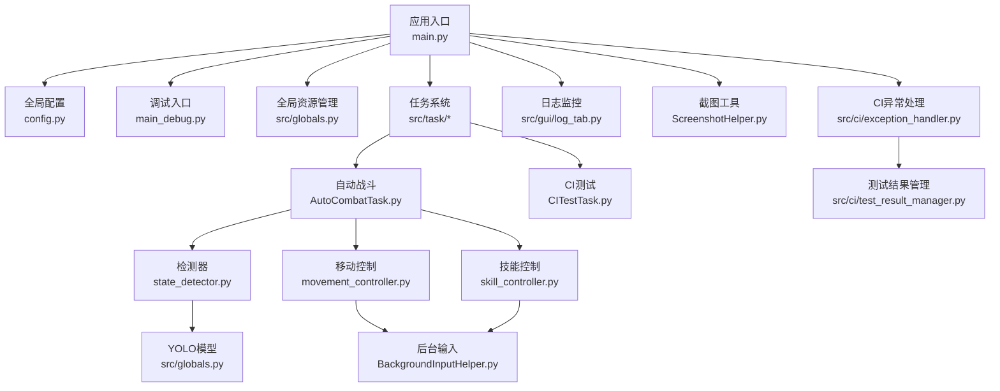
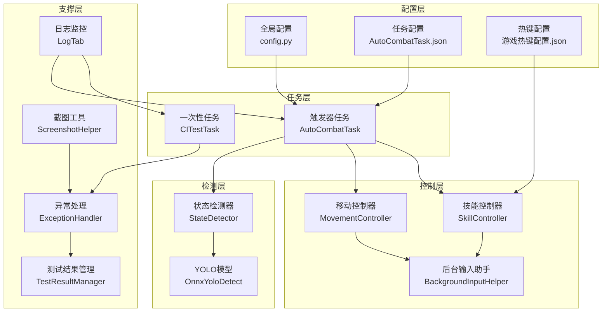
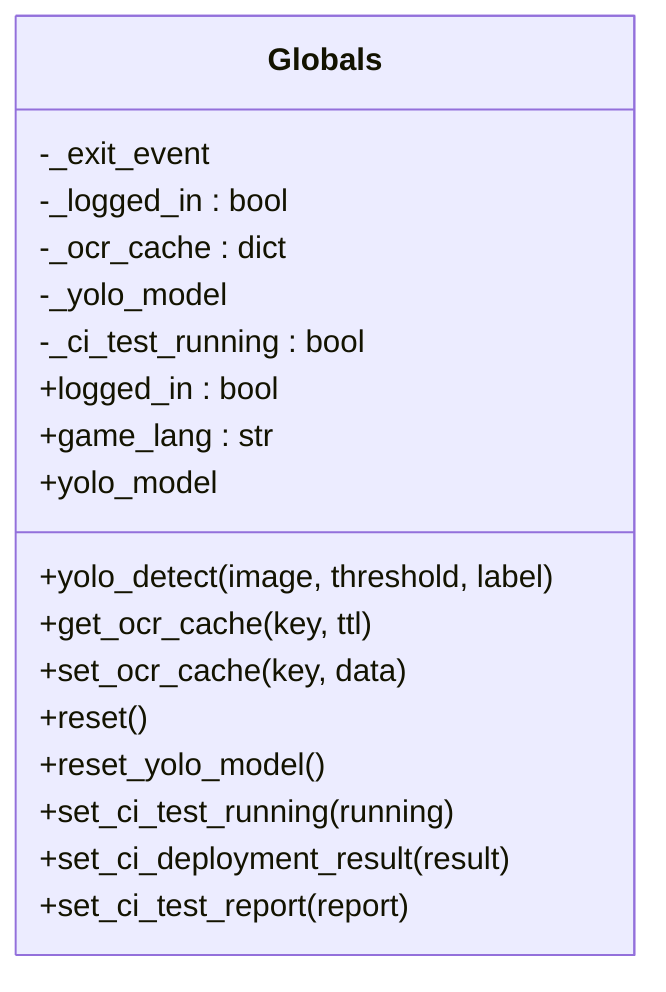
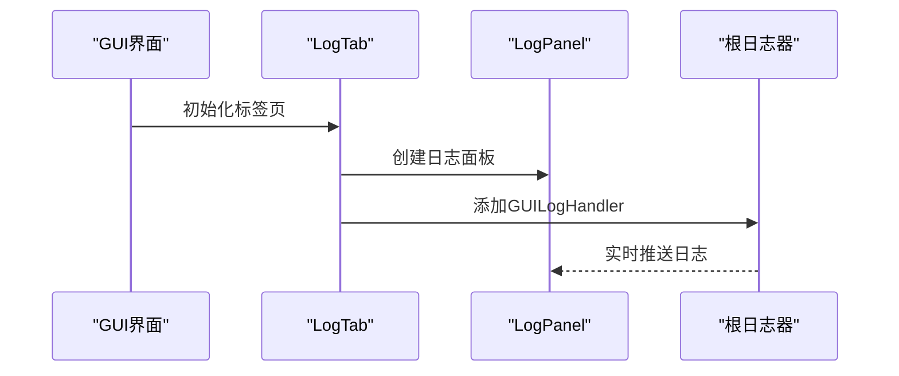
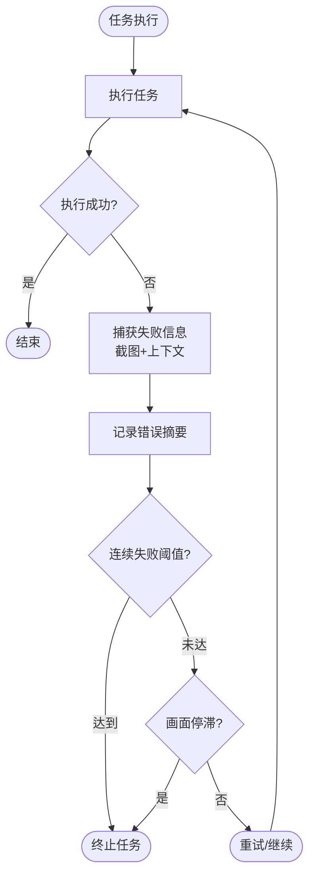
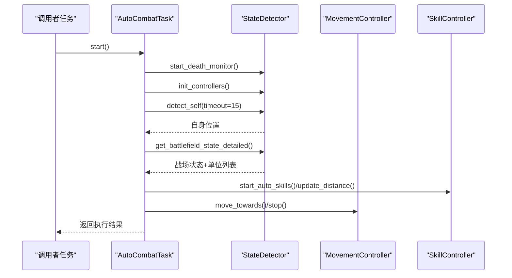
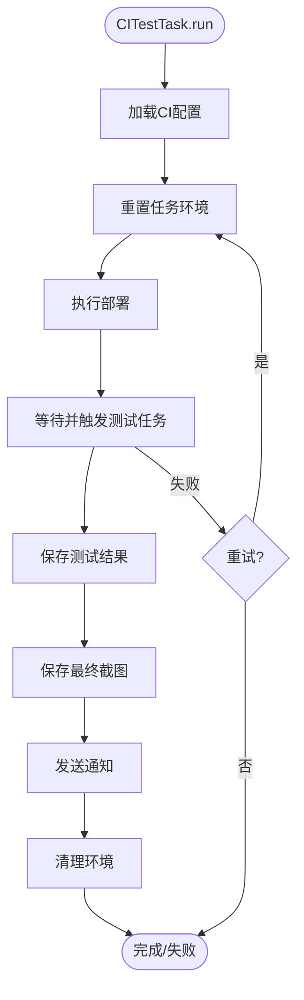
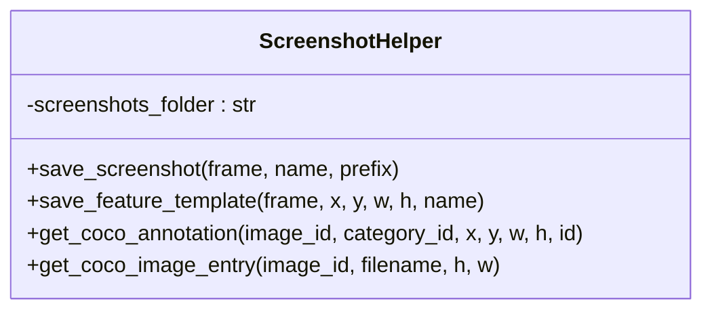
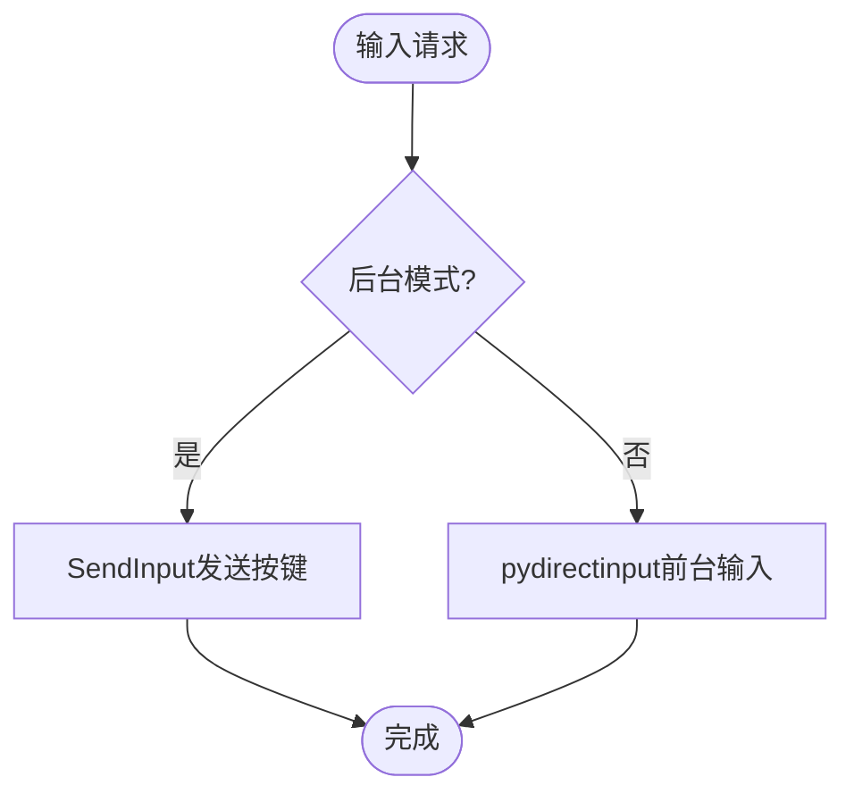
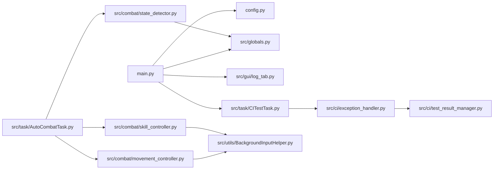

# 系统性调试技能

<cite>
**本文档引用的文件**
- [main.py](file://main.py)
- [main_debug.py](file://main_debug.py)
- [config.py](file://config.py)
- [src/globals.py](file://src/globals.py)
- [src/gui/log_tab.py](file://src/gui/log_tab.py)
- [src/utils/ScreenshotHelper.py](file://src/utils/ScreenshotHelper.py)
- [src/tas/AutoCombatTask.py](file://src/task/AutoCombatTask.py)
- [src/tas/CITestTask.py](file://src/task/CITestTask.py)
- [src/combat/state_detector.py](file://src/combat/state_detector.py)
- [src/combat/movement_controller.py](file://src/combat/movement_controller.py)
- [src/combat/skill_controller.py](file://src/combat/skill_controller.py)
- [src/utils/BackgroundInputHelper.py](file://src/utils/BackgroundInputHelper.py)
- [src/ci/test_result_manager.py](file://src/ci/test_result_manager.py)
- [src/ci/exception_handler.py](file://src/ci/exception_handler.py)
- [src/ci/exceptions.py](file://src/ci/exceptions.py)
- [docs/自动战斗系统流程图.md](file://docs/自动战斗系统流程图.md)
</cite>

## 目录
1. [简介](#简介)
2. [项目结构](#项目结构)
3. [核心组件](#核心组件)
4. [架构总览](#架构总览)
5. [详细组件分析](#详细组件分析)
6. [依赖关系分析](#依赖关系分析)
7. [性能考量](#性能考量)
8. [故障排查指南](#故障排查指南)
9. [结论](#结论)

## 简介
本项目是一个面向游戏自动化的综合调试与测试平台，具备完善的日志监控、异常处理、截图取证、CI流水线集成与后台模式支持等能力。文档围绕“系统性调试技能”主题，系统梳理项目的调试架构、关键组件、数据流与处理逻辑，并提供可视化图表帮助读者快速定位问题、制定修复策略。

## 项目结构
项目采用模块化分层设计：
- 应用入口与配置层：入口脚本、全局配置、调试模式入口
- 任务与触发层：自动战斗、登录、匹配、日常等任务，以及触发器模式
- 检测与控制层：YOLO检测、状态检测、移动与技能控制
- 工具与支撑层：后台输入、截图、日志、CI异常处理
- GUI与监控层：日志面板、实时监控、通知

**图表来源**
- [main.py:1-693](file://main.py#L1-L693)
- [config.py:1-146](file://config.py#L1-L146)
- [src/globals.py:1-406](file://src/globals.py#L1-L406)
- [src/task/AutoCombatTask.py:1-800](file://src/task/AutoCombatTask.py#L1-L800)
- [src/task/CITestTask.py:1-800](file://src/task/CITestTask.py#L1-L800)
- [src/combat/state_detector.py:1-589](file://src/combat/state_detector.py#L1-L589)
- [src/combat/movement_controller.py:1-687](file://src/combat/movement_controller.py#L1-L687)
- [src/combat/skill_controller.py:1-589](file://src/combat/skill_controller.py#L1-L589)
- [src/utils/BackgroundInputHelper.py:1-841](file://src/utils/BackgroundInputHelper.py#L1-L841)
- [src/gui/log_tab.py:1-70](file://src/gui/log_tab.py#L1-L70)
- [src/utils/ScreenshotHelper.py:1-68](file://src/utils/ScreenshotHelper.py#L1-L68)
- [src/ci/exception_handler.py:1-493](file://src/ci/exception_handler.py#L1-L493)
- [src/ci/test_result_manager.py:1-327](file://src/ci/test_result_manager.py#L1-L327)

**章节来源**
- [main.py:1-693](file://main.py#L1-L693)
- [config.py:1-146](file://config.py#L1-L146)

## 核心组件
- 全局资源管理器：集中管理登录状态、OCR缓存、YOLO模型、CI状态等，提供统一访问接口与延迟加载机制
- 日志监控面板：实时展示日志，支持GUI集成与日志级别过滤
- 异常处理与恢复：智能异常捕获、连续失败检测、游戏画面停滞检测、失败截图与报告生成
- 截图取证：统一截图保存接口，支持特征模板提取与标注
- 自动战斗系统：基于YOLO的状态检测、并行死亡监控、智能移动与技能释放
- CI测试流水线：部署、测试、通知、报告生成与定时执行

**章节来源**
- [src/globals.py:1-406](file://src/globals.py#L1-L406)
- [src/gui/log_tab.py:1-70](file://src/gui/log_tab.py#L1-L70)
- [src/ci/exception_handler.py:1-493](file://src/ci/exception_handler.py#L1-L493)
- [src/utils/ScreenshotHelper.py:1-68](file://src/utils/ScreenshotHelper.py#L1-L68)
- [src/task/AutoCombatTask.py:1-800](file://src/task/AutoCombatTask.py#L1-L800)

## 架构总览
系统采用“配置驱动 + 任务触发 + 智能异常处理”的架构：
- 配置层：全局配置、任务配置、热键配置
- 任务层：触发器任务（如自动战斗）、一次性任务（如CI测试）
- 检测层：YOLO模型检测、状态检测器
- 控制层：移动与技能控制器，后台输入助手
- 支撑层：日志、截图、异常处理、CI结果管理

**图表来源**
- [config.py:68-145](file://config.py#L68-L145)
- [src/task/AutoCombatTask.py:143-173](file://src/task/AutoCombatTask.py#L143-L173)
- [src/combat/state_detector.py:24-63](file://src/combat/state_detector.py#L24-L63)
- [src/combat/movement_controller.py:24-52](file://src/combat/movement_controller.py#L24-L52)
- [src/combat/skill_controller.py:82-149](file://src/combat/skill_controller.py#L82-L149)
- [src/utils/BackgroundInputHelper.py:99-137](file://src/utils/BackgroundInputHelper.py#L99-L137)
- [src/gui/log_tab.py:15-69](file://src/gui/log_tab.py#L15-L69)
- [src/utils/ScreenshotHelper.py:7-31](file://src/utils/ScreenshotHelper.py#L7-L31)
- [src/ci/exception_handler.py:331-493](file://src/ci/exception_handler.py#L331-L493)
- [src/ci/test_result_manager.py:73-131](file://src/ci/test_result_manager.py#L73-L131)

## 详细组件分析

### 全局资源管理器（全局状态与资源）
- 登录状态、教程完成状态、CI状态管理
- OCR缓存（带TTL）与Yolo模型（延迟加载与重置）
- 提供统一接口，避免重复初始化与资源泄漏

**图表来源**
- [src/globals.py:16-406](file://src/globals.py#L16-L406)

**章节来源**
- [src/globals.py:16-406](file://src/globals.py#L16-L406)

### 日志监控与GUI集成
- 实时日志面板，支持将日志处理器注入到根日志器
- GUI标签页集成，底部导航位置，便于调试时查看

**图表来源**
- [src/gui/log_tab.py:15-69](file://src/gui/log_tab.py#L15-L69)

**章节来源**
- [src/gui/log_tab.py:15-69](file://src/gui/log_tab.py#L15-L69)

### 异常处理与恢复机制
- 智能异常捕获：包装任务函数，自动保存失败截图与上下文
- 连续失败检测与游戏画面停滞检测
- 失败报告生成与通知（企业微信）

**图表来源**
- [src/ci/exception_handler.py:331-493](file://src/ci/exception_handler.py#L331-L493)
- [src/ci/exception_handler.py:165-329](file://src/ci/exception_handler.py#L165-L329)
- [src/ci/exceptions.py:1-46](file://src/ci/exceptions.py#L1-L46)

**章节来源**
- [src/ci/exception_handler.py:165-329](file://src/ci/exception_handler.py#L165-L329)
- [src/ci/exception_handler.py:331-493](file://src/ci/exception_handler.py#L331-L493)
- [src/ci/exceptions.py:1-46](file://src/ci/exceptions.py#L1-L46)

### 自动战斗系统（触发器任务）
- 触发器模式：由其他任务调用，支持测试模式与状态感知模式
- 并行死亡监控线程，快速查询死亡状态
- 智能移动与技能释放，基于YOLO检测的战场状态判断

**图表来源**
- [src/task/AutoCombatTask.py:199-263](file://src/task/AutoCombatTask.py#L199-L263)
- [src/combat/state_detector.py:83-196](file://src/combat/state_detector.py#L83-L196)
- [src/combat/movement_controller.py:168-355](file://src/combat/movement_controller.py#L168-L355)
- [src/combat/skill_controller.py:226-355](file://src/combat/skill_controller.py#L226-L355)

**章节来源**
- [src/task/AutoCombatTask.py:199-263](file://src/task/AutoCombatTask.py#L199-L263)
- [src/combat/state_detector.py:83-196](file://src/combat/state_detector.py#L83-L196)
- [src/combat/movement_controller.py:168-355](file://src/combat/movement_controller.py#L168-L355)
- [src/combat/skill_controller.py:226-355](file://src/combat/skill_controller.py#L226-L355)

### CI测试流水线
- 部署、测试、通知、报告生成与定时执行
- 环境重置与状态隔离，确保多次执行一致性
- 失败自动重试与最终截图保存

**图表来源**
- [src/task/CITestTask.py:146-273](file://src/task/CITestTask.py#L146-L273)
- [src/task/CITestTask.py:648-747](file://src/task/CITestTask.py#L648-L747)

**章节来源**
- [src/task/CITestTask.py:146-273](file://src/task/CITestTask.py#L146-L273)
- [src/task/CITestTask.py:648-747](file://src/task/CITestTask.py#L648-L747)

### 截图取证与特征提取
- 统一截图保存接口，支持命名与时间戳
- 特征模板提取与COCO标注辅助

**图表来源**
- [src/utils/ScreenshotHelper.py:7-68](file://src/utils/ScreenshotHelper.py#L7-L68)

**章节来源**
- [src/utils/ScreenshotHelper.py:7-68](file://src/utils/ScreenshotHelper.py#L7-L68)

### 后台输入与伪最小化
- 支持Unity游戏后台输入（SendInput）
- 伪最小化模式与窗口激活策略
- 自动选择前台/后台输入模式

**图表来源**
- [src/utils/BackgroundInputHelper.py:99-137](file://src/utils/BackgroundInputHelper.py#L99-L137)
- [src/utils/BackgroundInputHelper.py:310-357](file://src/utils/BackgroundInputHelper.py#L310-L357)

**章节来源**
- [src/utils/BackgroundInputHelper.py:99-137](file://src/utils/BackgroundInputHelper.py#L99-L137)
- [src/utils/BackgroundInputHelper.py:310-357](file://src/utils/BackgroundInputHelper.py#L310-L357)

## 依赖关系分析
- 入口脚本依赖全局配置与全局资源管理器
- 任务依赖YOLO检测与后台输入助手
- 异常处理依赖截图工具与测试结果管理
- GUI日志依赖日志面板与根日志器

**图表来源**
- [main.py:1-693](file://main.py#L1-L693)
- [src/task/CITestTask.py:1-800](file://src/task/CITestTask.py#L1-L800)
- [src/ci/exception_handler.py:1-493](file://src/ci/exception_handler.py#L1-L493)
- [src/ci/test_result_manager.py:1-327](file://src/ci/test_result_manager.py#L1-L327)
- [src/task/AutoCombatTask.py:1-800](file://src/task/AutoCombatTask.py#L1-L800)
- [src/combat/state_detector.py:1-589](file://src/combat/state_detector.py#L1-L589)
- [src/combat/movement_controller.py:1-687](file://src/combat/movement_controller.py#L1-L687)
- [src/combat/skill_controller.py:1-589](file://src/combat/skill_controller.py#L1-L589)
- [src/utils/BackgroundInputHelper.py:1-841](file://src/utils/BackgroundInputHelper.py#L1-L841)

**章节来源**
- [main.py:1-693](file://main.py#L1-L693)

## 性能考量
- 死亡监控线程：30ms检测间隔，更快响应状态变化
- 主循环延迟：50ms，平衡响应性与CPU占用
- 后台模式：避免窗口激活带来的性能损耗
- YOLO模型延迟加载与重置，减少内存占用

[本节为通用指导，无需具体文件分析]

## 故障排查指南
- 启动与环境
  - 检查全局配置与设备连接状态
  - 确认后台模式与伪最小化设置
- 日志与截图
  - 使用日志面板查看实时日志
  - 保存失败截图与上下文信息
- 异常处理
  - 检查连续失败阈值与游戏画面停滞
  - 查看失败报告与堆栈信息
- 自动战斗
  - 检查YOLO检测结果与帧信息
  - 验证移动与技能释放逻辑
- CI测试
  - 检查部署流程与模拟器连接
  - 查看测试报告与通知状态

**章节来源**
- [src/gui/log_tab.py:15-69](file://src/gui/log_tab.py#L15-L69)
- [src/utils/ScreenshotHelper.py:7-68](file://src/utils/ScreenshotHelper.py#L7-L68)
- [src/ci/exception_handler.py:331-493](file://src/ci/exception_handler.py#L331-L493)
- [src/task/AutoCombatTask.py:660-668](file://src/task/AutoCombatTask.py#L660-L668)
- [src/task/CITestTask.py:505-537](file://src/task/CITestTask.py#L505-L537)

## 结论
本项目通过“配置驱动 + 任务触发 + 智能异常处理”的架构，提供了系统性的调试与测试能力。全局资源管理器、日志监控、异常处理与截图取证构成了完整的调试闭环；自动战斗系统展示了复杂业务场景下的状态检测与控制策略；CI流水线则将调试能力扩展到持续集成环境中。建议在实际使用中结合本文档的流程图与组件分析，建立标准化的调试流程与问题定位方法。