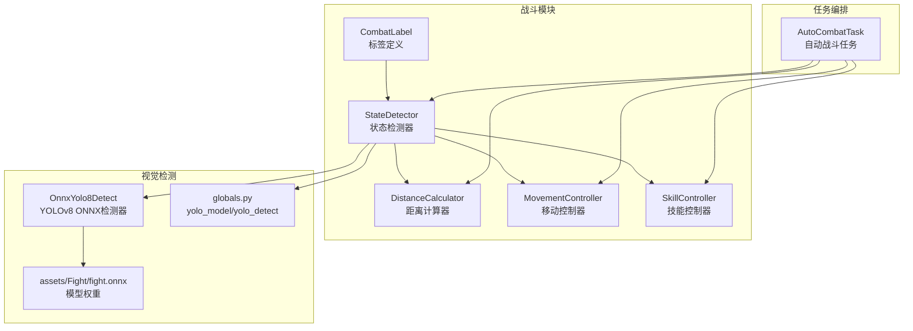
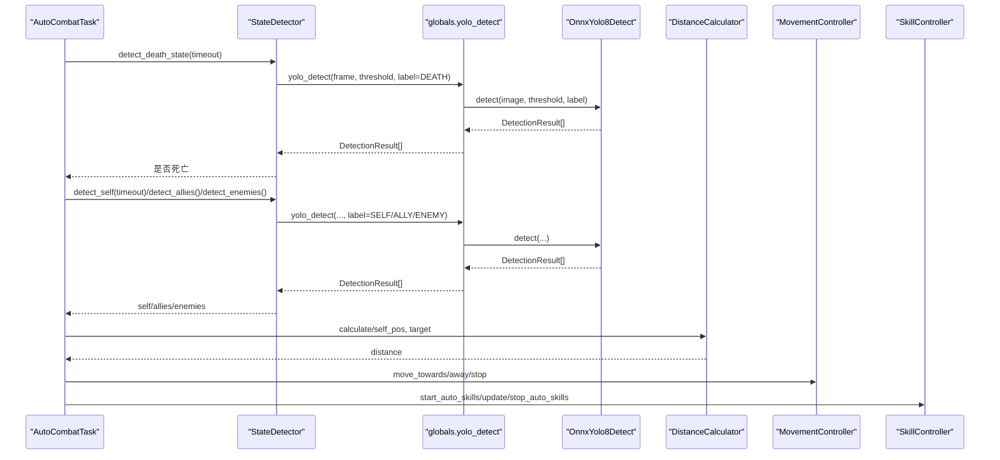
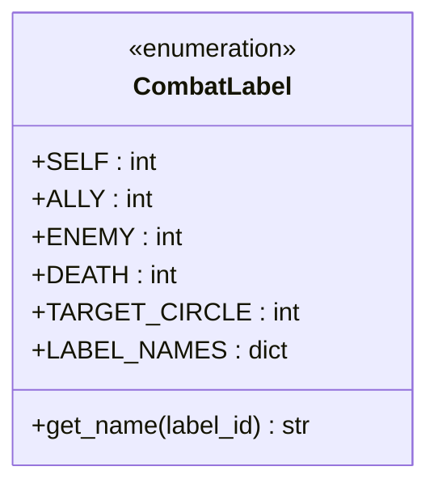
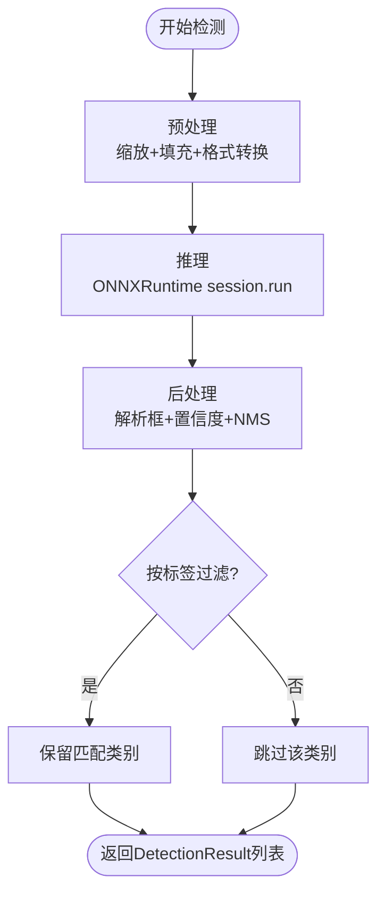
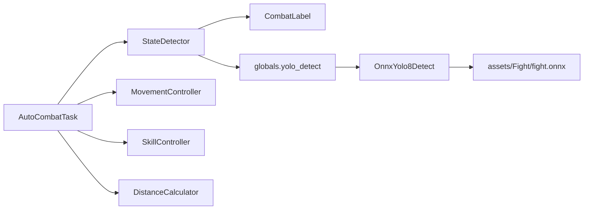

# 战斗标签系统

<cite>
**本文引用的文件**
- [src/combat/labels.py](file://src/combat/labels.py)
- [src/combat/state_detector.py](file://src/combat/state_detector.py)
- [src/combat/distance_calculator.py](file://src/combat/distance_calculator.py)
- [src/combat/movement_controller.py](file://src/combat/movement_controller.py)
- [src/combat/skill_controller.py](file://src/combat/skill_controller.py)
- [src/combat/__init__.py](file://src/combat/__init__.py)
- [src/OnnxYolo8Detect.py](file://src/OnnxYolo8Detect.py)
- [src/globals.py](file://src/globals.py)
- [src/constants/features.py](file://src/constants/features.py)
- [assets/coco_detection.json](file://assets/coco_detection.json)
- [assets/Fight/fight.onnx](file://assets/Fight/fight.onnx)
- [src/task/AutoCombatTask.py](file://src/task/AutoCombatTask.py)
- [configs/AutoCombatTask.json](file://configs/AutoCombatTask.json)
</cite>

## 目录
1. [简介](#简介)
2. [项目结构](#项目结构)
3. [核心组件](#核心组件)
4. [架构总览](#架构总览)
5. [详细组件分析](#详细组件分析)
6. [依赖分析](#依赖分析)
7. [性能考量](#性能考量)
8. [故障排查指南](#故障排查指南)
9. [结论](#结论)
10. [附录](#附录)

## 简介
本文件为“战斗标签系统”的完整参考文档，围绕 CombatLabel 枚举的设计理念、YOLO 模型在战场中的识别原理、标签分类体系、扩展与自定义方法、命名规范与语义化设计、跨平台一致性保障、最佳实践与常见错误规避、以及维护与升级策略进行全面说明。读者无需深入底层即可理解标签系统如何驱动自动战斗流程。

## 项目结构
战斗标签系统位于 src/combat 目录，配合 YOLO 检测器、状态检测器、移动与技能控制器共同构成自动战斗闭环。YOLO 模型权重位于 assets/Fight/fight.onnx，检测器通过全局入口 og.my_app.yolo_detect 提供统一的检测能力。

图表来源
- [src/combat/labels.py:1-51](file://src/combat/labels.py#L1-L51)
- [src/combat/state_detector.py:1-315](file://src/combat/state_detector.py#L1-L315)
- [src/OnnxYolo8Detect.py:1-311](file://src/OnnxYolo8Detect.py#L1-L311)
- [src/globals.py:172-227](file://src/globals.py#L172-L227)
- [assets/Fight/fight.onnx](file://assets/Fight/fight.onnx)
- [src/task/AutoCombatTask.py:1-431](file://src/task/AutoCombatTask.py#L1-L431)

章节来源
- [src/combat/__init__.py:1-22](file://src/combat/__init__.py#L1-L22)
- [src/task/AutoCombatTask.py:1-431](file://src/task/AutoCombatTask.py#L1-L431)

## 核心组件
- CombatLabel：定义 YOLO 模型输出的五类标签（自己、友方、敌军、死亡状态、目标圈），并提供标签名称映射与查询方法。
- StateDetector：基于 YOLO 检测结果，综合判断战场状态（无单位、仅友方、仅敌方、混战），并提供最近单位查找与距离判定。
- OnnxYolo8Detect：封装 ONNXRuntime 推理，负责预处理、推理与后处理（含 NMS），对外暴露 detect 接口。
- globals.py：提供 yolo_model 延迟加载与 yolo_detect 统一封装，确保跨模块一致访问。
- AutoCombatTask：编排自动战斗主循环，串联检测、决策、移动与技能释放。

章节来源
- [src/combat/labels.py:8-51](file://src/combat/labels.py#L8-L51)
- [src/combat/state_detector.py:23-315](file://src/combat/state_detector.py#L23-L315)
- [src/OnnxYolo8Detect.py:17-311](file://src/OnnxYolo8Detect.py#L17-L311)
- [src/globals.py:172-227](file://src/globals.py#L172-L227)
- [src/task/AutoCombatTask.py:25-431](file://src/task/AutoCombatTask.py#L25-L431)

## 架构总览
战斗标签系统以 CombatLabel 为核心，贯穿检测、决策与执行三个阶段：
- 检测阶段：StateDetector 调用 yolo_detect，按 CombatLabel 指定类别过滤，得到 DetectionResult 列表。
- 决策阶段：根据 DetectionResult 计算自身与目标位置，结合 DistanceCalculator 判断最优距离区间，决定移动与技能释放。
- 执行阶段：MovementController 控制移动，SkillController 控制技能释放，形成闭环。

图表来源
- [src/combat/state_detector.py:62-221](file://src/combat/state_detector.py#L62-L221)
- [src/globals.py:200-222](file://src/globals.py#L200-L222)
- [src/OnnxYolo8Detect.py:230-254](file://src/OnnxYolo8Detect.py#L230-L254)
- [src/combat/distance_calculator.py:35-104](file://src/combat/distance_calculator.py#L35-L104)
- [src/combat/movement_controller.py:45-104](file://src/combat/movement_controller.py#L45-L104)
- [src/combat/skill_controller.py:53-103](file://src/combat/skill_controller.py#L53-L103)

## 详细组件分析

### CombatLabel 设计与语义
- 标签语义化：每个标签对应一个明确的战场角色或状态，便于在检测器与决策器中直接使用。
- 数值映射：标签 ID 与 YOLO 模型输出类别一一对应，确保检测结果可直接解析。
- 名称映射：提供中文名称映射与查询方法，便于日志与调试输出。

图表来源
- [src/combat/labels.py:8-51](file://src/combat/labels.py#L8-L51)

章节来源
- [src/combat/labels.py:8-51](file://src/combat/labels.py#L8-L51)

### YOLO 模型与识别原理
- 模型加载：通过 globals.yolo_model 延迟加载 assets/Fight/fight.onnx；若未安装 onnxruntime 将抛出导入错误。
- 推理流程：OnnxYolo8Detect.preprocess 对输入图像进行缩放、填充与格式转换；session.run 执行推理；postprocess 解析输出、NMS 后返回 DetectionResult。
- 标签过滤：yolo_detect 支持按类别过滤（label 参数），StateDetector 通过 CombatLabel 指定具体类别。

图表来源
- [src/OnnxYolo8Detect.py:64-254](file://src/OnnxYolo8Detect.py#L64-L254)
- [src/globals.py:200-222](file://src/globals.py#L200-L222)

章节来源
- [src/OnnxYolo8Detect.py:17-311](file://src/OnnxYolo8Detect.py#L17-L311)
- [src/globals.py:172-227](file://src/globals.py#L172-L227)
- [assets/Fight/fight.onnx](file://assets/Fight/fight.onnx)

### 标签分类体系与使用
- 自身检测（SELF=0）：用于定位玩家角色，作为后续距离与移动的参考。
- 友方检测（ALLY=1）：用于跟随或协同，结合最近单位算法维持队形。
- 敌方检测（ENEMY=2）：用于攻击目标选择与最优距离控制。
- 死亡状态（DEATH=3）：用于战斗暂停与复活等待。
- 目标圈（TARGET_CIRCLE=4）：用于目标选择与辅助瞄准（如需扩展）。

章节来源
- [src/combat/labels.py:15-28](file://src/combat/labels.py#L15-L28)
- [src/combat/state_detector.py:62-221](file://src/combat/state_detector.py#L62-L221)

### 标签扩展机制与自定义添加
- 新增标签步骤
  1) 在 CombatLabel 中新增标签常量与中文名称映射。
  2) 在 OnnxYolo8Detect 的 detect 流程中确保模型输出包含新类别（或在训练数据中加入）。
  3) 在 globals.yolo_detect 中更新注释与过滤参数说明。
  4) 在 AutoCombatTask 或 StateDetector 中按需调用新标签检测。
  5) 更新配置项（如需要）并在 AutoCombatTask.json 中添加对应开关或间隔。
- 注意事项
  - 标签 ID 必须与模型类别顺序一致。
  - 新增标签需同步更新 coco_detection.json 中的 categories（若涉及通用特征标注）。
  - 扩展时保持命名规范与语义化，避免与既有标签冲突。

章节来源
- [src/combat/labels.py:30-51](file://src/combat/labels.py#L30-L51)
- [src/OnnxYolo8Detect.py:230-254](file://src/OnnxYolo8Detect.py#L230-L254)
- [src/globals.py:200-222](file://src/globals.py#L200-L222)
- [src/task/AutoCombatTask.py:39-50](file://src/task/AutoCombatTask.py#L39-L50)
- [assets/coco_detection.json:88-243](file://assets/coco_detection.json#L88-L243)

### 标签命名规范与跨平台一致性
- 命名规范
  - 使用英文大写常量命名（如 SELF、ALLY、ENEMY、DEATH、TARGET_CIRCLE）。
  - 标签名映射采用中文，便于日志与可视化。
- 跨平台一致性
  - YOLO 模型权重固定于 assets/Fight/fight.onnx，确保不同平台一致推理。
  - globals.yolo_model 延迟加载与错误处理保证环境差异下的稳定性。
  - AutoCombatTask 的配置项集中于 AutoCombatTask.json，便于跨设备迁移。

章节来源
- [src/combat/labels.py:15-37](file://src/combat/labels.py#L15-L37)
- [src/globals.py:172-198](file://src/globals.py#L172-L198)
- [configs/AutoCombatTask.json:1-13](file://configs/AutoCombatTask.json#L1-L13)

## 依赖分析
- 模块耦合
  - StateDetector 依赖 CombatLabel、globals.yolo_detect 与 OnnxYolo8Detect。
  - AutoCombatTask 依赖 StateDetector、MovementController、SkillController、DistanceCalculator。
  - globals.yolo_detect 依赖 OnnxYolo8Detect，并持有 fight.onnx 路径。
- 外部依赖
  - onnxruntime：YOLO 推理执行提供者（优先 CUDA，回退 CPU）。
  - OpenCV：图像预处理与后处理（缩放、填充、颜色空间转换）。

图表来源
- [src/task/AutoCombatTask.py:16-22](file://src/task/AutoCombatTask.py#L16-L22)
- [src/combat/state_detector.py:12-12](file://src/combat/state_detector.py#L12-L12)
- [src/globals.py:182-198](file://src/globals.py#L182-L198)
- [src/OnnxYolo8Detect.py:29-53](file://src/OnnxYolo8Detect.py#L29-L53)

章节来源
- [src/combat/__init__.py:7-21](file://src/combat/__init__.py#L7-L21)
- [src/task/AutoCombatTask.py:16-22](file://src/task/AutoCombatTask.py#L16-L22)

## 性能考量
- 检测频率与阈值
  - StateDetector 在多次检测中使用固定阈值与轮询，建议在高帧率场景下调优阈值与轮询间隔，减少误检与漏检。
- 距离计算
  - DistanceCalculator 使用欧氏距离与简单区间判断，复杂度低，适合实时场景。
- 移动与技能释放
  - MovementController 与 SkillController 采用按键/滑动与定时器策略，注意避免频繁按键抖动与冷却冲突。
- 模型性能
  - 优先使用 GPU 执行提供者（CUDAExecutionProvider），若不可用则回退 CPU，确保跨平台可用性。

[本节为通用性能讨论，不直接分析具体文件]

## 故障排查指南
- 模型文件缺失
  - 现象：抛出 FileNotFoundError。
  - 处理：确认 assets/Fight/fight.onnx 存在，或检查项目路径与打包配置。
- onnxruntime 未安装
  - 现象：导入时报错。
  - 处理：安装 onnxruntime（pip install onnxruntime）。
- 检测结果为空
  - 现象：yolo_detect 返回空列表。
  - 处理：检查阈值设置、截图帧有效性、标签过滤参数；确认模型类别与 CombatLabel 一致。
- 自身检测超时
  - 现象：detect_self 超时返回 None。
  - 处理：提高阈值、确认角色可见性、检查分辨率与缩放；必要时启用测试模式快速验证。
- 死亡状态误判
  - 现象：detect_death_state 频繁触发。
  - 处理：调整阈值、增加检测次数、确认目标区域是否稳定。

章节来源
- [src/globals.py:195-196](file://src/globals.py#L195-L196)
- [src/OnnxYolo8Detect.py:38-39](file://src/OnnxYolo8Detect.py#L38-L39)
- [src/combat/state_detector.py:105-152](file://src/combat/state_detector.py#L105-L152)
- [src/task/AutoCombatTask.py:210-215](file://src/task/AutoCombatTask.py#L210-L215)

## 结论
CombatLabel 以简洁明确的五类标签构建了自动战斗的感知基础，结合 YOLO 检测器与多模块协作，实现了从“识别—决策—执行”的闭环。遵循命名规范与扩展流程，可在不破坏现有逻辑的前提下安全地引入新标签与功能，同时通过配置与日志保障跨平台一致性与可观测性。

[本节为总结性内容，不直接分析具体文件]

## 附录

### 标签使用最佳实践
- 明确职责：SELF 仅用于定位，ALLY/ENEMY 用于目标选择，DEATH 用于暂停，TARGET_CIRCLE 用于辅助（如需）。
- 阈值与轮询：根据场景动态调整阈值与检测频率，避免误检与性能开销。
- 距离策略：以 100~200 像素为最优区间，结合最近目标与方向控制移动。
- 技能释放：仅在满足距离条件时启动自动技能，避免无效释放与冷却冲突。

### 常见错误与规避
- 标签 ID 不一致：确保 CombatLabel 与模型类别顺序一致，避免误判。
- 模型未加载：通过 globals.yolo_model 延迟加载，捕获 FileNotFoundError 并提示修复。
- 环境差异：onnxruntime 提供 GPU/CPU 回退，确保在不同硬件上可用。

### 维护与升级策略
- 版本管理：模型权重与标签定义版本化管理，变更时同步更新配置与注释。
- 测试验证：新增标签后在 AutoCombatTask 中启用测试模式进行快速回归。
- 文档同步：更新标签定义、检测流程与配置说明，确保团队知识一致。

章节来源
- [src/combat/labels.py:30-51](file://src/combat/labels.py#L30-L51)
- [src/globals.py:172-227](file://src/globals.py#L172-L227)
- [src/task/AutoCombatTask.py:39-50](file://src/task/AutoCombatTask.py#L39-L50)